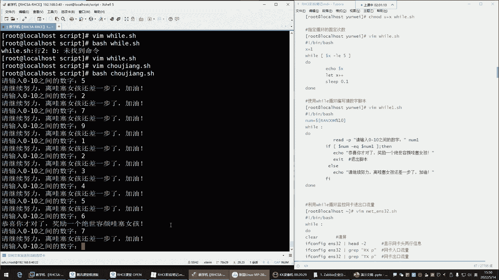
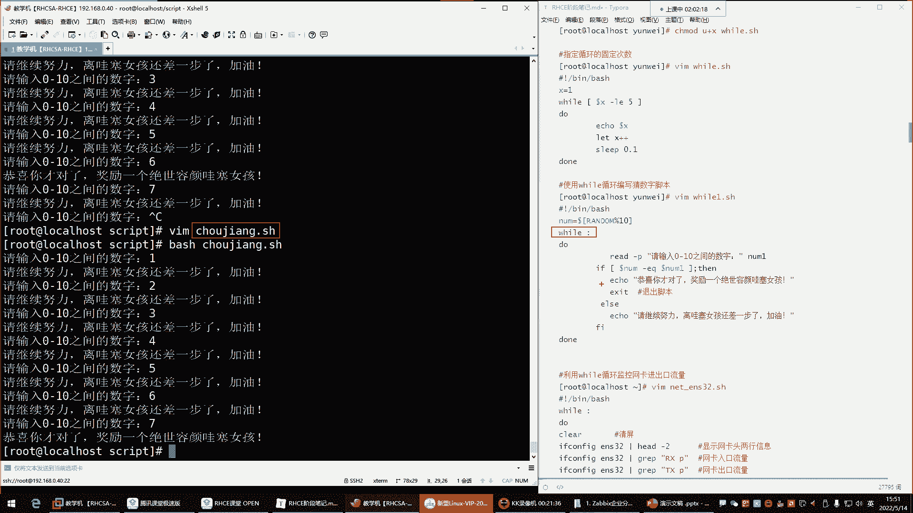

# 【小白入门必备】Linux运维进阶RHCSA+RHCE最全培训教程视频合集 - P44：红帽RHCE-9.while循环 - 洋洋得IE - BV1nN4y1X7Go

好都回来了是吧，回来的话我们继续哈，这个休息时间还是挺挺人性化的是吧，不是人性化啊，嘿嘿嘿嘿，这得注意点错别字，我们在同一课堂啊，我们总总说这种这个是比较裸露的词汇对。

因为容易被同一课堂检测出来哈，啊都回来了是吧，回来给我刷个，一来我们正式开始了哈，10分钟应该休息的都差不多了吧，OK那继续来开始折磨自己，那接下来呢我们就这个来说说下面那个VIVO，这个呢叫做死循环。

他跟我们前面学的那个负循环呢，哎他们干的事都一样的啊，这些就像我们前面所说的，你看看这个衣服if判断跟那个case语句，他们干的事是一样的，是不是啊，只不过就是这case语句啊，他没有if功能强大。

那下面那个for循环跟这个while循环，他们干的事也是一个事，只不过这while循环，它呢跟for循环应用场景不一样，就是对于这个VIVO循环来讲，它呢是只要条件成立，我就重复给你执行去啊。

去去帮你执行这个命令，而前边的那个负循环，我们为什么会称之为它叫死循环，因为它怎么说呢，就像那个拼命令一样，拼那条命令啊，他一旦拼上某一个主机啊，要么呢就是自己把自己拼死，总之他停不下来，能理解吧。

啊那种也就是死循环了啊，拼其实就是死循环，你要是不手动改变它，那我告诉你哈，他是那个什么呢，呃他这个是根本是不会停下来的啊，一直跟你拼这个机器哈哈那for循环不一样，for循环你发现哎我们给它一个数。

比如说254，那他给你干嘛呢，给你执行254次，是不是你给他1万次，他就给你执行1万次，但是他有个头，它有个头哈，他不是没头，而这个呢只要你的条件成立的话，他真的是没头，我来给大家演示一下这玩意儿哈。

我们来编写一个while，点SH好，然后那这玩意儿他怎么用的呢，嗯还在医院跟不上了是吧，没事可以看录屏哈。

相信啊，那接下来我们来看这个死循环啊，这个终端用不到了哈。

用不到了，啊Q有杠P选项吗，有有有杠P选项。

杠P是指定pad杠P可以哈，然后接下来呢我们来看看这玩意儿怎么玩儿，它的语法格式是这样子的，语法结构will，然后呢后面你给他一个条件好，接下来呢条件成立了，他就给你执行do跟当你的语句能理了吧。

four呢是这样子的，你看啊for然后给个变量名是啊，然后呢in后面给值，比如一，然然然后接下来呢do给你执行do跟道理的语句，也就是说只要是这个变量里面，只要是这个变量里面有值。

那他就给你执行你的语句，而这个呢是只要条件成立，也就是说它的循环是来自于条件，它的循环来自于什么呢，来自于具体的值，能理解吧啊他们这个获取的就是我，你想让我帮你执行命令。

唉我的获取就是我的条件是不一样的，我需要一个条件判断，我需要的是具体的变量的名字啊，或者说具体的值都行，但这这位置都是变量名，没有没有人会放值啊，都是变量名，值是在后边，那在这里边我们来看一下这玩意儿。

先写个语法哈，will什么条件呢，比如说好一等于一吗，条件啊，Do，当里面的语句echo hello，意思，嗯五麦五是这样写的吧，美女美女是屋吗，应该是这样写的吧，看一眼哈，美女那个词咋拼的呀，啊美女。

啊，这是美女吗。

是吗。

我记得这美女这词儿不是这样拼的呀，美女baby诶，这个可以是吧。

嘿嘿对啊，我记得乌曼是吧，那咱啊对乌曼是女人，那咱别女人了，baby是不是哎，Baby echo，你好，宝贝，保存退出，保存退出哈，然后接下来呢来看一下哈，呵呵回车，你看他现在他现在干嘛呢。

他现在就是在跟你在一直echo呢，在EO，哈喽哈喽，宝贝，那你看他没头啊，你看他停不下来，他一直在一直在干嘛，他在帮你执行你的这里的语句呢，为什么呀，因为你给的条件他一直是成立的，什么条件呢。

就是这一等于一吗，那这个条件成立吗，这个条件一直都成立，一永远都等于一，是不是啊，所以只要条件成立，它就一直给你循环，你发现这玩意儿你CTRLC啊，可以啊，可以结束掉哈，OK那这玩意是不是就给我的感觉。

就是它干嘛用呢，是不是他这个东西呢一般应用场景不一样啊，但是英文的比较少一些啊，有什么说什么死循环一般应用的是比较少，但是呢也也不敢说不用，只不过呢没有for循环应应用的场景比较多一些。

嗯看这个怎么玩啊，你说我能不能让他像复平复循环一样，指定它的循环次数啊也行也可以哈，那在这里边你想让他指定次数，你在下边，你比如说我能不能让他指定执行五次也行，那这时候你上面就不能这样玩了，井号叹号杠。

并且它batch，你来个比如说来个number，数字等于几呢，哎等于一啊，先定一个数字，定好数字之后，我现在呢干嘛呢，哎这样去对数字做什么呢，做比较是每刀number，如果说杠EQ等于多少呢，啊等于一。

那条件就成立了，是不是啊，天成立过EO，然后来试验一下哈，Bt，回车诶，好像不太对劲，你发现啊，他怎么还是什么一直循环下去啊，你看它很快的没了上去了，看到了吗，一直在循环，你看这位置速度很快是吧。

这频率非常快是吧，哼这频率看了吗，我一滑就没了，一滑就顶上去了，好CTRL结束掉哈，为什么会这样子呢。

因为我们这样改的跟没改一样，其实哈哈，你看我虽然说定一个变量了，是不是变量名里的值是一，那我拿变量跟一做对比，那一等于一吗啊，它一等于一啊，是不是啊，它没变化呀，那你怎么样才能。

这个就是让它指定固定的循环次数呢，这时候你V的方法就是你让那个一啊，你把这个数字给他改改，你比如说我让他，我想让他循环五次，那你这样，就是每次啊你得让它变量名不一样啊，首先你跟谁做对比呢。

你跟五做对比R，然后输入五替换啊，把一替换成五哎，一等于五的时候来看一下效果哈，回车诶，没执行啊，他没执行看，再来一遍哈，回车，没执行是吧，为什么呀，为什么没执行呢，因为上来条件失败了，为什么失败呢。

因为你这个变量里的值是一啊，一等于五吗，一不等于五，是不是一是不等于五的，那上来条件不就是条件不就失败了吗，所以怎么办，哎你这样你说一小于等于五的时候，哎你换成一个什么呢。

哎换成LELE是不是小于等于的意思啊，那这里边你看一如果小于等于五，注意啊，是小于等于那一如果说这里的值是一的时候，它是不是小于五条件成立吗，成立是不是啊，哎那如果这个里的值它是那来保存退出，看一下哈。

天成立了哈，回车诶，这不对啊，这怎么又一直在输出，是不是一一直在输出哈，那这个为什么他也不停下来呢，这玩意儿你看我们现在说一小于等于五吗，是小于等于五啊，但是我不想让他一直循环，我就想让他循环五次。

那这时候关键你这一他没变呢，是不是他他一直是一它没变化，那你说它一直小于等于五，那是不是就一直给你输出这里的命令啊，它没变化呀，你得让它变唉，等他不小于等于五的时候，那条件就失败了，是不是。

那就不执行了呗，所以这时候这个一啊他得变一变，你让你想让它执行具体的这个什么呢，具体的这个次数的话，你下面还得来什么呢，哎对它的值给它加一个，这样叫light什么呢，light每刀啊。

其实这个啊这个不这个不用美刀啊，你如果直接往变量里面赋值，不用整不用整，那美刀什么呢，就number干嘛呀，加加啊，或number等于自身加一，number等于自身加一啊，其实就是加加就行了。

不用加一加加就是对自身加一，就像这语法一样，看到吗，就是对自身加一，那它的完整语法是不是就是XX等于X加一，不就对自己进行加一吗，啊那这里边我们给它简写了，就是number加加，那它如果是完整语法。

就是number等于number加一，对自己加一好，那我们用简写也行，那这位置简写的话，你注意哈，那第一次循环这里的值是几啊，是一一跟谁对去做对比，一跟五做对比，一小于等于五吗，条件成立吗。

条件成立是吧，一是小于等于五，好条件成立，给我echo啊，你好宝贝，那接下来呢，那我这里面还有一条命令啊，哎我light number加加，也就是说哎我还要对我的这个变量里的值啊，加个一好。

那加个一以后，那他这里边哎下次再循环的时候，这里面是几呀，下次再学的时候，这里面就不是一了，是不是因为他对自身加一了，那就1+1变成几来变成二了，看到了吗，哎那二小于等于五吗，小于等于五，条件成立。

条件成立，再给我执行是吧，那他又加一了，又对自己加一了啊，那这时候这里的值就不是二了，是几啊，是33了哈啊，那三小于等于五吗，条件成立是吧，条件成立又执行啊，又对自己加一，那接下来啊。

那这里的值又不是三了，又是几又四了啊，这他这边就变成四了，好像四小于等于五吗，小于等于五啊，小于五不等于五，但条件也成立，那是不是又开始执行命令啊，又对自己加一好，那加完以后，他这里面又不是四了。

是几呀，哎是五了是吧，好那五小于等于五吗，五不小于五，但是它等于五，那条件也成立是吧，条件成立是不是又执行命令，又对自己加一，加一以后，他这里的值变成几位啊，变成六，哎那六小于等于五吗，它也不小于五。

它也不等于五条件失败了，条件失败，好不好意思，命令不执行了，唉那这个它会执行几次呢，执行五次，看到了吗，12345是吧，echo5次宝贝，是吧，如果你想让它，你想控制它的循环次数，我们也可以啊。

我们也可以干嘛呢，哎我们也可以去通过什么呢，唉通过这种方法去控制，但是如果你真的是需要指定它的循环次数，那咱们还不如用for循环了，是不是啊，但是你知道可以通过这种方法去控制它。

那接下来呢了解了for循这个VIVO循环，他的一些这个基本的一个套路了，以及它的应它的一些具体的特性，它就是死循环啊，条件成立我就给你执行，条件失败我就不执行啊，他不是说这个你给我一个值，我去帮你执行。

不是我就看条件能理解了吧，就看条件，那么这个东西那看条件的话怎么玩啊，啊下边使用VIVO循环编写一个参数的脚本，这个前面写过是吧，但是我这里面没有了啊，写一个什么呢啊就是比如说抽奖点SH可以吧。

抽奖拼音哈抽奖，然后在里面把上来呢，我们也是哈，如果自己手写的话，上来我们得需要什么呢，需要控制它的这个什么随机数啊，number等于我要取随机数了，每到中括号random random里的值。

我要对谁对十进行取余，把他的猜的数控制在十以内，然后接下来我要循环了，好循环诶，那这冒号是什么呀，这冒泡是吧，这冒号是什么啊，哪里面，你看这个冒号是吧，这很奇怪是吧，来来看一下啊。

先先对这个文件先保存一下，我们干嘛呢，哎来那个while循环那个脚本里面看看这冒号，冒号干嘛用的呢，我们先把这条件给它删掉删掉，然后换个冒号变量不用了，我不要变量了，咱们就看看啊，这个加加也不要了。

因为没有变量了，它也没有必要去对那个变量加一删掉，dd好，我就看VIVO冒号，然后呢do跟down里边是icon命令保存，是啊就他回撤，你看他也一直在echo是吧，你看一直在输出，看到了吗。

速度也很快是吧，结束掉，我们再来编辑这个脚本，哎，will我把这个冒号换成什么呢，RT换成A保存，然后我再执行这个脚本，唉，这不行，看一下啊，他这玩意儿放到逗号那保存，哎也不行，啊再换一个换一个什么呢。

换一个，换一个B，啊也不行，那冒号是啥呀，啊就冒号可以是吧，我告诉你，这冒号是死循环里面的一个固定的特殊符号，干嘛用的呢，就是它可以让你无限的循环里面的命令，你不需要去搞什么条件判断了啊。

什么一一等于一吗，不需要，你如果真的想实现这种死循环，一直帮你去重复执行这些操作的话，而且也没有一个头的话，你用冒号就可以表示死循环就可以了，能列吧啊，这是它的固定语法。

所以我们如果在希望写一个死循环的话，我们抽奖的那个脚本这里边就一直是死循环，无限循环下去，无限循环死循环，那接下来do，然后down里边是命令啊，做个缩进，两个缩进啊，这不行。

这做缩进的话VIVO循环语法不美观了，就这样吧，多跟道理的是语句好，那下边我们这个怎么玩啊，这玩意儿循环是吧，我们现在上面定好了，定好了变量了，那接下来我想去什么呢，实现参数为什么要猜数。

因为我前面写的那个脚本只能猜一次，你们还记得吧，前面猜出那脚本只能猜一次，我现在想让他多猜几次，一直猜下去，那我就可以用死循环让它一直猜好，那这时候read不写了，直接直接粘进来看一下啊，看效果诶。

复制来拿过来来看一下啊，说一下瑞的钢P让用户输入数字是吧，好那我们这个用户的这个number跟什么呢，跟我们的那个变量做对比啊，那我们的这个变量改成大写的，那么啊，如果说用户它输入的值。

跟我们的这个随机数里面产生的值，如果是相等的话，是不是条件成立了呀，没错吧，条件成立IP命令啊，但是这里边不能退出脚本啊，有问题好，那这时候如果失败呢，如果说他输的数没猜对是吧，那条件失败是吧。

条件失败就，否则给我EQ这个啊猜对就讲你个绝世容颜，哇，塞女孩失败了，那就黎巴塞女孩还差一点点是吧，保存退出，接下来来执行抽奖脚本，回车好，数字五没猜对诶，你看没猜对，继续猜是吧，再来一个二回车。

诶还没猜对诶，有有意思了是吧，七还不行，91234567哎。

对了对了，那六的时候对了是吧，猜对了啊，恭喜你猜对了，原来哇塞女孩是在六这个随机数里面啊。

是哇塞女孩是六啊，他的编号是六，哈哈啊，猜对了，但是猜对了还有问题。

什么问题呢，你发现这怎么没结束啊。

是不是啊，怎么还让我继续输入数字啊，因为它是死循环呢。

因为它是唯有循环的啊，你用冒号表示的，它停不下来。

它会一直帮你指引里面的语句的。

他会一直执行，他不停停不下来。

那停不下来怎么办呢，但人家猜对了，你不能让人继续猜啊，是不是CTRLC接收掉。

所以这个时候脚本如果人家一旦猜对了。

就是这个条件成立了，他直接把这个语句我们要干嘛呢，让脚本退出，在这加条命令叫EXIT叫退出摇摆啊，这个的话呢我们加个注释叫退出脚本，后面会讲哈，啊这时候咱们再猜。

好一从一开始来234567哎七。

这次是7万3。

女孩在随机数七里面，那你看我猜对了，他叫什么。

说恭喜你猜对了，然后呢哎这时候就符合逻辑了，退出了。

是不是哎没错，是这样子这样子的哈。

那那个我们后面会讲哈那个X那脚本的退出，所以现在你先知道需要用。

我们需要用到这种死循环脚本。

需要用得到这种死循环的话呢，一般就是唉就是我希望什么呢，条件成立的时候，你帮我执行这个操作，那只要这个条件一直不成立，他不执行，是不是。

那执行以后呢啊你给我再给我退出啊，脚本不要再一直死循环了，这样也可以，比如说在备份领域啊，备份的时候我干嘛呢，我一直在判断一个文件的大小，我通过使用完一直判断一个文件大小好，那我判断这个文件。

比如说这个文件它的大小到达一个G的时候。

你去给我执行一个备份操作，那执行完以后你给我退出。

不要。

啊这种可以啊，这可以。

然后下面这个死循环也可以去写一个什么呢，这是监控网卡流量的一个。

用死循环监控网卡流量，这个的话呢来演示一下嗯，net e n s32点SH，其实这个呢我们嗯你们先看一下这个脚本哈，先看一下，然后呢我把录屏停一下。

我要上个厕所。

