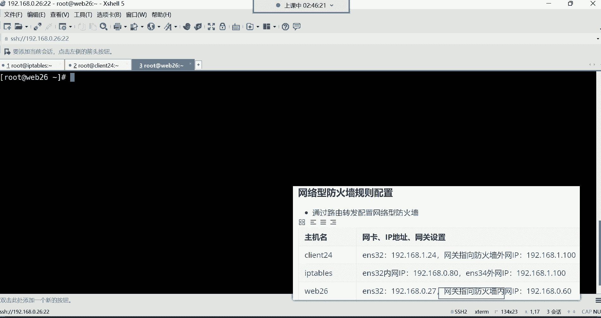
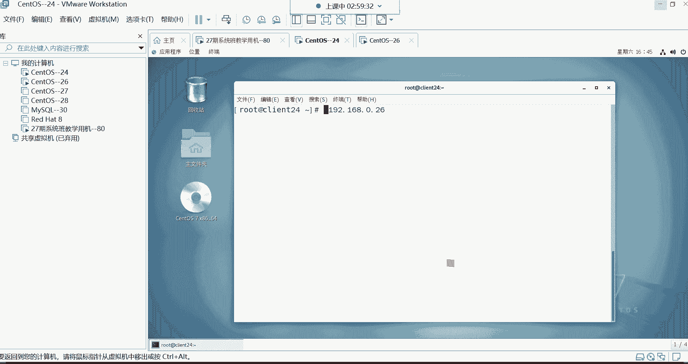
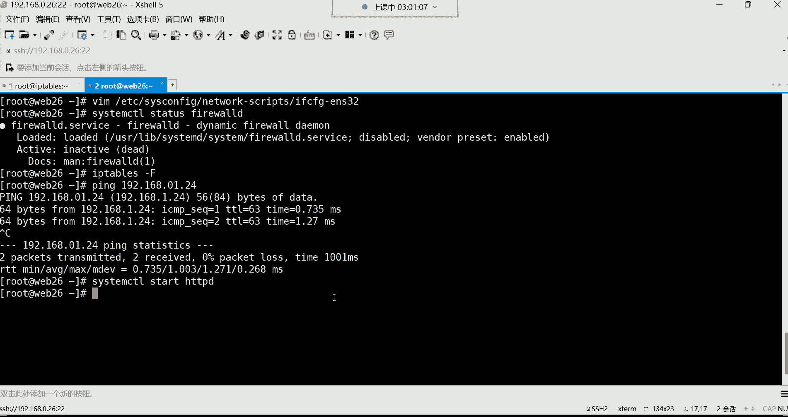
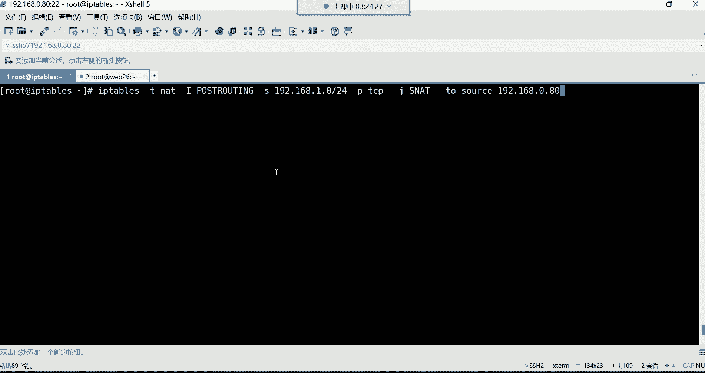

# 【小白入门必备】Linux运维进阶RHCSA+RHCE最全培训教程视频合集 - P54：红帽RHCE-19.系统安全防护之iptables防火墙 - 洋洋得IE - BV1nN4y1X7Go

这是0。80，这是内部的哈A内部的，就放这儿吧哈放到这内，哇这几个呢往下挪一挪，我靠讲个他妈防火墙，这个唉主要是这个环境的准备啊，特别的麻烦，这个外网网卡呢怎么让它是一网段的，一点多少呢，随便哈。

100一般只要是一个不存在的IP地址就可以，外网卡外网网卡接收用户请求，往上挪一挪，然后那先把这个外网网卡的IP地址。

给他配出来吧，是不是啊，然后呢在这。

怎么配IP呢，嗯最简单的方法最简单的方法有一条命令啊。

前面没有讲过，叫NMTI叫修改网卡IP地址的，他这个交互式的修改哈啊为什么要用。

又为什么要用这个命令修改呢，你说我们前边那个学过的命令，去改它的配置文件不就行了吗，etc this is config network杠4script，我跟你讲啊，我们刚刚添加的那块网卡没有配置文件。

没有网卡配置文件的，你看这里面只有一个ENS32，这个网卡的配置文件，而那个ENS34呢没有，但是没有配置文件，你这网卡配完以后，这IP地址是临时的，能理解吧，所以说咱们用这条命令呢可以干嘛呢。

可以直接配完IP以后呢，他给我们生成一个配置文件啊。

N m t y，所以这点直接敲好NMTY回车。

你看这玩意就比较有意思，是不是什么呢，是一个交互式的哈，先选什么呢，先选这个编辑链接啊，回车，然后为啥没有配置文件哈，因为它不会自动给你生成配置文件的，得需要你自己去干嘛呢，自己去。

要么你就拷贝那个es32网卡的配置文件，去改一改也行，改改吧，改吧也行，但是没有必要哈，就直接用这种方法非常快啊，有线链接，注意啊，我们添加完以后看那个网卡名字叫有线链接一。

所以呢你要选择在有线链接一的位置回车，接下来呢名字要改成ENS三三十四，要跟我们那个网卡名要保持一致，设备呢是他的一个什么呢，一个那个Mac地址，这不用改哈，然后下边选择一直往下。

这个按你的键盘下键一直往下滑，然后IPV4的配置不要自动的哈，我们要回车选择什么呢，手动配IP，然后回车好了手动，然后右边显示回车显示什么呢，就是我要给他配个IP了，然后下边往往下选择添加个IP地址。

然后地址的话呢选择添加回车地址多少呢，192。168。1。100啊，1。100哈，那这个地址的话呢有网关吗，不需要网关注意啊，他不需要网关哈，为什么不需要网关呢，因为外网卡正常来讲外网卡是不需要网关的。

能理解吧，那那在互联网当中是有他自己的路由的，所以这边你不用管，嗯看了吗，外网网卡哈，这位置，所以直接往下滑滑滑滑，一直往下滑哈，一直滑到最后先确定，OK看了ENS34，然后再往右边滑。

然后下下下返回回车。

OK然后再下下下下下右确定好了。

IP配好了，IP配好以后，来看IP as这个等会儿我们这个重启一下网络哈，At work，IP这个网卡就出来了，看到了吗，ENS34这块网卡，192。16，8。1。100这个IP地址，然后我们在干嘛呢。

再看etc cs config network gus que路径，那这时候就多出来一个ENS34，这块网卡的配置文件了呀，那以后这个IP就也有配置文件了，就永久生效了哈，怎么有的图形界面那条命令。

那条那条命令的程序，就带一个小交互式的图形啊，所以这个它就有那个图形了哈，对这条命令哈。

OK那配好之后，下边我们第二台机器网站服务器啊，网站服务器的话呢，我们是这样子的啊，web26网关指向谁呢。

他好Y826啊，这个机器呢，我们要把它的网关指向这个外网网卡的IP地址，这个等会儿他说不不不，这哈这个防火墙的内网网卡IP哈。

不要指外网卡IP啊啊为什么要指定它的这个，八零呢，因为他们在同一个网段吗。

能列吧，他们在同一个网段哈，If cf g e s32，网关直接指向192。168。0。80，保存退出，重启网络，好real哈，好了嗯，指完以后呢。

然后我看一下哈，Y8260。2 16，网关指向防火墙的内网IP0。80啊，那在这个图里边，我们这个，192。168。0。26，然后它的网关，网关192。168。0。80，本机，Web26。

然后这个客户端就那个client客户端，然后它的网关指向谁了呢，指向这个防火墙的内网网卡，是不是为什么呢，因为他们得在同一个网段啊，你像这内部网卡跟你的内部服务器，是不是都在同一个网段啊。

啊所以说你直接把你的网关指向它，防火墙设备就可以了，但是他们俩直接不就通信了吗，是因为咱们没有路由器哈，咱们没有这个路由器，所以咱们只是模拟一下哈啊，所以就直接让他们俩能够直接通信，就可以在同一个网络。

好啊，下边这个客户端客户端的话呢，咱们IP也得改，客户端给它改成多少呢，一点24IP地址换成1。24。

只要是把这个IP地址呢给它改成，不要跟谁呢，不要跟你的这个内部的服务器，在同一个网段就可以了，要让你这个要让这个客户端IP直接能够跟什么，跟这个外部的网络能够通信。

所以呢咱们模拟直接让这个IP也跟外部网络，这些通信，然后呢，那你想想这个外部的客户端，是不是就直接他的请求到达了外网网卡呀，是不是啊，得到外网卡以后呢，再通过防火墙的内网网卡，0。80把请求转给谁啊。

转给你企业内部的这个0。26，这不就是一个什么呢，唉外部网络访问你防火墙设备的外网网卡，然后呢，请求通过内网网卡转到你企业内部的服务器，然后接下来呢我们就来开始配置哈，LT4IP地址。

Etc c config network conscript，If c f t e s32，打开以后呢，IP直接改成多少呢，1。24，把这个零直接给他换成一，那网关呢是不是也得改呀，改成多少呢。

网网关改成1。100，不然他们两个没有办法通信啊，所以网关只用防火墙的外网IP啊，就是模拟一下他们两个IP地址可以直接什么呢，这些通信啊在同一个网络，好保存，退出重启网络，这一重启网络肯定就断了哈。

那这块儿重启网络，我这边就断了哈，然后这边我们可以从这儿，直接通过图形界面连进去。

图形界面登录，这是第几节课了，这这个哎哟，这都第，第16节了吧，如果我没记错哈，这是上一个班哈，这是上一个班，啊刚入学的是吧，嗯刚入学的呃，先不用急着跟今天这个课哈，因为今天这个课你现在跟不上。

等这个这个班结束以后呢，跟下一个班哈，下一个班新班从零开始讲15是吗，我也忘了，我也忘了到底是15还是16了。

王建哈，王建先不用急哈，你们这帮你听，你听不懂，开终端，还有多少节课呀，嗯把我们这个把我们这个笔记里的这些东西，讲完以后就完事儿了哈，具体几节课我也我也不是很确定，哼哼总之得讲完，好这边看IP哈。

你看他的IP是多少啊，是不是192。168。1。24啊。

没错吧，那这时候IP规划好了以后呢。

我们现在在这个图里边，就是这就是这个样子哈。

就是这个样子就是客户端，是不是啊，跟我们这个防火墙的外部网络，他们是可以通信的，客户端哈，然后呢客户端呢他的请求啊是由外网接收，接收以后呢，那页面在哪放着呢，页面啊是在这个哈。

我们的内部网站服务器里面放着的，然后呢到时候我们要通过防火墙的forward链，叫数据转发链，把这个请求从外部网络，然后呢再转到内部网络，再通过内部网络转到我的内部服务器去，是这么回事哈，能理解吧。

嗯怎么临时修改IP地址，用if config就可以了哈，百度一下if config后面GI直接跟上网卡名，IP就可以改好，那现在因为没有人，没有谁会去临时改IP的。

除非他妈的这个糊弄人啊，就会临时给IP好，接下来呢咱们就开始去做这个实验吧，我们要在这个，要在这个机器去安装一个web服务哈。

第二台服务器。

这个机器啊用YM杠y in安装一个HTTPT，然后这个防火墙那个HTTT就不用了，关掉哈，因为防火墙咱们是只接收请求了，所以把HTTPT停掉，OK然后安装好以后呢，直接改它的页面哈。

通过echo命令EQ一个web26。

Y86跟主机名同名好吧。

在这哈跟主机名同名。

把这个Y86给它重定向到，while下的3W的HTML下边，然后放到index点HTML文件里面去，好看这个文件。

那现在呢这个Y826啊，这个网站你就说我们起的内部的这个网站。

服务器，现在我们也部署好了啊，网站也起来了，那接下来呢我看他的防火墙哈，他就不开防火墙了哈，因为内部服务器嘛都不开防火墙，因为你已经外部有防火墙了。

好接下来这个就完事儿了，那现在第三台客户端，IP修改为1。24网关，第二款网卡01。1版，访问测试，现在我们要访问测试了哈，访问谁呢，我们现在这个客户端，这个客户端它要访问谁啊，要访问192。168。

0。26回车，等会儿啊，没有反过去呢，看我的规划是不是哪块儿配的不对啊，外边的网关指将网关指向0。80。

啊这是0。二十六零。80啊。

没有问题，我看他的IP啊。

嗯拒绝连接，啊把规则清空一下哈，你看这个由于我们是前面这个重启了机器，所以你看这里面有好有很多的规则，看到了吧，有很多规则和清空一下。

这都给清空了，清空以后这边再访问再试试哈。

然后看他的IP地址啊，我我我觉得他的IP有点问题，不喊。

我看下IP哈，我看一下这个IP地址，这个环境准备的IP是最容易蒙的，1。24网关，1。100嗯，没问题，我先拼一下啊，等一下哈，不就是因为它不在同一个网段哈，我们现在要的效果就是这个效果。

你看跟他不在同一个网段，但是我就想去直接访问。

哈哈像直接访问的哈，菲尔沃是不是开着呢，等会儿啊，我看一下啊，啊都是允许的嗯。

那就没问题了，能行还能行，192。168。0。26啊，能拼通，你们看到吗，是能拼通的哈，虽然说不在同一个网站，它是它是它是能通的哈。

能通的，嘿嘿能通是不是就能访问呢。

所以这时候访问哈，能通了。

这个26这个机器有点问题啊，那个。

我捋一捋哈，让让我捋一捋哈，我看看这个1。100嗯，然后，拼192168。1。24好能拼通，OK然后拼192168。0。26好，也能拼通，OK然后Y86拼192。168。0点啊，是1。24啊。

也能拼通啊，但是网站现在不能访问是吧。

等一下啊，能通啊，他们能通哈，注意哈能捅。

然后这网站不能访问web26唉。

这这让我有些哼，让我有些这个。

这网站难道没起吗，说说我是不是没起服务啊，啊说我没起服务啊。

看一下啊，哎哟你看这这他妈没起服务啊，那起来就能防得到，是不是，你说咱们说这个妈的大风大浪都折腾过来了，在小阴沟里翻船了是吧，是不是不是看到了这效果，你看哈，我们现在仿的是谁呢。

在这图里边我们一个客户端，这个地址是一这个网站地址的，但是呢他跟这个你的网站服务器正常来讲，它都不在同一个网络，没错吧，没在没在同一个网络吧，但是你们想一想没在同一个网络，你说这怎么这请求怎么进去的呢。

这请求就是转进去了，转发进去了，啊转发进去了啊，谁转发的呢，防火墙转发进去，其实我这个请求是先由防火墙的，这个外网网卡接收的，接收以后呢，然后呢这个请求是由外网网卡转给了内网网卡。

然后把请求转给了我的内部服务器，所以我就能够直接能够从这直接访问他，看到他的页面，但是在企业里面，这一步得需要通过域名访问哈，通过域名的话，这种东西经过域名解析你就不用管了，确实没配啥，为啥还能转发。

我们还没配啥吗，我我我们配了好多，我们开启了在防火墙设备开启了路由转发功能，然后呢啊其实你要这么说也对，那确实没配啥哈哈确实没配啥，就开启一个路由转发，然后剩下的把IP地址呢做了一个规划啊。

那在企业里面其实还是怎么说呢，很省事哈，在企业里面这外网网卡这种东西，你不你不需要去准备客户端了，你只要配你的防火墙设备就可以了，开启一个路由转发就可以了，嗯那这个我们现在要什么，我们要配规则哈。

我们这个实验做完以后，咱们要配规则，防火墙主机要限制他，请求了。

现在，我现在要配规则哈，怎么配呢，你看现在我要实现的一个效果，就是我要拒绝那个客户端访问我的网站嗯，我要拒绝客户端，也就是说正常来讲。

它是可以访问到我的网站的时候，我现在要在防火墙主义配规则，拒绝他，我就不给他转发请求了啊，那这时候哈哈怎么配。

放在这儿，这时候这规则主也要喷到哪，要配到哪个链，否握的链里面了，所以这时候就IP啊，别配错哈，在这儿配的这个机器IP tables，然后直接杠大I后边，forward的链配合规则。

规则呢如果我们只想拒绝某一个IP的话，就直接杠S指定原IP，192。168。0。24啊，sorry哈，1。24啊，这个这个IP地址，如果他通过TCP协议访问我的目标，八零的时候。

杠杠低炮访问八零的时候干嘛呢，我就杠这给你解决掉，好了配好了，然后看规则哈，那你看现在在这个for word链里边，这条规则是不是我们就针对于这个IP地址谁呀，就那个客户端哈。

然后他访问我所有网卡的时候，这时候呢而且是通过TCP协议访问的话，那咱们就给它拒绝，它，主要是针对于八零的哈。

所有地址的八零的时候咱就给你拒绝，那这时候如果他再访问的话，咱看效果哈，看效果回撤拒绝连接，看是不是哎这规则你发现我们在哪配的呀，在防火墙主机防火墙设备，咱们配了一条规则，而且是在哪个链手握的转发量。

是不是我们把这个规则是配到这个forward，转发链里面了呀，那所以这个效果就是当这个客户端，它的请求想访问我这个网站的时候，这时候我防火墙先接手请求，但是呢我防火墙一看诶。

这个数据包访问我的这个内部的八零干嘛呢，这是不是就匹配上了呀，匹配上以后我就给你什么呢，拒绝掉，这叫什么防火墙，网络型防火墙保护我企业内部服务器的嗯，那你看他的请求。

是不是就访问不到我企业内部的网站了呀，没错吧啊适合集群环境，OK啊，这就是，啊就是把一台服务器对对对哈，就是把这一台服务器当成了一个路由器来用了，对啊，它就是用来实现转发的这fold的。

你看它不就是数据包转发的链吗，是不是前面给你们讲过哈，数据包转发链，说白了你这个请求来了以后，咱在服务的这里面不是有条规则，规则是什么呀，拒绝拒绝访问八零，那我就不给你转发了呗是吧。

也就是说你请求到达我外网卡的时候，这直接就拦截了，这我不给你往那个转发，不往那转发，你的请求就进不去，是不是啊，所以你看那当时我们在这看的效果，就是拒绝链接了是吧，防不进去了，这不叫网络防火墙，是不是。

那下边的话呢我们还可以等会啊，我看哈啊，这是拒绝所有客户端啊，这就别所有了哈，就别所有了哈，一般这种需求用不到哈，我们一般都是拒绝某一个人哈，很少拒绝所有，如果你想拒绝所有的话也行。

就这些不用指定IP呗，是不是你如果不指定IP的话，那不就代表所有了吗，啊所以这个的话呢几乎用不到哈，知道一下就行，然后下面还有一些防火墙扩展给大家讲讲，那防火墙扩展的话就是讲的他的一些模块哈。

在这里边呢对于模块来讲呢，呃就是第一个啊叫做什么模块呢，就是Mac地址的模块，Mac地址的模块，我们为什么要讲这种Mac地址的模块呢，就是可以通过IP地址是单独拒绝这个客户端。

你看我们假设这个客户端现在呢我们配个规则，不让他访问，是不是啊，对forward的那就是路由，就是转发的，对就是路由功能呃，你看这个客户端哈，他现在通过这个IP的话呢，可以被我给拒绝掉了是吧。

那如果他换个IP怎么办呢，换个IP看我们干嘛呢，把IP地址改一改，Etc c config network guns script，If cf g e32，咱们把他IP给它改成一点多少呢，随便换一个1。

25，这个IP没有用哈，1。25保存退出，重启网络，Raise network，重启了，看IP哈，你看我们当前的IP是不是变成192。16，8。11。25了呀，没错吧，那他现在换个IP能访问吗。

你发现换个IP能访问了，又能看到页面了，那你说如果客户端哎，你说你把我以前的IP地址给我拒了，我换个IP地址呢，换个IP地址，换个IP地址原型的IP。

那是不是就不会被我的这个，防火墙规则所匹配啊，没错吧，因为我们这个规则是就是只针对于那个圆形，那个24IP的，但是人家换IP了，换IP你发现没有匹配到怎么办，按默认规则处理了吧，放行了，是不是啊。

那怎么办呢，唉所以有的时候啊，你可以通过唉Mac地址哈哈。

通过Mac地址去限制对方的访问Mac地址，说白了是针对什么，针对网卡的注意哈，Mac地址是针对于网卡的，你想对呀，物理地址吗，一你一个网卡上面，你的IP再怎么改，你的物理地址不会变吧，是不是。

所以你IP怎么改无所谓，我针对的是你的物理地址一限制，你怎么换也没用，是不是啊，但是问题来了，我怎么才能获取到他的Mac地址啊，其实也能改是吧啊，确实能改哈。

那咱们说一说我怎么我怎么能获取到他Mac地址，所以这时候有一个工具啊，就是这个叫n map嗯，安装NMAP可以扫描对方的IP的Mac地址。

所以这时候咱们在防火墙设备哈，YM杠Y，因此它n mp，啊对，除非你再买块网卡，安装好了以后呢，那咱们就开始扫描啊，就怎么扫描呢，就n mp跟上192。168。1点多少呢，25扫描这个IP地址。

好扫描出来了吧，可以扫描哪些东西呢，啊我们主要是看这一行就可以了，Mac啊，Mac address，Mac地址，这是他的Mac地址，看到了吗，好扫描的还可以扫描到这个机器，它开启了哪些端口，看到吗。

22号端口，然后SH的22端口，然后接下来当还有这个host is up，就那个主机当前的状态是up的状态，看了吗，然后还有他的IP地址，是不是拿起来我们主要就是说这个Mac地址哈，有了Mac地址了。

对不，IP地址扫描哈，不开防火墙你也能扫能扫哈，那接下来呢我们就怎么限制呢。

唉这就来说一说哈，这条命令有些长哈。

啊我就直接给你们复制过来，这种命令你们也不可能去背它，背什么呢。

因为这种东西，太长了太长了，这命令没有人去背它哈，然后你只需要干嘛呢，只需要把这个Mac地址换一下就行了，把这个Mac地址拿过来，然后把这里的Mac地址换掉，换成这个好，然后咱们说一说哈。

这条命令的格式，首先呢我们是针对于这个forward链配的规则，是不是啊，然后指定TCP协议，然后端口是八零的，但是呢注意哈，我们这时候要用杠M，杠M呢是调用IPTPS的模块，哪个模块呢，Mac模块啊。

这个模块你可以通过杠杠Mac source指定原Mac source，不是圆的意思吗，啊原Mac地址是这个地址的。

干嘛呢，我就给你拒绝掉诶，回车，那这个时候他即便再怎么换IP访问都没用了，能理解吧，他现在再怎么换都不行了哈，为什么物理地址咱们现在针对的是物理地址。

你看吧，现在Mac地址是这个地址的，我就给你reject拒掉，所以现在我管你的IP是多少啊是吧，只要这个物理地址给我匹配上了好。

那你就甭想访问我，所以这种是不是可以达到一个，真正的把这个客户端给它锯掉了呀，没错吧，行了，那然后这是防火墙的一个扩展哈，然后下面呢还有这个叫做基于多端口的设置嗯，SNAT共享上网讲完吧哈。

我们把这个IPTP讲完，那个基于多端口的设置，过滤规则什么意思呢，就是比如说我这个一个服务器，哎呀我有很多个端口，啊或者说我我针对的是什么呢，不一定非得是网站了哈，这时候啊我我有一部分是网站。

有一部分是别的服务，哪个服务呢，比如说我的其他的什么数据库啊等等等哈，叫假设哈嗯数据库，OK这是数据库，对齐哈，然后这图我到时候今天课后呢，我给你们发到这个网盘上面哈，然后你们这个实验环境如果不明白。

到时候按照这个图去配哈，可以哈，可以扫描哈，扫描它，好那下边呢我们那个来说一说哈，比如说我现在你看这个集群里边啊，又有网站，又有数据库，还有什么呢，还有这个FTP服务，FTP是做这个文件共享的哈。

FTP啊，就类似于百度网盘的FTP服务，那你看那现在我想干嘛呢，我想就是同时啊拒绝客户端，不能访问我的这些服务怎么办呢，所以说你可以叫基于多端口去匹配，这东西怎么玩呢，看一下哈，拿过来哈。

这也也是调用防火墙的那个扩展模块哈，把这个命令拿过来，我不敲了，这命太长哈，你们什么时候用，你知道改哪就可以了。

知道吧，改哪个地方你就知道就可以。

我觉得我的我的电脑现在特别的卡。

来看一下哈啊是这样子的啊，你看我们现在呢是比如针对于这个客户端啊，我们配的一个转发量是不是啊，然后指定如果这些人呢通过TCP协议访问什么呢，看好杠M调用模块了，哪个模块呢叫multipart这个模块。

这个mt pot你可以干嘛呢，同时指定多个端口，比如杠杠低炮的指定，这是目标端口吧，目标目标端口你可以指定很多个啊，比如说2×21，那是我的FTP服务，八零是我的网站服务，43啊，是我的那个什么呢。

是我的加密网站服务，你再来一个比逗号隔开什么3306306啊，针对于这些服务，比如我到底是允许还是拒绝，那如果你是accept就是允许啊，如果你说我不希望别人可以访问，那你就拒绝拒绝呗。

是不是看你自己呗，操作，能理解吧啊这辈子能理解我意思吧，所以你需要改的地方就是这端口在企业里面，你需要比如说我针对这个端口做什么操作是吧，端口就是看你自己了，是不是，然后剩下操作就看情况呗，能力是吧。

那多端口看一下，那你看现在是不是我这一条命令，拒绝了哪些端口呢，二十二十一网站的八零加密网站443，还有3306。

对，看需求哈，对可有可无啊，这种东西嗯，可我可不OK，然后还有可以根据IP地址的范围，IP范围哎呦，这IP范围怎么玩的呢，来看一下哈，这都都属于扩一些扩展功能。

你看啊，这时候比如说我想单独拒绝某一个什么呢，范围内的IP地址，比如说看看192168。1。21，值多少呢，一直到1。30，这十个IP地址，注意哈，连续的十个IP我都要给他拒绝掉，那这时候怎么办呢。

这时候你要叫IP range这个模块啊，杠杠SRC叫圆原IP啊，就是就原范围哈，原范围原范围是多少呢，192168。1。20，一直到三零，这十个IP地址我就给你拒绝掉，你再看，那是不是这个范围。

就是这个范围的IP以后再访问，是不是都按照规则去处理了呀，没错吧啊所以后边是什么，后边都是防火墙的一些扩展能力吧，都是它的一些扩展哈。

好了啊，所以后期有这种需求就看呗，是不是啊，这这些扩展就可有可无了哈，看需求了哈，但是你知道他知识这个功能哈，OK然后下面还有一个共享上网的功能，这个共享上网呢就是我们前面给大家讲了。

就是在企业里面如果有一个需求什么需求呢，唉我你企业的内部的这些机器，如果想访问外部的网络，比如想访问百度啊，去什么呢，去刷一些什么视频啊，去网上冲冲浪，但是呢这些这些客户端的机器。

你想想他们都是私有地址是吧，插上你们公司的网线以后，都是你们公司的私有地址，那私有地址没有办法直接访问百度，那怎么办呢，哎我跟你讲，我们这个防火墙设备可以帮你干嘛呢，完成这个功能。

让这些私有地址转换成一个防火墙上的那个，公有地址去访问互联网，就比如一个叫做sat啊，原地址转换谁是原，现在你想访问外网，外部网络是你的目标，你就是圆了是吧，所以他把我们的原地址转换成什么呢。

唉转换成这个地址，啊对这时候其实这活就是网工干的，网工干的嘛，没错哈，但是呢我们的防火墙也能实现这个功能是吧，咱们如果需要的话呢，我们来做个实验哈，也是把这个规划搞一搞哈，内部主机内部主机外。

咱们现在外部主机是web26啊，防火墙设备叫IP tab，然后内部主机叫什么呢，叫，啊client241。2十，还有IP是25了吧，啊二十五二十五我们改IP了对吧，嗯那这个机器就不用管了吧。

内部主机就他呗，是不是就他哈登录一下他的IP。

是不是就是你看是不是就是这个1。25啊，那他的IP不用动了，在这不用动了哈，1。25，OK然后那对于IPTP防火墙呢，这个呢我们IP的话呢是八零好八零，那这个IP呢也不用动，只不过现在我们换了一个角色。

什么角色呢，咱们把这个ENS32，这个网卡充当了外网网外网的网卡了，然后那个ENS34呢，这个一网段的IP充当什么呢，我的内部的网络了，为什么呢是吧，这个机器作为我的内部主机，就它就他哈。

我们的内部主机IP地址多少呢，是1。25，1。25哈，就是它变成内部网络的主机名client25，然后呢他想访问外网，他想访问外网怎么办呢，这时候，拿过来哈，我们给它转换成IP table。

的那个零网段的地址零点多少呢，八零去访问外部的网络，所以在这做一个SNET，Ipaper，这是外部网络哈，外网地址，就放到这儿吧哈行，就放这儿吧，OK吧，放这，然后那它内部地址IPTX的。

内网地址我们给它改成多少呢，唉一这个网段的100，是不是你看一个网段的，跟咱们的这个内部服务器在同一个网段，是不是，那他们是不是可以相互通信呢，没什么问题吧，但是呢你想他想访问外网。

那外网的话呢得需要这个外网的地址，所以这时候呢咱们就干嘛呢，让这个地址直接转换成这个外部的地址，去访问外网，这不就掉个个儿吗，其实说白了是不是啊，所以这个网卡就给他调了一个角色哈，1。100。80啊。

这是外部主机嗯，web26网关网关是0。80，网关就是外网网卡的网关哈，0。80，保存一下好了，那其实呢现在不需要做任何的配置哈，因为这个IP地址我们不用动哈，所以只是换个角色而已。

现在就是它变成内部机器了。

然后呢它变成外部的机器了，Y826，现在我们想我先把规则清掉，把IP规则都给它清掉。

好清空以后呢，咱们说这个规则怎么配哈，这个时候我们要这个把这个规则，配在NAT那个表里面，注意啊，配在NAT表里面，实现一角2。168。1。20啊，那是20几了，24哈啊，25啊，转换成0。800。

80，这命令格式拿过来给你们解读一下，二嗯，1。0这个网段的8080好mini。

拿出来解读一下啊。

好来看一下啊，现在呢我们配置的这个表现在是NET表了，杠T指定NT表了，然后这时候规则配在NET的哪个链啊啊，叫原地址转换那个链啊。

pose的如艇那个链哈，就是这个路由后规则的那个链，路由后的链哈，在net里边有一个pose的RT，是不是啊啊，Post routine，在这就是用于处理即将离开本机的数据包，这不就路由后嘛，是不是啊。

然后呢路落后呢，他把我们的地址给他转换了一下，叫做SNAT好，那这个时候我们就说一下这个命令格式。

在这里边，首先呢先用杠S指定我们要转换的地址，是哪个地址，那这就是私有地址了哈，然后我们指定的直接是整个网段了。

比如说哎如果我们有这种需求啊，我企业内部的这些机器都需要转换，那咱们就直接干嘛呢，搞成一个网段啊，一整个网段的地址，如果他们想访问外网的话，咱们呢啊而且是通过TCP协议去访问的话。

那我就杠J叫SNAT给你做一个什么呢，叫做原地址转换，就把这个原地址转换成什么样啊，你看杠杠to sauce，转换成这个192。168点，0。80这个地址，这就做一个转换。

那就说是把我们的企业内部的这个地，直接转换成这个0。80这个外网地址去访问，百度去这个命令解读清楚了吧。

所以这时候拿过来好走，你配好了IP table，这时候杠T指定NAT这个表，a post rout在这看到了吗，在这里边，你看看这是不是有个SNT啊，你看SAT就是192。168。1。0。

整个网段他们通过TCP协议干嘛呢，访问目标任何地址的时候，我给你图转换成我的这个0。80这个地址，那这时候我们怎么测试。

正好我们要用那个client那个机器内部的机器呃，那是他妈的这个地址怎么这么乱呢，这是25法网站哈，比如说现在他去访问谁呢，访问192。168。0。26回车，可以看到这个二六的页面，是不是。

但你想想他跟那个二六在一个网段吗，嗯这是1。25，那个呢是192。168。0。26，他们在一个网段吗，不在同一个网段吧，所以谁去访问灯的，最终他去访问这个地址去访问的，你说我怎么知道啊，看一下日志哈。

这里面啊动态查看阿帕奇的访问日志，在mars的log HT TP d下面有个access log。

所以我们这个Y826看一下有哪些人访问过，我，直接tell杠F啊，你就直接看吧哈，我们直接cat啊，mar下的三，mar下的log，然后HTTPD下边access log谁访问过我呢，0。80访问过我。

诶，你看这地址有点意思吧，0。80在什么时间是不是啊，然后呢，get请求通过HTTP1。1的就是版本访问过我，是不是，而且还访问成功了，200状态码，这东西后期都会讲到哈，你们先不用管。

你就知道这个地址访问过这个机器。

这个地址，房屋这个机器啊，那就说你看，但是我们是用防火墙设备直接去访问的吗，不是吧，我们是用我企业内部的这个机器，是不是啊，哎这些机器去访问的那个0。26，但是最终我们看到的那个。

我们在这个26那个机器里面看到那个房子，这是哪个IP，这个IP这不就是直接做了一个原地址的转换吗，是不是把这个地址转换成这IP，然后呢去访问外部网络是这么回事儿哈，嗯像一个代理吗，类似吧类似吧。

反正就是转，反正就是转发请求的好了，最后补充一下，所有IP tips的规则都是临时的哈，如果要永久保存规则，执行下面命令，service IP tips杠save。

在这，Ip tables，然后，啊sorry哈，Service，IPTFC5好了，规则保存到哪里了呢，保存到这个路径下的这个文件里面去了，所以以后你想改规则，打开这个路径下的这个文件。

这就是我们IP table里面的规则，mango表的规则，mango表里面的几个链，看到了吗，这些链哈，这是它的链，但是没有规则哈，只有这个pose ring，这里面有有一个哈，下面AT表。

AT表里面这这几个链是哪个链，里面有规则，看到了吗，pose root这个链有规则，然后下边file表，file表里面没有规则，后期想删，直接从文件里面删就可以了，能理解吧。

或者说你直接把这个文件给它干掉，注意哈对啊，这命令也是用，也是永久保存的吗，etc c嗯，不是不是哈，你那套我我没用过那条命令啊，我不是很确定哈，所以以后如果你说哎呀。

我想这些这个规则我又不希望永久保存了，把文件直接干掉就可以了，把这文件一删就可以了哈，2M杠2F，一三啊，规则一清空，gt neat清空全部清空清空，清空好了，那这个又没了。

又恢复到了我们最初的状态是吧，好了哈，以上就是IP tables防火墙啊，然后你看我们这安全防护，防火墙里面讲的东西还是蛮多的，是不是啊，后期呢多多去敲哈，多多练这些命令的话呢。

不需要大家一次性都能记得住啊，因为这种东西我告诉你啊，就是唉呀呃什么时候用的话，那什么时候翻翻笔记吧，谁也可能都能记得住啊，我时间长不用我也忘，发好，我到时候上传完，到把这个笔记上传到网盘里面哈，嗯0。

26，上传到网盘上，然后这个root web26，这感觉这么乱，IP tables主机名哈，好了看看有什么问题吗，防火墙讲完了，然后有什么问题可以发出来啊，给你们留几分钟时间，没有没有问题的话。

我们休息一会儿，啊这是web26，休息啊休息休息，没下课呢哈唉哟五点多了，五点多了，哎呦那不行，就下课吧哈我们今儿看来讲不了太多了，我看，等会儿啊，我看一下哈，你别着急哈。

我得我得把这笔记给你们归愣一下哈，不像客嘛，不点半了，是不是到点了是吧，客户端，怎么说，那个如果我们这周课结不了的话，我会在那个什么时候呢，我会在差不多周二的晚上吧哈，然后给大家加一节课。

然后尽量不影响下一个班的开班啊，啊因为剩下这些内容的话呢，其实哎讲起来也就快了哈，讲起来也就快了嗯，看情况啊，看情况不是今晚哈，礼是礼拜二哈，下周二下周二啊，不是今晚好吧，不是今天晚上。

所以你们别怕好吧。

行今天就到这儿吧。

