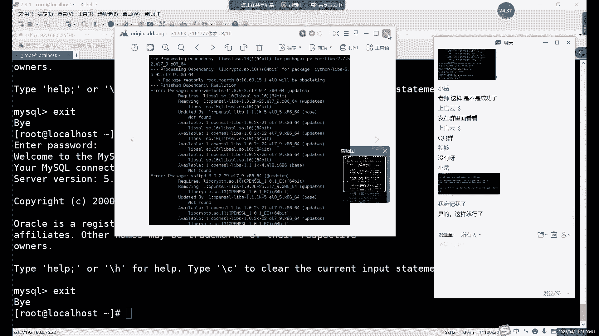
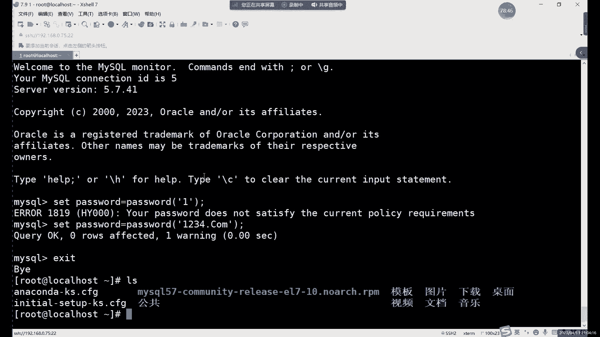
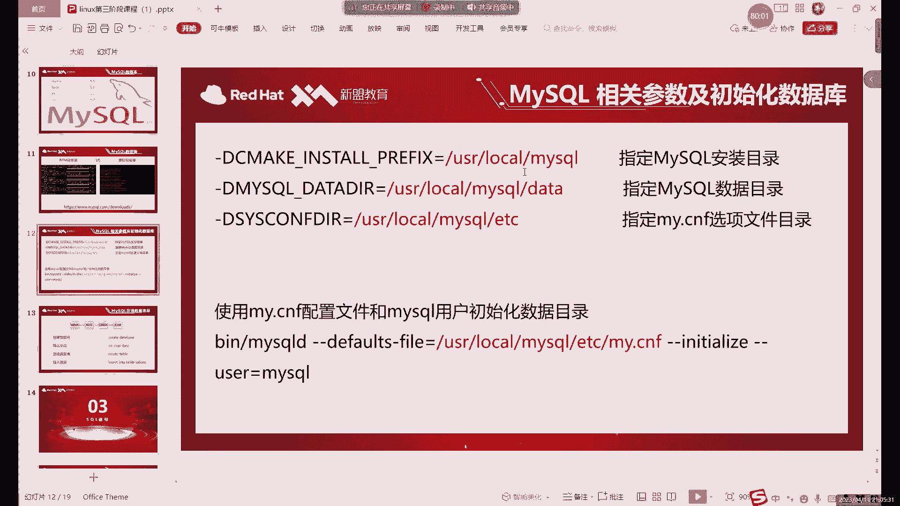

# 【小白入门必备】Linux运维进阶RHCSA+RHCE最全培训教程视频合集 - P64：中级运维-2.MySQL介绍及安-中 - 洋洋得IE - BV1nN4y1X7Go

其实他俩是两家公司的啊，收购的收购之后呢，MYSQL的创始人呢他又重新的什么。

又重新开发了一个基于MYSQL的代码，又重新开发了一个ml g b啊，也就是说它其实里面命令是一样的，只不过是啊，但是呢它是两个数据库，而且呢大家注意啊，后边的话可能大家会遇到一些。

偶尔会遇到一些这个MYSQL的安装的报错，罪魁祸首是谁呢，罪魁祸首就是他为什么这么说呢，因为他俩呢在文件上是有在文件上，或者说是简单的来说，就是这两个软件是冲突的啊，这俩软件有冲突啊。

然后亚梦刚y remove或者就多打了一啊，我这里还得还得再卸载一下，因为什么，因为这个他和MYSQL有冲突，所以说不能一起装啊，不能一起装，也就是我们本地量仓库里面其实没有啊。

那我们常用的一些网络亚本源里面有吗，就比如说什么呢，哎比如说这个阿里云啊，或者说是清华大学的云啊，嗯就是还有一些网易的这些这个云之间叫云，不用说云吧，镜像站啊，我怎么说说说起云那个镜像站啊，不是云。

阿里的镜像站啊，清华大学的镜像站啊，他们里面其实也没有嗯，就是其实很多软件的话，这些语言里面都没有，也是用亚马安装呢，其实可以，但是呢你需要什么额外的去下载一些这个，比如说我们如果是想装MYSQL的话。

你就必须要去下载什么呢，下载MYSQL的源啊。

现在MYSQL电源具体步骤的话啊。

笔记里面是有的，但是哪个来着啊，具体步骤的话笔记里面有啊，就是这个大家可以打开这个，一会大家安装的时候，可以直接去这里面去复制啊，因为很多命令很长，而且不用没必要去记啊。

没必要去记，比如我们来看一下什么呢。

嗯来看一个项目源啊，这里的话这个亚目原，如果说大家想要么安装MYSQL的话，需要下载去MYSQL的官网上去下载这个亚美元啊，先把所有方法出现在载按摩亚目原，其实安装方式准确的说的话是三种啊，是三种。

rpm安装对吧，YM安装以及什么以及源码安装，我们其实这里主要用什么，其实用源码安装更多一些啊。

因为一个软件的话其实怎么说呢。

大家前面应该也是也听过这个对吧啊，源码安装和rpm安装RPM，它其实已经是编译好的啊，你拿来的话就可以直接安装，非常方便，但是它里面有一些东西吧，它的东西它里面的一些设置是固定的啊。

就是你不管是谁安装还装出来的效果都一样，那相当于一个定制的啊，不能说定制吧，就是嗯一个软件就是，就类似于什么呢，类似于我们正常在windows里面装装一些软件对吧，谁装都一样对吧，装出来都是一样的。

而原宝安装这边呢，他速度是稍稍速度会稍微慢一些，但是它的特点呢是什么，它特点就是能自定义安装，啊自定义安装，也就是里边还涉及到一些什么，涉及到一些安装路径啊，啊安装的这个目录啊，文文件啊。

或者说具体安装的功能啊，开启哪些功能等等等等，这些的话其实就是源码安装可以去设置啊，其实有些相当于我们可以自定义设置，而rpm包这边就不行，rpm这边啊，你安装的目录永远是固定的啊，你数据目录也好啊。

日志目录啊，就是所有我们的这个软件，就完全是一个固定的一个状态，然后这个的话就是两个安装方式的一个区别啊，要么安装和2pm安装是一样的啊，它俩是一样的，特点是一样的，也可以，其实包就是完全一致的啊。

保险是完全一致，啊我想完成的路径的话，就是这个，啊对你发这个路径没问题，是这个，然后大家可以现在把这个什么，可以把这些啊软件包啊下载一下啊，我们一会儿可以一起来装啊，一起来装一下啊。

可以给大家几分钟时间下载一下，啊我们可以先下课休息一会儿吧，下课休息一会。

大家可以先提前下载啊，下载，好我们接下来的话继续啊，来说一下这个买书的安装，首先我们先强调一下这个亚马安装啊，因为大家我看刚才下课的时候，已经有人在尝试对吧，有亚马安装，要不安装的话。

其实主要注意的一点就是什么呢，啊第一个w get命令它又是裂开的啊，w get命令的话最小化安装没有，你需要用YM刚玩install安装一下，当然前提是你这样防护先弄好啊，压仓库先弄好，这个压仓库的话。

你已经是他是前两天的那种，我这里不肯定不会再教大家继续弄啊，没弄好的话，大家再去把这个什么啊，把让仓库部署好，然后用w get去下载，啊啊W再去下载，首先我们第一个这里又是怎么报错呢，你报错了。

确实有点千奇百怪的，我觉得你这个连着网联网上好像还是有点问题，比如说我这里给大家先演示一下这个命令啊，我们就先用样本安装一下啊。

用样本来显示一下，就是我这里一直在裂开，不应该是网不好。

对吧，安装到最后呢，它会什么呢，它会下载下来这么一个包啊。

再下这么一个包看一下，对大家，首先啊就是你看成没成功的话，就是你到时候盖子直接好之后呢，你看一下本地啊，就是看一下当前目录有没有这么一个rpm包啊，我没有安全包啊，网盘里的这个网盘里的这个MYSQL。

安装这个PDF或者说one note格式的啊，我说我只是你只能看两种格式的。

然后网盘的话就是在群公告里，群公告里，我们现在不是36期群吗，啊36集群，我们现在第三阶段，在36级群里看了三十七六G以上啊，36级全体公告，然后的话你安装好有这个包之后呢，你再要么安装啊。

确定这个包包下载好之后，然后我们直接下一步就是什么样么。

安装这一步它安装的是什么呢，他这个包啊其实它很小，我看一下看一个大小啊，大小它只有25K，唉就是它其实它并不是一个软件包，它只是一个什么呢，它只是一个啊为我们编辑什么呢，编辑我们的这个样仓库的一个软件。

唉，编辑样本仓库一个小软件，我们样本安装它的话啊，要杠y install安装这个MYSQL，嗯MYSQL57安装它的话，它其实就是拔什么呢，给我们安装了一个网络，就是样目源。

比如我们打开这一切字架的YM，点IPO点D这么一个目录，我们可以看到什么呢，看到MYSQL杠community的样本源。

有了它我们就可以安装什么呢，有了它我们就可以安装MYSQL，啊对有了这个包的话就可以安装啊，用YM去装，啊这不就没问题了，装好之后的话，你要看一下怎么看一下这个etc的样目标。

REPOS点D这个目录里边哎有没有什么呢，有没有这两个文件，有这俩文件了，哎那好我们就可以什么呢，可以安装什么，安装这个YM。

这个就是我们的mysql community gun server了，这个软件，但是安装前最好先下载一些什么呢，下载一下我们的密钥啊。

啊这里这里写的这里是2022啊，为什么2022呢，因为这个版本它是这个版本是2022版，所以说他这个密钥就这个软件它是202版，所以他这个密钥也是我们下载202的嗯，也要七杠十。

然后呢下载好密钥之后呢，我们就可以压完安装什么样完装MYSQL啊就可以了。

MYSQL杠可没问题。

杠server啊，这个就是软件包的一个名字。

安装的话，这里其实它包括什么呢，包括几个不同的软件包啊，几个不同的软件包，这几个其实是前面几个其实算什么，它是算依赖关系啊，就是我们主这主要的这个server这里的依赖关系啊。

当然这个依赖关系呢它其实并不是什么。

并不是，这几个的话，其实我们在rpm自己rpm手动装的时候呢，也可以去下载这些软件包啊，现在这个版本应该是5。7。41版的，现在已经更到5。7。41了。

啊rpm杠这个rpm命令呢没有反应是正常的啊，没有反应是正常，啊没反应就，好安装好之后呢就可以启动了啊，安装好就可以启动，然后呢软件的名字叫什么呢啊，虽然说我们是叫MYSQL了，但是他音乐是什么。

它是rpm安装的，rpm安装的所有的MYSQL的名字都一样，就是MYSQLD啊，他就多个D，怎么说呢，他这个地板啊，我看起来就不是不是很顺眼啊，但是呢他没办法rpm安装，要么安装。

我们没办法去改变它的一个软件名字啊，这个我们没办法改变，因为他这个是，相当于是编译好了之后，哎，或者说你可以怎么理解，就是他已经装好了，我们只是把这个rpm，就是他把把这个装好的。

我们移到了我们本地这里啊，然后然后把这些目录文件什么的创建一下，然后就安装，就是安装这么一个MYSQLD。

安装好之后的话，我们可以用重启一下，重启一下，这个或者开启都可以啊，重启开启都行啊，开启我的MYSQL阿马加龙，开启之后的话，我们需要看怎么看密码，因为为了安全性考虑，在5。7版本之后啊，这5。

6之前是没有的，5。6之前是没密码的啊，MYSQL可以直接进入它一个密码都没有，5。7之后呢，他说是为了安全性考虑，但其实也怎么说呢，也没有什么没有多安全，看也没有什么多安全。

就是他设置了一个原始密码啊，但是只有20密码，这个原始密码呢是在哪个位置呢。

如果你是rpm安装，或者说是YM安装的，它位置统一都在VR下的log目录下，有这么一个日志啊，VR目录大家都知道对吧，VR下的log下的都会存放什么呢，就是存放日志的地方，唉我们怎么是这个地方。

那这个MYSQL的日志的话就要MYSQL，然后点log啊，就这么一个文件，我的密码是存放在这个文件里面的，所以说呢我们看一下这个文件就行了啊，然后看一下用grape过滤一下密码就可以，唉。

比如说我们可以直接直接这样执行啊。

cat VR下的log目录下，文件名字呢就是mysql log啊，点log过滤一下我们的密码选项啊，就相当于是把密码内行过滤出来了，密码在哪边还是结尾呀，应该是结尾，然后呢大家这个密码肯定是不一样的。

这个密码是完全随机的，所以说大家在复制的时候需要注意一下，就是不要复制少符号了，就是冒号后面的全部都要复制它，因为里面可能会带一些符号什么的，也需要一起带上，因为他这个少一个都进不去啊，小黑都进不去。

然后呢我MYSQLMYSL杠U啊，MYSQL进入，现在的话MYSL其实已经启动了啊，这个restart没有报错的话，我们就已经成功启动了，可以用status命令看一下。

对吧就是running就行啊，不管是什么服务，只要大家能看到running running就行，颜色什么的不重要啊，可能有些服务后边有一些啊，有些这个FID呀什么的，这些其实不影响唉。

只要你前面是个running running状态就可以，这个是看一个服务，如果启动的话，主要是看装active装你这两个。

然后的话我们这里，启动之后呢就可以进入数据库啊。

进数据库的话用MYSQL命令啊，这时候呢这个命令就是要记了，前面那些安装的啊，他无非就是亚摩rpm什么的对吧，那个命令呢不用记，全在下面，这个命令呢啊，就是我们啊学MYSQL第一个要记的命令啊。

这里划重点啊，Mysql u，root啊，当然这里有没有空格都可以啊，可以有空格，没有空格，这个都行了，然后杠P杠1root就是user user的意思唉，就是用户因为现在我们装好之后呢。

而其实只是默认是什么呢，它默认给我们的root用户创建了个密码，大家注意看一下上面这个，上面这个是我们的日志啊，日志日志这里呢我们写到的是root啊，local host的一个密码。

也就是说我们只能用什么呢，就默认装好之后呢，只能用root用户去登录啊，其他用户登不上去啊，你们没有密码的杠u root，杠P杠P什么杠D就是密码的password，对啊，我刚才不是刚说过吗。

grade啊，grape password i u杠P呢通过密码去进入，然后把大家把这个复制一下，复制之后呢，你不要直接复制在这个后面，为什么呢，因为可能会有一些符号啊，可能会有一些符号，有符号的话。

这里它就会报错啊，有回报这里会报错，所以一定要注意啊，一定要注意啊，一般情况下呢建议大家什么，建议大家就mysql u root杠P直接回车，然后呢输入这个密码，当然不用输入，你复制就行啊，复制就行。

哎，大家可以看到这里的话，其实直接在后面加杠P的话。

这里是需要什么的，需要把它这个连起来的，我们mysql u root杠P啊，加这个密码啊，这样也行，这样的话一般我说了，你可以用，我一般就是习惯是连起来写啊，连起来写。

啊这样就进来了，当然如果说你这里会有，如果有一些特殊符号的话，就是你可以怎么写呢，就是mysql u root啊，这个支线的话已经进入到我们数据库当中了啊。

这个数据库版本退出的话是X退出就行，然后建议大家进来的时候就是mysql u root杠P，这样进入回车的时候呢。

你把这个密码呢复制在这里就行，因为有可能有大家，这个随机硬盘里面会有一些特殊符号，有特殊符号的话就自己会报错啊，啊这里我们就不继续说其他命令了啊，大家先记住第一个命令，就买qu root。

放P后面加密码啊，这密码密码比较复杂的情况下呢，如果有一些特殊符号的话，你就这样进就行，不要把密码直接输在后面，输在后边，它不会生效啊，不会生效，那这个的话就是什么。

这个就是我们第一个亚目安装就是很简单，主要是你得联网啊，要么当y instar这个报错的话，虽然说没有截图到，你联网了没，全是报错的话，那大概率有可能是没有联网啊，大概率是没有联网联网。

那那你把这个截图你再拔一遍，哎这个队伍网络没什么问题，但每次大家发这个图片，他第一次这种很基本上接触不到，唉我看上面的一大半图片都我都看不到。

哎有点有点问题，这个告诉我他是依赖关系的问题，依赖关系的问题也要八是吧，你是不是用的是，我已经感觉到你用的是不是SLSL8，或者说是八版本的系统，因为我看到这个pl8了啊，这个期望，这期不应该呀。

Wiff tvt，你这里报错都是什么，都是其他服务的一些报错啊，都是其他服务的一些报错，其他服务的报错的话，7。9系统啊，系统没问题，你之前做过什么操作吗，我感觉就是你之前，估计你恢复一个什么。

恢复一个装好这个系统之后，你恢复一个最原始的快照吧，这些的话他报的都是什么，都是其他服务的一些问题，就是和相当于是和其他服务冲突了啊，相当于是和其他服务冲突了，就会报了这么多错。

你可以恢复快照重新做一下啊，不行的话，下课给你看一下，下课给你看。

啊能进去的话，说明就安装好了，这就安装好了，彭林你这里的报酬的话，其实就是他和其他服务冲突的，冲突的话，最好还是你恢复要快照，恢复原始拍照肯定是没什么问题的。

好我们就接下来继续啊，接下来继续啊，继续说下一种方法啊，当然可以先改个密码对吧，大家如果说写密码太复杂了对吧，改个密码确实是有必要的啊，你可以直接看什么呢。

直接看这个查改在修改密码这个笔记啊，查看查看密码这个笔记文档里有啊，主文档里有定到这个系统里面之后呢。

其实你什么操作都不能做啊，这个是什么，这个是MYSQL的一个限制，就是你必须要先改密码，你想干其他的，他不让你干啊，只能先改密码，MYSQL7里面啊，5。7里面最简单的血管病的方法啊。

当然修改面呢不止一种方法是最简单的一种，就是password等于password就行，啊等于发多少就可以，然后呢他这里都不知道是什么呢，就是报错密码太简单了啊，密码太简单了。

这个是rpm安装的一个限制吧，啊RP安装的一个限制，他要至少八位的数字啊，不是八位的密码，有数字有字母大小写大小写字母啊，不是有数字，有符号大小写字母四种，而且要八位啊，这个是它的一个陷阱啊。

这也是我们说这个限制当然可以调啊，具体调整的话，大家可以看一下这个笔记里边。

这里我们可以修改密码策略啊，这里我就不改了，这个可以了解一下，因为密码策略的话，默认的话其实这个也比较合理对吧。

这里能设置一个相对复杂一些的密码，来保证一个安全性吧，啊你可以修改密码策略，那你是你如果想让对方简单一点，就可以直接支笔，直接改了啊，但是我为什么这里不改呢，因为我一般也不会用什么。

我一般也不会用这个rpm安装的更多的，大家还是推荐大家更多的去装什么，装这个样貌安装好吧，但是呢因为这个2pm中里面有很多东西吧，嗯很麻烦，密码是其一其二还有什么呢，还有一些这个中文中文乱码的问题。

其实rpm包装里面他们都没有解决，为什么呢，因为他这个相当于是官方出的一个软件包啊，这个的话，你你可以理解成是一个官方出的软件包，这个软件包的话，它其实并不是唉，因为它里面是默认是用的什么。

默认用的是拉丁文，他用的不是中文啊，他肯定不可能给你用中文的，因为它这个是官方嘛，知道吗，都有他他国外的东西，所以说呢，唉如果说我们要去安装的一个比较，合适的版本的话，或者说合适的系统的话，最好是什么。

最好就用这个RP源码安装的，哎呀妈弄，原版安装的话特点是什么呢，啊它速度会稍微慢一些，但是呢我们可以怎么，我们可以在安装的过程中设置一些路径，设置一些目录，然后呢啊可以在除了路径目录之外呢。

还可以设置一些唉，比如说语言啊，我们就可以让它支持中文，因为你现在直接安装这个啊，现在跟我们刚才用亚马安装这个MYSQL，它有个什么问题呢，有很大问题就是它默认是不支持中文的啊，你修改起来也还是得用。

还得用这个还要修改一些配置文件什么的，其实很麻烦啊，我们干脆就是什么就是用源码安装，我们可以一次把这个设置都设置好，设置好之后呢，后面就唉不管是干什么，其实都比较方便啊。

然后源码安装的话，首先包的话是哪个呢，包的话当然大家可以去呃，去MYSL官网上也可以下载，但是呢我是提前已经下载好，大家直接在哪，直接在这个网盘里下载就行，就是这个原码包。

还是这个文件夹里面有rpm包和源码包两种，因为你要安装其实就不需要直接下载，它，就相当于是正直接联网下载，然后呢rpm和原版安装的都可以，什么都可以，是哎在没有网的情况下是可以安装啊。

不需要网络就可以装，你压马超，他必须得有我啊，必须得用，然后呢这里的话它可以下载一下这个源码包啊，源码包。

联网报的安装的话，应该大家之前之前前两个阶段，应该是有一节课是讲这个源码安装的啊，但是呢不同的软件啊，因为我们安装方式呢它不是它都不一样啊，它不一样的，所以大家可以仔细听啊，仔细听主要的步骤的话。

或者说是原版安装的一个特点呢，我们就可以指定什么，指定一些安装的目录啊，指定一些数据目录啊，以及配置文件啊啊等等这些目录啊，都可以去指定，这是更加自自由一些啊，或者说就相当于是自定义安装啊。

你可以理解成这个rpm包安装就是默认安装，而我那么原版包安装呢就是什么呢，哎就是这个自定义安装，这个是最哎最直接的这种理解方式啊，然后接下来的话我们来看一下，我们先把这个包整进来啊，我把这个包整。

嗯我的包去了。

唉可以直接把包复制进去，或者说你也可以用w get命令，直接去根据下载也行啊，然后这里的话我们就可以看一下，我们拖欠包的话名字啊，就是MYSQL版本的话，这个其实和我们刚才装的那个不太一样啊，当然了。

我们装之前呢最好还是先什么的啊，亚目杠y remove删除一下什么呢，删除一下MYSQL杠什么运气杠server这个整体的包的话，但如果跟着做的话，其实我说你可以删一下啊，用一阳光微云梦删一下。

或者说最直接的方式呢，我一般选择什么呢，我一般选择恢复快照，你会快照怎么说呢，比较快捷一点啊，因为卸载的话，你要卸载还有好几个包啊。

也比较麻烦，这节目不用拍照啊，拍照拍的多还是有好处的，就是你想要去哪个环境呢，你直接恢复就行啊。

我这里就不删除了，删除的话还得花点时间，我不如直接恢复快上，这样更快一点啊，这样更快一点，然后我们接下来的话继续，我们接下来看什么，就来看这种样貌。

不是rpm，不是源码，安装的方式，是源码安。

我们这里不用删了，就连接一下。

然后的话我们这里唉退出退出EXIT。

你打错了，Ei x t e x i t，然后的话这里我们接下来就来看一下这个啊。

再把包拖一下，现在恢复快照了。

原宝包安装的话，首先一般原版包装都是以T2点GZ结尾的，这个相当于是压缩包啊，压缩包，然后的话我们安装这个压缩包呢怎么装呢，首先先解压啊，tr结尾的他肯定是什么，肯定用t harm压缩的。

那我们就用这个命令去解压对吧，这个解压命令不用我多说了吧，解压X啊，X解压就行，Z的话就是JZ格式，然后的话我们把后边这个MYSQL啊，把这个MYSL这个包呢解压一下，解压的路径呢随意啊。

你写在哪都可以啊，如果说默认这样直接执行的话，相当于把这个包解压到了我们的当前目录，也就是录屏摸一下没问题啊，那我一般情况下我安卓软件习惯了很多年了，这么多年了都养成习惯了啊，一般是装在什么。

装在user目录里面，好源码包一般放在哪，一般放在S2C目录下，大家这个目录呢是可以随意去指定的啊，这个没有固定的规规范和规则，因为这个源码包讲究的一个讲究的就是什么，讲究的就是自定义自由啊。

所以说呢这个你想要安装到哪都可以啊，只要命令只要这个目录有就行啊，只要目录有就行，解压好之后呢，我们可以来看一下啊，我们是解压到user目录下了啊，接到这个目录下了，所以说呢我们切换过去可以看一下。

切换到MYSQL5。7。37，这个是什么呢，这个是我刚才解压出来的包啊，它解压出来的目录就叫这个名字啊，我可以切换过去源码包，安装呢主要的步骤是什么呢，哎主要的步骤就是一个编译我们这个源码包。

因为源码包呢它相当于什么呢，相当于还是原有的编程语言啊，就比如说它原有是什么，原有是C语言啊，MYSL是C语言写的，我们这个包里面的内容呢，其实全部都是C语言组成的，然后呢我们如果说想安装这个包的话。

我们需要什么，我们需要把C语言呢啊给它变成什么，变成二进制的语言，二进制是什么，一啊0101是日叫二进制，没问题对吧，这个应该大家能理解二进制的，它才是我们的计算机能够识别的东西。

二进制的才才才是我们计算机能够识别的语言，rpm包它其实已经编译好的二进制的包，所以说呢安装起来很快，但是呢你什么都不能改啊，比如说目录为什么的全部都是固定的，因为它已经编译好了，或者说已经翻译好啊。

或者已经翻译好了，那我们这个二级，那就是我们的源码包啊，联网包它是什么包呢，它其实是一个原有的编程语言，我们需要把它呢，就比如说我们需要把这个C语言呢，哎给它变成什么，变成0101的这些啊。

这就是我们编译的一个作用，所以说呢我们接下来的话步骤就是什么，就是编译。

而编译这里呢我们需要用到另一个，俺用的就是这个源码安装啊，编译用的就是sim啊，或者说是make都行啊，编译的命令准确的说是make啊，make就是原来安装的话都是make以及make install。

这两个命令啊，这两个命令，然后same Mac的话，这个是什么呢，它这个是预编译的意思，或者说呢你可以写成设置啊，这一步的话就是设计设置一下，我们安装哪些功能，或者说是什么呢。

哎或者说是安装启用哪些功能，这里的话啊或者说是修改一些目录，就这么几种，当然了执行这个设置之前呢，就开始把理解成设置啊，设置我们的这个安装选项，这一步的话你就可以理解什么的。

可以理解成在安装一个windows软件的时候对吧，我们都会什么都可以自定义选择一些目录啊，对吧啊，或者说是开启一些功能啊。

是否把它加入到这个桌面环，就是是否给它创建桌面快捷快捷方式啊，是不是加在我们这个菜单里面，还有个菜单里面啊，这些这就是自定义的安装啊。

这里的话就类似于我们在windows里面装软件的时候，那些自定义的设计啊，当然当然我们这里是以什么，以命令的形式显示了，然后的话在设置之前的话，我们刚才已经剪好了对吧，剪好了，并且呢到了这个目录下啊。

但是呢还有一部的话我们还没有做是什么呢，就是哎处理一下这个M2db这个问题啊，当然了，其实刚才我们已经其实已经安装过一次MYSQL了啊，不对我们恢复快照，对我刚才恢复快到了。

所以说呢大家一定要就是每次安装MYSQL之前呢，先检查一下买2GB的文件是否存在什么意思呢，他俩是呃忘记保存快照，没关系啊，如果说没有拍照的话，刚才你亚马安装好了。

你就是用YM杠y remove把那个MYSQL全卸载掉，卸载掉，然后这里的话这个rpm安装一定要注意一下。

比如我们来看一下rpm gq a杠QA，查看什么呢，就查看一下现在啊不是查看MYSQL查看啊，当然你也可以看一下MYSQL，当然我们现在也没有装啊，如果大家用亚马安装的话，可以先卸载一下。

你就把查看出来的MYSL包呢都卸载掉，然后呢再看一下这个M2db这个数据库，MYSQL的一个MYSQL的儿子对吧，你可以这么理解MYSQL儿子，但是呢他呢，怎么说呢，和他父亲之间有一些矛盾啊。

和他父亲之间有些矛盾，具体矛盾是什么呢，啊就是这个文件的，其实具体的这个其实是个文件的矛盾，MYSQL的话它也有这个什么，也有这个live的文件，这个文件的话，MYSQL和VRDB呢相当于是冲突的啊。

父子之间的矛盾，有时候他其实就是一个小事儿啊，所以说不能一起装，我没办法，这个是他真不能一起装，所以说呢你如果说安装了，已经之前装过M2db的话，先卸载掉啊，先卸载掉，主要是卸载这个文件哈。

我们主要是卸载这个文件，rpm杠一杠一卸载文件，记载到这个文件，如果说不加后面这个呢，他会怎么，他说他是会报什么报依赖关系的问题，所以说呢如果说只只想单独卸载这个文件的话，需要加上杠杠啊。

peace这个的话就是忽略依赖关系卸载啊，会有依赖关系卸载，然后就我们这里直接卸载就行了，R2pm杠一卸载掉，卸载掉呢啊，那我们这个相当于把儿子呢，从我们系统里面卸载掉了。

那现在呢安装MYSQL呢就没什么问题啊，现在就可以去安装，当然安装之前的话。

我们需要先下载一些什么呢，下载一些命令，当然这些的话有可能你系统里面已经有了，那这里的话写的比较全一些啊，如果说大家是最小化安装的话，这些的话尽量去多安装一下啊，有些命令可能没有最好安装的话。

这里会少很多命令啊，因为我们后面会用到，比如说像这个SIMC设置对吧，make编译这些的话最好安装的话，他可能都没有啊，这些命令的话不用记不用记，然后包括这个GCCRCCCC加加的环境。

这其实就是我们这个C语言的一个环境，这个的话不需要去记。

就是你不能因为不同的这个软件啊，还装的一些命令啊，环境啊都不一样，这个没必要去记，就是不同软件，你只要知道我们这个总体上的一个安装的流程，就可以了啊，甚至啊换个版本什么的，就比如说嗯5。65。7。

安装方法一样吗，它其实都有有点区别啊。

就不同版本之间的有点区别的安装方法，这里的话我们压压钢管install安装一下这些软件。

哎呀或者说命令啊，它里面有的是命令，有的是环境啊，都有都有。

呃网盘里有，你打开那个文件之后呢，你往下划一划，还有很多页啊，我这个分很多页的。

然后呢这个文件就是这个联网包呢，也是在网盘里面的目录，我分了好几个目录，因为它文件比较多啊。

然后这里的话就已经装好那些环境啊。

命令什么的，装好之后，下一步呢就可以开始怎么开始设置了啊，设置这里大家注意啊，强调一下，这是一整条命令啊，它是一整条命令，什么意思呢，这一整条命令呢大家不用记啊，直接复制就行了啊，我给大家简单说一下啊。

简单说一下它的一个含义，一整条啊，一整条不要封，不要复制，分开他这里我是写不下，所以它自动换行了，不动换行了，这个杠其实跟在这边这个位置，然后这里的话就SMAGE就是设置，你可以离人设计。

然后后边install prefix是安装过路，啊这个可以随意指定，因为我们的资金安装这个，这一步就相当于是什么呢，相当于你windows里面自定义安装位置那一步啊，就是这里你可以自己去设计。

然后呢下一步呢数据目录啊，Data there are，数据目录，啊对吧，这个这个就是买2db和MYSL的一个冲突嘛，我卸载之后就正常了是吧，咱一定要注意啊，这俩软件它不能共存啊。

然后呢这里这个下一步就是数据目录，就是user加L下的data啊，因为这个目录的话，其实MYSQL里面它其实有很多个目录啊，啊MYSQL里面有很多个目录，然后这个目录之后呢，这个数据目录。

然后下面是什么，下面是配置文件的目录啊，就是我们这个服务的配置文件啊，配置文件的一个地方，然后下边的这几个的话是开启什么呢，开启我们的存储引擎对吧，我们刚才在介绍MYSQL的时候提到过这个存储引擎。

这个是移动dB的啊，这是my sm这个存储引擎的话，我后面会一起介绍，这里的话我们就是开启来，就是允许或者说是让我们的这个系统啊，或者说MYSQL开启这两种引擎，后面能用啊，开引擎但不能用啊。

然后下一边的话大家注意啊，当然这些目录呢，对这些目录是需要提前去创建的啊，当然现在不着急啊，现在是不着急的啊，现在不着急，这个我们一会儿再创建也行啊，这个目录是不着急的。

这里的话相当于就是自定义的一些目录啊，自定目录的话，你让MYSQL把这些数据放在这些目录里边，你肯定是要创建的对吧，你肯定是要创建这些目录的，然后下面的话就是语言了啊，准确的说的话它其实叫自负极啊。

这两个完整的话，两个加起来的话就是UTF8的字母。

UTF8字符集的话其实在哪呢，在这个插件里面，其实大家记得插槽里面也是有的，工具里边的选项还不是选择编辑里的，文件的绘画属性吧。

如果说有同学插到里边出现乱码问题呢，他是什么问题呢，他就是个字符集的问题，键盘啊，终端在这儿啊，这就是编码，这有很多编码对吧，UTF8的话是支持什么，支持世界上绝大多数语言的不。

一般情况下编码我们都选这个啊。

都选这个，我们在MYSQL也是一样的啊，就是插销里面用一样的编码，这样的话你中文它就不会乱码了呗对吧，就UTF8这个编码，然后后边的话包括什么，还有一些这个端口号啊对吧，还有一些这个，其他的一些目录啊。

这些的话大家这些都不用记啊，咱就看一下就行，因为你不同的那不同的版本，他装的其实都不一样啊，包括最后一个是boss啊，boss的话这个这个名字是什么，这个名字是在我们的这个MYSQL里面的。

它那是我们的一个库文件啊，是对就相当于是对我们MYSQL的一个补充啊，它里面会放很多这个唉补充的一些文件啊，软件什么的，这个就相当于指定一下我们这个boss啊，然后这个的话就是整个一个设置的命令。

而设置的命令，但是呢倒也不用说啊，每次都要设置这么多啊，最基本的要设置一些什么呢，像这个目录啊什么的，这些最好都加上，好像后边的一些的话，其实啊其实可以可以不用加的。

可以不用加的，当然你如果你是复制的话，其实你全全复制上的也没什么问题对吧。

那就没什么问，直接复制过来就行了，大家注意一条命令啊，中间可不要断断了的话，就这样的话会出问题的，这样的话就相当于他就会报错了啊，命令就断开好吧，the static编译啊。

或者说是设置啊，这种就是设置，然后设置的话大家可以看啊，他这里是什么呢，looking for什么意思，寻找他这个设置这一步的话，他第一次要一定要寻找什么，寻找我们一些需要的文件以及检查对吧。

check检查检查我们的一些依赖关系啊。

检查一些文件啊，给他一些文件寻找检查的一个作用，boss的话是和我们在我们源码包里边。

就一起装的啊，一起装的boss co来一起装的。

然后呢这里的话啊，最后如果说没有出现一些error file的一些报错啊，他就说明什么设置成功了，唉设置成功了，然后呢，我们会在什么，会在user这个当前目录下生成一个什么呢。

生成一个文件啊，它比如构建了一个文件对吧，哪个文件呢，它的名字叫make a file file，啊在这它构建出这么一个make file，这个MAKEFILE的话它是一个什么啊。

它是一个编译的用的文件，是让谁用的呢，哎就是让我们这个。

make命令用的make命令是bl x是编译，但是编译前呢我们肯定先要告诉什么，告诉我们的系统啊，编译的具体的这个目标，或者说是编译的目的是什么啊，所以说呢我们这里设置的话会设置写。

写完之后它会生成一个文件，然后呢提供给我们的mate并列make命令去完成编译，然后编译这一步的话，这一步的稍微有点慢啊，这一步就稍微稍微稍微有点慢，大家可以用什么呢。

可以如果说大家如果有多个CPU的话，可以用main down这命令，同时多线成功时编译对吧，这里就体现出来多线程的问题了是吧，MYSQL我们是支持多线程的，当然编译命令也是支持多线程。

如果说你一个线程去编译的话，它的速度会稍微减慢啊，速度会稍微减慢，如果你说你想要加快速度的话。

就mag后面加上你CPU，这里最好不要太高啊，就是你CPU有几个，你就可以写几个，比如make杠G啊，这CPU的这个数量，然后呢这里的话我们就可以什么呢，没有钢铁，后边加上，如果你这个话。

大家可以看一下，你这个虚拟机的具体CPU有多少个啊，啊如果说只有一个的话，那但主要看的是什么，看的不是说笔记本的CPU，你看的是虚拟机的CPU，但是你虚拟机里边设置了几个和啊。

准确来说这里不能说是CPU的数量，也就说是合数啊，就是你CPU乘以每个里面合数的总和数和数，总数的话，一般情况下就可以用来什么的啊，用来当做这个，人家叫，可以利用的。

可以用这个线程的数量啊，比如说我这里是四嘛，我就可以面试到这四，就看你虚拟机有多少个，笔记本的话。

笔记本你任务管理器可以看吗，对吧，用管理器，一般一般虚拟机的设置的合数的话，不要超过你的逻辑处理器的数量就行啊，不要超过你逻辑处理器的数量，超过这个数量的话，你电脑就会很卡，看串了就会很卡，但也不致命。

就会特别卡啊，不要超过这个数量，然后的话这里如果大家只有一个盒的话，那就make命令直接执行，那就只执行make命令就行了，如果有的话，有多个核的话，就可以放J，反正我还要注意一下。

这个对编译这一步的话确实有点卡，编辑这步的话主要注意什么呢，你的内存呢不能太小，好比一个一个G的CPU的话，那就是不是一个CPU，那就1G内存，那没什么问题，如果说你用了多个什么呢，如果说你用了多个。

多个CPU同时编译的话，内存的话一定要稍微高一些，稍微深一些，你不升的话会报错，因为CPU用多了，内存它会跑满啊，它内存低的话容易跑满啊，所以说这个东西怎么说呢，CPU和内存要匹配啊。

你能确保CPU内存不要差太多就行。

这步我就开始执行了，开始执行，然后现在的话大概需要几分钟的时间啊，给大家看一下，看一下问题，发了好多啊，啊，如果说你直接往我们的插件里面，拖一些文件的时候，他如果说报了什么报了找不到命令的错的话。

他就是你没有安装那个还是最小化安装，没有装这个LRZSZ，啊这个命令这个命令有什么用呢，这个命令就是用来我们windows和LINUX之间传文件啊，然后呢传传文件的话，你看啊。

RZ呢是windows网LINUX上，SZ呢是LINUX网，windows上。

下载一下这个问题，下载一下这个命令也是用亚装就行啊，就用亚安装这个命令就可以，这个不是版本的，问他这个只是少个命令的，反正就是少，这个版本跟命他和本少这个命令和版本无关啊，他不是插错子的啊。

它不是插袖子的，它其实是LINUX的命令，它不是插件的命令，X i f t p，我我这里都没有装啥TP，我这里装装叉P都都报错，所以说我一般就用这个习惯，用那个命，其实和XFTP是一样的。

只不过我这里没装插FTT，我就装，我就是用LINUX里面这个RLRZSZ，如果装了插FTD的话，你可以直接用叉油机也传也行，也可以啊，没什么区别，它就是两个不同的这个传文件的，一个软件都可以啊，都可以。

有一个就行，也就是，然后大家这个这一步的话，如果说，还有来把它又裂开啊，这一步的话，大家如果说只有一个CPU，内存不多的话，你就make命令稍微等一下啊，这至少得等个十几分钟，如果有多个CPU的话。

这里还是比较快的，速度还是比较快的啊，他等这个时间的话，大家可以啊，下课休息几分钟啊，就得休息几分钟，啊set命令的话是set password啊，你看笔记啊，笔记已经先发给大家啊，这节课用到的命令呢。

我一般会提前把，因为第三阶段的话我们陌生命令很多啊，这样就行，嗯对就是这个八字等于或者说什么呢，或者说你可以把这个加个引号，就是你可以直接把这个命令加个引号也行啊，两种方法这种意思是什么呢。

它是一个函数啊，啊我们这里说一下这个password的。

它是一个加密函数，你可以如果不说不写这个password的话啊，那你这个密密码这里得加引号就可以啊，加个引号就行，这个函数的作用呢就是给我们的密码加密加密，两种都行啊，都可以，最好是建议加密。

为了安全性考虑，是要最好是加上这个password函数啊，如果说你连企业的环境倒无所谓了啊，练习的环境很正常的话，你可以直接password加上引号密码，这里它报错的原因是啥呢。

就是因为你这个字符他没加引号啊，这里加个引号其实其实也行啊，可以，然后呢这里的话我们可以等几分钟啊，大家可以一起装一下，有什么报错我可以发出来啊，直接发在这个评论区里面，可以下个休息几分钟好吧。

刚刚没看，第四呢，大概还编写了10分钟啊，十几分钟直接弄，差不多完事，完事之后呢啊就能装什么呢，就可以继续安装了，Mac这一步呢它只编译哎，教我们文件里的这些编程语言呢编译成什么。

编译成一些二进制的0101的数字，然后呢我们对下一步是什么，就是make install，install对吧，这个命令是安装的意思对吧，生命令是安装的意思。

所以说make install呢大加起来就是什么的啊，编译之后呢，我们把编译好的东西呢安装一下啊，安装一下，安装呢其实这一步这一步时间很短啊，这步不需要太多时间的安装到这步的话。

基本上就是把一些命令呀复制一下，唉或者说呢把这些目录啊，盲编译好的东西呢复制到它该去的地方啊，这个这个步骤很很快啊。

很快，然后这里的话就是安装安装中对吧，安装中把每一个文件啊，大家可以看到这里user下logo下的MYSQL对吧，就是我们刚才指定的目录呀对吧，就是我们在设置的时候指定的那个目录啊。

设置的时候指定的目录，我们这里等它安装好，安装好之后呢，我们下一步呢就可以什么，这就可以进行最后一步的设置啊，配置一下我们的一些信息，这里的话首先呢我们一般情况下装一个软件的，装好这个软件之后呢。

一般都会创建一个，就是给这个软件呢创建一个专属的用户啊，这个的话其实，就是目的是什么呢，目的就是不需要让入侵用户直接去操作，还是可以不让入境用户直接操作啊，你可以创建一些专属的啊，就管理这个程序的。

或者管理这个软件的一个用户，我们这里创建一个就叫TMSGO吧，一般情况下我们都是软件叫啥，我们就创建一个用户在叫啥，这样的话你好好看一点，好认一点嘛对吧，我们可以创建一个MYSQL的用户。

然后呢我们创建一下目录，这几个目录的话，就是我们刚才在设置里面指定的那几个，因为现在网上目前我们只有一个目录是user，下楼下的MYSQL，其他的目录呢我们暂时还没有啊，编译好，编译的话。

他不给我们创建目录，目录的话，我们自己去创建创建一个data的数据目录，etc的话是配置文件啊，就是我们软件的一些设置啊，设置的一些文件，设置的一些功能什么的啊，就在这个配置文件里面。

然后下一个的话就是TMP啊，TMP是什么呢啊，TNT就是临时文件存放一些临时文件的，比如说进程号，进程id什么啊，然后呢第四个log就是日志，就是存放一些日志信息啊，存放日志信息。

然后呢最后一步这个分配一个数组数组，这个不用多解释对吧，这个已经是老命令了啊，咱应该很熟悉了，然后呢，接下来的话我们就是编辑一下配置文件了啊，因为默认的话它其实也有配置文件啊。

MYSQL默认在系统里面是有一个配置文件，但是呢他那个配置文件里面指定的一些信息啊，或者说数据啊，其实是非常少的啊，或者设置的内容很少啊，这个就是能体现出，我们这个源码安装的一个优势，我们可以什么呢。

我们在最初安装的时候，就可以完全自律的去写这个配置文件啊，大家配置文件怎么写呢，这个大家不用记啊，大家只知道，只要知道这个配置文件里面的每一部分呢，是什么意思，就啊这个配置文件呢不这个不用去记啊。

大家只要知道每个里面后面什么意思，这里的话基本上都给大家标注了一下啊，前面的话这里内容很多啊，内容很多，后边的话其实我们很多都会用到啊，我们先看一下我们最基本的设置啊，最基本设置clean呢。

我这里的话就客户端是客户端的一个连接设计，part就是3306端口啊，3306端口啊，就是我们的MYSQL的默认端口就是3306啊，MYSQL默认大口3306，然后呢包括这个啊。

当然这里端口我们会写两次啊，两个3306啊，两个3306，服务端与客户端连接也是啊，服务端用的话它也是30一个端口啊，这个没有冲突，就只是一个设置客户端，一个设置服务端而已啊，一个是客户端。

一个是服务端，而socket文件的话，这个是用来什么的，用来按我们的服务之间的一个通信以及什么呢，以及唉不同主机上的啊服务的一个通信，这个就是这个socket文件的一个作用啊，它其实就是一个连接者啊。

用来连接不同的服务之间啊，因为不同的服务的话，因为你通信的话，其实啊不同的服务端口号位不一样，对吧啊，那你通信怎么办呢，我们只需要通过进入这么一个文件来通信啊，通过这个文件。

它呢是放在我们TMP临时临时目录里面的啊，临时目录里面的，然后下面的这些的话，就是我们刚才设置里边指定的啊，我们配置文件里也要写一下啊，安装的目录数据目录啊，刚才那个连接的啊。

调节字文件的路径PID是什么呢，就是我们的进程id啊，就是我们这个数据库的进程id进程号，因为作为一个服务来说呢，就所有的服务呢它都想要运行的，都必须要有一个什么有一个进程对吧。

都要在系统里面开启一个进程，那这个PID呢就是进程的id，然后这里的话就很重要啊，这个非常重要，再强调一下啊，这个可不能随便改啊，改完之后呢，你中文就会乱码了，一个TLY呢就是字符集啊。

字符集它支持英文啊，中文啊啊日文，俄文这些都支持，所以说呢正常一般数据库我们都会用，这种都不行，这样有什么好处呢，就是你数据库里面不管插入哪种语言哎，都可以识别啊，当然存储数据的话。

其实你如果字符集不对的话，其实存数据可以，但是呢你看数据的话，它就会乱码，所以说呢字符集作用呢，其实就是能让不同的语言哎，就各种不同语言的我们都可以去识别的啊。

