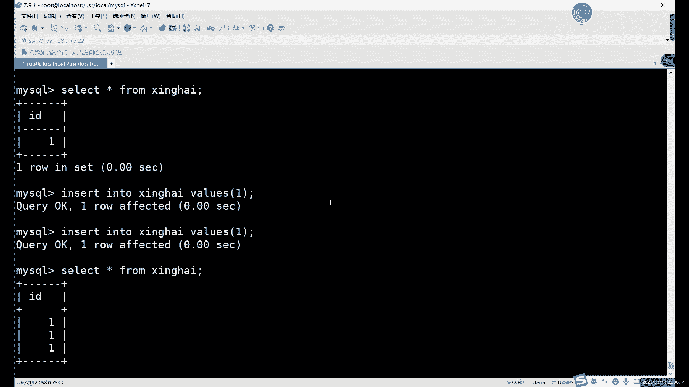

# 【小白入门必备】Linux运维进阶RHCSA+RHCE最全培训教程视频合集 - P65：中级运维-3.MySQL介绍及安装-下 - 洋洋得IE - BV1nN4y1X7Go

能够给我们显示啊，不至于乱码，然后呢啊下面这个就是存储引擎了啊，存储引擎的话就是我们MYSQL的一个核心啊，大脑这个我们后面会介绍，大家就先知道我们目前的目前5。7里边啊。

主要就是用这个WINDODB的数据库啊，或者不说就是传中引擎啊，有地域的成本，也相当于是如果说更换了这个存储引擎的话，相当于什么呢，相当于给我MYSQL换了个系统，啊它其实就是类似于CPU系统吗。

这么一关就是这么一个位置，换了这个程度与情况，它就相当于是把我们这个按数据库的工作，模式啊，啊修复的特性啊，还相当于更换了一下，然后呢user呢就是MYSQL啊，user就是MYSQLMYSQL。

这里的话就是我们刚才创建的那个啊，就是我们刚才创建的，哪儿啊，在这对吧，对我们创建的这个数据，那就是这个叫，刚才是不是对耳机，感觉右边的耳机是不是有点问题，这样的话是不是声音就有点小，我不能是耳机坏了。

要是换了个耳机啊，现在是不是有耳机有点问题，然后的话我们接下来看一下，下面设置的话很多啊，包括一些连接设置啊，内存设置呀，存储引擎的设置啊，以及日志的配置啊，复制的选项啊。

这些的话我们后边用到的时候就具体再说啊，我们今天的话就暂时先看这一本啊，就是基本的设置啊，大家可以把这个直接复制到哪，复制到这个，复制到这个配置文件里边，当然了，复制前呢强调一下啊。

嗯my就是这个one note可以直接复制PDF的话，它因为转换格式之后呢，他那个它会强制换行，就比如说这里，我找一下啊，就类似于这里，因为你看我这里这个one out，它有点问题，不是说有点问题。

就是它这里太长了，拐下来了对吧，这里其实我是一行，这里是一行，然后呢你如果说你用PDF去复制的话，它会直接怎么了，他会直接把这个作为开头，就把中文作为开头了，这样的话配置文件会报错的，大家注意这一点啊。

强调一下，强调一点，因为之前PDF格式怎么说呢，转换格式的问题很大，然后呢，接下来的话我们就具体来配置这一部分内容，对吧，包括什么呢，包括这个创建目录。

创建用户啊，创建目录啊，以及什么，以及用这些配置文件的问题啊，我们这这个的话基本上就是什么，就是一些基本设置啊，基本设置，首先呢先创建用户啊，group创建啊，Group a d d。

创建一个MYSQL的，当然先生后创建一个组，然后呢再创建一个用户，然后这里的话我们把这个，创建我们这个MYSQL用户的话，创建好之后呢，相当于是我们最后因为要，这里要给一个数组数组。

所以说呢我们的用户和组这里都要创建对吧，我们这里都要创建，然后呢我们切换到了右上角路线的MYSQL，也就是我们的安装路径下啊，这是我们的安装路径，安装路径里面我们会创建什么呢，就是创建很多个这个。

目录就是我们刚才指定的一些数据目录啊对吧，配置文件目录啊，包括一些临时目录等等等等啊，user下logo下的MYSQL啊，data目录包括什么呢，TMP临时文件的目录，etc啊，配置文件的目录。

Logs，日志文件的目录创建好这些之后呢，我们直接把权限呢，给到MYSQL用户和MYSQL组，这样的话我们相当于什么呢，就相当于可以用这个MYSQL用户啊，以及MYSQL组来管理我们的MYSQL啊。

然后呢我们接下来最后一步呢，就是编辑一下什么，编辑一下我们的配置文件了，因为这里我们是刚创建的用户，所以说呢它里面配置文件也是空的啊，配置文件也是空的，配置文件这个东西呢怎么说呢，大家直接复制就行啊。

当然了，你想手打练练练练打字速度的话，我也不反对啊，意义不大啊，意义是真不大，然后编辑这个文件呢，呃打开它确实就是空的，因为我是我们是刚创建的嘛，刚创建的目录，但是系统里面它默认有一个。

但是里面设置太少了，我们就不用了，系统里面默认那个是etc架的卖点，三元红目录，你们进来之后呢，直接插入复制就行，需要检查的是什么，就是这一部分，但如果是弯道的格式复制进来没什么问题啊。

大家可以看到我这里上下键换行的话，会跳过中间的中文字，是不会跳过中间的汉字，为什么呢，因为它这里是相当于是一行，这两个是一行啊，这两是一行，如果你是PDF复制过来的话，它这里就会给你换行。

你就得把什么把这一行注释掉啊，或者删掉也行啊，你为了方便看的话，最好还是注释掉吧，因为你后面如果说想你配置文件，看一下这个具体是哪个配置什么的，解释什么呢，最好不要删掉，删掉的话，你啊少很多信息啊。

包括这几行对吧，你看看这几行。

你中文开头的，你就啊弯道就不用检查了啊。

PDF的话你复制过来呢，把这些注释一下，把这些注释一下，上面其实没什么。

主要是下面有一些这个注释写的比较长啊，这写的比较长好这里的话我们保存退出就可以。

什么呢啊，保存退出就可以，啊初始化开启了啊，初始化是什么意思呢，初始化其实就是，我们刚才不是创建一个目录嘛对吧，数据目录啊，etc就是配置文件啊，临时文件啊，机制啊，这里面它其实都没有东西对吧。

这是我们刚刚创建的，那初始化的作用呢其实很简单，就是什么呢，就是通过通过我们刚才的配置文件，给我们这些目录里面呢去导入数据啊，就把我们安装好的数据导入这个目录里边，我们才能正常使用啊，我就正常用。

所以说呢初始化的命令呢就是初始化，大家注意啊，目录的一定一定得在这个目录下啊，如果说你想要用这个命令的话，这是我们笔记里面这个命令。

笔记笔这个命令的话它是什么，它是用我这里用的是这个相对路径写的。

其实绝对路径的话，准确来说的话，这里应该是什么呢，前面需要加上user下的local，下边的my circle要这么写啊，这样写，这个是完整的命令，当然你如果我们现在已经在这个目录下的话。

就可以直接从B目录bin这里开始写，然后后面我们写什么，写一下这个默认文件的位置，默认文件的位置的话就写的是什么呢，写的就是我们要根据初始化的命令呢，是根据这个文件呢去给我们的这些目录里边。

还可以导数据的，然后呢后边呢INIT呢就是初始化，然后呢用户的话就是我们刚才设置的用户，然后设置的用户，啊直接执行这个命令就可以，这个病例呢你正常配置文件啊，怎么说呢，就是跟配置文件型没什么关系啊。

一般情况下不会报错啊，这个命令不会报错，但是在初始化呢，你只能什么呢，嗯只能用一次，想要再次初始化的话，就比如你想要换个目录什么的，想要再次初始化呢，需要把之前几个目录里面的东西全删掉啊。

具体目录里面的东西要删掉才能才重新处理化，这个是强调的一个点，好吧，然后初始化之后呢，其实就可以什么啊，可以启动我们的数据MYSQL啊，可以启动MYSQL，但是呢，启动MYSQL这里有个什么问题呢。

啊启动的话，你可以直接用这个MYSQL这里的兵目录啊，B目录里放的就是命嘛，对吧啊，B目里面放的就是命，那这个命令呢有什么问题呢。

就是，对我这里就就就要说这个问题，加入这个CD control命令啊，假设方法的话，这这其实只是其中一种方法啊，这这个只是其中一种，就是把我们这个治理的命令，直接拷贝到etc i的IT里边啊。

就就相当于是加入了啊，很方便，原盘装的一些命令啊，或者说是唉，就是只要不是通过rpm或者说YM安装的，都是不能直接用这个system control命令进行管理的啊，只要管理的话，就必须得什么呢。

必须把这个加进去，一般情况下很多服务里面都自带的一些文件，我们这个文件是在哪呢，是在user下，我看user下的logo下边，开机启动也可以加啊，可启动也可以加嗯，这里的话主要是我们先把它加入到哪。

先加入到这个系统啊，现在加入系统服务里面啊。

先加入到系统服务，也就是c team control啊，那上面这个是什么，上面是不是环境变量啊，也可以加入环境变量里面，环境变量的话，这个其实就是声明一下我们这个，这个拉到最底下啊。

证明一下我们这个export mysql的一个安装路径啊，以及MYSQL命令的一个路径啊，相当于是在系统里面声明一下user下的logo，下边的我们的MYSQL以及什么呢，上面那个是安装路径。

下面这个是命令路径啊，下面这个命令路径，MYSQL杠home，B目录下的啊，这里的话就可以写，写全一点的话就是写这里可以不用变量，当然了，如果让你省略的话，就可以写上变量，可以写成变量啊。

这就是声明一下什么呢。

这里就声明一下我们这个MYSQL的一个主路径，以及我命令路径哎，就是告诉相当于是这部就是告诉系统，我们的MYSQL在哪买，告诉我MYSQL在哪，然后呢啊重新加载这两个都是都怎么说呢，嗯这个是重新加载。

这个是添加进去，两个的作用是一样的啊，重新加载的话，这里相当于就行了，重新加载这里的话就可以，怎么就相当于是嗯，然后自动识别一下，这相当于我们手动让它添加哎，手动添加环境变量的话，你加上环境变量之后呢。

怎么说，哎呦我打错了，打了个n e i exit。

我重新连一下，打错命令了。

我给打断了对吧，我们这的话没有启动啊，加环境变量的话，我们就可以怎么样，它其实类似于加环境变量，类似于这个，软链接，因为有很多你看其实安装好一个命令，安装一个软件之后呢，如果说不做软件啊。

或者不做环境变量的话，你不能直接的执行这些命令啊，你比如MYSQL命令，我们如果不加的话，他能直接执行，管它不能因为他找不到MYSL命令在哪啊，这样环境变量呢其实作用的话。

其实就是让我们能找到这个MYSL命令，具体的位置啊，这是加环境变量的作用，然后下边这一步的话就是我们把这个啊，我们切换一下move user在logo下的MYSQL。

我们把这个sport file里面的这个mysql server，这个文件是干什么的，这个文件就是一个启动文件，启动一个脚本，我们拷贝到etc的INIT点D里边啊，就相当于是加入到我们的系统服务里面。

这里这里可以改名字啊，你想叫想叫他MYSQLD也行对吧，我不想让他加MYSQLD，我经常叫MYSQL啊，然后这里的话我们重新加载一下啊，重新加载配置啊，或者说是你添加也行，这两个命令选一个就可以。

选一个就可以，然后就可以用CD同c team control命令，Mysql，那我们就可以开启启动啊，或者restart start都行啊，都可以，没有报错的话就正常，如果报错的话，错在哪呢啊。

只搜到一个地方，就是配置文件，如果你是PDM复制的话，这里这部分确实容易报错，这个也这个只能怪什么，只能怪PDF，只能怪PDF，怪pf的识别的，它不太智能，不会把这个啊两行其实是一行内容。

它会它会当做两行来处理啊，就会导致这个什么的，就会导致这个问题啊，就会导致这个问题，还可以什么呢，就是怎么说呢，其实你报错一次你就知道了，你如果不报错的话，你其实有可能不知道我说的具体是什么。

就是重启开启这一步，如果报错的话，配置文件啊，配置文件回去改配置文件就行，也可以文件我们家的东西确实有点多啊，加的多的话，它出现换行的问题，换行确实容易出现问题，然后这里的话，我们这个。

现在就相当于已经启动了啊，已经启动了啊，黑字体也可以，黑子也可以，对吧，这CONFIGCONFIG加上MYSQL2啊，A自己啊，这个的话嗯启动之后我们看一下状态吧。

主要状态正常，那我们就可以进入了，但是呢这里有一个问题啊，源码安装和刚才我们的亚马安装呢，它路径不一样，不仅仅是我们的安装路径，还包括一些这些日志路径啊，其实全部一样，全部都不一样，因为什么。

因为我们源网上都是自定义的，你想在哪都可以，你哪怕你改个，比如说你想要在安装的路径目录下行不行呢，没问题，可以啊，因为是自定义的，所以说安装在目录屏录下的存在啊，嗯啊一般不建议安装在入同目录啊。

正常我们装在这个user目录里面啊，或者说etc目录下是吧，这些目录呢是比较常见的一些软件安装的位置，然后接下来呢查看修改密码的话，这个我们需要给大家强调一下啊。

强调一下。

啊强调一遍B，刚才我们数据库已经装好了，但是使用使用数据库之前呢，我们需要做什么呢，我们需要把这个密码弄出来对吧，RPM的一样么的都一样啊，那他俩是一样的，因为都是R片包。

所以说都是VR下的log下的MYSQL点log固定啊，绝对固定圆盘中就不一定，这个是根据什么，这是根据我们自定义的路径去看的对吧，像我刚才自定义的路径是这个啊，如果说大家想改是可以改的啊，是可以改的。

就是user家的路线的mysql logs叫erroid log，后边这个是固定的，后面这部分啊，它是log目录里面log是目录里面的ADOL，就是固定，前面的话都是自定义的，前面可以自定义啊。

当然这个其实也不能说完全固定吧，它也可以在配重件里的啊，它也可以在配置文件里面，所以说呢总体上来说呢就是源码安装呢，嗯哪儿都是自定义的，就是从头到尾就都很自由啊，可以自动自己去设置。

然后呢MYSL刚一入的刚拼命玩这个，刚这刚才已经用过了这个PADOOR，这里呢它是个函数啊，它这个函数不是说一定要用它，就是尽量是用啊，尽量用这password。

好我们现在来看一下密码吧，看一下这个源码安装的密码，它的位置呢就是在user在logo下的，我也打全一点吧，user在logo下的MYSQL里面的logs目录里的error log。

然后呢这里的这个倒不用过滤，它里面没什么信息啊，因为还没有起啊，刚刚启动还没有其他的一些信息，所以说呢但也不用过滤，不用过滤，啊这个就是我们的密码，你看它不一样啊，你每次它就是完全随机的。

大家的密码都不一样啊，MYSL杠又root杠P这么近就行了啊，因为这里打不打空格呢。

你随意都行都行，啊进来之后呢，第一件事也是什么呢，也是改密码啊，在摩尔这里呢，还是在PSD，我们还是用加密函数啊，为了什么呢，主要还是为了安全性考虑对吧，安全性考虑，所以用加密函数，还没报错啊。

还没报错，为什么没报错呢，因为源码安装它默认没有什么，没有这个子弹度要求，这也是这是一个区别点啊，源码安装呢，我没有那个要求啊，没有设置那个要求的话，这里的话我们就可以设置密码为一。

唉不是每次都进来要修改密码，上次不是YM安装的吗，这个我们现在是源码安装的，源码安装的就是安装的第一次需要修改，ml以后就不要不用了对吧，你比如说这次X退出之后呢，你再进去对吧。

就不用改密码就可以直接执行命令，就可以直接执行命令啊，编译安装的时候，最后再强调一点，就是make啊，make命令啊，那个杠G呢你不能随便写啊，你虚拟记有几个，你写几个虚拟进哪有，你有神，你有事儿啊。

你12个有12个CPU也可以设置，但是你12CPU的话，内存的话，你大把它大一点，怎么也得五六个G啊，七八个G的内传统，啊具体2G内存，你这不开玩笑吗，12GC12个CPU，对于2G内存。

你觉得这是对等吗，这对吧，你CPU运行起来，你内存根本空间都不够对吧，所以你十二十二个CPU，2G内存太夸张了，你这个头重脚轻的，这属于是头重脚轻了啊，大家为了防止报错make命令。

比如说绝对不会报错的，因为他只用一个CPU速度是慢一点，但是呢它占用的东西，占用的空间或者占用的内存不是很多，它就不会报错，你如果是妹高级特别高的情况下呢，那就属于是内存直接爆死了，内存爆死啊。

报错是内存的boss啊，这个CPU内存我说的是虚拟机啊，不是说物理机虚拟机的，现在的话我们就已经进入到我们MYSQL里面了，对吧啊，今天第一天我们也不会讲太多命令了对吧，我让大家记住的命令。

首先第一个MYSQL杠u root，这个记住了对吧，第二个我们的改密码的命令，这个也要记住set password啊，这又是个命令，接下来我再讲几个简单命令啊，再加几个简单命令。

我们的一个基本的操作的命令，990MC杠J，如果说你999的话，哪来那么多CPU跟线上还剩多线啊，对有一个问题就是啊，MYSQL命令行里面是没有股权的啊，Mysl mini，然后里面没有股权。

正好练命你呗对吧，大家不能说一直依赖这个股权啊，这个MYSQL这个命令行里面它是不支持股权的啊，当然如果你用一些其他远程软件的话，应该是有的，所有软件有股权，MYSQL本地它没有补全名对吧。

你练习阶段你要什么股权对吧，你就老老实实打呗，啊你多打才能记住啊，这个前期你不要用那些补全的东西，然后的话我们接下来看一下什么呢，来看一下这个基础的一些命令，我们不说太多说太多，首先呢第一个。

进入数据库对吧，我们以前已经进来了，进来之后呢，我们可以看一下数据库当中的一些信息啊，看一下数据库当中的一些信息，包括什么信息呢，我们有一些这个，my circle对吧，MYSQL数据库信息查看。

我们这里用的是什么，第一个命令的话是受啊，受命令展示查看的意思，他能看什么呢，一般就看一些我们的数据库当中信息，包括我们这里边数据库里面有哪几个库对吧，有哪几个表，首先第一个数据库这几个单词。

这这些命令的话提前记得记住，所以不是很难对吧，这their base数据库的意思，那show datase呢就是查看数据库的意思嗯，查看数据库，这个是什么意思，就是查看我们当前系统里边唉有哪些数据库啊。

这个查看数据库的，然后呢show还能看什么呢，还能看表格啊，show tables啊，这个命令是看表格的，当然了，这首歌的话我刚才说了对吧，我最开始说这个。

存储的数据，存储数据的流传度里，我们说过，首先我们创建好数据库之后呢，我们是要是要先上吗，先怎么先创建数据表对吧，创建数据表是在哪，是在某一个数据库当中的，也就是我们这里其实如果说你要查看表的话。

我们一定要在哪呢，一定要在某个数据库当中啊，就是在某数学当中，就比如说我们这里是有几个呢对吧，有这么几个四个吧对吧，四个数据库，这几个数据库呢啊是默认的系统，你装好之后呢，就自带的。

然后比如说如果说你要想看表格的话，直接受TVS行不行呢，嗯他会报错，他会报一个什么错呢，他会报NO database啊，就是没有数据库可以去查询，然后再强调一点，就刚才没有说。

一直没有说就是封号的问题啊，就是数据库里面呢，所有的命令就加上封号执行就行啊，所有命令加上封号执行，然后的话这里呢，比如说我们现在随便切换一个啊，我们切换一个叫这叫MYSQL吧对吧，这个名字怎么说呢。

这个数据库一看就不一般对吧，它能和我们的这个软件的名字一样，那说明这个数据库呢很牛逼对吧，很牛逼，他数据库有啥用呢，我们先切换过来啊，Use mysql。

然后这里报了一个什么database change，就是数据库改变了，现在我们就已经切换数据库成功了，然后这个时候呢我们用什么用show tables就可以看。

这table可以看的话就是哎就是密表格很多啊，表格很多啊，里边最重要的是我们经常改的是哪个，经常改的是user user，什么意思，用户，啊也是MYSQL数据库里面存放的。

主要就是MYSQL的用户密码权限这些信息唉，就是在我们的MYSQL库里面啊，当然还包括一些这个，服务器的就是我们这个MYSQL的一些配置信息，也是在这个库里面啊，也是在这个库里面。

然后呢这个就是show tables和show database，这两个就是查看的命令，然后show命令你其实能看到很多啊，剩下的话，其实我们后边具体讲某某某一些功能的时候，我们还会用到寿命啊。

总之大家记住受命令呢，它就是查看目功能，查看查看信息，表示信息啊，库子信息啊，包括后面我们涉及到非常多的一些功能的话，可以查看这些功能的信息啊，这个就是寿命的作用，然后刚才就是我执行了一个什么命令。

刚才我又命令对吧，切换数据库的，那没有没有没怎么说啊，又是那个就是切换数据库的命令，因为我们这里边就是每个就是MYSQL里面，它有很多个库，默认只有四个，你后边再做练习的时候，我们是需要什么。

我们需要创建第五个数据库，为什么要再创建一个呢，啊系统的默认色库的话不要随意改动啊，因为里面存放的都是我们的一些系统的数据库，里面一些用户啊，用户密码权限啊，就是关于我们的MYSQL的一些设置。

基本设置，所以说呢系统里面的这一部分不要随便更改啊，不要随意更改，user库里边就是user表里边的话，这个里边怎么说呢，寿命令他不能看啊，你想看寿命令他不能看的啊，说明他其实不能看，说明就不能看。

那怎么办呢，这里的话如果说你想看某个表格里边的话，寿命令他只能是看一些信息的，看数据的话是寿命令，不能看寿命令他不能看数据，那看数据怎么办呢，select不知道大家应该听说过这个命名对吧。

增删改查就是我们数据库的基本操作，增删改查里面的查select啊，这个我们后面会具体有一整节课，有一晚上我们都会讲这个命名啊，不用着急啊啊，我们就先可以看一下这个表格，加上这个user表啊。

大家注意一定要加上封号了，你不加封号的话，它就相当于什么，比如我这里不加个封号，你执行它，它也不是说他不报错，但就是不执行，然后你在下面再加上这个封号就行了啊，大家这个封号就可以了啊。

这个命令就是查询某个表格的信息，查询表格某个表格的双方数据，这个我们后面会继续讲啊，大家先知道就行了，flag命就是查询的表格，表格当中的数据啊，它和社会不一样，show我们是查看的。

查看一些啊基本的数据，那就是啊基本的信息库啊，表啊之类的，这个我们看的什么，这个我们看的是这个user表格当中的数据啊，它很乱啊，很乱，怎么说呢，为什么这么乱呢，其实也不是不是怪数据的问题。

说怪我这屏幕太小啊，这个是函数Y屏幕太小，或者字体稍微有点大，因为它这个列非常多，所以说会报这样的错，而不是他没报错，怎么说报错了，它就是什么，它就是裂太多了，它一一个屏幕显示不出来，就是堆积在一起。

看起来不是很好看，所以一般情况下我们都会都会什么，如果说碰到一些比较宽的表格，我们怎么去查看呢，你就杠G看D的话就是什么意思，但是我们不正常，不是一行一行的显示嘛对吧。

我们这里的话就可以直接把某一行的内容呢，单独拿出来，哎这样就整齐一点了对吧，稍微整齐一点，这里的话就是这个user表格，里面存放的就是用户的密码啊，权限啊，这些东西哪个是密码呢。

这个就是密码为什么这么长呢，就是因为我们用什么呢，用password加密了，如果你没有加密的话，这里他就会把你密码直接写在这里啊，如果说没有加引同学的话，那我看到有阴阳。

有同学执行的时候没有加PSA的函数对吧，那就会直接把这码写在这里，这样的话怎么说呢，这其实你练习都无所谓了啊，这密码啊以及一些权限信息，这些就是权限，我们后面会自己会输啊，都是一些命令啊，都是些命令。

我们今天这节课不会讲太多，我们就先大家先了解一下这个，先学几个基础命令好吧，受命令说完了对吧，右侧命令切换数据库，说完了，接下来我们就创建一下吧，因为我们后边呢后期学习命令的话，我们刚才也说了。

要需要在哪，需要在单独的就在其他数据库里面去做。

所以说这里就我们就开始什么，正式的去开始学一些circle语言啊，这个语言首先呢第一种我们先主要看什么，create创建，因为我们现在什么都没有，就因为现在就相当于是除了数据库。

除了系统的默认数据库以外呢，我现在是一无所有对吧，什么都没有，那怎么办呢，就只能是我们自己去创建，用什么用create命令对吧，创建的英文单词吧。

创建库就用database就可以了啊，就比如说呢大家可以现在啊，现在现在我们不是有受DTABSES吗，四个who啊，我们今天先创建自己属于自己的数据库，还用自己名字创建嘛啊。

可以用自己的名字创建create database，哎，就是创建数据库后边加上名字啊，这个命令用法很简单，就是create the base，前面固定，后面加名字就行了，当然名字不能重复创建工作。

啊你可以写上自己的名字对吧啊，我们创建一下属于自己的数据库，后面加上括号啊，MYSQL里面执行命令的话怎么说呢，有返回结果就是正常的对吧，有一些命令的话，他不会返回一些具体结果，就比如说你创建数据库呢。

它没有什么结果，他只是告诉你什么创建成功了好，OK那就创建成功了，好，看到这里没有啊，这个是什么东西，这就是我们的时间啊，我们执行一个命令，其实非常快啊，非常快，这里的话0。00秒，0。01秒都不到。

也就相当于是一百十不到10ms的时间吧，就可以执行命令对吧，你看这里我们直接查询的命令对吧，查询了这么多信息，他还是不到0。01秒啊，也就是我们这个MYSQL的速度怎么说呢。

虽然说我们现在数据量不是很大，但是现在其实我们已经有了很多，是系统默认的库了啊，系统默认数据其实已经有不少了，看这个速度对吧，这不比这个我们直接用磁盘存数据来的快对吧，这个其实怎么说呢。

这个就是数据库的优势啊，我们最开始上课的时候说到，数据库连接的软件其实有很多啊，数据库连接软件有很多，其实每一款数据库其实都可以用什么的，基本上你市面上啊就比较市面上用的比较多的，就正是这个怎么说呢。

正是也不能说上架吧，这应该叫市面上用的比较多的数据库呢，其实都可以用远程软件直接连的，都可以连，连上之后呢啊都能操作，都可以操作，但是我们这里主要讲什么，我们主要讲这些啊，MYSL的一些基础命令。

你如果说用那些图形化界面代替的话，那其实怎么说呢，它里面就相当于会省略很多命令啊，省略很多命令，就很多操作，它就不是什么，就不是命令来操作，那不是命令操作，学完这些基础命令之后呢。

直接如果是直接去用这些软件，其实非常简单啊，非常简单，因为这个要命令熟悉的话，用一些软件其实就非常轻松，非常轻松，啊正常管理数据库的话，其实一般情况下也就是我们装好这个MYSQL之后啊。

装好MYSQL之后的，你可以直接直接在那嗯，最好是你管理的话，可以是为了效率更高的话，肯定还是用一个远程远程的软件更好一些啊，远程软件更好一些，它能简化一部分命啊，简化一部分操作啊，简化一部分操作。

那效率稍微高一些啊，效率高一些，然后这里的话我们接下来具体来看一下，我们现在已经创建好了对吧，创建好了查看我们就可以用什么，直接用show database来查看对吧，我们这里又多了一个什么。

多了一个库，买多了库就是我们属于自己的库，我们接下来呢，哎就可以在这个库里面进行操作啊，在这个库里进行操作，然后的话我们接下来唉执行了这个show database之后，我们接下来看一下这个是创建什么。

这个是创建库，创建好库之后呢，我们就可以在库里面去具体创建一些表格，比如我们这里use切换一下数据库啊，我们直接写上我们这个数据库的名字啊，就可以切换，切换完成之后呢，我们就可以直接什么呢，再创建啊。

这次创建的话，我们这次创建什么创建表格啊，创建表格来创建表格的话，这里其实我们只是，今天先简单创建一个小的表格吧，因为表格的话想要创建的，它并不是说像库一样，随随便便就一条命就完事了啊。

穿越库其实很简单，就是query with，加上什么，加上表格，还有加上库的名字，而什么呢，而数据创建表这里大家可以看到，我在创建表这里前面又加了一个加了一个选项，什么叫确认字段嗯。

确实为什么这个是确认字段的啊，或者字段是什么意思，字段就是我们刚才excel里面那个表头对吧，表头就叫字段啊，我们在数据库里边我们叫什么，我们叫字段，那确认字段呢其实就是讲就是说白了就是什么。

就是确定一下啊，你这数据库里面有哪些什么的，有哪些有哪几列，就说你这个表格是干什么用的，就比如说你存放一些基本信息的话啊，遥控器没信息，你可以创建一些，比如说ID对吧，姓名性别年龄对吧等等等等。

这些呢其实都是要怎么都调字段，而在创建表格之前呢，我们需要什么创建一下，这个不是说创建字段，创建表格之前需要先想好像想要什么字段名字。

就比如说我们create table啊，Create table，这里的话我们可以创建一个，比如还是用自己名字啊，还是用自己名字create table啊，心海对吧，就是创建一个叫星海的表格。

那这样直接创建行不行呢，对吧，你看格式和创建数据库一样，直接执行可以吗，他不行，还有什么报错呢，数据库的话，它其实可以是一个空壳子啊，它可以是个空壳子，但表格不行啊，但是表格不行。

在这个我们的数据库里边呢，我刚才也其实前面也提到了，我们要有什么要有规则，或者说什么，或者说要有限制，什么意思，如果说你只是创建了一个表格而进去的话，你后边再插入数据。

那相当于什么没有什么没有那个限制对吧，你如果是空表格的话，你这是想插入，想插入什么都可以插入，这就相当于是违背了我们这个关于数据库的一，个特点啊，所以说怎么解决这个问题呢，就是他这里就是不让你插入。

不让你创建一个空表格啊，想要创建表格呢，至少有一列，至少有一列啊，那这一列的话必须得是什么呢，就是great，table加上什么，加上这个表格的名称啊，括号里面具体写什么呢啊写这个列的名字。

就比如说哎，我们其实上面这个就可以看出一个简单的表格，当然它其实并不是表格，它只是显示出来这么一个信息而已啊，这个它只是显示出来这么一个信息。

他不算表格好吧，他不算表格，但是我们可以参考它这个结构对吧，这个是相当于什么，这个相当于表头，它就可以近似的看成什么，看成字段啊，它是可以近似看成字段的，然后呢我们如果要想要创建一个表格的话。

那我们至少得有这么一个结构对吧，有表头，然后呢有一个限制条件啊，有一个限制条件，这里的话我们可以直接create table，后面加上什么加上，比如说，那我们就随便写一个简一个简单的id对吧，公号啊。

学号啊，另外这个id号，然后呢后边呢我们需要限制一个条件啊，这个条件的话我们下节课会具体讲，这节课的话，大家先了解一下啊，整数啊，这个这个东西它叫整数啊，什么意思呢。

就是我们限制这个这一列呢只能填整数啊，这个就是一个规则啊，这就是所谓的我们刚才说到的，关系数据库当中的一些规则，这就是一个最简单的规则，就是限制这一列呢只能写整数，这样可以了吗，这样其实就可以了。

就是这里的话我们就创建了一个最小的表格啊，非常小的表格就只有一列啊，你一定能不能算表格上，它也能算能算表格啊，我们再创建就行了啊，这里不OK了啊，出来表格呢稍微花了点时间，用的0。01秒啊。

这个稍微花了一点时间哎，创建好之后呢，我们来看一下，刚才我们不是用select，我看一下啊，没有那么select啊，我用过一次，那么select来查看啊，打开新的话就代表所有内容啊。

form后边呢加上表格的名称，啊这是查看那个表格里面的一个详细信息，当然现在的话你查看的话其实没什么用，为什么呢，因为我们表格里面没有什么数据啊，它也是空的，empty空的表格啊，call的表格呢。

那我们刚才创建的东西在哪呢啊，我们得用其他的命令，就比如说DESC这个命令是可以用来查看，怎么查看我们表格的结构的啊，就比如我们BC后面加上表格名称啊，就可以看到什么，看到我们的表格的结构。

我们只有一列，这一列呢叫ID啊，限制条件的话就是刚才的整数啊，整数11位整数啊，默认是11位整数，然后后面这些话都是一些这个限制条件啊，我们下节课会具体去讲啊，限制条件，这里大家可以先先看一下啊。

先看一下这里这里就不说了啊，说了大家可能又嗯不太明白不太明白，啊这就是一定啊这个比例，那创建好这个表格之后呢，我能不能给它里面差点数据呢。

啊我们今天就讲这么几个命令，我们讲最后一个啊，插入数据，insert插入数据，insert insert插入的意思，命令完整的是insert into哎，就是往里面插入，往哪插入呢，目标是谁呢。

目标是我们的表格，啊就直接去向表格当中插入信息，最准确的说是插入数据，in的格式就是insert into，加上表格名称，再加上value value。

这个就是直的意思，或者说叫数据的意思啊，我们正常插入就是在MYSQL里面插入数据，就是insert into values加什么呢，加上值啊，当然中间的我还有表格名称，比如说啊我们写一下他们的表格。

池子里面我们加什么，括号里面写什么，就写我们想要插入的东西，i id嘛啊我们只能写什么，我们这里有限制，只能是整数啊，INT就是整数的限制，所以我们这里只能写数字，而且只能写成书。

比如说我们插入一唉这里就OK了，插入之后呢，我们能不能查看呢，现在就可以了，有数据了对吧，我们这个表格就有数据了啊，这个就是最简单的，这个我们今天说到的几个创建对吧，创建表格create啊。

插入数据呢用什么用insert into啊，加values，这个这三个你可以一起就需要一起记，因为这三个是固定的用法，insert into values中间加上表格的名称，后面加数据资料的查询呢。

就是用来查看我们表格当中的数据啊，这你可以多杀几个啊，这的话它就相当于它是往下排的，因为它是一列，它是一列，它不可能是他不能横着走，它是往下走啊，往下走，比如我们再插一个啊，插了三次对吧，它就有三个一。

let sing from对吧，还有三个一啊，这个的话就是什么，这就是carl mini insert into dnc的话就是什么，就是这个查看我表格的一个结构，唉说白了就是查看什么，查看这个表头啊。

它有什么限制，那就查看表格的表头的限制啊，就是id这里id我们有什么限制，其实后面都还没有，就凑边是默认的，我们前面就加了这么一个NT诶，就是整数的意思啊，整数的一个限制。

如果说后边唉我们后边这些限制规则啊，唉准确或者说叫约束什么的，这些的话我们下节课就会具体讲啊，我们关系数据库里面的一些规则呢，其实还是很多的啊，还有很多规则的，这些规则的目的是什么呢。

其实就是啊让我们在创建这些数据库的时候呢，不是说啊随意的去创建啊，就是插入数据的时候不要那么随意啊，如果你随便查数据的话，你这个比如说你这一列里边有小数，有整数对吧，你查询起来它就其实就很麻烦啊。

查询会降低我们的查询效率，为什么说数据库呢啊他那个管理数据啊，查询数据能力就比较好，比较快呢，就是因为啊和什么有关系呢，就和我们这些规则限制有关啊，你限制这些规则，那这一列呢它就只有这一类型的东西啊。

只有一类的东西查起来就非常方便啊，方便，然后这些的话就是几个命令，但是今天面积不多，但是今天主要目的是先把这个MYSQL装好啊，用源码用源码装吧，因为你用rpm用样本装的话，有很多设置呢。

而且后面还能改很多设置，很麻烦啊，不如一次性用源码装好就行。

然后这里的话这几个命令的话，大家其实啊把这个命令都记都记一下，再去练一下啊，我去练一下，然后下一个开始的话，我就继续讲什么，继续讲我们的SQL语句啊，SQL语句哎，讲几种不同的SQL语句以及什么呢。

以及一些规则啊，规则，或者说叫数据类型啊等等，这个是我们下节课的内容啊，下节课的内容，对这个最开始的话，其实你学术以后你先学命啊，你不要管什么学术远程软件没什么用啊，你学会命令。

你用什么软件其实都一样啊，你不回避的情况下呢，你用软件其实你点哪个什么功能，其实都不一定不一定弄弄明白啊，就是只要你把这个命令学好了，就是那些软件其实就随便搞，把联系就随便搞啊。

今天的话大家下去把这个MYSQL装一下啊，安装一下，有种报错可以直接发出来，其实报错的话，上课上学过一星期就解释了很多啊，已经解释了几个报错嗯，基本上呢报错的主要就是，其实主要就是两部分吧。

一命令呢复制的有问题，二呢其实就是啊这样子仓库如果没做好的话，也是会出问题的，因为我们这里用了很多样安装啊，虽然说我们用源源码安装这个MYSQL，但是其实中间呢还是用了几部样子的对吧。

样板安装的依赖关系啊，这些问题好，我们今天的话内容就这么多啊，对不对，下去把这些啊，把数据库装一下啊，我们最后在刷波E，我们就今天就到这里啊，刷波E我今天就到这里，最后放首歌，我们今天就。

今天就结束了啊，结束了，关系数据库，对关系数据库它就是最流行的数据库呀，啊流不流行的其实很简单，你就看一下官方给的一些排名就行，就刚才最开始这里对吧，这个排名呢就是官方啊，不能说官方排名吧。

这个就是数据库领域的一个权威的排名对吧，你看前十名有八个啊，或者七个，前十名有七个万叶，剩下的三种呢，剩下的两个是非观型的，一个呢是我们后面也会讲到的，ELKEXPERCH的一个数据库。

从这一目了然对吧，基本上怎么说呢，关键数据库还是占统治地位的，就是在数据库里面非关系当然也有用啊，但是就是用的使用量呢，远远是远远低于这个悲观，是远远不至于关系好吧，那我们今天的话就到这里啊。

最后放首歌，我们今天就下课了，下课了，大家后面有什么问题都可以直接私聊，或者群里面问都行啊。

