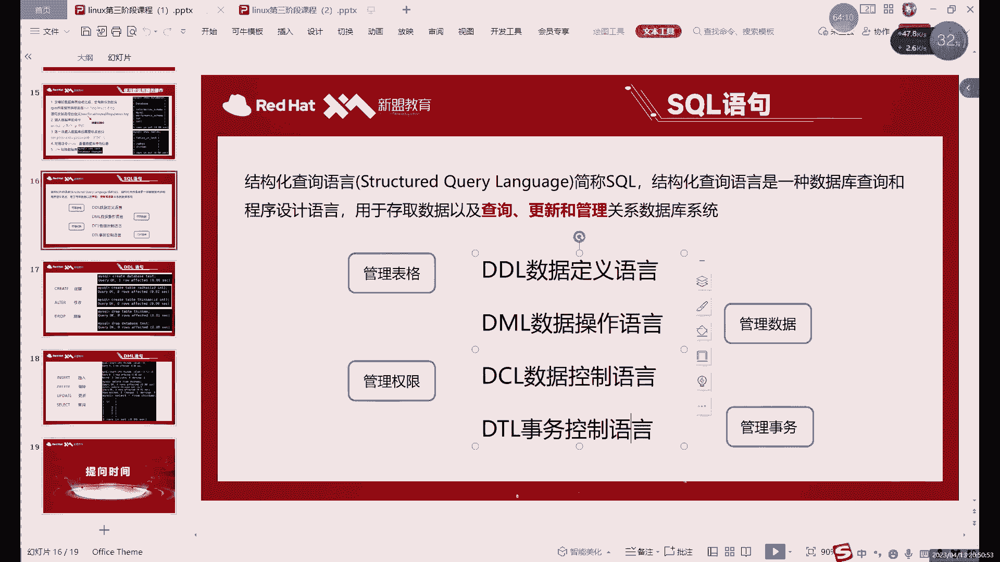

# 【小白入门必备】Linux运维进阶RHCSA+RHCE最全培训教程视频合集 - P67：中级运维-5.SQL语句，数据类型，约束-中 - 洋洋得IE - BV1nN4y1X7Go

啊虽然说不是那么致命吧，但是delete命令还是可以什么的，他可以直接删掉整个表格当中的数据，什么意思呢，就是比如说大家可以看这个命令对吧，这个命令是什么呢，deform哎，从这个表格当中删除。

删除之后呢，他还可以看到四行啊，34行为什么它为什么三个四行呢。

因为所有的就一共只有四行，当然我们这里是五行了啊，当然我这里也不太想全删了，全删的话，你再重新添加，哎我们可以把最后一行删对吧，我们可以删最后一行就是第一个符号，我们加上什么，加上这个表格的名字。

它代表什么，它代表就删掉这个表格当中的所有数据，所以这个命令也慎用啊，少用，我们这里就演再演示一个什么呢，演示一个删除指定的命令，的一个或者指定数据吧，删除指定数据的一个delete的用法。

delete符号我就删除所有啊，记住就行了，我们这下接下来主要点是什么。

以前是删除一部分。

比如删除哪部分呢，像我们这里还有一个空值对吧，有控制感觉看起来不是很好看，那怎么办呢，我能不能删掉它呢，那那就三倍啊，我就用delete命令，加一个where啊，就是在这个表格的后面呢加一个where。

where是什么意思呢，啊where的话在我们MYSQL的SQL语句里面的话，它起到的作用就是什么，就是限制条件，这个不仅仅是在删除delete里面，还有这个阿贝的更新啊，以及什么。

以及这个select查询的时候，这三个命令都会用到这个where VR的作用，其实就是限制一个范围，因为delete或我们加上我们表格名称的话，这样的话会删掉我们表格中所有数据的。

一般我们肯定不会这样做，这样和三库其实也没什么太大区别啊，只不过是范围小一点，三表吧对吧，所以说这里呢一般情况下你删的时候啊，我们都会指定一个哎就是有问题的数据，对吧啊，或者说插入错了啊。

我想直接给他删掉行不行呢，那就直接用delete命令怎么删呢，必须要限制范围，因为你直接这样删的话，唉相当于听了整个表格，那和删掉这个表格也没什么太大区别，所以说这里的话我们就需要什么。

需要加上一个限制条件，那怎么限制呢，来了可以先思考一下他怎么限制这个范围，就是哎怎么能告诉他，我告诉delete命令，那你要具体去删哪个呢，其实呢我们就可以从字段上进行一入手，来进行限制条件。

什么意思呢，按delete这里我们正常的话相当于delete form，就是从1~5全删掉的，那怎么限制呢，比如说id怎么才能告诉他，唉我想删的是这个叫星海的库，其实呢有三种方法啊，就是这个表格的话。

它有三种方法可以限制第一ID等于几，ID等于五，是不是心海对吧，那就可以删，dB等于星海，那是不是这个库呢也是还有一种呢，sensitive等于now，是不是是不是这个库呢也是也是，这里的话。

其实我们有三种不同的方法能够删对吧，一般常用的呢，更多的会用一些这个比较独特的一些数字，比如说像这个id号，id号的话，正常我们一般不会让它重复对吧，只要他不重复，那每一个数据库对应的id就是什么。

id就是唯一的啊，所以说呢我们一般就可以用这种哎，有唯一性的一些字段，或者说这个列啊，应该叫这一列，用来标识这个具体的这个值，这个意思就是什么，就是删除id等于五的这一行，大家注意啊，DP的命令呢。

我刚才说的就是DV的form是删除整个表格对吧，如果说限制它能限最大能限制到什么程度呢，它只能一行一行的删啊，它只能一行一行的删除啊，这个是demin delete in的一个限制。

他不是说你想删某一个格式的数据，行不行不行啊，它只能删一行一，这个就是什么，这个就是delete delete delete的删除，你今天一个嘴瓢，delete这个单词怎么这么难念呢。

delete啊删除的一个特点，I1等于五对吧，哎就对应了这一行啊，如果说有重复的怎么办呢，再加一再加一个限制，哎如果说你这个id还要一写，重复了啊，写了两个五，那怎么办呢，你还可以再去找其他的。

比如说XT或者说是dB对吧，比如说如果是dB的话，就是and dd等于，这样的话就是什么，就是你如果一个条件不够，没关系，我们来两个条件，两个博客怎么办，来三个啊，如果说你所有的条件都写上了。

他还重复的话，啊那那这个威尔命令它确实就没办法，没办法直接就过滤某一个值了啊，某一行某一行，然后一般情况下，我们会一般不会允许这种情况出现，我们都会什么都会，每一个表格中我们都会设置一个什么呢。

都会设置一个，比如说唯一的唯一的值，啊唯一的组，什么意思呢，唉就比如说这个的话是我们后边需要讲的一个，后面会讲的一个更特殊的限制条件，什么意思呢，就是嗯我们看一下是哪一个啊，嗯DSC啊，是这个啊。

这个K这里，K这里我们是可以设置一个唯一值的，什么意思，就是你这一列的数据呢就不能重复，设置这个值之后呢，这个列的数据不能重复了，所以说你删东西的时候，你就用这个去作为标准，啊这个就可以用这个作为标准。

用这个去算啊，系统不会创建自动的这个序列号的，但是我们可以自己去创建一个序列号对吧，我们自己创建一个序列号上，给它设置成一个唯一的值，设置成唯一的值的话，你后面插入的数据它都不会再去重复这一列呢。

就肯定就是独一无二的，每一个数据都是独一无二的，那这样的话啊，你后面参数的学习很方便的啊，后面删除就很方便，你看一下他是哪一列，就是哪一个哪一行的，ID是几啊，直接就delete vi id就行了啊。

我们班的表格上都会设置一个什么有唯一值的，一点不设置行不行也行啊，这样的话你早起数据来的话就不是很方便，这个其实一个一个什么一个做得比较好的，表格上肯定至少有一列呢，它的值是绝对唯一的。

就比如说你身份信息吧对吧，你身份息的表，其实你即使你不创建，它也绝对是唯一的，因为什么呢，身份证号，手机号是不是唯一的对吧，如果说有这些信息的话，其实你不用再创建了，那你身份证号呢是绝对唯一的。

手机号也是绝对唯一的啊，这个出生年月这些可能会重复吧，啊年龄啊，性别这些都会重复，是身份证号，手机号这两个绝对唯一的东西啊，这些都是可以作为什么，就你删除的时候一个标准对吧，方法很多啊。

那么其实方法就是删数据啊，找数据啊，方法是很多的，这个具体我们后边对吧，你查询数据的时候呢，我们会具体去说啊，自动添加一个数字的话，我们后面也有是哪一个呢，这个啊功能都有啊，就你能想到的。

其实数据库里面其实都有对吧，这个可以限制什么，限制唯一性，这个家伙呢他可以里面可以写一个什么，自动添加数字啊，它确实是可以自动添加数字，就是你只插入数据，它会自动添加，12345都能去加。

好这个的话就是delete命令啊，这是我们没有删对吧啊，我们可以删一下，删完之后呢，select信号from x h对吧，就剩下四个了啊，这个就是什么，这个就是可乐的命令，但是我这里还在插入回来啊。

有时候还有用啊，Insert into values，insert into表格叫什么SXH对吧，I d d d，五逗号，你看对吧，好那这个就是你再插回去啊，你插回去。

因为一会儿这个devise命令的用法就这么多，没了啊，就是david form加上表格名字，删所有想要一行一行两行，像删一行，或者说删几行的话，怎么删呢，就这样删啊，加威尔加息的条件。

如果只是删一行的话，你就去找那什么找有独特的，有独一无二的数据的一行啊，你应该叫一列啊，不能叫竖着是列嘛对吧，独一无二的一列去找这个值就行，如果说你是不是说只删除一列，就是删除带有某些值的数据的话。

那这个就无所谓了啊，你就找到这个数据呢，限制一下就可以啊，这个是删除的话就很灵活，删一行也行啊，删几行也可以，这个其实就完全看后面限制了，你限制的是几行，那删的就是几啊，如果说你是有目的性的。

只删指定一行的话，就是需要找这种唯一性的数据好吧，然后呢接下来的话我们来看一下什么呢，来看一下没有插入一个对吧。

有插入一个数据，接下来我们来看下一个更新对吧，更新呢，它其实就是修改例子，作用啊或者用法的话和delete呢嗯怎么说呢，有相似之处，不过呢更新它不用加from，哎好的是更新它不需要加from。

就直接update加上表格名字就行了啊，省略了一个from，加上这个名字之后呢，你后面就要就需要写具体需要修改的东西啊，就用set命令去设计啊，set命令是设置的意思嘛啊或者修改啊，准确的说是设计啊。

在我们这里，因为前面有update，所以说呢就可以理解成修改地址设置一个值啊，比如说呢这里的话，它其实和第一层有一个相同的地方，就是，如果说你直接这样执行DELETE啊。

不是produtic update，Dt update，这里面就没有problem了，直接上直接加上什么，直接加上表明，然后set，比如说system，我们改这个字段对吧，等于什么呢，等于是吧。

因为现在呢它我们的表格里呢，这个也没有值对吧，没有值，所以说呢我们这里如果说想改一下这个值，怎么办呢，这里的话就不用什么，这里就不能用insert了，因为我们这一行已经有数据了。

只是修只是这一个东西的话，我们只能用修改命令，不能用这个字的命令，然后怎么修改呢，就是update加上我们表格名字，加上set，加上这个字段的名字，就是设置一下这个，但是如果说你这样写的话。

比如说引号里面我们写个否无，这样写行不行呢，可以，但是呢它就类比于类比于什么呢，类比于这个delete delete from，加上这个表格名称的话，就删除所有，而update这里加上表个名字。

修改这个东西的话也是什么，也是修改所有这个命令一旦执行的话，就所有的风景都变成否用这个东西，肯定这个不是我的目的对吧，我们只是添加了一个修改这一个吧，或者说是所以说呢我们这里也用什么。

也用where where的话，这个东西我们会用很多啊，有很多大家习惯就行对吧，delete命令也需要用update，update命令也需要用后边的这个最重要的增删改查，有没有查呢，为用命令用的。

那就更多了啊，这个的话就是where加上什么呢，比如说我们这次还有什么，还有id吧，就用一个id指令就行了，I等于五个对吧，这样的话就是什么就是更新，那更新之后呢开始变成火了啊。

也是威尔的话就是delete以及update一个关键的地方，就是你不管说是用delete也好，用AP也好，where呢就尽量加上，因为你如果不加的话，容易误伤啊，什么意思呢，就比如说你dd的话。

如果不加的话，会删掉所有的，不加这个VR的话会更新掉，改掉所有内容，所以说这个的话就需要注意一下啊，这就需要注意where的一个作用就是限制范围好吧，限制范围啊，这个的话就是这个插入也好，更新也好。

删除也好啊，这几个命令作用啊，那有什么问题的话，可以直接发在讨论区里面啊，就是关于这点命令它还有什么疑问啊，没有问题的话，我们刷过一可以下一个休息几分钟好吧。

大家可以看一下这几个命令哪有问题啊，你先看前面几个是查询不不及啊，查询不及，先看前三个，好我们继续来讲下一个select，select上面三种的用法就一张其实也就一两种，你要真说其实他其实一两种都不够。

它其实就算一种用法啊，其实就算一种用法，那select下边就不太一样了，flag这边涉及的东西非常多，我们刚才呢查询这里用的是什么呢。

就是SLG的新from加上什么，加上我们表格的名字对吧，这就是查询的最基本用法，就是由什么呢，最少的话它必须要有这个表格以及什么，以及查询的内容，那这里我们用的是新号对吧，星号代表什么。

代表是整个表格里面所有东西，那他这里还能用什么呢，就是新号可以用什么代替呢，啊它等代替的只有什么，就是主要就是用字段来代替啊，一般就是用字段来比，就比如说如果你想只看id呢。

那我们就可以把星号呢换成id啊，可以把信号换成i id，什么意思呢，我们就简单演示一下，其实呢四命令整体上至少是两部分，一般是三部分组成的啊，就是select加上from加上什么，加上一个where。

就是我们上边update以及delete用到这个where，select用的其实是最多的，前面的话是一个限制什么，就比如说你看什么select，你就是看的是什么，你看完D就只显示ID对吧。

如果说我们只换成什么呢，只化成dB，那跟我们show database这个命令呢就是完全一致的了啊，除了上面这个，因为这里有已经这个database，我们不能设置，因为是相当于一个系统里面这个冲突了。

所以说呢我们只能是画画一个dd啊，换一个dB，你看这里的话，其实你就看什么，他就给你什么对吧，看什么就给你，就比如说就是看一个看一列内容，如果说我想看多列内容呢，就是id逗号dB啊，这就是看多列内容。

它后面那个也可以对吧，你像如果看dB加上这个system，就是啊这里能看出什么，这个表格能看出这些库哪个是系统库，哪个不是系统库对吧，最后一个不是系统库，其他前面上其实都是，那这个就是select。

这个其实用法呢非常多，我们后面会继续讲，主要前面这个的话就是看的内容from，后面是看的是表格flag，最重要的是其实是第三部分where啊，第三部where因为内容太多，我们这这个需要大概在。

下节课我们会着重去讲啊，着重去讲啊，首先的话我们这节课的话，主要内容先介绍一下这几种不同的语句啊。

是介绍一下整体的SQL语句，我这里其实alter命令我们还没有讲，alt命令，一会我们说完这些具体的数据类型啊，约束之后呢，我们再具体讲，然后呢这个DML这些数据的操作语言，前三种用法已经没了。

已经说完了，然后SD因为用法比较多，我们就先暂时这里先不说啊，暂时先不说放到下一个，然后呢SQL语言呢还有两种对吧，我们应该说第三种呢是数据控制语言，它控制的是什么，它控制的是权限，权限权限问题呢。

这个其实啊，你系统我们那个系统里面有很多权限对吧啊，读写执行对吧，这些是权限，那在数据库里面它的权限是什么呢，有读写执行官其实执行没有啊，但是读写是有的啊，读写是有的啊，像读的话。

那就是select的面积是读对吧，写是什么呢，写其实包括了insert对吧，update其实也算写，因为它算改嘛对吧，insert update包括delete其实也算洗吧，如果他是把数据给删掉了啊。

就是对于数据的修改啊，这些的话它就是权限，权限这里的话，一般是用来干，其实权限分为两部分，一部分呢是限制用户啊对数据操作，数据库操作的一个权限，就比如说你是否允许这个用户创建表格啊，插入数据。

删除数据啊对吧，这是一种权限，还有一种权限是什么呢，就是允许是否允许连接，什么叫连接呢，就是是否允许其他的主机去连接，因为我们正常对吧，我们现在是做了一台数据库对吧，装了一台数据库，那这台数据库呢。

能不能让其他的主机啊，或者说其他的这个啊电脑啊去访问啊，这个当然是可以的，但是呢默认默认它不允许需要什么，需要我们用这个数据控制语言去授予什么，授予权限啊，这个是第三种啊。

授予权限的这个问题我们也是后面去说啊，你看我们只是简单介绍一下这种这几种语言，然后呢第四种啊，第四种是什么，第四种是事务控制语言啊，这个是事物了啊，这个事物的话，一两句话其实就已经说不清楚了啊。

事故的话，这个其实就是控制我们啊数据库里边，数据操作语言的一种语言，就是如果用来控制他的，就是他呢这个事务控制的是谁呢，控制是这种语言啊，控制DML也就是第四个，它是控制第二个。

第二个我们还没有讲完对吧，我看不着不着急讲第四个啊，这里的话我们可以，其实可以把第三个先说一下吧，第三个的话这个管理权限其实嗯也是蛮重要的，后边的话我们会经常用啊，管理权限，但我们暂时其实用不到啊。

暂时用不到，但是我们先说一下，因为这个命令不难啊，这管理权限的命令不难，我们先说一下管理权限呢，他用到的是什么呢。

用到的是这里给大家看一下笔记吧，笔记里面是有的。

笔记里面有，然后我们这个它其实就是一个授权啊，他觉得是一个授权命令呢，只有两个grant和revoke啊，这个这种语言的命令非常少啊，其实这点来说呢，你说这个语言里面就是一个面，其实也行啊。

因为授权的话只用就是他来做的，great mini授权授权的是什么权限呢，第一我刚才说了访问权限，现在的话我们就比如说当前。

我们现在用什么用户登录的mysql root用户对吧，是不是没毛病啊，root用户为什么是用root有灯呢，这个是因为，我们在最开始安装好数据库的时候呢，系统第一次初始化的时候。

为我们生成的这个密码呢就是什么，就是root用户的密码啊，就是让root用户登录到数据库里面去，修改一下密码，创建一些允许访问的用户，然后呢才能其他用户才可以去访问啊，加用户在这一方面啊。

E x i t，然后呢这里的话我们看一下什么呢，我们用select命令去看一下MYSQL库对吧，这个第一节课我们其实也看过这个表格，就是MYSQL库里面的这个user表，唉这种语法是什么意思的啊。

这种是库点表是什么意思，就是嗯刚才正常的话，我们查看的话必须要在哪呢，必须要在当前库里面去查看对吧，你在星海库里面才能看XH这个表格，那如果说你想在这个，我们在青海这个库里面去看user表。

他不能直接看它必须要加上什么，加上who的名字啊，这个这一这两这一句话的意思，其实就是查看MYSQL库里的user表，然后呢，我们这里执行，还是很乱对吧，我们加上杠大G，大家记得的话。

比如说它的作用就是这样啊，把很快的东西呢用行一行一行的形式显示出来，唉相当于是把数据呢以行的形式显示，之前是用表格的形式显示啊，那默认的话我们是以表格的形式显示处理。

但是呢如果说你的这个表格的列数太宽啊，我们这个LINUX命令行里面是显示不出来的啊，就只能用什么，只能用钢大G来切换一下，然后这里的话我们用户的话就是root用户嘛啊，root用户。

然后包括两个系统用户，然后这里的话我们正常想要像其他，比如说我们一开始不是创建了MYSQL用户吗，不知道大家还记得还记得吗，就是我们在安装数据库的时候，我们是给这个数据库对吧，创建了一个管理用户。

但是我们一直还没用对吧，B站还能用，因为默认的我们只能进入入选用户啊，其实你是个管理用户，我们是把它设置成管理用户了，但是你没有，最开始不是说没有权限嘛，主要是没有密码啊。

密码的话可以在授权的时候去指定啊，密码是可以在授权的时候去指定的，现在的话我们可以什么呢，如果说想要让我们的MYSQL管理用户呢，能够登录到我们的数据库当中，怎么办呢，我们就需要用到第三种语言。

就是这个数据控制语言就是管理权限的啊。

具体用法呢就是GRA命令，用法很简单，它就就就一句话，大家记住就行啊，有一句话记住就可以，这是什么呢啊great命令加上加权限啊，加上库和表的名字，这个什么意思呢。

就是权限的话就在我MYSQL里面授予权限的，它并不是说一给权限就是给整个库的权限，但是不至于啊，我们是可以指定单个的表格啊，或者说单指定单个的库作为啊，作为它的一个授权的对象。

to后边加上这个用户的名字以及IP，什么意思呢，就是这个时候权呢可以允许本地用户登录，也可以允许谁呢，也可以允许其他主机上的用户去登录到，我们数据库的数据库当中。

最后一个identified by加上什么加密码啊，就这么几部分组成啊，这个MINU怎么说呢，是固定的用法啊，那既先主要记这个结构，因为中间东西可以换，需要换的那权限也好啊，库和表也好。

用户IP密码这些都是都是要求更换啊，每次授权肯定都不一不一样，所以说大家记的话就是先主要记住格式啊，多打几遍其实就能记住啊，就这几个英文单词啊，啊就几个英文单词而已啊，多打几遍其实就记住了。

授权这里的话权限呢很多，具体有多少呢。

我们这里先也没办法解释，因为这些命令都还没讲啊，已经讲过的也就是讲过几个对吧，Select insert，Update，delete create job啊，下面就没了是吧。

上面我们就讲过这么几个命令啊，这个每个命令呢就是我们讲过的每个命令，或者说每个SQL语句呢，其实都可以看作什么都可以看成一个，不能说看什么，就是它都是有权限的，就是对于用户来说呢。

执行这些命令呢能不能执行呢，就完全取决于我们这个MYSQL在user这个表格里边，是否允许它执行，就比如这个用户名是否允许，那不允许N的话就是NO对吧，如果说我们看到这个root用户对吧，全部都是Y。

为什么他用root用户嘛，管理员拥有最高权限啊，用的最高权限，所以说这里呢我们就啊前面几个点，我后面的话还没有说呢，啊都都没有说过，所以说呢我们权限具体的话，我们先不着急看，那如果说我想要授权啊。

授权一个管理用户来拥有这个root用户的权限，行不行呢，其实可以啊，但是呢怎么说呢，你即使这个用户的权限再高，那你也不是root啊，你也不是root，就是说关键命令，如果说我想要给一个用户。

就比如说我们可以MYSQL对吧，我MYSQL是我们一开始安装数据库的时候，创建的管理用户对吧，甚至我们这个数据库的这个目录，整个目录的话数组都是MYSQL，那我们给它所有权限其实也没什么问题对吧。

那所有权限怎么给呢，两种写法，我一般建议就写第一种哦，第二种是什么呢，第二种的话不太建议来写，privilege就是策略的意思，所有的策略也就是所有权限，所以说一般我写什么，我写这个啊。

你想记那个private也行，单词太长了，没有标记下两个作用是一样的，作用是一样的，grant on啊，就代表着所有权限，那后边呢权限的后面加什么呢，加的是具体的数据库，什么意思呢。

我们现在是一共有五个库对吧，你可以是把五个库都授权给他，也可以只授权一个或两个库的，这个是我们在权限里面是可以随意设置的，就比如说如果你想只想给他一个库的话，你就写这一个库的名字。

那如果说你想要给他全算所有的库怎么办呢，信号啊，信号的话我们在MYSQL里面非常常用对吧，就代表的是所有，它就是代表所有的意思，信号，然后呢at后边加什么I啊，不不不是at，应该是星点儿。

我们呢后面加表格，其实你前面是新的，后边怎么说呢，你数据库都没有限制对吧，你一般也不会限制表格了，一般情况下呢如果要设置表格的话，这里写的就是没同样也是表格的名字，不过你如果说前面的数据库没有限制的话。

表格我们一般这里不会限制啊，也不会限制，如正常这样写就可以，这就代表的是什么呢，新点新代表就是所有的库和所有的表，前面的二代表所有的权限，因为这个的话基本上就是基本上就是什么，就属于最高权限。

准确的说是应该是，root用户之下的最高权限啊，为什么这么说呢，root用户其实他是拥有绝对的最高权限，其他用户在MYSQL里边呢，其他用户呢权限再高也不能超过MYSQL啊。

甚至也达不到MYSQL那个水平，为什么这么说呢，我们可以先授权啊，授权之后呢给大家看一下效果，grant22新点心对吧，然后呢加上什么，加上这个用户的名字，比如说我们用户名字叫MYSQL对吧。

然后呢IP我们因为我们这个属于本地本地，我们就IP其实就相当于是local food，啊指定locos就可以，当然了，你如果写个所有行星上，也可以写所有啊，也可以写所有，只不过这里的所有的话不是百分号。

是啊，不是不是新号，是百分号，这个就代表所有的IP啊，本文化代表所有IP，我们这里就先只写一个本地吧，啊这个本地，然后都写IDENTIFIED，这个就是这个是密码啊，这是密码，密码这里呢你也随便随意啊。

这个的话是属于什么，这个其实是属于MYSQL这个用户的密码啊，它是属于MYSQL用户的啊，这个授权密码的其实就是用户的密码，因为这个用户呢我们想要登录数据库的话，就是通过这个密码去登录的。

所以说他这个虽然说是授权的秘密对吧，但是呢他其实也算是给这个用户呢，设置了个密码，甚至的它也有创建用户的作用啊，关键它也有创建用户作用，如果说你系统里面没有这个用户呢，执行啊，执行这个比如说系统令。

如果没有MYSL用户的也是没问题的，它会自动创建一个用户出来啊，这个就是什么呢，这个就是grant命令，啊great命令的一个用法，哎有点长对吧，比之前那些登山改查都长，所以说这个呢大家可以十遍以上。

我觉得你敲个十遍以上应该是差不多，这个命令不难啊，它是固定的嘛，因为用法是固定的，没有太灵活，因为这个grant are to at identified by，这几个连接词是不会变的。

他变了是指其中的内容啊，变的只是其中内容好，我们这里的话这个就是授权啊，授予权限授权之后呢，我们再连再开一个终端吧，这里再开一个终端，我就不退出数据库了，那再连一个东西，MYSQLMYSQL密码是什么。

没有好像得退一下，哎，不用退，我们连这个什么吧，连入信用户啊啊，MYSQL用户没有忘记忘记设置密码了，Password，Mysql，好我们设置一个密码啊，刚才没有设置密码，然后我们切换到MYSQL里面。

在这里我们再断开，再重新连一下，哦对我们一开始设置了一个什么啊，对我们设置过那个什么东西，想起来了，我们最开始的时候连接MYSQL的时候，设置过一个叫不允许它登录的一个设置啊，这是一个不允许它登录。

对啊，所以说呢我们直接直接直接用买这个命令，登录就行了啊，我们用root用户也一样啊，我们不用登用户，我们是用什么，我们是登录MYSQL啊，我们不是用MYSQL登录系统。

我们是用MYSQL用户呢去登录MYSQL这个软件啊，服务，比如说呢我们用MYSQL杠UMYSQL，我们就不用root了，这次我们用普通用户好吧，我们进入到我们的这个平衡一点，那时候也用一就行啊。

尽量啊这次呢我们就是以什么呢，以买这个用户的身份进入到数据库当中了对吧，然后我们可以来现在来看一下这个，看一下这个策略吧，或者说看一下user表格现在是长成什么样，看到没有啊，第四行出来了。

刚才是三行数据，这边就三个用户，默认只有三个用户，然后呢，现在我们创建了第四个MYSQL对吧，名字是MYSQL，然后我们可以看权限，Yes，yes对吧，全部都是Y，全部都是Y，这里的话就相当于什么。

就是我们的MYSQL拥有了什么，拥有了root用户下的最高权限，它永远不能等于root，为什么呢，就是因为少一个or里边呢少一个权限是谁呢，就是这个grant。

boy grant呢就是我们刚才用的那个授权命令，对吧啊，也就是普通用户呢，即使你拥有最高的权限，但你永远没办法做到像MYSQL，像root用户那样去给其他人分配权限，也就是也就是这里这关用权限的。

就只有路灯用户有啊，其他用户呢啊其他用户不配啊，其他用户不配哎，就是其实这个也是为了安全性吧，除了用root以外呢，其他用户的不允许他拥有grand权限啊，也就是不允许他有授权的情况啊，这个就是什么。

这个就是，my s就grant命令一个用法啊，grand用法，然后这里的话嗯，授权的话，欧文那里呢可以改其他权限，加权的名字叫什么呢，就是就是这个就写这一部分就行了，这就是那个权限的名字。

如果说只想求于单个权限的话，就这样改就可以，然后呢关于这个复合表也是根据需求去改。

用户也一样，IP也是一样的，密码你就随意，这些都可以随便改啊，这个就是授权的命令，那取消授权了啊，就比如说我后悔了啊，买这个用户不想给他这么多权限了，我想把权限给取消掉了，怎么办呢，直接用什么。

直接用rework命令去取消授权。

就比如说REVOKE，We work or，然后加什么呢，然后后边加上的是。

还是库点表，然后呢from用户和IP少了什么少了密码，就是取消重点的时候不要加密码，而且是从to换成了from，因为授权的相当于是给这个用户权限，而取消授权限，相当于是把权限呢从这个用户拿回来。

所以说呢就是介词变了一下，从to变成了from，然后的话我们这里rework权限取消二，后边加上互联表。

然后我们刚才应该是新点心对吧，好听点，听从我们的用户里面把权限给拿回来，怎么拿呢，from加上这个用户叫什么来着啊，我们是MYSQL用户对吧，我给MYSL用户一个权限，我后悔了，想拿回来，这样就行。

这就相当于把权限拿回来，拿回来之后呢，相当于取消了满足用户的一个登录，就比如说呢我们这里EXIT先退一下吧，还不如我们来先看先看表格，看看表格吧，唉看到没有Mac用户就没有了是吧。

他他他这个他这个内容还在啊，又是什么呢，他是把权限给去掉了，看把Y变成NO了，马上就相当于把外边人弄，这个就是什么呢，这个就是啊取消权限的一个用法，当然这个取消权限呢我说呢，进来之后呢。

其实你之前的话其实没有演示，没有看这个，没有看它的一个呃，怎么说呢，这边叫功能吧，比如我们这里受看一下data vs e s，看一下这个数据库啊，大家可以看到，怎么说呢，他有权限，但是不读啊。

因为受这个命令，他其实也不也不能说，他主要是说明他不在权限里面，受命令他不在权限里面，比如用其他的吧，就是我们看一个use my circle，哎，这是什么，就没有权限。

就相反过去估计切换的话就只能切换这个英方，没事能看到就，这个的话我估计是你看啊，information dem啊，切过去了，Show tables，啊这个表格就可以看出，然后呢。

比如说select具体某一个表格的话啊，select就是我们信号from，啊他也是什么也是没有权限啊，也就是什么呢啊寿命他们也完全限制，因为受的话他不在我们这个权限的范围里面啊。

但是呢啊而use命令也是啊，受命令啊，use命令啊，这两个其实没有完全限制啊，没有完全限制，因为这个on里面是不包括这两个的啊，但是呢通过对其他的一些查看啊，修改的限制的话。

就导致我们这里看不了其他数据库的一些，不是看不了其他表格的一些数据啊，也无法看到数据啊，这就是权限的限制，因为现在我们权限都没了是吧，你看看一个表格都看一看一下都不行对吧，SG选项都不给啊，这就是什么。

这个是授权的作用。

也就是我们的数据控制语言，主要是用来控制谁呢，控制我们用户的一个访问，或者说控制其他用户命令的一个执行，包括什么命令啊啊包括这个，增删改查对吧，包括创建删除，也就是这些命令都可以做限制啊。

只要是我们那个右侧表格里有的啊，其实都可以限制啊，当然了，因为use和show没有哎，所以说呢这两个相当于是有点有点漏洞，但是呢不影响啊，因为其他的命令一旦限制住的话。

这两个命令只用这两个命令其实也看不到啊，他只能看一些基本的信息而已啊，这个的话就是我们这个权限的问题，说完这些话，我们接下来来具体介绍一下什么呢，我接下来具体。

讲接下来的这些内容的话。

具体我的目的是想要讲什么，讲AUTOMMY啊，因为AUTOMA我刚才说了，他这里面修改的内容很多，但是我们都没有讲过。

有哪些内容呢，我们的数据类型啊，接下来我们就来介绍一下MYSQL里面的数据类型，以及什么，以及这个约束条件啊，这个是我们接下来具体要说的啊，因为说完这两个之后呢，我们才能具体再去讲奥特修改啊。

因为奥特利修改的改的就是这些改的就是数值，改的就是什么改的就是约束条件好，我们接下来看一下，首先呢，整数型，和小数型啊，统称什么统称数值也就是大家看到的数字，但这个呢不能从数据上来看，要从哪看呢。

要从DSC这么来看，DSC这个命令呢，就用来查看我们一个表格的基本一些信息的，其中包括啊其中最重要最准确的一些信息的话，就是包括这个数值啊，或者说是准确来说应该叫数据类型对吧，数据类型数值型呢两部分。

一种整数整数我们用的最多就是个mt啊，这个不是这个不是命令啊，这个是它的一个全拼啊，这个是它的全拼，这个是我们数据类型里面最常用的，前面我已经对吧，创建表格已经用过好几次了，那这个NT的作用是什么呢。

啊T作用其实很简单，就是整数，但是为什么有这么多NT呢对吧，一共有几个，一个两个三个四个五个，它们有什么不同呢，来看名字上，其实就能看出来，心里就是非常小的迷你的内容对吧，smart呢就是小的mile。

就是中等的B是大啊，就是几个简单的英文单词嘛，好夹在NT的前面，代表的就是什么，代表的是INT的范围，也就是整数的范围，我们在这里的话用什么表示表示呢，啊用二的几次方来表示啊，用二的几次方来表示。

比如说我们来看一下这个数值数值型啊。

具体来说呢，今年T呢它代表的就是二的多少次方呢，八次方，因为他这里就是最小，就是二的八次方很少对吧，所以说存储的很小，所以一般不怎么用，那听你这个实在太小了，看对要存些数据，二的八次方是256对吧。

零到25万，256，准确的范围是负的128~127，一共有多少个呢，一共是从0~255，是256个数字啊，一共是256个数字，但是呢它正常的取值范围啊，就是我们数值型这里。

整数型这里的取值范围是从正到负啊，应该叫从负到正，一共256，什么意思呢，这里当然也包括零啊，包括零也就是零，那就应该叫负的128~-1，128个数值对吧，0~127也是128个，一加起来等于什么。

加起来等于256哎，也就是二的八次方，就是ti n g的，也就是二的八次方的一个取值范围，然后SMT的话就开始翻倍了，二的16次方，二的24次方，二的32次，到最后一个翻倍的有点严重啊。

翻倍的有点严重啊，这个已经怎么说呢，计算器其实都不太好算，什么意思，其实这里他应该是二的32次方，乘以二的32次方，也就是两个这个家伙乘起来，肯定计算器这里位数都不太够，对吧，比如说。

这里这个计算器好像不能用，不能用次方对吧，歌曲，二的X2不对，啊你算出来这个这个长度我都不太想数啊，反正总之就很长，基本上怎么说呢，基本上就没有上限了对吧，非常长，也就他俩就是他。

他俩加起来应该是42亿对吧对，42亿接近43亿，也就是42，43亿的平方，就那么大一个数字啊，就这么大一个数字，哎就是这个这个最后一个一般很少用，因为实在是我想不到什么场景，能用这么大的投资来啊。

一般的话NT就够了啊，20一个亿了，还不够，你造嘛对吧，而且是正-20一个亿，INT啊，这边的话存储大小当然是不一样的，12348148，当然这个已经很小了，这个这个这个其实没不用不用记啊。

主要是什么呢，主要我们要了解的是INT里面的一个范围，INT的范围什么意思呢，啊ING这里呢就是除了这个范围的，也你就记住八次方十六二十四三十二就行。

我们主要说的范围是什么呢。

Create the eat i n t，我们这个表格app不能中奖，这样的话名字有点太转述吧，战术，啊这个整数啊，第二个啊各位的整数，然后创建这个整数这么一个表格呢，我可以写一个，I d i n g。

当然我们先示范围，先来看范围DNAJING，我们用DNA来示范围，因为它比较小，容易容易到，容易到头啊，容易到头，对吧，我们来看一下DSC整数，大家可以看到它的范围默认是个死。

但是呢这个四呢其实意义不大，为什么说意义不大呢，我们可以来看一下，When insert into，表格叫来的啊，表格是整数，插入一个叫127的，没问题对吧，128就boss爆了。

也就是他这个字没有任何意义啊，虽然说默认写这个字没有什么意义啊，因为他的上限就到128了啊，127准确说就是负的，128~127，就是它的范围，也就是它呢其实我们的整数类型的括号里边的。

其实根本就没有用，我们遵循的是自己的一个范围，就轻易的范围自己就是负的，128~127，超过了住户型在括号里面的没关系啊，跟括号里面关系，比如说我这里创建一个，嗯这里用起来好麻烦。

我现在没有没有讲update命令对吧，不能直接改嗯，我们就直接再创建一个吧，然后说不创建，我们看一下，table以it为名字不太好，啊我们用最小的整数吧，最小的整数里边我们还是用什么。

还是用id t i n t，这次不一样的是我们给他指定一个范围好，它的范围不是-128~127吗，那指定范围叫二，你是什么意思呢，BC最小，我们这个范围指定二对吧，我之前说了二或者是括号里面的是什么。

指的是宽度对吧，他这个四呢因为到了自己的上限了，所以说没有办法对了，没办法，我们只能到128了，所以说四也没办法验证，我们可以把它缩小一点，验证一下，我们比如说二二的话，在这个里边呢。

其实我们直接插入一个数据就能验证啊，insert into最小啊，最小的，然后呢这小括号里面我们写什么，比如99星屏的，那肯定没问题，因为它是两位数嘛，那100对吧，100我们首先在这个范围内对吧。

但是呢它超出了这个二了，那可以吗，大型from，我们来看对手，那这个限制有什么意义呢，哎呀好像这个二对吧，你限制跟没限制似的啊，在整数型里边的话，我们这个括号里面的这个内容，我们仅用于什么呢，仅供参考。

你可以上仅供参考，或者说是一个提示的作用，真正的范围是谁呢，是它自身的范围就是负的，128~127，这个范围呢它是它我们插入数据的正常范围，而括号里面的这个只能算是一个提示作用啊。

就是你插入数据的时候不要超过这个范围，超过了怎么办呢，那我也没办法，我只是一个提示作用，我没有限制，哎，我没有限制它，就类似于什么呢，类似于我们，这个叫磁盘配额的软件制对吧，前两届的应该都做过。

那个关于磁盘分区的内容嘛，里面有一个磁盘配额啊，就可以限制磁盘里面文件的个数啊，限制磁盘文件的大小，里面有一个软限制和硬件值，整数型，这里呢我们括号里面东西，这个就叫什么叫软限制。

比如它的限制呢啊不致命，他只是告诉你写两位，但是呢你写三位情节那也行，那谁是硬限制呢，就是我们刚才讲的字符，字符刚才讲那两个对吧，我们演示了一两个CHR，他们就是什么，就是硬件，什么意思。

就是它里面括号里面写几就是几，你不能超出这个范围啊，这就叫硬件的，因为字符它本身自带或字符就是数值的，或者准确的说要整数整数，它本身自带一个范围啊，它是自带范围的，自带范围的话。

我后边其实就它本身就已经有范围了，所以说没必要再去限制，这里只是提示作用啊，这个二的话就是代表的是两位的意思，但是呢在整数领域呢，因为他们不是硬限制，所以说呢他这个限制其实没有作用啊。

它这个限制没有作用好吧，这个就是什么呢，这个是整数，这边当然常用的话，我们应该用INT对吧，INT这个的话它的范围，然后平时正常写的话，它默认是个11位对吧。

11位11位我们可以数一下，123456789十啊，他根本就到不了，虽然说它限制的11位，但它本身自己呢只有多大呢。

它只有十位对吧，21DE它只有十位，所以说呢其实ING这个范围呢其实也有说呢，它就是限制了一个空范围啊，因为它的上限呢其实是20一个亿，他再怎么读，它也超不过11位数字啊，所以说呢。

整数型这里的括号的话你就看看就好了，不用管它啊，他不管是里面写几，其实无所谓啊，就是你按照你自己的想法来想，该插入什么数据车，插什么数据对吧，需要用到多少范围呢，你看一下你这个需要用到数据的范围啊。

你如果说一般的情况下，你用ING就行了，很少有数据能超过ING的，如果真的有，那就换成B改G好吧，如果有人就换一下吧对吧，这个就是灵活去用啊。

这几种的话怎么说呢，它其实就是范围不一样，作用上呢就是怎么说呢，完全一致啊，作用上完全一致，但除了整数型的那数值，这里呢你肯定不能说只有整数吧，啊当然我这里没有分数啊，没有分数啊，是小数小数。

因为你分数你可以除除，用除法能除成小数点对吧，数值这里我们就分为整数小数两部两部分。

那小数这里呢它是怎么表示的呢，它和整数就不太一样啊，它的整数就不太一样，总体上来说呢，小数的话还有一种叫法叫浮点型啊，因为它中间有点嘛对吧，因为有一个有点，唉就比如说呢。

它其实就是它限制范围是怎么限制呢，它就有这么两部分啊，有这么两部分就是由XY组成啊，前面都回XY都可以写数字啊，都可以写数字，就比如说呢你看啊第一种这个，这叫X对吧，X它就是什么。

表示总整数和小数的这个总位数，它这个它并不是限制大小，他这个是限制是位数啊，他这个是准确的限制位数Y的话是什么呢，就是第二个数字代表的是小数位，有几个啊，可以有几个，然后呢我们可以来啊看一下这个。

比如我们拿这个float做一下演示啊。

我们创建一个五点数的表格，啊或者说我们这里可以直接粘贴这个也行对吧。

这个面积可以直接粘贴的那。

怎么粘贴进来啊，它就相当于什么呢，就插入插入一个表格，然后呢哎这个表格里面有三个三列三列的，当然都是浮点数，都是浮点数啊，三类都是复原，插入的时候，比如说我们就因为啊，当然这里的话其实也不太好插。

我们就一个一个查吧，我们先插A，A的话我们差一个，然后values，浮点数最差的时候，我看一下括号应该是几点几，我们差一个打123123121。23吧，我也懒得想数字啊，就1。23吧啊插入这么一个数字。

1。23，我们是往A里面插对吧，他这里报错是我看value v l u e啊，打错了VLUEVALUE啊，把单词打错了啊，这样的插进去，这样的话它其实就是什么呢，咱这里插的是第一个对吧，它的是第一个。

s e LEC t select信号from，那么test4对吧，这个表格叫这个啊，当然后面因为两个没有差，所以是空值了啊，所以是空值了，然后呢我们可以再插第二个对吧啊。

或者DC呢我们可以看一下这个test4的一个格式，它的格式呢因为前面两个我们是有的吧，第三个的话因为我们是用了个默认的啊，用了默认的load，就是没有加这个范围啊，没有加范围，然后的话我们来看第二个。

第二个的话我们插入一个，B这里的话我们插入1。23啊，它其实也是一样的，然后呢C这里还有一个float，对吧啊，还有一个float，Float。

这里它默认是有一个限制啊，就是X有效位是6~7位啊，X有段位是6~7，就前面这个就是，6~7位的一个数字。

6~7位的一个数字，啊这个倒不用引起来，就是我们这个其实虽然它是个小数，中间有个点对吧啊，它中间有点有点的话，它其实也是什么呢，它也是个数字，所以说不需要什么，不需要依靠着啊，不需要引号。

然后比如说呢我们这里如果要插入一些。

