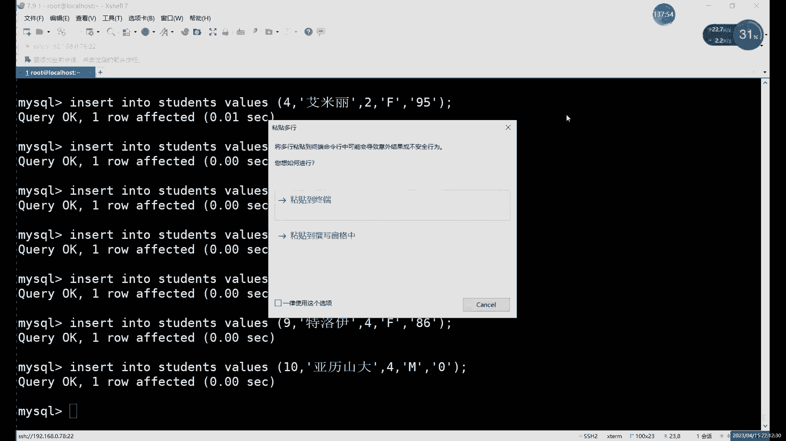

# 【小白入门必备】Linux运维进阶RHCSA+RHCE最全培训教程视频合集 - P71：中级运维-9.约束，ALTER命令，索引，SELECT查询-下 - 洋洋得IE - BV1nN4y1X7Go

加上这个，加上我们具体的这个字段啊。

这是一种，还有一种是什么，就是在创建和修改表结构的时候，修改索引，就是alter table的时候啊，alter table的时候添加一个索引进去，加索引的话，这个是怎么添加，就是ADD索引的名字啊。

A b d index，然后索引名称，然后二添加给谁，添加给某一个字段啊，因为我们的索引的话也针对于字段的，就是二某一个字段就行，当然还有第三种啊，create创建的时候它还是create命令。

但是不一样的是什么，就是他这种是创建表格的时候添加索引啊，这三种都可以啊，三种都可以，没什么区别啊，就创建出来的东西没有区别，你想创建哪个你随意啊，想用哪种方法都可以啊，都可以。

比如我这里还是创建一个新的表格吧，啊create table索引，对我们创建一个索引的这个表格好吧，索引表格，创建索引表格，然后里面我们先写什么，先写一些字段就行了，就比如说我们随意啊。

先写一个IDINT啊，对吧，我们就拿name来看，为什么拿内来看，因为name呢它不适合设置约束，那最多只能有个非空约束，但是非空约束呢它没有索引的功能，有索引功能的约束呢，就是K啊，就是K那里有东西。

那才有什么，它才算是有约束，所以要不有这个索引，所以说呢这个name呢，它他能设计的约束里面是不包括索引，所以说这种情况下呢，我们可以在什么的哎，可以给他来个普通索引，就比如说我们可以设置一个索引。

在哪呢，就是索引在如果要创建表格之后，设置完，就是写完以后类似于什么它类似于那个外键，外键也是我们写完之后再写对吧，这里也一样，就是写完这个所有字段之后呢，后面逗号跟上索引就可以，索引的话。

这里我们可以起名字啊，可以给索引起个名字哎，就比如说随便你叫啥都行啊，叫啥其实都可以对吧，你就简单写一个就行，啊后边里边加什么，里面加内，name什么name，就是我们这个，这个老师这个字段的名称啊。

就是你要设置的字段的名称，就是把我们的name字段设置成索引啊，index index是索引的意思啊，这个的话就创建索引啊，就是类似于那个Y键，就是把这个创建索引的部分加在后面啊。

那这个现在的话我们就相当于创建了什么，创建一个普通索引啊，在普通索引里面，如果你创建之后呢，想要看一下表格的话啊，就是一个什么就是个MUL啊，它既不是他，他不是他，这个当然不是外接啊，他这个不是外键。

他这个时候就是一个普通索引，它这个可动索引的时候，如果说我们要用它的话，比如说我们怎么来用呢，就是比如说select你好，From，呃表格叫什么来着，索引对吧，这样看看，当然也没有对吧。

就是你不加V2上限制条件肯定是不用索引的，所以我们这里加个name吧，呃name，name现在没有对吧，那么没有精神不要紧啊，不要紧，啊那没有也行，我们也有什么呢，也有索引啊，也有索引，这个索引是什么。

这个索引呢一般是代表普通索引啊，同索引嗯，因为我们这个索引相当于它没有主键，它不是主键索引，它也不是唯一性索引啊，就是REF这个代表的就是这个普通索引啊，不同索引啊，总之这里就是只要不是什么呢。

只要不是二啊，只要不是谁都是可以的，二的话它是一般就是查询整个表格，扫描整个表啊，二的话就扫描整个表，只要不是哦，它其实就用到了索引啊，就是不同类型的索引吧，不同类型的索引肯定这个效率肯定是有区别的。

你就像这个主键和唯一性索引，肯定效率是更高的，为什么呢，因为他们的字段是唯一的，不是数据是唯一的，就是字段里面数据是唯一的，所以说参数效率高，但普通索引的话没办法，因为你没有这个约束。

你不能设置这个约束，你数据有重复的，你就不能设置唯一性约束，那怎么办呢，那就只能用普通索引，普通索引的效率呢你会稍微低一些，因为有涉及到这个重复的数据啊，效率会低一些，效率速度会慢一点。

但是呢肯定要比不用索引号对吧，肯定要比不用目录好嘛对吧，你就想问你如果没有录入目录，怎么说呢，就是即使你是再薄的一本书，没有目录，你找东西肯定也不是很方便对吧，找东西肯定也不是很方便。

那这个的话就是什么，这就是我们这个索引索引，普通索引创建这个主键索引和唯一性索引呢。

大家想记也可以，不想记也无所谓，为什么呢，因为我刚才说了，主键索引唯一索引跟主键约束，唯心约束是一样的，你创建索引相当于创建了约束，创建约束也相当于创建索引，因为他们就是怎么说呢，就是这个组件啊。

自带约束和索引这两个功能，唯一性也是一样的啊，就是我们这个k primary key和unicle key，这两个key呢都是自带了什么自带的索引功能的，自带的索引和约束两种功能。

所以说的话创建的话也很简单，大家可以看一下就行了，因为创建约束的时候就自带了，所以说不需要我们单独去创建啊，不用单独创建的，就是这两个例子可以不用记，主要记得是什么，主要是创建普通索引的。

因为普通索引的话约束是约束是创建不出来的，这个普通专业啊，就是没有约束的情况下，想要索引的就得用这个，所以说主要是记这个普通索引就行了，微信索引呢就是什么，就是把刚才刚才我们不是什么。

就是这个创建的时候是用什么，用index对吧，index然后加上index名字就可以了，唯一性索引的话就是什么，就是UNICO，加上UNICO对吧，这个和这个和我们那个约束会也一样，还是一样的啊。

就是unique index，这是我们的唯一性索引，按主键索引呢啊直接就PRIMARK就行了啊，甚至都不用写，甚至它就和主键约束完全一模一样啊，所以说这个的话就唯一性和组件就不用记了啊。

因为创建约束的时候就自带啊，这两个就不用说了，然后呢接下来的话还有两个，当然还有一个先说这个吧，就是全文索引，全文索引的话，这种的话它比较特殊啊，它是用在哪呢，它是用在这个字符类型的字符类型里面。

才能用这个全文索引，它有这个CHAR对吧，然后还有text text，这个我们就开始说了，就是一些存放我们这个比较长的一些，字符的时候会用，因为CHAR和VRCHAR的话。

这两个虽然说很好用，但是呢他们的上限比较低，只有256和6万65535啊，一个是250，就是二的八次方，二的16次方，就是他俩的范围比较小，范围大一点的话就得用到TT啊。

Tt text text text，这个的话也就是用来存放我们一些字符啊，字符类型的这个数据才能用到这个全文索引，因为你文本它就相当于是很多大量的文本嘛啊，针对文本进行一个查询啊，分词这种的话。

这种索引呢他用的是什么，他是比较特殊，它必须要用到这个my sm的存储引擎啊，因为我默认用的引擎，它不是这个我默认用的引擎是哪个呢，默认用的引擎是这个show create嗯，table索引。

大家看一下，默认引擎是这个引擎呢，我们还没有讲，大家先知道一下啊，先了解一下，这个是存储引擎，存储引擎运到dB，然后呢这个这种引擎的话，它不支持什么呢。

这种情况不支持这个全文索引啊，也是不支持这种特殊的引擎啊，它叫啊FPX啊，它是专门用来查什么的，这种这种这个索引是用来查这个大量的文本啊，大量文本这个的话就非常就类似于什么的，就跟字典就更了就更像了。

为什么呢，因为字典我们里面就查字的，他这个也是查字的啊，就是这个FTG就引的产品，像其他引其他的这个索引的话，字符也行对吧，数字也行，那像这种的话就只是用来查什么，只是用来查这个文本内容啊，查文本内容。

然后这里的话这个联合。

还有一种的话是联合索引吧，就全程索引创建也是一样的啊，就是PROTET，但是我这里给大家演示一下啊，这个得演示一下，因为什么，因为这个涉及到不同的存储引擎啊，啊不同的存储引擎怎么创建呢，我刚才也说了。

就是我们在创建表，平时在创建表格的时候对吧，我们都是默认去，我们创建完一个表格之后就结束了对吧啊，一般就结束了，但是呢这次的话我们创建一个特殊的索引，如果要创建这个全文索引的话，首先先写字段。

这个没问题啊，这里的话我主要写就写一个嗯，文章吧啊，word文档吧啊，就当是word文档，text啊，就是这种数据类型，text数据类型，创建好之后呢，加全文索引啊，Bott。

后边加上这个four tet的一个名字啊，就比如说，就叫word吧啊就叫word吧，然后里面加上具体字段EXE啊，不要先出，这话就是创建全的索引，它其实就是每个索引的名字，其实就是创建名字，这里不一样。

其他的都一样，然后呢，当然这个全部作业还有一个特殊的点，为什么要单拿出来说呢，就是因为需要还要加一个东西啊，啊当然了，这个加不加也行，你想加也可以加，这个你复制过来也加在这里。

当你不写的话，它默认就是这个，所以说呢也不用写，因为他不这不都写了默认字符集嘛，这两个的话默认都是这样写的，如果说想要改的话，你就写在后面，他就不会按照你的默认就走了，他就也就类似于一个默认的约束。

默认约束每个表格都是长这样的，但是如果想改的话，你就写到后边唉，写到后面就写在括号的外面啊，在括号外面，这里的作用的话，我们就是更换一个什么，更换一个存储引擎啊，因为WINDODB这种默认存储引擎的话。

不支持这个活态，这个话就是创建这个全文索引的一个方法，text不存在在表格里面，哦就叫word啊，叫word，啊这个字段的话叫word，这个数据类型是text，这里写错了，是word word。

好创建好之后，全文索引啊，也是MUL，就他这里没有一个它没有特殊的标志啊，MUL到大家看到以后呢，怎么说呢，你不能下定论，你只能确定它有索引，但是是普通的还是是这个外界啊，还是这个for text的呀。

不确定，那怎么办呢啊你可以show什么呢，show index就可以啊，收音NT用来查询什么的，是用来查询索引信息的，这个里面会具体去写啊，它是什么好吧。

然后呢我们还有一种索引的话，就刚才也是刚才给大家看了一下对吧，没有说呢，联合索引never，never的作用是什么意思，就是，这个联合索引呢它是有什么作用啊，就是用来什么，就是将多列就两个以上的力唉。

创建为索引，就比如说正常的话我们创建一个索引的话，就是什么呢，index然后后面加索引名字或者对吧，或者说呢UNICO加后面加名字，甚至可以写什么呢，这样写可以写primary同学加名字啊。

也可以叫primer后面的名字，因为这个primary话相当于什么呢，相当于主键吧，因为这个联合索引的话，它其实不限制你的索引类型啊，比如说你联合就普通索引的话，可以先设置个联合的唯一线索。

也可以设置那组件，这里的话啊，我之前说过对吧，主键呢每个表格当中只能有一个唉，每个表格中只能有一个组件，但是呢，虽然说只能有一个组件，但是呢并没有说你这个组件是什么对吧，也可以是联合主键。

或者说叫联合主键，唉我不想这样索引了，就联合组建吧，哎你说这个联合组件什么意思，就是可以有两列呢，同时作为组件啊，风作为主题，这样的话呢，你可能正常一列的话，他不能确保完全的什么呢，完全的这个。

唯一性对吧，有可能有的列呢，有的列经常用于查询，但是它没有唯一性，对它的数据没有唯一性，但是它经常用来查啊，当然了，创建一个普通索引是一种方法，但是普通索引刚才说了，它的效率不是很高，它没有哪个高。

他没有主见高，那想让它变成主键呢，又不能让它变成，又不能又不行，因为什么，因为它没有唯一性，就是怎么怎么办呢，就可以用这个联合组件或者联合索引来解决，常说墙角就是联合主键索引，就是把两个链呢作为主键啊。

你把两个点同时作为组件，因为有一个链子，它可能是有一些重复数据，但是因为要用来查，肯定不得不给他来一个主机，还不来，不得不来一个索引，为了提高最快的，就是把效率提高最高，那只能用主键的。

所以说在这里就就会用到什么联合主键索引啊，或者联合索引，因为联合索引的话可以用主键的，可以用唯一性的，可以用普通的图形，就是在创建的时候呢，在我们括号里面加上什么呢，加上这个多个。

比如说呢我们怎么创建呢，比如说这样。

free table联合，就比如说这个这种情况，ID可不可以作为主键的，可以对吧，这个很正常，但内容能不能作为主键呢，这就不一定了对吧，因为很容易有重名的，所以这种情况下呢，如果说想让这两个都做索引哎。

都有索引，而且都用，这都用效率最高的一个缩影，这些怎么办呢啊你可以在这里加上这个，加上这个K啊，可以加上这个K啊，当然你加K的话，这里K的话其实就是那个这个这个就是P，这里的话你可以用什么。

可以用唯一性的啊，可以用组件的，可以用普通的都行啊，都可以，嗯这个的话其实我们里面加了什么，比如id啊，里面要加这两个名字，id和name i d和哪个重要，是创建啊，这样创建，然后创建出来呢。

我们来看一下DISC联合啊，这里的话就有个MUL了啊，当然这种的话，其实嗯他这个如果是有联合这个组件的话，或者联合索引的话，他只会在第一个里面就显示索引，所以说呢这种index就是dz的命令的话。

他看这东西已经怎么说呢，已经不太全了啊，这种情况下的话，最好的话还是看什么呢，用show index这个来看啊，show index来看show index，这里都能看到什么，有两个什么。

这叫有两个索引，而且呢它默认用哪个名字呢，它默认用了这个我们第一个字段的名字，因为我没有起名字啊，就是索引这里的可以起名字，也可以不起名字，就是在这里呢可以加名字，也可以不加名字都行啊，都可以。

你这里加上名字的话，它它是变啊，是k name，这里变，如果不加到，它默认按照第一个啊，他这么按照你自段的名字给你起所有名字，所以说呢你名字不加也行啊，这名字不加也可以啊，这种话就是我们这个联合索引。

联合索引其实就是括号里面写多个就行了啊，很简单，你不是唯一性，怎么创建的，就创建个唯一的唯一联合索引，唯一的联合吧，啊唯一的联合，A逗号系统，那不行，这样的话我们再重新创建一下啊。

Create table，联合，I d n t name，在这里可以加名字，比如说啊你随便写一个吧，啊随便写个名字都行，看一下unique k。

我这个创建的话，我看一下UNICO。

这里的话，Unico un unicle index，哦我们这个名字看这个名字，这里的话还能，还有点问题，我经常这样放吧，这个的话还是有点那什么啊，当然这里的话还是用这个。

这个相当于这次创建出来就是什么，就是一个，Bsc，唯一联合，啊唯一联合，这里的话大家可以看到，我们上面和上面的区别是什么，就是NUNICO，普通的那个呢，它是什么，它是一个。

一对一的话就是它不是唯一的啊，一个这里是NUNICO，它就不为一不为一，一的话就肯定嘛啊，就是不为一的意思，普通索引这也是零的话代表什么，代表我们是唯一的啊，也就是这个的话其实就是一个唯一的DNC。

那么唯一联合，啊他就是什么，他这个其实我这里其实看不出来啊，你也看不出来，你还是得看，还是得到这个index里去看，所以说呢如果说你是要看一些索引信息的话，DSC的话，基本上已经他帮不了你什么了。

基本上都帮不了你什么只能是什么，你用这个收音DEX命令去看啊，这个看得比较准确一些啊，这个看的东西比较准确啊，这就是唯一联合的，当然你像创建组件也是一样的啊，创建组件也可以对发主页怎么放电呢。

R i m a r y fmk，组件啊就这么创建，我们来看一下这个，逐渐联合啊，这组件的话比较特殊，他这个道具给你显示出来对吧，这就是多个组件，多个组件的话也不能是单独创建，而不能单独创建。

你要怎么创建呢，就按这种创建，按照这种地方建，就是联合主键，当然这里也包括索引，主键的话也就包括索引啊，你正常创建一个组件的话，你可以跟在一个字符后边，还有字符在这个呃字段后边。

但是呢如果说想要多个属性的话，你还是得逗号后边，你跟上four mk，然后加上这个id也好啊，那里也好，大家字段的名字，这个的话就是创建联合的组件。

总之这种创建方式的话，主要还是记哪个呢，普通索引怎么创建对吧。

其实是创建方法一样，就是换一下什么的，换一下这里的关键字对吧，NICO的吧，就是唯一的PRIMK，就是主键，普通的话就是普通的一个K呀，或者是index啊都行啊，就这些因为我们修改一直索引修改哪部分呢。

说的是这里就是K这里啊，你不管说你是唯一的还是普通的，还是这个这个组件啊，其实一直都改的是这我一直在做SP啊，当然更具体一点的话，还是用这个收音DEX去查看，其实最好因为他能看出比较详细的信息好吧。

这个就是我们的索引啊，索引有这个索引之后呢，你去查看这些表格也好啊，当然直接看表格，他是不会用索引的，因为没有必要，他会展示将来展示整个表格了，如果是看某一某一行啊，或者某几行的数据的话，用VR命令啊。

记得用VR命令啊，不用WR命令，它不会限制条件啊，不会限制条件的话，自然也就用不到这个索引啊，也用不到索引啊，用到这个WR命令之后呢，就可以什么，而且你威尔后边啊限制条件呢一定要包含什么。

包含这个组件啊，唯一性的呀，普通的索引啊，啊这些索引包含这些索引信息的时候呢，他才会用到这个索引去查询，所以说呢这个查询呢，查询命令的这个使用其实也是有讲究的啊。

那具体怎么说，这个查询呢其实就是我们的下一个内容啊。

这怎么说呢，就是下下一个内容就是我们select语句对吧，最开始我们一开始的DDL语句。

管理表格的数据定义语言，其实我们都已经说完了是吧，alt刚刚说过，那三个其实都已经说完了啊，PRIMK不需要加，因为primary key它是比较特殊的一个白哥可以加，他是主键，它比较特殊。

他不用加那个index，也不用加K，其实index key是差不多一个意思，就是只要有了key的话，就不用加index，就是K和index，其实在这里我们基本上代表一样的意思，就是索引。

然后呢这三个已经说完了对吧，然后呢第二种这个DML语句只是数据操作一样，有操作数据的增删改都说完了，在查询呢，其实我们只是查了，就是每次都是查一个表格对吧，我每次用的话就是在清from某个表啊。

某个表就是我们接下来的话，主要内容的话就是这个select语句啊，因为select语句，啊这个导入导出工具的话，我们就后边说吧，因为导入导出工具，其实这个它其实就是类似于备份，它其实就是备份啊。

我们这就是在备份的时候，我们继续讲这个吧，我们接下来就直接来说什么呢，就直接来说这个select查询啊。

现在查询当然了，一时半会肯定说不完，我们就一点一点来吧，啊一点一点来。

flag查询的时候，其实我们在后面其实可以什么，就会具体用到这种这个索引，当然了，我们其实当然还是那句话，我们的表格比较小啊，我的表格比较小。

正常的情况下呢，其实啊是否用到了索引呢，你就通过那个explain命令去查看就行了啊，那里面就能看出来我们到底用了什么索引啊，或者用的具体是哪种索引啊，用没用啊对吧，最好的最快的肯定就是主键唯一性的。

然后普通的索引的话速度会稍慢一些，但是唉就相当于是，啊一个好的字典和一个坏的字典吧，字典也没什么好坏吧，就说一个好的目录，因为有唯一性，所以说他查找起来更方便，没有唯一性的话，他查的就差距比较慢啊。

这里的话我们可以这个这个数据导入导出的话，我们后边具体备份的时候再讲啊，具体备份的时候再讲，然后呢管理表记录的话就是我们insert命令，insert增删改啊，insert增删改。

这三个java前面我们已经基本上都说过了对吧，那么接下来的话就是最重要的查了啊，管理表记录的话其实就是什么，就是我们数据操作语言，就是增删改里面的增删改，查里面的前三个命令的用法就是在这里啊。

很简单对吧，就是这么几个对吧，这这一个命令呢占了这么多，然后剩下的呢都是啥对吧，查这里，当然我PPT里面已经，因为我感觉PT放这些也不太合适啊，因为命令又多，东西也太多了啊。

我后边我直接直接就在在笔记里面跟他说吧，因为这里lag这些东西很多很多啊，然后首先的话我们要说查的话，我先创建一个几个简单的表格吧，因为之前我们实验那些表格太简单了，没什么意义啊，太简单了对啊。

来我这里把这个结给它复制出来也行，先创建这么两个表格吧，应该能复制吧，能复制吧，对上下两个表格，我们方便后面去查找好吧，哎大家直接复制粘贴就可以了，别说粘贴到这个数据库里面就可以用啊，直接就可以用。

这里的话我用的这个音色的方式是什么呢，就是一个银色的一个银行，用一个音色为什么这么写呢，这种写法的话其实更方便于排除，就是你如果说出现报错的话。

如果说用一用一条语言提。

好复制多了，我说命令就得报错了，多复制了一点啊。

好大插入这两个表格之后呢，用先用select来看一下吧，flag的信号from，students对吧，就是这个表格，然后另一个class呢是，好A好A在这个位置plus啊，这两个表格。

这个就是最简单的一个set发型，之前我们一直用的是这个对吧，用的是这个，前面也说过了，这个form这里呢啊form这里就是表格的名称，这个不用多说对吧，你查一个表格就写一个，查两个表格就写两个啊。

这两个就行，当然我们先说写一个的啊，先说写一个的情况，然后呢select前面就是查询具体具体要看的内容，那只能看些什么呢，就是星号代表什么，代表这些的，所有分开写的话就写id啊。

name class id啊，性别呀，成绩呀，写这些啊，就比如说你想select一个只看id和姓名是吧，只看id和姓名就是id逗号name唉，怎么去写，前面这些其实能啊，就是就要看内容其实很少啊。

就是id name，Id name，它是有一个出问题，敲中文跳不上去了，来个id账号name，From student，这个表格，这样看的话就只看什么，只看id name这两列。

也就是这里的话写字段的名称啊，一般是写字段名称更多一些，当然后面还有特殊情况啊，我们后面再后面再说啊，一般的话也正常查看，就是一个字段，或者用星号，星号代表所有看整个表格。

当然信号也并不是说在看这个表格吧，信号更准确来说是看所有字段的信号，指的是看所有字段，在这种情况下的话，肯定是所有表格没问题，但是呢我们这个select语句，这里主要讲的是哪部分内容呢。

是他们之后的内容啊，就是在这个语句之后呢，之后呢就是这个where啊，就是个where啊，今天时间也不多了，但是我们稍微说一点啊，稍微说一点味道，后面我们加的是什么，加的是这个自己还用心吧啊。

SELLY星students，然后where后面加的就是具体的条件，这个之前我们在update和delete的时候稍微用过对吧，就是看某些条件的时候，就比如说看一下这个，这里我们有班级对吧，有班级啊。

性别啊，成绩啊这些东西，比如我们看一个什么class id等于一的同学对吧，还有一般的同学两位对吧，这就是什么，这就是这个查询，按查查询条件来算，但这个用到索引了吗啊，他应该是没用到索引。

因为class id这个它里面没有什么，它里面应该是没有这个约束的啊，没有约束的话，一般我们也不也一般也就没有索引，所以说呢用where去调查的话，这个其实我们用不到索引啊，用不到索引。

这个就是最简单的一个什么SELLY语句的结构啊，就是select加上我们想看的字段，不让我们加上想看的表格，后面where呢加上我们想看的条件，这三部分字段表格和条件条件呢，这里其实能讲的就很多啊。

能讲的很多，具体有哪些呢，很多很多很多，我这里的话就把这个什么呢直接用笔记来看吧。

因为PPT里面放的实在放不下，因为太多了啊，PPT里面实在放不下，你直接用表格来看啊，最基本的查询就不说了对吧，最基本上就不用多说了，条件查询的话用的就是什么呢，就是select前面这部分无所谓啊。

就是贝尔加条件语句了啊，我在查询语句常用的查询条件的话非常多啊，我们一个来介绍，首先呢比较符比较符前面用过了什么，用过等于号对吧，当然我们这里就不仅仅是等于号啊，不仅等于号，还有什么行不和，大于号。

大于等于小于等于你还要不等，唉不等于当然等于这里的话。

首先呢除了这个除此以外呢，当然了字符也可以用对吧，就比如说呢你想要看名字啊，或者说想要看这个性别，这个可以性别的话，这也是个字符啊，比如说性别是F的同学，啊也就是女同学这边的话就是女同学啊。

这里的话就是什么，就是字符的话需要注意的就是where后边等于号，后边不能说where，后边就等于后边的话字符的用引号啊，数字数值的话，这个其实怎么说呢，数值是一贯来说比较自由啊，数值的话引号也行。

不加引号也可以，就主要注意的是字符呢一定要加上引号，没有引号，从这里这个字符它就会报错啊，比如说我们来眼看一下，看看报错吧，那报错的长什么样，如果说我们写了就是字符里边，就是如果说本来这一列是字符。

数据插入都是字符对吧，数据查插入都是字符，如果说你查询的时候呢，用这个slide的信号form，然后看student where，加上这个后边的这个条件里边，如果你写的不是个字符的话。

其实你不加引号的话，它就默认为什么默认为你输入的不是字符，他就会报错啊，他就会说什么呢啊，找不到这一列啊，不是找不对，找不到这个数据吧，更准确的是找不到这个数据，就是你不加引号的情况下是找不到的。

唉找不到这个数据的啊，这个的话就是什么，这个就是字符这边的特殊需要加引号啊。

需要加引号，好接下来的话这个大于号包括大于号，小于号的话，这个其实是什么呢，这些的话是用在哪呢，是用在这个数数值上的啊。

更准确是整数小数都可以用，就比如我这里呢把这个select s e LEC t啊，select新form，当然了，这个比较的话其实更好的是哪，你看class id IG这些都可以比。

其实只要是数字就能比，然后呢score这里的话成绩的话其实是最好的，比较嘛对吧，成绩这个比较其实比较好，就比如说呢我们来查一个什么呢，我看一下这个表格当中，我们看以成绩来过滤一下吧。

啊来看一下这个成绩比较好的同学啊，或者看一下成语较差的同学吧，啊select然后where后面加上什么，where后面加上这个成绩，然后呢比如说成绩比较差的，比如说小于吧，小于80吧。

小于80其实就有点危险对吧，有点危险就能找USELECT，加上这个VR小于号，就是查出来程序小于80的同学，正常的话，这个小于大于号肯定都是用在数字上的，是用在数字上的，包括这个小于等于也行啊。

小于等于的话，这里又多了一位，然后多了一位对吧，又多了一个配齐啊，这个话就是什么，就是比较符号，就是比较范围，当然除了这个大于号对吧，小于号大于号，小于号等于号，第三个以外呢，我刚才还说还有什么。

还有一个大于等于大于等于，对不是不是大于等于就是大于小于。

哎其实也就是不等于啊，为什么叫它大于小于，就是它这个符号的话两种写法啊，当然是可能就是大于号，小于号和什么和感叹号。

感叹号的话就代表我们这里是不等于的意思，就比如说呢如果说查询程序等于80的对吧，就一位吗，那不等于的呢就是剩下的所有，比如感叹号等于就是代表是不等于，或者说还有一种写法，就是。

啊但是大于号小于号这个得是什么，得是小于号和先写小于号，再写大于号，这两个的话就是这个不行啊，大于小于这个不行，那固定用法是小于大于小于大于这个，然后呢和这个感叹号一样对吧，感叹号其实就是取反的意思。

就感叹号等于就是不等于的意思，然后小于大于的话就是既小于一又大于的，肯定是不存在的啊，不存在的哎，这种话其实也就是定义成什么，定义成不等于了啊，这个的话就是我们这个比较的符号啊。

我们的WB条件语句里面是比较，当然了，如果说IBI如果肯定有疑问，就是字符能不能比较呢，就字符除了等于号，能不能用大于号，小于号呢对吧，比如说能不能就是啊，以这个英文字母的ABCD这么排呢。

其实其实不能对吧，因为它其实它是不能。

但是呢他有一个，其实这里面其实我感觉做的有点问题的地方，就是麦兜里面有个不太好的地方，就是比如说呢你看等于配齐啊，如果说朋同学等于配齐，就是这个配置对吧，name啊，name等于，对吧能查出来对吧。

那不等于就是其他所有同学没毛病对吧，然后呢如果说如果说这里放个大于号行不行呢，它也不会报错啊，他也不会报错，如果是小于号呢，它也有啊，它也有，你说他是按英文字母排的吗，他也不是看你说它是按英文字母排的。

他其实不是按英文字母排的，因为你看啊这个P对吧，就是P，然后这边是QD啊，这边有个D，然后6GQOPQ嘛是吧，P在前Q在后对吧，你小于这肯定就不对了对吧，就是这个的话就是字符的话它不能用来排序。

就是大于小于的话不能用，他能查出来，是能查出来，但是呢他没有什么规律的，它是没什么规律啊，所以说呢正常的话字符就不要用什么，不要用大于号，小于号了，他这最多就是用什么用，等于号，或者说什么呢，等于号。

或者说不等于啊，不等于就是取反的意思，感叹号的话，在这个符号这里的话就代表的是取反啊。

感叹号取反唉，这就是一个什么，这就是一个唉最简单的一个查询条件，就是涉及到数值的时候用的更多一些，就是大于号，小于号了，如果是一些字符的话，就只能用一些等于号啊，主要注意注意这个就行。

然后接下来的话再来看下一个是指定范围对吧，这个是等于号的，按照等于号来算，如果能碰到一些想要实现这一些哎，大于某个程序，小于某个程序的时候，怎么办呢，当然这里的只限制只限制只涉及到这个数值啊，还是数值。

就比如说按成绩来看，你看成绩的话，这场我们刚才比的是一个大于小于80的同学，对吧，那如果说我们想要看这个大于60，小于80的这一段哎，就是你及格了，但是成绩也不太好，只要开这么一段话，就可以用什么呢。

就大于号等于号的话，就直接只用单个的肯定是不行的，那只能用什么，就是这种范围就指定范围，指定范围的话就是不between and，就是在什么什么之间的意思啊，这个是在英文里面。

语法就是between and在什么之间，然后中间的话把数字放在这个位置和这个位置，就是放在这个between后边和and后边什么意思，就是在75~83之间啊。

这三七十五到83之间的啊，如果说我们想要查看的话，比如说啊我想看个60~80的同学I的成绩，V60到80啊，还是成绩比退，and那成绩的话写在中间60~80的成立啊，这就是60~80。

那它这个代表的是什么，就是他这个有没有，就是他俩之间有没有就是包含这个，60和80呢啊这个其实大概是不好看的，因为这里已经有了对吧，还有相当于什么呢，就是大于等于60，小于等于80啊，不是大于60。

小于八，就是等于它中间有等于号啊，中间是有等于号的，你看68是取经来啊，那取反的话当然也是有的啊，刚才的取法是什么呢，刚才我们那个问就是就是等于号啊，等于的取版是用感叹号对吧，这个范围的取版的话。

它是用not啊，取版的话就反正就是否定的意思嘛，反正号是一个否定对吧，你看像这个not其实也是个否定句，哎其实取版的话就是在我们的正常的这个语句，前面加上这个取反的东西就行了。

就到那么这里直接就是什么呢，就是小于60和大于80的，大家看到这68是没有进来对吧，还没有进来，为什么呢，因为这个68是其实就在这里，它是大于等于60和小于等于80，那取反是什么呢。

取反就是小于60和大于80对吧，这个就是between and的这个范围就是从哪到哪啊，双就是两边是有什么双，两边是有等于号的，就大于等于某个数值和小于等于某个数值，同样的还是什么呢。

还是这个不要用在字符上，不用在字符上比是可以比得是没有意义，然后note这个就是取反啊，就是，在这个范围之外的东西就小于60，大于80倍啊，就是相当于在这个范围之外啊，这个就是什么呢，这个就是。

啊这个的话就是我们这个，我们的这个叫范围啊。

固定范围，当然我这里条件的话很多啊，讲了很多，我们只能是一个一个讲一个讲，然后呢除了刚才我们讲的时候，我刚才讲了一个比较符对吧，比较符，然后呢又说了这个范围啊。

范围比between and这些的话其实都是什么，都是用在这个where后面呢，我们现在主要讲其实就是where，后面的条件怎么写啊，写条件的方法其实有很多，是你根据不同的字段啊。

其实都是有都可以写不同的这个限制条件对吧，就比如说大家嗯，你看刚才其实两个，主要还是针对于数值更多一些。

但字符的话，其实它比较起来确实没有数据那么方便的对吧，所以更多的字符的话，他更多就是等号用的很多，唉等于或者说不等于的对吧，范围之内其实都都不能用了，就就根本就不能用这个范围。

因为你不管说你是汉字也好啊，还是英文字母也好啊，你没办法比大小，因为它这个大小概念，其实数值字符的话肯定是没有大小概念对吧啊，这个的话就是我们这个where，后面语句的一些用法啊，用法很多，大家下去了。

可以在多预习预习啊，把前面的命令打好之后呢。

可以提前预习一下啊，今天的话这个正好我们笔记的话，整个发给大家了，我发给大家的话，大家可以把下面的一些看一下，很多啊，很多除了这个等于大于号等于号以外，哪还有范围呀，集合啊，模糊查询呀，是否为空值。

多重的条件啊，排序啊，分页分组函数等等等等，而且这个是这个什么，这个只是一个表的查询啊，一个表查询，一个表装完之后呢，我们还有多个表查询，看看这个表格查询，所以这个的话，大家我们可以可以先自己看一看啊。

预习一下啊，我们这节课的话就不不讲太多了啊，不讲太多了，在这里的话总体上来说呢，where后面的用法是一大部分啊，只是主要的内容，最主要内容，当然前面我们还会有sex，这部分的话还是有内容的。

就除了字段名和信号以外的话，先剧透一下对吧，下面还有什么函数，函数也是用在这部分，也可以用在前面，这部分就是计算啊，用来计算这个函数，它不是什么复杂的函数，这个函数指的是什么呢。

指的是我们类似于我们excel表格里面那种函数，就是计算函数，啊，所以总之大家下去把这些面也可以都看一看啊，这些例子呀，包括那你先把这个这个表格复制进去啊，先把这两个表格复制进去再去查询了。

不然的话没有对象查也没意义啊，没意思对吧，然后下面的话我们下面下节课的话，我们就继续讲这个SL语句好吧。

