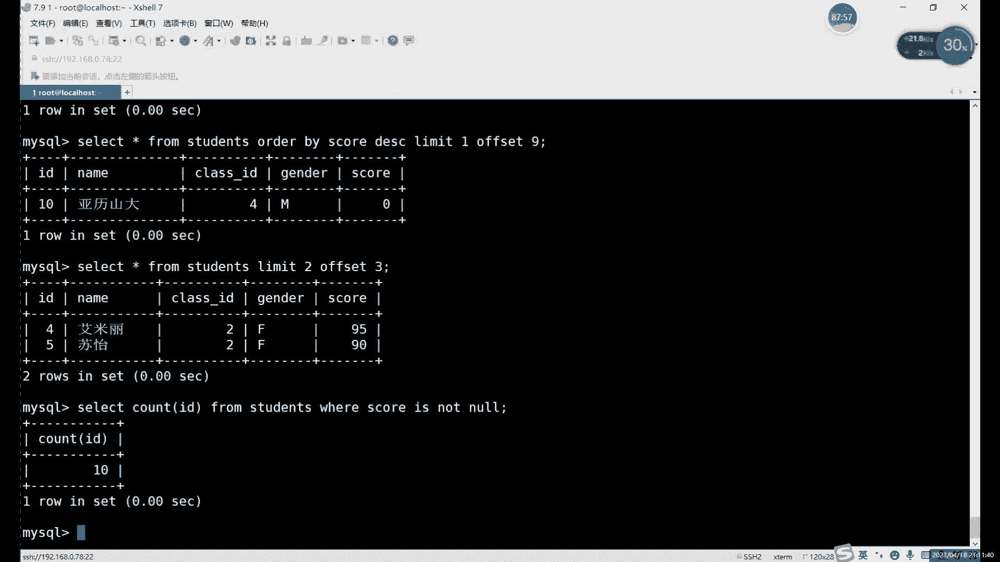
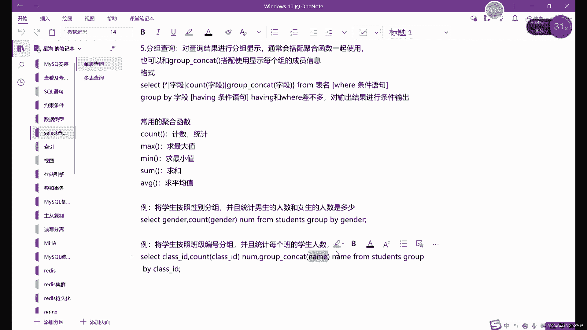

# 【小白入门必备】Linux运维进阶RHCSA+RHCE最全培训教程视频合集 - P73：中级运维-11.SELECT单表查询，嵌套查询-中 - 洋洋得IE - BV1nN4y1X7Go

查询的一个不就是同样的，你要就比如说嗯，就是查一班二班同学的一个信息对吧，同样的一个问题，他查询方式其实非常多对吧，你硬也可以be between net也可以啊，用来形名like也可以啊。

用all也行对吧，and不可以啊，and不行，all也可以对吧，等一会啊，等一会儿二这些话其实都可以唉，就是总之一个问题的话，大家不要说啊，就你想的时候呢进行一种解决方法啊，像在这个数据库啊。

尤其是slave移这里其实解决方法非常多啊，只要你只要你敢想啊，他其实都能写啊，只要你敢想，其实都能写出来，这个就是什么，这就是我们这个，and和or的一个多重条件查询啊，三个也行啊，三个也行。

咱就想试的话可以试一下，三个怎么说呢，你三个如果说你三个是用二来写的话，但是条件会越来越多，如果三个用and写的话，他肯定会越来越少，其实这两条相当于相反吗啊相当于相反的，因为你二的话。

你就又加一个条件的话，就又没又有很多，又有一批满足条件的又能加进来了，但是呢你相当于and的话，你再加了一个条件，能满足这个条件的人就会越来越少，有这两个的话，他们得到的值并不是相反的。

但是看他俩含义确实不一样啊，确实含义就比其实反着来的，如果他俩得到的值呢啊永远是什么呢，永远是这个221定肯定会包括and一个池子啊，二肯定会包括and，这个是什么，这就是我们的多重条件查询。

not啊还是not取反哎，这个取反就是反过来算了，哎就是你写完什么呢，写完这个就叫，总体来说这个叫写完我们的条件之后啊，写完我们条件之后呢，在条件的前面呢去加note啊，在前面的条件去加note nt。

能不能和and一起用去也可以啊，不过呢大家用的时候就要需要注意啊，需要注意啊，你这个因为and和or那边有已经有一个什么，有一个还需要思考的对吧，就是你是并且还是或者呀对吧，你再加一个虚反啊。

你如果弄不清楚的话，其实比较麻烦，所以说一定要搞清楚啊，一定要搞清楚这个and和or，以及按等号的一个区别啊，那取板的话就是在已经哎相当于not，取反是什么意思，就是你把当前的这个执行一遍啊。

now的取法呢就是不要这些了，我们要剩下的啊，还有剩下的，即使加上and on，它只是更长了一些啊，原原则上是一样的啊，原则上它的意思意义是一样的，好吧好，接下来的话我们继续往下看啊，note取版啊。

note取版就主要注意，除了那个is is not之外，是加is not is not now，剩下的话就是在我们的关键词前面加上not，而不是NO，不是啊，就是not关键词前加not。

然后呢我们接下来看什么呢，接下来看这个啊，这里的话最基本的where，后边最基本的一些比较的话，我们就已经说完了啊，最基本那些比较的方式，或者说是获取数据啊，查询的一些方式已经OK了，对吧啊。

已经说完了，这些的话其实嗯怎么说呢，呃它不难，就是用法有好好几个不同的用法啊，你在具体查询的时候用哪个呢，它不固定啊，大家注意，他并不知道某种用法一定是在哪种场景下，这个不固定，这个其实就是完全看你的。

当时按你的一个需求啊，或者说你的问题啊，问题是什么，需求是什么，这里的话我们这个，就是用这where后边这个条件查询的啊，啊主要内容其实就这么多啊，主要内容这么多，这样我们看什么呢，啊接下来看一个叫。

接下来我们其实看的是排序啊，分组啊，这些啊排序分组的内容，排序分组团这边其实就稍微与内容啊，比前面的稍微难一点啊，嗯也就是难了一点，排序分组的话，我们不用where啊，不用where。

或者说也不能说不用where吧，就是嗯跟where呢没有太大关系，就是排序分组的和where无关，但是能不能用where天使条件呢其实也可以，就是你如果只写一个分组啊，或者排序什么的。

其实不用不到VR啊，用不到VR，但是如果说我们想要什么，想要获取到数据之后，就是获取到一个数据之后呢，再对数据进行一个排序，那最好就是谁先用什么呢，先用where呢去过滤一些条件，过滤好之后呢。

剩下的东西唉就过滤剩下来的哎，我们可以去做什么呢，啊就可以作者排序啊，分组啊这些操作啊，我们可以来看一下啊，首先的话我们就先不用where啊，我们先不用为我们先只只说这个排序的问题。

排序的话在MYSQL里面我们用什么用这个order by啊，就是这个，二对半啊排序，排序什么意思，它其实就是数值啊，还是数值，这个没有什么办法，数值的话，因为这个数据库里面其实很多。

就是其实所有的这个用法的话，对数值来说都可以啊，那对付字符的话没有那么友好，因为就一部分确实字符不能用，就比如比较大小呀对吧，然后这里的排序呀其实都是一个道理是吧，你大小都不能比较。

那就排序其实也是一样的啊，排序也是一样的，然后这里的话我们可以来看一下，select啊，加上字段，这个还是一样的对吧，我们可以用心直接写信号啊，不想写具体字段号可以直接写所有的信息啊。

信号这里我们代表就是所有信息，然后右边的话我们用什么，后边用这个other by，而DIY在哪个位置呢，它在表明的后边，其实严格意义上来说呢，这里呢哎就是表明之后呢。

也不是说直接加order by r是什么呢，而是查询结束之后呢，加order by，就比如我们这里其实是什么，就是一个一个生成的语句之后，想要排序的才能买牌啊，你说它相当于整个加在我们的这个表格后边。

这里的话我们可以可以加什么，也可以加where啊，就写完where r之后呢，再去排序呢也行啊，也可以，这里的话我们就先来排一个。

其实我们排的话只能排数值对吧，我们这里也就三个值，首先呢我们先来排一下成绩吧，因为成绩其实是排序的话，其实是最有意义的对吧，一般排序我们也是以成绩为主嘛对吧，成绩的排序肯定是最多的。

所以我们就先来看成绩啊，select新form加什么呢，加上这个students，然后呢order by，然后后面加什么，后面其实有两种写法，order by呢它是一种。

还有一种呢叫什么order y d s c dsc的嘛。

它是个什么，不是我们啊，这个我们之前不用DC去查看，这个表格的信息嘛，对吧，对创建表的时候怎么创建的啊，用这个art by不是奥特by，是用这个，用我们这个这个叫，奥特曼查询，我在想说什么来着。

发完短片呢，短短片这里的话，我们这个，啊对DISC对吧，DISC等，我们之前是用来查看这个表格的结构对吧，查看表格的结构，现在这个DIS它用法不一样啊，他用法是不一样的，我们先来看一下。

就知道为DIC什么是什么效果，首先呢啊它会先显示空值啊，现在是空值，然后呢零六十七十五从小往大排，这叫什么，这叫新升序，那这叫升序排序，降序排序是什么，怎么写呢，就是加上DC d i c呢，就降序。

降序的意思就是从大到小为啊，从大大小就要降序，升序的话就是从小到大，DIC的话就是从对吧，从九九开始，然后一直排到最后，那样的话空值，所以说我们把它排到最后啊，他不是说比零小，而是它不算值啊。

它不算一个值，唉所以说这里的话我们就是什么呢，这就是排序的一个用法，对这是不是很简单对吧，排序，当然这里的话我没有加上没有加这个限制条件，但你想加也可以，就比如说呢，你想要看一下这个一班的同学的成绩。

排个序看就可以先什么呢，可以在V这里限制一个什么呢，限制一个班级对吧，限制一个班级之后呢，我们再用这个order by排序，那这样的话就相当于显示出的是什么呢，显示出的是这个。

一般的一个同学的成绩的一个排名对吧，哎我们这里的话嗯就是先是，这也就是我们整体的一个排名啊，就整体所有同学都排名，比如说我们先就是写一下这个where吧，刚才说了一下，我直接写出来吧，他说其实不太好。

哎，不咋们那么好的，一看这个没什么好看，观察where加上这个class d，因为什么，因为你如果排序的话，你这个内容不能太多，而不能太热，不能太少啊，主要是你不能说只有一行，只有一行的没排。

没得排了对吧，你的牌我们看完成所有的，1234诶，怎么就这一个呢，1222334442和四东西多一点对吧，我们查看二吧，他的id等于二啊，Der by，Where，啊没有加成绩啊，唉这里的话相当于什么。

就是单独把一个班级的同学拉出来啊，来做一个排序，当然这里是什么呢，这里是一个因为otherwise的话，它是升序排序嘛，换成降序的，一般情况下我还是以降序为主，因为降序的话从过高。

从高到低肯定是我们更常看的嘛对吧，尤其是成绩哎，九十五九十七十五对吧，这个就什么，这就是order by啊的一个分组，而不是分，这是排序啊，排序从高到低也可以，从地道也行。

这个要看你具体用哪个安全用哪个，比如这里的话，我们就是一个什么，就是一个，DC啊，第二次看的话，DC的是降序从高到低的，第一次的话是没有啊，没有没有情况下的话就是，从低到高啊，就升序排序哎。

这个话就是什么，这就是我们这个排序的方法啊，排序的方法，排序其实还是很实用的，还是很实用的。

好我们这里的话已经说了好几个了对吧，说了很多了啊，我们说了这个集包括集合呀，模糊查询呀，空值判断呀，啊条件呀，多个条件查询呀，取反呀，包括这个排序啊，大家可以先消化消化啊。

因为我们这个今天内容确实是主要，围绕slave展开的啊，内容很多啊，小的用法这个点很多，大家可以就直接看着笔记跟着跟着做啊，跟着理解笔记的话，其实我之前上节课的，上节课的录屏旁边是有放的啊。

上节课是已经笔记已经传上去了啊，大家可以打开网盘看一下，因为内容比较多啊，所以大家一定得跟跟上啊，跟上有哪个不理解可以直接问啊，有哪个理解不理解可以直接问好，我们可以先下课休息几分钟啊。

大家可以先消化消化消化一下。

好我们继续往下看啊，继续往下看排序说完了对吧，我们接下来来来说一个分组或者叫分页啊，不要分组吧，就叫分页分页查询，为什么现在要说这个分页查询呢，因为大家可以看啊，就是我们在分就是在排序之后呢。

就是它对原有的这个数据之后，排序之后，不管说你站着排也好，还是倒着排也好，这个这个应该是啊order by DC对吧，降序排序这个其实算是政治排对吧，就从大到小嘛，这样这样还好看一点啊。

上面这个从小到大对吧，两种方式，那这两种方式呢啊，你不管是从小到大排还是同花大小排，结果它不变对吧，结果是不变的，那这样排除了就是好看以外，还有什么用呢，啊我们还可以提取一些特定的一些数据，什么意思呢。

啊我们接下来就来看一下这个分页查询，分页查询呢，那他并不是说把我们数据分成一页，两页的意思啊，但准确来说呢，它就是这个head和tail，这两个大家这两个命令应该还记得对吧。

第一阶段第一阶段都讲过这两个命令，他俩呢大家应该还没忘记他们的一个作用对吧，查看查看文件的内容，或者更准确来说呢，他们不仅仅能看文件啊，他们除了文件以外，他他们也能看一些啊。

就是获取一些命令获取到的一些结果啊，也可以用这两个命令去查看对吧，就比如说history是吧，history r想看最后几行的命令，想看最后几个历史命令，可以history加上tell杠几，那就能看。

就比如说我们现在啊啊，就是我们这个排序这里啊，比如说这样，就是我们现在排序得出来这么一个结果对吧，九十五九十七十五，如果如果想看一下二班的第一名是谁对吧，我就看这个对吧，就看第一个啊，这个查询的话。

我们就是排序排了一个第一名出来，但是呢如果只想看这一位同学的话，那怎么办呢，哎就可以用到分页查询了，也就是类似于head和tail啊，类似于head tail用法上的话。

其实是可以说用法上是一样的，哎只不过我们这个呢啊它不叫head tail啊，它叫limit和offset嗯。

作用是类似于head tied啊，作用类似head ti，也就是取一部分内容，截取一部分内容去显示。

放到我们这里来看的话，它其实就是什么呢，我们可以来看一下，首先呢哎我们刚才排了三位同学出来，我想看第一名怎么办呢，其实就是看第一行的内容对吧，看第一行的内容，这里的话它其实就是什么呢，就是。

select查询之后得出的数据，然后后面加什么呢，后面加上limit和offset这两个组合，limit呢它就类似于谁呢，其实limit和它其实它不能算什么，就是和help tale就不一样。

head tail它是两个完全相反的应用处对吧，在我们这个分页查询里面啊，它其实就是什么呢，它其实换了一种说法，或者说换种方式，limit就是从返回几行数据的意思啊，limit就是返回几行数据。

就是看几项数据啊，我们这是从上往下看啊，从上往下看，大家注意啊，我们这个是从上往下看啊，才常见一点，我们这个虽然说和head和head tail是类似的，但其实真正的其实用的是had命名啊，不用太网。

用的是head的命令，这是它的head命令就不一样，limit的话就是返回几行数据，默认的话。

就比如说我们想要看一下，我们班级里面不是班级吗，就是我们这个学生啊，学生信息表里边，排名前三的同学的成绩怎么看呢，我们就直接来查询一下吧，我们这个首先查询的话用到的是什么呢，用到的是order by。

另外用成绩去查询DIC的话，降序查询对吧，99到N怎么读对吧，如果如果想看前三名呢，那我们就是这三个执行，就是执行之后呢，继续加什么呢，继续加limit，我想看前三名，那就是显示三行对吧，显示三行啊。

limit3啊，它就显示出了前三名同学的成绩对吧，他就相当于什么，它这个就是和head命令用法一样，单独一种情况下呢就和had是一样的，就从第一行开始显示什么呢，显示我们的这个内容啊，从第一行开始呢。

显示显示多少行呢，LINUX3呢指的就是显示三行啊，显示三行内容，啊如果说想想想想是五行的前五名同学对吧，你就换数字就可以对吧，前五位，啊这个就是什么，这就是我们的排序，而不是排序，就是分页。

这个分页呢啊它相当于就是截取一部分，更准确来说，应该要截取一部分数据，一截取一部分已经查询好的数据，更准确来说哎就截一部分已经查好的，他们也不会对结果发生太大的改变啊，他只是把一部分结果拿出来。

让我们更方便去查看，来个朋友一起查看，我们其实这里数据还少，如果数据比较多对吧，有几号几10号数据的情况下呢，我们查询一下排了一个序对吧，排个序的话，其实嗯你看到上面就看不到下面了对吧。

看到下面又看不到上面，所以这里不但不是很方便，那这个limit了，其实就是用来干什么，用来就是在我们啊排序之后啊，limit的用法和更多的就是它和排序一起用啊，就是我们这个分页呢能不能单独用。

也可以单独用啊，就是单独用的话意义不太大啊，就比如说呢，哎如果说我们直接把这个表格分页行不行呢，就比如说seen from students，能不能这样分页呢，比如limit3，他也可以分。

他就是它是按什么分呢，它是按id来分量相当于十啊，前三个AD显示出来是吧，有意义吗，其实意义不是特别大啊，运气不会特别大，但是可以用啊，可以用更多的话我们排序啊，就是我们的声音呢更多就会要和排序一起用。

因为你排完序之后呢，想要更准确的看出一部分内容的话啊，就可以用这个limit啊，就限制哎我们看几个啊，数字是几个就看几个啊，这个的话就是什么，这就是我们的limit这里的用法。

那我刚才说了，我们这两其实我们的分页的完整用法是limit，加上了加上offset啊，刚才没有说offset对吧，单独的一个limit，它类似于head，那如果加上Upset，它其实就是had。

加上tell啊，当然了，这个outset不是tell的意思，它不是tell的意思，他的tale用法可不一样，我们这里的话就是从上往下看，大家注意，我们这个分页查询永远是从上往下看啊。

没有从下往上看指数啊，一定要注意这个就是永远是从从上往下，然后接下来的话我们来看一下这个从上往下看，怎么看下面的内容啊，就我们就需要利用到这个offset，就比如说我能不能看倒数第一名的成绩呢。

其实可以啊，我们可以看倒数第一名的成绩，只不过呢唉看到数第一名的话，还是用limit啊，我们如果你只想看一个的话。

就是limit1，比如说我们在这里可以大家演示一下，先演示一下这个倒数第一名怎么看啊，比如说先写第一名第一，然后呢再写offset，奥赛的几呢。

哎这个的话具体要数数数这个数量什么意思呢，因为这个呃我们这个分页查询的话，它永远从上往下走，所以说呢你如果说想要看看下面的东西的话，就需要数一下，数一下有几有几个啊，就比如说我们这个成绩的话。

一共其实是其实可以说是十个，因为我们后边不是又插了第11个问题，第十第11个是空值不算吗，控制不算的话，我们就是十个场地对吧，就十个场地，如果这是我们想看第十名，也是倒数第一名的时候呢，那怎么看呢啊。

很简单的就是看一下这个从第几行开始看，因为默认的limit它是从第一行开始看。

那如果说加上offset之后呢，offset可以帮助我们设置一下，从第一条开始，我们这里就写一个9万啊，第九行开始对吧，我其实不是第九行，大家注意啊，我们可以看到我们的id呢。

还不如说id就是我们这零成绩是零的，这种牌子是第十位对吧，排第十位也就是第十行，那这里的话我们是offset9啊，大家注意啊，一定是offset9，因为什么呢，因为我们的零呢第一位是谁呢，第一位是零啊。

这第一行的话我们是用零来代表的，就比如说我们来看一下，我们换成零给大家看一下，因为是零，啊就是第1月同学啊，当然这里我没有排序啊，还没有排序，我们这里只是通过只是看一下这个你就不行，排一下吧，啊排一下。

art by limit1对吧，99分啊，limit倒数第一名的话啊，当然还是这个刚好啊，他的这个信息的话就是第十位的，所以说呢从第九第十行开始看的话，不要到处一个函数卡啊，也就是什么意思。

就是正常的一个limit，一什么都不加的话，它就从第一行开始看，想要从D后面的就是从第二行开始，或者从第三行开始的话，就需要加这个offset啊，你看你如果其他我们这个live的话，他不能倒数倒着看的。

是不能倒着看，他最多就是什么呢，他最多就是从上往下看啊，就是从倒数第第几行开始再看这个才行，他不用说从倒数第一，倒数第二怎么来看，没有这个说法啊，是从上往下的啊，这个大家一定要理解啊。

就是好limit命令的话就从上往下固定，从上往下啊，他没有从下往上的用法，然后还在一个需要注意的就是第一行是零啊，所以在offset这里的话，第一行永远是零，然后第二行是123，再往下排啊，再往下排。

这就是分页查询的一个用法啊，分页查询的用法，然后这里的话我们可以看一下啊，当然这个确实它就是它一个缺点啊，确实是他一个缺点嗯，如果说你想从中间看的话，也可以啊，这中间去截取的话也是行，也可以的。

就是还是用offset啊，还是用outside，outside的话，其实就是从中间截取啊，从中间截取，比如说呢我们可以来看一下这个。

从中间截的话，这个就要看你到底想看第几行到第几行了啊，第一行到第几行，比如说呢我们这里来看个例子吧，啊如果说我们想要看从第五行到第九行的数据，首先第一，你要知道你要看几行，从比如说从第五行到第几行。

这个举第五到第九就举例子吧，啊第五行到第九行是几行呢，56789对吧，五行对吧，不知道就数一下啊，不知道就数一下五行内容，我们limit就是五对吧，那如果说从第五行开始看呢，那我们该写几呢。

那就只能写什么，写写四大家一定要记得减个一啊，一定要减一下一，你从第几行开始呢，要是offset减减一减个一再写啊，减个一再写啊，这个就是什么，这个就是哎我们这个如果你想从中间截取，从中间去看的话。

那就这样去看啊，就这样去看对吧，再换一个，比如说你从第三行到第六行，一共几行呢，一共是四行对吧，从D型开始呢，从二开始，然后呢这种写法的话是简写，就是省略offset，省略offset怎么写呢。

就是先写这个offset的值，再写limit的值啊，这是一个特殊的用法啊，稍微特殊点用吧，顺序需要换一下，哎，就是先写谁呢，先写这个offset唉，简写的话就先写offset再写limit啊。

就是这么一个区别啊，这个一定要需要一定要注意啊，这两个limit oxide和这个直接写limit，加逗号呢是不一样的，它们的值的话是相反的啊，千万不要搞混了啊，不要看到二四的话。

就是我看两行从第五行开始啊，这可不是啊，这不是这个一定这个是反过来看啊，一定要记得反过来看，啊所以说我们接下来可以对吧，比如说如果说我想看什么呢，啊我想看一个从第六行到第四行的数据，我该怎么看。

啊大家可以可以发出来，我如果想看从第六行到第四行的数据，我应该用什么命令啊，用limit offset该怎么去洗啊，大家可以想一下啊，因为这个的话一定要有分页查询的话，你得多写几个对吧，多写几个。

多写几遍，你才你才能记住啊，能知道这个用法啊，大家可以想一下哎，咱们从第六行到底上需要需要怎么写啊，需要怎么写，啊可以给大家几秒钟思考时间啊，想一下从第六行到第四行怎么写啊，第六行到第十行一共是几行的。

6789十对吧，还是还是五行对吧，所以limit就是五对吧，Upset呢6-1是五啊，所以他还是五，所以说这种情况下的话，你是可以两种写法，就limit5，Offset5，或者说是limit5逗号五啊。

因为前面两个后面两个都一样，所以说你先写哪个，所以你分这种情况，你分不清，其实也无所谓了啊，这个这个其实这体系没没弄好啊，这两个都一样啊，两个都一样啊，所以说这个的话一定要注意啊。

啊一定要注意有没有offset的一个区别啊，没有offset的话，就前面这个是从第几行开始，后边就是看几行，有offset的情况下，就是前面是第几行啊，前面是看几行，后边是从第几行开始啊。

一定要注意这个这个很重要很重要，也有个Z为这个话其实涉及到什么，涉及到你这个分页，就比如说呢一般它不一定会有这个offset，但是呢lip肯定会有对吧，另一个有当然只有另外的话。

其实还好说好好分一点对吧，有另外的话就比如说你看几行就就是几对吧，看几行就是几前三名呢就是就写个三对吧，后三名呢后三名的话也是写的三啊，如果后三名的话需要什么呢，啊需要看一下这个，因为这个其实就是这个。

其实就是唯一的分页查询的唯一的缺点吧，啊一的缺点，其他地方的话其实还好啊，就是唯一的缺点就是我们得看一下这个函数啊，看一下行数，然后数一下到底就是算一下啊，不能说数一下数一下感觉有点太，算一下唉。

算一下我们这个到底该从第几开始啊，然后的话这里这个比如我再来演示一个啊。

可以演示一个从第几行到底上看嘛，啊就是第几名到第几名啊，我们这就不排名了，排名的话这个其实不明显，我们就直接用列表来看，因为列表里面有id吗，id可以帮我们去检查一下，就比如说呢我随便写一个对吧。

随便写一个223，这个代表什么啊，1米2offset3代表什么，第几行到第几行对吧，首先呢我们先来看一定要先看offset啊，大家注意一定要先看offset，outset3代表从第四行开始对吧。

limit代表两行，那这个的意思就是叫什么叫第四行和第五行，对吧，第三行第五行就IG至四和五啊，这样的话我们可以方便检查一下啊，画面是啥意思，啊这个就是什么，这个就是我们，分页查询啊，就显示多少行。

用什么，主要就是limit，Limit，offset呢，它不一定一定不一定每次都用，但是limit一定都会有，然后呢哎如果说我们的行数比较多，就你不能数的情况，当然我们现在肯定知道我们一共多少行对吧。

所以说从后往前数其实也没什么太大影响，那如果说唉我们不知道有多少房的情况下呢，在这这次这下该怎么办呢，啊当然我们还是也是有办法的啊。

什么办法呢，我们现在需要借用一个东西啊，借用一个叫函数的东西，啊接下来我们这个分页查询，说完之后呢，我们接下来就是分组查询啊，不用查询的话，我们也里面也会有函，涉及到这个函数的问题。

我们就先说一个函数对吧，就方便我们这里，这个，这个就是为了我们现在的这个，可以查询服务的啊，我们先说第一个函数，计数函数奇数函数，这个大家应该还好理解对吧，就是数一下一共有多少位啊，不是要数多少。

就是有数一下有多少个数据啊，计数的意思就是数多少个数据的意思对吧，那如果说现在呢我们有一个表格，我们想要看从哎，可想看倒数前三是不是不是倒数后三啊，不对不应该倒数后三，也就是倒数前三吧，应该这么说。

倒数前三名前三名同学的一个成绩对吧，如果说我们想看的话，需要怎么看呢啊前三名同学，啊不是后三名，后三名，后三名的话，我刚才说了，必须要必须要什么呢，哎必须要这个知道函数对吧，知道函数的话。

这个这个怎么去判断呢，或者说怎么去计算的，这个就需要什么呢，就需要我们这个，这个叫技术函数，因为什么，因为如果列数太多，我们这列数少对吧，而且我们有D有D情况下的话，其实我们是可以看什么的。

可以看有多少行的啊，如果说碰到一些你过滤好之后，ID已经不全了对吧，哎碰到一些比如过滤好之后呢，id已经不全了的情况，而且也不太好数啊，函数比较多不好数情况下，这下的话我们就需要用到什么呢。

需要用到这个函数来帮忙了，它这个函数的怎么用呢，啊这其实我之前啊稍微透露过一点，from where对吧，这是至少三部分，我们组成语句的一个三部分对吧，select from后面就加上表格啊。

这个只有一种用法，没有其他特殊的，然后呢where后面加条件，那这个函数算不算条件呢，它其实不算条件，大家注意啊，其实我们这个函数呢，函数它它其实并不算是一个实际的一个条件啊，而是一个什么呢。

而是一个计算结果啊，函数头其实我们在这里的话其实是一个什么，其实是一个计算结果，什么意思呢，比如说我们先来看一下，来看一下这边，嗯我们先来看一个函数函数，这里其实啊这里已经。

我其实已经把这个我们命令的一个常用的一个，几部分写出来了，已经写出来了，因为函数是结果，所以说呢要写在哪部分呢，要写在select图啊，这个其实之前也说过一点，啊SELLY。

这里的话除了我们写星号写字段以外啊，一个一个第三啊，第三个写的第三常写的就是什么，就是我们的，这个应该叫函数啊，函数函数有什么用呢，或者说函数它怎么显示呢，啊怎么计算呢，啊这些的话。

首先我们先来看怎么先来看一个cut技术的，就比如说我们直接来演示吧。

其实这个函数很简单啊，s e LEC t select cut啊，比如我们记哪个呢，我们看一下记哪个嗯。

其实如果是只数一下数据的话，其实记哪个也行啊，进哪个都效果一样，那就区别不大。

我们就记个id，From，嗯这个叫，这样的话更准确一点吗，啊这样更准确一点就是什么呢，就是我们的有成绩的同学有多少位对吧，我这个这个语句的意思，就是有成绩的同学有多少位，后边是什么呢。

后边是is not now对吧，就是非空的同学，按成绩非空的一共多少个同学，我们数id其数哪个都可以啊，数哪个都可以，只要他没有空值的话，数哪个都可以，因为我们的为什么要数id呢。

因为其实其实id是绝对不会空的啊，这个是放心大家其他的字段都有可能空，那id呢一定不会空，为什么呢，因为我们的id是自增约束啊，我们的id是自增约束，所以说呢这个绝对不会空，所以说一般情况下的话。

你就是选什么呢，选这个自增约束对吧，非空约束，主键约束这几种啊，去计算一些数值啊，这计算一下我们的数据有多少行，因为你如果说你选其他的，哪怕你选一个有唯一性约束的，他有可能为空啊，它有可能为空。

一旦它空了，那会造成什么结果呢，啊他就少了一行，那就相当于给你少计算了一行，那也许就是那一那一个那一那一小格，唉就是说那一小这一小格里边没有什么呢，没有数据，没有一一格，没有数据的。

它会影响到你整体的一个判断，他就整理少了一行，你少了一行的话，如果说你后边用limit去限制对吧，排序的时候排序也好啊，限制也好啊，他那结果就不一样了啊，结果就不是你想的那样，所以说呢一定要注意啊。

一定要注意这个，计数的时候呢选用什么呢，选用这种，唯一就是不是选用非空的组件的自增约束，这三这几种啊，嗯或者说有默认约束也行啊，默认约束的话也不会有空啊，啊默认约会数也好啊，默认约束也不会被空。

这里的话就是什么，这个就是我们的count函数的用法，当然这只是其中一个函数啊，后边的另外几个其实也不着，那个不着急啊，我们先说这个计数的话，我们现在知道了这个数量了，对吧啊。

有call的我们可以知道数量，知道数量之后呢，我们其实用到用这个limit呀，用offset其实方便一些对吧，比如说现在我们知道有十行，有十行的话，倒数十名怎么表示呢，看看第一行对吧。

然后就是limit是一，倒数第一怎么看呢，就limit是一，然后呢Upset写几呢，10-1就可以了对吧，就是九就是我们这边的limit19，或者说就是limit9到二一也行啊，这个就是对吧。

limit如果说你没办法确定什么，确定总行数的情况下呢，从上如果说从开始数的话，到这个就不用管行数了啊，从开始数其实就不用管行数了，如果你是从后往前走的话啊，一定要什么，一定要先统计一下行数。

用什么命令，用cut命令，而且呢你一定要注意啊，就是你就是我看一下啊，那比如说我们是用这个order by score来排序对吧，你就是什么，你就把这一个的星号换成什么呢。

换成court去排去数一下一共有几个，然后呢你正常在查的时候再换回信号，为什么这样呢，因为你如果说你换了后面的条件的话，可能一定一定不能画后面条件，就数的时候呢，就是把信号换一下就可以了。

后面一条不要动，因为你后面一旦动了，它可能就是它的行数不一样了，V2条件如果说变了的话，那V2就是我们的行数有可能会发生变化，行数一旦变了，那我们这个就不能什么，就相当于是。

啊你这个这边数的数的是九行对吧，那边数的八行对吧，那那你这个limit其实判断还是有问题对吧，limit还是容易出错，所以说一定要注意这个cut的用法啊，选什么呢，首先选这种非空约束。

第二呢就是用的时候，你比如说给某一个limit对吧，给我一个要用limit这个语句来算的话，就一定要保持原样对吧，只是把信号换成cut这样去计算对吧，这个就是什么，这就是我们的。

计数函数配合我们的LINUX这个使用啊。

配合分页查询的使用，啊非要查询的话，其实就是我们取一部分数据的一个作用啊，就取一部分数据，然后接下来的话我们来看一下什么呢，排序排完了对吧，分就分一个也能分对吧，能看前几名，前几名，后几名的。

倒数几名的，然后呢最后我们来看什么，最后来看分组啊，前面的讲的那两个就是分页和排序，又有一个特点，就是什么呢，就是更多的用在哪，用在数值方面的整数方面的对吧，那分就是我们字符其实也用起来不太好用。

所以接下来的话，这个就还是得考虑到字符的感受，所以说我们接下来呢，这个肯定是需要让字符也能参与进来的啊，让字符也一起参与进来的，什么意思，还有就是分组分组查询，分组查询它有什么作用呢。

或者它的一个主要目的是什么呢，其实就是什么，就是把一组数据拿出来进行对比，那这一组数据的话一定是要有什么，一定要有共同之处，什么意思呢，就比如说我们这个表格里面能分组的是什么呢，成绩能分组吗。

其实它不能分组啊，成绩这个其实倒也不是不能，就是分出来的话也没什么太大效果啊，我们一般这个表格，就是我们现在这个表格用什么分组比较好的啊。

class id性别对吧，就是有一些数据呢它有一些共同哎，就是数据相同啊，有些行业数据相同，那这些相同有相同数据行的这些数据呢，这都可以作为一组去比较统计啊，或者计算都可以。

就比如说我们看一下这个成绩的话，其实如果说量，就是我们的这个数据量比较大的话，成绩他可能也会出现很多重复的，那这个时候再分其实也也不迟啊，我们这个其实因为每一个城市基本上就一个，最多两个人。

所以呢就成绩分组不太合适啊，分解回收成绩分组不合适，所以说我们这个表格的话，我们就以这个卡尔加D就班级名称和谁呢，和我们的性别来分组啊，这两个其实分子意义啊，或者分子作用更大一点啊，分子的作用更大一些。

比如说我们这里可以看一下什么呢，啊看一下这个，比如说我们的分组呢，这里首先呢我们先用什么，先用这个class d分子组合啊，先用class id分组，分组的话，首先我们的用法呢是group by啊。

group by的话就是分组的关键词啊。

分组的关键词，grow by分组查询的话，我们后边加的是什么呢，后边加的是我们这个组的一个字段，还有分组字段，然后写完分组字段之后呢，啊我们就这个其实分组查询呢，这个比较特殊一点啊。

但这里我们还是不写VR为写了where r的话，我们数据就太少了啊，本身我们数据不多的，我们就不用where再去限制了，好吧，我们就不用，这里的话，先暂时不用where，我们就直接用什么。

直接用goodbye，当然用VR的话，VR写在哪呢，还写在这个from后面from后边，然后where are blue by的话是就是在最后啊，BRUBY是在最后，然后呢这里的话我们可以看一下什么呢。

看一下这个，具体分组怎么来分呢，啊就是首先呢按照这个性别分组之后，查询数据或者说处理数据的话，我们用什么呢，会用到这些函数，就比如说怎么用呢，可以进行计数啊，可以进行技术，然后下面几个呢怎么说呢。

呃对字符来说还是不是不太公平，为什么呢，就是下面几个最大值，最小值求和平均值还是什么呢，还是数值啊，还是数值，就是对于字符来说呢，其实因为数据里边很多东西有很多用法，字符它不能参与啊。

有一部分他就不能参与，字符能参与的就是这个技术啊，就比如说我们这里是性别对吧，性别我们技术怎么计数，就比如说哎数一下每个性别有多少位同学，可以用技术吗，可以对吧，你用的是技术，然后求最大值最小值。

这个怎么办呢啊这个我们后边可以在那个啊，可以在那边成绩分组的时候也可以用啊，成绩分组，但成绩分组的话，其实因为我们成绩的这个整体的量比较小，分组出来了，其实效果不太好啊，当然这个函数呢啊，大家注意。

就是函数呢它并不是说只能和分组一起用啊，不是这样，就是分组的话一般会加上函数来使用啊，但是函数也可以单独自己用啊对吧，比如我们刚才那个数数数嘛，数一下这个这个表格有多少例啊，不是有多少行。

是为了方便limit语言使用对吧，我们也可以单独用啊，不一定非要加分组，我们这里分组的话，因为如果你是字符的分组，那就只能用一个技术了啊，剩下的四个是不能用的，只有什么呢。

只有这数值的分组呢才能才能用到这个最大值，最小值的问题啊，而且呢其实数值分组最大值最小值其实也不对，为什么说不对呢，因为按照数字分组，它是如果说按成绩分组的话，它是相同成立的为一组，那最大值一样对吧。

最小值一样，平均值平均值一样啊，他只能最多也只能算一个求和啊，算个求和，啊这个就是什么，这就是这个函数的用法，函数的话大家可以单独先用一下，唉不着急和其他的一起绑定使用啊。

不着急和其他一起用就先用什么呢，大家可以先用一下这个，这个叫叫什么，先用一下这个单独的函数可以算一些东西对吧，比如说呢我们就先用一下单独函数吧，我们先不着急和分组一起来啊，耗子我刚才用过了对吧。

可以来看一下剩下的一个最大值。

最小值怎么查呢，最大值max对吧，最大值传递，这是什么意思呢，就是students表格里面成绩最大的一个，99分对吧，这就是什么，这就是单独使用的方法对吧，很简单嘛，最小值也一样，就不需要我们去算。

而是这就类似于我们excel表格里面，那些求职大十小时，求和平均值那个FX那个函数是一样的一个意思，就不需要我们自己去计算，而是就是我们操作，就是我们来操作，就是让他算什么，他就他就给我们算什么啊。

也相当于一个计算器的作用啊，这是求最大值最小值对吧，这个很简单，我们来看一个什么呢，cut这个技术我们就不看了，我们来看一个。

求和平均值这两个其实差不多啊。

求和平均这两个差不多，因为sum，成绩的平均值呢不是成绩的总和的话，算完总和，其实你除个十啊，它不就是平均值嘛对吧，平均值760分对吧，那算平均值怎么算呢，还是SR啊，换成什么，换成这个。

平均值176分啊，他肯定是不会出11的，因为它有一个是没有数据的，没有数据的话，他其实SCR总数是其实就是十个，还不是11个啊，就是十个，十个的话除以十对吧，那就是76啊，他这里会自动给我保留几位小数。

啊这个的话就是什么，这个就是我们这个就叫，函数的用法，函数自己单独用的话，其实就是计算一些什么呢，下面四个函数一般就是用来计算我们的数值的，唉，算一下最大值，最小值啊，我们平均值啊，总和等等这些作用。

那count函数的话，这个除了和数字一起用以外，它还可以重新字符唉，准确来说的话，它其实是统计有统计一下行数啊，统计下行数，或者说有多少个值都可以，然后呢我们接下来看一下怎么看一下这个。

函数这几个软件还是很简单的啊，关键在于什么，关键就在于函数和我们的分组一起用啊，当然准确来说的话，其实就是cod和函数一起用是吧，跟跟其他下面四个没啥事都没他们四个的，没他字母的，没他思。

就是没有下面这四个函数的事啊，就只是单纯的cut，就是一个cp cut，其他的话也不是说不能用吧，就是用出来没什么意义啊，可以用是可以用的，就是用出来没什么意义而已，好我们可以来比如说来看看一下这个。

嗯比如说这里我们写了什么呢，写一个，这里来统计一下男生女生的人数吧，啊就按这个统计一下男生女生人数，这个怎么统计呢啊其实很简单啊，我们首先先分组对吧，先分组，Goodbye，加上性别分一个组分头组之后。

它其实就相当于是把我们的数据库，不是把我们这个表格里面数据分成了两部分啊，为什么是两部分呢，因为性别是两个呀啊，你总不能想的是三部分吧对吧，你总不能想着三部分吧，啊如果说这个那前面分成两部分之后呢。

我们前面是什么呢，具体要看的话，因为这个的话相当于只是分个组，分个组，其实我们什么都看不到，之前我们能看到很多数据，只是因为我们一直用的是select新号对吧，那现在呢肯定是不能用，不能用新号了对吧。

如果说用新号的话，比如说我们给大家看一下。

from对吧，select的新from，这样行不行呢，其实我说SELLY新from加students是正常，我们看一下这个表格对吧，如果group by分组呢啊他分组的话，这个就是分组的命令没有错啊。

错的是哪呢，错的是分完组之后呢，你没有什么呢，没有就没有后续哎就是你这写了个分组啊，系统知道你要分组了，但是你具体要分组干什么呢，哎你不告诉我我怎么给你执行嘛对吧，所以他这里会报错啊，是直接分组之后呢。

你不能看啊，就是什么意思，就是分完组之后，他不会说直接把分组结果给你，而是而是你需要具体的去告诉他，我想要看什么东西啊，想要看什么东西，那怎么看呢，就是把前面信号给换掉，换一些具体的东西过来啊。

欢迎自己弄过来啊，如果唉一般的话，我们这里换用什么用call的函数，因为呢其他几个没什么意义吧对吧，比如说你总和对吧，你总和的话，其实下面这个函数呢，其实就是一般不合分组一块，用更多的是什么。

更多的是用在一些像，嗯比如说这个啊，就比如说你说的这个每个班级的总分对吧对吧，你这样的话是查看我们整个表格的，你后边的话可以去限制条件对吧，where你限制一个对吧，id比如说ID等于一的话。

就是把IE等于一的同学的成绩拿出来看，拉出来求个和或者求个平均值，什么都可以啊，这里的话就是离合器使用，因为这个大家注意就是函数的话，大家可以看到我们是加在哪个部分的，我们是加在这个select后面。

就是我们这个是一个结果，函数的话都是一个计算结果，真正的要看的东西呢是后面的东西，大家注意啊，就是我们是我们后面from where，这些东西有真正能决定我们结果的，其实是from where啊。

因为你前面的话它永远是固定的，对他前面东西是固定的，它只是算个平均值，你给他什么，他就算什么，这里我们给的是整个表格对吧，上有几个函数，我们都是给了整个表格的数据，如果你想要看的看一下特殊的某一个。

比如某个半径都是大值啊，某个半径最小值对吧，男生里面的男生的总和啊，女生的一个平均值呀，这个的话我们都是需要用where去限制条件的啊，用VR去限制条件好吧，然后我们接下来看什么，接下来看这个。

这一部分啊就是我们的信号呢怎么换，首先呢我们先来写一个什么呢，先来写一个性别，写了一个写这个写性别是什么意思呢，因为我们是以性别分组对吧，以性别分组，如果说你想看一些具体的值的话。

比如说想看一下性别的人数有多少啊对吧，想看一下性别呢具体有谁呀，是不是不是不是性别具有谁，就是男生有哪些女生有哪些对吧，这个才是什么，这个才是句子值，对不对，你如果是新号的话。

信号它这里其实就已经不代表什么也代表不了，就代表不代表不了什么具体的东西了，因为它已经不是我们原来的表格了啊，大家注意，我们他现在就相当于是，已经不是原来原有表格了，而是什么呢。

而是单独的一个重新划分过的一个东西，然后比如说这里直接写一个区别行不行呢，就可以F或什么F和M，当然这里的其实哎感觉没什么用对吧，这个你唯一的作用其实就是用性别分组，来看一下有几个性别对吧啊。

或者你换成什么，换成这个class id也行，l a s s class杠ID，对吧这样也行，123455个班级对吧，五个班级，总体上来说呢，啊如果说你只写一个我们的自带名字的话，其实意义不大啊。

所以说一般情况下我们还会用这个cut是吧，可以和cod一起用cut什么呢，技术，查询多个字段之间用逗号隔开啊，即使它不是字段，也要用个逗号隔开啊，哎这样技术不就出来了啊，女生有六位，男生是五位啊。

这就是一个简单的技术啊，简单的技术，当然了，技术这里的话大家可以看到这个上面，这个其实不太好看对吧，他直接把函数给写出来，可以换成什么呢，可以换成这个其他的别名啊，可以起个别名啊。

就比如说叫number对吧，数量，啊这样的话这个就是什么，这就是我们的分组和函数一起用啊，分组和函数一起使用，当然这是一种用法，难道这是一种方法，如果说我们这里其实就只能看数量。

如果说想看一下具体男生有男生有女生有谁，这个该怎么办呢，这就又又有一个特殊的用法。

就是查看具体组成员的信息的话，用什么呢，用这个group contact group刚开的这里的话就看的是什么呢，看的是我们这一组里边的一个具体的一个，一个证明，叫数据的一个具体的一个数据啊。

这个组里面具体的一个数据，比如说如果说我们用什么呢，我们看一下，咱们就以这个为例对吧，呃这里分组的话，我们这里分组其实就两种分组，一种的话就是以班级ID分组对吧，一种是以性别分组都行啊，大家随意。

这里分组的话，我们可以怎么看呢，啊这个首先我们先来看一下对吧，我们的字段分组这个字段，然后呢技术的这个函数你可以有也可以没有，还有一个什么呢，还可以有这个group contact。

它的作用就是用来查看什么呢，查看我们当前这个分组，你的每一个组成员的一个信息，那具体是什么信息呢，这个由谁定呢，由括号里面那个值来定，括号里面的值是什么，那我们就看什么信息，比如说我们这里能看什么呢。

能看能看内幕对吧，你能看这些成绩什么的，那你是以班级和性别分组，那你就不要看班级和性别了对吧，就看除了这几个以外的其他的一些信息啊，啥看什么都可以，然后后边的话也可以起一个别名啊，就是我们自己函数啊。

或者说这种这种分组的一些特殊用法，都可以加上什么都可以加别名的，也不是说因为他毕竟不加点零的话，就默认显示自己的名字，它就相当于把这个函数给显示出来，那这样的话不太美观，看起来。

所以这里的话我们一般是什么，一般就是比如说我们想要，就就我们就用性别分组吧，哎先不用班级的，班级小分的话，大家可以可以分这个都行啊，我们先用性别吧，然后这里的话我们再加一个group。

大家注意我们现在添加的都在哪，都是在select后面哎，select后面这也就是select，基本上已经是select全部用法了啊，星号字段名称函数分组的一个特殊的用法，比如说我们这里可以写内容诶。

这个是什么作用呢，就是用来看这样不太美观对吧，我换一个哪些内幕吧啊性别数量名名字啊名字，那就相当于是把我们这个分组的一个结果，他真的想这个，这样才能把我们真正的分组结果呢，显示出来对吧。

首先前面是两个分组对吧，以性别分出了两个不同的首先计数，然后呢显示具体的详细信息，啊这就是分组的一个作用啊，分组的用法，然后呢这里呢我们还可以看什么呢，除了名名称以外呢，还可以看id也可以啊。

这里可以随便换，ID对吧，这里显示的是什么，就是每一个同学的一个ID嘛，它的上面也是对应的对吧，和上面name是对应的，他这个顺序不会变的对吧，还可以看什么呢，还可以看成绩，SCORE对吧。

这个就是什么，这就是分组的作用啊，分组查询，并且分组查询之后，哎，我们查看具体的每一组里面的信息该怎么看呢，就是group conca，当然如果大家想看这个卡尔达机场也一样。

唉就把你后边的这个这个叫叫什么来着，性别啊换成卡莱利，看一下class，Id，然后cut class id，Number group。

pat name name from students group by class id啊。

可以这里的话就是什么，就是我们的啊用CD分组啊，首先呢是五个组对吧，五个cos i d12345，然后呢哎五个分别的计数，然后最后是什么，最后是这个每一个班级里边的一个同学的名字，对吧，这个就是什么。

这就是我们的分组的用法啊，grow by分组好吧，这就是分组嗯，总体上来说呢分组的话其实其实他也不是很难，因为分组也不需要我们去分啊，这个就是我们写完之后呢啊他去自己去分，分完之后呢。

我们需要只需要去注意一下，这个前面我们需要看的一些东西字段对吧，函数加上这个具体的某一些值啊，这些我们都可以自行去修改啊，自己去修改，这几个的话都是我就是我们的在查询里面说的，用法啊。

VR之后加的这些排序，分页分组加这个函数，它当然函数的话是在select部分去写的好吧，在select部分去写啊，这个的话就是我们的，分组查询啊，这个就是分组查询，总体上来说呢在单表查询方面的话。

我们基本上说的差不多了啊。

命令基本上差做的差不多了，总体上来说的话，其实就是这个格式啊，大家可以先看一下这个格式啊，可以先看一下这个格式，我们对外查询呢在单表上啊，我们先还没有多表，还没有讲啊，多表还没有讲过啊。

就我们先暂时先只说一张表的，就在同一张表里面去查询数据的话，我们现在目前是分为哎这么几部分，首先啊嗯select里面的命令关键词的话，首先第一个是select，第二个是from吧，第三个是where啊。

就算这三个，首先呢里边我们必须的呢其实只有select from，其他的所有的都都可以，什么都其实都可以省略啊，都可以不要，但是为了更多的功能的话，其实啊你加上你多加一个grow by对吧。

多加一个WR，那其实就是多一重限制，多了一个不同的功能而已。

