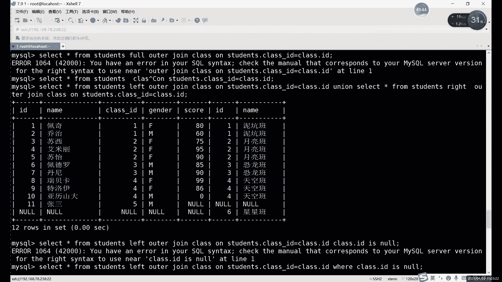
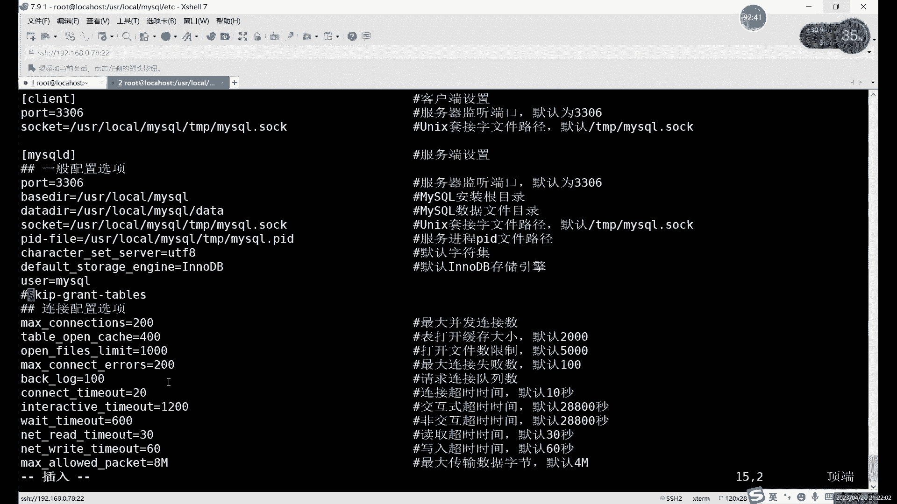

# 【小白入门必备】Linux运维进阶RHCSA+RHCE最全培训教程视频合集 - P76：中级运维-14.SELECT多表查询，复制表，破解密码，授权访问，存储引擎-中 - 洋洋得IE - BV1nN4y1X7Go

那我调整一下这种行不行呢？哎，比如说我们怎么调整呢？这个调整那时候就是调整一下信号呗。啊，class比较少，我们就不调整class，我们调整前面这个ID name。对吧ID name这就是什么？

这就是两列了，对吧？两列了，前后列路相同，那就能正常显示。但是呢又不一样，又有点问题是什么呢？是？哎，前面11位很正常，对吧？ID加姓名。后边呢从第12号开始就是1到6班级名字。Okay。

所以说呢这个联合查询呢一定要注意什么？一定要注意这个列数相同只是第一啊列数相同，只能保证我们不报错。啊，列数不一样的话，你这行直行就报错了啊。列数相同的话，我们第一能保至少能保证一个不报错了。但是呢。

第一，它的名字呢会以第一个表格。的一个表名字为例ID name。如果说你把。它的图放前面，那就什么？就是以ID和啊也是ID和name对吧？这个名字确实是一样的啊，名字确实一样的。

但是呢你这个数据呢肯定数据不一样啊，数据真正表示的含义不一样。所以说这里一定要注意，就是又就是联合查询连接的两个。联合查询连接的两个这个命令。连接这2个3命令，查询结果呢。

从不管从数量上还是从这个意义上都要保持一致。这样的话，你查询的结果才有用，对吧？不然的话，其实你这个联合函就没有什么意义。就像我们这样这样查的话，其实。诶。数数据比较少，其实我们还能看懂。

那数据量比较大的情况下的话，其实你根本不知道显的是什么。啊，这里的话就是什么？这里就是我们这个。联合查询的用法最好是什么？最好就是像我们上边这样。就是每一列呢啊就是两前后两个语句的一个列数相同。

而且呢意义相。啊，尽量保证列似相同和利益相同。这样的话我们查询出来的内容呢，至少是什么呢？至少是正常，对吧？虽然说我们的数据确实还是有点不正常，都是空值，对吧？但是这个是因为什么？

这个是因为左右连接对吧？外连接的一个原因。

啊像像这边这个全连接其实还是还好，对吧？全连接的话，就不管我们上面其实这个用unual的时候，其实每个字段都一样，而且每个字段的数据。它的含义其实都是相同的啊含义都是相同的。这个就什么？

这个就是我们的连接查询啊，以及这个联合查询这两种用法啊两种用法。这里主要注意一什么？主要注意其实。

连接查询主要注意什么？主要注意这个数量和含义。然后呢，下面的这个连接查询的话。

然要你区分开，就每一种它分别代表哪一部分。啊，你们分别代表哪一路部分？里边我们叫内查询，对吧？相同部分我们叫内查询。相同的和我们的左边的特殊情况呢啊可以叫左连接查询，右边就叫右连接查询。

那所有都要全进去。那，左剩下的剩下三个的话，其实可以叫什么？可以叫外面接啊，就是外边的不一样的东西嘛。你看左边这个可以叫左外链接，右边可以叫右外链接。啊，中间的叫什么呢？不是不是不是说中间。

就是左和右加起来呢。你可以叫他。全外连接对吧？这个我们叫全连接这俩我们加起来可以叫全外连接。全连接用的主要就是。后边的几种，后边的一。23。4种。啊。

全连接全外连接左合外连接和右外连接这四种话都要用这个联合查询。就是因为主要就是因为马特罗的不支持那个报那个命令啊，不支持报命。是foral命令。所以说呢我们这里就全部用是吧，全部用联合查询来代替。

这个联合查询的话，其实就是就是因为我们的两次查询结果是一样的。所以说呢就是查询的这个内容一样。所以说呢连起来的话，数据都是正常能正常显示的啊，就不像我们刚才啊强行相当于是强行联合啊。

强行联合的话没什么用啊，这是联合其实相当于没什么用。你正常的一个联合联合的一个查询的话。😊，一定要保证什呢。你可以不是一个表格，但一定要你要保证数据相同。如果是一个表格的话。

那尽量也是保证我们的列数相同啊保证列数相同。这就是我们这个多表查询这边的一个内容啊，多表查询的一个内容。然后呢，我们查询的话，其实主要内容的话就是这么多啊，包括我们这个。啊，单表的这个。单表查询对吧？

后面我们讲这个嵌套的查询，然后还有这个。嗯张啊，或者说是这个。多表查询啊，就是连接查询嘛啊，用就U连接查询那这种方式。总之的话，其实内容还比较多，对吧？我们一共讲了。一节课加。3分之1。啊。

大概讲了3个多小时了。然后就是在这个查询这里。啊，当还不到4个小时，差不多3个多小时。哎，就这里的话，这个查询内容的话其实非常常用的啊非常常用的。Yeah。嗯，所以说这部分的话一定要什么呢？一定要保证。

保证这个联合查询的一个。不管是哪种查询方式了，大家一定要都。有多练习多练习多记啊。因为后边这几个命令的话啊还是有几个陌生的命令啊，还有几个陌生的命令。啊，空值转换。NVL这个NVL这个函数的话。🤧。

不巧。这个这个它只适用用于oracle函数。他的只是用啊，不是，不是ar，只是用arical数据库。啊。7。然后呢，我们接下来的话就继续往下看啊，继续往下看。查询这里的话就稍微啊稍微再总结一下。

上面的话除了这个理料查询以外的话，我们再来看一下上节课的这个单秒查询这边的。

啊，代表查询这边一个。比较常用的几种用法，对吧？常用几种用法。其实主要就是在哪呢？主要就是在啊，其实这里我就单表都表就一起说了啊，一起说了s前s后边的话对吧？我们其实就是加什么？就是加这个。

星号字段名称或者说是函数对吧？或者说是什么，或者说是分组的这个。分组的后边的一个具体的一个。具体信息啊有分组成员的一个具体信息。然后form号后边的话，单表这里我们只写一个表名就行了。多表的话。

两个表明或者说是用我们的连接查询啊，连接的条件啊，就是在from后面要写的。当然for我这后边还可以写什么？还可以写这个嵌套语句里面的什么呢？嵌套语句里面的这个。一个表格里边。

比如说你一个exc语句查询出一个完整的表格啊，不是不是简单的几个数据，而是一个表格的话啊，你查询的话就是签到查询肯定只能放在这个位置啊，就from一个签到查询的语句，然后给它起个别名啊。

这是from部分from部分其实还是还是算比较少的啊，威尔这边其实是最多的啊，威尔后边的话就是内容很多了啊。威尔的话就。就是我们上面讲那些单码查询的一些用法。然后威尔之后呢，就是条件语句之后用什么呢？

用的就是g by和什么呢？和这个。order by这两种，一种呢是。分组一种叫排序啊，bue by是分组，然后order by是排序。然后当然还有个limit没有写在这啊，就是你分组啊分组也好啊。

排序之后啊排序也好，其实哪种排询方式都可以，就limit可以加在任何的语句后边，就是用来分页的。啊，另面的可以用用在任何语句的后边。然后。特殊的一种用法叫h对吧？一般是用在这个blue back。

goby我们一般前面都会用一些分组之后呢，我们前面都会常用一些这个函数是吧？用了一些函数之后呢，这个having这里呢啊就可以用having那个函数呢对我们的这个查询结果呢进行二次过滤。

为算是第一次过滤啊。having的话算是我们的第二次过滤。两个用法一样，只不过呢就是一个是对在输出。相当于是威尔的话，这个过滤的比较早啊过滤的比较早。相当于威尔就是首次过滤用威尔，对吧？最后就是。

数据马上就。展示给我们看的时候啊，最后一次过滤的话，我没有人用海y。用法是一致的啊用法是一致的。啊，然后剩下的其实就特殊的就是在from后编制里，我们这个多点查询的几种几种语句，对吧？几种语句啊。

准确的说的话，其实只有几种呢，我们mysql里边只有3种。啊，准确的说只有三种。因为剩下四种的话，我们虽然说算是几种连接，但是买搜狗不支持这个命令。啊，所以说多少权序这边我们的命令呢其实只有3个啊。

内查询iner join左是left，右呃左是left outer，右是right aler。然后呢，通过这三就不是通过这三种，通过这两种啊，通过后面这两种的一各各种排列组合啊。

再可以再生出四种不同的连接方式。哎，就是我们刚才那两个椭圆里面看到的。啊，就是。其实。那这就是我们这个查询的一种方式。然后最后一个嵌套。它就是俩语句，或者说三三个语句就更稍微少一些啊，你尽量不要用太多。

嵌套的话用太多就太冗长了，有点就是有点太。显得太low了，太长，越长的话显得越low，最多用两个其实就可以了啊，就是side里能用两个，其实就是签到这里能用两个，对吧？一种的话是加在哪？

一种加在from后边，一种加在where尔后边。啊，后面作为表格，记得加别名，V尔后边呢就是类似于一个条件了。啊，类似于一个条件。或者说其实也可以算是数据啊，数据条件都行。啊。

这个的话就是我们这个slash查询这边内容啊，slash查询这边内容。哎，总体上来说呢东西比较多啊，所命令也比较多。啊，一定要多练啊一定要多练。好吧，那我们接下来的话。呃，查询说完的话。

我们接下来是什么呢？

啊说完的话，我们接下来继续往下讲了啊，继续往下讲。诶。那就按照这个顺序吧，按按照顺顺序来说啊，查询这里。啊，复制表这复制表这个其实很简单，这个其实就是几个小命密，这个叫秘密啊。

我们大家可以大家可以下课休息几分钟啊，我们一会儿回来继续。好，我们接下来继续来看一下这个啊我买思库里边一些。特殊的这个是一个小命令啊，这是简单的一个小命令复制表。复制表的话，其实就是。主要是两种用途。

一个呢是复制表的结构，另一个呢是复制表数据啊，复制表数据。就比如说这里其实更有用的是什么呢？啊？就是复制表数据和表结构里面，其实更有用的其实是结构。啊，当然数据也可以复制啊，数据也可以复制。

其实更有用的其实还是结构结构有用一点，对吧？就比如说你想要创建。只重新哎创建一个表。

或者说创建一个类似的表。啊，你重新创建的，肯定还需要花点时间，对吧？你需要去考虑一下这几个啊我们的每一个。约束呀，考虑一下索引的问题，让每一个字段约束条件怎么写？如果是你有已经有一个非常做的比较好的表。

你可以什么？你可以先复制一下，复制之后呢，再再简单的改一改，对吧？这也是一种方法啊，就复制表这个。😊，当然复制数据也可以复制啊，数据可以复制。不果数据复制的时候呢。

你肯定要保证什么保证这两个表的结构一样才能复制数据啊。所以说首先的话你要做复制的话，那肯定首先是要复制什么？复制我们的表结构。其实呢我们是在这个。哎，断开了怎。嗯，这里。哦，对IP变。

他样就IP变IP变。那，ID点是什么来着？我刚才我刚才就是连服务器的话，我得连公司内网。好的，现在应该正常，我看下这。那网络是多少来着？

我重新获取一下IP啊，这个是这个就。就是第就是N，就是条件模式的唯一缺点。一旦换了模环，网络环境就得换IP。

0点78啊，这个倒还好。

一般获取一次之后呢，一般不怎么长，不怎么经常变啊，不怎么经常变。这个78网站是我手机热点IATT手机热点的网站，0点78。

这是调节唯一的缺点。除此之外，调节模式其实还。其他就没什么缺点，就是唯一这是唯一的缺点。这是官网段。阿黄的。我刚才连现在的话就是在公司网站里面，我们公司网站就是连网的，不是跳板机。啊，不是跳玩戏，就是。

😊，光司你网道很多。像零啊什么的网站其实很多我是现在相当于是我我和这个服务器是在同一个网络环境里面，我我都可以拼同服务器。对吧刚才那服务器是多少个IP来着？十八点。147。对可以直接拼通的。

我就是是不用太板机。啊，当然如果是在如果不在公司的话，在外边啊在外边的话，你可以用跳板机点可以用跳板地点。在外边就只能用开法进连，只要是在公司里边，就直接连公司的wifi连上wifi之后呢。

公司里面几个服务器啊，什么都可以直接连。然后这里的话我们看一下嗯。正常我们再进一下数据库，再进数据库刚才给状态连接了。嗯。啊，建议啊买啊不是买载索，是啊这个数据库。布制表的话，首先我们得有一个目标。

对吧？首先我们找一个什么呢嗯。主要就找students吧，这个表是我们这里面数据最多的一个表啊，数据最多一个表。啊，挑板机的话其实就是。他其实就是一个中转的一个机器。它它其实可以是服务器。

也可以是虚拟机啊，也可以是台电脑。这里其实跳板机的概念其实很很很广，跳板机概念其实是比较广泛的。听系应个系主角翻。保累计的话，现在其实我们更多的说的是就是以那个ju server对吧？

ju server。其实怎么说呢？这个概念我说这个跳板机啊和我们后面讲的那个跳板机不一样。😡，啊，我们后面课程里面讲那个daserv那个跳板机呢。😊，She。他这个软件，我说跳板机。

它就是一个电脑虚拟机。我们连的话一般就是。直接远程连一台虚拟机上来。啊，这是连连在虚拟机上，然后就能连到公司内网上。这个挺小金和你想的不太一样不太一样。总体上来说呢，其实就是堡垒机呢更安全一些。啊。

其实堡垒机跳板机功能差不多，就是堡垒机更安全一点。你从名字上来看啊，跳板的话，它只是提供一个，主要提供一个访问啊，能访问。啊，堡垒金的话，它更功能更完善，更安全啊，安全一些。而且呢保垒机的话。

它能管理的这个网络的模就管理的网络其实更大一些啊，条板机一般就是只是对少量的主机进行管理。Okay。啊，这里我们不多说不多说，这个还是后边我们会后边这个第几阶段。也是456阶段会讲啊会讲。P。

这里进来之后呢，我们复制表的话，其实。总体上来说呢，用的其实是什么呢？用的是like。like个这个大家还记记记记得这个它命用啊。呃我们在哪儿讲过呢？在上节课。哎，我们的查询那里。

赖查询我们就讲过这个like。它什么意思呢？它是模糊查询的意思，对吧？也就是像是吧？它翻译过来其实是像。😡，然后它这里相当于就是什么？就是我们正常创建这个表的时候。啊，比如我们之前如果说创建这个表一。

创建表一的时候，如果是like表二，什么意思？就是像表二一样去创建表一，就是借用表二的结构去创建一个表一。就相当于是把我们这个表结构给复制过去了啊，相当于我们把这个表二的结构给复制了。

这个就是我们复制表结构的一个。命令啊或制表结构的命令。其实呢我们的整体上的表结构以及表这个。嗯。其实我们看一下怎么吧，我这里再连一个终端上来。Root。可以看一下，我们切换到。

user下logo下的my circle里的。贝目录对吧？这个目录是我们买F里面放数据的。啊，帮我买这个数据的目录。然后里边的话。你就找我们自己的自己的这个库啊，设到我们自己库里边。每一库的话。

其实就是一个目录。😊，来看我们这个码头里面存数据方式，其实每一库的话它其实就是一个目录。然后呢，这个目录里边呢会有很多个什么呢？很多个表。对吧表非常多。这些表的话我们可以看一下这些表。

主要就是两种格式啊主要就是两种格式，点FRM和点IDB。啊，IDB。我们这里这里的两种的话其实是什么呢？你看我们每一个表格呃，前面这些的话呃，它因为我们写的是中文啊。

中文中文它这里换一种表示形式啊换一种表示形式。可能不太好认。所以说呢这尽量表格呢怎么说呢？但起中文也可以，这个倒也不影响。只要你字呼机设置的正常啊，那我们中文其实只要不乱码就行啊。

尽量的话是设置英文好一些啊设置英文好一些。然后这里的话我们这两种文件呢，它其实分别代表就是什么？代表就是我们的。这个叫。结构和什么结构和数据。哎，结构和数据。然后这里的话这个。F2M文件是什么呢？

F2M文件是这个我们的这个包括里边有结构啊、字段类型啊，各种我们的约束的信息啊。然后IBD的话就是直接放什么？直接放这个数据啊，直接放数据。

这两个文件其实于相当于我们的其实mys里面纯数据其实是分成两部分的啊，分成两部分。啊，一个部分一个是结构，一个是数据啊一个是结构，一个是数据。然后的话所以说我们这两层的分开去复制啊，为什么能分开复制呢？

就是因为我们其实是俩文件。啊，两个文件呢大家肯定是有关系的。当然他们存储是公开存的。哎，分开去存储。然后这里的话我们看一下这个。如果只是复制一个结构，create。

比如说我们create这个table student。Like student。啊，又换了一个名字啊。直复制。复制完成之后呢，我们可以来看一下这个student这个表格啊。复制完成之后呢。

其实呢我们这里面其实没什么东西。啊，因为什么？因为它是一个我们只复制了表结构，所以说我们一直都只能看一下这个。可以看一下表结构。有点な。他和tudents呢是一样的，哎，就是他包括一些这个啊我们的。

叫什么来着？字段。约束以及一些约束索引。包括我们的这个默认值啊。递增约束啊，这些其实都能复制过来啊，这个就是什么？这个就是复制什么复制我们的表结构，还有只要结构。就相当于是复制的谁呢？

相当于复制了我们的FRM文件。啊，FR文件那文件啊，就这个文件这词叫FRM就相当于把它给复制了一份。然后我们可以现在看一下LS啊。L怎么就多了一个吧。看又多了一个。又多了一个tudent的表格。

那只要有一个表格的话，它就会创建这么两个文件。当然现在我们的IBD这里这里它相当于相当于现在没有数据啊，它是没有数据的。我们要什么呢？我们要给它插入点东西啊，插入点东西，它在这里才会有数据。

就是你创建表之后呢，它就默认会创建两个不同的文件，一个层结构，一个层数据。然后这里怎么去导数据呢？很简单啊，就两个表格当中导数据其实只需要什么？只需要ins的命令。啊，这也是我们颜色人面的一个特殊用法。

就是复制表数据。然后我们上面这个复制表结构，这里呢啊就用的什么，用的是create命。啊，其实就create命令呢，然后一加加上怎加上like帮忙对吧？用like这个项啊来把结构复制过去。

而复制表数据呢，它通过的什么什么是什么方式呢？就insert into。哎，通过insert input这种方式，正常因为这常我们插入数据就是这样插入嘛。不过这里我们是少了一个什么，少了一个value。

啊，那value6去了value我们直接加在后边了。😡，就我们这个value呢不写在前面，就是前面就不用写了。因为什么？因为数据呢？后面都有那怎么来的这个数据呢就是s from，对吧？

s from的时候，其实我们能返回什么呢？返回非常多的，就相当于把我们整个表格的数据返回了，对吧？因为代表所有嘛所有字段，后边没有限制条件，所以说我们所有数据都在这里。

然后我们通过inser零就能把我们表二的所有数据呢导入到表一里面，这个就是复制数据的一种方式。😊，啊，或者数据的方式。然后接下来的话，我们看一下这个。这边啊。导入的话直接换成什么insert。

刚才创建的时候复制呢也用create创建导入的时候复制呢用什么呢？用SDUDNT啊，用insert去复制。我们是哪个表格来着？啊，我们是。stuuddent到复制到。啊。

student复制到students。原来那个表格叫students，对吧？原来那个表格叫student。STUDNTS对吧？这个表格相当于是把这个表格里边先查询一下，就相当于我们这得先查询。

查询的出来数据是哪一部分呢？就是我上边我上面都看过了，然后好多次了对，我们就去哪个了。嗯，对这个对吧？就这个数据把这些数据呢，当然不包括后边的班级啊，就只是前面自己的一个学员信息。整个查询之后呢。

导入到dent里边，一共导入多少行呢？十一行对吧？十一行。导入之后呢，再来看的话，它就有数据了。对吧和我们的students是一模一样的，约束也是一模一样的。所以这种的话就是完整的复制表的一个过程。

当然这里复制出来的话，就是什么都一样啊什么都一样。但是后边你要改的话，改表结构用什么改呢？用aler去改啊，修改一部，你要需要修改一部分的话，用alaler去改。如果修改数据的话。

update再去改就可以。😡，俩修改命令。当然这个是正常，我们复制表结构啊，复制表数据都可以。啊，如果说你只是想要数据啊，只是想快一点，我只是要一要提提取一下这部分数据啊，只要这部分数据，不要结构的话。

还有一种方法就是直接在creit的时候用slaag去导入。啊，这种的话比较比较暴力一点啊，你看这个的话，我们是慢慢的我们先来结构再来数据，把create来结构insert来数据。因为正常我们的这个。

我们的。存储。啊，我们买W里面存储，或者说是。以及日志啊，mys里面我们也是有日志的啊，也是有日志的。马s里面存储也好啊，日志也好啊，其实我们一般存的是哪哪两个数据呢？或者存那拿那两个命令吧。

准确来说是我们存的就是create和 inserts，只有这两个命令，没有其他的。你select也好啊。😡，dele也好，up也好，我们不根本就不要。啊，我们日志里边。不是说日志里边嘛。

准确来说就是我们存存的数据里边日志当然还是会记录这些命令的。嗯，我们存储数据的话。或者说你导入的整个数据或者导出的数据，其实里边只有什么，只有create和音色这两种。为什么呢？因为。

创建的表结构只需要create面就行了，对吧？插入表数据只有inser就可以了。那些dP其实都不需要。就是一个完整的表格的话，其实只需要这两个命令。啊，只需要去两个面。

这为正常我们日日志里面当然会也记录很多，嗯，是那个什么是。备份的时候啊，我们后边讲备份的时候，以及这个。啊，我们这个真正存存储数据的方式，其实就是通过这两种命令啊，就是这两个命。然后呢。

这种复制大体结构以及全部数据的这种的话，就主要是为了数据。这种话就主要为了数据了，基本上就不要结构了。为什么呢？为什么这种不要结构呢？你大家可以看啊，就是。select from这个表格名称。

它查询出来的是什么？它是不是只有一个什么？只有一个表结构，不是只有表数据和什么呢？和我们一些字段的名字。对吧啊最多可以也可以带一个数据类型。单到后边的约束的话，它其实就没办没办法去写。为什么？

比如说我们可以举个例子。read table我们用student。一啊我们这是换一个表格名字啊，因为刚才已经创建过一个了，我们现在换student一。C一这边的话，我们用。Create me。

Recreate。第二个是。啊，create的话，我们还是用哪个表格吧啊，当然这里其实用那个students也可以用students啊，students也可以。因为那俩表格现在目前是一样的对吧？

目前是一样的。嗯，这里的话我们就直接用。也用还是用students其实都一样啊都一样。用这个命令啊，因为这个它查出来主要就这些东题，对吧？他只有这个数据和一些这个字段的名字。所以说他复制之后呢。

可以正常复制，但是呢你复制出来的内容呢。这个命令主要是用来复制数据。因为什么？因为我们的s命令它查出来，主要就是数据结构的内容很少啊，关于结构内容话，sag能看到的很少。所以说呢这里一般。

能复制出来的就是一个数据。结构的话，它这里有个小一点东西啊，ESC。tuent一。我可以看一下。原结构在哪？我们把原结构也列过来。DSZ。Students。其他有多少还不变，就是前面的这个。

资源名字啊以及数据类型，这个还是他们勉强可以复制过来的。但后边的话其实我们也只是展示了一个什么展示了一个。啊，只是我们这里只有一个特殊的约束啊，就主件主件这里的话呢直接就没了啊。

这个什么这个不能说主件嘛，这里应准确的说应该是自增约束，自增约束也没了。啊，没了之后呢啊这里因为这个默认值。啊，默认值的话，它也会你相当于这里直接把这个什么把这个主件给去掉啊。

所以说它这默认值这里也受到了一点影响。因为原来它有一个自动约束嘛，现在这个自增页数也没了。

然后这里的话其实总体上来说呢，其实就是不会复制这个主件啊以及索引这些信息。那就少一些关键的信息。你就是少了这个东西的话，其实作为一个表格来说，它其实就有点不太合理了，对吧？

如果说你一个大表格没有索引的话，其实这个这个这个事情很恐怖的。这情这前很恐怖，你查询下查询数度的话就变慢很多。所以说正常的话，你如果真的要复制一个表的话，最好是用什么用这个create命义去复制。

呃就like命义去复制，以及什么以及这个inser into啊，复制数据这么去复制，复制表格用这个这个的话用的相对相对他们两个来说还要较少一点。因为它这个是相当于只复制数据，一次性只复制一些数据。

结构的话。基本上都没了啊基本上就没了。哎，这就是我们的复制表的这种方法啊，复制表的方法。Okay。然后呢，我们接下来继续往下看啊，继续往下看。中间的话这些是那个多点查询啊，多点查询。吧上序结束之后呢。

我们接下来先强调一下什么呢？先强调一下这个myscle的这个破解密码，对吧？这个其实。你放在前面说也行，你放在哪个位置，谁都可以。因为这个一般能用到的很少。

但是呢前几天不就有一个同学密码密码进进不去了嘛？进不去不就得破解了嘛？啊，啊提前给他看了一下这这个这个笔记啊，今天我们具体来说一下，其实他呃原理上很简单啊，原理好像简很简单。

就是当然这个大家注意就是不要怕他那个。不要发它说不安全，这个其实你和破解root密码一样。😡，你不在你机器旁边，你根本就破解不了。😡，你远程根本就别别想破解，远程根本破解不了，对吧？

你正常我们破解root密码，你也是直接接入到机器上面，对吧？虚拟机这个我们是也相当于接触到机器嘛，是吧？因为你这个。Okay。这里的话我们可以看一下这个破解入职密码的话，首先也是需要用呢。啊。

需要在本地啊，还有。然后呢，在哪呢？进入到我们这个。ETC价的。麦点森爱和这个这个这个这个叫什么？配置文件啊配置文件。当然这个配置文件的话是什么呢？这种的话是。原码他也不是不是原码。

这个叫验码安装以及RRTM码安装的这个默认的位置啊默认位置。当然了你即使不装。他也有。哎，不是在这，他不装，他也有这个文件，为什么呢？😡。

这个文件的话，它其实是什么呢？LETC啊不是。VIMETC家的卖点怎么样？他准确来说呢，其实都不能算是文件。喂就系醒你。我们件去。这个文件的话，它是什么？它是那个。它其实默认是那个买2DB的一个文件。

它不是买figo的配置。他默认其实不是买do有的配。啊，VI我看EPCR的慢。啊，有对吧？还有。这个是我们这个它其实默认是谁呢？它其实默认算是这个你即使不装matto，它有有这个文件。

它默认是merDB的这个配置文件。当然你装了myto之后呢，那就是用my搜用了。啊，要么的话是PM文中你改这个文件啊。来这个文件。

然后呢，在如果是原码安装的，改哪个呢？改我们配置文件嘛，你具体位置放在哪儿呢？如果是按照我那种方法的话，肯定是放在这个。user下logo下的买搜go里边的一个叫。ETC目录的对吧？

ETC目录的就就是就是这一个文件啊，就是ETC的麦克。啊，直接来编辑这个文件就行了。编辑之后呢，我们修改哪部分呢？我们修改。mysr里边就行了，就是在myci里边去写啊，大家注意啊，这在这个里边去写。

😊，这个代表的是我们的服务端啊，这表示客户端的连接啊，这个表示客户端的连接。我们改的是服务端。因为我们现在是。需要什么呢？需要在。需要如果说你现在密码忘了，你需要什么？其实需要改密码的对吧？需要改密码。

改面我们是需要进入到我们数据库里面，所以说我们改的这部分。啊，不要改错，你不是说写这边，你这边不管用啊，你写在mys里边。

感谢啥呢？节就改加一个跳过的一个用法。啊，加一个跳过。

比如说我们随便你加一行加这一行。这不用。啊，不者粘贴到这里就行。这里的话其实你可以平时就可以写在这里面。然后呢，你前面加个井号，加个井号注释掉。啊，加个井号注释掉，这样你平时是不会启用的。

你什么时候忘了密码了？你进来之后把这个井号一去。😡，一保证退出重启数据库，你就可以改密码了啊，这个可以你就不用删，你就留在你的这个文件里面。啊后平时呢你用井号注释掉。啊，平时用井号入制掉啊。

你可这样里卖3F那个文件的话。😊，Okay。我们用源码安装之后呢，应该是已经删掉了啊，就已经删掉了。因为它默认是谁呢？默认它其实是一个M尔DV的配置文件。啊。那这个其实。就直接写在配置文件里就行啊。

这个就写在配置文件。这个配置文件具体的位置的话，这个这个得看你怎么装的啊，得看你怎么装。😊，那个E阶站的麦耳方案不就是。RPM和样板安装的啊，这里的话我这里就直接保存退出啊，完成退出。啊。

这个它相当于什么呢？它就是相当于绕过我们的这个买思的一个身份验证。就类似于免密登录了啊，就是免密登录的意思。

啊，然后呢一定要记得重启啊，不重启没用。红击之后呢，就可以正常登录mysql了，而且是不需要密码登录啊，不需要密码登录。mytcle当然用的话还是mytl杠Uroot杠P对吧？你忘了密码了。

这里你就不能再加密码登了，对吧？那怎么办呢？你就直接回车就行了。😡，回收他让你输密码是吧，你不要管他，你再来一个回收，他就进去了。😡，啊，因为我们加了那个之后，它相当于绕过了么，绕过了我们这个。

正份验证啊，绕过的身份验证。这个正常情况下，你正常你就注释掉啊，用的时候再开啊，用的时候再开。然后这里的话。继续啊继续去改啊继续去改。接下来怎么改呢？我们用什么命令呢？我们用这个upate命令。

因为大家还记得我讲的就是演示不是演示看给大家看过那个数据库嘛，不是数据库数据表就是那个。那个叫my circle点user。啊，我们的用户信息表。啊，用户信息表。用户信息表里边的话，我们是有个什么呢？

那有一个嗯。叫权限对吧？以及密码，用户心表主要就是写权限和密码，对吧？之前我们其实看过权限那部分。这里的话我们就主要是什么？主要是改密码。改密码的话，我们这里用什么？就是直接去改那个表格。

用update命令。哎，就阿得修改user表格，设置哪一个呢？就是offed杠 string，就是密码的一个字符串。俺马珠串。当然改的时候，具注意，还最好还是加上加上我们的paro的函数，就是加密函数。

哎，最好加上我们加密函数。如果你不加的话啊，就相当于你就是名文密码了，就是名文密码，当也可以用，但是。你也就所有密码就是你的入口密码都会被别人看见的，肯定不好。

所以说呢我们一般就用pa多的函数给我们密码加密一下。啊，如我密码加密一下。然后这里的话买s5。7呢啊就是强调一下，就是mys5。7呢在这个跳过密码的时候呢，你跳过之后呢，就是所有用户呢都可以连接。啊。

所有用户都可以连接。然后呢，8。0以后呢，它是什么？就是跳过密码呢，只有roT用户能连接。呃，其实没什么太大区别，就是。就就8。0之后就只有root用户能连，就是跳过之后呢，只能用ro存用户去登录啊。

就这么一个区别。啊，正常啊其他命运其他命令只区别不大。然up这里的话。update这里呢我们用什么呢？我们用这个。正常修改就行啊，正样修就可以了。这这个其实不用记，因为什么？因为这个长字符串呢。

我们这里边有对吧？我们切换到my circlecle里边。

S tables。哪个表格就是user表格，最它最下面这个。对吧我们可以先看一下。select新 from。user，然后呢，where我们限制一下user等于。你 i d。这字段应该是一会ID吧。

听不太清了，我试一下。嗯。啊，不是UID。我们直接看吧直接看吧。啊，这user直接用。user我们直接写什么呢？直接写root吧。user不是root吗，这边。user等于root。没问题。啊，对。

没有加什么没有加这个。我们字符串啊我们是字符串，不是是数值啊，或是数值。这里的话这个就是买客的这个信息，对吧？买受的信息。的root用户信息，这里它本身就加密的对吧？你正常你update的时候。

就是update。Useer。that哪个能件复制营。那你他就完事。等于对吧？引号里面加上我们的这个。password的一个。加个函数对吧？你随便去改个密码对吧？我密码就不变了。这个密码你随意啊。

加上这加米函数。然后呢，我们需要大家注意啊，需要设置一下那个设置一下这个威尔啊。威尔看一下这个是哪个来着？啊，右侧等于root就用这个条件，就用这个条件。啊，就是把平常你给ro用户改密码啊。

就只给右s用户改密码就行了。其他用户的话，你正常还是用原来密码就可以啊。当然如果你忘了的话。

默了的话，你就用入用户直接改就行啊。只要你知道入用户密码，其他用户密码，你随便改了。😡，啊，其他又后秒随便改了。所以主要我们只要改这个入用户就好啊，你忘的话，其实肯定是忘的入用户。你问普通用户。

你着着什么急，对吧？这个可不用着急。Yeah update。更新就可以啊更新就可以。

啊，但这里的话也不用加这个啊，这里的话我们这个子物串。因为他这个。我说呢他这个是女孩夹在中间。他这个函数的话相当于是已经是一个zo号，所以倒也不用加，也可以不加。你直接在这里更新。继续。

人现在这这哪来就买四个点爬树。uppd user。这改的是哪个表格来着？啊加上我们改的是user表格呀。

他现哪是打哪里打错了，他们是user。对以。Where。

又是等于6。报的是买这个点，因他说是不存在。😡，啊，我多了个单词啊，多了个字母是吧？啊。他说这个函数不存在，他说函数不存在，我们这个是。你这个不就是修改密码嘛，对吧？不用重新设置密码。

这个你不是就是修改密码的意思，对吧？你就把密码修改成一了呗。😡，啊，你想改成底改成底，这个的话就跟。这的话和fa帕多尔内部是一样的，fa帕多尔内部是一样的。对我们之前不是用这部去改吗？明吧。对吧。

之前我们是用这个名。啊，应个是这个命。你是因为什么？因为我们现在用了什么，用了这个跳过了跳过认证啊，跳过认证了。就是这个命令就不能用啊，不能用的话，我们就只能用什么，直接只能只能是改那个表格。

因为我的密码的话，其实归根到底是在表格里边的，所以说我们只能通过改表格去改密码。就这个密码因为不能用啊，所以说我们是用这个upate命啊，用up命令去更新。然后这里的话更新好之后呢，你直接退出就行。啊。

这是就可以。所以之后呢再编辑一次啊，需要再编辑一次这个慢点CF这个文件。然后呢。如果你怕以后还再用的话，你就井号入市吧，不用删了啊。如果你记性不好的话，就井号入室吧。后边如果经常用的话，也方便。

保他结边就可以。重启一下来它 work不是my circlecle买cicle。那重启好了之后呢，我们可以看一下啊。喂慢点声。直接用什么呢？直接用mysrcle杠U rootot。杠P1再登录就行了。

对吧？你改完密码就方可以再登录了啊，这个就是强置修改入成密码的方式。主要就是忘了之后呢啊就只能用这种方式了，没办法，这个其实。怎么说呢？做的其实还是比这个重置root，重置一下系统的入途密码方便一点。

对吧？因为至少我们这只是一个服务啊，没有系统那么大，就是肯定要比重置rootroot密码可能要快一些。密码文件修改了，静改搜lo之后，需不需要选不不用改了。就是你第一次就是刚刚创建好。

就是刚刚安装好数据库的时候，第一次需要改个密码，后边的话就不用再改了。后边不管说干什么操作都不需要再改了。啊，后边就不用再改，后边你。啊，那些就没有那就是最开始就是为了。

他只是设置了一个最开始就是只是为了安全，但也不是为了安全。但其实只是嗯想让你进入数据库之后再再去修改密码，或者说因为本身是它自带一个密码，自带一个默认的密码。啊说是为了安全，其实也没什么用。啊。

因为你第一次能用的密网人员，只有是本地用本地登录上去的人。啊，因为因为其实第一次的话，你远程是登不上数据库的。啊，只有原小远承端数据库的话，必须要授权啊必须要授权的。那么授权命令夹查没有没有存。

没有多说都说完。啊，没有都说完。一会儿还得再说一下啊，我得说一下这个授权秘密啊。授权命令的话，它是用来干，它主要就是用来。我们之前是第一节课的时候，其实讲过对吧？讲过一点授权命令的话。

我们能给大授予这个权限，对吧？能给它。呃，当然密码这个密码是其次啊，主要就是授权。给密码的话，其实商业用户的时候给密码。啊，就是关命名对吧？大家应该还记得。白面我们就说这么多啊，没什么特需要注意的啊。

没什么需要注意的，就是几个命令而已啊，几个命令而已。下边的话就是这个授权的问题啊。授权的问题的话，我们前面说过对吧？说过这个。

我们前面就是用什么，我们家前面就是讲了一个用户，对吧？啊，给用户授这个权。对，没有说当时没有说什么，没有说这个关于远程连接的问。买里面你想远程连接，不管是其他的数据库连接也好。

还是用一些远程的软件连接也好。都需要什么？都需要远程的授权。就是你如果不授权的话，你就只有本地能登录。除了本地以外，其哪都登不登不上去。啊，哪儿登不上去。然远程软件或者说其他数据库去访问的话。

或者其他软件访问不一定是数据库啊，就是我们后边也会讲很多这个像INNP啊，这些也其他的软件去访问，不一定是数据库啊，不仅仅单单是数据库访问。我们这里来看一下这个访问授权。这实权限这里我们都已经说过了。

对吧？啊，库件表都已经说过了，之前是一直没改这个IP对吧？IP我们一直用，一直用是local host。因为那节课第一节课的话，我们就开了一台数据库，对吧？开一台数据库。如果说想要验证这个授权问题的话。

其实是是需要什么呢？需要两个数据库，或者说是去安装一个像NVK那种远程软件啊。然后这里的话我们就直接用虚另一台虚拟机连就行。然后这个授权的话。主要就是提供给什们。

就提供给其他服务啊或者其他软件啊去进行连接的。

我们这里授权正常直接就。我就不考虑权限的问题了啊，我就是授理所有权限了啊，所有权限所有库。后这里的话我们就可以写IT了，对吧？之前其目都没写过，这些预计一直用的什么？一直用的是local host对吧？

local host。当然也可以用什么？可以用。如果不想写ID，可以用百分号。百分号这里我们也代表所有啊这里代表所有。500万号哪里用过呢？like命令那里用过对吧？like那命令那里用过这个。这个叫。

本问号就代表零个或者说多个字符吧啊，零个或多个字符，我们这里也是一样的啊，但它它不过它这里代表应该算是所有就是所有的IP啊，这就是所有IP例啊，如果说你想只要指定某1个IP去访问的话，比如说谁呢？

比如说我找个数据库啊。找一个数据库。

啊，这个数据库的话，我们看一下。India。0。107。

好，那我们就授予0。107的权限。

啊，允许另一台数据库连接。0。107。

那我们先连上来，不着急用啊不着急用。但在这台的话是我们不能一直在用的数据库啊。后边第三个连接的话，我是开了又开了一台。其实主要是用mysqcle命，因为你正常的正常的服务器，你是没有mysq这个命令的。

你想连接的话，就只能是用其他数据库，或者说是一些软程远程软件啊软件。都可以。我们这里的话首先先授权啊，没有授权的。命面啊在这。关了啊啊。嗯嗯星点星，然后加上IP艾。等一下，第一个什么？第一个是。

用户啊一个用户。第二个是IP啊。用户这里的话，你可以这个的话就可以就就看你给权限了啊，你给的权限入的用户的话肯定权限高，对吧？你给普通用户肯定权限自然就低一些。啊，然后这里root我们192。168。

0。107。然后呢，最后identified。I加上密码。啊，密码你随意啊，这个没有很杂度要求。要么安装的。咱默认不用设置啊咱默认不用设置。然后这里的话我们。其实也不用直行其他命义就授权就行了。

也不用刷新权限呀，不用刷新这个不用重启啊，跟这个没有关系。那直接右边就可以连接了。就是mysgo怎么连呢？就远程连接的话，就是mysqgo杠。如果用命令行连的话，就是mysqgo杠Uroot杠P。

密码加上什么？加上。杠HIP啊，因为你远程连接的话，你肯定想知道对方的IP是，对吧？192。168。0点。看下79。千球大 p。D还是不太行，我就78吧。啊，原因很简单原因很简单。

说呢7879其实都是我左边那台的IP。然后左边台其实都是都是这个IP啊。Okay。呃，这个权限。Yeah。怎么说呢？你就看这个权限，其实用户也好，权限也好，密码也好，它其实就是嗯。因为你针对不同用户。

不同的IP其实都是。策略其实都不一定一样。啊，这个IP的可以，你一直是可以是一样的啊，不是不是密码也可以是一样的。那这你的这个你比如我们前面这个什么。授权的这个策略，对吧？用户这些其实都是可以改的。

你们不同的IP它可能会涉及到不同的用户，对吧？这这个不是改大家注意啊，这个密码它不是用户密码啊，就是不是我们本地登录用户密码，是这个授权的这个IP他登录的密码，相当于它是一个授权密码。哎。

准确说它并不是我们本地登录的密码啊，不是本地登录密码，这也就是他没有改密码，他只是给了一个授权密码。就是这个IP用这个用户登录的时候，用什么密码去登录？啊，用手密码去登录。像我们本地的话。

其实就是什么就是root at local host。后边降密嘛啊，当然logo后s就。然，包括前面这个数据库，对吧？你数据库不一样了。啊，以及我们的策略不一样了。其实你这个其实。包括前面的用户。

用户如果不给入存用户的话，你给普通用户那普通用户你肯定也得要密码，对吧？你入存用户也要密码，然后你不同的IP呢。不同IP如果说你可以用设置相同秒，也可以设置不同的。这个其实都可以啊，这个都可以。

这个是你。就像我为了随为了方便，其实所有的密码都设置的是一啊都设置的是一。然后这里的话，为什么刚才连不上呢？这频也很简单。

什么原因呢？就是这个原因。啊，为什么我这里哦这个这个文档里面我就放关方墙呢？就这个事儿啊就这个事儿。

因为买这个默认用的3306端口啊，默认3306端口默认是拦截的fireword默认拦截。所以可能。一种方法呢就是放行才能这个端口。一种方法就是什么？就关闭望墙，两边都需要关啊，两边都需要关。

到房间关了，然后就可以连了。啊，这种报错它就是连就是防火墙拦了，防火墙拦截了。

啊，这就连上对吧？这就连上。然后我们可以看一下这个so database。啊，我通过这个。数据库呢其实能看出来啊是否正确啊，数据通过这个就能看出来是否正确。看我们有的有我们之刚之前之前创建的对吧？

有我们现在连上的就是左边这台。啊，现在连上就是左边这台。啊，这个的话就是什么？就是我们的。授权访问啊授权访问。权限我们就不说权限。其实我们前面已经说过了啊，权限就是我们讲那些命令。

其实都是可以分开授权的。嗯，然当然后边我们还要有一些特殊权限，到时候再说啊，还有一些特殊权限，后头到时候再说。然后后边的这个关于。IP的问题对吧？IP选射访问的时候，注意端口问题啊。啊。

你一种方法就是关防火墙，另一种方法就是单独放行330的端口。其实这种这种是最好的方法啊，这种方法比较好，尤其你在做练习的时候，防火箱随便关。哪怕你真这环境里面，其实防火枪。他也不一定有用。

我跟你说这种东西的话，光强这玩意儿。就是开着开着转发一些策略，当然还是有用的对吧？防火墙转发一些这个数据，当然还是有有用的。但是呢它这个拦截端口这个特性是不是很好啊。

fireword默认拦截拦截大部分端口啊，基本上都蓝光了，就除了SSH的22，还有SMP协议以外，基本上它都拦截。啊，基本上都他来解。Yeah。啊，你把方向关了之后就能连上啊，这样我们一个IX退出就行。

然后我们进自己数据库端话。这俩数据库不一样，这个数据库里面应该还没有什么东西。soDACABSDS对吧？是空的对吧？是空的，还没有创建什么东西，这个是进入到我们左边那台啊，这台我就暂时就关了。

左边也暂时用不上。

啊，我们大概在。下周。😡。

