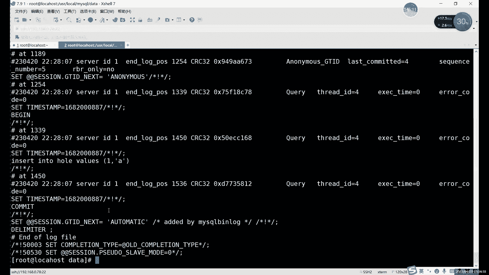

# 【小白入门必备】Linux运维进阶RHCSA+RHCE最全培训教程视频合集 - P77：中级运维-15.SELECT多表查询，复制表，破解密码，授权访问，存储引擎-下 - 洋洋得IE - BV1nN4y1X7Go

下周的课程里面我就能就会用到三台数据库了。

三台以上的数据库，所以大家可以提前装啊，可以提前装。

先剧透一下下周的课程开始，我们就本周六段还不用，从下周开始，下周二的课程开始，就需要用到三台三台数据库啊，以前是装啊，谁先装，你这个内存硬盘不一定要开很大，你稍微开小点也行啊，稍微开小点凑合凑合也可以。

只要不卡就行，因为你如果开大的话，可能哎有的有有的同学的电脑配置不太够，太够啊。

这个就是我们一个授权啊，IP tables fiber其实一样，就是两个数据库而已，嗯你从这个没啥区别，只是他俩的策略是默认策略是完全相反的啊，默认策略三个点完全相反，然后用法上当然也不一样。

用法当然也不一样嗯用一个就行了，这一定要注意啊，IPTFER用一个啊，就默认你就默认开一个就行，开两个它的规则它就容易冲突，因为什么，因为它默认是禁止所有端口，IP tables是放行所有端口啊。

他俩的规则上就默认规则就直接就重复了，所以说你默认只开一个用的话，只开一个不用就全关了就行，哎我这块盘管理啊，一核1G20G硬盘，go啊go go，你安装最小化的安装。

然后呢编译的时候记得用make me就行了，千万不要用Mac上这样内存小内杠，这是编译不了，编译不了的，直接就报错了，内存内存小的话，CPU小，内存降息都会报错，啊大家可以下课休息几分钟啊，我们会继续。

到时继续，啊这个授权访问授权访问这个东西呢很有用啊。

后边我们也会经常用的，还可以多多看一命令很简单，但是非常常用，这个真的非常也，就是我们后面各种各种各种实验都会用，每个实验都会用这个名。

好我们接下来的话内容是MYSQL的存储引擎啊，这个我们在第一节课就提到过，我们在说这个MYSL的特点的时候，其实就说过啊，就说过这个MYSQL的存储引擎的问题啊，一个合理的存储引擎。

其实在其实这个合理呢，基本上默认就给你选好了，因为我们一般啊就现在MYSQL用的哪个存储引擎呢，就是用这个INNOTB的更多一些啊，用INTEDD更多一些，也就是我们目前正在用。

目前我们现在一直创建所有的数据库啊，创建所有表格啊，除了那个全文索引以外，其他的全部都是都是这个移动机的操作啊，就现在这个系统其实是啊，不是说系统吧，就现在这个层引擎其实做的比较好啊，这功能比较多的。

功能比较完善的，然后这里的话我们可以看一下这个啊，选择存储引擎的话，其实主要就是什么，就是不同的存储引擎呢，它可能会有不同的这个索引对吧，以及不同的功能，总体上来说呢。

INNOTB的功能总体上来说是最最最好的，所以说呢现在默认基本上都用这个音乐dB啊，Windodb，嗯还有一种的话就是我们前面演示过的那个，在全文索引的时候。

我们不是用那个my sm m y i s a m那个啊，这两个存储引擎的话，总体上来说，各有优势，各有优势，各有劣势，但是呢INTEDP的优势更多啊，有INDOTP的优势更多一些啊，更多一些。

所以说呢嗯就类似于，可以这么去类比，就是我们的win7和win10，win11玩，但是不想说，因为主要用的还不多啊，就拿win7和win10来说，你就可以看成什么，就可以看成两个不同版本的系统啊。

不同版本的系统，其其实从win7升级到win10之后呢，其实也并不是所有东西都都是，都从都是变好人，大部分都是变好，比大部分都优化过，但是win10他肯定也就是最开始，尤其是最开始的时候。

他一开始一开始升级到win10的时候，其实也有很多这个兼容性的体验，有很多bug对吧，一个新的系统一般创建的话都是这样的，就像前去年去年前年的win11对吧，刚出来的时候其实也是一样，也不太好用啊。

慢慢调节，慢慢优化的一个过程，比如一开始出来的时候，其实你就可以把这个我们承认引擎呢，看成我们这个操作系统的不同版本哎，就是不同版本操作系统，我们这里的话常用的两个呢就是MSM，新德里就是哪两种呢。

就是我们在其实上面的话，我们是看了一下那个文件的，我们看到哪个呢，我们CD到点点杠的data目录下。

然后CD到数据库里面，ABD和FRM这两种格式是谁呢，他就是INODB的，就是INODB这个格式的存储运行，还有一种是哪一个呢，刚才其实没有说，就这俩，就是MYD和什么MYI，这两个文件呢是谁呢啊。

这两个文件呢就是我们的MYSM，my sm的格式的话就是这两个点看，其实我们大部分都是这个数据库里面，基本上都是这个FMIDIBD，这个是谁呢，这个是我们创建的那个叫全文索引能表啊。

这是我们全文索引的表格，然后呢存储这个，存储我们这个结构的是MYIMI存结构，然后我们MYD的话是从这个数据啊，MD主要存数据，你说什么文件，发个完整的文件，哪个文件，你是说这个笔记嘛。

还是说这个PPT，绝地，然后BT没有完整PPT，我都是我分了18个BT，我这个第三阶段一共18个V啊，如果是想想想想提前看的话，我客户发给你也行啊，你这样看也可以啊。

这个的话英特dB这里的话其实第二种叫my sm，这两种只要看到文件是这个的FMIBD的，就是代表他是INNOTB的格式，然后呢你看到这个MY开头的就是这个MSM。

接下来的话总体上来说用这个其实更多一些啊。

因为这个其实更多一些，因为什么呢，其实在这个他俩的特性上的话啊，这几个这这一页内容大家可以看一看，了解一下就行了啊，主要的话我们就对比一下什么，对比一下这个英文GB和MSM。

他俩的一个唉一个优势吧啊优势以及这个特点，就是在这个，在这个我们的下一个一个叫不是下一个，这个是我们的第一节课里面，我不是说过一个SQL语言嘛对吧，SQL语言里面我们介绍了几个呢，我一共介绍了四种对吧。

介绍了四种，这四种对吧，这这这种的话，数据定义语言我们已经讲完了对吧，就是他们三个命令数据操作语言呢，就是这三个命令数据权就是数据控制语言的，就是管理权限。

那三种完全完全的两个grand和revoke对吧，就这两个我们也讲完了，还差一个什么，还差一个叫事务控制语言啊，就是管理事务的，我们也没有说对吧，没有说啊，这个我们故意的。

下一个估计得下一个可能才能做到，不过这个语言呢啊，这个语言的话，就主要是用来管理，我们数据库里面的各种事物的，其实更直观的或者更直直接的来说的话，就是管理我们的增删改的，单法其实也有啊。

这主要是管理我们增删改查，管理我们这个数据操作语言啊，一个事物这个事故的话，其实在MYSQL里面是非常重要的啊，它可以它其实就是，这个具体的话我们会在下节课去讲啊，下节课继续讲。

好事物的话就是我们的第四种，第四种这个管理语言，这个WINDODB的话它是支持的MASM，它直接就不支持这种不支持事物，也就是他这里如果你用MASM的引擎的话，就相当于你少了一种SQL语言的。

一个是直接少了一种，也就只能用前三种，第四种都没有，就直接少了一种语言，然后从并发性能上的话。

其实呃现在的这个yo DB啊，就现在用的最多的这个呢它的性能，并发性能上，它其实是我说呢，基本上是所有存储引擎里面最好的啊，基本上所有同属性最好的好，my sm的话稍微差一点啊，稍微差一点。

然后呢这个关于还有一个叫约束外键，约束，外键约束这个大家还记得对吧，就是我们用来做数据同步的那个约束，特殊的约束类型，他们也是印度DP支持MASM不支持啊，MASM不支持，啊。

以及我们这个银河dB站的缓存，也是比较做的比较好啊，缓存也比较多，然后那比较多，然后YSM的优势的话其实比较少，其实现在已经非常少，因为现在主要已经用INTEDP用的比较多，所以max sm这边他也哎。

基本上也已经无无力回天了，属于是啊他这边多的一些功能的话，也就是全文索引对吧，MASM这边是比移动地比较多的啊，全文索引这个MSM是有的，还有一些什么其实已经不多了。

其实已经说就是my sm优势已经不多了，看看还有什么嘛，这个嗯，查询速度上的话，这个其实还行啊，其实怎么说呢，就是查询速度上其实还不差啊，就是总体上它的功能是比较少，整体的使用其实还是可以用的。

就是可以用，只是它的功能少啊，功能会比较少一些，嗯还有一些就是其实这个优劣势的话。

我在笔记里面比较详细的说了一下啊，大家可以了解，因为现在主要的话我们用什么更多呢，用这个移动基地更多一些，而且也是我们现在MYSQL默认存储引擎了啊，基本上，my sm的一些优势呢。

就只有查询速度还可以啊，查询速度其实还可以，还有就是这个关于这个，my sm中我们是存储的，默认存储了一个表的函数啊，就是查询用表格的时候，其实啊这就相当于是已经有缓存了啊，不需要进行90秒扫描啊。

只要是不需要事物啊，这前提是什么，就是不需要事物的时候呢，而且读操作比较多的情况下呢，mask其实也是很好的选择，但是呢现在很多情况下这个事物其实很重要啊，事物其实还是非常重要的。

因为这个事物呢事物一共是四个特性啊，这个我们就是下节课会具体去说，它其实就是管理管理，我们的这个增删改查的一些命令啊，让我们自然改善命令呢，我们执行起来呢更准确更安全啊，不容易改错，就改错也不怕。

只要有我们这个事故的话，改错我们可以立刻回滚啊，其实非常好用这个事物啊，我们下节课会具体说，我们这节课的，主要还是介绍一下这几个存储引擎，独立引擎的话就除了这两个以外的，其他的其实也有很多啊。

其实也有很多嗯，其实我们大部分用的呢，其实啊事故每次都要提交很麻烦，这个其实怎么说呢，这个其实也是保证了你的一个，保证你数据的一个完整性，或者说是你不容易改错吗，如果是不容易改错了对吧，你再改。

如果再用up这个改给你改回来的话，你把你再改一次对吧，所以说呢这个你可以是什么呢，就是改错了，你直接回滚，转播方面是如果正确的话，你执行commit命令又不长对吧，就1commit而已嘛，一个提交而已。

啊这里的话，存储引擎里面的话，其实最常用的就是yogi，其次呢就是MSM，其他的话当然还有很多种，现在的话已经用的越来越少了啊，当然我现在还可以再介绍一个，我们后边会用到的一个特殊的存储引擎。

啊特殊从引擎叫什么呢，叫这个，黑洞啊，黑洞这个同类型很多啊，同时也很多，最常用的就是我们的MSMMYSM，这里的话就是默认的搜索引擎，基本上大部分的一个场景都可以用。

然后max就是不是英诺基亚WINDOD，是默认这个顺序写的一零，你要把一个地放前边，他现在是默认的啊，用就是使用的是最多的，My son，他其实是就是之前版本里面用的比较多。

他其实是INNOVB的前身啊，就是如果是读取这个命令比较，不是说读取吧，就是，这个叫就是读取的命令，就是select啊，Size me，如果说比较多的情况下的话，有很少改数据啊，主要是读数据的情况下。

MASM其实还是很好的，因为它速度很快啊，因为他又做了很多缓存，就是在关于在读取上，然后呢还有一些像这个memory，大家了解一下memory的话，这个是什么，它内存对它是内存的意思，这个存储引擎的话。

它数据不会持久化到磁盘当中啊，适合用于缓存啊，临时的数据啊，他这个就不是存储数据，它只是一个临时数据啊，做一些临时数据，啊像这个黑洞的话，这个我们后面会用，但是它的应用场景呢只有它的应用场景非常少。

但是但是是会用的啊，而且很有用，A用的是什么意思呢，就是黑洞不是我们正常宇宙里的黑洞，不是吞噬吞噬所有的东西嘛对吧，什么东西都能吞啊，在我们数据库里面它要吞什么呢，他就要通数据啊。

数据库里面我们主要通的就是数据啊，那肯定有同学有疑问，为什么我们数据库存数据的，为什么要吞数据呢，就是因为这个黑洞呢，它其实，就是用在不需要存数据的情况下去用的，所以说呢吞数据段也无所谓了。

就是你什么不需要用数据的时候啊，不要数据的时候就可以用黑洞引，具体什么时候不用呢，我这里卖个关子，我们大概在哪节课呢，下周二应该会讲啊，下周二就会讲这个黑洞的意思怎么用，MYSQL的黑洞也有对吧。

系统里面我们是那个DV加now那个文件嘛对吧，我们这个MYSQL里面这个black hall引擎，by号存储引擎的话，它就是个KD啊，black hole登录引体啊，然后像一些CSV啊。

这些的话能存储一些简单的一些，大量的一些简单数据啊，还能导出一些CSV格式的，好像这个ARCHARCH，这个的话是它是可以从一些大量的历史数据啊，从一些历史数据，但是呢他只能插入和查询啊。

当然这些后边的话基本上用的少一些啊，用的比较少，像这个的话，其实大家看下是不是很眼熟对吧，你看哪儿见过呢。

我们在，它就是系统里面一个数据库啊，它是里面系统一个数据库，啊当然了，他这个其实哎怎么说呢，现在其实他也已经不算是一个存储引擎了啊，它主要是用于监控MYSQL的一个服务器性能和行为，的一个工具啊。

对监控我们这些性能啊。

一些工具，然后还包括什么，还包括我哪个没有出地方，种类很多啊，大家这个后面就主要了解就行了，主要的话其实只要知道这个my sm，它的一些优势就可以没有my sm，现在我们是用的最多的一个my sm。

其实是用的最多的一个，像后边这些的话，其实他就大概知道是什么意思，知道它是个引擎就行，哪怕你不记住它是什么作用，其实也没没什么事啊，然后像这个的话是，它这个存储引擎是用来让MYSQL。

在不同的处理器上共享数据的啊，这个的话这个存储引擎是用来共享数据用的，一个存储引擎比较多一些啊，总体上来说呢，后边这几个大家混个混个眼熟就行啊，认识就行，然后最后一存储引擎的话，它是相等的。

它是一般是将这个，它是一般是把它是用来合并SM表的啊，它就是用来它的名字和my sm一样，它是用来合并my sm表的一个词汇啊，那还算表六分零几，和MYSM这个特点比较像啊，都比较像。

比如说主要是用来合并这个，提高，我们这个提高my sm这个查询效率和管理效率，记不住不用记啊，记不住就不用记了，只是大概介绍一下，你只需要知道什么，只需要知道my sm这个不是说什么啊也行。

就是MSMINTEDB和什么呢，和black hole这个就可以了，Let her，我们会员会用黑洞，因为INTEDB是默认的最常用的，然后my sam是前身，它的查询效率比较高。

其他的基本上就不用记了啊，大家就不用记，大家就知道就知道有这个分类型就行啊，英文dB这个是最常用的，它你肯定不能这个绝对不能忘，因为什么呢，因为我们现在每个表格呢对吧。

我们这每个表格都是运动dB的，你这个就不能这个肯定要记住啊，这个肯定要记住啊，black号的话，黑洞呢看有没有时间演示一下啊，有了有时间我们可以演示一下黑洞的效果啊，演示一下黑洞效果啊。

现在的话我们先来修改一下存储引擎对吧。

我一直在说这个存储引擎的问题，但一直没有说怎么去添加，怎么去修改对吧，所以引擎的修改其实有好几种方式，首先第一种是改配置文件。

配置文件里面我们是有一个叫default start ended，一个，把CD点点，YMM1mm点cf。

这个还不对，如果对。

好vim etc etc下的慢点增加，我们这里默认有一个对吧，就是竞争GB的默认存储引擎啊，我们可以在这里改啊，这里改这里就是这是一种修改的方式啊。

这里也可以修改，比如说我们可以给它改成什么呢，改成一个my sm啊，当然了，这里呢其实嗯，因为其实现在默认的应当dd用的最多，所以说呢一般情况下呢，这种方式呢就在这里改呢比较少啊。

就很少会直接改配置文件，为什么这么说呢，就是一定要改个配置文件，你后边创建的所有的这个表格，所有的数据库它都会默认采用这种，采用你修改的这个格式，所以说呢一般情况下，也就是我们配置文件里面存放的。

就是最常用的那个，然后呢不常用的，但是可能会用到的，怎么办呢，我们一般用第二种的修改方式，在建表的时候创建存储引擎，当然在建库的时候也可以创建，但是呢一般很少一个数据库，整个数据库用黑洞啊。

这个数据库用MYSM也也比较少啊，就是我们会可能有一些特定的表格的话，需要用到它，用到一些特殊的存储引擎，我们一般怎么改呢，我们一般就是在建表的时候去指定啊，建表的时候指定。

啊帕包安装的这个季节，像我这也是他保安装，我也是他不安装，这些项是我复制进去的，不是不是他默认的默认默认都没有，默认他没有默认创建的目录里面都是空的啊，这是这是后后附进去复制进去的，笔记里不是有这个吗。

当然你如果是rpm中的样本中，其实也可以去加对吧，你把原来那个配置文件给他扔了，直接换这个也行，可以这些配置项呢怎么说呢，嗯其实很多都是对于我们的这个数据库，做的一些优化啊。

下面很多都是对数据库的一些优化，你可以不用啊。

可以不用，就是至少你得有这一部分，就是有clean my circle。

这这一部分有这些其实就够了，下面的一些都是一些优化啊，优化一，然后这里的话就是改这个存储引擎，一般情况下我们就不在这里改了，因为一般配置文件里面就放什么，放默认的最常用的就放应用dB了，当你改的话。

也可以改成MSM，也可以改，改成白了，flag号，改完之后记得重启啊，就是改配置，只要改配置文件了，你就重启就行啊，这个你没有什么其他方法都得重启啊，随便改，改完就重启就行了。

我这里就不改了，我直接用第二种方法，第一种方法大家知道就可以了。

我们用第二种方法，这种话更常用一些，因为什么呢，因为我们要利用用一些其他特殊的一些，这个存储引擎的时候呢，一般就是在创建表的时候，在engine后面加上什么，加上我们的这个引擎的后边。

加上我们的名字就行，就比如说呢其实我们在介绍数据库里。

Show tables，比如说我们随便看一个，Show create，Class，啊show create table class，这个就是看我们创建表格式的命令，其实我们输入的值一般就输入这部分。

下面的都是什么，下面都是默认的啊，下面都是默认的，然后呢，这里的话有一个默认的这个调整引擎对吧，我们其实就是改这个东西啊，改这个东西也就在你创建表格的时候呢，就是create table。

MYSM就创建一个MSM测试引擎的，MASM加上括号里面就说id啊，NT46后面就随便写了，我们创建好之后呢，我们可以看一下，Create table max，那就是麦加上IDINT。

然后后面我们加上一些这个，后边我们这里加上这个，嗯这里的话我们就直接加这个，直接加上其他几个可以不用加，就是自增自增约束，不要钱啊，我们这里面设置自约束啊，这个不用加它，这里相当于什么。

他这里标记是什么意思，这个资源是标记的，意思是我们现在到期了，该期了，我们这个表里不123456了嘛，对吧，下一个就是七，下一插入的时候就是七啊，就这个意思没什么特殊特殊含义啊啊EDG等于，MYSB啊。

大小写都行啊，我们数据库MYSQL，这不是大小写没有没什么关系啊，无所谓的，选用大写，用大写，用小写字用可小小写都可以的可以，然后后面的话也可以指定字符集，这个就是你防止乱码的，防止乱码的啊。

默认不加也行啊，默认不加也行，然后创建完之后呢，你们可以show create table，加什么呢，加上Mac这个这个表格，我们可以对比一下对吧，哪不一样呢，存储引擎不一样。

默认的只要你配置文件里面写的是什么，他创建的就是什么啊，你配置文件里写什么，就是个创建，然后这里的也一样啊，这不是这里就不一样了，对不对，这里是我们的手动指定的是什么，那就是什么啊，手动指定是什么。

就是什么，这就是修改存储引擎的方式啊，修改存储引擎的方式。

一般情况下这个就是比较常用的，比较常用的，当然还有一种呢。

有需要改存储引擎上的话，其实还有一种我看一下啊，就是在电表之后更改，这种的话，五中的容易出现一些报错，啊容易出现报错，嗯这里的话嗯就比如说呢，如果说，涉及到那个像全文索引的对吧，像全文索引全文索引的话。

这个支持，然后呢YOGB它不支持啊，如果说一旦切换过去对吧，那你这个就有问题了对吧，因为因为UP它不支持全额索引，就是你切换过去的话肯定是对吧，不管是我们数据也好啊，跟我们表的结构也好。

肯定都都不对了对吧，所以说呢这里的话就是这个电表之后更改呢，嗯用的也比较少，一般就是在电表的时候指定这种是最多的啊，进来之后呢，除非是你能确定什么里面的数据结构呀，啊就跟这两个城市型之间没有冲突。

就可以用alter table加上表格名字，加上我们的存储引擎，等于啊就修改默认存储值就可以了啊，啊这些存储型基本上默认都是安装的，默认都有啊，默认都有，啊风主也行，其实其实不用不用去自动下载啊。

不用去不用手动下载啊，下载，然后的话这个是切换存储引擎的方式，然后查看的话你可以用show create table，或者说用什么呢，Show table status，So taste。

Show table status。

这个命令的话，就是查看我们表哥的一个整体状态，他这个比较具体一些，好像说create的话，它只是看一下命令对吧，那这个的话我们可以看一下这个名字叫什么，卖对吧，这里也能看对吧。

存储引擎啊也是在上面写着啊，存储引擎在上面写着，修改MSM的话，就是如果说你这个数据表格，数据里面不涉及到一些，嗯不涉及到一些这个有冲突的东西啊，就是如果说一个支持一个不支持这种的话，就不要切换。

如果说你这个数据里边，就说这两这两个引擎都是同时是可以支持，那切换到是没什么问题，没什么问题，但一般尽量就不要切换了，就是你用什么引擎，你创建表的时候就想好啊，你后面不要随便切换引擎是吧。

你难免会有一些这个你可能没注意到的，他可能有一些不太兼容啊，或者说这个有些支持的不太好的这种情况啊，比如说啊事物是其对吧，因为MSM它不支持事物，但其实还好，你如果不用事物的话，其实问题也不大。

但是你切了之后，你就不能用15了啊，如果齐了max sm之后，你就不能用事物了，这是一个问题，所以说呢尽量就是你创建创建的时候就指定好，后面尽量不要改啊，尽量不要改，插件查看的话，这个也可以查看啊。

然后接下来的话有点时间，我给大家演示一下，那再演示一下黑洞啊，黑洞就这个很好玩啊，来创建一个黑洞啊，Create table，黑洞被动black吧啊或者动吧，一个个洞来创建一个洞出来，然后呢。

我们给这个表格里边来整点东西进去，对存储引擎它其实就是表的格式啊，因为它其实已经具体到了每一个表上面，就是每个表具体怎么工作呀啊，以及数据库里面其实也可以，也是可以指定成运气，就是表格啊。

数据库啊具体怎么工作呀，用什么工作模式呀对吧，各有各种各样，其实这个其实都是，就是它的一个特性，就是它的一个特性，类似于，create table和IDINT，其实这里创建什么其实已经无所谓了啊。

剩下什么其实就已经无所谓了，比如说来个十，为什么这么说呢，大家可以猜一下黑洞的一个效果，还可以猜一下黑洞效果，布莱克号啊，就是黑洞这个单词啊，Fly holy，没什么需要注意的好。

我们DC来看一下这个表格，是不是不是正常的表格，哎他这看起来是没什么问题对吧，和我们这样创建表格是一样的啊，和我们这个正常是一样的，看起来好像就是一个人畜无害的表格对吧，但其实呢它没你想象的那么简单啊。

我们可以来看一下，比如说嗯，比如说什么呢，我们来看一个，我们先看文件吧，名字叫什么，名字叫号对吧，CD data目录下的，现在我找一下号，你看啊正常的话我们刚才的麦对吧，刚才创建的麦，大家看到没有。

又是MYDMMIYMMYI，好难念这个单词啊，这个是我们刚才创建的MASM的啊，以及这个表格里面，这个库里面我就创了两个MSM之前的全文索引，和刚才创建的，其他都是印度dB的对吧。

然后呢号的话也是在这how的话，他用的和这个移动GP用的这个文件名字一样啊，跟名名字是一样的，也是F2M啊，接下来大家看到没有，这个就是号那个，但是，说大家注意到没有少了一个东西啊，找了个什么呢。

我们少了一个，我们少了一个这个什么少了一个INIBD吧，正常的一个这个叫YOTP的引擎，是两个文件组成的，对吧啊，两个文件组成的两个文件的话，这里有一个是什么呢，这个是结构对吧，这个是数据。

但是我们的黑洞呢大家可以看到没有，还有结构数据呢数据没了啊，也是我们在创建表格上，其实都是同时创建什么，同时创建表格，同时创建结构和数据，所以说呢这里呢其实，我现在看回去啊。

为什么没有那个IBD的文件呢，就是因为insert into values pov l u e s insert into号value，一逗号，A吧，随便写一个对吧，能插入对吧，大家看到没有，能插入。

没问题啊，是正常的，然后我们看一下文件这边还是没有，就是我们正常插入了，但是文件里面有不像其他表格都有对吧，就他没有，为什么呢，就这个就是黑洞特性，唉你不管怎么插都无所谓是吧，不管怎么插都没有的。

这就是黑洞的这个特性，就是不存数据，人家就是不存数据啊，这就是黑洞的特性对吧，那它存在的意义是什么呢，啊我就知道大家想问这个，因为有一些特殊情况呢，我们有一些数据库呢，他就是不不需要存数据。

还有一些数据库就是不需要存数据的，就比如我们下下节课我们会讲一个什么呢，我们会讲这个MYSQL的主从，啊买入的主从哎这个组铜里面，如果说同库设计比较多的情况下的话，我们可能会用到一个特殊的存库啊。

这个还没有讲过，大家可以先了解一下啊，中间会有一个特殊的重复，那这个同步呢我们一般用来中转数据，中转数据的话，它不需要存数据，有些特殊，只要是不需要存数据的数据库，都可以用黑洞引擎去用。

甚至他整个默认的都可以设置成黑洞，整个整个服务器都不要不要，从不需要在数据库里面存数据了，而它只中转传递数据啊，那怎么传递数据呢，他也不是临时的，他就是不要数据，他就是不要数据，他怎么传递数据呢。

因为其实呢我MYSQL里面除了这个文件以外，还有一个地方是有数据的啊，这个之前没有的和大家说过，就是什么，就是日志日志，这个主要这个就是我们后边的一个主要内容啊，后边几个会会介绍到这个日志内容啊。

日志是哪个日志，CD点点，啊就这几个，然后我可以打开给大家看一个，给大家看一下，我就看一下，我们不细讲，我就不细讲啊，都有杠边路下的00005啊，日志里面也会存数据，日志里面也会存数据。

就不是放在不是放在哪儿呢，不是放在我们的这个数据库里面，而是呢只是存在一个文件里面，看到没有，大家可能看到这个命令吧，Insert into her values，Ea，日志会记录，日志会记录。

然后呢就是因为相当于开了日之后的话，相当于是本地存一份日志，存一份相当于有一个自动的备份啊，但是呢如果说你是不需要存数据的话，你如果说弄两份数据，其实是有点浪费空间的，所以说只只留一个日志。

不要那个就用黑洞，把数据库的数据全部清掉以后，相当于我们就只是整个数据库里面，只有留一份日志啊，留一份日志的话就用来中转什么，用来中转数据，这个的话我们具体后面去介绍，大家不用着急啊，不理解没问题啊。

没关系，大家就先知道什么，知道黑洞是个什么玩意儿行吗，知道黑洞呢，它不存数据啊，它不存数据，只是用来干什么的，只是用来这个，只是用来存这个，如果做了黑洞的一些数据库的话，他就只需要日志了。

就不要不要数据库，类似于都不需要通过数据库来这些整这些东西，啊当然了，他可是要有表格表格结构的，黑洞的话，它必须得有结构，就是里边的数据就不需要它只留一个结构，它不是定时删除内容，它就是不存内容。

它就不是它就不存内容，它只是用了黑洞之后的话，我们数据就只会存在我们的日当中，就是数据库里面就不会再不会再进数据啊，一旦整体一旦整体开了黑洞，刚才其实我们只是一个表格开黑洞啊。

其实是可以一个数据库整体开黑洞，整体开黑洞之后呢，他就不会再走数据，具体的话大家可能现在体会还不太不太，那个不太明显对吧，我们下下节课的时候，大家记得提前装好，那什么提前装好数据库啊。

提前至少再再装两台三台数据库，不然不够用啊，后边后边的话我们做这个集群的时候呢，就会用到这个黑洞啊，大家就可以继续，就是能体会到这个黑洞的一个真正的一个作用，现在大家其实只知道它不存数据对吧。

其实它真的作用其实就是在不同数据基础上呢，能最大程度的相当于节省一些空间，然后呢但是呢它的整体的一个功能的话，其实还是传传递数据啊，传递数据啊，用亚麻中，有时间的话，你用源码安装，你把它挂在那里啊。

你把它挂在那里，让他装一下吧，就好像是用源码的样板中，它很多东西你后边改来改去很麻烦是吧，你还还还会有各种不错，就是自考还是正面吧，REDIS缓存，那它这个核酸就是缓存还不一样不一样。

这个黑洞和缓存其实还不一样，它其实它不是缓存，它还是写在硬盘里面，你看REDIS它是只只走内存原因还是只有内存，你要是按照笔记好好做一条命令的，原弄错肯定不会报错的啊。

前面就是我感觉你就是有点不太不太仔细，说实话就是不太仔细，就经常就容易犯一点点小错误，其实在甘运维的，你这个不仔细，其实是一个很大的很大的问题对吧，有时候一个实验整体的报错，一个环境的报错。

可能就是因为打错了一个单词是吧，写错了个IP什么的啊，用淘宝好用，比亚马装好用，好吧这个就是我们这个存储引擎的问题，这个black号之后我们还会具体去用啊，银动dB的话，我们无时无刻都在用，下节课的话。

我们主要是围绕下节课，是这前前一段的话。

我们会主要围绕谁呢，主要围绕运动tb存储引擎啊，围绕WINDOGB存储引擎，我们讲的什么呢，讲这个锁是其中一个锁，其实不是英雄dd啊，是事务MYSQL的事务，这里的话我们就是一个。

主要就是存储引擎来干啊，主要就是我们的应用地域，从引擎来资格的，啊事物，然后说完这几个，说完这两个之后的话，我们接下来就是MYSL里面，一个非常重要的一个部分。

