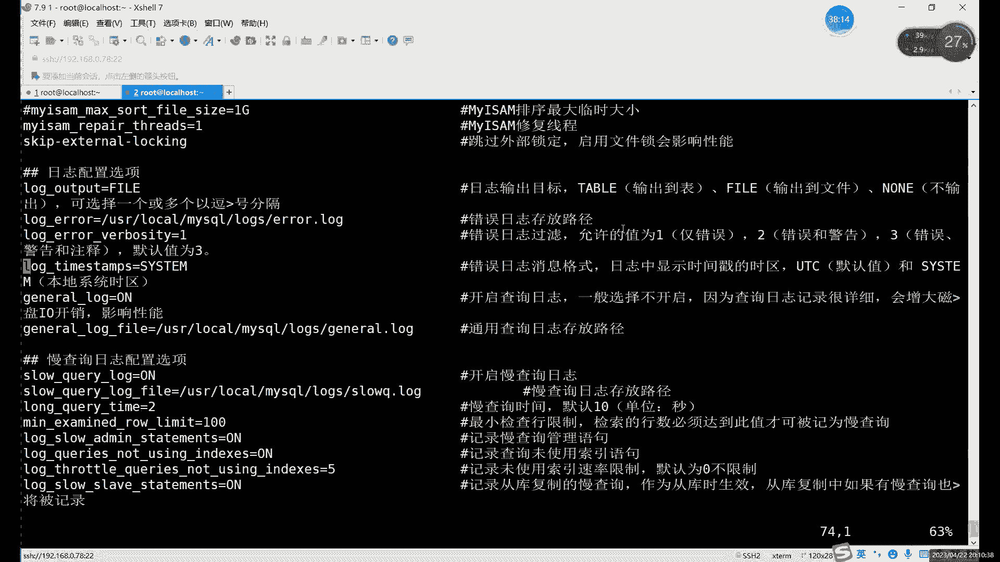

# 【小白入门必备】Linux运维进阶RHCSA+RHCE最全培训教程视频合集 - P78：中级运维-16.事务，锁，备份-上 - 洋洋得IE - BV1nN4y1X7Go

好我们今天的话继续讲MYSQL内容啊，今天这个内容的话啊，也是我们SQL语句里的最后一种，之前的话，我们其实在第一节课里面就介绍过对吧，介绍过SQL语句有哪几种，大家还记得吗啊。

大家可以回想一下我们讲过的几种思路语句，还有前三种是哪些，那他就可以把这个前三种的语句，直接打在我们讨论区里面，哎我们今天讲的是第四种啊，大家先回顾一下第三种，前三种不要忘了啊，不要说学完第四种。

前三种全忘了，这肯定不好对吧啊，前三种的话包括什么呢，啊数据定语言唉，数据操作语言和数据，第三个应该叫权限啊，权限都是一个控制啊，控制权限的语言啊，其实简单来说其实就几个命令对吧。

我们的数据定义语言的话包括什么呢啊，就是管理表格的，管理数据库的创建，修改和删除，数据操作语言的话是我们的有四个增删改查，针对于数据的啊，就针对我们表格当中数据增删改查，那我们第三种就是我们的权限啊。

权限这边的话就两个秘密啊，就两个秘密，其实真正来说的话，授予权限其实只有一个命哎，就是grant命令，对吧啊，另一个命令是什么，另一个命令是取消权限啊，取消权限，这是我们的第三种数据控制语言。

那今天的话我们把最后一种说了啊，就是我们的事务控制语言，第四种的话就它控制的不是数据了啊，他控制的是什么，他控制的是我们的事物，那今天所说的这个事物它到底是什么，就为什么要控制它呢，对吧。

那我们先来首先来看一下啊事物的一个定义啊，我们首先先了解一下事物是个什么东西，但我们正常啊，大家可以先回想一下，就执行前三种的时候，就是执行之后按那个分号敲完命令之后呢，按个封号，三个回车啊。

就自动执行了，对吧啊，就这么执行了，其实我们之前都没有用过15啊，之前其实我们的所用的命令里面，其实是没有提到过事物这个东西的啊，没有提到过事物这个东西，那事物它的作用是什么呢。

啊其实呢在之前我们在修改数据的时候啊，或者说是创建表格的时候也好啊，修改数据也好啊，其实都是什么，就是在修改数据的时候呢，是直接在内存当中啊，修改之后呢就直接写入到数据库文件里了。

先是放在内存里面修改对吧，修改完了之后呢，直接就写入到数据库文件了，这个是我们之前所做的一些SQL语句的一些操作，那这个事物它有什么作用呢，有了事物之后，我们修改了数据呢，哎他先会存入什么。

先会从数据事物日治理啊，从事物质里，然后呢再存入数据库文件啊，再存入数据库文件啊，速度更快更详细啊，然后呢，这里还有一个很重要的就是有的事物呢啊，如果说和之前有什么不同呢，其实就是就是一个控制我的命令。

我们事物这里控制的对吧，事物控制的主要是哪几个命令呢，就是我们的增删改，增删改，主要控制这三个命令，就insert update dele，这三个命令因为会对我们的数据啊。

就是会有具体来说就是我们的表格对吧，我们这三个数据都可以修改，表格里面的一些数据对吧啊，就是这三个命令的话，有了事物之后，就是我们在修改就执行，执行了这三个命令之后呢，啊我们如果它是可以看到一个结果啊。

就是如果说这个事务执行的时候，就是执行了一半啊，我们是可以看到这个结果的，如果说结果是正确正确的正常的，然后我们就可以什么可以提交这个事物，然后呢正在写入到，这是我们的数据库文件里面啊。

如果说哎中间出现了点问题，比如说哪个改错了，或者说是哎插入多了，那怎么办呢，那最方便的方法呢，最方便的方式就是什么回滚啊，回滚类似于快照了啊，就类似于我们虚拟机里面的快照，可以直接回滚，回滚之后呢。

就恢复到了什么，恢复到我们插入数据啊，或者修改数据之前的一些状态，唉这个就是什么，这个就是事物的一个作用，他就很像什么呢，啊如果不看这个名字不太好理解，你就可以理解成什么呢。

可以简单的理解成我们虚拟机里面那个快照，就比较像我们虚拟机的快照，就比如说呢我们现在执行一条命令是吧，比如说执行一个insert命令吧，啊就执行insert命令，在没有错误之前的话，我们一执行对吧。

他就直接插入到表格里，这个没毛病对吧，我们之前一直都是这样的，insert只要你语法正常正确啊，数据类型正确，约束没问题，你就可以正常直接插入了对吧，那如果说有了事故之后呢。

我们这个insert命令执行之后啊，我们是可以在什么可以用select me去查看出来的，但是这个时候呢，他还并没有真正写入到我们的数据文件里啊，并没有真正写入到数据库当中啊。

只有我们手动的把这一个事物提交了之后啊，就是确认啊，我们这个就是应该说是确认执行的，这一步命令啊，正确没有错误的时候啊，就没有这个问题的时候，才能怎么才才，我们在提交才会写入到我们的数据文件里。

这个的话其实就是类似于快照，就比如说我们在相当于你是在做实验之前，提前拍了拍照对吧，哎拍了快照，你做的时候做实验的时候啊，如果说正常的话，那就无所谓了对吧，那就一直往下做，没有报错的话，可以一直往下做。

哎做完之后的话，那我们就相当于是正常之后呢，可以再拍一拍照对吧，可以再拍一拍照，如果说呢唉如果说你做了一半哎，出现错误了，怎么排都排不出来，怎么办呢啊最好的方法就是什么。

就是回滚到提前我们拍好的快照里面，这样的话，我们就相当于直接回到原始的状态了啊，原回到原始状态之后呢，就可以重新开始做啊，重新开始做，这对于我们数据呢没有任何影响啊，这对我们的虚拟机也没有任何影响对吧。

这就是快照对我们这个事物其实也是一样的啊，就类似于我们在执行一个哎，就这这个应该要执行我们的增删改查的命令，之前，我们提前先拍一个快照，当然查的话是不会影响到我们数据的。

所以说我们这里就没写select对吧，就是只写了增删改这三个对吧，在执行这三个数据之前呢，唉如果说出现了一些问题啊，就是执行的不是不是之前吧，就是拍好快乐之后就开始执行这三个命令对吧，这个图片的话。

其实就是我们事务执行一个过程啊，我就拿这个图片来给大家理解，更再说一下啊，首先的话是我们一个默认的状态啊，就在我们执行命令之前的状态，我们可以是类似于先拍个快照啊，如果开启事务的话，当然前提是开启事务。

没有事务的话，就所有执行命令就都都一样啊，就执行之后呢立刻生效，有开启事务之后呢，我们首先呢唉在执行面临之前呢，相当于就有一个快照了，那有一块照，然后呢去执行什么呢。

去执行增删改这三个里面的任意一个都可以啊，执行两个三个都行啊，就在一个事务里边啊，你可以执行很多个很多个命令，统一执行好之后呢，你就可以去看结果，如果结果正常哎，符合你的预期，那就直接用直接提交啊。

这commit命令就是提交的意思啊，commit提交，如果说里边有一个和你想的不太一样啊，或者说插入数据查错了，可以怎么样可以怎么样呢，当然你也可以什么可以用。

再用一些delete update update update去更改啊，那如果说修改mi比较多，不太好改的情况下，你可以直接回滚，这个roll back就是回滚的意思，相当于直接什么直接回滚，快到了。

相当于直接回本快照了啊，正常提交提交之后呢啊你可以理解成什么，提交之后，我们做完这一个事务之后呢，相当于又拍了一个新的快照啊，又拍了个新快照，那之前的快照就可以了，之前快照就相当于删掉了啊。

这样快就删掉了，如果是执行失败了，那我们就肯定不能删快照对吧，我们先回滚快照，然后再继续执行哎就这么两种情况，就是提交或回滚唉，留在事物这边，然后呢事物这里的话，它呢其实是什么呢。

它其实是将一组SQL语句呢啊绑定在一块的啊，相当于把一组SQL语句绑定在一块，这里的SQL语句我们主要主要对象是能，主要对象是第二种啊，数据操作语言啊，主要主要针对于他们。

因为上面这个是跟就是定义表格的啊，第一表格结构的下面这个呢是管理权限的，跟数据都没有什么太大关系，跟数据有关系的，其实是我们第二种语言对吧，就是数据操作语言就是增删改啊，查到也不会影响到这个数据。

所以说呢我们这个第四种语言呢，它实际上的控制对象是谁呢，控制对象就是第二种数据操作语言啊，更具体一点就是增删改他们三个，这里的话其实就相当于事务管理，他们的话其实就相当于把一组呢。

这里的话当然也可以是一个语句，也可以是两个三个啊，这里这个是不限数量的啊，就比如说你开始开始执行一个事故之后呢，啊期间只要你没有提交或者说没有回滚，那么中间执行的所有语句呢，都相当于是绑定在一起了。

执行完之后呢啊你可以用什么，可以用select去查看结果，正常啊，没问题，我们就可以提交，如果有问题可以直接回滚啊，回归是非常方便的，啊也比较像，比较像vi编辑器里面那个按U的撤销对吧啊。

每次打开之后呢，我们他其实也默认会有一个，默认会有一个原始的文件对吧，你可以执行错了什么命令之后呢，可以用N按U1直撤销，但这和文档只有一个道理啊，就是一个道理对吧，就正常我们修改一个PPT。

只要你不点保存啊，其实都可以什么都可以撤销啊，不保存下来都可以进行撤销，相当于这里的我们的这个事务执行完成之后呢，commit te话就算是保存一下哎，保存之后呢，相当于又生成了一个新的状态，新的快照。

那回滚呢就相当于撤销呗，啊相当于直接一次性撤销了很多步啊，就中间你直径多少就全部撤销掉，这个就是什么，这就是我们的事物的一个特点啊，社会的特点命令呢有哪几个呢，啊其实我们这里的命令的话。

其实主要就是管理我们的数据操作语言，它的命令只有哪几个呢，就是commit和roll back，还有一个开启，这里开启，这里没有写叫begin，begin开启，就这三个命令没了啊。

事物这边呢其实就是三个命令，啊当然也不是说啊，那一定要注意啊，就是事物的话默认是我们中有开的对吧，因为大家之前其实执行执行各种命令，其实都没有体会到这个，没有体会到没有用过这种这种方法啊。

这边它默认是没有开启的啊，事故默认是没有开启的，然后呢事物的特征的话，其实就像一个快照而已啊，事物的特征其实你就可以成为快照哎，就是事故中的所有的操作执行成功之后呢，啊就可以执行啊，失败呢就可以回滚。

回滚相当于什么就是恢复快照啊，会拍照，然后呢一致性的话，这个就是什么，就是两个快照，两个状态，只要你不提交或者不回滚啊，他们相当于是一直在进行一个一直在执行，我们的select，就是SQL语句对吧。

提交之后呢就进入了一个新的状态，新的快照回滚呢，就回到了刚才原始的快照里面啊，这个的话就是我们这个事物的一个特点啊，事物呢还有一个就是事务提交的时候呢啊，它会写入到我们数据库当中，你不提交。

它其实只是暂时呢暂时存在我们的日志里边，它不会直接他还不会写入到数据库里，你回滚的话，他直接就没了吧对吧，回滚了就没了，提交了才会真正写入到数据库，还有一个的话就是啊，这个的话当然是多个事物的情况。

就是一个事物呢啊在进行操作的时候呢，肯定是不会被其他事物所看的啊，这个是一个隔离性啊，就可以同时执行多个事物啊，可以同时执行多个事务，因为这个事物呢其实你同时多个执行，即使你操作的是同样的命运呢啊。

当然这里的话就涉及到什么，涉及到这个后边我们锁的问题了啊，这个涉及到锁的问题了，我们后边说完事物之后再去介绍所啊，这个介绍所，啊当然一个一个数据库里边啊，你同时执行多个啊，在多个表格里面操作的话。

其实没有什么太大影响啊，如果说如果是两个事物同时操作一个表格的话，那这个就要分情况啊，这就要看情况了啊，这个具体是锁的问题，我们一会再说啊，然后呢其实默认的话MYSQL这边的话。

它是所有都是自动提交的啊，其实也不是没有事物，就是默认呢我们是体会不到事物的，因为什么呢，因为它会自动提交，就是每一个命令就是一个事物，就是MYSQL里面默认每一个命令就是一个事物啊，它会自动提交。

我们怎么才能让我们自己使用，而是自己啊自己开自己关对吧，自己开是我关关事物或者回滚呢，因为这默认的话我们是不支持回滚的啊，默认是没办法回滚，因为什么呢，因为全部都是自动提交了啊，全部都自动提交。

你不能回滚，所以说呢如果说你想用事物呢怎么办呢，首先啊我们先关闭自动提交这个功能啊，关闭自动提交的功能，啊首先的话这个事物呢，其实我们在什么时候看过的，是在其实在上节课。

我们在日志里面给大家看一下啊，这个不着急，我们一会儿继续啊，一会儿再再再再细看啊，再细看，我们先进到数据库里面，我们先把这个关掉啊，它是什么呢，他是那个，受啊展示我们什么展示，自动提交就是自动提交。

什么提交是commit对吧，提交是commit，自动提交就是a u t o commit，a k a u t o k it嗯，然后呢这个，设置的话就是set命令啊，设置用set命令。

330设置的时候就直接ST，加上什么呢，加上这个，我看一下，提交的话，自动提交，是的话就是一不是就是零啊，是的话一就是不是就是零，我们直接就放个零吧啊直接换零，就是关闭自动提交的，什么叫自动提交。

其实就是我们之前不是一直在执行一些，像select呀对吧，select当然就无所谓了，我们换一换，说insert，像insert呀对吧，update delete这些命令的时候呢，每执行一次呢。

它会什么自动给我们提交一次，就相当于自动写入到数据库了，一你写哎它会自动给你写了个数据库当中，这就是自动提交的意思，那么关掉它之后呢，啊关掉之后呢，它其实就不会成，它就是我们执行之后。

它是不会写入到数据库的，那就默认是不会写入数据库了啊，除非我们按什么啊，不除非我们自己手动输入什么，手动输入commit啊，或者说ROBC回滚啊，我们的命令才会生效，那首先的话我们先来看什么呢。

首先我们先来看这个，我们可以看一个，比如说嗯我们先先建个数据库啊，先建个数据库，啊so use，进入到数据库里面之后呢，我们看一下tables，我们随便操作一个表格，就可以随便操作一个表格。

表格越创建越多哈啊这四个表格是吧，这个是我们数据库信息的一个表格，你可以操作啊，可以操作一下，这里的话我们执行一个什么呢，执行一个，比如说insert吧，但是完整一点的话应该先写什么，先写这个。

这个我们就完整一点啊，完整一点就是我们的事故的话，其实一共也就三个命令是吧，你就尊重一下他，先打一下吧，啊先查一下吧，begin开始啊，开始开始一个什么，现在就正式开始一个事务了啊，从明天开始的话。

就算是一个正式的事务，然后接下来的话我们执行什么，执行增删改的任务的时候呢，比如说我们执行一个什么啊，我们可以看到我们有个NT对吧，now这一行不太顺眼，那我给它删了吧，我给他删了DELE。

from表叫什么XH对吧，表叫s h where，嗯id is not，对吧我们就删掉了，然后我们可以看一下select tour from x h啊，它就没了对吧，那就没了。

但是呢啊我看如果说我在执行一个叫ROLL，B a c k roll back，哎这就命令这个命令就是回滚的意思啊，我们执行一个回滚，然后他又回来了，唉这就是事故，就是我们实际上呢。

虽然说大家可以刚才可以看到我们删了之后呢，它没了对吧，为什么没呢啊为什么没了呢，就是因为它暂时是什么，它其实暂时呢，他也并没有真正从数据库里面删掉，而是什么呢，而是它只是暂时的写入到了。

我们事物的日志里面啊，就写入到日志里了，这种地域的命令，这个已经写到日志了，但是呢没有真正的戏，没有真正的去执行数据库当中的东西啊，没有真正去改数据库，你就可以理解成什么。

我们先是默认先改内存里面的东西了，相当于把我们修改的东西呢放入到内存了，然后呢哎如果说你觉得哎你改的不对啊，如果删错了，那你直接什么直接roll back，robot是回滚的意思。

回滚或者说是commit提交这两个命令执行之后呢，就算是什么呢，就算是一个事物的一个完成了，就这两个命令只要一使用哎，就就就有个就相当于是一个事务已经完成啊，像一个受经完成。

现在的话就是我们数据库是正常的状态啊，正常的状态就一个正常的一个状态，就相当于是我们回滚到了什么，回滚到了我们删除之前的那个快照啊，类似这样，如果说像我们再执行一次啊，我们执行这个依然还是用什么呢。

还是删除对吧，这次我们再删一次，这次删了之后呢，我们其实也不用看吧，我们先执行什么呢，commit命令就是提交提交，我们这个删掉之后呢，现在他其实还没有真正执行啊，只要我们这个没有执行的话。

他这个数据其实还是带的，除非什么呢，除非我们执行commit提交，提交之后呢，我们可以来看一下，对吧他这个数据就没有了啊，相当于被我们删掉了，那这个时候呢它相当于啊，当然现在还没有真正又开启事务啊。

现在的话相当于是啊你做完一个实验了啊，属于一个新的状态了，如果说想要再开启事务的话，相当于再给这个这个状态呢再拍一个快照，然后再开始去执行啊，这个这个其实事物和快照真的其实确实是。

其实相似度还是很高的啊，大部分大部分情况下其实都是都是一样的，啊这个时候就是我们的事物，然后事物的话其实我们昨天在哪呢，不是上节课，上节课我们在这个日志里其实也看过对吧，我在这里再连个终端。

我们不退出数据库，在连个终端，我们来看一下我们的日志啊，后边的话我们就后面的主要内容的话，我们都会针对于什么，都会围绕我们的日志展开啊，接下来我们都是包括本节课的下节课，下下节课，下下下节课。

每节课我们都会用到这些啊，日日历已经跑不了了啊，但这是不是我们安装数据库的时候看密码，那个日子啊不一样，那个日志是我们什么，那个日志是我们服务的一个日志，里面会存放一些报错信息什么的啊，报错信息什么的。

我们这今天看的日志的话，它叫什么，它就是存放我们数据的日志啊，嗯我们可以来看一下，CD我们切换一下公路，把线，啊这个日志呢我们是用来，存放我们的数据，它的名字叫什么，他的名字叫二进制一致。

为什么叫二进制呢，因为你经常看着他的时候，也不知道还记不记得我上节课看日志那个命令，000005，大家可以回想一下，我上节课看日志的命令是什么啊，用cat行不行呢啊或者用less行不行呢。

或者说more啊，tell这些可不可以呢，其实哎怎么说呢，看是能看，但是呢，刚才也说了，他是一个二进制日志，所以说他这里会乱码啊，他这里会乱码，你正常看MYSQL日志，方末日志的话。

有我这边乱码的命令已经显示不出来了啊，我们换什么呢，我们直接换mysql blog就看就行了，啊tell tell没用啊，tell tell和cat的是一个道理啊，tell和cat是一个道理。

默认那几个查看命令，我们之前讲过的查看命令，就是在第一阶段讲的那几个查看里面，其实都没用啊，这都不能用了，只能用什么纸，就是用mysql blog啊，就专门用来查看我们这个我们MYSQL里面的。

二进制式的一个命令，然后我们可以看到啊，这个就是这个正常了对吧，这都是我们先命名，然后我们可以看到哪呢，我们可以看到我们的begin和commit，大家看到没有。

Begin me，而且这里的话它也是有一个什么。

有一个完整的事物，包括之前啊，其实之前我们看一下之前有没有命令了，黑洞对吧，这个是黑洞，大家还记得吧，上节课都讲过黑洞。

那黑洞这里我们执行的时候也有什么呢，也有begin和commit，那之前其实我们没有，就是说也不是说没有启用事物吧，就是之前用的是什么，就是自动提交的事务，自动提交事务它有什么问题呢，啊它有一样的特点。

就是自动提交事务呢，我们在每执行一次命令之后呢，它就会自动提交一个平面，也就不需要我们去执行，就是每一条命令都是一个事物啊，这样当然其实这样的话事物没有什么意义了。

因为每一次执行的话就自动执行，这是自动执行commit啊，这是之前对吧，我们刚才关掉这个自动提交之后呢，我们执行的是哪个命令呢，命令去哪了啊。

delete这里对吧，我们执行的是delete这个命令，啊这里的这个命令的话嗯，比如说我们可以看一下begin开始对吧，也是一样的，我们这个begin的话，就是我们当时也是自己执行了一个。

begin命令对吧，但其实呢BEGGIN命令的话可以不打出来啊，可以不打出来啊，我刚才打出来只是为了啊为了标记一下，这是什么，这是我们命令，就是我们这个事物的一个开始，其实这个begin命令可以不打。

就是我们在命令行里面，可以是不敲这个命令的啊，可以不用敲这个命令，哎我们这里的话就是begin开始之后呢，是改了一下我们的这个删除了一个数据对吧，删除了空值，然后呢我们自动又自己又提交了commit啊。

这里的话就是当然这个是我们的二进制日志，它这里只会记录我们修改过的内容啊，如果说回滚了呢啊，他这个日记就不会记录了啊，他这个日志就不会记录了啊，这个日子的话你就可以理解什么。

就可以理解成我MYSQL里面的一个，你相当于记录我MYSQL数据的一个日志啊，只有真正修改了我们数据呢，他才会记录到这里，那像这里我们根本就没有看到roll back对吧。

为什么没有看到roll back回滚呢，是因为回滚之后，它就相当于是回到了上一个状态啊对吧，回到商业状态的话，相当于就没改什么的，没有去修改我们的真正的数据库里面的内容啊。

所以说呢啊这里的话就是没有roll back，只有什么，只有begin和meet啊，也就是这个日志里面他写的就只有啊，只有我们事务里面的两个命令ROBUG，因为你回滚之后的话，它就相当于是没改数据库啊。

因为你相当于恢复快照了对吧，会快照的话相当于数据就没有变化，没有变化，就会不会进入到我们的这个二进制日志里，这个二进制日志的话，它的作用其实就是什么，就是记录我们MYSQL数据库里面的。

这个什么数据的变动，当然包括什么，包括这个创建表格啊，创建表格的命令也会记录啊，包括这些创建表格啊，对你插入数据啊，修改数据，删除数据，当然这里不包括什么，不包括查找，因为什么，因为查找命令的话。

select它不会对我们的数据库造成什么影响啊，啊他最多就是查找查找的时候来用一下，我们这个用一下我们数据库里面索引对吧，其实其他的，它不会对我们数据边发生任何改变啊，呃这个其实就是比较类似于快照对吧。

就是你你让你拍拍照，你不好好拍拍照对吧，你装好系统之后拍拍照挺好对吧，你装好MYSQL之后，你也拍一个呗，就拍一拍照肯定不会吃亏啊，拍一拍照肯定不会吃亏，影视提交的话，影视提交的话是可以回滚的啊。

影视提交是可以回滚的，那如果说我们执行了什么，执行了我们这个commit命令的话啊，就像我刚才不是直接执行了吗啊，如果说像我刚才用的这个显示的command命令的话，那也是提交。

就那那就相当于影视结交就不生效了啊，那就必须要用什么，必须要用这个ROBUX命令进行回滚了，如果说是影视提交之后，他会发的发，如果发生了错误或者说异常的话，他为什么他会自动回滚事务啊。

它会自动回滚事物的，也就是说什么，其实你如果说像我们刚才。

我们刚才不是设置一个set，那个什么set a u t o commit这个东西对吧，你设置这个东西之后，没有设置这个东西之后，如果你是自动提交的话对吧，如果自动提交，其实如果有报错啊。

它相当于是自动回滚了啊，如果没有报错的话，相当于什么没有报错的话，就自动相当于进入下一个状态，那如果说我们是把这个关掉之后呢，我们自己手动去弄的话，手动行动的话就是嗯嗯这个叫commit robot。

就完全是你自己控制了，你想让他回滚就回滚，想让他起交流提交啊，也都可以，没有报错也可以回滚啊，没有报酬也可以回归，当然你如果是这种自动提交的方式的话，嗯那你们有报错的话，因为他是已经提交过了啊。

这种焦虑已经提交了，如果是像我们这样begin诶，是哪BEGIN，像我们这样开启一个事务啊，执行成功了也可以用ROBC回滚的，刚才我们不就是吗，刚才我们那个dd不就是执行成功了吗，但是也可以回滚的啊。

这个只要其实你如果要用事物的话，你把那个自动提要关掉之后，是否回滚啊，是否提交就完全是你自己做主了，就是你哪怕你执行十条命令，你不提交刑警的，也可以可以可以在滚滚回回滚去吗，回滚的话就变成什么。

又变成这个恢复，恢复一下之前的快照，对用事物的话确实更安全一点啊，因为事物的话毕竟是有一个保险嘛，不管说你删，尤其是删数据的时候，尤其你删数据的时候，你开个四五，其实就你随便删是吧，想怎么删怎么删啊。

毕竟有回滚这个保障嘛，有就相当于有个快照啊，只要你把这个自动取消，一旦关掉，其实你干什么，其实就一关掉这个自动自动提交呢，其实你相当于你就已经有了一个比较哎，比较安全的一个快照了，哎。

有时拍照之后的后边再做什么操作就很安全嗯，很安全，啊然后的话这里诶这个是啊，这个我们是在目录里面对吧，在目录里面嗯看一下，我们正常的历史命令叫点batch杠history对吧。

我们MYSQL的历史命令叫点MYSQL，点对点，my circle gun history啊，点MYSQL杠非唉，那是怎么说呢，带星号from后同样的特点和那个也一样啊，特点和那个也一样嗯。

就是只有退出之后呢，他才会记录的命令，这个这个命令还是我们上节课的命令啊，只有你退出终端之后，他才会写入到我们这个文件里面，这个和我们那个history，就是系统命令里面的history其实是一样的啊。

和系统里面的黑色其实是一样的，你退出之后呢，他就会写入，就是刚才其实我们执行的一些命令，他都没有记录啊，都是没有记录的，也正常啊，啊这个的话就是我们的事物啊，这边就是事物啊，不管说你执行错了，执行对了。

这些都是什么，都是可以回滚的啊，嗯比如说这里的话，其实我们这个事物呢，其实你执行错的话，其实它就是怎么说呢，其实执行错了根本就不会生效，就是这个东西能回滚呢，其实也就是你执行正确之后呢。

再去回滚才有用嘛，对吧，你如果之前错了，他其实什么它会报错吗，报错之后其实这个面积就没有生效啊，他这个面积没有生效啊，所以说并不是说报错之后，因为报一般你命令报错之后。

他你不会对这个数据库本身造成任何变化，因为你的这个命令呢不符合语法，也不能改任何东西，也不能添加任何东西对吧，所以说报错，其实事物这里我们处理的其实不是报错，报错他根本就执行不出来呀对吧，你这个没错。

命令根本就执行不出来，所以我们这里指的错误一般是什么，不是说命令的错误，而是我们操作上的一些失误啊，操作上的一个知识误，嗯像我们这个，你看像我们刚才那个日志对，这个是历史命令，这个是历史命令。

像我们刚才日志是在哪呢，我们是数据啊，就是它其实相当于数据，所以说是在这个在哪也不一定，你像如果是什么呢，如果是，一样M安装或rpm安装的话，我们的日志一般放在哪。

一般放在VR下的lab下边的MYSQL里面啊，一般要靠着这个目录，如果你是源码安装的话，这个就想放哪都可以啊，我们按照我这种方法的话，是在这个目录下，就是在数据目录里面，我们放在日志文件。

啊这个的话就是当然这个也不是说默认就有，这个其实是什么，需要在日志文件里去开启，不是日文配置文件里开启的哪个配置文件呢，就是etc的user下logo下的MYSQL，啊这个其实是什么呢。

就是默认如果你用YM安装或rpm安装的话，它默认是没有日志的啊，他们是没有这个日志需要什么，需要我们自己去开启，嗯就比如说我们可以看一下这个。

你找一下复制啊，复制，啊就是这个，远程工具会不会有历史命令进入历史命运的，我印象里应该是没有，应该是没有这个记录历史命运的一个，啊但是对于数据库操作的这个命令的话，其实我们数据库日志都会记住的。

只不管你在哪个终端写，我们日志里面都有，哎就是不管你指哪个写的话，不是卖点cf，不就是网吧里都有，啊网盘里都有，然后这里的这个的话我看一下哪些的啊，复制配置选项，我们这个二进制制的话。

是在复制配置选项这里啊，这话为什么写了复制呢，这个因为是我们后边的关于主动复制的问题，然后呢开启日志的话，就是用这个开启就行了，log in等于后边这是日名字，日志名字可以自己改，哪怕你写中文都可以啊。

这个名字你写中文都行啊，这个名字随便改的，这就开启二进制制的一个命令啊，开启之后的话。

我们就可以说他就会每次执行命令啊，只要你一旦执行命令呢，就会在我们在我们的贝塔目录下生成这种，他是从这个这个前面是你定义的名字啊，后边是编号啊，我们这个记录就是修改数据库的一些命令啊。

主要就是修改数据的对吧，从创建数据库也好啊，创建表格也好，修改这是什么，修改这个插入数据也好，修改数据也好，谁都会记录，那他唯一不会记录的是我唯一不会记录，就是select语句。

select语句是可以不用记录的啊，不记录的，然后呢我们可以给这个这里的话看一下，复制配置选项，你哪去了，这个是开启啊，这个是开启，然后后边的话一些这个是包括索引文件，后边是一些缓存大小。

主要的话其实就主要是上面这个啊，主要开启这个其实就可以了，其他的不用修改什么内容了，其他的不用修改什么内容，然后的话这里看这个路径的话，在，白路径在哪指令，啊路径在这儿，啊data d，数据目录啊。

数据目录，然后其他的话就是我们主目录的话是MYSQL，MYSQL这个嘛对吧，然后MYSQL下面的话包括这个数据目录对吧，临时目录还有什么，还有日志目录，还有这个配置文件的目录。

我们一共是创建了这么四个目录对吧对，就是这四个目录，然后的话它默认的存放位置在哪，默认存位置就是这个数据目录啊，就是我们的这个二进制的文件的话，它默认存放的就是这个把数据目录在一起啊。

就跟着数据目录一起走，如果改了数据目录的话，这也就跟着一起改了啊，跟着一起改了。

但是它其实呢你说它是日本，咱也不完全是个日，它其实全面叫二进制值啊，它和我们之前那个日子还不太一样对吧。

那我们之前最开始看那个日志在哪看一下。

搜一下吧，看一下logs，然后在这你看这个是这个，这个是我们之前那个什么错误认知对吧，错误日志的存放路径啊，错误日志的存放路径。

嗯然后这里的话你想改的话，可以改这个问改这个位置啊，就是如果说想改这个的话，这个是相当于是嗯他这个是什么呢，你可以改前面你就把如果说想改路径的话，可以在这里改，默认是默认是data这个数据目录。

然后这个是相当于是当前目录，这个的话相当于写了一个相对路径，如果想改的话，在前面加上什么，加上ET加上其他目录的名字就行了，你在这里干啊，可以单独存放的话，就改这个就行，就这里的话直接写绝对路径。

相对路径的话，它就是data这个目录啊，这是相对路径，绝对路径的话，那就是你自己写就行，为什么要分开放，就全放一块多好呀，全放一块好找呀对吧，你分开放了放，放太多了，容易忘了啊，这里的话。

其实我们所有MYSL的东西，都放在一个目录里面啊，就一个目录里面分了好几个不同的嘛对吧，啊这个你随便自己改就行啊，嗯这里的话我们接下来继续啊。

继续往下看啊，事物，这里的话，它其实就是，你就是一个作为一个快照回滚的一个作用啊，有一个快照回滚的作用，对中间不管是执行insert也好，DBT也update也好，其实都是都一样啊。

就是这几个命令其实都是一样的效果，它就是改数据，只要涉及到改数据的问题啊，我们这个事物这里的话就可以控制啊，当然前提的话一定要什么。

一定要把这个什么呢，一定要把它拿出来，在这个一定要把自动提交给关掉，如果说你自动提交开了的话，那你那你就根本做不了事故，你得把自动提交先关了，关了之后的话，你再去执行啊。

再去执行事务的话就才能执行事务吧，你要这么说才能执行事务，你想提交也好，回滚也好啊，都可以啊，就是主要注意这个就自动提交，这个一定要先关啊，关了之后再再说其他的啊，先关这个啊。

这个的话就是啊咱们这个事物的一个，咱这边事物的一个信息啊，当然呢啊这里的话如果说嗯，比如说我们现在怎么，现在是正常执行的过程中的话，如果说没有提交的话，他其实也会记录到哪，他也会进入到我们这个。

相当于是记录到我们这个，暂时它会产生一个什么呢，等于是暂时记录一下正在执行这个事务，比如说呢我们现在开一个事物，我们再开一个15，啊比例再开一个对吧，再开一个之后的话，我们insert。

Insert input，嗯123是吧，那我们再插入一个啊，我们先不着急提交，也不回本啊，现在呢其实我们是正在执行一个事物，对吧啊，正在执行一个事物的话，正在执行一个事物的话，我们可以用什么。

可以用这个寿命令去查看啊，可以用寿命去查看啊，还是受命令啊，当然啊，但是这个的话其实正在执行事务的话，可以看一下什么呢，可以看一下，我们在第二回合里面再登一下吧，我们在第二个里面再登一下。

你看我现在是在第一个里边，我们是开了个事务对吧，开了个事务，然后执行一条命令，我们在第二个命令，第二个终端里面再登录一下啊，再登录一下，哎切换进去之后呢，我们可以看一下什么的，看一下，比如说。

Slide in from，然后我们先看一下这边吧，这边应该是改改，是改成功了，我们先看一下吧，Select，听form加什么，加上这个XH对吧，这边加上去了对吧，加上六加上第六个数据库，看到没有唉。

这个就是事物的一个效果嘛，你看就是你左边这个在执行事务的时候，他其实根本就没有提交到数据库里面，因为什么，因为你再连一个，你才突然发现诶，没有对吧，你左边那个右边右边这个为啥没有呢，因为它只是暂时呢。

当一暂时写入到暂时的还没有，他还是在内存里面的啊，还没有真正的写入到我们的数据文件里啊，也就是现在你在其他终端你是看不到的啊，看不到的，啊就比如说我们可以看一下这个嗯。

好我们可以在这里看一下select，啊或者说用show其实也行啊，show我们看一下这个当前啊ino dB啊，因为什么，因为我们事故只是INDOTB这个支持啊，你是换另一种MASM的话，它不支持。

我们可以看一下这里，信息还比较多，或者信息有点太多了，愁绪了啊，总在这，在这儿我看一下哪一部分呢，在这，大家可以看到这里，其实我们是有已经产生了一些什么，产生了一个锁，看我们这里只有个组的啊。

这个锁的话其实就是跟我们前面，就左边那个这台不是第一个终端，里面那个执行命令是有关系的啊，我们这里其实能看到什么，看到一个锁，然后的话这里命令太多了，一般这里没什么太大太多信息。

我们直接用select看吧，select我们看一下这个information，information schema这个数据库啊，I n o，这个表格的话是查看事物的表格啊，这个表示查看事物的表格。

我们也可以看一下这个事物，我们是大概对吧，就几分钟前创建的嘛，啊几分钟才创建的，啊就是正在运行的一个啊正在运行的一个事物，对，就是左边这个15啊，就是左边这个15哎，就这里的话就可以看到什么。

看到我们这个运行事物的一个信息啊，查看这段运行事物的信息，啊这就是什么，这就是我们的这个，关于事物的一个特点吧，你看像左边这个事务在执行的时候呢，啊他在其他的这个终端去查看的时候啊，它不会有任何信息。

啊这个就是事物的一个特点吧，啊事物的特点啊，总体上来说呢，嗯其实有了事故的话，就是更主要是更安全一些啊，就是保证我们这个数据的安全性啊，因为你数据如果说啊，比如说这个大家不是命令错了。

指的是如果说你命令肯定是正确的啊，也不是说改错一个数据啊，改错一个数据的话，因为我说直接提交啊，就是如果是选自动提交的话，每次改一改错啊，他就直接提交了啊，如果在检在检查的时候呢啊如果说错了很多。

你又不好改，改了之后万一再改错了对吧，那这就很危险了，所以说这个提交不是就回滚呢，就是非常有用啊，回本快照的一个作用啊，就是在你每次修改数据的时候呢，你可以什么啊，就可以提前开一个什么开一个这个。

这个叫事务啊，提前开一个事物啊，就是防止怎么防止你修改，就是改改这个数据的时候出现问题啊，出现问题之后呢，你就不要只要你一旦发现改错了，就不要再乱改了，就直接回滚就行了，回滚的话就比较靠谱一点吧。

至少他那里有个快照啊，总比你自己去恢复环境肯定要好一些对吧，这就啊这跟你平时做实验也是一样的，万一如果说有一个有一步你做错了，你可能忘记了啊，忘记是哪一步有问题了啊，你在从头来排除，可能越排越乱啊。

这也是有可能的啊，所以说呢你平时做练习的时候，其实拍个快照是好习惯，好习惯也是这个事物的话，提前改数据的时候，提前开个事务啊，今天开个事物好吧，这个就是我们这个事物这边，这个一个作用以及用法。

用法其实很简单，它就是三个命令，begin meet roll back对吧，三个，开启一个事务之后呢对吧，开启事务之后，你执行就改完数据了，两个数据检查没问题啊，直接提交，有问题呢啊。

有问题如果说还比较好改，也可以稍微改一改啊，可以稍微改一改，如果说已经改的有点错的太离谱的话，那就直接回滚吧啊直接回滚，想查看这个事务提交的方式的话，是看一下还是用select mc1嗯。

我这里就roll back吧，我这里先把这个线断了啊，先把这个四五线断了啊，roll back回滚，然后跟之后我们就把它清掉了对吧，查看执行方式，看一下select，啊不是自带的型号，查看方式的话。

啊是这个，啊但这个是事物的一个隔离级别啊，隔离级别当然也是什么，也是我们事物的一个提交方式啊，也是我们事物的一个提交方式，啊你用这个命令看就行了啊，那如果改的话怎么改呢啊你可以用什么可以用。

其实在我MYSQL里边这个设置的话，设置其实都是一个命令，就是set命令是吧，就是修改你改密码也是set对吧，我们改各种设置也是set，像我们刚才改了个自动提交，也是set啊，来自动交也是在的。

像我们这个的话是目前情况可，Table，然后read啊，这个是可重复读啊，就在这种隔离级别下面的话，就是事务开始的时候就不会不会读取和修改，事物中已经提交了这个数据，然后这个的话我们就是我们这个事物啊。

就是关于事物的问题。

然后呢说完事物之后呢，我们紧接着说什么，你先说这个索顿啊，因为我们刚才不是在执行这个命令的时候对吧，我们在执行什么命令，就执行那个好像，比如说左边我们开了一个什么呢，如果说你左边开了一个终端啊。

正在修改数据啊，正在修改数据，如果说右边终端再进来啊，能不能修改数据呢，啊有锁的情况下呢，我们的话我们就不能修改数据了，为什么他其实就是保护什么，保护我们这个数据的安全性了，就因为你有一个在修改。

另一个如果进来之后的话，你肯定是不能再改的对吧，你如果再改数据的话，尤其是什么，尤其是你这个像开的事物嘛，但是不开事故其实无所谓啊，不开事故了，如果全是自动提交的话，肯定改修改是有先后的。

如果说开的事物，如果说开的事物的话，你修改了其实就类似于什么就可以，就其实就相当于是同时修改的，只要都没有提交的话，就是同时在修改数据啊，那谁先提交的话，那谁就，那么谁如果说先改了的话。

可能后边的后边就不能再改了，因为什么，因为你修改之后的话，它真正提提交到数据库里面之后呢，他数据就变了啊，后面肯定可以肯定会出问题，所以说呢，我们在这个在一个终端修改数据的时候呢。

啊在一个终端修改数据的时候，一般的话我们就会有什么就有这个锁的问题啊，锁的问题，我这里的话，其实他其实就是利用保护我们的数据啊，保护我们的数据的呃，所致的话其实也是基于事物这里才说的啊，基于事物来说。

为什么要说基于事物呢，啊原因很简单，因为你正常，你正常执行一个命令的话，比如说insert也好对吧，或者说delete也好，一般我们如果说你自动提交的话，你执行他立马就提交了啊。

这就不会一般就不会出现同时修改这种情况啊，一般就是用了事物之后的啊，用了事物之后，两边终端如果说都在修改的话，那肯定会肯定会多少会出现一些冲突问题，具体是谁冲突谁呢，那这个就得看情况啊，这就得看情况。

所以说呢为了避免这种冲突的这个情况啊，为了避免这个冲突的情况的话，啊我们这里就是MYSQL里面我们都会用什么，都会用这个锁来保证什么，保证我们这个数据的一个安全性，啊首先的话我们这里是。

嗯比如说呢我们首先先来看看哦，数在这啊，在这，啊首先的话一般常见的就是有什么堵锁和写锁，读锁和写锁，走走和斜走的话，它是什么，它其实就是嗯首先的话啊，夺走了它是一个共享组啊，它是一个共享组。

共享锁的话其实就是在什么呢，就是多个事物啊，可以同时什么同时读取数据啊，可以同时读取数据，啊这个锁的设置的话就是什么，它在设置的时候呢，就是在这个读者的话就是select语句啊，读者的话就是SLG语受。

那个其实也不算哎，也不算SL语句啊，所以说呢我们这读书的话一般就是思路思语句，资料语句，这里的话我们首先是什么呢，这种锁的话其实还好啊，这种锁其实它也不不能说算完全算锁上，为什么呢，因为什么。

因为这个它就是多个毒是可以同时进行的，就是你这个我们这锁机制呢啊，主要是针对于什么呢，啊针对于这个写的操作，因为你写的操作的话，如果你先修改，那他后修改的命令的话，肯定多半会报错，那多半就会报错。

所以说一般情况下呢就是啊像独走这边的话，它是一个共享所啊，共享所嗯，总体上来说的话就比较啊，这个行业比较正常一点啊，就相当于是这个锁呢，其实你设置之后呢，他也不会说有什么嗯，不会说有什么太大问题。

因为什么呢，因为读这个操作呢，它不会对我们数据进行很大的一个修改啊，不会对我们数据进行到大造成影响，所以说我们这个毒所呢它就是一个共享的数啊，共享所什么意思，就是可以有多个啊多个事物同时来运行啊。

这在读锁上的话，其实多个事物是可以同时运行的啊。

这个不影响，比如说呢我们这里可以先来看一个例子对吧，首先的话是读书啊。