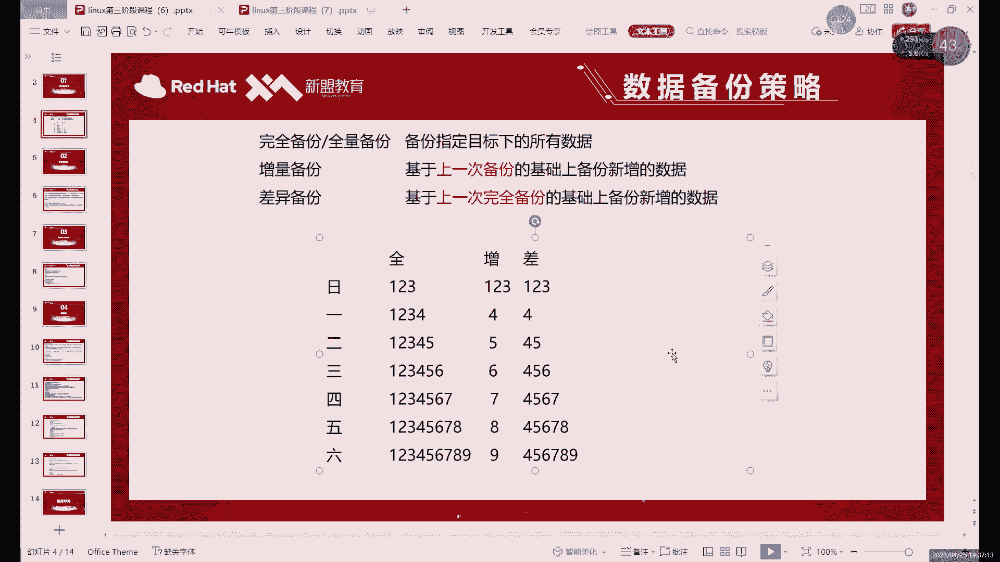
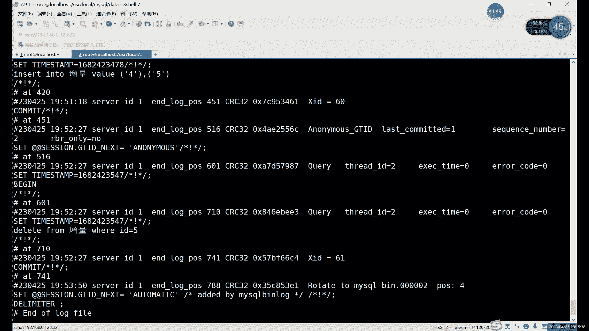
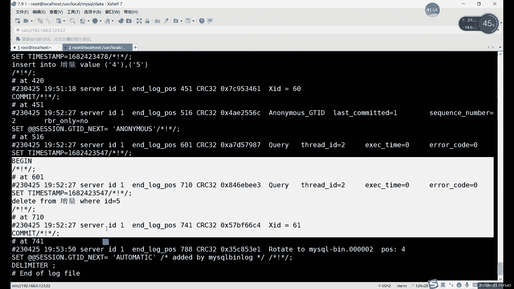
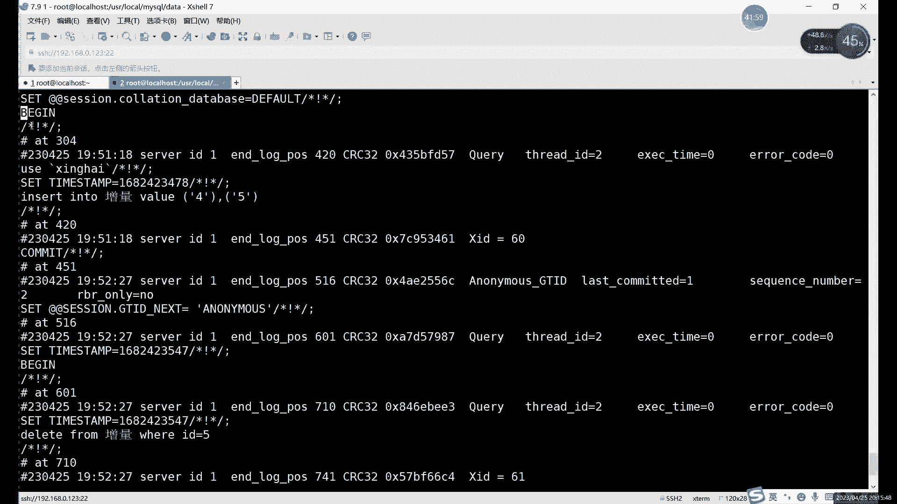
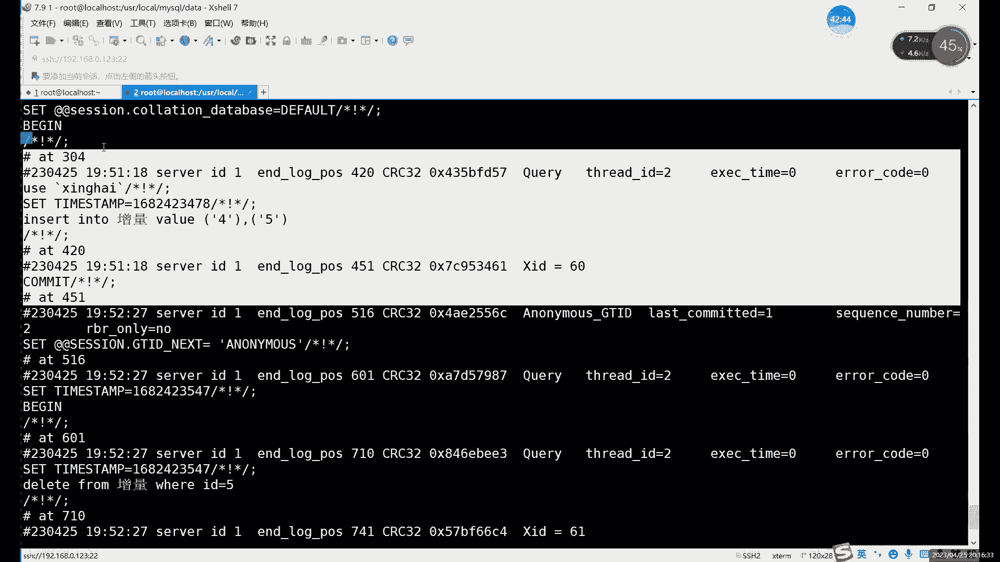
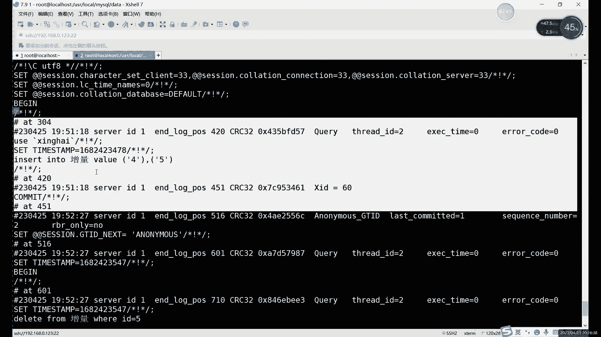
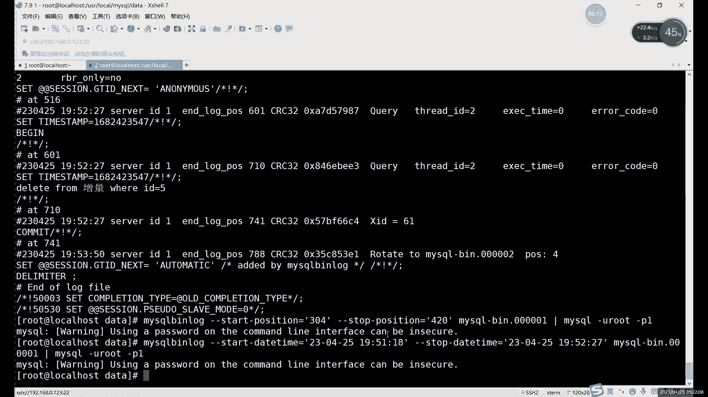

# 【小白入门必备】Linux运维进阶RHCSA+RHCE最全培训教程视频合集 - P81：中级运维-19.增量备份，主从复制-上 - 洋洋得IE - BV1nN4y1X7Go

好我们今天继续来讲这个备份，继续来讲备份，首先呢备份这里的话，第一我们备份的一个前几个啊，前几种分类的话其实已经做完了是吧，就是全能备份对吧，物理备份啊，逻辑备份这些。

我们接下来的话其实就剩下最后一个啊，我们主要内容是增量备份，增量备份其实是非常重要，为什么，因为前面我们讲的那几种呢，只是一种备份方式对吧，那增量备份全量备份呢它指的就是什么，这是我备份数据的一个量。

具体备份多少对吧，首先呢增量备份，这里呢我们之前也就是最开始介绍过增加部分，它备份的数据是最少的，哎就是所有几种备份方式中最少的啊，因为备份的话主要是我们只要数据有就行对吧，有这个数据就可以。

所以说呢不管是全量备份也好，还是差异备份也好，其实都是有一个问题，就是随着时间的增长，他们每天备份的数据会越来越多，那这个肯定不合适，为什么呢，因为备份这个东西啊，哎就是尤其像备份的数据啊。

如果说你不出现是什么故障的话，其实你这个备份呢基本上一直用不到对吧，所以说呢这个备份呢肯定是大于恢复的啊，就是做备份的，这个时间肯定是要大于做恢复的时间的，这是肯定的对吧，这是一定的。

那所以说呢主要是啊就恢复，这样的话我们就暂且先不说了啊，我们先只说备份，你看这就因为我每天肯定都是要做备份对吧，这个频率可能啊可能不一样吧，可能每天可能是两天对吧，可能是几个小时。

十个小时就备份一次对吧，半天就备份一次都有可能，不管说你的备份频率怎么样啊，就是每一次在备份的时候呢，你看全只反倒是什么，就是备份的频率越高啊，全量和差异这里备份的数据越多，所以说呢啊在备份上的话。

我们一般就选择什么呢，选择首先先做一次全量备份啊，先做一次全量备份，做完之后呢，后面的每次被问题，比如说一天一四百，我也不太短，因为不短不长，就一天一次哎如果说一天一次的话。

那就是一天什么一天备份一个啊，每天每天只备份新增的数据啊，每天只备份新增的数据啊，或者修改的数据，这样的话就能把对方的量呢最大程度就是减，减少到最大程度啊，为什么你看这个增量备份备份下来的话。

其实就是把所有的备份内容呢加起来，其实就是我们整个数据库的内容对吧，所以说它的备份量呢肯定是最小的，对这个肯定是毋庸置疑对吧啊，它的对分量肯定是最小的，然后呢这个增项备份呢啊那怎么去做呢。

啊因为增加了份，其他备份的不仅仅是增加数据啊，这个这个我们的表格里面其实写的只是什么，只是写了一个增加的数据对吧，其实他也有可能会有删除对吧，有可能会有什么也有可能会有修改，那这些怎么办呢，那这些的话。

其实我们的这个，在MYSQL里面啊，就是没有直接做增量备份这种工具啊，就说有什么问题呢，其实就是唉你想做增量备份的时候啊，就是你知道这个概念啊，知道怎么做了，那如果说让你自己去找这些新增的数据啊对吧。

或者修改的数据，删除的数据其实很难找，所以说在excel里面我们一般做增量文本怎么做呢，我们就用这个日志对吧，上节课我们只是看过那个日志对吧，上节课看过。

就比如说嗯在，二进制对吧，名字是二进制制，上节课其实已经提到过了啊，二进制日志的话就是什么呢，我们会记录我们数据库里面的一些操作对吧，他操作包括什么呢啊它包括这个，创建表格对吧，插入数据，删除数据。

修改数据，就是只要凡是对我们的数据库做了修改的哎，只要是对我们数据库里面的数据做出了修改，那么就会就会进入到我们的二进制日志当中，对吧，这种啊，这个二进制制其实就是我们在增量备份里面，最关键的一个东西。

因为我们MYSL里面没有这种备份，就是没有增量备份这种方式，所以说呢这个增量备份呢，我们就是通过什么通过认知来来做，明知这里呢其实是它完整的保存是什么呢，完整的保存了我们的所有操作啊，大家好。

我这里说的是对数据的操对修改数据的操作啊，查询数据啊，或者说你看select的命令啊，或者受命令，这两种的话其实是不会进入到我们日志里边的，因为什么呢，因为没有改到没有改，没有修改数据啊。

我们的二进制日志记录的只是什么，只是修改数据的一些命令语句对吧，你没改数据，你只是看了一下对吧，我没必要记啊，没必要记录啊，这个没有什么记录的必要，记录了反而浪费空间了，所以说呢记录下来的都是修改的。

不管是你增加也好，删除也好，修改也好啊，这些命令呢其实都是会记录到这个日志当中的，所以说呢唉这里自然，如果说我们要做这个增量备份的话，其实就是什么，就是其实就是借用什么，借用二进制日去做恢复也一样啊。

就是增量备份啊，质量恢复呢啊就是增量备份的恢复，这两种操作呢其实都是基于谁呢，基于这个日志来做的啊，首先的话要做这个，第一要开启二进制日志啊，如果大家是用那种方法做做的源码安装，那肯定是开了的啊。

那肯定是经开了的，如果说你做的是什么，如果说你做的是em安装或r pm安装的啊，它默认是没有开的，大家一定要注意啊，如果你用其他两种方式做的话，没有开，你得去配置文件里去开启一下啊。

配置文件你去开启一下啊，开启之后呢才能继续做什么，继续做这个，增量备份啊，就继续做这个嗯，就是因为这个其实不管不仅仅是增量备份啊，这二进制其实在我们这个数据库里面，是非常重要的。

增量备份呢只是其中之一啊，只是它的其中一个作用啊，只是他其中一个作用还有些什么作用呢，啊剩下的作用的话，我们啊讲完备份再说啊，讲完备份再说，那首先我们先用这个日志来做个备份啊，来做个备份。

当然这个日志名字大家其实可以自定义的，哪怕一些中文都可以啊，你想写中文其实都都也行，然后呢我们接下来看一下什么啊，看一下，首先，首先我目前的话，我看一下现在这个数据库，看看里面有有有哪些数据啊，7。

1是123的IP，连完之后的话，我们先进入到数据库里面啊，我们看看数据库里面，这个数据库应该里面有不少数据吧，嗯SL杠一个root，这种报错的话就是报这种报错，基本上有可能重启之后呢，数据库没有开啊。

可能没有做开机自启啊，数据库没有开，或者说是一种数据库没有开，另一种的话就可能是和这个mari dB给冲突了啊，一般情况下就是这些情况嗯，然后这里的话我们看一下受DTABSES，切换到这个库里边。

我们来看一下show tables，嗯表格不多啊，表格挺多啊，表格挺多嗯，怎么这样来看一下吧，做这个，因为这里的数据其实还挺多还挺杂，我们这里就这里就重新创建一个表格啊，重新创建一个表格。

啊我们会做的时候重新创建一个表格，我们针对于一个表格来做，这样的话其实好观察一点啊，而且备份也快对吧，我们就不针对于整个数据库做备份了，我们就只针对于某一个表格我们做备份，那首先的话增量备份的第一个。

第一条件是什么呢，第一条件是你先做一次全量的啊，因为你没有这个没有这个对比的对吧，你也不知道，你这个具体如果没有一个全量的对比，你也不知道该从哪开始做增量对吧，所以说呢第一次就是所有数据的一个全量备份。

你得有啊，当然我们这里先只做一个表格的啊，这样数据少一点，数据少一点，一会儿好，对比一些好吧，那首先的话，我们先看啊创建，当然这里大家还提前提前看一个命令啊，提前看一个命令，一会儿还要。

一会儿要用二进制日志呢，只是只要在我们MYSQL开启之后会开启开始记录，日志的话大家可以看到就是之前的话，其实我们还有好几个日志对吧，它分了不同的数字啊，咱23456对吧，就分下去的啊。

这因为它造成的所所需的大小啊，或者说重启了，或者说什么，或者说就是我们可以手动执行flash log这种命令，为什么他就会重新创建一个新的日志啊，重新创建一个新的日志。

所以说呢大家可以看到日志的编号有好几个，对吧啊，这是因为一般情况下都是我们重启之后啊，或者说是这个到了所示的大小之后呢，就会创建一个新的日志，手动清的话，手动创建的话就用这个blush log。

你可以创建一个新日志啊，换一个新日志，定时的备份呢其实不需要我们手动去做啊，定时备份其实不需要手动去做，怎么办呢，就是什么，就是定时的执行flash log电视直接执行这个命令啊，执行命令。

执行这个命令之后呢，它就会生成一个新日，然后之前的日志的话，其实我们就可以什么可以保存了，对吧啊，就可以保存之前的日志，那这个就是这个就是自动啊，这个也可以设置自动的啊。

crown type那个自动那个任务啊，电池任务，然后这里的话我们首先先看一下什么啊，日的话我就不看了对吧，其实之前前几篇都看过了啊，大家记得在配置文件里面用打开什么打开，我们是打开这个二进制日志。

打开二进制日志就可以啊，打开就行，打开之后的话，我们现在先，啊就是在etc的卖点cf那个文件里啊，然后现在的话，其实我们现在已经有很多日志了对吧，我这里再开个终端吧，再看终端，好好打命令一点。

那我们一个在数据库外面，一个在数据库里面，root123点co，我们CD切换到这个user下的local里面的MYSQL，data文字的话，就是这几个啊，现在已经排到底，排到七一了啊，排到八了啊。

排了很多嗯，现在的话如果说重新开始做的话啊，有还有一个命令，就是，Reset，reset后面加上这个master，啊reset命令的话啊reset命令在，在哪在这个数据库里面啊。

在数据库里面RESET啊，reset master这个命令，这个命令的话可以什么，它可以删除所有的日志，啊并且并且重新新建一个日志啊，这句话现在其实前面的日志的话，它里面存的是什么。

就是我们创建这些表格的记录，修改数据的记录其实也没什么重要的啊，可以删掉，如果大家嫌太多太乱的话，可以可以先清理一下啊，就是reset master这个命令啊，清理掉之后的话，我们再来看一下对吧。

就剩一个了啊，又从一开始了啊，从一开始从一开始记录，这是什么，这就是，二进制二进制日志啊，这个是二进制之，从一开始的话，现在其实它里面是空的对吧，现在里面它里面是空的，想做这个增量备份呢，嗯我们首先先。

这样吧，我先创建一个表格好，我先装一个简单的表格，这个表格的话我们增量备份，增量备份表格我们就用一列啊，用一列的话好对比一些啊，我们这insert into增量value，比如说我们这里写个什么。

比如说就一，首先写个123啊，先写个123，就当做一个默认数据吧，啊1234我们当做默认数据，那现在的话这个表格里面是有，一共有这么三个数据，其实现在这个已经记录到哪，进入到第一个日志里啊。

它已经进入到第一个日志里了，再进from，还不是value是增量对吧，1233个数据啊，我们这里做增量备份的话，我们就不用整个数据库了，整个数据库数据太多了，我们就只用一个单个表格来演示啊。

三个表格你只要备份只是备份的全部数据，那就算什么，那就算全量备份啊，权力被分，它不是说针对于整个数据库，它就是全新，而是只要备份的是某一个对象的全部数据就行，就比如说我们现在呢来看一下这个。

嗯现在当然第一个第一个日志，我们就一会儿也不会用，它不会用，因为现在或者你重新刷一下也行啊，或者重新刷新一下这个答案其实无所谓啊，其实无所谓，不用第一个我们可以用，后面再用对吧，啊。

现在的话我们现在是有一共是，我就被先备份这三个数据吧，啊先备份这个表格，先给这个表格做全面备份啊，先给表格做全面备份，首先的话啊全员备份，大家还记得命令吗，就上节课讲的，我们用什么备份，我们用啊。

当选量子，你选都可以啊，都可以用物理的也行，用物用逻辑的也行，这个都可以啊，都行啊，这个其实没什么太大区别啊，这第一次前来备份呢数据由于数据比较多啊，所以说呢你如果要选择一个物理备份，也是可以的啊。

也是可以的，我们这里还是用什么，还是用逻辑备份吗，还是用逻辑备份啊，逻辑备份的话，我们其实mysql mysql dump，然后后边加什么呢，我们这里就只备份一个数字啊，只备份一个，这分哪个呢。

我看一下啊，嗯啊增量就不说刚才那个增量，所以这个增量，然后呢把它导入到一个文件里面，增亮点SQL啊，也就是这里的话我们就什么，就是备份了一个单个的一个表格啊，用的是全量备份，那全量备份结束之后的话。

我们接下来就可以进行进行增量备份啊，行增量备份，其质量备份呢，我们正在备份的是什么呢，啊正在备份的是我们的日志文件，就是我们这次就不用不用导出命令了啊，大家注意就是你第一次旋转部分之后呢。

后边呢再去做的话就是用什么呢啊，直接用拷贝的命令呢，去拷贝谁的拷贝日志文件啊，我们做增量备份的其实就是拷贝日本电，就比如说现在的话其实只有一个日字对吧，只有一个日日，这个到其实现在里面还没有数据对吧。

里面其实还没有数据，我们现在的话先把什么呢，先把这个，先插入两条命令啊，先插入一行命令，让日志里面有点结果啊，有点信息对吧，我们可以先看一下日志嘛，现在这个日志的话就是MYSQL杠兵点0001啊。

只有一个日志啊，什么信息还没有，那接下来呢我们怎么去做增量啊，首先的话我们先有先得有数据对吧，不然你的增量被分的原因是空的，现在当然你也可以做这个，可以执行我们这个资料维修的命令。

但是其实不能说增量在这里就是，哎这边叫截取这个日志的命令啊，截取日志的命令，现在结的话，它里面是空的，所有什么意义对吧，我们差点数据，Insert into values，12345。

啊我们插入了一条命令，然后再来看一下这个文件啊，就是我们的日志文件，还是这个MYSQL放平点00001对吧，它里面就添加了这两个数据，你这个是什么，这个就是一个增量备份，我们备份的是谁呢。

备份的就是这个，啊对了，就是明证00001啊，然后呢这里的话我们可以再执行一条命令，就是我们的这个我们这里只是增加了对吧，你再删一条啊，我们再删一条，我们把五再删掉，啊这类的form哪个表格呢。

增量对吧，VID等于，啊给它删掉，删掉之后的话，我们可以来查看一下，就剩1234了对吧，那这里面他既然当然也会记录这个命令，下面是插入对吧，下边是删除，没问题对吧啊，两条命令。

所以说呢其实其实你不管说你是增加数据也好，删除数据也好，修改数据也好，其实对于这个日志来说呢，啊他都会写进去，所以说这个增量备份啊，这就是为什么啊能做增量备份的原因对吧，你增加数据其实是好说对吧。

那减少数据呢，那其实还是什么，还是执行一下这个命令，然后做恢复的话，其实执行这个命令就可以啊，现在的话我们是一个什么，现在是这个，看一下现在的话是insert input，插入两条对吧，删了一条。

改的话，我们这里不行了啊，有个有个插入，删删除就行了，改的话大家如果说想想试的话，也可以再修改一条试试，效果是一样的，效果是一样，然后现在的话我们来做一个什么啊，就做一个增量备份的操作。

增量备份操作的话其实也没有什么，就是很特别的命令啊，它就是简单的一个flash f l u s h logs啊，flash logs刷新压制制，刷新之后呢，生成了一个000002，那么之前所有的操作。

都会相当于是封装在这个零一里面了啊，所有都写在零一里面了，那现在开始的话，我们在执行的命令的话，它就会写到零二啊，它就会写到零二，你要备份的话，直接用CP是CP对吧，tr之间命令啊。

这这个时候备份肯定是物理备份了，因为它已经变成文件了啊，因为这个日志啊，或者说我们这个信息数据已经变成了一个文件，所以说呢现在啊那相当于就是物理备份啊，就是物理备份，然后接下来呢，我们可以来看一下。

接下来呢，这个相当于就是我们一个备份文件了啊，你可以拷贝到其他地方啊，当然你留在这层也行，也可以是吧，这就相当于一个备份文件，那我们现在的所有的我们现在真的我看一下哦，我们这个备份文件啊。

位置不太好对吧，全量备份，我们在这增量点SQL是全量备份，然后第一次增量备份呢，是这个文件还是两个两个我们的两个配置文件，哎现在都到位了啊，到位了啊，那这个就是增量备份，那备份好之后呢，怎么恢复的好。

我们接下来给大家演示一下啊，我现在就直接什么直接干掉这个表格啊，干掉这个表格，干掉这个表格呢，它其实是什么，他其实实际上是在把心海这个目录里面的谁呢，增量点F2M和增量点RGB这两个文件给删掉了。

删掉这两个文件呢其实就相当于什么，相当于把这个，整个表格删掉了对吧，数据也删掉了，结构也删掉了啊，那恢复的话我们就得用什么，得用我们全量备份文件，加上增量备份文件来恢复啊，比如说我们现在来删一下。

直接用照命令就可以啊，我们来演示一下删除啊，恢复的过程，dB database怎么，诶不是这table啊，Table，啊drop table，然后增量删掉之后呢，啊我们这也不用看。

其实这里默认里面文件肯定已经没了对吧，比如说你可以用show tables看一下呗，对吧，没有那个文件啊，没有增量那个文件了，也就没有那个表格了，那现在呢我们肯定也查，也查不到他怎么恢复呢对吧。

现在不存在不存在了，其实你只要看到这1146对吧对啊，就是doesn't exaccess，就是什么就是不存在的，有可能被你删掉了，有可能你名字打错了都有可能啊，这个说这个说不好啊，都是有可能的。

好接下来我们该怎么恢复呢，啊刚才我们是怎么备份的，我们是先备份了一个全量备份的一个文件对吧，叫增量点SQL，那第二个第二次我们是用什么，我们用flash用刷新出来一个日志啊，刷出来一个日志。

那刷出来的这个日志的，啊它有什么作用啊，不是说或者有什么作用，就是，刷出来就是这，刷出来的日志的话，我们是怎么恢复的啊，当然就是用MYSQL命令导入对吧，导入命令上节课我们已经讲过了，source啊。

MYSQL啊，这些都行啊，通过这些去导入我们的文件，当然了，我们在恢复的时候也是有过程的啊，就不是说你随便把这个文件恢复过去就行了，这个肯定不行，为什么呢，因为如果说你把这个恢复文件的顺序弄错了啊。

我们这里其实情况还好吧，我们只有一个备份的文件，如果说你后面有多个备份文件的时候呢，时间一定要标好啊，或者说你备份的第几次一定要标好，因为如果说你乱了的话，可能如果全部都是插入数据到无所谓了。

全部插入数据，它也无非就是谁先谁后啊，最后插入之后呢，数据其实是没什么太大影响的，那如果说里面一旦涉及到delete update，update这两个命令会出现什么问题呢，啊就是你在本来应该是先插入。

然后后边删了对吧，那如果说变成先删除再插入啊，数据其实还是在的对吧，因为删除呢啊删除它它也不会报错啊，删除原有的嘛对吧，然后呢你再相相当于后插入的话，那数据就回来了，所以这个是什么。

这个就这个顺序很重要，就是我们还原的时候顺序一定要搞好啊，搞明白，啊然后这里的话恢复呢我们再强调一点，恢复的顺序，就是增量备份的恢复顺序是第一重要的，第二呢啊，第二呢就恢复的时候。

一定要给二进制日志给关掉啊，恢复的时候一定要关掉，为什么要关掉呢，啊大家可以想一下啊，大家可以想一下，为什么我们在恢复的时候要把二进制制给关掉，大家可以思考一下啊，我可以把想法，有想法的话可以发出来。

这个的话其实嗯怎么说呢，如果说你不太理解的话，你可以试一下，就是你恢复的时候呢，二进制是好开的啊，可以不关还开的，对吧他会怎么样呢，我们的恢复过程呢，不管是MYSQL命令也好啊。

还是source命令也好呀，对吧，还是我们的这个啊，反正这里这里就这两个命令对吧，MYSQL和source导入嘛啊一般导入就是两个命令，那这两个命令，他相当于是又给我们的数据库里面，又写入了一次。

又把命令执行了一次，如果说是开着，它相当于又会在日记里再写入一次，哎相当于一个命令，你相当于写了两次，数据量少，其实还好，如果数据量很大的情况下，那你相当于是又写了一次日志，那这个就很占用空间了。

相当于直接给日志数量，日志的占的空间直接翻倍对吧，就是怕生成新的日志，哎对就是避免新生成新日志，所以说呢我们在恢复啊，时候就是恢复，这个我不管说增量备份是题一样啊。

其实我们上节课的恢复其实一直没有说对吧，恢复的时候不管说你增量备份也好，全力备份也好，就是你恢复的时候尽量什么尽量关掉啊，关掉二进制制，关掉之后的话，我们在插入数据的时候，它就不会什么不会再生成。

就不会再记录到日志里了啊，不会再记录到日志里了，所以说呢我们这里你看啊，我们现在删掉了对吧，删掉了我们想恢复，恢复的话，我们先我们在这边啊，直接编辑一下我们这个文件。

文件是在啊加点杠BT字架的MYSQL，点my my desf哪个选项呢，就是复制选项啊，为什么我这里写复制选项呢，就是因为我们就是讲完备份之后呢，我们会讲主动复制啊，常主动复制。

所以说这里的话我写了个复制选项，因为这是二进制的话，其实除了这个备份以外的另一个作用就是什么，这就是作为一个，做一个叫主从复制，或或者说主从同步的一个关键文件，或者说就是主动复制的核心吧，这里啊。

我们这个二进制其实就是主动复制的核心，我们这里的话就直接，可以这里可以直接关掉，这是一种啊，这是一种，嗯这个的话其实这里也可以关啊，如果说你是啊不想重启数据库啊，这是很不想改文件啊，嫌麻烦的话。

可以怎么样呢，可以在呃这个，在命令行里面啊，就在MYSQL命令行里面去关闭啊，MYSQL命令行去关闭啊，这个是这里的话，你前面加上添加上井号就可以了啊，我们就不用这个隐含的重计数据库对吧。

那我们用命令行里面的命令行里边啊，临时关闭其实也刚好对吧，正好就是临时关闭之后呢，你用完之后再开启就行了呗对吧，所以说呢这个命令行里的其实临时关闭，你说它有用吗，有很多任务对不对，有很多命令对吧。

直接执行的话，他一般都是临时的，临时的，那就不是永久的，那我们有没有必要设置成永久，其实也不一定对吧，像这里的话，我们就根本就没必要设置成永久对吧，因为你如果说改配置文件的话，那相当于永久设。

所以说呢我们这里可以直接在哪，直接在这个嗯这个叫什么命令行里面啊，就是MYSQL的命令行里面去指定一下，零的话就是关闭啊，零的话可以关闭，一的话是开启啊，就是set circle log杠铃对吧。

log的话就是我们刚才那什么12嘛啊，SQL我们就是数据库的二进日志等于零，唉那就关闭了，关掉之后的话，我们接下来就可以了，就是恢复数据，那恢复数据，你可以在外面恢复，也可以在里面恢复啊，这个随意对吧。

你如果在外面恢复，怎么恢复呢，我们首先来看啊，嗯这个日志文字啊，不是日志名字，是这个对吧，然后全量备份是这个，那我们一定要先恢复全量备份哎，就是什么，就是MYSQL，gu root对吧。

杠P后面加什么呢，啊，后边加上我们想要恢复的这个，数据库的一个名称对吧，我们那个表格叫什么来着啊，表格叫增量对吧，表格叫增量，表哥叫增量，数据库叫，对我们先把名字写好，就是你要恢复的内容。

然后呢啊用小于号对吧，导出的话是大于号对吧，导入那就是小于号，就是这些线或者或者或者说就是被分还原，备份的话就是大于备份是大于号对吧，还原是小于号，直接把这个增量点SQL呢哎给咱们整进来。

第2circle啊，我们直接恢复到数据库里边，诶这里的话我看一下MYSQL杠u root，他报的是MYSQL命令错误，看一下MYSQL，MYSQL杠一杠P，数据库里边的这个，数据库里的增量。

这和表删除没关系，这个是命令格式，命令格式哪有问题，啊他这到底是，恢复的时候恢复的时候是什么，就是库点表，互点表的话返回复某一个表，直接用mysqwu root杠P。

MYSQL杠UMYSQL杠u root gp，然后后边加上加上我们的这个数据库的名称，然后是空格表的名称，然后再导入格式上没什么问题啊，他报的是格式有问题，他这里相当于是他显示是什么。

显示帮助信息嘛对吧，一般显示帮助信息的话，就是告诉我们格式有问题，啊表明的话，增亮点，Circle，因为还是没有导入啊，导入确实没有导入，三亮点circle的路径，看一下IOS增加点SQL路径。

它就是就是就是咱们这个当前路径下啊，但当前路径下是有的，对吧，这里用我用tab键都可以补全的对吧，所以这里是它是没问题的，路径没问题，导入对吧，你还点增量，so杠U对吧，杠P导入，哎确实有点奇怪啊。

这个秘，难道是写成中文的原因吗，看看啊，啊那就只能是进MYSQL里面source了，是不是有可能是中文的原因啊，一般中文的话，其实中文表格它也是支持的对吧，我们平时倒是也用中文表格。

确实有可能是中文的中文的原因啊，我们在数据库里面吧，啊在数据库里面用SC命令吧，啊SOS命令也行也可以啊，SOS命令的话，这个就是进入到这个数据库里面就行啊，我们当前是在这个库里面的。

所以说呢直接source加上这个啊，这里路径好长呀，user下logo下的MYSQL里面的data，然后是增量来circle啊，备份的时候直接在这个model里备份了，所以说这个直接路径稍稍有点成。

啊我们直接source这个命令就行了啊，这样也是可以的啊，这样的话没问题，那应该就是刚才应该是有中文的原因，所以说呢虽然说表格名字可以为中文，但是呢尽量还是设置成英文更好一些吧，像刚才的话。

他应该是命里边他报的并不是说其他的问题，他报的是格式上的错误，但是他报的格式上的错误，那应该就是中文影响到这个语句，等于具体格式啊，我们来看一下啊，这这不就恢复了吗，应该是中文的原因啊，所以说直接用。

其实你恢复的是用source吧，哎就满足功能命令可能会收到哎，如果说你的表格，当然如果是英文的话，一般应该没什么事啊，没什么事，好我们这里的话，你看啊，这是现在是123了对吧，但是我们数据不对对吧。

我们是现在只是恢复了一个全量备份啊，我们还没有恢复什么，没有恢复增量的，对吧，没有恢复增量，所以说现在该怎么办呢，我们现在恢复增量备份，增量备份呢，我们是恢复谁呢，我们说恢复这个000001啊。

就恢复这个文件，那这个文件怎么恢复呢啊它不是用MYSQL命令，也不是用source命令，这个它比较特殊，为什么，因为它是个日志啊，大家注意啊，他是日志，它和我们这个文件是不一样的，他是个二进制值。

它是个普通的一个circle的文件啊，SQL语句这个文件里面直接放SQL语句，所以说他可以直接用，直接随便导入就行了，但是他不行，因为它里面的这些二进制的这个语言呢，数据库他也不认识，咱们也不认识。

数据库也不认识啊，所以说呢那怎么办呢，我们先把这个翻译成我们正常的语言，怎么翻译呢，还是那个命令MYSQLVLOG啊，第一个买这个编号给他这个二进制日志呢，给它翻译成我们正常的语言。

就是MYSQL杠精00001对吧，先给他翻译一下，我们正常直接直接去看的，直接看，我们这里不看了，我们这直接执行，执行好这个命令之后，相当于它已经变成了一个，也是和这个circle变成同样的这个文件。

然后后边啊当然其实还是加MYSQL命令，只是不能直接加MYSQL啊，还是用mysql u root杠P就行了啊，我们需要提前转换一下啊，就是帮将我们这个二进制的文件，转换成我们能看懂的SQL语句。

然后呢导入就可以了啊，然后就可以导入了，然后呢我们再看左边这里对吧，1234他就回来了啊，这个就是什么，这就是我们的增量备份的恢复啊，是1234啊，不是12345，没有五五被我们删了是吧。

我们在传下部分之后的做的操作，是先新增了四和五，又删了五对吧，所以说呢他这里恢复的人只有一个四是吧，如果说他恢复是四和五，他其实就不对了对吧，如果是恢复是四和五，说明它只能恢复增加的，它不能恢复删除的。

像这里的话，我们既增技能会增加，运动会三删除，这样的话才能达，才算是达到了我们这个增量备份的这个目的，对吧啊，这个就是增量恢复啊，增量备份的恢复啊，准确来说，那么这个就是增量备份的恢复。

啊那现在如果说啊这只是，当然这里的话需要注意的是什么，这个这个是需要注意的是，我们是恢复了一个文件啊，就是一整个文件啊，一整个文件，如果说你想要恢复的数据是什么呢，如果说你确实是想要恢复四和五怎么办呢。

也是可以实现的啊，这里当然也可以实现，就是什么就是恢复的时候呢，我们是可以什么可以选择性恢复的啊，备份没办法，备份的话，我们是直接备份了整个文件了，所以说呢这个备份他们我们有什么选择啊。

但是我们可以选择可以选择恢复的内容，就比如说这个五呢确实是我想删的啊对吧，确实是我想删的啊，不是不是不是我想删的啊，这个五不是我想删的，我想恢复一下啊，怎么把四五恢复，而且不删五呢，能不能做到是可以的。

那我们可以来看一下，比如说，删除这个不太现实啊，删除这个嗯，但如果说你想删的话，其实理论理论上也可以删的啊，为什么说它不现实呢，主要是因为什么，它是二进制文件，你正常我们不用那个mysql blog。

其实我们根本看不懂那个文件里面是什么啊，根本就看不懂的，就是三的话，这个山也有难度是吧，删的话删不好还容易删错，所以说呢删除是一种是一种可行的方法，你可以去试一试啊，但是我们这里用的不是删除啊。

而是选择性回复啊，就比如说这里给大家演示一下，我们来选择性恢复啊，这个就是我们恢复里边还比较重要的一个内容，就是我们刚才回复的是一整个文件，但有些情况下可能不需要恢复这个文件。

唉我们就是想把就是我们不想删啊，可能是删错了嗯，看错了，我们是想恢复四和五的，那这个时候怎么办呢，还是用这个命令啊，还是用买资格变量的恢复啥是这个命令，但是我们这次能用选择性回复。

我们先看一下里面的内容啊，选择性恢复的话是需要看日志内容的啊，就是你正常恢复一个文件的话，其实什么都看，直接恢复就可以了，如果说真的想要选择性恢复一部分内容的话，是这个不能避免，是肯定是要看文件的啊。

你再长点也得看你，你你想你要选择性回复，看这个文件呢我们可以看到delete在这个位置对吧，insert在这个位置就相当于什么，它相当于是两个病例对吧，啊它相当于是两个命令，那这两个命令呢。

它其实是处于我们这个日志里面的不同的位置，对吧，而且呢，大家注意啊，就是每个命令大家一定要注意这个。

begin和commit啊，就是事物要注意一下事物。

然后呢我们可以看到insert语句在这里啊。

这个是insert，这个是commit啊，不是insert，这个是delete，如果我们只想恢复这一部分，对不要，下面底子行不行呢，可以，怎么办呢，我们指定一个范围，这范围的话，其实是这个日志文件里面。

已经提前给我们写好了，怎么限制呢，啊当然不是说不是说通过begin和commit设置，是通过什么，通过这个at，啊通过艾特去设置艾特，他这个算是一个什么，他这个就是我们标记我们日志的一个位置。

还是用来标记我们这位置，就比如说呢啊如果说你想恢复的话。

就相当于是恢复什么，包括这一段之内的啊，两种方式。

一种的话是用这个位置就是at，另一种的话是用什么用时间，其实每一个at都对应了时间了，大家看啊，每一个at其实都对应了时间，但是呢其实哪种用的更多呢，at用的更多，为什么呢。

因为at在日志文件里面是独一无二的，但时间不一样，一秒钟能不能插入十条命令呢，可以对吧，一秒钟是可以执行时加命令，正常我们执行一条那个select语句和SQL语句，不是SSQL语句话。

基本上时间基本上都是0。00对吧，最多也就是0。01，也就是一秒钟，其实我们可以执行多少，可以执行上百条命，你都没什么问题啊，上百条其实都说什么了啊，至少执行100多条命令没什么问题对。

所以说呢在一个日子里边啊，如果说你同一秒钟直接啊，就是说你粘贴了100条这个语句对吧，一秒钟执行了仪表证，能执行100条的肯定是没问题的啊，你执行之后呢，如果要恢复选择时间对吧，那你选择了这个时间。

那可能你选择了100条命令，那这个肯定不不一定是你想要的对吧，你可能只是想要恢复一部分，但你又选了100条，肯定不准确，两种方式，一种是位置，一种时间，时间不准确，但是也能用啊，时间不准确，但也可以用。

更推荐用什么，更推荐用位置，你看位置独一无二啊，位置独一无二，那就比如说你可以恢复啊，比如说你想恢复啊，你如果想恢复304~420行情呢，那我们可以来试一下，那我们可以来试一下这段啊。

304~420对吧，你执行一下嗯，位置的话，这里它的名字就是英文单词的话就叫position，position位置吗，然后恢复的时候呢，我们可以用什么mysql blog，然后加上这个。

刚刚start composition，这个就是位置的单词啊，后面我们还会用到，后面我们在讲主动的时候也还会用到啊，还会用到position，你看这个位置的话是多少来着，啊你说是34304对吧。

304~420对吧，我们可以这样杠杠start的，刚刚到，等于4200，这样行不行呢，我们可以来试一下嗯，诶怎么多了个引号啊，在这那这就是什么，从304~420恢复后面还是一样的，当P1啊没问题。

好恢复好之后呢，我们再来看一下，这里是1234了对吧，1234123445，123445啊，对没问题啊，这句话我们是恢复了四和五，大家注意啊，我们这里是恢复了四和五，为什么是四和五呢，啊原因很简单。

因为，320420，它中间指定是什么，它指定的就是四和五，而且恰好我们又没有什么呢，恰好我没有那个唯一性约束，或者说主键约束，如果有的话，这个命令能不能执行呢，啊或者这个恢复能不能行呢，他就不能。

因为虹口的话，那实质上还是执行这个select SQL语句的执行，这个真增删改这三种SQL语句，所以说呢如果说你冲一旦冲出来，肯定是他这个面积就会报错了啊，所以说呢这个恢复的时候注意啊。

千万就是如果说你有主见，或者说有微型约束的话，会回复的时候一定要注意，不要数据，不要重复了啊，数据不要重复了啊，就是你想要回复哪一段有力的话，你就去找他前后的位置，或者说是前后的时间，时间能不恢复也行。

我们选这俩时间对吧，18和68和是不是我们得选18和27，因为他这里18的话其实算一个时间啊，68号27吧，比如说我们在唉在这地方，刚才是什么，是刚才是位置恢复对吧，我们再可以换一个换一个时间恢复。

时间恢复的话是start gdtime d a t e t i m e啊，Data time，第二种的话也是data time，然后中间的话我们换成换成时间，就把刚才你就复制一下刚才那个时间。

然后粘贴下来啊，粘贴下来就行了，然后呢加个杠哈，呃加杠，因为什么，因为这个是有格式的格式的，他这个格式就类似于整个类似于这个，daytime这个那个叫数据类型对吧，我们之前说过daytime数据类型。

它这个格式的话，你就按照daytime数据类型来写就行啊，不用写2023，就写个二三，其实就行啊，比如我们这样执行啊，开始和结束对吧，也是可以的啊，记得你复制下来之后呢。

在这个年这里加两个杠就行了。