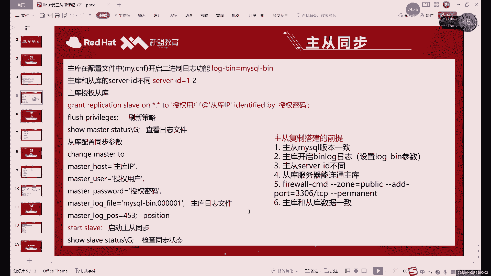

# 【小白入门必备】Linux运维进阶RHCSA+RHCE最全培训教程视频合集 - P82：中级运维-20.增量备份，主从复制-中 - 洋洋得IE - BV1nN4y1X7Go

时间加两个杠就可以了啊，只要遵循这个data time数据类型的时间其实就可以，然后这里的话我们可以来看一下，执行之后呢，我们再来看一下这边啊，同样的还是又多了什么，又多了一个四五哎。

就这个时间段之内的话，就是执行了这两条命令哎，所以说的话我们就是恢复了这两条啊，恢复这两个数据，这就是start和那就是start，这应该叫嗯开始时间和结束时间啊，开始位置和结束位置就是这两种用法啊。

当然这是写了两个了，写了两个，一开始一个结束能不能只写一个呢，哎就比如说呢我们音乐是有一个文件嘛对吧，我们的对象是一个文件，这个文件呢肯定是有大小的对吧，所以说呢其实呢你如果说只是从开始一个月。

直接开始的话，它的它是怎么去执行呢，就从这个位置一直到结束啊，这样也可以，如果只写结束呢，那就是从开始移到这个位置，这应该能理解吧，就是开始的结束，这两个是可以写一个，也可以写两个的啊。

这个其实你根据你具体需要恢复的，是哪一段数据来看，如果说你只是想恢复中间的一小段的话，那你就前后都要写上，如果说你想要从某个地方开始一直复制到结束，那就start，如果说只想恢复到某一部分。

那就写一个stop就可以了，啊如果是日多个日志文件肯定不能做，肯定做不了，因为每个日志文件它的这个位置啊，时间肯定都不一样嘛，啊多个日志文件这样肯定是干不能行啊，不干不了的啊。

呃然后呢这个如果是多日志文件指定的话，只能分开指定啊，如果是你备份了多个文件的话，得要按照什么，按照顺序去就行啊，一定要按照顺序执行，就是恢复的时候按照顺序恢复，因为一旦恢复顺序错了对吧，顺序错了。

刚才也说了，你先删除后插入，相当于没有删啊，先删除后插入就没有删了，时间点，所以说就不要按时间点来嘛，所以说建议你不要用时间点，因为时间点呢，他一秒钟可能会执行很多条命对吧，十几条上百条其实都行。

所以说呢就是一定要注意什么，一定要注意这个位置吧，就用位置不用时间了，我们这里能用时间是为什么，因为我们执行命令很慢对吧，每次执行一条命令，哎这是一条命令的话，等几秒对吧，你看这里就隔了18~27。

是我隔了九秒才执行的，这样的话还可以，如果说你同一时间执行了十条命令，你想回复其中一条，他时间是做不到的，时间是做不到，肯定是做不到的，只能用什么，只能用位置，就是用at这两个就行了。

at是可以精确定位某一个命令，但是时间不一定啊，时间不一定时间，这个知道就行了，尽量还是用什么用位置，而且我们后边的话还会用到位置的，后面还会用到位置，不看啊，啥时候就是一会儿啊。

一会儿就用到下一个内容，我们讲储存的时候，我们就会用到这个位置啊，啊用到这个位置，哎所以说呢这里的话我们就执行什么呢，就是正常有位置就可以啊，有位置可以，然后呢你一般恢复好之后呢，然后再去开什么呢。

记得再开一下日志啊，你千万要记得开日志，就是你执行就是恢复好之后呢，再去开日志，你不开日志的话，你后边后面你执行的一些数据的执行，这些数据插入一些命令的话，就没办法记录了啊，这没办法记录了。

因为我们这种方法的话，我们靠的是什么，这种备份方式就是靠的是日志，想备份就得开日志啊，日志无时无刻就得一直处于打开状态啊，处于打开状态，这是什么，这就是我们的啊增量备份啊，以恢复的方法恢复的话。

基本上其实就是啊如果说没有特殊要求，就是出现了真的真的是出现故障了，那你恢复的就是先恢复增全量备份，然后呢按照顺序去恢复增量备份，如果说只是出现了一些误操作啊，想恢复一点点，就是想恢复一部分数据的话。

其实恢复一部分数据，一般就是一般就是出现误操作，误操作的，他一般不是大量的一个问题，如果是大量的报错的话，就是如果是服务器出现了故障，那这种情况下的话，我们恢复的时候呢肯定是一整个文件，整个文件恢复了。

你不可能是复一部分对吧，一般服务一部分就是你可能是一些操作失误啊，你想要找一下之前的数据对吧，找一下之前的数据，历史命令的可能不太好找啊，历史命令虽然我们是有对吧，满座有历史命令。

如果不是这个终端插入的，不会记录啊，大家注意历史命令不是我们本终端插入的，是不会记录的，所以说呢我们这里如果说想要恢复的话，就是得去找什么啊，从日志里去找你想要的啊，你找到之后呢。

其实也可以不用恢复命令，你把这个命令复制下来，插入去也行啊，这是一种也是一种方法，就是我们这个日志辉就是这个二进制，你恢复的时候，如果说只要不操作误操作的话，也可以不用那些MYSQL人命。

你直接把那个把那个日志里面的东西复制出来，再粘贴进去，你也行，也可以，啊可以按照多个文件的话，可以用shell脚本去执行，但，弄好顺序就行啊，主要注意顺序就可以啊，顺序能确定好的话，可以用下角标本啊。

主要主要是如果说你这个名字，就是因为因为涉及到什么，涉及到这个日志的名字吗，啊日的名字如果说你下载脚本，下载脚本里面不太好指定的话，也可以手动去执行对吧，手动执行文件也不可能太多对吧，因为什么呢。

因为这个如果说你长时间，一般长时间不出问题的话，我们其实也不会一直做什么，大家注意啊，再强调一个。

就是我们也不可能一直去做增量备份的，就是这个的话一般会有一些周期对吧，一周两周啊，一周到两周我们会做一次什么，会每一周一周到两周，我们都会去做一次全量的微分，为什么这样去做呢，就是你如果一直做增量的话。

哪天坏了你根本就恢复不过来啊，哪天坏了你根本就恢复过来对吧，你比如说你一个月前做了个全量备份，然后呢增量备份了一个月，然后出现了点问题，你即使是一天做一次增量，那你得恢复30个文件对吧。

所以说这样肯定是不合理的，我们一般就是你比如说一周，如果说一周做一次增量的话，短信说出了问题，最多也就恢复几个文件而已啊，很方便嘛，如果文件涉及到太多的话，用脚本其实很容易弄错啊，弄脚本也可用。

也容易用错，设置时间不是shell脚本设置啊，对那个什么文件名字可以用shell脚本设置，但是你这个备份的时间不是shell脚本，备份的时间是什么计划任务呀，这个时间可不是计划，下午脚本是计划任务对吧。

就是crown tab那个计划任务，在计划任务里写个每天几点对吧，刷新日志啊，或者说是每天几点刷新日志啊，拷贝日志啊，备份日志是那个计划任务可以写好命令之后呢。

把shell脚本呢放在计划任务里面去电视执行，这个就是我们的增量备份与恢复啊，然后的话下节课我们就开始讲什么，开始讲这个主同嘛，主同的话我们还是用什么，还是用二进制值啊，怎么说呢，走不了哎，走不了。

然后这里的话大家注意要注意，其实GB令的话就是mysql blog这个命令啊，mysql blog这个命令，然后呢加上这个开启的位置和关闭，就是结束的位置，其他的话当然没有其他其他没有其他新命令啊。

这三个命令，其实我们导入导出的时候已经讲过啊，就是我们上节课讲备份的时候，就买这个DP命令是一样的啊，命令也是一样的，MYSQL的主从，MYSQL的主从的话，不用工作不对，SMSH免密不用做啊。

不用做主，从不用做，后边还是会用到的，单纯的主从不用做，明明就单纯的主，从不用做面具，后面讲到高可用的机器的时候，还是需要做的，还是需要做的，啊大家需要注意一下，就是我们接下来呢要做主，从同步的话。

当然一开始你两台就够，但是后边的话我们肯定需要三台对吧，就需要三台，有一个很重要的前提就是什么，就是版本可千万不要安装，版本一定要一样啊，不管说你rpm安装也好，还是亚麻装也好。

版本你先保证给我一样就行啊，一样就行，因为这个现在5。7版本的话，后边已经出到5。7。40多了啊，如果用亚马安装，用亚马安装的，用样板安装的，肯定是40多的版本，那就不能用样板啊，装了的话。

你当然你如果用亚马安装，装了40多的版本的话，你源码安装也可以装，40多的安装方法是安装方法是一样的啊，用法一样，克隆不好，不不不真不建议大家克隆对吧，这个虚拟机这么说吧，我从来没有克隆过啊。

为什么没有，为什么我我不克隆呢，因为这个克隆这个问题下来，有个东西它叫什么，它叫这个，咱们系统里面，其实有很多东西都是有唯一标识符的，你像像这个看这个什么像网卡的一个id对吧，嗯然后呢卖个地址啊对吧。

你像这个很多id啊啊很多ID它有可能都重，但是都是一都一样的啊，都是一样的，一样的话做实验是会报错的，那不仅仅说是这个实验，那后边有可能其他实验UID一样的话，也会给你报错，所以说呢这个克隆不太推荐啊。

不太推荐我的所有虚拟机，我都是一个一个安装的啊，都是一个一个安装的，我从来没有克隆过，因为这个克隆怎么说呢，他就克隆你这也就是快点，但是容易报错啊，容易报错，然后123129128129128229。

然后呢做之前的话还有一个就是呃版本相同，是一个一个前提，第二前期的话尽量就是什么呢，就是保持数据一致，保持数据是最好的方法是什么，最好的方法是恢复一下快照，啊最好的方法是恢复快照，恢复快照的话。

你都恢复到这个刚装好MYSQL的时候，其实是比较合适，如果没有快照怎么办呢，也没关系啊，可能有些同学就是没有拍，就买这么快的也也没事啊，这个时候怎么办呢，就是一种方法是删掉多余的，另一种方法就是什么。

就是就把你删掉的创，把你创建的数据库删掉，或者说这种是一种方法，另一种方法就是用我们刚讲过的，备份和恢复的方法啊，刚才我们我们不是刚讲过备份恢复吗，对吧，你从这个月第一台备份下来，恢复到第二台上对吧。

这也是恢备份和恢复的用法，这就相当于什么，这就相当于手动的同步数据啊，这就相当于手动同步数据，你你启动一下MYSQL啊，启动一下MYSQL，MYSQL一定要启动啊，你不启动，你怎么连呢对吧。

那次卫星一定要启动，在这里恢复一下快照啊，恢复下快照，我这里恢复快照了啊，备份恢复的话，如果说大家啊不想删你的数据啊。

想数据留下来的话，那你就把那个把第一台的啊。

你复制下来，你就备份下来，恢复到第二台，第三台上，这样也是可以的啊，一定要保证数据是一致的，为什么这么说呢，这个主从同步啊，或者说是主从复制啊，啊它也是通过我们的二进制制来的。

你如果说你第一台和第二是数据它不一样，那你在第一台里面，如果说比如说你说第一台有五个数据库，第二台有四个数据库，那你如果第一台在操作第一个数据库的时候，同步到第二排，他的所有命令都是会报错的，因为什么。

因为他没有那个数据库，所以这也没办法同步啊，这就是为什么我要大家就保证，一定要保证数据一定要一致，数据不一致，它是没办法同步的啊，没办法同步的，要注意这个，所以说我这里不是恢复了快照啊。

就相当于这种的话，这种比被动恢复快一点啊，比恢复稍微快一点就恢复快照嘛。

128129131这IP。

13131是131129。

啊我用自动获取呢，就是玩就是单纯的是防单纯是防止这个IP，中国大家还是用静态的啊，那还是用静态的，我这里就是我不能配静态和非静态容易冲突。

因为机构里面都是一个网段，都是零网段，IP多了确实容易重复，每次做实验的时候，我就要站上，我要站我要站好这个WIFI的三个网站啊，甚至四个五个六个，后面我最多能占到七个网，七个是不是不是网站七个IP啊。

我能占七个IP，所以说用DNCP的肯定不会冲突，因为它相当于是向这个服务，向路由器请求IP嘛，所以说肯定是不会冲突的，如果手动配的话，如果已经有人用了这个IP啊，那就那你肯定会冲突。

冲突就不能用了，31131和129对对面，129，我就只当然如果是在家里的话，很方便，你就配个固定的IP啊，我这里是真确实不能配固定IP，NAT啊，我知道NAT，我的电脑NAT和NAT模式水火不容。

好像AT时候我知道NT可以配固定，但是我这个电脑NT不好使，我也想用AT，但是我这个电脑就是AT，第一天可以，第二天上线就不清楚啊，重启一下，有可能可以有可能还会报错这个东西呃。

这个时候第一台我们就要主步吧，啊主库这个是0。131啊，第二台我们就重复，你这个报错不是没启动，你这个报错是密码密码问题，你之前怎么处理，你再用再用之前的方法处理就行，我知道你经常遇到这种问题啊。

129嗯，129的这个缩小一点，稍微十十六十五，15啊好，这是两台好，10。1290。131啊，这是一个主库，一个存库，我们先不着急，用三台，我们先来简简单简单来说一下这个主动复制啊。

我们先来说主动复制，对再免费再继续改密码吧，这个，两台对吧，两台主从这里的话，首先我们先来介绍一下主题吗，我们先不着急做啊。

不着急做实验啊，这个其实主从这里这个理论还是比较重要的，为什么呢，就是嗯有一些面试确实偶尔会问到这个，就是主从它的原理是什么，就是MYSQL同步数据啊，主动同步它的原理是啥。

你即使是不理解你对技术的啊这个东西，但最好还是先理解啊，最好还是先理解，理解之后你能描述出来啊，最好能描述出来，首先的话靠的是什么呢，如果说一句话来概括主从同步的原理，就是二进制日志啊。

一句话就是二进制日志，就是我们刚才备份的时候用的认知，为什么备份的时候用的日志，我们这里还能做这个同步呢，对吧，其实道理是一样的，就我刚才不是说了嘛，就是你把第一台的导出再导入对吧，这算这也算同步吗。

就算手动同步，这就不是我们自动同步了，这个手动同步我们是自动的全自动啊，不需要我们去操作，然后这里的话这个主动同步呢啊首先原理对吧，二进制日志，二级支持的话，在我们的主从里面。

其实是相当于起到一个桥梁的作用，连接两台什么呢，连接两台数据库，因为什么，因为其实你同步数据，首先对吧，你得让我们的主库对吧，把数据给到同库，那怎么给他呢，我插入一条命令，给你一条命令吗。

啊这样肯定不太合适对吧，这样其实不太合适啊，正常我们这个在主动复制里面，它怎么实现这个两个库的连接呢，就是通过这个二进制制，前提是一定要开啊，一定要开，开了二阶日之后呢，我们主库执行一条命令。

是不是会写入到这个日志里边，对不对啊，我刚才也看了，我们备份的时候，其实已经演示了，主库写一条日志，就写一条日志，写一条这个二进制啊，binary2进制制啊，binary log就是二进制二进制制。

写一条我们就会同步到哪儿了，同步到右边，当然也不是直接同步给同步啊，直接同步给同步，稍微显得有点草率，我们怎么做呢，它是，他这有了数据之后呢，我们是将数据呢给到啊，我们这里有一个做主图的话。

我们会开一个读写的进程啊，读取数据，读取数据，写入数据的一个进程，开这个进程之后的话，我们的同库这里，读取到我们二进制之中的新的内容，然后呢写入到自己的中继日志里面啊，就log的话。

中继日志就是存放这个主库这边的，执行命令的信息的啊，中计日志也是一个日志，相当于是把这个二进制日志啊，就是把主库里边的二进制里面，内容呢写到我们自己的这个哎中继日里，然后呢执行。

然后直接执行到我们的同库里啊，这是同步的过程啊，这就是我们同步的过程，所以说二进制日志，在我们这个里面是非常重要的环节啊，或者说最重要的环节其实也可以啊，就是我们主库写入到二进制日志里面，然后呢。

同库呢需要从二进制里面去什么去读取数据啊，去读取数据，所以说呢二进制呢其实就是我们主从复制里面，这个核心的一个原理，哎它就是核心，一句话的话就是二进制之，详细来说呢啊那你就至少分三点了啊。

至少分三分三点，这三点的话，首先第一的话就是主库将自己的改编的记录，包括什么，包括增删改三种对吧，写到二进制日志当中结束之后的话，我们从库呢将二进制日志里面的这个信息呢。

就是刚刚执行的命令拷贝到自己的中日治理，这是第二步，第三步呢，就是我们从库呢从中继日志中获取命令，直接把命令，相当于直接给命令复制到自己的数据库里面，就完成了，啊这个就是我们二。

就是我们主动同步这边的一个过程啊，主动同步这边的过程，同步好之后的话，就是我们这边这三步执行完之后，那从库和主库里面的数据就一样了啊，都一样，然后呢只要重复每执行一个命令，我们重复就主库每执行一次。

重复就执行一个，应该叫主库里面写一个命令，我们重复写一个命令，就相当于就是你只要这边你你只要这边你写入，我们从不立马执行啊，就是主动同步，如果能够用到的工具的话啊，或者说用到命令吧，也可以。

就是replication啊，reputation的话就是我们这个主要的一个核心啊，核心，这里的话是这个什么，是这个，它呢其实就是将我们数据，从一台数据库复制到另一台数据库，的一个主要的一个内容啊。

replication我们后边命令的话也会用到啊，命令就是我们执行这个主动复制啊，主动同步这个命令的时候，也会用到这个replication，Replication，总体的步骤就是这个啊。

总体我们的过程的话是这样的，然后执行起来的话，首先因为注意事项是比较多的，这话就不像我们前面的几节课对吧，前面几课我们其实你想其实执行命令，想怎么执行，怎么执行，只要你语法对对吧，你想怎么改怎么改啊。

因为我们只是一些普通的命令嘛，啊只是一些命令，但是呢涉及到我们这个主动同步的时候呢，我们不能就不能那么草率了啊，我们不能那么草率，普通路这边的话，因为限制比较多啊，我刚才其实也说了对吧。

刚才说的其实只是两个点对吧，两个点希望大家提前准备的两个点，就是一呢就是版本一样对吧，第二的话就是数据一样，这是其中两个点，因为这个主动复制的，你看啊，比如说我们正常的话，从它里边复制数据到他这里对吧。

你的原数据肯定要一样，你不一样的话，只要是有一点他执行了一个多余的数据啊，就是一个多出来的数据的话，第二个库的话就没办法执行对吧，就像我刚才说的，他五个库，他四个库那样，肯定不能同步啊。

所以说呢提前期前提的话，他们就是两个库之间的数据一定要一致啊，一致之后呢，还有几个条件啊，我们先把条件说完，我们再再做这个主动复制啊，条件一定要提前说好，因为什么，因为后边这个MYSQL主从同步呢。

大家一定会报错啊，这报错的数量可能不亚于安装MYSQL啊，这个报错数量可能不亚于MYSL，按照往期经验来说，啊啊MYSQL这边我们一般我一般讲课是讲九节课啊，现在的话是第一，这是第几节啊。

现在是第七节啊，一般讲九节啊，多一点可能讲解结拜啊，这里的话这个前提的话先给大家说一下对吧，版本一直跟他说了对吧，另一个就是数据一致也说了，还有还有好几个呢啊，还有好几个呢只做主从同步不了数据呢。

80%的情况都是这个，啊8%是这个情况，就是你主后重复数据不一致，就是我们这个MYSQL主从啊，我们大家注意啊，就是同步它从什么开始同步呢，就是你主从生效之后呢，你执行的命令它才会同步。

你如果说开始它的命令就不一样，就开始它的数据不一样，最开始的时候他他五个库，他四库就是这个是没办法同步的，这个需要你手动去同步这个它，因为它这里呢只能同步二进制之之，开启之后就二进制制连接之后的命令。

就是之前的呢之前的日志内容能不能同步，它不能同步啊，大家注意就是它只会同步，连接好之后的，这个就是主从连上之后开始的这些改变的命令，它才会能同步之前的那些数据，需要我们手动去啊。

其实一般如果说你做好同步，如果是两个yes，如果说都是yes了，但是还不能同步的话，一般就是数据不一致的问题，用户权限其实不太影响，因为用户权限虽然说属于这个啊，优惠权限其实不影响用户权限影响不大。

主要还是这个原数据吧，然后呢如果不重复以前的不行，为什么呢，因为啊当然除了这个用户啊，就是MYSQL里面不是有用户吗，用户这个不同步，但是也可以，这个不同步也无所谓啊。

因为这个本来你不同的数据库之间有不同，用户也正常，所以说这个可以不同步，但其他的像那些我们自己创建的一些库对吧，就除了系统里面默认的字库以外，其他的库肯定是一定要同步的，你不同步。

你一执行命令就报错了啊，一定要同步之前的权限，其实影响不大啊，我们这里的话只要满足这六个条件，其实一般就可以啊，基本上我想不出来第七个了。

权限没在前提条件里面，权限一般不在前提条件里，你看这里的版本一致，数据一致，我说过了对吧，然后呢就是开启blog，就是主库要开重复就可以不卡啊，不可以不开，那你想开也行啊，想开也可以不影响啊。

就主库一定要开，从库随意啊，开启二进制日志，第三的话，SLID这个server server id是啥呢，这个server id呢就是我刚才就说了，你不要克隆克隆呢，这种IE就会重复。

这个也是一个id啊，这个也是一个id，如果说你把第一个课程放到第二个，这别说那个网卡Mac地址，那些MYSQL都不同意啊，MYSQL我们也是有这个VEIB的，有很多服务的话都啊也不是说很多服务吧。

有有一部分服务不能说很多，只有一部分一部有一部分服务的话，他都会有这种id的限制，像这个MYSQL就有id呢，不能不能一样，那你要做好第一个，你复制一份，那id肯定是一样的，满足我这里就就会报错。

但不用说你系统里面其他的服务了啊，SLD呢一定要不一样，具体是啥呢，就这个是完全自定义的，1234567，你随便写啊，只要是一个局域网之内不要重复就行，或者说是不能说一个局域网就是一个集群里面。

一个MYSQL集群里面不要重复就行，注意这个第四个的话就是从库能连通主库，这个什么意思呢，就是能访问，这个就涉及到我们前面讲过的第三种SQL语句，对吧，大家还记得是什么，就是那个叫什么来着。

授权对授权有授权，我们这里需要做啊，不知道大家还记不记得命啊，授权就是主户一定要给存户授权，这是第第四个，第五个的话就是防火墙问题啊，保险问题。

偶尔也会报错啊，我做我做主，从也会报错，我一般报错是哪个呢，我一般报错就是这个原因啊，为什么我把这个把下课的提示的这个符号，这里我会写个官方号强，因为我老是忘记官方号强啊，这个东西怎么说呢。

防火墙这个事儿啊对吧，防火墙这个东西，但不是说一定要关啊，关是一种解决方法，另一种方法就是开启336端口，像这种啊disable是吧，呃这不是disabled的问题，是主要是快照里面。

因为我经常服务快照嘛，快照里面没有开，但是我也不能删了，快乐再重新排，因为我最开始的快照生出来好多个快照，如果删一个的话，其实也没用，所以这个东西的话，我就只能说自己记的粉丝关吧，然后老是记不住。

所以说我就写在了那个下课那个提示的，那个文档里面，每天看对吧，基本上还能养成的习惯，我这个真真是我之前讲课的时候也会报错，但是每次每次报错一般都是什么，一般就是帮强其他的基本上没啥事，就是防火墙。

防火墙只要无意不关，他就告诉我，对年纪也是年纪大，年纪大，记性不好，记性不好，啊就这几个条件对吧，看起来多，其实也没啥，你就注意好，只要把这六个条件你确保OK了，那基本上你的主从句已经做好了。

因为这些的话其实也就是我们设置的一些秘密，你只要把这些全部做好的话，基本上主动就已经做完了啊，已经做完了，所以说首先的话我们就来看你们啊，首先我们就开始，我们接下来就开始了，开始做这个主动。

然后呢这个首先第一版本我们能确保一致吗，肯定是一致的，因为我全部都是源码安装同一个包，所以这个没问题，第六点主库数主库存库数据一致，我这里都是恢复什么的，我这里都恢复了这个最原始的快照。

就是刚装好数据库对吧，这是刚装好数据库的，每一个都是每个都是刚装好数据管，我去这等一下，这有点问题啊，这有点问题，我突然发现第二个库有点不太对啊。

第二库好像把一个奇怪的东西拍到拍照里，MYSL杠you root，杠P1，啊没事啊啊，那应该是删掉之后又拍了拍照，那没事啊，其实你看的话主要是看什么，主要看你有没有多余的库啊。

因为系统里面库的话基本上我们不会改的，所以说呢数据数据数据默认是一样的，嗯系统系统库的话，其实除了嗯系统库，其实除了这个，除了MYSQL以外，其他三个不常改。

MYSQL里面我最多也就改那个user表user嘛，user那个不同步也行，因为你不同的数据库有不同用户也正常对吧，也没必要非要把用户的都给同步了，你想同步也行啊，小同步倒也可以，这里一般情况下。

你没有多余的库就正常就可以了，就可以做主动了啊，他们四个，其实表格一样，其实就行啊，后边你插什么数据的话，其实也可能后边也能同步了啊，也能同步了，好现在确保什么，确保现在第一条第六条没问题了对吧。

现在我先做第五条，我怕一会忘了啊，我先做第五条啊，我快照里面都是没牌，FIRE对FIRE啊，关一下啊，slinks那个其实MYSQL那个不会关，那个不会拿MYSQL的，所以说不关也行啊。

但是呢你如果说从现在开始养成习惯的话，其实你关一下也行，因为后边的服务的话，你不关它就会懒的卖，SQL的话就是slinks，这个的话他不会拉满SQL，但是会拿其他的后面的服务啊，这个是临时关闭啊。

只是临时关，你要永久关的话，你改配置文件，改配置文件就行了，啊这一步的话其实跟MYSQL没什么太大关系，因为他SELINUX不会设，不会限制买SGO，然后现在156完成了对吧。

那我现在主要就是工作就是做二，其实也有了对吧，二我们之前不是做日志嘛对吧，之前不是日日做备份吗，做备份的话，其实我们都比没开，因为默认就有，所以说第二点呢其实也OK了对吧也OK了，现在的话我们看第三点。

第三点的话就是主从的server id，这个的话大家一定要改一下，因为什么，因为如果说都用都用那种方法安装的话，尤其是源码安装4y id它是一样的，他他倒也不是克隆的问题，也不是说克隆的问题。

是因为那个配置文件里面都是搜索id，等于一波大家注意过没，就是复制那里，啊就是复制配置选项对吧，就是主动复制的意思，在外地等于一对吧，所有的都是你，这个东西你可以在创建的时候改，自己改一下。

你创建不改的话，你这里容易出问题啊，user load下的MYSQL里面的ETT的MSF唉也是一样，这个，你看这里也是一啊，因为什么，因为配置文件都一样啊，配置文件是一个配置文件，所以说注意一下这里啊。

比如这里改成R就行呃，防火墙不是说一定要关，就是你得放行这个3306端口，包括后边的服务也是一样的，防火墙不一定要关，但是一定要开端口吧，你不想打那么长的开端口命令，那你就关防火墙，两个选择二选一。

二选一，那这里的话记得要把SI改成不一样的，如果这里一样的话，后边主从复制一定会报错啊，一定会报错的，啊改完之后记得重启一下，不重启不会生效，啊这边重启一下数据库，重启好之后呢，现在第三点也完成了啊。

不是第二点啊，第二点也完成了，然后接下来是第三点啊，不是第三点完成第四点，第四点从互联通主库通过联盟主库靠的是什么，靠的是授权对吧，授权命令大家还记得吗，啊GRA命令对吧，我我我刚刚啥也没说呀。

我刚刚说的就是server id一定要不一样就行啊，server id一定要不一样，这边重启好之后的话，接下来呢就是这个第第四步对吧，第四步第四步，这个同步联动主簿就授权啊，授权必须写在这。

啊防火墙不关也行，防火墙不关的话就放行端口，就是这个命令吗，不是写在这了吗，啊PPT里边有，后边可以，这个就是不官方网墙的做法，官方网墙就是system Ctrl stop fever，不关的话。

就这个，然后的话授权这里啊，我们可以看一下这个授权的话，和我们之前的授权呢，嗯怎么说呢，主从授权的话和刚才授予所有权限，其他不一样，哎grant replications live对吧。

之前我们写的是二对吧，二的话指的是最有权限啊，我们主动授权的话，他这个名字叫replication加上slave啊，replication that s类，这个就是那个什么。

这个就是主从同步的一个关键词吧，你可以理解啊，然后后边的当然就和之前所说的一样啊，后边和之前说的一样，你看像slay all，然后后边呢all后面加上数据库和数据表，这里具体同步哪些呢，就像系统库。

你其实是可以不同步的啊，系统库是可以不同步的，这个不强求，因为系统库里面就是它只是存放的，是我们本地这个数据库的一些数据，所以说呢系统库可以不同步，你只可以说只同步一个什么，可以只同步一个你的数据库。

哎呀好像说了跟没说似的啊，这个数据库我指的是什么，就是你后边自己创建的一些库对吧，就比如说我应该之前都让大家用自己名字，创建库对吧，就是这个库我们可以直接把这一个库写在这里，就是你主动同步的时候。

不一定要非要同步整个数据库，就是因为系统里面那几个库呢，它里面放的其实也并不是说，这并不是说实际的业务的数据对吧，它里面放的只是一些系统设置啊，它里边只放系统设置，所以说呢这里的话大家注意。

就是可以指同步，我们的真正存放数据的那个库啊，但是现在我没有，所以就用心点心啊，有的话也可以直接指定啊，我这里现在因为没有数据库，然后two啊授权用户加上重复的IP，重复IP啊。

所以大家注意重复的IP不要写local host了，之前我们是写local host对吧，logo host就是本地啊，允许本地的用户登录了，这里的话我们是授权用户，然后加上重复的IP啊。

就允许重复去访问对吧，就是这个，然后后面的话identified by就是授权密码，就不用多说了吧，你写什么都行啊，无所谓，然后这里的话这条命令的话，其实就除了前面的replication slay。

我没见过以外，其实前来其实其他的后边大家都已经，大家都已经超过了，对吧啊，嗯然后接下来的话，我们就来具体的执行一下这个命令啊，大家注意这个命令是在哪执行的，就在主库上执行啊，从库呢不需要啊，同库不需要。

因为相当于什么，因为这相当于是主库呢授权给从库，首先给从库访问啊，当然不在这里，准确的说不是访问啊，就是授权给从库去什么呢，去做这个主从对吧，所以说呢我们这里这个，只需要在哪只需要在主库上声音就可以啊。

重复上不用执行，同步不用执行，然后这里我看一下啊，嗯入库就入库吧，王宝强已经关了，防火墙不关的话，不会拦截那个3306端口，就是你这里即使授权了，你防火墙一拦截，你这个授权根本就过不去的啊。

授权是过不去的，啊所以说这里的话我们先授权啊，先授权啊，防火墙关了之后授权啊，嗯大家就是怎么说呢，尽量就是你平时群里发消息的时候可以发图片，你这个上课就不要发图片了，上课图片我可能收不到。

上述图片基本都裂开啊，销售图片基本都裂开，你发报错的信息吧，或者说什么的，FIREWORD的意思，那你就是防火墙没开呗，防火墙没开，防火墙没开就不用设置策略了啊，那个策略是防火墙开了个策略。

防火墙如果已经关了的话，其实他就不会拦截端口了，那那你就那就无所谓啊，那就不用，那就不用设置那个，看我现在是这个同步这个主库对吧，我们先进入到主库里面去修改这个授权了啊，修改授权，啊成功就可以了对吧。

success就成功了呗，就你设置个策略成功就是放行的三六端口，这个不就正确了吗，你如果有不认识的，你可以翻译一下对吧，你去下载个翻译的软件对吧，你执行命令，有时候有时候他执行命令的一个返回信息。

它它不一定是报错，也有可能是什么，它有可能是这个正确的一些信息是正确信息，他有可能也会返回啊，这个就，啊无奈你这个图片可以重发一下，可以重发一下，我也看不到啊，然后这里的话我们先授权对吧。

我们先授权了grant，直接replication，其实呢这个all呢我们之前不是用的all嘛对吧，之前的all呢其实是所有权限对吧，那replication属不属于一个权限呢。

它也属它只是主从复制的一个权限，所以说呢这里的话你如果只是要求同复制的话，那就是reaction slave，如果说你想要给它所有权限用二也行，因为二的话里面是包括这个组同的权限的啊。

二是包括这个组同的权限，啊所以说这个的话就是什么，这个就是嗯这个的话你可以写啊，你不想记这么长的话也可以写啊，但是用二的话就相当于授予所有权限了，就不只只是一个主同了啊，不止一个主从了。

所以说一定要注意这个这个问题，注意这个问题啊，注意这个问题。

你这写的是什么作id，一台为一台为二，哦忽略某个数据库是吧，日志文件名字作为背部添加的内容。

其实没必要写这么多啊，如果说你是只是要指定这个某一个库不访问，或者说是呃某些库访问的话，其实没问题啊，其实没问题，然后呢grand后面我们接着继续往下说对吧，嗯这里的话可以用all来代替啊。

replication slave可以用all来代替，all的话就包括所有的，其实是包括这个主动的啊，包括这个属同的，然后边的话我们就加上具体的啊，加上具体的库，然后呢这个配置这个配置没问题啊。

这个配置没问题嗯，看一下，这样的话就是首先就是二啊，所以说无奈你你刚才发的那个配置没有问题啊，配置没问题，就是你指定的时候其实也不用这么指定，你这样指定其实有点麻烦，如果说只要只要同步一个库的话。

也可以在这里写对吧，test点信号对写配置文件里大家也可以啊，如果是这样写的话也行，啊当然如果说你只是同步一个库的话，可以写在配置文件里那样写，2。2test点心对吧，这这就是一个库。

当然我现在如果没有库的话，那就是什么就是新点心是吧，我这里我这里没有库啊，所以说用心点心吧，然后呢to对吧，后后面加上用户名和密码，用户的话其实无所谓啊，你用哪个用户都行啊，用户只要你随便写一个就行了。

没有都无所谓的，因为grant我们可以自动创建用户，然后后边能加什么，后边加上这个，192。168。0点，129，然后这0。19的话，就是我们后面那台重复是吧，收益是在重复的权限。

然后identify buy就可以了，啊无所谓，这个其实简单点吧啊一吧，Grant revocation slave，二零点进to对吧，这个就是授权的一个权限，这个就是怎么说，这个是主从的授权啊。

方式授权授权之后呢，怎么验证呢，很简单，你就是用重复连一下，好用分布去连一下，用头互连的话，其实这个主要验证的是什么，验证一般也不是授权授权，一般没从，主要咱们验证的是这个开没开防火墙。

因为你因为这个如果说连不上的话，需要先检查防火墙，先检查防火墙，再检查授权的语句啊，杠H192。168。0。131，这个命令的话就是什么，就是远程连接其他数据库，就是在我们第二台上，如果想连D台行不行。

可以就是MYSQL杠1root gp，这里就是大家注意这里是授权那个密码，也不是说是它原来的密码，就是你授权的是什么就用什么啊，授权的是root用户一的密码对吧，那你就写root1。

如果说你这里授权了123，那你就得写123好吧，这里的话我们正常用连接一下啊，能连上啊，K的能连上了，能连上就没问题，可以退了啊，退出说明什么。

说明我们的D，1234，四第四条也成功了对吧，那1~6就全部完成了对吧，完成了1~6全部完成之后的话，我们就接下来进进入最后一步啊，这个是前提啊，大家注意啊，我1~6只是前提还没完啊，还没完。

然后下一步的话我们用什么，下一步的话就最后这个change master to change master to，然后呢这里的同库啊，同库配置同步的参数，就这这这几部分啊，这几部分这一部分总准准。

比如说就是完整的来说吧，其实他就是在重复上指定什么。

指定主库的一些参数，因为什么，因为首先呢我们这里授权是可以对吧，就是重复可以连出库了啊，可以连不够对吧，可以连也不够啊，最主要还有什么，还需要这个能够真正访问到什么，主要是访问到二进制的文件。

啊二进制文件，比如这里的话，我们首先就是MYSQL杠，等一下这里授权我们说过了对吧，刚刚授权啊，授权收过的话，Show masters live and status。

我们查看一下这个我们当前的这个日志啊，这个位置啊，这个show master status，就是查看怎么查看我们主库的一个状态啊，查看我们主顾的状态，相当于是大家也不能说主顾状态。

就是查看我们当前的日志啊，日的一个位置哎，准确来说是这样，那就show master status啊，这个命令的话，就是我们来看一下我们这个二进制日志，现在在哪对吧，用的是02日志。

然后位置呢是693对吧，位置是693，然后呢这个是我们一会要用到哪，用到哪，我们一会连接要用啊，我也把它记下，啊把它放在这儿啊，这个693，然后呢我们同库呢怎么去连呢，不连的话，你先进数据库里面。

进去之后呢，直接用CHINEMASTER指定，指定一下我们这个主库的这边的信息，日志的话不需不需要啊，日志这个不需要reset，因为啊你想一下下雨下的也行啊，这个这个倒不影响，因为我们这里指定了之后呢。

相当于是我们同步呢从这个位置开始才，从同步之前的，不管啊，之前呢还是不管，所以说这个位置呢可以不用reset啊，这里可以不用reset，你想reset也行，reset之后的话它就是零一。

然后呢这个数字会比较小一点都不影响的啊，这个相当于是我们这个重复，从这个位置开始才同步啊，就这个意思指定一下同步开始的一个位置吧，对吧，我们来看一下这个啊，这样打的话只是相当于好看一点，好看一点。

192。192。168。0点多少呢，131是我们主库的IP啊，这里主库指定主库IP，然后下一个呢是什么呢，下一个是post等于用户啊，授权用户，我们这里当然用了root，用其他用户也行。

这个授权谁都可以啊，这个不影响授权，这个用户的话，他没有什么用，我是不是拿人打错啊，对是打错c h a n g e master to，master host等于192。168。0。131。

master杠user等于root，下一个是什么，下一个是密码啊，前面都是master开头，然后后边下划线加上你这个对应的这个信息，对吧，密码我们就是一很简单啊，很简单，下一个是啊。

下一个就比较重要了对吧，我刚才为什么截了个图呢，不就是写这个东西，就是从哪个文件开始同步，从哪个文件开始同步，然后从这个哪个位置开始啊，从哪个文件开始，从哪个位置开始，文件名字的话就是MYSQL。

你把这个名字直接写一下，或者你复制也可以啊，000002数一下，零一定要够啊，这里名字一定不能错，这如果你少个零多个零什么的，他也会报错的，他也会报错的，就找不到文件了啊，找不到文件。

然后最后一个是master杠，呃不是这个命令只是方便大家看啊，不是说输错了，这个，几来着啊，693对吧，这是一种写法，这种的话只是方便大家区分这几个不同的，这个选项，不是选项的几个参数吗。

啊区跟你不同的参数，正常来说的话，我是我，我平时是这样写的，Master to，我平时这样写的，这个MYSQL里面你不挑封号，你敲回车它就会自动换行，但其实呢它还是一行还是一行命令啊，我平时这样写的。

然后后边你往后跟着走就行了对吧，用逗号隔开跟着走就行了，不用这样写，这样写的话只是方便看真正常直面就是一整行，走下去就不敲回车的，中间就一挨着挨着写就行了，中间用逗号隔开就可以了。

注意逗号每个里面每个参数用逗号隔开就可以，最后用公号结尾啊，最后一个他这个不是个字符啊，它不是字符，所以说呢，而且他这个还比较怎么说呢，比较固定一点，他这个甚至不能忍，他这个圣字一般。

其实我们的数字也能用引号对吧，他这里的数字都不能用引号的，大家注意这个一定不能用引号，最后一个，它其实这里都不能算是数值了，因为数值其实也可以讲讲啊，这里是比较特殊的一个点了，前面四个加引号。

最后最后是不能加不能加，这个就是position啊，就是我们刚才那个start start position和stop position，那个那个那个那个数字嘛啊，啊你正常会跟你和跟着往下往下走就行啊。

这里的话授权授权不是授权，这个也不是不能说授权吧，这个叫什么，这个叫，指定一下我们主库的一些参数，那也就相当于，这个是相当于是连接的一个选项了，连接命令的话，我们最后是通过start live来启动的。

然后呢提前配置了这些选项对吧，提前配置我们是连哪个连谁对吧，用户密码是什么，连哪个文件对吧，连哪个文件的位置唉，连哪个文件的位置都写完之后呢，start4类情况，大家如果说怕打错的话，你就不要这样写。

你就横着写横着写，因为这样打错确实不能改啊，现在打算不能改的slave启动啊，这就启动这种程度，启动之后呢，怎么看你是否成功呢，你可以直接去创建点东西验证一下啊，但其实其实最好的方法就是。

直接创建的东西去验证，因为这个是最准确的，这个show slave stage呢，它其实不准确啊，它其实不准确，他这里如果说只是写yes的话，它只是能证明什么，只是证明你这个设置的没啥大问题啊。

这句话主要是error，这里如果有报错的话，这里就有error信息啊，你报错的话，你不要说你直接来问我，你先看一下报错信息是啥啊，这里的报复心，你看完之后，你给他翻译一下，其实你就知道你错哪了。

这里的boss信息很详细的啊，背包的经验是很强啊，很详细的，你就一一旦你主动失败了，你先看这里是写的啥啊，然后两个叶子就是成功了，这里成功呢只是什么，只是连接上，但是呢你不一定代表你能同步啊。

啊真正的同步还是要什么，还是要用主库那边创建点东西啊，去验证的，但是大部分情况下呢，一般只要是yes都没问题，那些他也是单，也有例外啊，也有例外，他这个就比较痛苦，如果两个yes还不能同步的话。

这种确实比不太好唉，不太好弄，比如我们这里呢来创建一个副本啊，Cretadatabase，Create database，后面加这个随便写吧，啊创建好之后对吧，soda t a BIS e s对吧。

这边也有了一个新的库对吧，那我们同步之后呢，就同步生成了对吧，你只要你这边一创建的东西这边一定有啊，有了之后的那说明什么，说明主动主动同步呢，就肯定百分百完成了。

但是呢如果说是在第一个第一个库里面有的表，第二个库里面本身就没有，然后这种情况下，只是你能主动同步，你也只能做同步其他的数据啊，就是最开始如果说有不一样的，那你再怎么他也不可能再重复啊，除非说什么。

除非说你是在第二个表格里面，再创建个和前面一样的啊，这样的话也可以也可以解决，数据库重启之后还能同步吗，重启哪个呢，我重启第一个吧，重启主库啊，我重启主任也重启，从，啊restart mysql。

啊都重启一下啊，不重启一下，模拟之后呢，我们再进到数据库里面啊，然后这边的话我们直接柚子，这里边我创建个表格吧，For table，然后这边看一下吧，use切换到，然后呢我看一下show tables。

Zs t t u s slave，S a t u s，来看一下这边，这边直接断开两个NO，状态肯定是挤不堪，这个肯定是启动了，启动之后，看一下start，我看1start slay，啊重新启动之后。

你再重启一下点，就是重新启动一下这个进程，启动一下主动同步的进程啊，像执行命他这边有重复，啊这个还是能创建出来的啊，这个你得启动一下什么，启动一下那个，重启之后。

需要重新开一下那个什么主动同步这个进程啊，开一下这个定义就可以了，还有gt的话可以继续同步吧，主副那边无所谓，主副那边不用操作，因为主库的话它相当于是个被动的啊，相当于是被动的一个被动的状态啊。

被动状态我执行命令的话就这些啊，就这些就PT上面这些吧，我其实没多执行，其他的就这些吗，你需要你最好记得你这是对应的，你去换啊，不要抄这个这个不要抄，我刚才执行面其实就这几个吗。

啊grant smaster和这些啊，这就是命，没其他的，好大家可以下课休息几分钟，大家可以门装好数据库，可以装一装，装好之后可以看一下主充能不能能不能做成功，对吧，不成功的话。

你截图可以直接把错题截出来看一看啊，这个看，但是我不一定能收到啊，因为这个腾讯会议这个唉，发图片是真的有点做的不太好，好我们接下来的话继续啊，继续往下看啊，就是这个最后这里这里再强调一下。

就是不能加引号啊，就是它因为它不是字符，也不是数字啊，它只是一个位置，就是我们日志文件里的一个位置，一个比较特殊的一个，你比较一个特殊的一个存在嘛，他不不也不是数据对吧，所以说这里是不能加引号了。

不能加引号，然后的话我们继续往下看啊，接下来继续往下看，对吧刚才其实已经连接上对吧，就两个月这边两个叶子就没问题啊，两个叶子就没问题，两个叶子之后的话，其实这边就可以正常的可以正常连接了啊。

两边是可以正常连的，啊连上之后的话，左边不管是执行什么命令对吧，右边就可以同步执行啊，一边可以同步执行，唯一问题就是主库这边怎么重启都没事啊，就是重复这边重启的话，重启之后的话，他这个。

就在重启数据库的时候，但是这个再重启输入之后它就没了嘛，啊有很多我们在执行在哪呢，直径在这个命令行里面，命令呢它都相当于是临时的啊，重启之后它就没了，你需要什么就重启之后你再开启一下啊，开启一下。

然后这个话就是我们MYSQL编的主从啊。

MYSL编的主从，唉主从做完之后的话，其实接下来呢我刚才不是说三台嘛对吧，就是说三台呢啊，正常你一个一主一从那两台肯定够是吧，两台肯定够进来的话，我们可以说一下怎么说一下这个三台对吧。

三台的话一组多重我们这里不延迟了，一组多重就不延迟了，因为一组多重的话，还有那唯一的区别就是在授权这里，授权这里多授权一个就可以，你多授权一个IP就行了，所以这里我就不多讲，一组多重的话。

这个其实也和一种两层是一组一同是一样的啊，这多个重复字号id记得还是不要重复就行，然后剩下的话就是在授权这里，授权这里你就可以写多个IP就行了啊，多写多写几个IP，或者说什么呢。

或者说你直接写一个网段也可以啊，这里可以直接写一个网网段，哎呦，啊所以说这里的话就是什么，就是我们这个，这是一个网段话，就比如说可以怎么写的，就写192。168。0。百分号，它就是一个网段。

或者甚至你就再懒一点，你可以直接只写一个百分号，就是重复IP，这里可以直接用百分号代替，这个什么意思，就是你只要能拼通就能访问啊，只要你能平衡，你就能访问，就是这个怎么说呢，就是肯定没那么安全。

但是其实影响也不大，因为除了这个IP以外，还有什么有用户密码的授权嘛对吧，所以这里的话就最简单的，可以通过IP直接写一个百分号就可以，百分号代表所有，啊这个的话就是我们的一主一从。

一主多从的话就要注意一下IP就行，这个我们就不说了，一主一从就不说了，那接下来我们来说什么，我们来说黑洞还大家还记得黑洞吗，啊我们在做存储引擎的时候，我们一直说了黑洞，我们后面还会用啊，后面我们还会用。

那就是在我们这个主从这里，从这里的话。

