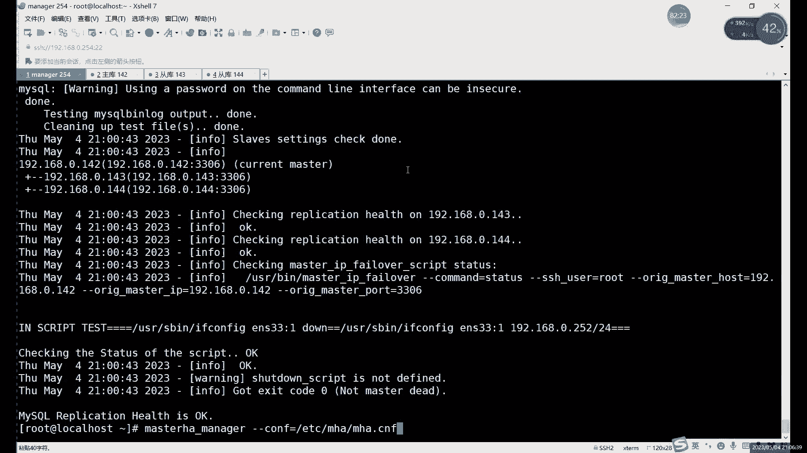

# 【小白入门必备】Linux运维进阶RHCSA+RHCE最全培训教程视频合集 - P88：中级运维-26.MHA高可用，视图-中 - 洋洋得IE - BV1nN4y1X7Go

还数据库的EIP。啊，注意主存一个问题就行了。然后呢，这个目录的话。如果是原码安装，就原码安装就用这个就可以啊，用这个就可以。剩下的没有什么太多需要改的啊，如果改完之后的话啊，就可以保证退出了啊。

保存退出之后呢，我们就可以。进行最后两步的配置啊，进行最后两步的。啊，最后三步吧。啊，还差最后三步啊，做完这三步的话，其实就可以了么就可以启动MHA了啊，启动MHA。啊。

我们接下来呢继续啊来说一下这个MHA呀，这个文件很关键。大家这个每一步就每一行都要检查好啊，哪一个出问题了，我们后边其都都都不能继续往下啊，都不能继续进行了。因为这个MH的运行的话，其实主要靠就是。

这些配置文件里面这些参数，因为每个参数它都都需要用的啊，基本上都要用的。像每一个。mysql的这个IP啊，对吧？IP端口号啊，目录啊。以及我们这些用户名密码是每个都能用的。

就这这里只要错了一个整体我们MHA的话，它就连不上。就如果说有一个数据库连不上的话，它这个环境。就不算完成啊，他就没办法完成。所以说的话这里每一每一行都要检查好，对吧？确定检查好没问题之后呢。

我们保存退出。接下来的话还是我刚才说了，还是那三步，对吧？还是那三步。那倒数第三步是什么呢？就是我们刚才说的，我们配置文件里面有一个脚本。

这是我们进行主动切换切换的脚本。就是谁呢？就是这个这里定义的是脚本的路径啊，大家注意这里定义的脚本的路径。这个路径的话可以改啊，就是你这里如果改了的话，你脚本存放位置就改一下啊。

这里的话这个像如果说你这里指定什么，直接用YM编辑就可以了啊，不用管它存不存在，不存在，就我们就创建了呗，对吧？啊，不需要管它存是否存在啊，然后我们这个配置文件啊，或者说这个脚本的话，其实。

里面内容的话，大家可以可以看一下，这个的话没没必要去记啊，这个小风险没必要去记。因为它其实是什么，它其实就用的是这个。和后边我们会讲的一个叫cap live的一个服务有关系啊。

和我们后边讲的cap live服务有关。但，其实和也和谁呢？也和这个VRP有关系。

啊，和非LRP协议也有关。Okay。这里的话我们先首先先编辑一下这个。啊，user下边幕下的。那文件叫什么来着？我看一下文件名字吧。

文件名字叫这个master杠IP杠非 feel over，对吧？

master杠IP杠fi。过。啊，这个文件我把它复制进来之后的话，我们也大家注意也是需要改点内容的。就是上面这部分。嗯，我们这里的话。其实MH的一个原理呢。

其实这里这个其实就已经涉及到我们后边会讲的一个也是高可用的一个软件啊，它的名字叫capep live啊，原理和它是一样的。就是我们会用到一个叫虚拟IP的东西。啊，虚拟IP啊。

或者有的叫法也一般也也也有有也有的叫什么叫漂移IP啊，都可以啊。有虚拟IP那这个IP的话。那这IP的作用是什么呢？就是大家可以看啊，就是我们如果正常你写这么1个IP的话。写了这个IP之后呢。

我们在脚本里面的话会执行什么呢？会执行这个。if用if copy命令去指定一个。临时的IP。啊，指定一个临时IP临时的IP的话就是我们这里定的这个。虚拟IP那个虚拟IP的作用是什么呢？😡，啊。

虚拟IP作呢其实就是。用户可以用来访问的。就是在我们这个MAJ的集群里面的话。它为什么能实现这个自动的主动切换呢？其实很简单，就是因为这个虚拟IP的作用。

包括我们后边讲到的这个后边也会讲的这个 live的高可用也是一样的原理。就是我们这个为什么用户就是为什么主库出现故障了，哎，用户的访问可以不受影响呢，原因就是在这里就是对于这个用户啊。

或者说对于其他的服务来说啊，这里说用户其实不太恰当。因为我们数据库肯定是不可能直接连用户的，我们的前边一定连的是什么？一定是连的是其他的像外部服务这些。比如说像这个NDign阿法奇这些。啊。

肯定连的连接的这些服务，那这些服务去连接我们数据库的时候，它其实1个IP是什么？他用的IP就是这个固定的IP。虽然说我们后边的数据库有3个，对吧？但是呢在外边就是在外人看来，或者说在其他服务看来呢。

其实我们就是1个IP。或者说什么，或者说是这个。看主库来说是1个IP啊不能说是整个数据库吧，因为整个数据库还包括同库嘛，对吧？他看主库来说的话，它其实就看的是1个IP。

就是永远是这个虚拟IP这个你写写写几都可以啊，写几可以。比如说我这里写个不要和其他几个冲突啊，嗯，写个0。252对吧？写这么1个IP就是在其他服务看来，或者可以说是在。😊，manag几点看来的话。

其实我们访问的这个主库呢，它的IP呢不是0点。1426我们现在主户是0。142，对吧？当然设置了你这个MHA或者设置了这个虚拟IP之后呢，对于我们其他外部来看的话，其实我们的数据库的主库IP永远是0。

252不变。那主控宕记了怎么办呢？我们进行主层切换。啊，进行主动切换，切换之后呢，会在新的主库上再次创建这么1个IP还是0。252。比我们正常用户访问或者其他服务区访问的话，IP不变。

解释过是确实是换了个数据库啊，但是呢我们在其他外部感觉上SC是没什么感觉的。就是你访问的IP呢，还正常访问嘛，对吧？还正常访问。IP没有变，对吧？访问内容也是一样的，对吧？

因为我们主要做了什么做了主动复制。啊，做到主动复制，房屋内容也一样，就是IP也没有变啊。对在外部看来的话，其实就是没有什么故障。但其实我们后台已经当了一台数据库了那这个就是主动切换的一个作用啊。

就是你模你在切换的时候，你IP不能变的。大家一定要注意啊，就是主动切换的时候呢，IP1定不能变IP你要变了的话，其实你其他的用户也好啊，其他的服务也好，你是访问会访问不到数据库的。

但是大家一定要注意这个IP一定不能变。😡，IP一旦变了的话。啊，IP一旦变了的话，其实像这里。哎，比如说你现在。啊，我们正在访问数据库，对吧？你外部一个连接，正在访问了数据库。你看我们访问的IP是0。

142，对吧？我们SS连接上了。

连接上之后的话，你突然宕机了，嗯，也就是0。142档了，对吧？啊，宕机之后呢，肯定就连不上了，对吧？连不上了。那这个时候呢，你新弄了一台主库，对吧？把一台重复变成了主库啊，0。143了，但是我不知道呀。

对吧？你主库是修好了，对吧？是暂时修好了一个主库，但是呢我不知道你的IP就没法连接。😊，那这样的话肯定主动复制就是主动切换的话，切是切了。但是呢用户在用户看来的话，你还是失败的。就是你这个。

你的这个数库还是宕机了，那这种情况下肯定是不对的对吧？那我们需要什么？就是不管说你怎么切换，IP永远不能变。那这个就只能靠什么，只能靠虚拟IP了。

这个就是虚拟IP的作用啊，还得提前给大家解释一下。因为后边我们还会用到虚拟IP的话，其实在这个高可用里面是非常重要的。就是基本上高口用的这个软件都需要用到虚拟IP啊，就主要是为了确表在切换的时候呢。

IT是不会变的。就是你不管说你后边哎数据库也好啊，其他的服务也好啊。😊，不管说宕机档了多少个。你的IP永远就是那一个。就现在对外提供的服务那个。数据库也好啊，其他的服务器也好啊，IP的话永远是这个0。

252啊，这个就是其实就很简单，它其实就是。在主库上呢执行了这么一条这个一传费的命令。然后呢给这个我们对应的网卡呢赋予这个IP就行了。啊，赋有IP就可以。然后这里大家需要注意的就是需要改什么呢？就是。

这个IP呢不要和你的IP冲突就行啊，不要和你的IP冲突。然后第二呢就是这里。网卡啊网卡。网卡的IP的话。嗯，就写修改成e考位命令的话，这个其实之前也没之前不知道讲过没有，应该没没怎么没怎么说过吧。

依付考位命令是可以临时指定IP的。啊，指定一个临时IP。啊，这个的话其实只只需要指定临时就可以，不用写永久的对吧？显示永久的还要改回来太麻烦啊，你只接要写一个临时的就可以。主库修好之后的话。

你就不就又没了嘛，对吧？所以说只需要写一个临时IP。这里的话就是把这个1233的话，就改成你自己的那个物理网卡名字就行了。这个的话你不同的服务器可能叫法都不一样。对吧1233123432啊。

还有ENO啊ETH啊这几种就是你的网卡物理网卡叫什么，就写什么就行了。啊，这里改完之后的话就可以保存退出啊，IP注要注意，不要冲突就行啊，这是倒数第三步啊，倒数第三步就是我们的主动。

进行掉故障切换的一个脚本。啊，后边最后两步是干什么呢？最后两步就是用来测试的。

测试我们的MAC的环境是否正常。怎么测试测试呢？用的就是我们MAC的一个命令。MHA的check啊，REreplication和che和SSH这两个命令啊，当然呢还要记得给一下这个脚本执行权限啊。

这个刚才没有给。

一定要给啊，如果没有执行执行权限的话，这脚本跟没有没什么区别啊，一定要给执行权限。master杠IP不 over啊，别个均行权限。转完之后呢，接下来就是测试我们的环境啊，我们环境其实分为两部分。

一部分呢就是免密登录的环境，一部分呢是主动复制的环境。

这两个环境的话都需要测试都需要这个测试一下，就是测试一下环境是否正常。这两个命令全部执行没问题了，我们才能正常启动。MH啊，如果说一个其中一个有问题的话，其实我们MH没办法自己做的。啊。

所以说一定要注意这。首先的话我们先可以测一个简单的就测试这个免密登录，对吧？因为免密登录其实我们做的话就就一条就几条命令而已。remasterHA然后加什么checkSSH后边加什么呢？后边大家注意啊。

这个杠杠com等于什么？就是我们刚才创建那个配置文件。他这个检测靠的是什么呢？他检具体检测些什么呢？就是我们刚才配置文件写的那些内容，就是他需要检测的。啊。

这里的话我们就用什么就用这个杠杠com等于什么去指定一个哎随证去指定1个MH的这个配置文件就行了。这个你文件写文件名字是什么，你这里就写什么就可以。啊，然这就是检测SH的免密登录的。如果说。

这个这一步出现报错的话，这个这个其实这步报错其实没什么，这个部位报错其实很好处理。他一般就会报你哪个到哪个的免密有问题，你重新做一下门密就行了啊，重新做一下明明就可以。

大家可以来可以来看一下，只要没有那个everor，其实就是正常的啊，没有 erroror就可以。然后这里的话啊第一步的话，它其实就是只是报了一个我们的配置文件的问题啊。因为没有默认配置文件呢。

它叫MHA masterster HA杠defa点CNF很长，对吧？我们就写了个短的，就MHA点CNF这个不影响啊，这个不影响。然后这里最后只要没有ever看到一个所有的SS连接测试呢都是通过了。

都是成功了啊，就说明怎么说明我们免名登录成功了，还可以看到他们的我们测试过程，它包括测了谁的测142到143的142到144的。143到142的之间，他们的每一个的测试都要都做了一下这个连接的测试。啊。

都做了一下SSD明明的连接。这个没问题之后呢，我们接下来测下一个。你如果报错的话，你就重新做一下名域就可以。这步报错其实很好处理啊。啊，大家注意一下这个就行。如果是这一步有报错啊。

只要最后不是显示这个就说明肯定有错了。你就中间看一下它会提示是哪个IP。因为这里大家可以看到它测试的每一步IP都写在这里。你看你就测试这个OK对吧OK就成功了。如果说不是OK的话。

那他就会报具体写哪两唉哪两个IP的免密有问题，你就可以去重新做一下就行了。重新做一下测试，只要通过就可以继续下一步了。啊，下一步就是比较关键的一步啊。这一步呢怎么说呢？

可能大家可能会经常出现大部分报错的话，就是MH的报错，大部分在这这一步这步为什么会报错呢？也不一定呢？不一定是大家主从做的有问题，主从一般没什么问题，对吧？其实我们主从已经做了很多次了。

你看第一次讲首同，对吧？后边讲的这些。主虫从啊、双主啊，以及这个毒解分离啊，MHA啊都用到主铜了。这主从我相信大家应该应该不会再错了，对吧？主铜我相信大家也不会再错了。但真的这一步报错呢。啊。

会涉及到哪个问题，就是。这里就会涉及到一点这个关于。MHA和mysco稍微有点。就它的文件上啊，也不是说这两个软件冲突是有两个依赖关系稍微有一点问题啊，有两个依赖关系稍微有一点冲突。

就是那个啊梅2DB杠las那个。那里不是我们之前卸载过嘛，对吧？那里我们之前是卸载过那个依赖关系的那这里其实是会有会出现冲突的。如果说有报错的话，其实就是依赖关系的问题。啊，缺少了这个。

与MH这边缺缺定依赖关系，但是。一般情况下正常的话。倒还好，大家一定要注意，就是分开去装啊，分开去安装。就是。虽然说呢刚才是说了这个。managage节点可以装在数据库里，但是不建议啊。

因为装在数据库里边嗯数据库。主在数据库装在数据库里面倒然也不致命。但是呢这个。数据库的重启可能会有点问题。啊，因为数据库的重启的话，之前就是大家最开始装myscle的时候，应该都报过那个叫重启的时候。

有那个scket文件，对吧？那个问题那个问题那个问题的话。一般其实就是那个V2DB杠 life没有卸载，对吧？但是你卸载了之后呢啊你这个这家伙就装不上了。啊，卸载之后呢，这个MAT又装不上。

所以说呢在这个文件上稍微有点冲突，它知道也可以装在一起，装在一起的话，就是数据库你就别再想重启了。想重启数据库的话，你就要卸载这个文案机地方labs。啊，想用MAC的话，你就你要还要再安装回来。

但这个软件安装很简单，就几秒的事，那你就这么来回试很麻烦，所以说不太建议安装在一块。就这个文件上稍微有一点冲突啊，所以说呢建议大家把这个minnet几点装在没有数据库的服务器上，就不要有数据库。

哪怕你装在像什么呢？你可以装在那个。呃，ammiber啊 myad这个代理服务器呢也行，不影响的，可以装在这个代理服务器上。啊，就可以把这个毒解分离啊，就就是MAC的当们这个。俩软件都装在一起啊。

其实它俩都不需要数据库，就可以正好装在一起嘛啊正好装在一起。我可以来检测一下吧。如果有报错的话，就是。啊，用数。啊，这里是个报错是什么呢？这个报错是大家注意啊，大家如果要看到这个报错呢。

嗯回去需要做一些什么，做一些软链接。嗯，因为我们前面其实正常执行mys命令，就是安装myse的时候，其实没有做软连接，对吧？为什么没有做呢？我们当时做了这个环境变量，做了环境变量的话。

其实可以不做软连接也行，就可以直接执行命令。但是呢他这里呢没有这个。软链接呢他又找不到命令，他要找哪个命令，大家可以看他他报的错施买4个bin dog没有文件和目录，他其实是找不到这个这个命令。

又找不到我们的买这个bin，他这个命令是干什么用的呢？对吧？之前我们其实。😡，做这个备份的时候也讲过这个秘密，对吧？查看我们的二进制文件的。啊，因为我们这个主动切换的话，它一定要涉及到要看啊。

因为这个涉及到这个切换的话，其实涉及到这个二进制文件嘛。所以说呢我们需要这个mys log以及谁呢？以及mycircle这两个命令啊，我看一下这个在。他报错是0。1。0。1是几张来着？啊，0。

143上报的错，对吧？这里的话其实我们可以多做几个。

话介入到所有绘画，然后把这个关联，我们后边三台可以一起做这个。其着做1个LN杠S，然后呢，user下的logo下的my circlercle里边的丁录下的my circlecle。

以先做所有吧啊做下所有。所有们所有这个命密。

啊，全部做个软链接就行。啊，这软就可以。然后我们再测试一下，它这里就是小微软链接。

没有软链接的话，它找不到命令，没有文件目录，其实就是找不到命令的意。那我们再执行一下这个check replication这这个检测一些主从这里。从这里头呢，其实首先第一个它是检测的什么？

检测的是这个主从的一个状态。第二呢其实就是检测什么呢？第二其实就是检测这个。啊，能否正常执行这个。当然他这部其实也包括什么？也包括呢SSH了。大家去看。这部的检测内容也比较多。

那像比如说它这里连接了什么，连接了3台数据库，142143144，对吧？连接上三个之三个之后呢，又看分别看了他们三个日志。然后呢，下边的话检测的什么？检测的就是reification的这个设计。

就是主动设置。设置的话，后边检测内容也比较多啊，大家啊在这里检测最后完成的话，在这儿。就这我们状态正常。啊，检测143和144的这个主通连接。啊，检测没问题了。啊，小次没问题的话。

他就一个执行怎么执行这个。最后的话他返回的信息就是OK对吧？啊，返回信息就是OK的。然后这里的话最后主要返回的是myoc education，然后heth也OK就可以。

啊，这里主要是在安装数据库的时候，我没有做这种链接的问题。嗯，这个服如果正常一个服务的话，其实你做好之后呢。啊，选择的话一般就是。可以选择去做这个环境变量，就是把服务写到环境变量里面，这是其中一种。

另一种的话就是做这个软连接。啊，其实这两种的话主要的目的就是为了能够在系统里面的任何地方去执行我们的。服务的命令对吧？啊，只要做其中一个就可以。我们当时是选我当时做了这个环境变量，所以说没做软链接。哎。

但就是这个MAT这里它。他不吃环境面这一套，他要的是软链接啊，我们要做个软链接就可以。

啊，最后两个都OK了，对吧？这两个状态都OK了。啊，算了不找了。那个SSH的话，其实这里头它其实也做了SSH检测，大家可以看一下。😊，他这个也奏了，S是这里减奏了。啊，这里的话OK就没问题啊。

就可以什么可以正常启动我们的MAC啊这个软件。

启动的话，这里的步骤呢其实很简单，就是。一个命。啊，就是哪儿呢？就是这个。另你哪去了？在这儿。MACazHA然后man。然后后边加上我们后边加上这个配置文件就可以啊。

加上我们配置文件就可以启动我们的服务啊启动服务。我们现在可以来看一下这个。

比如说现在呢我们来看一下我们这个IP对吧，看一下IP的配置吧。好，大家可以看到啊。我们在做检测的时候呢，它其实就已经提前给我们还做了一个什么呢？已经给我提前买好这个IP了。大家看到这个IP没有？

这个就是我们刚才在。😊，我们的那个脚本里面指定的IP。啊，刚才在我们检测的时候，他其实已经用这个脚本啊，就已经用脚本去检测了。

嗯。0。252对吧？他已经把这个IP写在这儿了。然后你大家可以看到其他后边两台吧，看下后边两台。😡。

后面台就正常是自己IP对吧？0。143。这个呢是144。没有其他多余IP对吧？就是主库这里呢多了一个。那这个就是我们这个主从切换或者故障切换的一个关键的地方，就是虚拟IP。也就是我们其实用户让用户。

如果说你做了这个虚拟IP的话，用户访问呢你就不要。不要去设置这个真实IP去访问了，因为什么？因为如果出现了故障，你访问真实IP的话就访问不到了，对吧？但是呢如果说你设置成这个虚拟IP。

就是让用户访问的始终是访问虚拟IP的话。那目前现在访问0。252访问的其实是谁呢？它真正的IP其实是142这台，对吧？就是主库没问题，对吧？如果这出现了故障，那么我们这个虚拟IP呢，这台断开连接之后呢。

我们这个maner节点呢会把这个虚拟IP给去掉。你会把这个虚拟IP关掉，然后呢。在新的主库上再执行一次e命令，再创建一下这个虚拟IP创建在新的主库上。然后呢，用户呢依然连的还是0。252，对吧？还是0。

0。252。但其实已经换了一台字据库了，但是呢不重要，对吧？在用户看来的话，IP始终是一样的。最多最多的就是可能会出现一点。卡顿其实也不至于，因为什么呢？因为其实。你正常访问的话。

除非就是你正在执行命令啊，正在跑命令断了一下，那个时候可能会出现点反应。如果说你正在正在连接上没有执行命令的话，其实你是没有任何感觉的。啊，其实是没什么感觉的。啊。

这个就是这个就是我们过量千换之类的一个关键点，就是这个虚拟IP。用户也好，其他服务也好，连接的都是用虚拟IP。啊，他不会直接连连智审IP，因为连上这台IP当然也可以，对吧？连下这台IP当然可以用。

但是在如果说它出现故障了。你即使完成了主动的切换，切到了0。143这台，对吧？那你呢嗯对于用户来说，或者对于其他服务来说，你都都得让他们去换一个房的IP，对吧？这其实就更麻烦了。哎，对吧？

所以说这个这个这个就是我们这这故障相换的一个主要作用。也就是虚年IP的一个作用，就是让在用户看来或者在其他服务看来呢，数据库的IP永远是不变的，就是那个零年比数据库主库的IP永远不变，都是零年哎。

零点这个。😊，14呃0。252对吧？那这个就是虚拟IP的一个作用。

然后现在的话我们可以启动一下这个。我们的MAC这个软服务啊启动这个服务。

行服务之后呢，大家可以看到它这里就会报露这个信息，就是啊首先它读取了这个配置文件里面默认的一些配置，对吧？就是从这ETCR的，就是我们指定是哪个文件，它就会从哪个文件里去读取。啊。

然后上面第一行这里的话，其实就是啊如果说这个全局的配置，这个是它默认的一个配置文件啊，这没太长。所以说当然你如果说想用这个文件单也可以啊，也是可以的。然后这里的话我们看一下这个。嗯，读取配置之后呢。

它这里呢大家注意啊，那它这里其实就相当于它是一个占用终单的状态。啊，他就占用了这个终端了。当然这里的话，你其实也可以么。你可以挂后台运行，对吧？这个其实都可以啊，都可以。这样放在前放在前面的话。

我们其实可以随时能看到一些消息。就比如说我一会做主动切换的时候，我们可以在正好可以盯着这里看消息啊，可以看这个MH的消息，我们这里就不挂后台了，就让它在前台运行，好吧，基样它在前台运行。

而这里的话我们正常主从现在是没问题的对吧？主从没问题。

啊，我们可以可以稍微验证一下啊，之前做好之后没有验证啊，对吧？比如说我们我看一下有哪些库吧，现在。啊没有库对，没有库就创建一个。嗯。创建好库之后呢，受DATABSE。对吧这边也已经同步到了。

这边呢啊也没问题，对吧？哎，数据库都同步到了。那我么接下来干什么呢？接下来的话其实就。可以怎么可以模拟故障啊可以模拟故障。现在正常我们的主从是正常的对吧？然后呢这个。manager其实也也启动了啊。

它一直在这里运行，对吧？服务正在运行。这千万不要打断啊，这里如果看出打断的话，这服务就暂时就断开了，断开的话它就起不到监控的作用啊，所以说这里这里的话一定要让它正常启动啊，正常启动。😊，让它先启动着。

我们这里呢可以看一下什么呢？啊，比如说呢。我们现在就可以把其中一台，最主要还是装关主库吧，用关主库，我们先退出数据库吧。因为我们一会儿要看这个关于IP的问题啊，首以到现在它是主库，对吧？

我们进行主动切换的话，其实就是当它发生故障的时候呢，后边存复怎么去处理，哎，怎么去解决？我们现在呢直接把这个模拟的话，我们直接就模拟它关掉就行。啊，你你当然也可以什么可以直接把虚拟机关了也行啊，也可以。

都是一样效果。啊，把虚拟关机关理也好啊，把数据库管理也好，都是能起到这个起这个模拟故障的效果的。这里比如说我们把这个。把这个数据库给它关掉啊，把这个输库关掉。关掉之后呢。

我们就可以我们哎不是i word东么是。嗯，我们关一下my circlego吧，然后呢我们这里一关的话，我们直接就来看到这边来看一下它的一个消息，好吧。我们直接回车，然后切到这边来看。

大家可以看到往那边一关，它这里就是什么？它这里开始什么连接不到了。😡。

你把他这里报了一个什么呢？😡，它就直接就断开了啊，断开了，然后呢，连接了谁呢？哎，这里的IP它没怎么细写呀。

我们这里可以来直接看这边吧，直接看这边。If抗飞的命令。对吧去年挺已经过来。😡，大概有几秒时间吧。你这边断开的话，就显示这些信息的话，其实就就基本不到5秒嘛，对吧？不到5秒时间就已经完全切换了。啊。

已经完成了切换了。

现在正常访问的话，比如说我们访问谁呢？比如说访问一个王龙的主库吧。马特甘右杠P1。讨问谁呢？192。168。0。252吧。对可以直接访问，然后soDATABSDS。是吧可以正常访问啊。

这个就是我们这个就是我们现在主户。也如我们这个0。252呢，其实你不管说。原来是在这台上，对吧？刚才的我们主库没关之前呢，它的IP在这儿关了之后呢，我们这边基本上5秒之内基本上就完成了转换，对吧？

主动切换基本码上又切到这边了。😡，对吧切到这边之后呢，你看就是IP就直接过来，虚拟IP直接就放到他这儿。😊，然后这边的话我们就可以了嘛，ID然可以通过这个虚拟IP来连接冷库。然后我们可以再看一个。

比如我们先退出来啊，EXIT。看一个静他，我们本地这台144的IP吧，百度杠Uroot杠P12321啊19。然后呢，我们可以连一下my circle，哎，不对。So。你们受什么呢？我们不看数据啊。

数据肯定是同步好了。我们看那什么吧，我们看。那叫志红。对吧之前我们主同是对吧，他俩都是连他的。包括我们都可以在这台上也看一下。哎，比如说你说有s slaveve。SK a u。没有了空了啊。

大家可注意啊，这里我们设st它这里就空了。为什么空了呢？因为它现在呢已经不是什么了，已经不是重复了。啊，大家注意，如果说你是。如果你执行了top类命令的话，就关闭主存之后呢，它其实就不是重复的。

不是重复的话，它也就显会显示空制。啊，会也是空值。在我们这里的话，其实这个空值呢。其实就是什么？其实就是他现在已其实已经什么已经作为一个主库存在啊，他现在其实已经作为一个主库存在。

所以说现在呢如果说我们想要看一下这个什么呢？看一下这个主动状态的话，我们得从第二台上看，有144的给大家去看，我们执行一下。放到上面对吧？那艾瑞这里没有报错。啊，没有报错，我们换到上面两个y。

就主从正在正常。然后大家去看我们这个上面前信息。详细信息master host。就是我们主库的IP0。143。这个IP代表什么呢？这个IP它其就对吧？就不用我多说了嘛，主库现在就是它了啊。

它现在就是主库。😡，啊，你现在其实我们已经日常完成一个怎动切换，非常快，对吧？我们什么都没有干，我就是关了它之后。😡。

就几秒钟，哎，他这里就定程结束了，为什么定程结束了？因为。其他服务就是已经有一台出现故障，我们完成切换之后呢。没办法继续进行这个MHA了，为什么呢？因为刚才说了MHA的这个至少要求是一组两层，对吧？

一组两重。我们断掉一台之后呢，它这个MHA就已经结束了，就是它这个服务已经挂掉了。就是他最后完成了一次切换之后，就相当于完成了他的使命。啊，完成他的使名之后就已经挂了。啊，因为现在主从已经不完整。

就剩那一组一从嘛，但是他最后他是完成主动切换之后呢，他是把自己关掉的啊，他最后是把自己给关了。因为一主一从他是没办法做这个的啊，相当于没办法做的。可以共存啊，主从组解分离。我刚才不是说了嘛。

你可以把这个。MHA装到哪儿呢？装到这个。那个像met也好啊，meber也好啊，这些这个。读写分离的代理服务器上啊，可以装在他们上面。这样的话能节省一台能节省一个什么节省一个服务器，对吧？节省一服务器。

如果说把这个MAC装就是man装一个服务器，对吧？啊，或者装台虚拟机里边，如果那个那个叫什么来着？读解分离那个代理服务器也再装一台，那有点浪费了啊，不管说你服务器也好，还是迅捷也好，都是有点浪费的。

因为他们的主要作用就是一个是啊转化请求，对吧？一个转化请求，一个是做一个。嗯，一个主通的一个故障切换。对吧尤其像这个故障切换，如果说主库不发生故障啊，你这个故障切换实际是一点用都没有，对吧？

它其实就是完全它就是开了一个进程，就开了一个小的进程而已，不会占用太多资源。所以说呢你可以把什么可以把这俩服务都装在一块儿，哎，装到一台上。😡，啊，这后一台钟是没问题吧。然后这里的话我们可以看一下。

正常的话。比如说我们在这台上执行一个再创建一个。Create DATA VSE。XA。啊，我们随便写一个，我们这边再来看受。Database这块它又创建了一个啊，也这边主动是没问题的啊，这边主动是正常。

啊，这个就是什么？这个就是我们的MHA的一个互障切换呃，速度很快啊。一般介绍里面是吧，0到30秒对吧？这这个。0到30秒，它也不会到30张。一般。刚才我说10秒，它它就有点长了。

刚才其实我们差不多5秒5秒之内它就已经完成接换。啊，5秒就完成减换了。所以说这个其实啊非常快啊非常快。😊，但你一定要注意啊，就是大家在做的时候呢。注意这个注意这边的问题啊。啊。

然后这里的话其实这MHA已经挂掉了啊，你暂时现在的话MH已经没用了啊，现在的话这个服务已经暂时已经不能用了啊，只是暂时不能用啊。对，共同的话就是读解分离和故障相换这都有了吧啊都有了。Yeah。

然后如果说要共存的话，大家注意一个就是那个我们读解分类里边不是指定过那个叫。主库同库对吧？主库同库我们都只念IP了，对吧？如果说要做这个。嗯，要做这两个的话，一定要注意。

就是毒液分离的那个主库IP要写成什么，大家知道吗？

啊，你不能写142，也不能写143144就行。你得写谁呢？你得写0。252。😡，你那写这个。这个叫。虚拟IP。因为它才是针对主库的1个IP。因为如果说你发生故障的话，原有的主库的IP是保问不到的。

也就是你读写分离也就也就废了。如果说你读写分离里面写这个IP的话，你写这个其已经废了。😡，对吧所以说一定要写这个虚拟IT的虚拟I的。😊，然后去年IP之后呢，你读写分离的话，其实。再当于主库还在对吧？

主库还依然能访问到，哎，从库也能访控到。那你这个集群正常还可以正常运转。一旦你这个虚拟IP写，就是你这个读写分离里面IP一旦写成真实IP就主库IP啊，从库你当然写真实的可以。

主库这里呢一定要写这个虚拟IP啊，注意这个就行。😊，不然你切换的话，不然你这个做做这个故障切换也没什么意义啊，没什么意义。这个的话是什么？这个就是我们的MAC这里啊，这里的话。如果说它重新启动。

就是我们主播重新启动，它能不能正常加一加入加入集群呢？不行啊，MHA没这个功能啊，MHA得我们手动去操作啊，MHA没这个功能，就是你正常加入集群之后，因为现在呢MHA已经挂掉了，这个服务已经挂了。啊。

因为这个服务呢服务运行这个服务运行的环境它的要求是什么？要求我刚才说了，就是一途两重正常运行两个测试，就SSA测试和主从测试都O。才能运行这个服务。就是你如果挂了一台的话，你修好之后呢。

你这个服务暂时还不能用，你得再去改一下配置文件，你再重新再改一遍配置文件才行啊。这个当然是它的一个缺点，优点是优点就是。切换时针切换速度时确实是快啊，切换速度确实快。

啊，这个的话就是我们的这个。MAC这里的问题啊MAC这里问。

然后呢，这个。这里的话其实我们刚才是用了，刚才说了是这个IP是是叫虚拟IP，对吧？这个我们后面还会还会说到啊这个。

去年IP呢很重要，就是所有的高可用服务都会用的。包括我们后边会讲到那些网站，对吧？外部服务。像ND3应该也都多少都听说过，对吧？ind像indD也好，阿玛奇也好，这些的话其实。只要是服务呢。

其实都会涉及到这个关于单点故障的问题。啊，除非你这个业务不太重要，对吧？除非业务不重要，那就不说了。只要是业务是真正的跑业务啊，是是挣钱的业务，花钱是挣钱的业务。其实都是比较重要的对吧？

挣钱的业务都很重要，就都需要什么，都需要考虑单点故障的问题。如果只是一些宣传作用的话，其实就无所谓了。宣传作用的话，你不挣钱的这个不直接挣钱的这个业务的话，其实。

单点故障呢其实也没必要让外服务器做这个预防单点故障。另为一般预防单点故障其实就是在关键地方像这个。网站上面对吧？像网站里面也好，还有像这个数据库里也好。还在。关键业务上的话。

其实都需要考虑单点故障的问题。嗯，这里的话后边我们还会说这个像。t live也就是MH就是和MHA是一样的。嗯，用的是一样的。用的是一样的原理吧，其实都用的是这个VRP原理啊，VRP的原理。

这其实如果是大家如果学过这个网络那边的课程的话，其实也知道就VRP。只要和他其实是一样。啊，和T其实是类似的类似的一个原理啊。啊，对，这里肯定是需要手动公布数据。为什么？因为这个大家可以看。

就是如果你这条这条这台主库挂掉之后呢，它成为了新的主库，对吧？它还要正常跑数据，对吧？跑业务，他这边写入了一些新的数据之后的啊，这边也跟着一起同步，对吧？他两个数据是正常。他如果修好之后重新加进来的话。

它数据肯定是少很多的对吧？甚至少很多的话，他就暂时肯定是不能做主库了啊，他最多还是他也是需要什么，需要。😊，你重新做一下这个就是。也相当于是。最好是同步一些数据，就用这个导入导出的方式同步数据。

主同同步数据已经是已经可能来不及了，为什么呢？因为如果说涉及到。哎，如果说有一些新的表格，或者说新有一些新的库的话。做主从是同步不了的啊，主从同步大家注意就是它的前提就是第一就是。尽量保持数据的一致。

啊，最最起码也要保证我们的数据库啊、表格啊，这些基本的东西都要都要一样一致才行。如果说这里。嗯，在故障期间呢，这里如果说代凡创建了一个新的表格的啊，插入了一个啊创建了创建库倒一般不会啊。

但是如果说创建了一个新的表格的话。这个新的表格你单纯做主从，你是无法同步的。因为它这里本身没有那个表格的信息啊，这个也就是我们之前最开始讲主从的时候，主从一个前提条件就是原始数据叫商红。所以说这里的话。

你重新加入进来的，这个确实。只能讲么就是手动的。导入导出。啊，这个的话其实。如果说它作为一个新的重复来讲的话，其实呢。问题也不会很大，其实也不需要不需要一定要停这个，对吧？我们的那个什么。买收购冻。

大家还记得买sod，我们导出的命令。这个命令里。我们用的其实就是什么？我们用的其实就是热备份的方式嘛，对我们用的热备份方式，其实主要就是主要主动复制。它主要考虑的还是这个表格的问题。啊。

主要考虑还是表格的问题就是。如果说业务重的话，你可就这个重复还真不能停啊，最多只能是通过这备份方式呢，把这个啊如果是出现了一些新的表格的话，把表格备送过去之后呢。至少是能同步数据了，就是只要表格和这个。

嗯，数据库一致的话，基本上还是能正常同步数据的正常同步数据其实其实还是可以的。但是呢这个刚挂掉的这个存库呢，就是暂时呢不能作为新的这个主库了。因为它里边数据肯定是没有没有这个这边正常的一个完整的啊。

没有这边数据那么完整。所以说呢。一般情况下呢，如果说这个新出现故障的一个主库，一般我们就不会。暂时呢就是只能将它作为重户来用，就暂时只能作为重户来用。啊，这个的话就是我们这个就是我们这个。

MH这边内容MH这边内容。然后下边的话我们接下来呢。

呃，买思这边还剩下什么？还剩下一个叫。还有一个内容就是MH之后的视图啊，还有一个内容是视图。啊，这个视图的话。嗯，怎么说呢？这个是一个比较也就是买思里言一个比较好用的功能吧啊一个比较好用的功能。

这个视图呢其实简单来说呢就是一个快捷方式。啊，不是类似于快捷方式的一个功能吧，它其实和快捷方式也不一样啊，不完全一样。啊，就是类似于快捷方式，它其中有一个功能其实是和快捷方式一样的啊。

不能说所有的都一样啊，不能说所有的都一样。这里的话我们这个视图的话。嗯。视图的这个特点的话，就是首先。视图呢你可以看成一个什么，看成一个虚拟的表格吧。啊，还有这这类表格。这里这个买se的视图呢。

其实本质上呢其实就是一个cicle语句。呃，更准确来说的话，其实主要还是sck。视图呢在这个mysql里边，其实就是。两个功能吧，一个功能就是作为快捷方式来用。嗯，视图的一般用在什么地方？

就比如说像这个。一些比较。长的一些查询的语句吧啊，它更多的主要还是跟这个side语机一起用。啊，其实这个视图呢其实就是简单来说就是这个s语句。或者说是可以说是给sliide局做了一个快捷方式了。

因为像我们之前不知道大家记不记之前查询的时候，此外语就之前我们讲查询的时候呢，包括这个。你多表查询也好，对吧？像这个欠套查询也好。有单词一条查询句呢。基本上一两行不一定能写完，对吧？

一两行真不一定能写完。就如果说出现了这种比较长的这种s句呢。啊，而且如果说还得要经常经常要用。那这种情况下，一般就是我们需要用到这个视图。啊，就比如说你每次那么长的一语句啊，你不管说你找去复制也好啊。

还是手敲也好，其实都比较浪费时间。对复制的话，你还得要找到找到这个视图，具体用哪条命令，不找到这个你要看这个东西，具体用哪条命令，你还要去找对吧？不如什么，不如就是创建一个就给一个比较长的。

比如说两行三行的一个。sag语句创建一个快捷方式啊，每次想用的时候，直接使用这个快捷方式就可以。啊，这是这个是视图的一个主要作用。然后视图的话，它其实就是可以看成个虚拟的表格。啊，可以看成虚拟的表格。

类似于什么呢？就类似于这个。像这里。嗯，新建一个表其实有点什么。如果说你。这个表格里面数据特别多的情况下呢，其实新建一表有点浪费空间。啊，我们这个视图的话，它不太基本上不基本上不占用我们的存储空间。啊。

它就占用一点点，它又占用一个定义快捷方式的一个空间。它不它不是真正的数据。比如视图的话，它不是真正数，就比如说像这个。像这个我们的数据库里面有这个表格吗？其实没有。其实没有这个表格。

这个其实都不算就是什么表格，对吧？但是我们看起来正常我们执行命令的话，对吧？它其实就是什么？就是一个以表格的形式来显示嘛。对吧现在的话我看一下，我把之前那两个。

把之前那两个我们用的ss表再找一下吧，找一下那两个表。那这俩表在哪来着？啊，在这儿。嗯。对，就这两个表。我这再重新插入一下，因为我回复快照了，之前数据没了。

Okay。边总还报数了。

Yeah。哎呀这个报错。愿。

Yeah。

二 PMM杠安。RM杠1。

买师。一般这个报错就是你看看到这个如果报错里面有这个关联manDB的话。你把这个门DB就刚个文件删一下就行。啊，正常启动之后的话，我们进到数据库里，我们把这两个表格再。

创建一下。看电影。

啊，它的作用的话其实就是类似保存一个查询结果啊，它的类其实作用就是保存一个查询结果。但这个查询结果呢，它不一定是它不是固它不是固定的啊，它不是固定，它只是保存了个查询语句啊。

保存结果这个说法其实是也不准确，它只是保存了一个语句。就如果说你数据里面发生了变化，那你这个视图或者你的快捷方式呢也会跟着一起变。啊，也会跟着一起变。看一下。great啊，大家可以下课休息几分钟。

我们这里有人回来的话，继续来说一下这个。视图这个内容啊，create database my circle。大嗰啲。是不是已经有了？我刚才已经创建了是吧？

啊，其实也创建一个两个，其实都可以。

你主要就是演示一下这个视图的一个作用啊，演示一下视图的一个作用。

嗯啊现在这两个表格，我们一会儿来看一下啊，一会儿具体来看一下。嗯。我们这两个表格创建好之后呢，我们接下来呢就具体来看一下这个视图啊，首先的话。我们先随便查找一个，先随便查一个吧。嗯，就。简单查一下。

像slaing from。嗯，那这样查的话。也行啊，就这样查吧啊，星 from student。sdent加上class，我们两个表一起啊两个表一起。plus的它的名字叫。

students里面那个叫class。杠ID对吧？classs表格里面就是点ID。啊，有这这两个相等，我们随便先查一下，对吧？比如说呢我们就把这个就拿这个表格来说。这个表格呢。啊，或者这个结果吧。

我们这个结果它是一个表格的形式来显示的对吧？这个没问题，对不对啊？它以一个表格的结果结果来显示。但其实我们数据库里面是没有这个表格的，它只是从我们这个sdents表格和class两个表格里边啊。

相当于把这两个表格的东西啊内容过滤了一下。

啊，或者说呢加了一个我们加了一个限制条件，我们重新过滤了一下，产生了这么一个新的结果。那这个结果呢我们其实数据库里面没有这个表啊，我们这只是一个查询结果。那视图的作用呢其实就是用来保存这个结果。当然呢。

它并不是来保存这个表格的这些内容，它保存的是这个东西，就是保存的是我们查询这个语句。也就是我们这个跟表格里面数据无关，就是你表格里面再添加其他的同学信息啊，再添加新的班级啊，不影响。

就是它会根着我们原表的数据的改变而改变。啊，这也是视图一个特点，其实就相当于什么？相当于一个软链接嘛，快捷方式对吧？啊，就是你的原来内容怎么变呢？我们内容也跟怎么变。

那这个快捷方式的好处就是你的这个丝外引距其实越长，它越有优势，对吧？其实我们这里也很短，对吧？就就就半行而已。就这么短的一个语句，比如说我们可以把它写成什么，写成一个。嗯。

比如我们随便起个名字吧啊随便起个名字，比如让他叫什么，比如说他叫这个。起个什么名字好呢？最还是简单点，对吧？反正起太长了也不太好记，对吧？比如说create。啊，VIEWV呢就是视图的意思啊。

will就是视图的单词啊，creit table和create tablecview是一样的对吧？但是创建视图的时候呢不太一样，就是创建命运不太一样。创建视图。比如说我们创建一个看像这个内容的话。

我们就学生信息嘛，对吧？学生信息。学生信息。信息info对吧？创建一个就叫他idn't。In放。为简单拼拼用两个学生信息嘛，对吧？学士信息学生信息表对吧？as as后边我们加的就是定义这个具体的这个。

slalash语句。哎，这就是什么？这就是最简单的视图的用法，就是将一个slash语句呢作做一个快捷方式，那快捷方式的名字就叫student inform。当然这里写的也比较长。

你如果说啊相写短一点其实也可以，这个没有什么太多限制啊，没什么太多限制。😊，对吧这就是创建了一个什么？创建了一个最简单的视图。那创建好这个视图之后呢，则视图怎么去使用，哎，怎么用呢？啊？

你刚创建好没有用呀，对吧？你具体你得用对吧？你己得用这快捷方式。快捷方式怎么用呢？就是直接把它作为一个表格来用。啊，就是你创建好之后呢，它就类似于什么？类似于一个表格了。啊，类似于一个表格。

比如说呢我们现在直接回车啊回车。W。啊，ID冲突了。还不能直接不能创建。直接创建还不对嗯。为什么不能直接创建呢？因为我们这里。哎，这个。重复的这个名字还比较多，ID重突了，对吧？ID重突了。

大家可以看啊，咦为什么不能创建呢？因为它和一个基本表格其实是一样的特性。就是你看我们这IDID重突了，内容内重突了。还得改一下这个。

