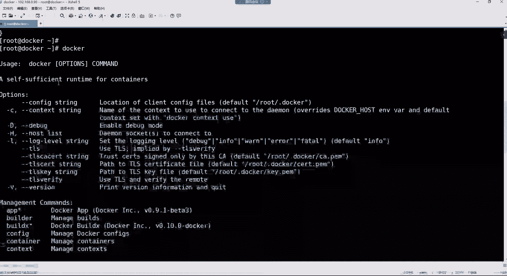
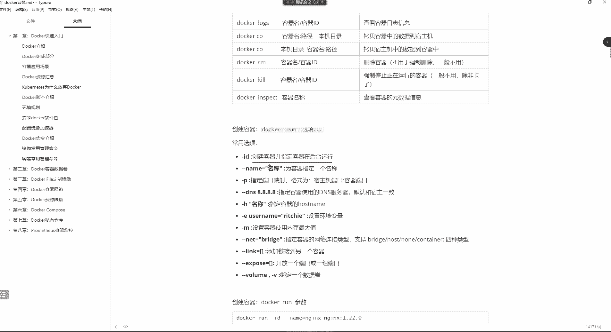
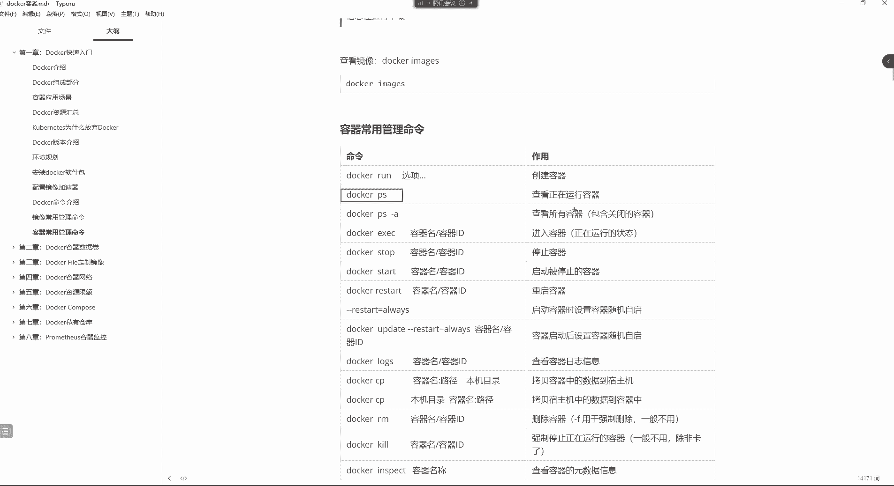
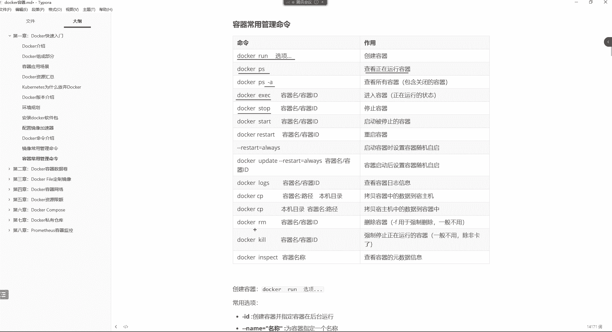

# 【小白入门必备】Linux运维进阶RHCSA+RHCE最全培训教程视频合集 - P97：Docker-3.docker容器、镜像管理命令 - 洋洋得IE - BV1nN4y1X7Go

hello hello，兄弟们，晚上好啊，能听到我这边的声音吗？听到声音的兄弟讨论区刷个一，开始咱们今天晚上的课程。好，都没有问题是吧？诶。那咱们就开始吧。上节课我们讲到这个docker的安装。

但是是光安装上来了是吧，并没有去学习怎么去用它。

然后我们来看一下单户的状态哈。😊，socer，然后ts。srry哈。C蒙CTL。ters。打Oer。好，running的状态。那我们现在把这个docker安装好了之后哈。😊。

我们怎么去用它呢？然后加速器我们也配了，哎呦，音乐没停是吗？好，行，okK了是吧？😊，这伤感情歌啊，忘停了。

那我们加速器是不是也配好了呀，来看一下那个文件哈，在ETCdockerdemer点Json文件里边是吧？啊，原来是我这边的问题。😊，嗯。这都是加速器也配好了。😊，那配好了之后的话呢。

我们来说说do客的一个入门哈。入门的话呢，其实我们学习刀客主要还是学习的就是这个do客的这些命令。那你如果想了解do客有多少条命令的话，那么我们可以直接敲这个docker，然后回车。😊。

哎，卡住了。哎啊，这么慢呢？来看一下啊，这些呢都是doker的命令以及doker的这些选项了。那这么多命令以及这么多的选项。哎呦，那这个。😊。

我们应该怎么去学习呀，让我们一看就头皮发麻是吧？这么多命令。其实这个命令呢官方是给了一定的分类哈。这个分类的话呢。😊。

从这个这儿等一下啊。好。它这里面呢包含像docker环境相关的管理命令。那环境相关的，比如我看docker的版本，我们就可以通过dokerwa去查看。那想看docker的一些信息的话呢，一些配置信息呢。

或者说它的原数据信息呢，可以通过doker info去看。那还有是什么呢？就是针对于容器的生命周期管理的一些命令啊。那容器的生命周期管理命令里面包含比如说我要创建容器，我要进入到容器内部。

我要去运行容器，以及我要启动容器停止容器，重启容器杀掉容器，更新容器等等等等这些命令。然后还有像针对于容器的操作的命令。那操作命令就是我们容器已经运行的情况下，我们可以干嘛呢？

比如说看容器的一个运行状态啊，或者说看容器的一些这个内部信息，或者说看容器的一些资源健康状态，或者说对容器做一些更新等等等等。这一堆命令啊，这些属于对容器的操作命令。还有呢就是针对于镜像的管理命令。

那这里面又分为镜像的仓库。那针对于镜像仓库的管管理命令里面，比如说我们可以通过命令行的方式登录到仓库里边，用log in。然后呢，我们想要去下载镜像呢，就p上传呢就push搜索呢叫such这一堆针对于。

镜像仓库的管理命令。还有针对于我们这个本地镜像，就是这个镜像，我已经下载到我的本机了。那么我在我的本机想要管理镜像的时候，比如说我重新构建镜像，我查看我本地的镜像信息，删除镜像给镜像打标签等等等等。

这些都是属于本地的镜像管理命令的。然后还有针对于容器资源的管理命令。比如说对容器的数据卷，做挂载的啊，创建容器网络的管理容器网络的这些命令，还有看容器日志的，比如说可以通过这个logs，看容器的日志。

看它的历史命令，看它的环境变量。😊，那这么多命令我们呃如果学的话呢，是不是得1。1点去学呀？所以咱们先什么呢？先从这个镜像的管理命令先开始学。好，那这里边来看一下哈呃在这个。

针对于镜像管理命令里面有这么4个是非常常用的4条命令。第一个命令呢就是docker image。这条命令呢，它是列出本地镜像的一条命令，这是什么意思哈？就是我们当前我docker已经安装好了。

但是呢你想使用容器的话，你得需要镜像。那这个镜像我们安装完docker以后，这个镜像在哪放着呀。😊。

或者说在我的本地有没有这个镜像啊，你可以这样找ocer。😊，你妹纸来看一下本地有没有镜像，有吗？没有是不是，这是什么呀？就是一堆描述信息嘛。😡，但是我们现在本机是没有这个镜像的好，那没有镜像。

我现在是不是得去下载镜像啊？所以呢我们可以去通过docker search这条命令，先去搜索一下我们想下载的那个镜像。好，那这个search后边跟上镜像名，就可以帮助我们搜索镜像了。

我们在这儿哈用docker。😊。

置比如我现在我想搜索一个什么镜像啊，我想搜索1个NGS的镜像，然后回车。😊，啊，那我们看到有这个镜像了吧。然后你看在内幕这一列呢，就是镜像的名字。然后呢，这个位置呢是镜像的描述信息。

然后以及这个镜像的一个点赞次数啊如果这个是如果是官方给你构建的镜像的话呢，那会在后边有一个OK如果不是官方构建的呢，就后边就没有这个okK了。啊，那这些都是属于什么？你看类似于什么自动构建的镜像是吧？

就是别人上传的镜像。好，那这个我们就对于这个在命令行里面搜索的这种方式，其实我们用的并不多，为什么呢？因为其实我们在命令行里面搜索这个NGS，其实我们所看到的这个名字，你说是它的镜像名吗？

其实并不是是什么呢？是仓库的名字。但是呢我们想去下载NS镜像的时候，你想想NGS是不是有非常多的版本呢？😊，你比如说我想下载11。18。0的，或者说我想下载1。

20点0的那这个你在这儿你是看不到它的版本的。所以最终呢我们想下载这个镜像的时候，你还得通过浏览器去访问doker的官方仓库。因为我们在面令行里面搜索这个镜像哈，都是在官方的仓库里边存着呢。

所以呢我们得通过浏览器，然后去访问嗯hb点儿doker点com这个地址。

好，这是do客的官方仓库。来到了官方仓库之后啊，我们可以在这直接搜索，就你不用登录。😊，你直接搜就可以了。比如我要搜索1个NGS，然后回车。😊，好，那你看了吗？

其实我们在这所看到的这个NGS就是我们在命令行里面搜出来的这个NGS了，然后也只有。

第一个显示的这个仓库才是官方给你构建的这么一个仓库。那这个仓库里面存储的都是NGS相关的镜像了，这里面有非常多的版本，你可以点进去啊，看到吗？是不是可以看到NGS的这些镜像版本了呀？好，那。

我们再回过头来，我们再看一下，那你说其他的镜像是怎么来的呀？这些镜像。😊，呃，首先就是这个docker hub这个地址哈。😊，他呢是作为一个公开的一个仓库。

就公开仓库就是大家都可以把自己的镜像往这个仓库里面上传。能列了吧，所以你下边看到的这些镜像就都是什么，都是别人上传上来的。然后你比如谁上传的，或者说这镜像本身是干嘛用的，它会在这儿加一些描述信息。这些。

看到了吗？你看这个你一看就能看懂吧。乌班图。杠NGS啥意思啊？就是在乌斑图环境下边，你可以使用的1个NDS的镜像。嗯，然后下边但这些我们就用的不多了哈，我们如果用的话，也肯定会用官方构建的这个镜像。

因为你下面的这个镜像对于我们来讲可能说不太适用嘛。所以我们就点到第一个镜像仓库里边，然后呢找到我们想下载的这个版本，那下载版本里面什么melan这种主线版本，那我们肯定是不会下的是吧？

那我们下也肯定是下载哪种呢？就是它的table这种稳定版本的镜像了。所以我们在下载的时候一定要指定好镜像版本哈，因为在这个镜像仓库里边默认情况下，你比如说我在命令号里面，我想下载NS的时候。

你可以这样下怎么下呢？用这条命令用这个do，然后跟上镜镜像名。😊。

那你不指定版本也可以，我们来看哈。docker跟上NGS啊，如果你是直接这样下载，我告诉你，它默认情况下是帮你下载这个仓库里边的叫la test这个版本的镜像。那let test版本是哪个版本呢？

就是1。23点3的最新版本，能理解了吧？而我们呢又不想下载它的这个最新版本，那我们就得指定一下，我到底要下载的版本是哪一个版本。我要下载的是1。2。1的这个stable的稳定版本。好，那。

我们就得指定好它的版本是。多少来的？1。2。1。1。22。1好，然后破一下。

然后这个镜像我告诉你们啊，你们如果再点进去的话，你还可以看到这个镜像的一些元素级信息。你要是点到里边的话。只不过我这有点慢，你看到吗？他这服务器在国外，我这边访问就比较慢。

这么慢呢。可能是我这边又下载，那边又打开页面的话。

就感觉有点卡。

好，下载完了。

然后这边的话呢，我们再去。点一下哈，这个礼品点不进去呢。是不是？我这网络是我这网络的问题啊，网络不好。啊，你们到时候可以自己点到里边看一看。我这确实是点不进去呀。那那那我就不点了，好吧，我就不点了。

然后接下来呢我们把这个镜像下载下来了哈。下载下来之后哈，我们可以后续要看这个镜像怎么看呢？看我们当前本地本机的镜像dker image，然后看。😊。

是不是现在就能够看到有一个叫做NGS的一个镜像了呀。然后这是版本，其实这版本呢它是里面是。叫做标签啊，t标签。然后呢，这个镜像自己的ID号以及镜像的create创建时间。其实这个创建时间怎么说呢？

是这个仓库对这个镜像的一个更新时间，就什么时间更新过这个镜像，所以它并不是我们的这个。

下载时间哈这个大家搞清楚，所以这时间对于我们来讲没什么太大的意义。然后这个镜像的大小是142兆。😊，也不小是不是啊？好，那现在就有了个NGS这个镜像了。那如果说我们还想下载别的镜像呢。

你说我想下载my circlel镜像，那你就在这儿去搜。😊。

搜索my circle。是不是看到有my circle的镜像啊然后你如果想下载的话，点进去然后这里面你比如说我想下载my circle5。7的那你就刀cker给它铺下来啊，但是我们现在用不到哈。

所以我们现在就先不下载它。我们现在只什么呢？只拿这个NS来给大家举一个例子，或者说我们再下载一个吧，下载一个什么呢？下载一个stoOS的镜像，这是一个系统镜像，看到了吗？😊。

就是我们这个s托S最终也可以是s托S这个系统哈，它也可以以容器的方式运行。然后这里边呢我们要下载是stoOS。嗯，它里面是有4它是7的，7。9的，知了吗？那如果我们想下载的话。

其实我们现载4S意义并不是很大。Pu。渗透S7。9好。给他铺下来。因为毕竟。我直接下载1个sS斯镜像的话，后续除非说我有那种特殊需求，我自己去重新重新针对这个sS系统，再往里面去封装一些东西。

然再自己重新构建一个镜像，自己用，这种可以。但如果我们单纯去下载它的这个容器的系统镜像，其实意义就并不是很大了。

没有下载下来吗？s透OS7。9。2009是吧？这还得指定。

7。9。2009。可能是我的版本指的不是特别的正确哈。note放了了吗？啊，7。9。StoOS7。9点。2009。如果下载不起来，我们就不下了。这东西其实用的并不多。有。还可以哈。好，下载下来了。

然后我们这样dockerim看一眼。是不是有一个s透s7。9的这么一个镜像了呀？好，两个镜像。那这两个镜像有了之后，我想用这个镜像怎么办呢？接下来呢看哈我们就可以来学习容器的管理命令了。呃。

这个镜像管理命令里边最常用的就是查看镜像以及下载镜像。那还有一个是删除镜像。那删除镜像是通过dockerRMI。😊。

2M不是删除吗？😡，是吧然后这个I呢其实就是image的意思，就是镜像的意思就是删除镜像。但是我们现在不删哈。但如果你们想删的话，你就指定镜像名，再指定你要删的那个镜像的版本就可以了。

因为我们为什么每次操作都要指定一个版本呢？😊。

你如果不指定版本的话，可能说你就我们就拿这个NGS来说吧。你比如说这一杠GS有很多个版本，我现在。😡，比如说我下载了又下载了1。21的版本，1。2。1啊，还有一个是1。比如说20。0的一个版本。

那后续你看这两个镜像都叫同一个名字。没错吧，都叫NGS。那你最终删的时候。它怎么区分你要删的是哪一个呢？它并不是说直接把所有叫NS镜像都给你删掉。

所以呢这里面他得要求你要指定具体要删的是哪一个版本的镜像。😡，所以删的时候也要指定版本。

好。然后那接下来呢咱们就对于这个镜像。的一些入门命令，我们就给大家讲的这个差不多了。然后下边的话呢，我们来讲讲这个容器的管理命令。上面这部分是啥呢？上面这部分就是我们在使用每一条命令的时候。

然后这个命令的输出就它的每一列代表的是什么含义？好，包括我们在搜索镜像的时候，我们的这个。显示出来的每一列代表的是什么含义啊，这刚刚我已经给你们解释过了。然后这里边我也我也说了，你下载音箱。

如果不指定版本则是最新版本啊，如果指定版本呢，可以从刀客号吧查看对应的版本，然后呢再进行下载。然后下面的话呢，我们来说说这个容器的管理命令。管理容器的话呢，命令就比较多了。因为我们最终呢都是对容器去。

最终还是使用容器的镜像嘛，它只是一个文件而已。那我想现在去创建容器的话，我们要使用的命令是这个docker run这个命令。然后后面呢要跟一些选项，这个呢叫做创建容器。那我们创建容器的话。

这个选项可以用哪些呢？啊run后边我们可以跟着选项，可以用这个杠ID然后杠杠name。我们先说杠ID是什么意思哈？杠AD呢是创建容器，并指定容器在后台运行啊，为什么我非得让容器在后台运行呢？

我可以先这样，先简单来给大家演示一下哈。😊。

先把这个镜像给它列出来。比如我现在创建s透斯这个镜像，你看一下我这样docker run，然后杠I。T注意哈，这个IT是什么意思呢？IT就是从。这个标准输入。去运行一个容器。然后呢，这个T的话呢。

贴就是给容器分配一个命令航终端。啊，这个我们一会儿再说哈，标准输入应该很好理解吧。就是我们在命令行里边。😊，去这个什么呢？去这个创建一个容器，就属于这种标准输入了。然后那这个给容器分配终端。

是因为我们后续进到容器里边，我们需要去执行命令，所以呢我们也得有这么一个命令行终端，这不就命令行终端嘛。所以这个T呢就代表TTY的意思终端好，然后。后边我们可以通过杠杠name等于来给容器取个名。

这个名字呢我们让它叫sinto，可不可以？或者说s7。9。然后那。还要指定什么呢？别的就不用了，然后再指定它镜像就行了。就我这个容器基于sal冒号，注意哈这个。

镜像和版本之间呢用英文的冒号去作为一个分格。那它的版本是7。9。2009啊，也就是说。我要创建一个容器，叫stos7。9，这名字叫什么都行哈。你要喜欢的话，你让它叫ABC也行。ABC也可以。叉叉OO。

他也不管。能理解吧？但是我们剑明之翼哈，sto7。9，然后我这个容器呢基于这个镜像去创建。然后那我在使用这个容器的时候，我使用哪个解释器呀？啊，我使用B携的be这个解释器。其实这是什么意思呢？

就是我进入容器以后给我使用。😡，这个bitch去给我提供这种什么呢命令行的终端。好，然后回车。你们注意看。你看哈。现在的话呢，我的命令行终端呢发生变化了。😊，怎么变了呢？你发现我这个主机名就不太一样了。

是不是啊？哎，为什么这个主机名变得这么奇葩了呢？变成一串什么的字符串了是吧？好，其实我现在已经进到这个容器里面来了。你可以看一下我当前的操作系统哈，ETC。😊，s透 releaselease。

你看我当前的系统，它的版本是哪个版本，7。9。2009。看到了吗？然后那正常它已经是一个sintoS的系统了。那你看它的根目录，我们现在是不是就已经在根目录里面了呀？那你看它的目录结构。

跟我们在虚拟里边安装的sindows是不是一样的呀？😊，没错吧。这没什么差异啊。😡，好，这就是这个我们在创建容器的时候。就是通过杠IT这个选项去创建的时候，我们就直接进入到这个容器里边来了。好。

那我们想退出这个容器怎么推呢？这样推X的就退出了。好，那退出以后呢，我们就回到了我们的宿主页上面来了是吧？好，但是你这时候执行这么一条命令，哪个命令呢？

叫做dockerPSdokerPS是查看正在运行的容器，那我们就这样哈，dokerPS回车。

我们当前有正在运行的容器吗？😡，没有。但是又不太对，怎么不太对呢？我们刚刚明明创建了一个stoOS7。9的一个容器啊，而且我们刚刚也进去了呀，我们也执行了命令了呀，是不是啊？😊。

那为什么现在看看不到了呢？是因为呀就是我们在创建这个容器的时候。在很多时候呢就是如果你通过杠IT这个主要是这个T这个选项。你去进入到这个容器，或者说去创建的容器，你是直接就进入到容器内部了。

然后当你退出容器的时候呢，这个容器它就关闭了。那关闭以后你怎么看呢？你得这样看。dokerPS加个杠A。

钢一是啥意思呢？杠A就是查看所有的容器，包含那些关闭的容器。

所以这时候我们在看的时候，你发现其实。我们刚刚的那个看这个name就可以了哈。刚刚那个叫s托S7。9这个容器，它现在的状态是什么状态呀？是一个。😊，X。啊，退出的一个状态。好了吗？

然后这是这个容器的ID这个容器的ID是不是就跟我们前面在命令行里面这ID是一模一样的呀？因为容器主容器的主机名呢就是容器它自己的ID。然后这是这个容器的镜像，然后以及我们在进入容器的时候。

我们所使用的这个解释器是哪个解释器？以及容器的创建时间。两分钟前创建的好，看到了吗？这就是。我们在创建容器的时候，我们换一种方法呢这样。doker run杠ID注意哈，我这时候用的是D。

这个D这个选项。它主要决定就是我创建容器。并且我让这个容器在后台运行，不是在什么呢？不是直接进到容器，然后呢，容器一退出就关闭了，不是那样子的。你看一下，我如果用杠ID的话，然后再给它取个名。

杠杠name等于s透斯7。9，然后再指定哪个镜像呢？

深透视。呃，哎，我那个镜像名字是这个哈s透斯。然后再指定我在容器内部使用的解释器是拜式解释器。然后我们来看效果哈。好，他报一个er了是吧？啊，什么。他说你的这个container name。

就是你的容器名。是不是？重复了呀。就是你现在创建的容器名字叫sto7。9。但是呢在我当前系统里面是不是已经有一个容器，也叫做sinto7。9了呀，所以他就不让你重名了，看到了吗？他说要么你就干嘛呢。

你就通过rem给容器重新改个名。但是没关系啊，我们就这样呗。我们这样s透7。9，然后呢。这个s透t的吧。这个名字怎么取啊？36472901。嘿这名字啊，s透呃。😊，深透士。test行吧。01。好，创建。

好，创建好了之后，你看哈。😊，他现在的一个状态，就是我们当前是不是并没有直接进入到容器内部啊，没有。那这个容器呢，我们创建完之后呢，它给我们返回这么一串非常长的1个ID号。好。

那么其实这个ID号才是容器的ID。就是他真正的ID号是这么长的。😡，但是如果你这样看怎么看呢？就通过这个dokerPS看的时候回车。你看这是看正在运行的容器哈，各位。

那么现在正在运行的容器是叫sto test01，这个容器现在是up了33秒了。然后呢，这个你看它的这个container ID这个容器ID你发现是不是跟我们上面的这个ID是一样的呀。

但是它只显示到哪里呀，只显示到这儿。只显示这个前11位的ID号。看了吗？因为毕竟你这个ID这么长，如果我们在看这个容器信息的时候，你把整个ID都显示出来，那别的信息是不是就。没地儿放了呀。

所以呢它默认只显示前面的开头11位。好，那现在这个容器你看它是up状态吧，没错吧。就属于运行的状态了。

哎，这样。我们创建的容器就是在后台运行。那在后台运行，我们后续如果想进入到容器呢？我们怎么进呢？用这个命令。用这个doker EXEC。你可以指定容器名，也可以指定容器ID都行。但是通过容器名呢。

我们会更加方便一些。这个呢是进入容器。但是你这容器得是运行状态才能进啊。如果容器关闭可，这可是进不去的。

好，那我们现在想进入到这个容器。doker EXEC然后杠。哎。T。好，注意。这个这个时候这个。

哎，我看看金融容器有这个IT吗？

啊，有IT哈。就这个时候我们在指定这个IT的时候。就是我在我的这个命令行里边进入容器，然后呢再给容器分配1个TTY的终端。这个I甭管是创建还是进入容器。都必须要加的。其实这个I呢它是这个什么呢？

叫做set in。的一个含义就是标准输入的意思。标准输入就是我要在我的密堂里面干嘛呢？去。对容器啊执行一些相关的操作啊，一般就是在进入容器和这个创建容器的时候，会用这个杠I这个选项。好。

然后T就是给容器分配个面令上终端，然后呢，我们还得指定我要进入这个容器叫什么名字。那这时候你就不需要通过杠杠 name了。因为我们容器在创建的时候，你是通过杠杠 name指名字。

但是呢你进入的时候就把这个容器名拿过来就可以了。好，然后再指定。呃，那这时候你就不用再指定它的这个解释器了，因为这个。嗯，但通常我们也指，如果不指的话可以吗？不行，看到吗？不止不行，还得指一下。

指定变一下的半纸。指定一下，我们呢进入容器，并使用拜ch解释器。然后回车。这样的话呢，我们就进入到这个容器内部了。所以我们想所以我们这个容器啊，它运行以后，然后你想进到里边的话。

就通过dcker EXEC杠IT这一部分命令格式是固定的。然后呢，这是指定你的容器名，后面再指定你在容器里边的一个解释器，是哪个解释器。那如果你换成SH这解释器可以吗？可以啊，我们退出。😊。

退出哈退出以后的话呢，我们再看容器的状态，dockerPS是不是还是up状态呀？😊，啊，就是这种容器的话，你进入容器退出容器。他都不会关闭的。主要是你退出的时候，它不会关闭哈那就时你可以这样。

我们在dockerEXEC杠IT指定容器名saltest01，然后指定并下的SH。😊，那你要用SH解示器去什么呢？去进入容器的话，那你的解释器环境不就是SH了吗？能理解了吧。所以我们每次进入容器。

这你到底指定一下你到底是用哪个解释器给你提供这个命令上的环境，这这个能懂吧？啊，但是我们是不是得用bach啊，是我们最习惯的一种解释器了，是吧？啊，进来了进来之后的话呢。

你还正常就使用这个系统不就完事了吗？😊，然后回到自己的加目录，这不就在root的加目录了吗？这个系这个结构就是一个s透s系统的一个结构哈。😊，这种就没有什么陌生的了吧。我们天天接触这个sin的系统。

这个系统的结构，每个目录里面存储的数据是什么？这就不用再过多去介绍这些东西了吧，是不是啊？只不过说同一个系统，我们原先呢都是在虚拟机里面去使用，而现在呢就是通过容器的方式去使用这个系统了。就这么回事。

好，然后我们再退出。退出哈呃但我们这个环境是属于套娃。但如果要是在真正的生产环境的话呢，你比如说人家就直接是在物理机上边，我就起容器呢。那是不是就不套娃了呀？但是我们这个环境呢没有办法是吧？

我们是在虚拟机环境里边。😡，嗯。好，然后这个s透OS这个。

它的这个容器我们其实用的并不多，因为我们其实用这个容器主要还是部署一些服务，就常见的服务。你比如说像什么这个NS啊，my circlet cat等这些，这是我们这个。

应用最多的。那么我们这个。这样。

但是咱们得先把这些命令先过一遍呢，是不是？😊，我们再回过头来，再说一下前面这几条命令。刀壳 wrong就不用说了吧，是创建容器的。刀ckerPS呢是查看正在运行的容器的。

然后如果说有些容器是关闭状态的话，你得通过杠A才能看。然后你想进入到容器呢，就是通过dockerEXEC。这个命令进入到容器内部。然后那如果我们想停止容器呢。这dockertop吧。

就把这个容器给它关掉了。嗯，但是我们先不说怎么去关，咱们先说把容器删掉，怎么删。

用dockerRM，比如说现在这个s团的容器我不想要了。DockerPS杠A。咱们现在总共两个容器哈，比如我现在这两个容器我都不想要了，我都想给它干掉。😊，好，那我们先删第一个先删谁呢？

先删这个sto7。9的这个容器，那就dokerRM。没有那个I哈，如果有I就是删除镜像的命令了2M，然后跟上容器名就行了。我要删的是sals7。9这个容器灰正。就只给你输出了一个s47。9。

那我们再看一眼。是不是你再看的时候就没了呀？😡，好，就被你给删掉了。然后这个我也不想要了，我也想给他删掉，那就。Doker。RM跟上它的名字。哎，你发现这就不太一样了，这也报一个eror。是不是啊？

那这个arrow是什么意思？他说。😡，这个。你的这个容器啊，他说你无法移除一个running的一个container，就你这容器现在是属于什么状态呀？它现在属于up状态，看到了吗？所以up状态的容器。

它不让你直接删。那咋办呢？那你得先给他top看到吗？你得先给他top掉。然后再去给它rem掉，这样才可以。对，先停止。但是我如果说你说我就不想停，我就想直接给它干掉可以吗？其实也行。😡，也可以哈。

你可以这样docker。RM。杠F。然后跟上。sal testest01，这样也行。这杠F是啥意思呢？杠F叫做强制。😀Ha。😊。

哎，强制的意思啊，所以。😊，我那个RM，你看这里边我也写了哈，删除容器。然后的话呢，你杠F是用于强制删除。一般不用。一般不用，就是说你除非正常去停止这个容器的时候，你停不掉。所以你可以干嘛呢？

你可以用杠F。啊，就是无需停止。无需。关闭。控器。就是这个意思啊，杠F但是我们通常呢都是不会这么暴力的去把这个容器给它删掉哈。😊。

那这两个容器我们再去看一眼。dokerPS没了吧，加个杠A。

也都没有了。那么。我们前面讲个命令。有哪些呢？你看我们这个就这么一大会儿功夫。do刻以 image置查看镜像。但是docker设置其实我们用的不多哈，这个大家作为了解就行。

docker pull拉取镜像。然后呢，有了镜像之后呢，我们是不是得创建容器啊，那就docker run。😊，创建容器容器运行起来之后呢，我想看它的状态，dockerPS。好。

那有些容器如果处于关闭状态，我正常你通过这个命令你是看不到的咋办？哎，当号PS杠A，这就是包括关闭的容器，我们也可以看好，那容器运行以后，我想让它干嘛呢？我想进到容器内部的话。

你可以通过dockerEXE进到容器内部啊。后续你不想要这个容器的话，就docker rM给它删掉就可以了。😊。

行，然后我们接下来再去拿NGS那个镜像，我们来演示一下哈。😊，doker image查看镜像。咱们来说说我们去创建NDS这种就是对外部提供服务的这种容器，我们应该怎么创建哈。其实方法呢跟前面是一样的。

dker run杠ID让它在后台运行，然后呢给它取个名，让它叫。😊，N你S。01。好，然后指定它的镜像是NS冒号1。22。1。那指定呃，那其实这后边的话，你不进入容器，你不用指定它的这个解释器。

就后边啊我们正常来讲，不是得指定一个它的解示器，用哪个解释器吗？😡，是不是啊？其实你这位置你可以先不用指哈，可以先不用指。对它跟linux meaning是非常相似的。

所以好多命令呢我们在记的时候就非常的容易了。好，那我们就直接去创建，然后回车创建好了，看到了吗？那这个容器创建好了之后，我们在看的时候。😊，台是dockerPS。那NS01这个容器。

当前的状态是up的状态。好，然后这是容器内部的端口，看到了？因为NGS默认不就暴露80端口嘛，所以这是容器内部的端口。好，那我现在想进入到NGS这个容器里面怎么进？😊，Doker， E， X，EC。

杠 I T。进入容器。给容器分配一个终端啊，指定容器名叫NN01，然后再指定我的解释器是哪个解释器。啊，就是你进入到这容器的时候，你指定我用哪个解释器就可以了。😊，回车进来了吧。

你看当前我的列个命令行是不是就发生变化了呀？那接下来你看这个容器其实就非常的简洁了。看到吗？我们当前是在这个当前容器的根目录下边。没错吧。好，那我当前这个容器。

你发现它好像也具备像我们在这个那个什么渗托S系统里面所看到的那些一级目录啊，没错吧。是不是也都具备这些目录啊？😡，哎，那你说1个NS容器为什么会有这些东西呢？😡，很不可思议。是不是？好。

那你说那这个东西像这种像这种容器，你说它基于镜像去创建的那也是说这个镜像它在提前封装的时候。这里边是自带一个linux的底层的系统环境的。因为在这个行业里边。所有的linux发行版系统。

你甭管是sintoOS。还是说这个乌班图还是得ban苏y等等等等。其实他们的一级目录呢都一样。好，那也说我们现在呃在这个NES这个容器里面，其实它也是自己内部有一个底层系统的。那这个底层系统到底是什么？

你说我怎么知道？😡，那如果是sS，我们是不是直接就看ETC有一个s透杠。releaase这么一个文件呢，但你发现它没有。没有这文件。哎，那这个系统到底是什么系统呢？ETC目录。嗯。

好像没有什么特殊的文件是吧？我们来看看哪个文件呢？ETC我们看一个。第一B点康复。这里面是吗？这不是。对，不是啊。不你看NDS文件没有啊，NGSNDS的话正常来讲就是它的一些数据都会在。

你比如说我们正常如果说通过这种RPM的方式去安装NDS的话。那其实呢就是他的目录呢跟容器的那个目录几乎的位置是一样的。我们就在我们的sS里边，我们安装。如果用ym的方式去安装NGS。我们可以去什么呢？

咱们可以验证一下呗，是吧？我们再开个终端。😊，然后呢，我们开个中端之后呢，我们在我们的渗透色里边去用y的方式。安装一个N这个字。我只安装，我不启动服务哈。😡，然后我们主要就是看看它的这些这个目录结构。

是不是都在同一个位置？啊。得办的是吧，没关系哈。看到吗？这儿有个文件看到了吗？叫de ban version。啊，所以你得看这个文件。😊，所以其实呢。我们刚刚用的这个NS这个容器。

其实它的底层系统并不是s透斯的，而是这个deban的系统。然后版本是11。6的这么一个版本。所以就像我前面在给你们讲这个容器的时候，我说容器有个特点是什么呢？一次封装，然后呢随处运行。没错吧。

你看人家在封装这个，比如说人家在封装这个N9S这个镜像的时候，那么这个。NS这个镜额里面包含了什么呀？是不是包含了我这个NS这个程序在运行的时候所需要的底层的系统环境了呀。

比如这里面已经包含了一个de半的一个系统了。叠半系统已经在这个镜像里面了。然后呢，我们在这个什么呢？我们在下载这个NGS这个。镜像的时候，那么你要知道这个镜像我们拿到了我们的s透s系统里面来了，是不是？

😊，咱们给它下载到我们自己的s头OS里面来了。好，那我们下载到我们的深陶词里面以后。😊，你比如说。那按键N在运行的时候，会受到我们的这个外b的 syn斯的系统的环境影响吗？你们觉得会吗？

是不是就不会了呀，为啥呀？😡，因为人家在运行的时候，压根就不需要你的外部系统。人家里边有自己所需要的系统了，知道吧？哎，所以后期你比如说我们要你比如说后期我们要部署一个他们 kind。😡，好。

你步如一个t不开的，你下载time不开的镜像的时候。😊，你要知道他们开的镜像，人比如说人家也直接把什么呢？把JDK都给你封装好了，1。8的。😊，就扒了吧。

人家把JDK8的环境都已经给你封装到这个镜像里面了。那么你到时候再用这个t cat的时候。😊，你下载你的C蓝系统里面了。你比如说我的s蓝压根儿我没有JDK的环境。我告诉你，人家都不需要。😡。

人家容器运行不需要你的外部系统的这个什么呢？那些JDK环境是因为人家容器内部已经。自带了。这就是容器的好处吧。那你后期你把这个容器，你比如说我拿到s透上边，拿到乌班图上边，拿到susy上边。

拿到斐多尔上边。😡，会受到他们的环境影响吗？压根儿就不会。😡，是不是啊？所以你看这不就有容器的好处吗？一次封装随处运行。😡，但是我但是他们依赖于什么呢？他们是不是依赖于同一个内核啊。

就是说咱要求说你内核得是。😡，都是基于linux内核才可以啊。啊，它的要求非常的简单，同一个内核就行。所以这个原理大家现在搞清楚了吧。好，然后我们把这个NGS安装好以后，你看我们通过样么安装的NGS。

我们自己查一下吧。RPMQL看看NGS的相关的配置文件。😊，呃，它的主配文件是在这个ETC下边。在这儿呢ETCNS下边有个NS点com，这是它的主配置文件。那我们看看容器里面是不是也在这个路径。

ETCNS下边。是不是也有1个N加4点com复这么一个配置文件呢？是不是哎，路径都一样。好，那他的日志文件呢？😡，日志文件是不是在这个va的log下边呢？😡，好，那我们来看看容器。

是不是也在va下的log下面有1个NDS目录，是不是也有啊？没错吧。那N4页面在哪儿啊？好，页面在。这个优色。share下边。嗯，这儿。usershare NSHTL里边是存储它网页的。

那么我们看看容器里面是不是也在那个路径啊。优色。Share。NDS。看到HTL这个路径了吗？这里边你看是不是存储它的这个网页文件呢？哎，所以其实我们在通过容器去部署这些符的时候。

那这些浮的比如说相关的配置路径，就跟我们在这个系统里面通过压么的方式去安装的时候，它的路径呢几乎都是一样的。😊，所以我们后续在使用容器的时候，它需要的是什么呢？

就是我们前边是不是你们在第三阶段学的这些内容呀？好。那这是NS这个容器。然后我们对于这个容器的话，我们要我们现在要干嘛呢？要去改改它的页面呢？我们一会儿要访问是不是啊？或者我们现在就不改页面。

我们现在直接去访问，可以吧？你看这是在这个终端是在容器里边啊，然后们在这个终端，我要访问N9S。😊，DoerPS。我们在访问的时候，应该怎么去访问这个N键色这个容器呢？这个是不是得。应该思考一下。

我们现在访问容器。那首先容器是在我的do口主机里面运行的是吧？这是它的速主机嘛。😡，那我能直接访问这个do客主机吗？他的IP地址。

可以吗？端口映射192。168。0。90，我可以直接这样访问吗？我直接这样访问。看到吗？反问不过去，为什么呢？

因为docker主机压根就有什么呢？如果我们这样直接访问，它默认是什么呢？是访问这个主机的那个什么呢那个80。但是我们当前速主机有780端口吗？😡，没有吧。是不是啊我们当前素主义并没有起80端口哈。😊。

那这个你就没有办法访问。因为他们压根儿。网是不通的。就是容器的网哈跟外部用户。是不通的。好，那这时候如果你想访问的话，我们这边我们先退出哈，这个容器其实是用不了的，为什么用不了呢？因为我们这个容器。

他没有对外部暴露一个访问的端口。而这个端口只是我容器内部的NDS的默认端口号。能理解吧？所以我们现在。😊。

如果是针对于像NGSt cat这种类型的服务，你要去以容器的方式去创建的话，一定要给它做一个端口映射。端口映射通过杠P来指定。这个格式呢就是它要借助速主机上面的一个端口。去给外部去暴露。然后的话呢。

用户访问宿主机这个端口，然后宿主机呢再把这个请求映射到容器的端口上面，它是这么回事。所以最终这个图的话，如果我们要画的话。呃，可能不太好画啊，那我先问一下我说的这个意思，你们能不能理解。

理解我就不画图了哈，能理解的刷一不理解的刷2这个位置。😊，能理解是吧？好，能理解的话，那咱们就直接做端口映射了哈。😊，呃，做登口婴车的话。

非常简单。就是用杠P就可以了。docker run杠ID杠杠name等于。那我们让它叫NG02。然后这时候呢你就可以通过杠P来指定端口映射了。那这个端口映射的话，你比如说我现在创建的NGS02，我想。

这个用哪个端口呢？当然你得先指定它。对外暴露的宿主义端口。然后那这个我们得选择一个在我们当前的这个主机上面没有备这样的端口。那我们当前这个主机说白了。呃，几乎呃除了这些端口以外，哪些呢？

除了22和25这两个端口，是不是我们都可以用啊？啊，那我们就来一个，比如说多少呢？😊，81可以吧？我把81的这个端口到时候呢给这个容器。去使用。啊，81端口呢暴露。出去，然后呢。

最终呢再映射到容器的80里边。比如说后续的话，用户在访问的时候，他是访问我这个do客主机的81端口。然后呢，这个81端口接收到请求以后呢，再把请求映射到80这个NS02这个容器里边。好。

然后再指定它的镜像是N减S1。2点。你合。啊，1。2。1。好，创建。创建好了创建好了之后呢，我们这边再dockerPS。看一下。呃，现在这个N加S02这个容器。我们就直接看它的这个端口这个位置哈。😊。

端口这位置你发现是不是就有端口映射了呀？这是4个0，这4个零代表是所有的IP地址。只要是访问我这个主机的81号端口，那么我这个请求最终就映射给谁了呀，映射给。N9S02的80这个端口了。

也是最终这个请求呢是由这个NGS这个容器去接收。好，那前面是IPV4的端口映射，这是IPV6的端口映射。那IPP6我们用不上是吧？😡，好，那接下来我们就可以去这时候再访问的话，你看哈。😊。

我们在这儿。直接呢这是这个地址，是不是这个do客主机的地址啊？然后呢，我跟上哪个端口啊，81端口回车。哎，这样我所看到的页面就是。容器里边的那个NDS页面。

好，那这个页面我们可以改一改哈。我们这样我们在这个终端里面进入进入到那个容器里面。😊，呃，doker EXEC杠IT然后容器名是N这02。指定电一些的by置这个解释器。好，进来之后的话呢。

我们可以改下它的页面，我们CD到优色shareNSHTL里边。我们刚刚看到的页面内容，不就是这个index里面内容吗？我们可以直接干嘛呢？打开这个。index点HTL。Hao。这是非常的漂亮是吧？他说。

command note found没有VM这个命令。那我VI可以不？是吧你没有VMVI行吗？😡，这更漂亮啊，连个VI也没有。那也就是说我们在使用这个容器的时候，你发现它就是非常的精简。

精简到什么地步呢？😡，就是说白了，连这种命令都压根儿就都给他什么呢？都给他移移除掉了。因为其实这个按加色容器也用不上这个VIM这种命令。能理解吧，因为最终的命令我们都是它也是放在哪儿了呢？

放在根下的并下边了，你可以看看哪些命令，你可以使。你看一下并下边都有哪些命令呢？😊，非常少。看到了吗？所以我说这个容器本身就是一个精简版的。linux的系统没毛病吧，是吧？

首先这个系统是这个是这个底层是得半的系统。但是呢由于一个完整的系统的命令非常多，你比如说我们就拿这个森台寺来说，你看你 syn台4。😊，那B下边有多少个命令程序啊？有这么多是不是啊得几千得几千条命令。

😡，这是一个完整的系统。但是呢一个精简版的容器系统呢就这么点。所以连个VIVI的一个命令都没有，那怎么办呢？一个容器可以被两个端口映射吗？我如果再创建1个82。一个容器不可以被两个端口映射哈。这个。

那我们这怎么办呢？我们就ecle一下吧，它那边有icle命令吗？是不是有ic啊？😡，那咱们就挨Q充电项呗。艾le一个。Yeah。Iical一个hello。Doker。可以吧。然后呢。

给它重定向到这个index这个文件里面。然后看一下这个文件里的内容。

hello docker，然后那这会我们在刷新的时候，是不是就这个呀？hello docker。😊，好。这不就是。我们怎么去通过容器的方式去部署像NDS这种服务嘛。然后最终如果想对外部提供访问的话。

那我们就得通过杠P做一个端口映射才可以。比较简单是吧？就是这样子的哈。😊。

呃，然后这个那对于这个容器呢，我们在管理的时候，我们命令还没有给大家讲全面哈，我们这个先退出。我们先退出这个容器哈。😊，但是这个容器并没有关闭啊，它还在运行呢。看看还是属于一个。up的状态。哎。

那这个容器还有异议吗？没有意义了吧，反正也不能被外部访问，我们留他干嘛呀？😡，是吧docker2M。杠F，但是尽量先停掉吧，怎么停容器啊？

我们别特别的暴力，是不是啊？特别暴力，特别粗暴也不好。先给它关掉吧，是吧，先stopstop呢是停止容器的命令，你跟上容器名也行，跟上容器的ID也行。但是这ID号是不不方便我们记忆啊？

是不是啊？所以我们其实很少会通过容器的ID去管理。而且你跟ID的话，你可以跟上，比如说前三位也行。只要是能够有一个唯一的区分就可以了，但是呢也不方便啊。我们就这样doers top。

你比如说你要跟上他的前三位，比如说AAE。也可以。看到吗？他就把这个以这个ID开头的容器给你关掉了，然后你要删除呢。dockerM然后。呃，你想根据名字删也行，根据他的ID号删也都可以。

那我们就跟跟上名字吧，N这01，这样就删了。然后你在dockerPS杠A的时候，是不是就没了呀？

把那个容器给它删掉，所以删除容器的命令。啊，这些RM杠F也可以哈也可以，但是你这太暴力了呀。😊，是不是有些暴力呀，一看就怎么说呢？没有女朋友啊，这太粗暴了，你这么粗暴能找到女朋友吗？

啊这这杠F属于暴力停止哈。😊，然后这个然后我们来说说我们怎么去给大家演示这些命令哈，咱们拿哪个容器来说呢？还拿了个NS哈。😊。

我现在想把这个NS，我想给它关掉。stop是不是啊？那咱们就给它关掉哈。😊，daers top n six02关掉了，然后看状态的时候，dkerPS杠A。他现在是属于一个什么呢？退出的状态。好。

那关闭了，我们这边肯定反应不了了吧。

那我现在又想让他起来怎么办呢？😡，他现在关闭了，我我又想给它起来。😡。

我们前面在系统里面管理服务的时候，是不是通过system CTL你想启动服务就star是吧？你想关闭服务呢，就stop。😊，那你换成刀客的话呢，你想用刀客启容器。😡，就docker start。

你像用docker宽容器，就dockertop。嘿，是不是非常的类似啊？😊，dker start，然后跟上N这个词02再给它起来。然后再看一下他的状态。是不是就又up了呀？好，然后你这时再访问呢。

是不是啊？就又可以了。好，这是怎么去启动一个被停止的容器。那如果容器需要重启呢，那就race它。这是重启容器的命令。好呃，那这个重启还需要演示吗？没啥可掩饰的了。一般情况下就是你改了容器的配置文件的话。

你可以去重启一下。你比如说我们就这样这个我们进到容器里边哈，doker EXE杠。😊。

杠IT跟上N这个402指定定些的ch进来之后的话呢，你比如说我改了它的配文件去了，但是这配置文件我们改不了啊，没个连个VI都没有，我怎么改呀，是吧？这尴尬了，那算了吧，就别改了。

突然间发现确实是哈确实是改不了，没这没令。😊。

所以需要重启就是ra它，但我们得演示一下。

演示的时候，这个先看一下他当前的一个up时间。就是。装不了他这个他那里边的话是这个。怎么说呢？就是这个。那个那个他是得办系统，咱们对得办系统又又不了解是吧？这是8分钟是吧，up8分钟了。

然后我们现在要去。给它重启一下dcker wrist。哎。这样哈。呃，是这个docker wristta，然后。N这个02重启，然后再看它的。时间。是不是变了？2百钟啊。哎。Yeah。

所以就是我们前面所说的，就是如果我们想自己去封装这种。镜像的话，其实。呃，可以使用什么呢？就这种你自己先下到自己先下载好一个渗头OS的一个。系统镜像。对一个容器镜像。然后呢，你直接呢在这个里边。

你比如说你把需要的东西都提前给他。准备好，然后的话呢自己再重新给它封装一遍，就二次勾建一下，这种可以。可以哈，但是没有那个必要。其实。😊，没有那个必要。其实我们对于容器来讲，后续用不上什么VI和VM。

😡。

所以你们先不用去纠结容器里边的工具。呃，很多都没有，我们不需要，你知道吗？啊，这是这些命令是吧，启动被停止的容器，重启容器。那还有一个问题就是这个。杠杠reta等于always。

这是启动容器时设置容器随机自起。好，那咱们来快速演示一下当前这个容器是up的状态吧。我现在这样reboot。

注意是我的物理机哈。是这个容器的物理机，我给它reboot了。那容器是不是也正常也是被关闭了呀？因为它的宿主机都被我们给停了嘛。😡，好，然后我们再连一下。然后这时候。Daarker P can。

看看你看这个容器是不是就处于X关闭状态了呀？啊，所以后续的话呢呃你在创建容器的时候，你希望这个容器可以随机自起，你就可以dcker run杠ID。杠杆name等于比如我来个N这个字01杠P来个端口映射。

比如说82映射到容器的80里边，然后镜像是N这个字1。22。1。但是注意这里面再加一个这个选项。

启动容器是让容器可以随机自启。走你好。那。创建好了之后啊，它现在不是up状态吗？N601是吧？那我们再这样reboot一下。😊，咱们看他会不会随机自起哈。😊，连一下啊。Dokerps。怎么样？

是不是up状态呀？哎，就是说它是现在这个容器就是随机自起的一个容器。那他随意之起了。那我们前面的那个呢。这个呀。我们这个N这个402的呢。是不是哈他当初我们在创建的时候时候并没有设置他随机自写。

但是我又需要他随机自写怎么办呢？😡，好。那这个就是说当容器已经存在的情况下，但是你忘设置它随机自洗了，你可以用这个。

用update更新一下，更新成一个叫做re等于al的这么一个。状态的容器。这也没有。拿过来跟上容器名，N这个是02。

就是更新这个容器，让它变成随机自己的一个容器。那这时候。它现在没有up是吧？因为你没有启动嘛，你只是让它变成随机自起的一个状态了。那接下来那我们这样。😡，Rebo。好，登录一下。啊，这样dokerPS。

是不是这俩容器现在都是属于随机自启的一个状态了呀？

好，这就是我们所说的呃，怎么可以让这个容器变成随机自起啊，就是可以用这两个选项。啊，其实主要就是这个选项哈。😊，OK然后想看容器日志的话呢是docker logs。

那容器日志我们是不是得访问才能产生日志啊，那我们就访问这个81这个容器，我们一直在访问它。好，那么。😊。

这个咱们这边。Doker logs。呃，这是81这个端口的容器是N这个402。来看一下他的日志哈，这日志里边这个不就是哪个IP地址，然后在什么样的时间，然后请求了。😊。

他的哪一个就是对他发起了一个请求嘛，HTTP的请求，这是HTT的版本，然后这是状态码啊，这是呃客户端的一个系统是吧？这里面。并且用什么浏览器去访问的。这里面不就都显示出来了吗？

所以你看就是我们想看容器日的时候，就可以通过这个doker logs。这个01有日志吗？01没有访问日志是吧？那你访问一下，它就产生了。你比如说访问那个82号端口，8号端口是不是就是N这01那个容器啊？

没错吧。

开个终端啊。DoerPS。你看是8282号这个端口是给NX01这个容器去使用的那这时候你再去看它的这个日志的话，也会有一条。什么呢访问记录。

看到了吧？就是在这个什么时间。这儿哈。这个地址在什么时间，然后呢，现在发起了一个get请求，啊，状态码是200的。这是怎么看容器的日志啊，用这个logs命令。然后拷贝的话呢，这里边。就是对于容器。

比如说我们想拷贝数据的话呢，这里边可以用doCP这个命令。那么我们来说一下，它这个dockCP是有两种形式啊。第一种形式拷贝容器中的数据到宿主机。第二种形式是拷贝宿主机中的数据到容器里边，这个能理解吧？

就比如我现在。这是我的这个。docker主机就是容器的素主机。然后我现在想往哪个容器里面拷贝数据呢？好，我想往这个N这401这个容器里面拷贝个数据。那么咱们比如说我比如我要给他拷贝个页面。

咱们前面是不是有很多的那个抽奖页面呢，拷贝到里边。😊。

用一用。咱们把这个页面呢先传到我们的这个docker主页上边。

就这个抽奖。点zip的压缩包。这个哈。呃，但是也不知道容器里面有没有onz permit命令是吧？那咱们就提前给它解压一下。😊，我们安装一个。onz的工具。好，安装完了之后呢，咱们直接给它解压。😊。

哎呦，不行，兄弟们。哎呀，我们这个一会儿再讲吧，我这突然间感觉闹肚子呢，我们这休息一会儿哈，我上个厕所，我们回来再讲哈。😊。

