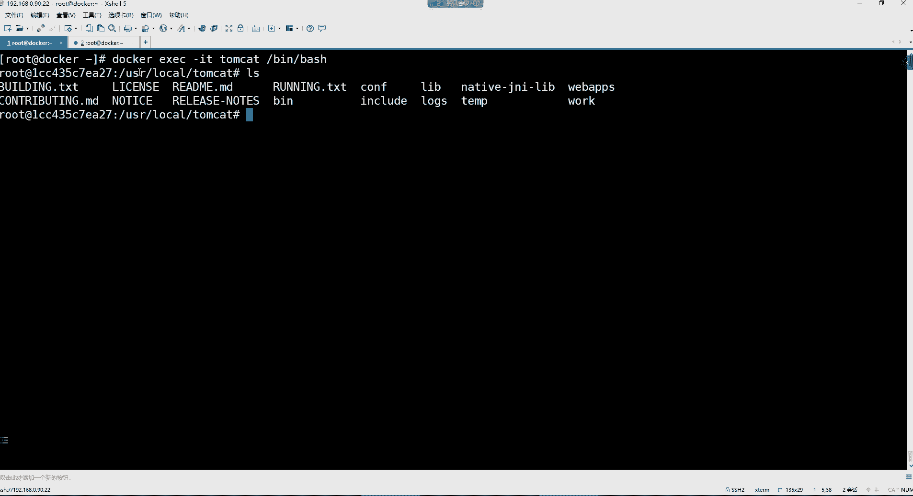

# 【小白入门必备】Linux运维进阶RHCSA+RHCE最全培训教程视频合集 - P99：Docker-5.docker容器数据卷 - 洋洋得IE - BV1nN4y1X7Go

这个路径哈。那日志呢日志也不用拷贝，日志也到时候在启动容器的时候自动生成。但是就是这个ETCmyl录音下的一个配置文件。

会被覆盖。

所以我们就只需要干嘛呢？只需要去。这个拷贝它的这个ETCmys这个目录就可以了。这个目录哈，然后就可以把原先的那个mesl容器给它删掉了。那这里面是不是还有一个位置，就是它的这个主配置文件哈。

这个主片文件我们去是。做了哪几部来着？

在这儿。这是他的主配置文件。

然后呢，这主配文件最终的话呢。由于你拷贝出来是一个链接，肯定是失效的。是哪条命令来着？我这个怎么有点看不清了呢？是这是这个是吧，卖点CF然后接下来呢就是删除了原先的那个卖点CF。

然后又改名。

这个是不是得加一个备注啊？由于my circlecle的。主配置文件。主配置文件。是软链接。拷贝出来那链接。文件。会。时效。所以呢要。再次。拷贝它的原文件。原文件。把它再删掉。再删除掉它的那个。链接。

文见。然后，再对再改名，然后再修改配置文件的名称。哎，这能看懂吧？

好。行了。那我们就把那个麦s容器就可以给它删掉了，用不上了。这会就直接删吧。这个doerRM杠Fmy。删了。PS杠A好，一个容器都没有了是吧？那接下来咱们就开始去创建哈，咱们在这个终端上面创建。

Doker wrong杠ID。杠杠name等于my circle。然后端口映射杠P。3306映射到容器的3306。然后。后边的话呢我们就直接干嘛呢？直接杠V了，杠V就开始给它挂载数据卷了。

但是你可以为了清晰，可以这样左斜线另起一行，开始杠V。第一个挂载。第一个挂载是不是就是把它的配置文件给它挂载回去啊？😊，Doker， my。下的这个目录。比如说我第一个要挂载的就是它的主片文件。

把我宿主机这个下边的mysl目录直接挂载到容器的。ETC的myscle目录里边。好，那是不是整个目录就给它挂过去了呀？这是第一个挂载，然后再另起一行。第二个挂载。😊，还是。

doker下的my circle下的什么呢？data目录。这个目录我压根儿在吗？😡，是不是在这里面压根没有那个data目录啊，没有没关系。😡，你指定的不存在的目录，他会帮你创建。data目录我要干嘛呢？

我要给它挂在那容器的哇下的libb下的my circlecle里边。用于。什么呢？持久化它的数据库那个目录的数据。放在我的数据的这个目录里边。好，这是第二个。第三个杠Vdocker下的。

my circlecle下的。logs这个目录是不是也不存在呀，在这里面是不是也没有那个logs啊，它也自动给你创建。这个我要去存储va的logs的my circlecle目录里面的数据。

然后最后杠E指定。大写的环节变量，这个环境面料是在容器里边。自带的。My circle。Root。Password。等于这是你要给数据库的root设个密码，123456。啊。

最后再指定我们的这个mysql镜像是mysql冒号。5。7。创建。啊DockerPS。是不是运行起来了呀？好，运起来之后。那我们。现在就得验证数据卷的那个路径了呀。看一下。是不是多了data目录。

又多了logs目录啊。好，那你看看这里没有东西吗？data目录。这是啥？是不是数据库里的那些数据呀？好，logs呢。什么都没有。因为他没有犯上错误，所以他没有日质，是不是啊啊？😊，然后那。

这个呢my circle呢。里边是不是这就是它的相关的配置文件了呀？好，那这个我们在金到容器里面看一眼。Doker E， XEC杠 I T my circle便携的 batch。看一下ETC麦ic目录。

没毛病吧，还是这些文件是吧？你看一下这个卖点CF。是不是他的主配文件呢？好，然后。再看va下的lab下mycycll目录，是不是它所有的数据啊？然后mark下的log下mys目录，它没有日志，现在。好。

没关系，出错这日志就自动产生了。那接下来咱们干嘛呢？咱们进到数据库里边呗，my circle。😊，呃，杠Uroot杠P密码123456。

是不是这个密码是我们前面在创建容器的时候，我们指定的呀。

是不是在这儿123456，这ro它密码啊，所以你在容器里边进入到数据库的时候，就是这个密码。然后你瘦。Dataases。建个库。Cate。datase比如建一个。什么呀？加1个DBtest吧。

是不是DBt就建好了呀，建好之后，你看看在它的速主机的那个data里边。有没有多出来一个？叫DBt的一个库啊，有是吧？

呃，不是首次启动数据卷为。

为主，对覆盖容器目录。那。这个data目录。data目录是什么呢？是创建容器以后，注意哈，这是创建容器以后这个数据才产生。

知道吧。

所以呢这个目录不会被覆盖。而它的配置文件就不一样，它配置文件是原先就有你一创建就被覆盖了。😡，但是你要你到时候你可以试一试哈。😊，我给你们试一下啊，我再给你们试一下，你们看效果就知道了。

我们这边咱再建一个my circlel容器不就完事了吗，是吧？😊，我们现在在docker run。然后杠ID杠杠name等于mycyclcle01是吧？然后我们就不做端口映射了呗，无所谓是吧？

反正就测试啊，咱就直接杠V。是吧。创威。呃。但是我咱没有目录啊，是不是？makeDR再跟一下建一个my circle。pas的目录。然后再。

doker run杠ID杠杆name等于my circle01，然后杠V。Mycyclcle test。里边的mycyclical目录这目录是不是空的，啥都没有，是不是啊？好。

或者说就直接让他叫这个名字，康复目录，然呢映射到容器的ETC的my circlecle下边。然后再来。my circle test下的logs映射到。哇下的log一下的my circle这个目录。然后。

mycyclcle test data目录映射到。下的libb下的。麦思烤目录。然后杠E指定mysq密码。My circlecle root。Password。123456。然后镜像。

My circle。5。7放线。Docker P。哎。没有跑起来呢。PS杠1。是我哪里搞错了吗？my circle。哪儿。啊，W word是吧？word创建。dokerPS跑起来了吧。

跑起来之后咱也没有对做灯火映射是吧？那咱就看看数据mycyclcle test下边是不是这三个目录都有啊？但是countf里面是空的。data里边有数据。看到吗？logs里面呢日志嘛也没有。

那么我们这边如果进到它的容器里边的。doker EXEC杠ITmy01并写的bitch。你看一下ETC的mycle里边啥都没有。被覆盖了。也就是说my circlel的配置文件没了。呵。😊。

my circlecle杠U rootot杠P。123456。但是数据库你还能进。啊。对呀，你下次启动就有问题了。😡，没有配置文件了。所以。你是不是？

哎。得把它的配置文件提前，就像我们这种方式是不是得给他。

拷贝出来呀，不然你挂载不就完蛋了吗？😡，是吧。好。删掉吧。doker2M杠Fmy01。啊，一般像什么日志文件，不需要提前给他拷贝时，主要就是配置文件。😡，好。

这是哎那这个数据库我们从外部是不是也可以正常访问呢？你想想我们这个端口都已经映射了呀，3306嘛是吧？你如果你有这种外部的什么什么circle yoga呀，你是不是可以连它呀？😊。

把这删掉。新建一个链接。新建一个哈，比如说连docker。连哪个呢？192点。这样吧，连my circle。然后。随便是不是啊，名字无所谓嘛，地址是哪个地址，192。168。0。90。

这是这个容器的速主机的地址。然后用root连密码呢，数据库密码是123456，端口3306，没毛病吧。好，先测试一下。是不是能够他说connection success play啊，能够正常连是吧？

那你就连一下。是不是就进到了容器的数据库里边来了呀？没错吧，你看。这里面是不也可以看到那个叫DPt的库啊？没错吧。是不是就通过外部的那种方式连到了这个容器的数据库里面来了呀？

是不是啊？所以后续想管理数据库。你虽然说我的数据库是以容器的方式部署的，但是呢我的数据是不是都在我的这个。速乳剂里边持久化的保存下来了呀。没错吧。那后续这数据你是不是可以该备份就备份了呀？

而后续你说那我们对于容器的数据库管理，那是不是通过这种工具就连呗。你在这里边你想建表。😊。

是不是啊？你想建表的话，这里面你就有线。建表呗是吧？在这里边比如表名。Hello。是吧。然后这个什么引擎字负集啥的。这些都无所谓，什么数据类型。列名，那这表里面得有列，是不是啊？比如说姓名。年龄。

类型姓名呢就肯定是这种叉类型的年龄呢就是这种。in特类型的是吧？长度啥的就无所谓了吧，这长度十。就俩字段呗，主件什么的都不要了，保存。哎哎，是不是有一个hello这个表啊？是不是？这表这表就不见了哈。

hello，这个表哈。这表里边反正啥也没有是吧？有姓名字段、年龄字段。正常是不是可以操作，然后你这边你看他同步了吗？😡。

这表儿。你右色的。DB。t里边你瘦。tableables是不是看到hello这个表了呀？

没毛病吧，是吧，该管理不就管理了吗？想想往里面写数据是不是就。😊，写数据吗？

行了，那这是数据库的操作。😊，然后。

那我们还要布署什么呀？我们还要这个。

部署这个NDS。哎，这个数据库这位置你们有没有什么问题啊？嗯。有没有问题没有问题，刷个一。有问题的。把你们的问题发上来。有什么问题吗？嗯，有吗？没有问题的给我刷一哈。咱们部署NS。有吗？你们看来。

怎么感觉你们先是有问题呢？然后又说不上来呢，是吗？有问题就往这发哈。没有我们就。继续了。密码。嗯。Hao。没什么问题是吧？行。它是环境没亮。

密码是通过环境变量设置的。

就是。如果我们想看这个容器里边的环节变量，我们前面在第一章有一个命令。是在。这儿。这是看它环境变量的docker。意。

其实你进到容器里面也可以看。你比如说我看内命令可不可以用啊，docker。😊。

嗯。

EVEN。MyC。不行。就是。得进到容器里边。DNV。看到吗？因为不就是看我们所有的环境变量吗？这个环节变量都是在这个mys里边自带的环境变量。

你比如说my circleql的密码就必须得放在这个环节变量里边。看到吗？然后这是他的这个。版本。所在的目录。

是它里边就自带的。然后接下来呢我们来说入那个部署这个那个啥按键S哈。部署完S的话也非常简单。这个你看哈这几个步骤呢，我们先捋一遍。第一呢创建一个数据卷目录。然后呢。

把我们所需要的配置文件先给它从容器里面拷贝出来。因为你NDS的配置文件我们是没有的。你如果像mysl一样，你同步它的配置文件就被覆盖了。所以提前把配置文件给它CP出来，然后呢再把原先的容器给它删掉。

然后呢再创建一个新的容器，挂载相关的数据就可以了。所以我们现在。

就第一步，你看我们先docker run。杠ID。杠杠name等于NS。呃，这里面也不需要做什么端口映射了，直接指定NDS的镜像1。22。1。好，然后创建好了之后。看一下。运行了是吧。

dokerEXEC杠IT按键S指定并行的。然后呢，这里边。我们在他的在我们的这个素主义里边。makeDR再跟一下创建一个docker下划线NS的一个数据点目录。啊。

接下来呢我们要先在这里面建一个c目录去。这里面啊来一个抗复目录，用来保存它的配置文件的。啊，这我们看一眼哈，跟一下的dockerNS。好啊，接下来呢把它的配文件先给它拷贝出来呀。

是在这个ETC下的NES。我我我们能不能直接把整个目录给它拷都给它拷贝出来呀？😡，是不是也可以啊？好，所以直接把整个目录拷贝出来吧。那我们就直接2M杠2F。它这个在容器里面的名字叫ETCNGS。好。

那我们就直拷贝吧哈呃dockerCP然后。指定NGS这个容器的ETC的NS目录，拷贝到我当前的根下的刀cker。NS的康复里边。然后看一下。是不是拷贝出来了呀？拷贝出来之后。model是什么情况。

看看啊。model也是个软链接。这里面没有这个LL。看一下啊。而是userlocal下的model。这是一个软链接的一个目录。啊。那你这种东西你没办法，你也得拷贝。好吗。把这个us色local。

Model。考不到康复里边。嗯。考不到康复的。NS里边吧。不太行是吧？那先把这个里面的东西给它删掉，2M杠2F把这个NDS里边的。model它删掉，然后再拷贝一下。好，然后再看一下。行。

是不是该有的都给它拷贝出来了呀？然后其实我们可以这样。咱们直接把这个NS里的所有内容移动到哪儿呢？dker n康复里边不就完事了吗？是不是啊你非得搞那么多层目录干嘛呀？😡，然后的话呢。

你再把原先的这个N加森目录给它删掉。咱们速主一品，反正这种东西你叫什么无所谓。然后你再看的时候。是不是就可以了，这不就是NES的所有的配置文件了吗？😊，那剩下还有什么需要拷贝的吗？没了。

NS最重要的不就是它的配置文件吗？😡，是不是啊还有就是它的什么日志文件哇写的log小NS，这个到时候自动生成。😊，所以这就可以了。好，那么接下来我们这边不就是可以创建了吗？那退出。然后把容器删掉。

不用创建。我们这个里的所有东西都给它拷贝出来了。看到吗？到时候你再给它映射进去就可以了。😊，这是它的相关模块嘛？这不就是。然后。我们这边。把原先的那个给它删掉。好，删在之后的话呢。

再重新创建doker run杠ID杠杠name等于你S，然后端口映射这时候得做端口映射了。这个呢咱们用80端口行吧，80映射80，然后呢。开始做数据卷挂载。那杠V我们要挂载的是。Doker。

NS下边的com复目录挂载到容器的ETC的NS里边，没错吧。然后接下呢，还有就是第二个是docker下的NS。里边的logs。这个作为他的这个日志的目录，但是这个是不是现在是没有啊？

是不是在这个大ro克N加4里面没有那个los啊，那他自己创建去吧。😊，然后映射到容器的。哇小到log下到N里边去。嗯，还有什么呢？

没了是吧NGS相对来讲比较简单。

啊，还有一个网页目录是不是？兄弟们网页目录咱们也得去。😊，需要挂载一下吧。你往容器里面同步个页面啥的，是不是？然后docker下的ES下的HTM映射到。优势。sharedNDS的HtL里边。可以了吧。

然后接下来呢镜像。1。22。找你。Doer P。N4就。创建完了，创建完成之后，咱们是不是得进去看一看呢？😊，doker EXEC杠ITN变一下的bitch。进来之后呢，看一下配置键。该有的也都有。啊。

看他的模块。model是不是该有的都有啊？好，接下来。😊，呃。然后还有什么呢？他的这个其实其他也没什么，反正他的网页文件肯定是没了。优色share NGS的Hmail里面，这肯定空了。

因为我们映射的是一个空目录嘛，所以这里面的数据就没了。然后va下的log下的日志，这无所谓。他有那咱们的宿质里面就会有。所以你看这里边到时候这三个目录啊，一个是存储它的配置文件的。一个呢是存储它的。呃。

日志文件的一个是存储它的网页文件的。没错吧。那你现在访问NS是不是可以正常访问呢？因为他现在是干嘛呢？我们把我们的本机的80给他。

使用了。所以这时候你在访问的时候，你看这2。168。0。90的这80端口就不用干了吧，但是没有页面是吧？啊，没有页面的话，那肯定是产生日志了呀。

日志。在它的access里边。NS logs的acet里面。开哈。是不是有一条访问记录啊？虽然说。这个。访问出现什么403这个报错了，但是是不是也是有记录啊？是不是就给他同步过来了呀？好。

那我们现在给它传个页面呗，传个页面，这时候就简单了。你把页面放在哪儿啊？😊，你CP把这个抽奖页面。拷贝到。这里的所有内容。卡不到哪儿啊。拷贝到dockerNS的HTM里边。是不是就完事儿了呀？啊。

这里面还有个目录。有目录还那有杠R。好。然后看一下这个路径。是不是页面现在放在了我们的这个。数据卷这个目录里面了呀，那放在数据卷，那看它有没有同步哈。😊，好，是不是同步到容器里边来了呀？

那同步到容器里边，你再刷新的时候，是不是就看到页面了呀？😊。

是不是？那后续你如果想改NS的配证键。那你这还不简单吗？你进到它的数据卷目录。是吧你想改它的NS点com。嗯。改什么呀，好像也没什么可改的是吧？😊，比如比如说改这个啊。改成。2048。打开文件的数量嘛。

是吧，或者说叫连接数嘛。完事儿了。完事儿配置文件同步了吗？ETC下载NS下载NS点儿com。是不是变成2048了呀？没错吧，没毛病。是吧。但是注意这容器得重启才能生效哈，它配置同步了。

但是注意这进程得需要精力重启才可以。所以多你得dcker跟上NGS重启一下这个容器，这个配置才真正生效。知道吧。这是。NGS这个容器，我们通过数据卷部署的那后续你还会担心NGS。

比如我们后续还需要用什么VNM。这还用得上吗？是不是压根都用不上的东西？是吧。嗯。🤢，所以我们这个就是有了数据卷，你们有没有感觉是不是我们对于容器的管理也会变得非常方便了呀？😊。

你想想我们后期你说我们还需要进到容器里面吗？😡，我是不是都不需要进到容器里边了呀？我没有必要啊，我进去干嘛呀？😡，是吧该改配置的在在我的数据卷目录一改不就完事儿了吗？😡。

是不是啊啊？😊，然后部署t们 cat的话呢，也非常简单。😊，他们看的话呢就是第一步铺京像。有了进样之后的话呢，给当他他们ca建一个数据卷目录去。

啊，make点R再跟下建一个docker。他们开他。接完之后，那是不是得来个汤不开的容器呀？doker run杠ID杠杠name等于t cat，然后我们也不需要做端口映射。

因为我现在需要是拷贝它的一些数据。所以就直接这个指定它的镜像。是他们开。完事儿。然后看一下。好，也跑起来了，然后进到这个里边。EXEC杠IT。他们看他。变形的拜ch。进来之后，他们看。

因为他这里面的部署呢，就是所有东西都放在这个一个目录里边了。😊。

所以我直接把这整个目录拷贝出来就可以了。😊。

就直接在这儿。

刀呃这个doker。CP指定把tca这个容器的哪个路径呢？就是我们进到的这个路径默认情况下，这是我们首次进到的这个路径，就是它的所有数据的存放的位置。

把整个目录拷贝到我们的docker下的t cat里边就完事了。然后看一下这里面是不是有他们看的目录啊。😊，好，然后这里面的数据呢就是他们开头的所有数据了。😊，它的日志就在这个logs里边。

它的配置文件就在这个countf里边，它的程序就在这个里边，然后它的网页目录就在这儿。好，那接下来我是不是这个容器就用不上了呀，退出。然后给它删掉2M杠F。逃不开的。上那之后。

我这边是不是就开始去创建它了呀？看一下镜像，因为他镜像名字比较奇葩，看到吧？doker run杠ID杠杠name。等于。Time们 cat。然后。端口音设得做8080。映射到8080。呃。然后就是这个。

数据卷经挂载了，其实这些数据卷挂载就不用折行了，就一一行就可以了。杠V指定把。Doer。他们开。下载他们看看目录，直接给他。挂得容器的。优色。local他们开在里边。就完事儿了，然后镜像是。他们看他。

嗯，还有什么没了。完事了。DoerPS。他们看到跑起来了啊，跑起来之后访问一下。

这个地址的换个端口是。8080了。

是不是他们看到页面。没错吧。

日志呢？Soer。他们看一他。logs呃这个t cat logs里边有一个local。Los。这是他的防日志。是不是有条房记录啊？哪个地址在什么时间？发送一个get请求，状态码200。没错吧。

那后续他们看头的数据。你如果有需要的话。或者说你想给他这个，比如说放一些页面的话。是不是就放在这个里边就可以了呀，放在这个webAP里边。是不就可以了呀？再就是通过容器的方式去部署这些常见的服务。

这位置现在思路能跟上吗？啊，兄弟们思路能跟上的，先来刷个一啊。思路已经。跟不上的吊车的了，刷2啊。啊，还可以，是不是啊？

可以就行哈，没吊车就行啊。反正现在是不是知道数据卷它的作用是啥了呀？😡。

没错吧，是不是可以实现数据立刻同步啊？是不是啊？然后是不是你要说解决多容器直接文件交换的话，其实你到时候你。😡，在创建容器的时候，你这一个目录挂载多个容器就可以了啊，吊车怎么办？吊车就得反复听。

就是这个咋说呢？我们说复学习这东西呢这个。就是这个理解能力固然重要，但是复习更重要。你理解能力差一点，可能说你说我这这个跟不上老师的节奏，但是你复习的时候，你可以。对。反复的去自己去加上自己的思考啊。

呃，然后呢带着自己的问题去这个搜一搜啊，这样才可以哈。所以这就很正常。我刚开始的时候，我比你们还笨，知道吧？我比你们还笨呢。😡，这种东西就是得我们说什么呢？就是。😊，多练习。多理解。好久没听课了是吧？

没关系啊。你现在不有时间了吗？就是你这些东西怎么可能一下我给你讲一遍，你就明白了。那不那这东西还有什么难度吗？😊，是不是啊？没什么难度系数了呀，这就。😡，那不大家都会了吗？😊，如果大家都会的话。

你还是不是？这东西不就烂大街了吗？所以就是因为有些人一学这东西就犯困。啊，一听这东西就跟催眠一样，就不行了啊，就要睡觉。😡，学不了。Yeah。😊，好，这是数据源。

然后这个下边的话就是docker file定制镜像。那我们把这录屏停一停。

