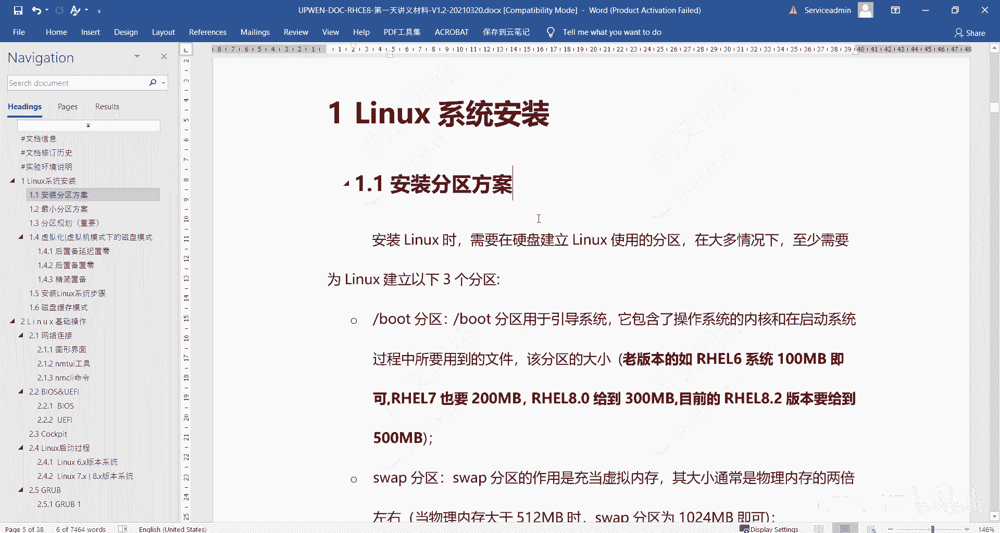
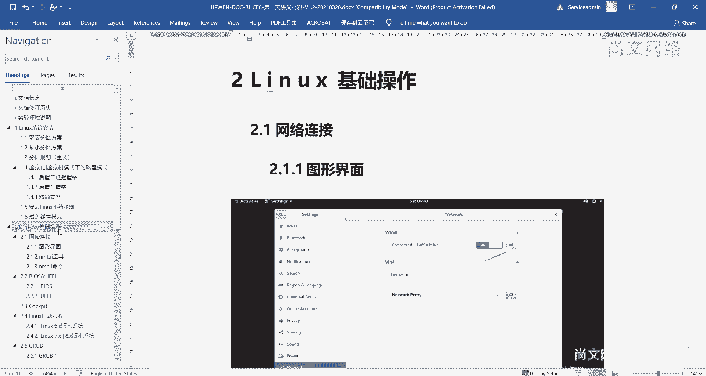
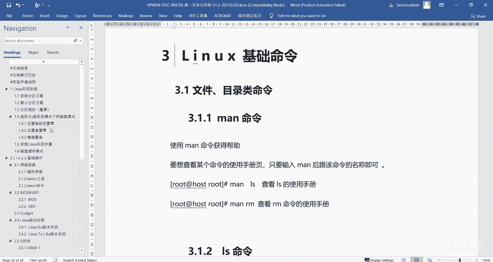
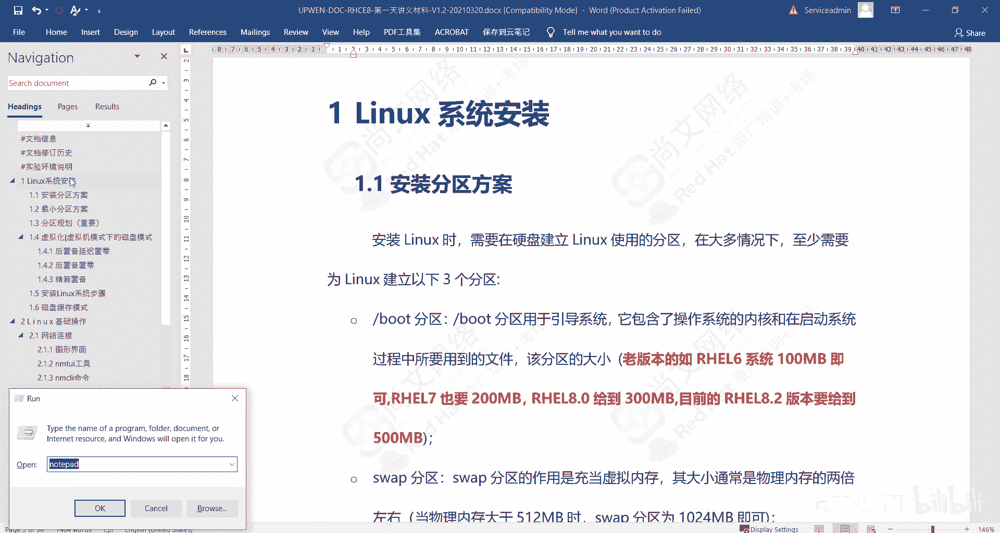
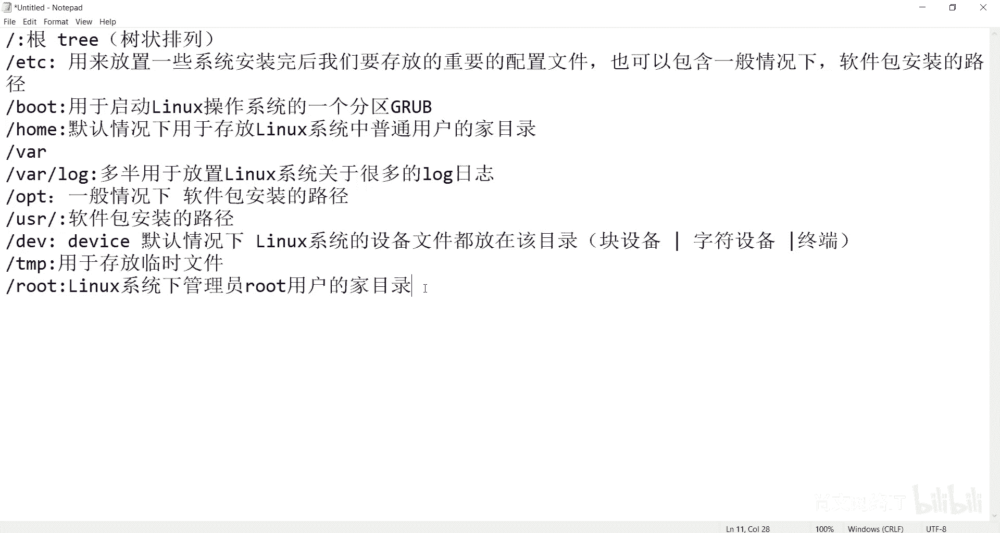

# Linux运维基础：01：Linux文件分区结构 📂

在本节课中，我们将要学习Linux操作系统的文件分区结构。理解分区的作用和规划是系统安装和后续运维的基础。我们将介绍Linux中几个核心目录的功能，并解释其树状结构的组织形式。

## 系统安装与分区规划概述

上一节我们介绍了课程的整体安排，本节中我们来看看系统安装前的关键准备工作——分区规划。安装Linux操作系统时，合理的分区方案至关重要。如果前期没有规划好每个分区的大小和用途，后期可能需要重新安装系统。

Linux操作系统采用一种树状结构来组织文件。最顶层的目录称为“根”，所有其他目录和文件都从根开始分支。

## 核心目录功能详解

以下是Linux系统中一些关键目录（分区）及其主要功能的介绍。

*   **`/` (根分区)**：这是整个Linux文件系统的起点，所有其他目录都挂载在根目录之下。
*   **`/etc`**：主要用于存放系统重要的配置文件。它也可以包含某些软件包的安装路径。
*   **`/boot`**：用于启动Linux操作系统的分区，包含了启动加载器（如GRUB）和内核镜像等关键文件。
*   **`/home`**：默认情况下，用于存放Linux系统中普通用户的家目录。
*   **`/var` 或 `/var/log`**：主要用于放置Linux系统的日志文件。在进行大数据等项目时，此目录可能变得非常大，因此常被规划为独立分区。
*   **`/opt`**：一般情况下，是某些软件包的安装路径。
*   **`/usr`**：也是软件包常见的安装路径。
*   **`/dev`**：默认情况下，Linux系统的所有设备文件都存放在此目录下，例如块设备（硬盘、分区）和字符设备（键盘、终端）。
*   **`/tmp`**：用于存放临时文件。
*   **`/root`**：Linux系统管理员（root用户）的家目录。

## 树状结构与文件查找

由于Linux采用树状结构组织海量文件，掌握文件查找命令变得非常重要。例如，`find`命令是搜索和定位文件的强大工具，后期需要重点学习。

本节课中我们一起学习了Linux文件系统的核心分区结构。我们了解了根目录、`/etc`、`/boot`、`/home`等关键目录的作用，并认识到合理的分区规划对系统稳定运行的重要性。同时，我们理解了Linux文件系统的树状组织形式，这是后续学习文件操作和管理的基础。