# Linux运维：RHCE8：02.磁盘分区相关知识 💾

在本节课中，我们将要学习Linux系统中磁盘分区的核心概念。我们将从分区类型、磁盘接口、Linux下的设备标识方法等方面入手，帮助初学者理解磁盘管理的基础知识。

## 概述

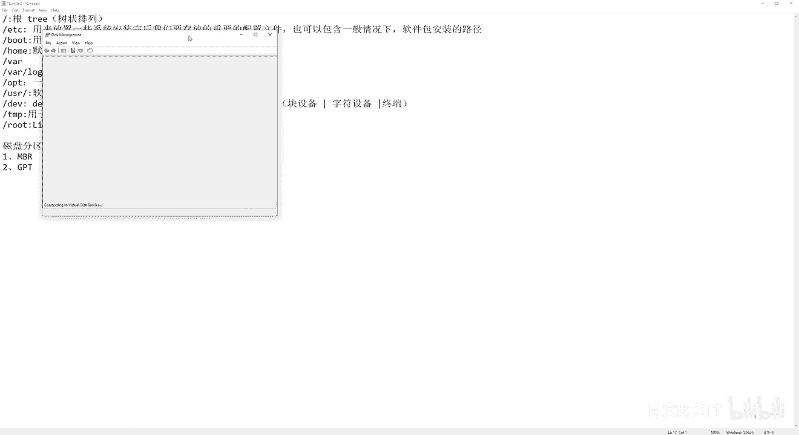

上一节我们介绍了Linux操作系统的目录结构。本节中我们来看看如何将不同的目录结构（如 `/boot`、`/home`）对应到具体的磁盘分区上。这涉及到磁盘分区的规划与管理。

## 磁盘分区类型

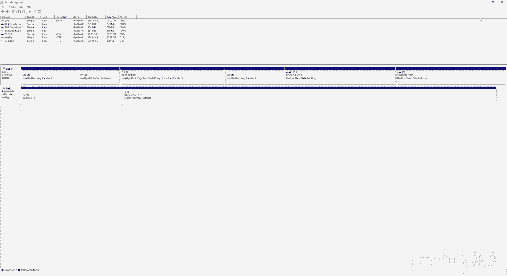

首先，我们需要了解磁盘分区的两种主要类型。

以下是两种主要的分区类型：
*   **MBR**： 主引导记录。
*   **GPT**： GUID分区表。

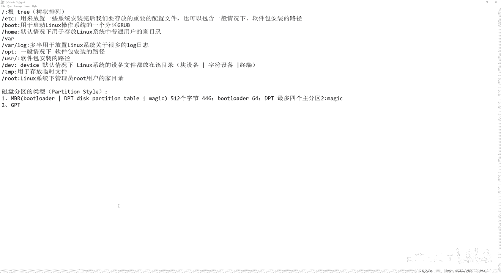

在Windows操作系统中，可以通过磁盘管理工具查看磁盘的分区类型。例如，在“磁盘属性”中，`Partition style` 字段会显示是 `GUID Partition Table (GPT)` 还是 `MBR`。

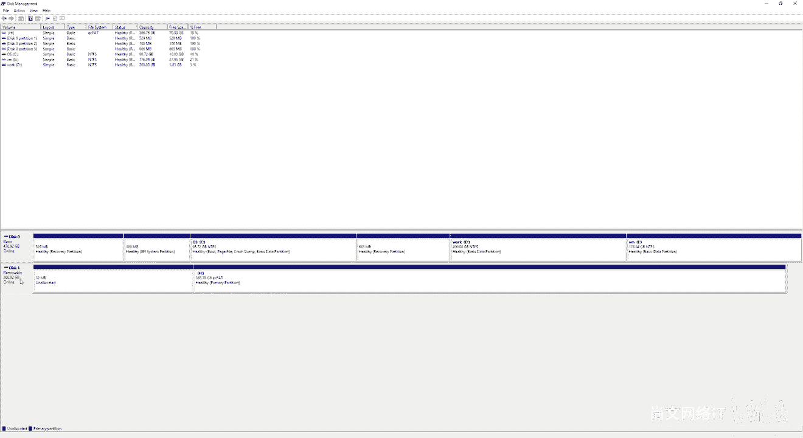

### MBR分区详解

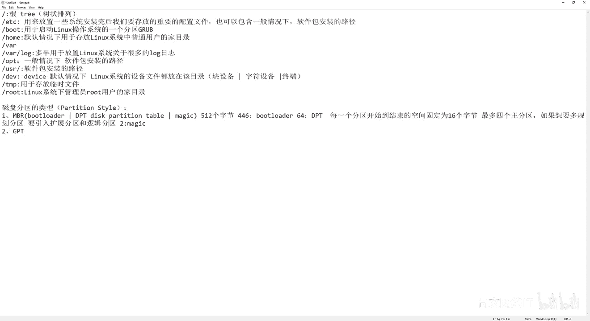

MBR分区结构固定为512字节，其组成部分如下：
*   **前446字节**： 存放引导加载程序（Boot Loader）。
*   **中间64字节**： 存放磁盘分区表（DPT）。
*   **最后2字节**： 用作魔数校验（Magic Number）。

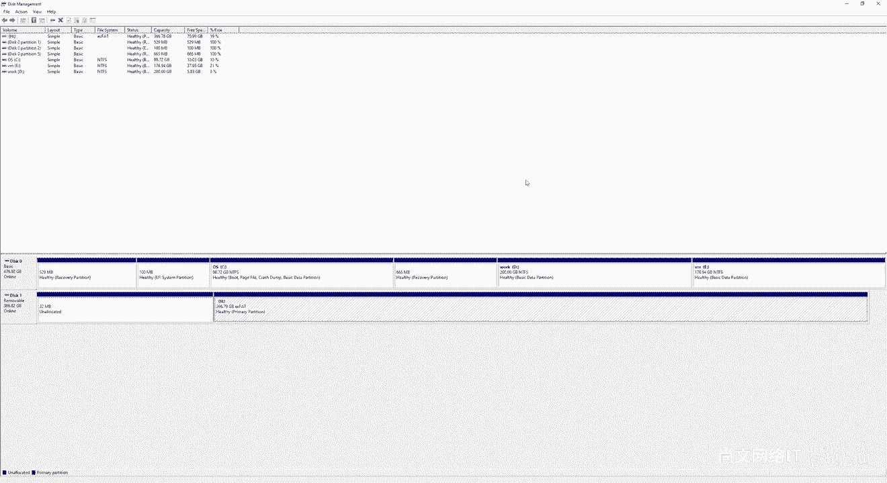

由于分区表（DPT）只有64字节，而每个分区的记录固定为16字节，因此决定了MBR分区模式的一个关键限制。

以下是MBR分区的核心限制与概念：
*   **主分区限制**： 最多只能创建4个主分区（64字节 / 16字节 = 4）。
*   **扩展与逻辑分区**： 当需要超过4个分区时，必须引入扩展分区。扩展分区本身不直接存储数据，而是作为容器，在其内部可以创建多个逻辑分区。
*   **Windows与Linux的区别**： 在Windows系统下，扩展分区不能被直接分配盘符（如C:， D:），只有逻辑分区可以。而在Linux系统下，MBR模式中的主分区和扩展分区会共享1到4的编号。

### GPT分区详解

GPT是新一代的分区标准，它克服了MBR的许多限制。

以下是GPT分区的特点：
*   **无传统分区概念**： 没有主分区、扩展分区、逻辑分区的严格区分。
*   **分区数量多**： 最多可以划分128个分区。
*   **功能更强大**： 在分区容量支持、数据安全性等方面优于MBR。

## 如何选择分区类型

了解了MBR和GPT的区别后，我们来看看在实际场景中如何选择。

以下是选择分区类型的两个主要考量维度：
*   **磁盘容量**： 2TB是一个关键分水岭。对于小于2TB的磁盘，可以考虑使用传统的BIOS+MBR模式。对于大于2TB的磁盘，建议使用UEFI+GPT模式。
*   **系统固件**： 老旧的主机通常使用传统的Legacy BIOS，更适合MBR。较新的主机支持UEFI，更适合GPT。

## 磁盘接口类型

在规划分区之前，我们还需要了解物理磁盘的接口类型，因为这在Linux系统中会影响设备的命名。

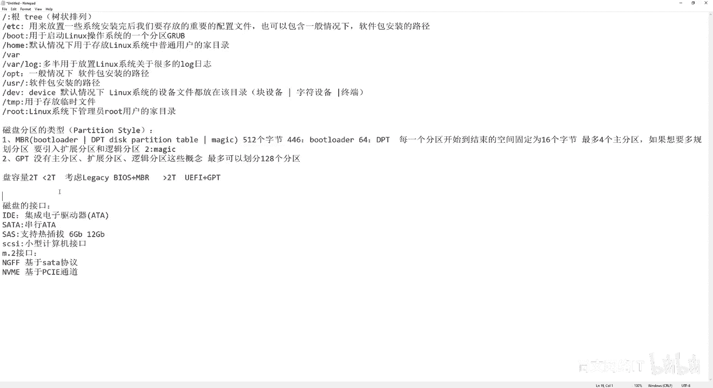

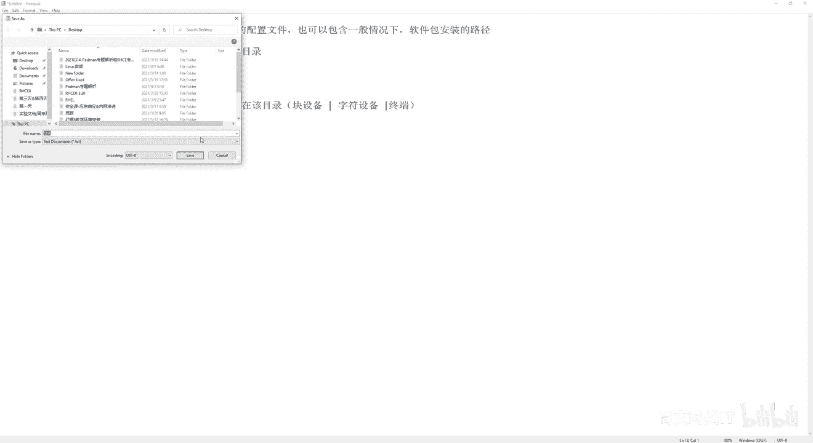

以下是常见的磁盘接口：
*   **IDE**： 早期个人电脑常用的并行接口。
*   **SATA**： 串行ATA接口，取代了IDE，是目前个人电脑和服务器的主流接口之一。
*   **SAS**： 主要用于服务器，支持热插拔，性能和可靠性更高。
*   **SCSI**： 小型计算机系统接口，常见于老式服务器或工作站。
*   **M.2**： 一种新的物理接口形态，其协议可以是SATA或更快的NVMe（基于PCIe通道）。

## Linux下的磁盘与分区标识

Linux系统通过 `/dev` 目录下的文件来标识磁盘和分区。标识规则结合了接口类型和顺序。

### 磁盘设备标识

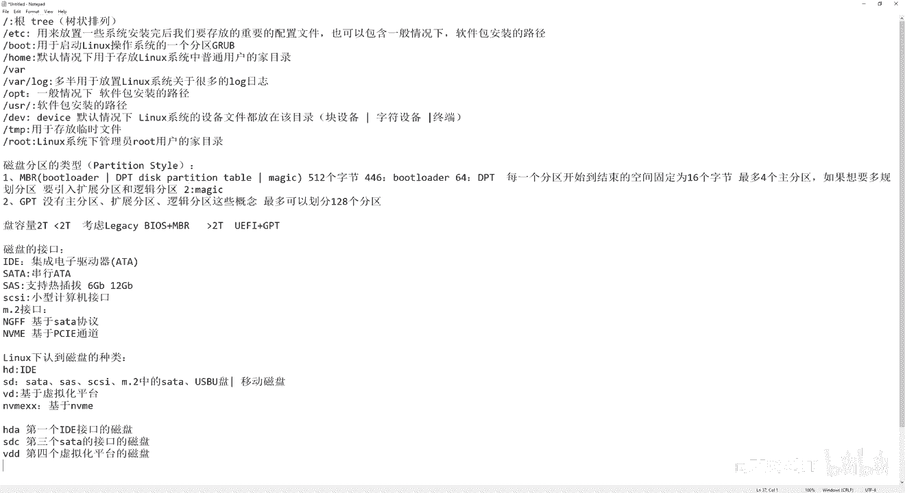

不同的接口类型在Linux中有不同的前缀。

以下是常见的设备标识前缀：
*   **`hd`**： 代表IDE接口的磁盘（如 `hda` 表示第一块IDE盘）。
*   **`sd`**： 代表SATA、SAS、SCSI、USB以及M.2（SATA协议）接口的磁盘（如 `sda` 表示第一块此类磁盘）。
*   **`vd`**： 代表虚拟化平台（如KVM）提供的虚拟磁盘。
*   **`nvme`**： 代表NVMe协议（通常是M.2形态）的磁盘（如 `nvme0n1`）。

字母 `a`， `b`， `c`... 表示磁盘的顺序。例如，`sda` 是第一块SATA盘，`sdb` 是第二块。

### 分区标识

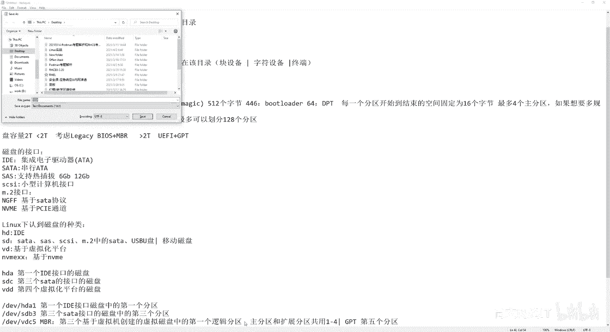

在磁盘设备名后加上数字，就表示该磁盘上的分区。

以下是分区标识的示例与规则：
*   **`/dev/sda1`**： 表示第一块SATA磁盘上的第一个分区。
*   **`/dev/sdb3`**： 表示第二块SATA磁盘上的第三个分区。
*   **MBR模式下的特殊规则**： 编号1-4预留给主分区或扩展分区。第一个逻辑分区总是从5开始，无论前面的1-4编号是否用完。例如，`/dev/sda5` 就是第一块SATA盘上的第一个逻辑分区。
*   **GPT模式**： 没有主/逻辑分区之分，分区号从1开始顺序编号。

## 从分区到文件系统

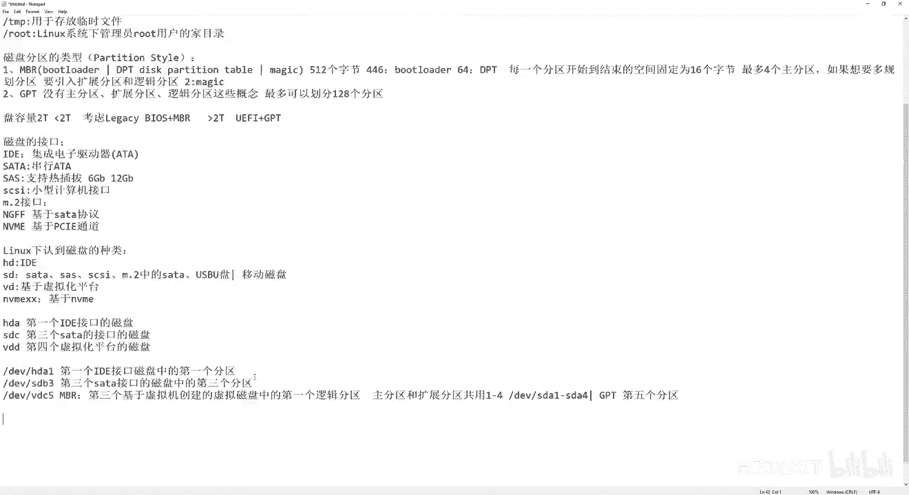

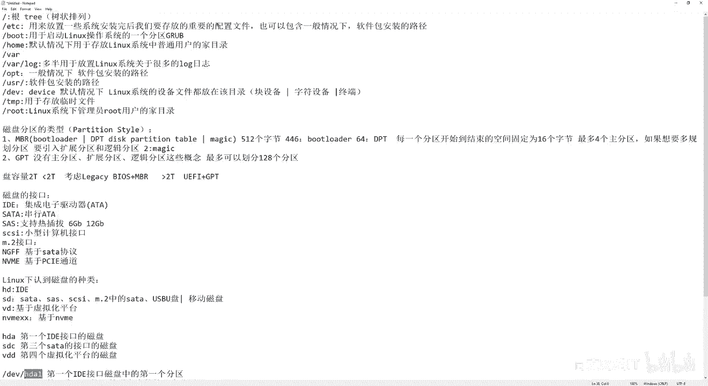

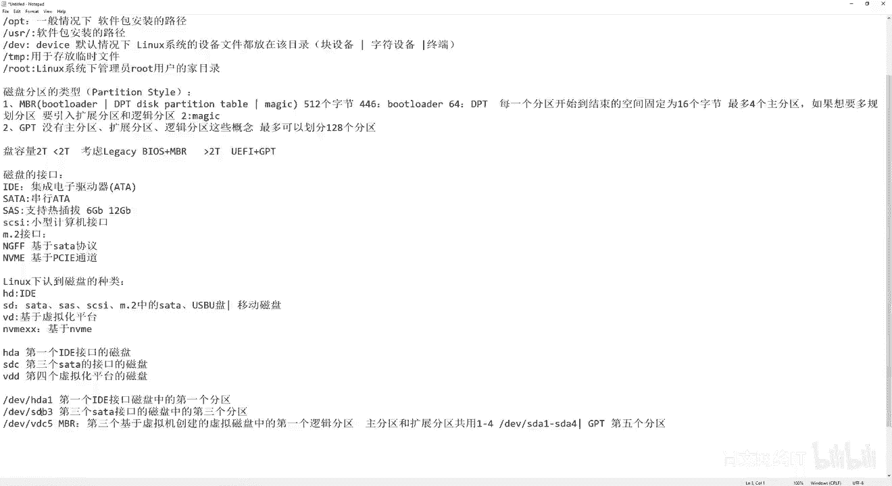

上一节我们介绍了磁盘如何被标识。本节中我们来看看分区之后的关键步骤——创建文件系统。

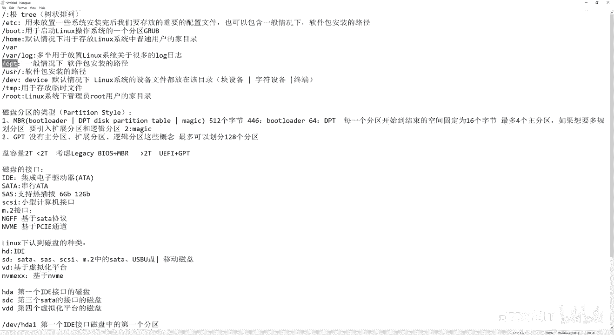

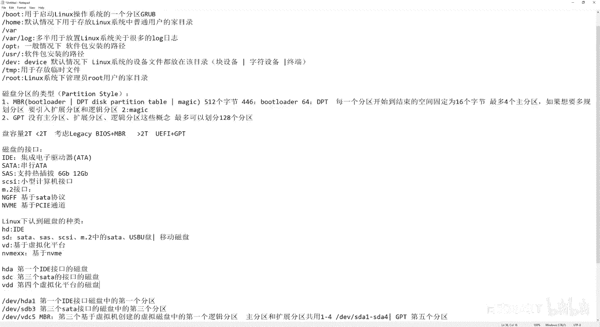

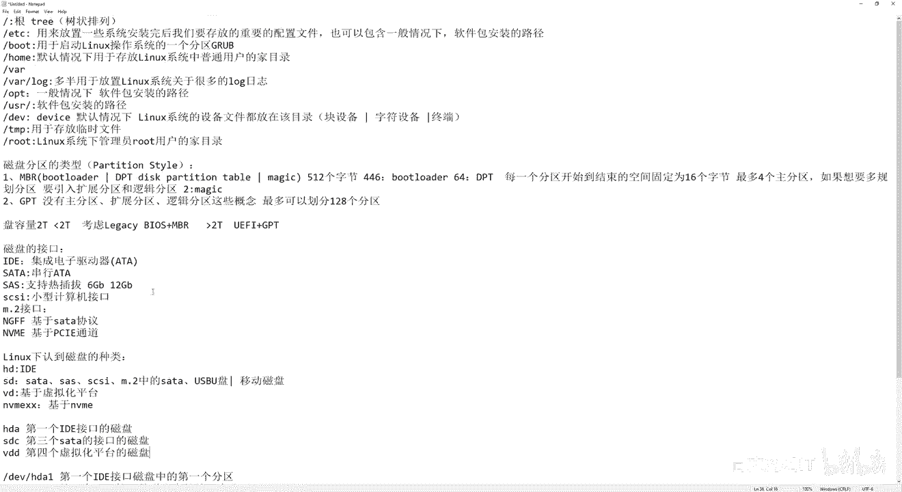

分区只是划分了存储空间。要让操作系统能够使用这个空间来存储文件，必须在分区上创建文件系统，这个过程通常被称为“格式化”。常见的Linux文件系统有ext4、XFS等。创建文件系统后，才能将其挂载到如 `/home`、`/boot` 这样的目录上，供用户访问。

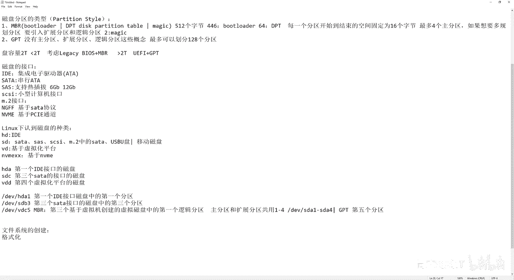

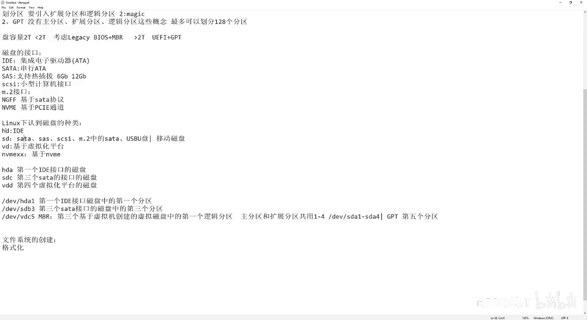

## 总结

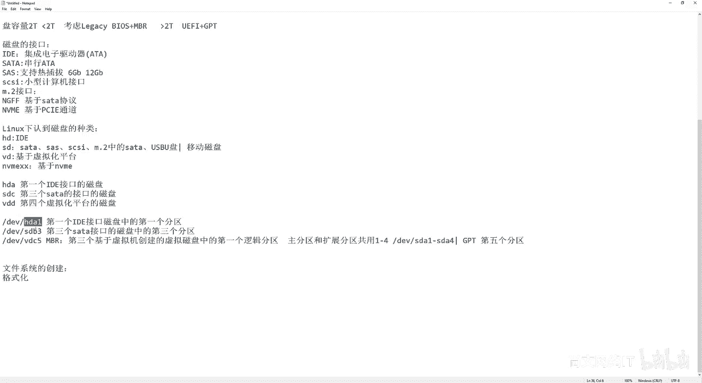

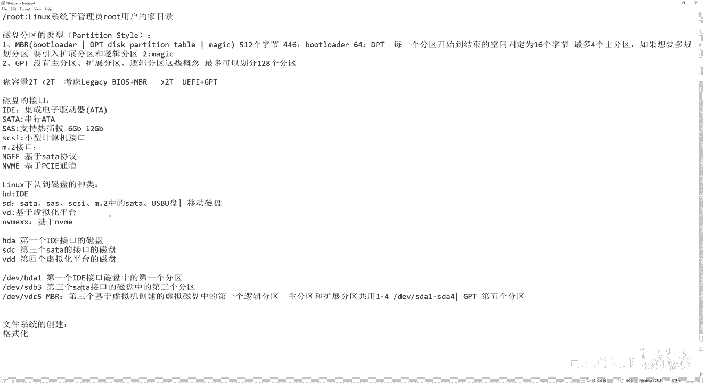

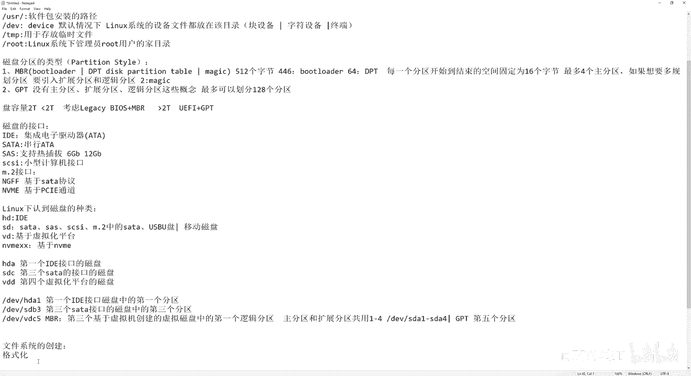

本节课中我们一起学习了Linux磁盘分区的基础知识。我们首先了解了MBR和GPT两种分区类型的结构与区别，然后探讨了如何根据磁盘容量和系统固件选择分区类型。接着，我们认识了不同的磁盘接口及其在Linux中的标识方法（`sd`， `hd`， `vd`， `nvme`），并详细说明了磁盘和分区的命名规则，特别是MBR模式下1-4编号的共用原则以及逻辑分区从5开始的规则。最后，我们指出了分区之后需要创建文件系统才能使用的关键概念。掌握这些知识是进行Linux磁盘管理操作的重要基础。