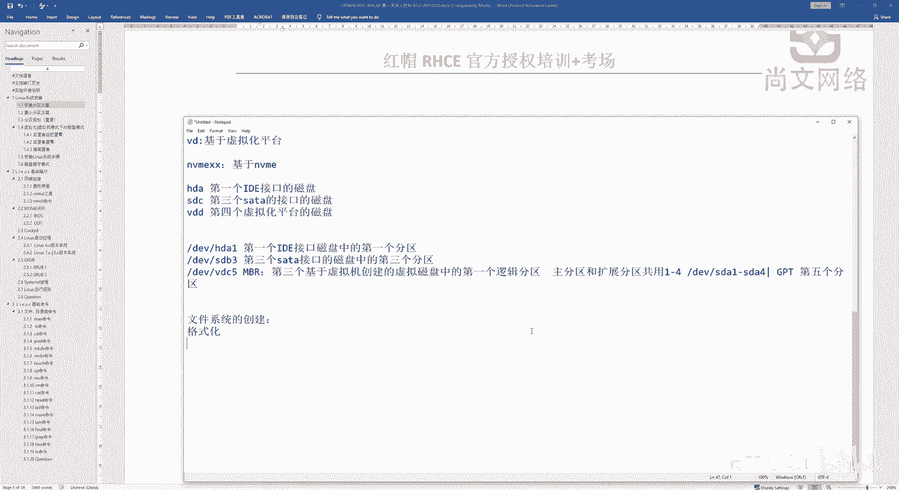
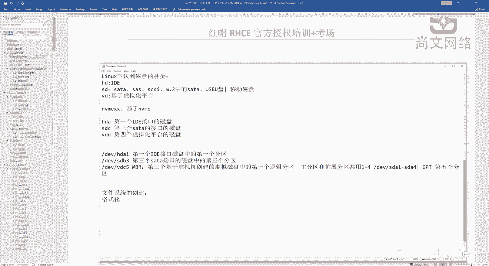
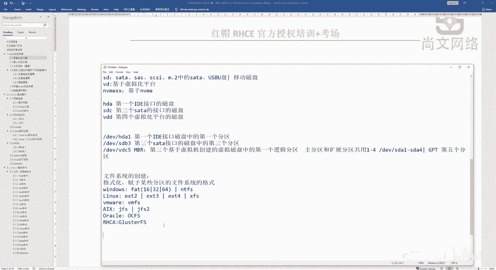

# Linux运维基础：03：文件系统类型知识 📚

在本节课中，我们将要学习文件系统的基本概念、常见类型以及格式化操作的目的。理解这些知识是后续进行磁盘分区和管理的基础。

## 从分区到格式化 🔄

上一节我们介绍了磁盘的分区类型和接口。在完成分区之后，我们需要对分区进行格式化操作。

格式化的目的是为指定的分区赋予特定的文件系统格式。只有经过格式化的分区，操作系统才能识别并使用它来存储和管理数据。

## 常见的文件系统格式 💾

以下是不同操作系统中常见的文件系统格式：

*   **Windows 系统**：FAT16、FAT32、exFAT、NTFS。
*   **Linux 系统**：EXT2、EXT3、EXT4，以及目前广泛使用的 XFS。
*   **虚拟化平台**：例如 VMware 的 VMFS。
*   **其他系统**：例如 AIX 小型机的 JFS/JFS2，Oracle 的集群文件系统 OCFS，以及分布式集群文件系统 GFS 等。

这些格式定义了数据在存储设备上的组织方式。为分区赋予文件系统格式后，我们才能挂载并使用这些分区，包括硬盘、光盘、U盘等各类存储设备。

## 课程总结 📝

本节课我们一起学习了文件系统的核心概念。我们明确了格式化操作的目的，并了解了多种常见的文件系统格式。从磁盘接口、分区类型到文件系统，这些知识构成了存储管理的基础逻辑。

接下来，我们将进入实践环节，着重讲解在 Linux 操作系统安装过程中，如何规划并实施具体的分区方案。