# Linux系统安装与分区方案：04：Linux系统安装分区方案 📚

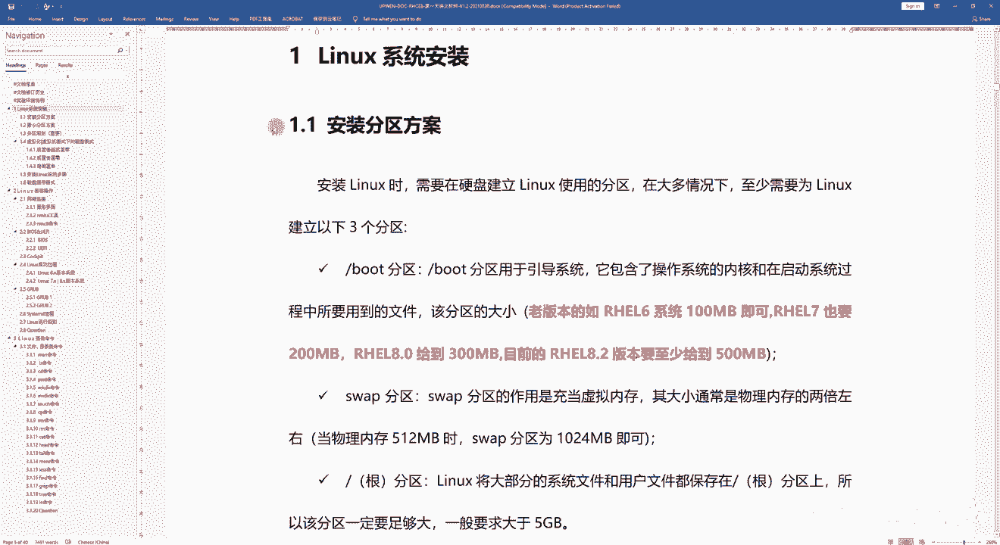

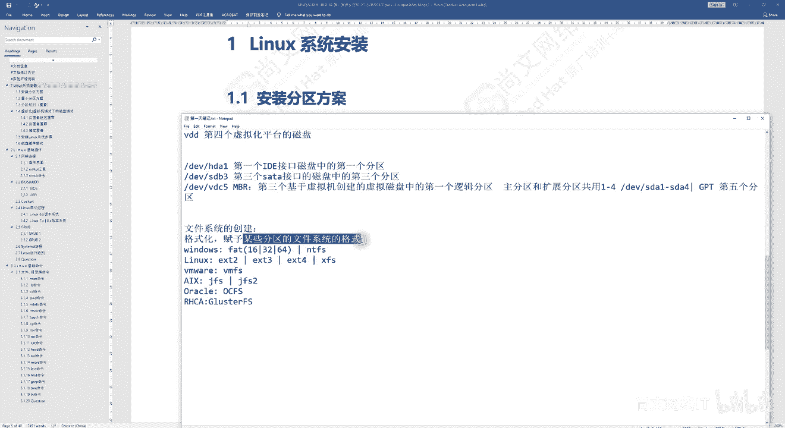

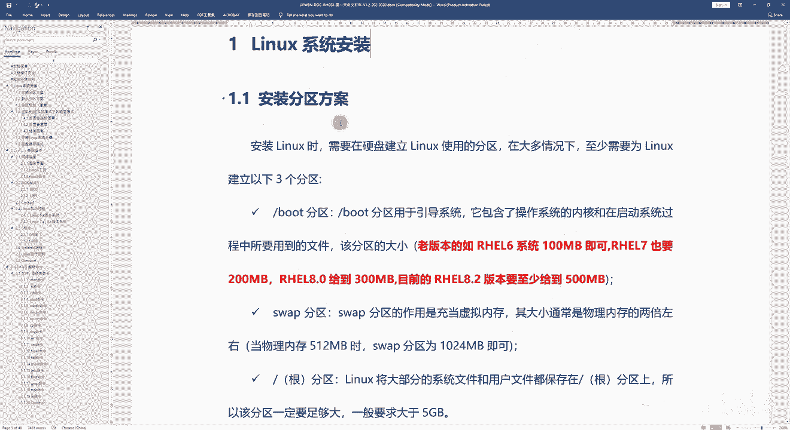

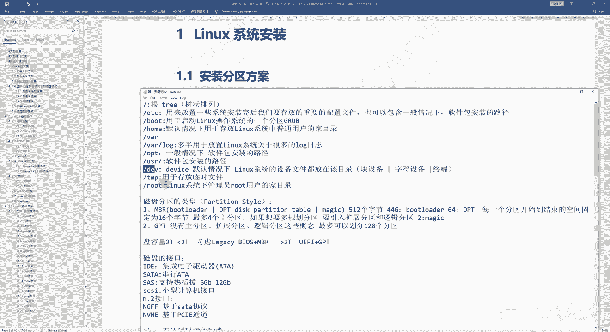

在本节课中，我们将要学习Linux操作系统安装过程中的核心环节——磁盘分区方案。我们将详细探讨分区的类型、规划原则，并重点介绍标准分区与LVM逻辑卷管理器的区别与优势，为后续的系统安装打下坚实基础。

## 分区规划概述

上一节我们介绍了磁盘接口、分区类型及文件系统格式化的基本概念。本节中，我们来看看在安装Linux系统时，如何具体规划硬盘分区。

Linux系统安装时，需要在硬盘上建立分区。大多数情况下，至少需要为Linux系统建立以下三个分区。

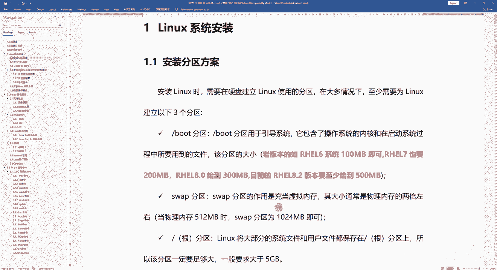

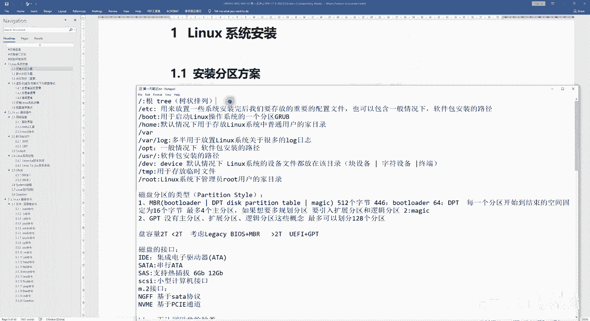

以下是三个必需的分区及其作用：

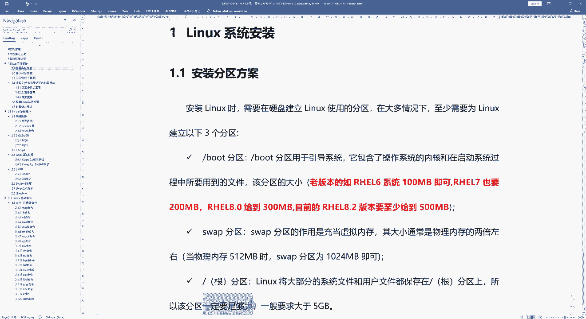

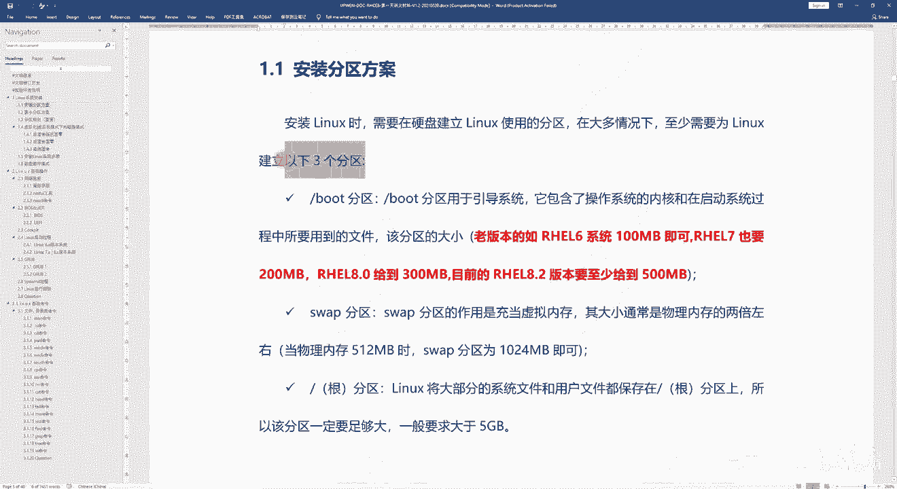

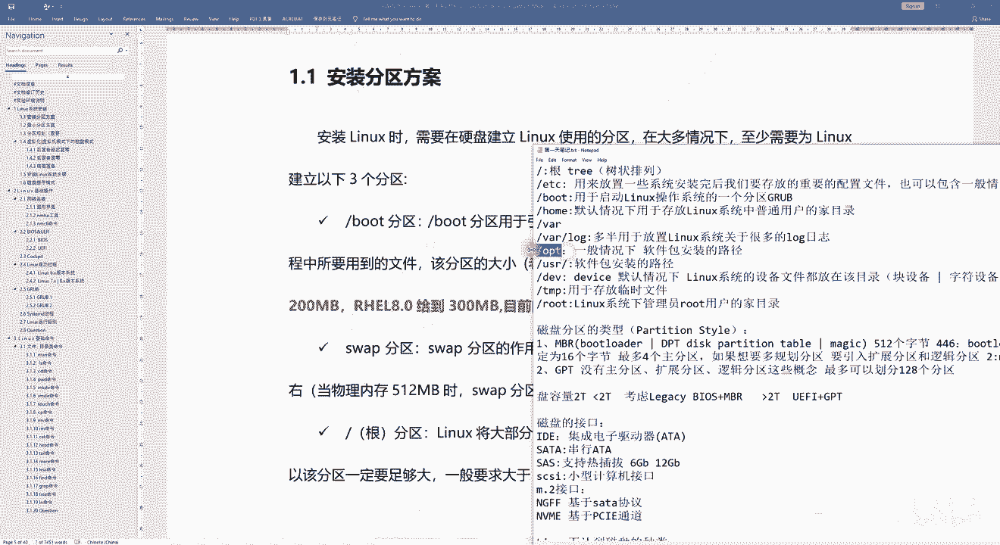

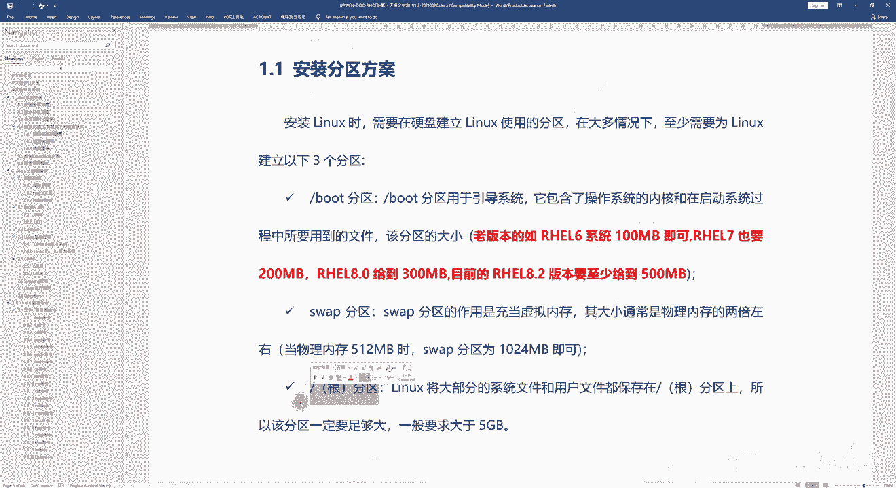

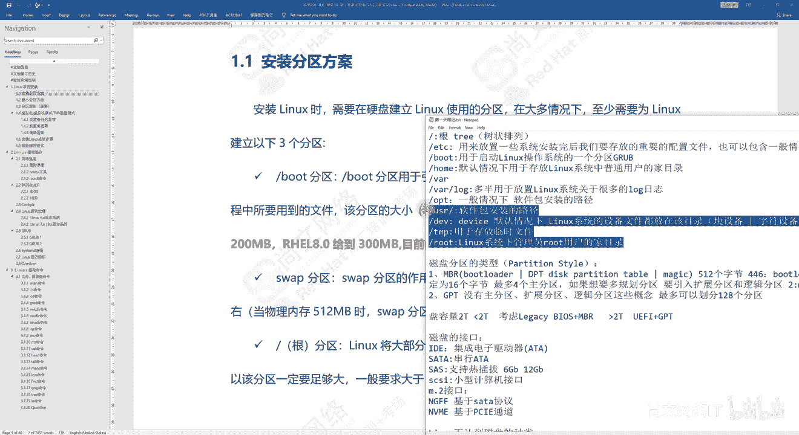

1.  **/boot 分区**
    *   **作用**：用于引导操作系统，包含系统内核（kernel）和启动过程中所需的文件。
    *   **大小规划**：分区大小随系统版本递增。例如，RHEL 6需要100MB，RHEL 7需要200MB，RHEL 8.0需要300MB。基于目前的RHEL 8.2版本，**/boot**分区至少需要500MB。

2.  **swap 分区**
    *   **作用**：充当虚拟内存。当物理内存（RAM）不足时，系统会使用这部分磁盘空间来临时存放数据。
    *   **大小规划**：通常设置为物理内存的1.5到2倍。例如，物理内存为512MB时，swap分区设为1GB即可。

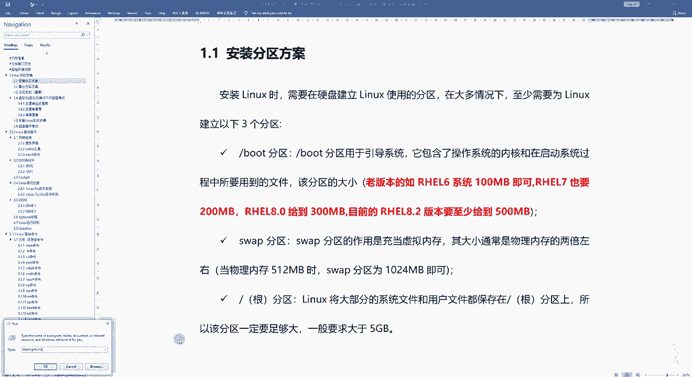

3.  **/ (根) 分区**
    *   **作用**：作为整个Linux文件系统的根目录，大部分系统文件和用户文件都保存在此。
    *   **大小规划**：根分区需要足够大的空间，具体大小视磁盘总容量而定，一般建议大于5GB。

## 分区类型：标准形式 vs LVM形式

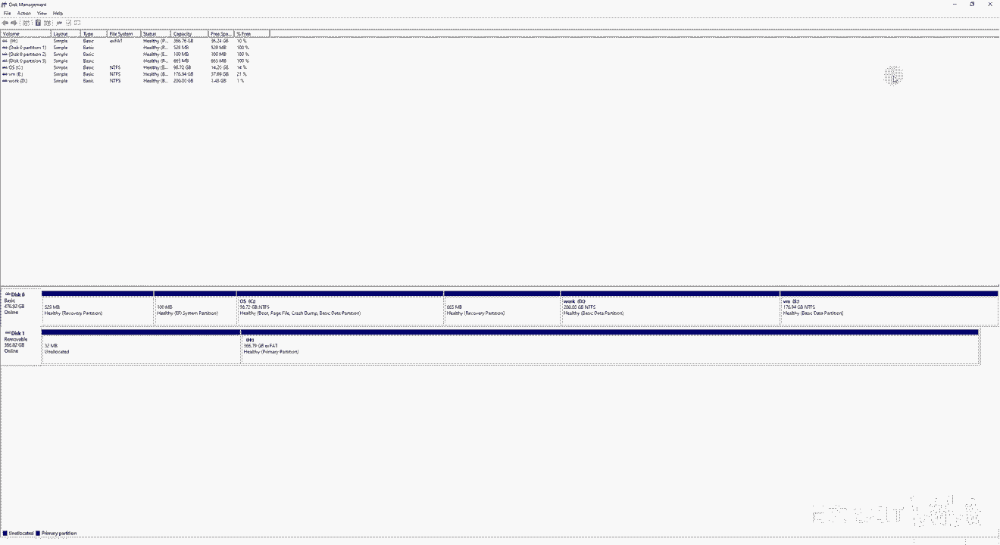

在规划上述分区时，我们需要选择分区的类型。主要分为标准形式和LVM（逻辑卷管理器）形式。

### 标准形式分区

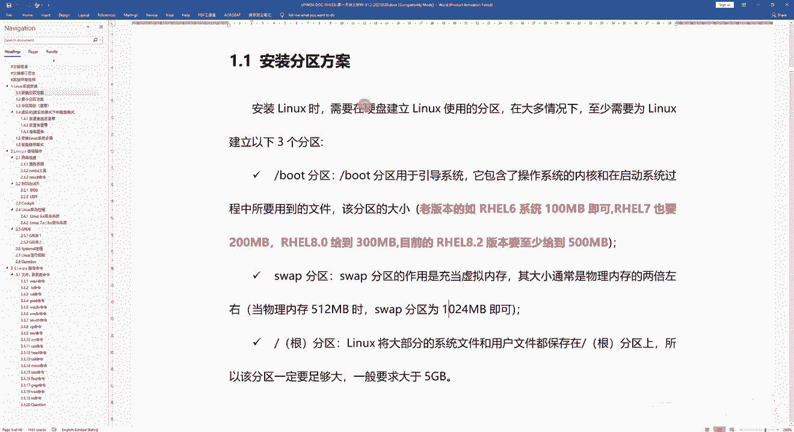

标准形式分区类似于传统Windows的分区方式。分区创建后，其容量大小就固定了。

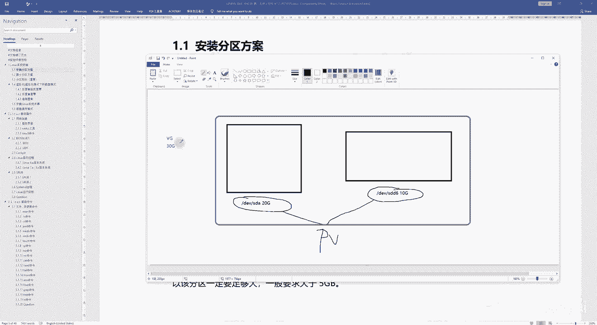

以下是标准形式分区的特点：

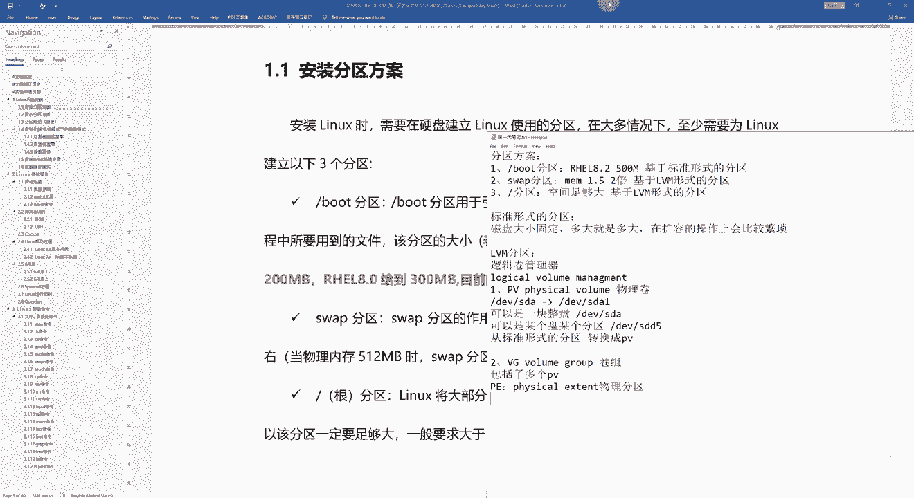

*   磁盘或分区大小固定。
*   后续进行扩容或缩容操作比较繁琐，通常需要备份数据、调整分区、再恢复数据。

### LVM形式分区

LVM（Logical Volume Manager）提供了更灵活的磁盘管理方式。它通过抽象层管理物理存储设备，允许动态调整逻辑卷的大小。

为了理解LVM，我们需要掌握几个核心概念：

*   **PV (Physical Volume，物理卷)**：可以是整块物理硬盘（如 `/dev/sda`），也可以是硬盘上的一个分区（如 `/dev/sda1`）。这些物理存储单元需要被初始化为PV才能加入LVM管理。
*   **VG (Volume Group，卷组)**：由一个或多个PV组成的大存储池。VG的容量是所有组成PV的容量之和。
*   **PE (Physical Extent，物理扩展块)**：VG空间被划分成许多大小相等的PE（例如4MB、8MB、16MB等），它是LVM分配空间的最小单位。
*   **LV (Logical Volume，逻辑卷)**：从VG中划分出来的逻辑存储单元，用户最终在LV上创建文件系统并挂载使用。创建LV时可以指定具体容量（如5GB），也可以指定PE的个数。

LVM的工作流程可以概括为以下步骤：

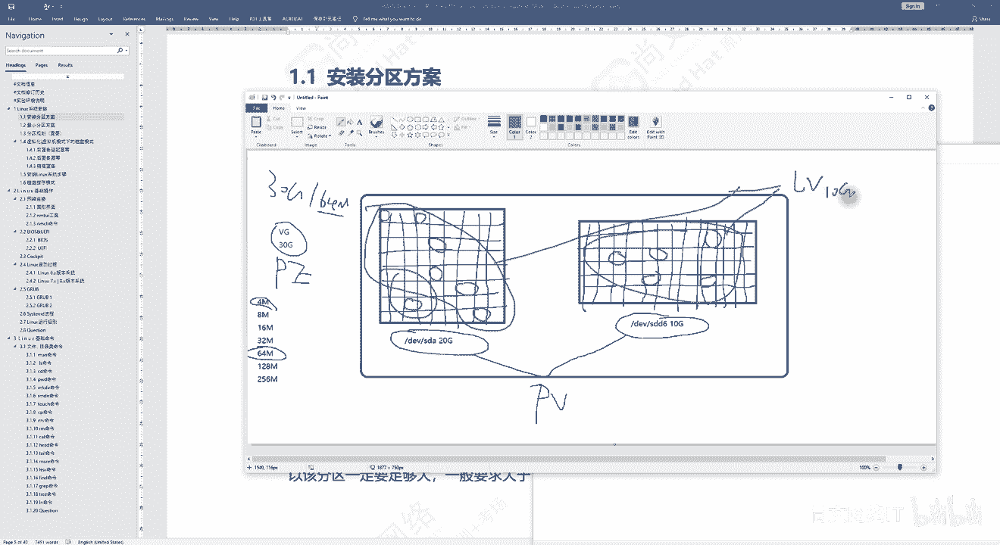

1.  将物理磁盘或分区初始化为PV。
2.  将多个PV加入到一个VG中。
3.  从VG中划分出指定大小的LV。
4.  在LV上创建文件系统（格式化）。
5.  将文件系统挂载到目录使用。

LVM的主要优势在于其灵活性：

*   **动态调整**：可以**在线**对LV进行扩展（extend）或收缩（reduce）操作，而无需卸载文件系统或重启系统（注意：文件系统本身也需要支持调整）。
*   **空间复用**：从LV收缩出来的空间可以归还给VG，供其他LV使用。

**重要提示**：在调整LV容量后，必须同步调整其上的文件系统大小，两者是独立的操作。`/boot`分区通常**必须**使用标准形式，因为系统引导程序可能无法从LVM卷启动。

## 分区方案实例

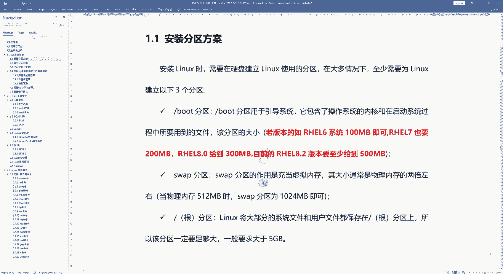

了解了分区类型后，我们来看一个具体的分区规划实例。

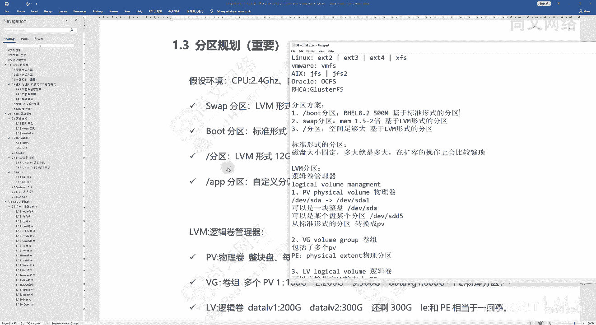

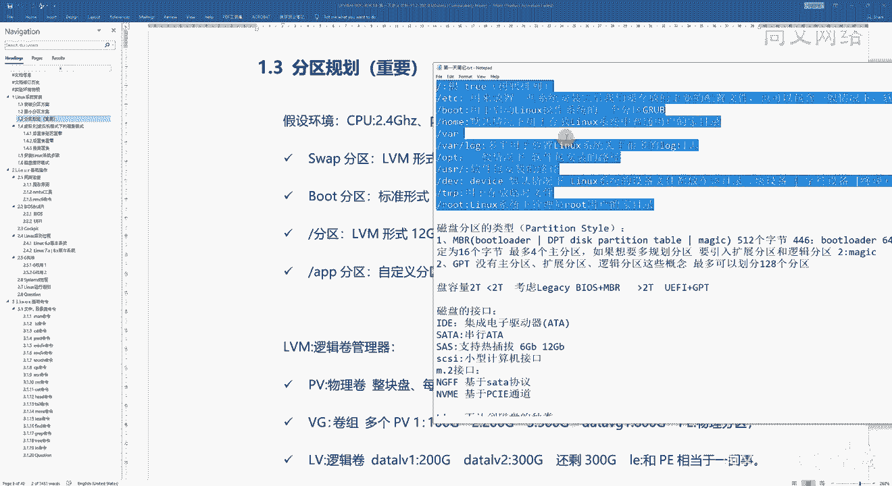

假设我们有一台主机，配置为：CPU 2.4GHz，内存2GB，硬盘为20GB的SATA硬盘。

以下是一个推荐的分区方案：

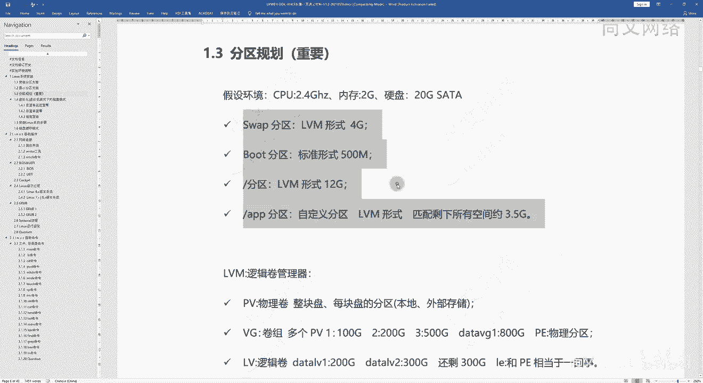

*   **/boot 分区**：500MB，采用标准形式。
*   **swap 分区**：4GB（物理内存的2倍），采用LVM形式。
*   **/ (根) 分区**：12GB，采用LVM形式。
*   **自定义分区**：例如 `/app` 分区，分配剩余的所有空间（约3.5GB），采用LVM形式。这种自定义分区常用于将应用程序（如数据库）的数据与系统文件分离，提高安全性和管理灵活性。

## 总结

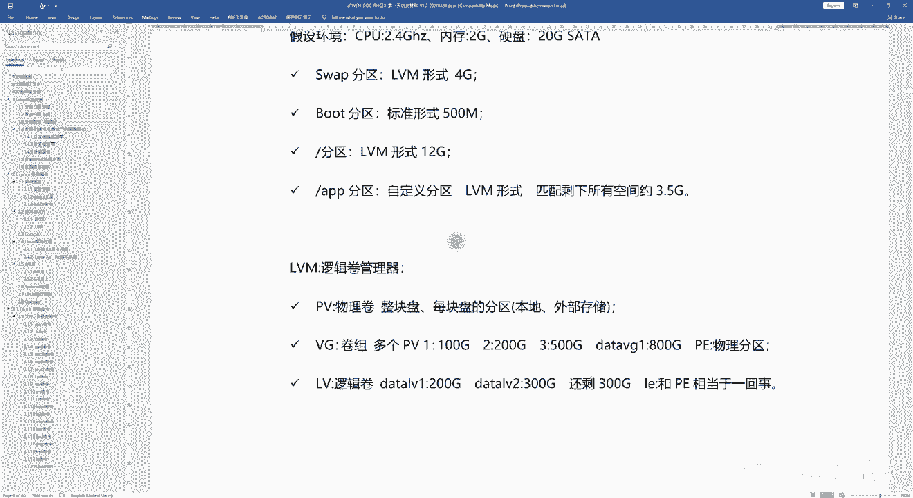

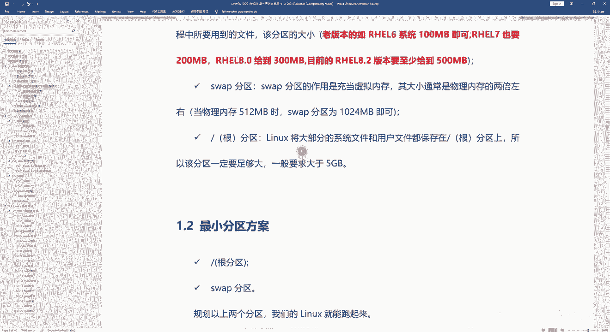

本节课中我们一起学习了Linux系统安装的核心——分区方案。我们明确了安装Linux至少需要`/boot`、`swap`和`/`三个分区，并了解了它们的作用与大小规划。我们重点对比了**标准形式分区**和**LVM形式分区**的原理与优劣，认识到LVM在动态存储管理方面的强大优势。最后，我们通过一个实例演示了如何根据服务器配置规划一个合理的分区方案。理解这些概念是成功安装和后续管理Linux系统的关键一步。