# Linux运维/RHCSA/红帽认证/RHCE8系列录播视频：P5：虚拟机下的三种磁盘模式 📚

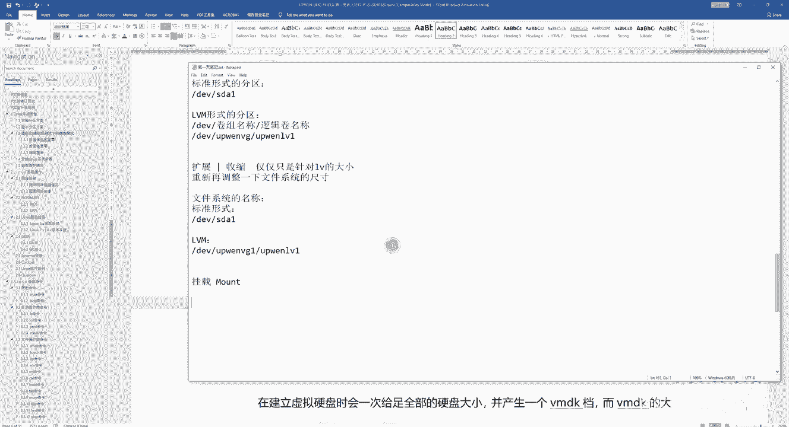

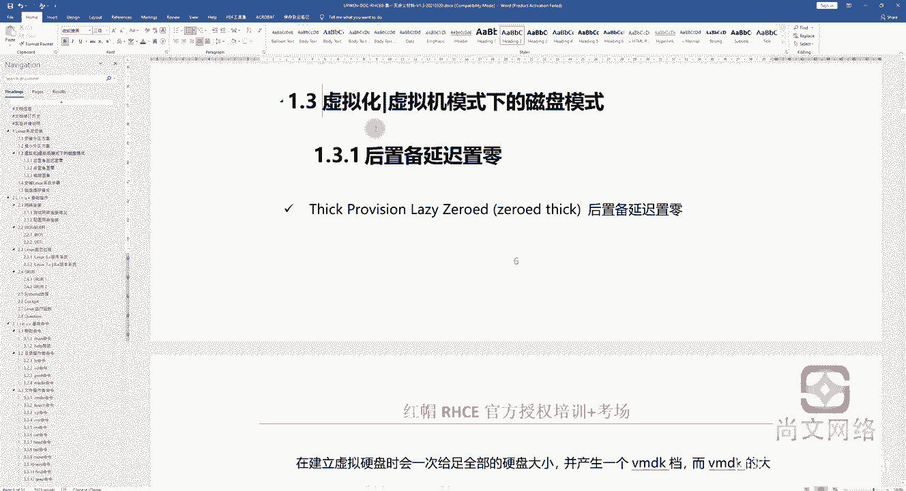

在本节课中，我们将学习在虚拟化环境下创建虚拟机时，磁盘的三种主要配置模式。理解这些模式对于合理规划存储空间和优化虚拟机性能至关重要。

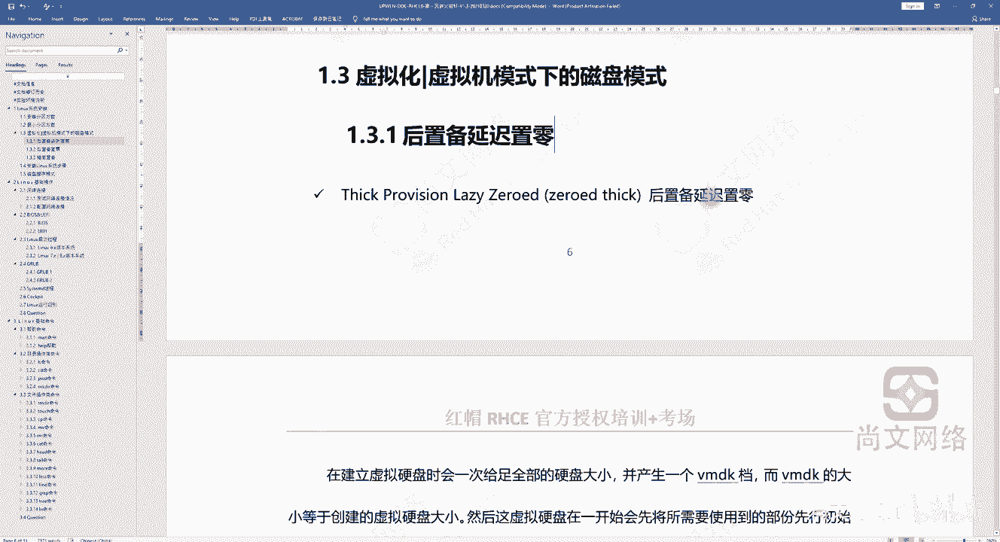

上一节我们介绍了Linux安装前的分析方案，本节中我们来看看虚拟化环境中的一个重要概念——磁盘模式。

## 磁盘模式概述 💽

磁盘模式指的是在虚拟机或虚拟化环境中，虚拟硬盘的创建和空间分配方式。主要有以下三种模式。

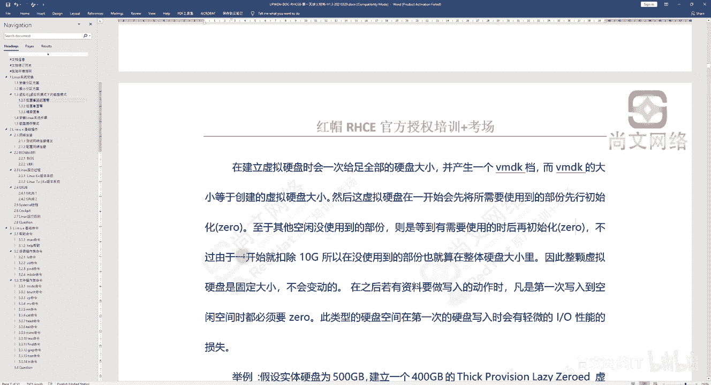

以下是三种磁盘模式的详细介绍。

### 1. 后置备延迟置零 (Thick Provision Lazy Zeroed)

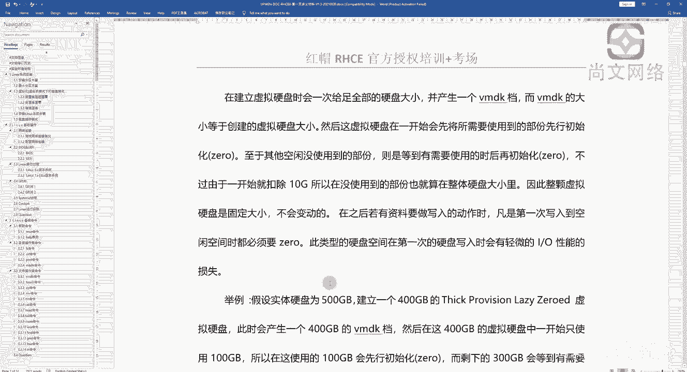

这种模式在创建虚拟硬盘时，会一次性分配并占用指定的全部物理存储空间。但初始化（置零）操作是分批进行的。

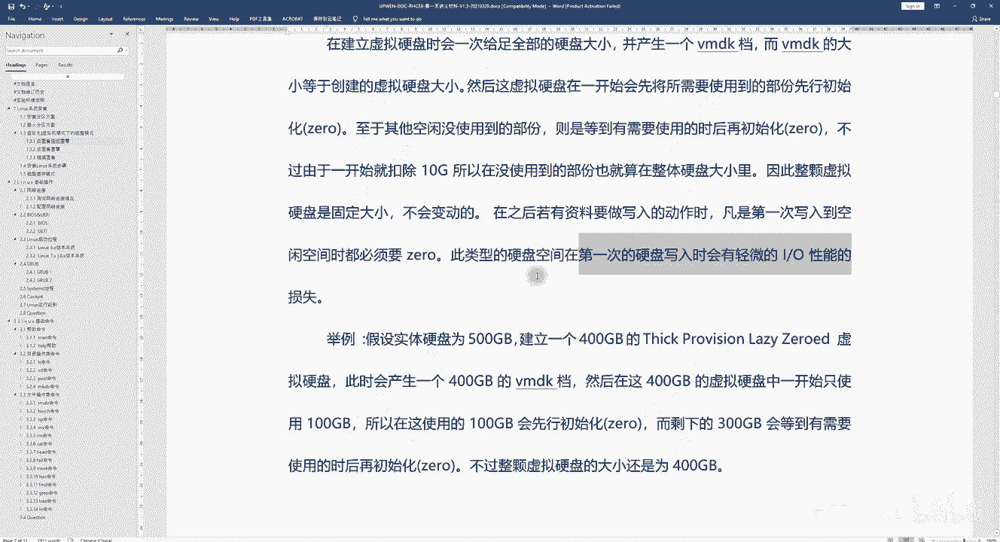

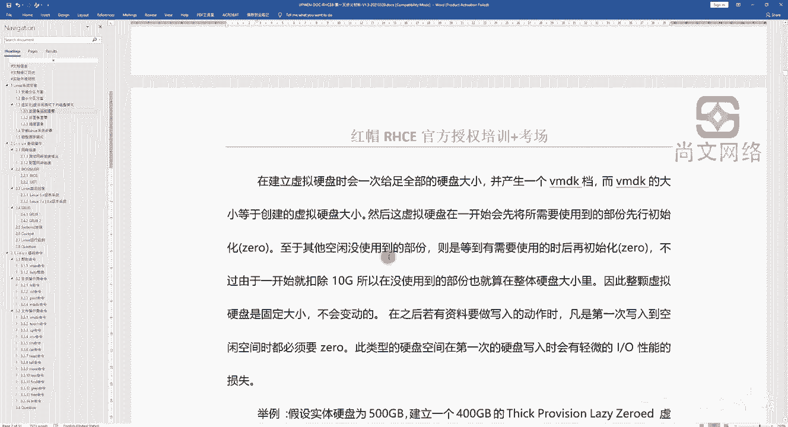

*   **创建过程**：假设物理硬盘为500GB，创建一个400GB的虚拟硬盘。系统会立即在物理硬盘上占用400GB的空间，并生成一个400GB的虚拟磁盘文件（如VMDK）。
*   **初始化过程**：系统不会立即初始化全部400GB空间。例如，如果初始只使用了100GB，则只对这100GB进行初始化（置零）。剩余的300GB空间，等到需要使用时再进行初始化。
*   **特点**：虚拟硬盘的总大小始终为创建时指定的大小（400GB）。在首次向未初始化的空间写入数据时，会有轻微的I/O性能损失，因为需要先完成初始化操作。

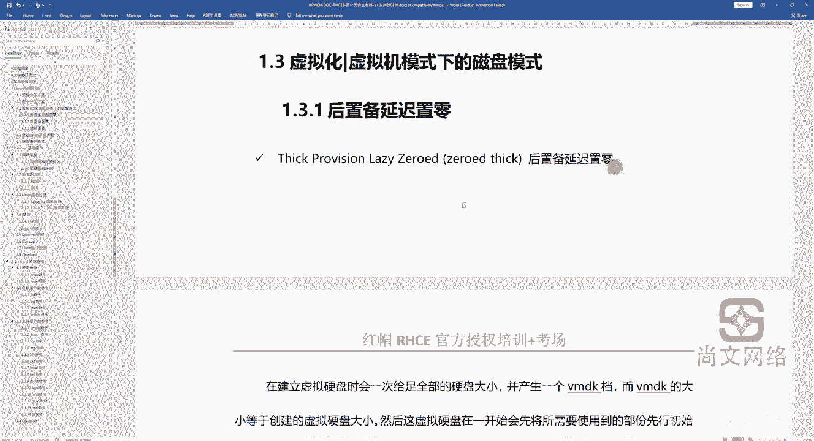

### 2. 后置备置零 (Thick Provision Eager Zeroed)

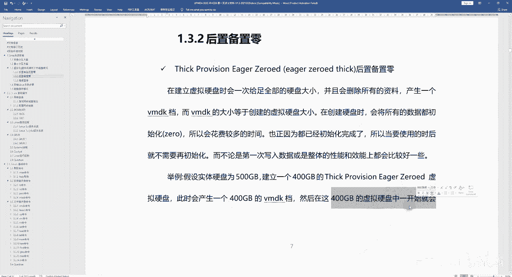

这种模式同样会一次性分配并占用指定的全部物理存储空间，并且会立即完成整个空间的初始化操作。

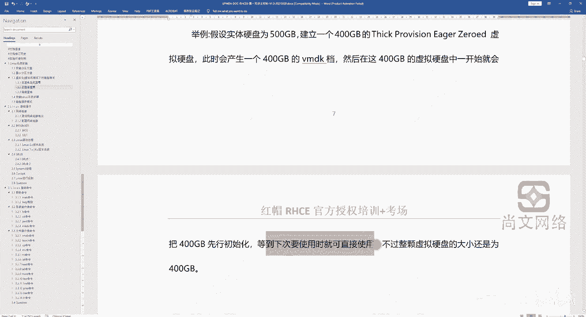

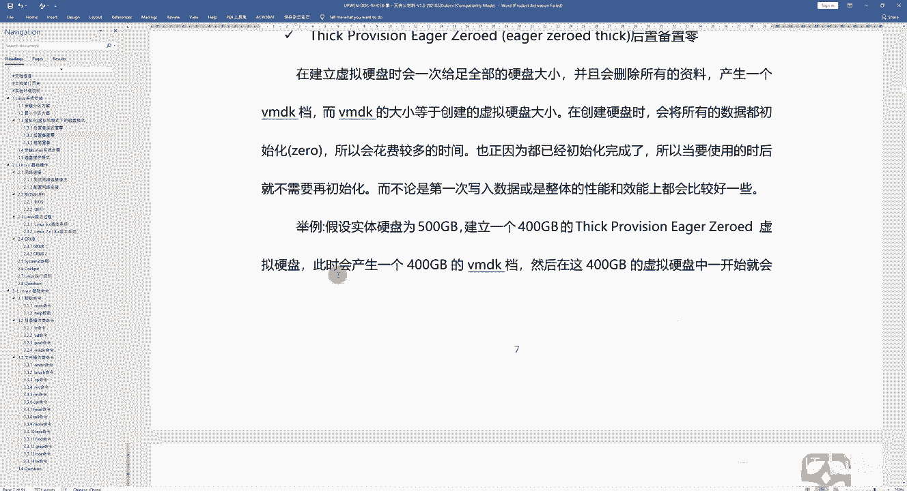

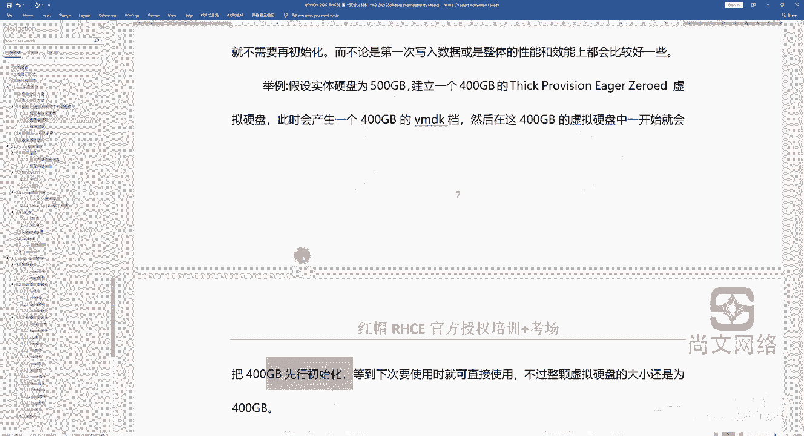

*   **创建过程**：同样以500GB物理硬盘创建400GB虚拟硬盘为例。系统会立即占用400GB物理空间，并生成400GB的虚拟磁盘文件。
*   **初始化过程**：与“延迟置零”不同，系统会立即将整个400GB空间全部进行初始化（置零）。
*   **特点**：虚拟硬盘的总大小也为400GB。由于创建时已完成全部初始化，后续首次写入数据时性能更好，没有额外的初始化开销。但创建虚拟硬盘本身所需的时间会更长。

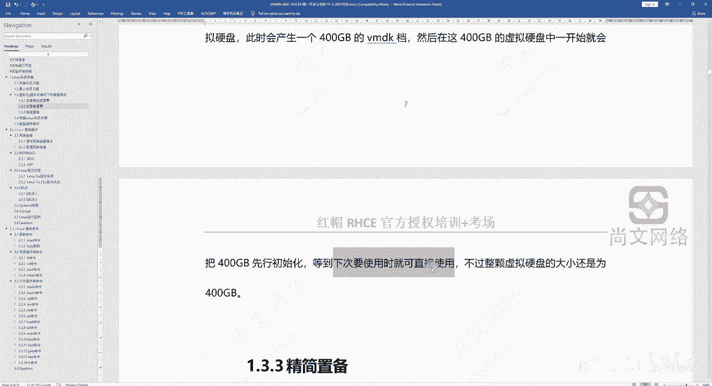

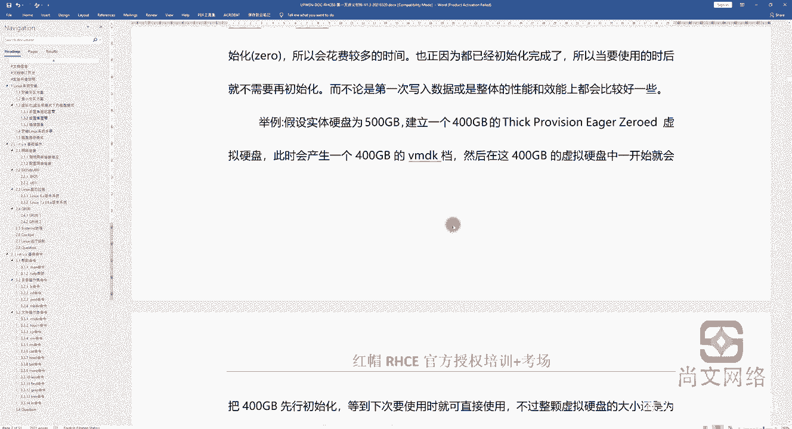

### 3. 精简制备 (Thin Provision)

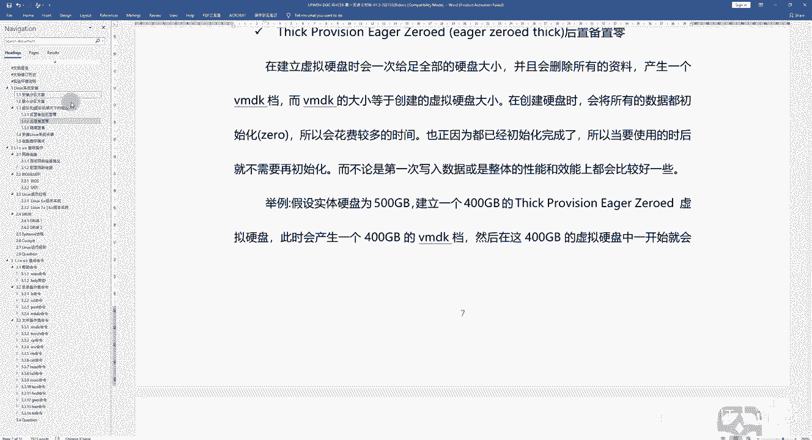

这是一种动态分配空间的模式。虚拟硬盘文件的大小不会一次性达到指定上限，而是随着实际使用量的增加而增长。

*   **创建过程**：在500GB物理硬盘上，创建一个最大容量为400GB的精简制备虚拟硬盘。创建完成后，虚拟磁盘文件（VMDK）的实际大小可能只有几MB或几十MB。
*   **空间增长**：随着虚拟机内数据写入，虚拟磁盘文件会逐渐增大。例如，当虚拟机使用了100GB数据时，VMDK文件大小就增长到约100GB。
*   **特点**：虚拟硬盘文件的大小等于实际使用量，而非创建时指定的最大值。它能极大节省物理存储空间，是实验和测试环境的首选。但需要注意监控物理硬盘的剩余空间，防止所有虚拟机同时增长导致物理空间耗尽。

## 模式对比与应用场景 ⚖️

上一节我们详细介绍了三种磁盘模式的工作原理，本节中我们来看看如何选择以及它们在VMware中的体现。

**后置备延迟置零**和**后置备置零**统称为“厚置备”，它们预先占用物理空间，适合对磁盘I/O性能要求较高的生产环境，例如数据库、大数据处理等场景。其中，**后置备置零**性能更优。

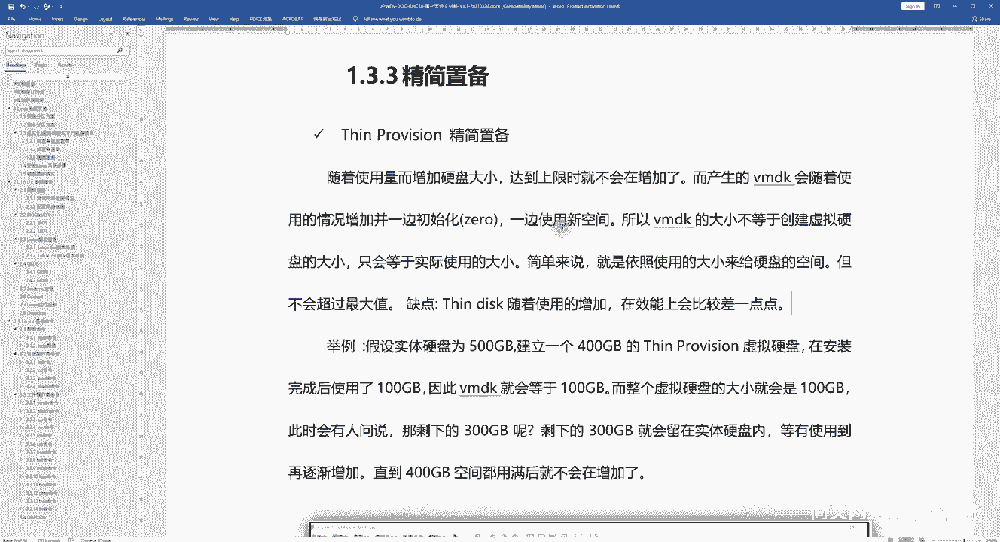

**精简制备**能高效利用存储空间，适合开发、测试环境或对存储空间敏感的应用场景。

在VMware vSphere等虚拟化平台创建虚拟机时，通常会遇到相关选项。例如，在指定磁盘容量（如20GB）后，会有一个“**立即分配所有空间**”的选项：
*   不勾选此选项，通常对应**精简制备**模式。
*   勾选此选项，则对应**厚置备**模式（类似后置备置零）。这会要求物理空间立即可用，但能提升虚拟机性能。

## 总结 📝

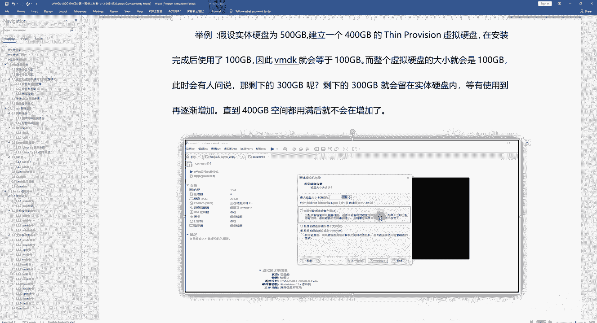

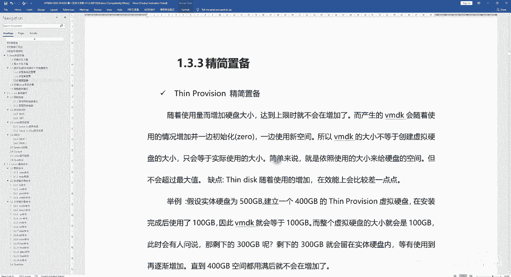

本节课中我们一起学习了虚拟机下的三种磁盘模式：
1.  **后置备延迟置零**：预先分配全部空间，按需初始化。
2.  **后置备置零**：预先分配并初始化全部空间，性能最佳。
3.  **精简制备**：动态分配空间，按实际使用量增长，节省存储。

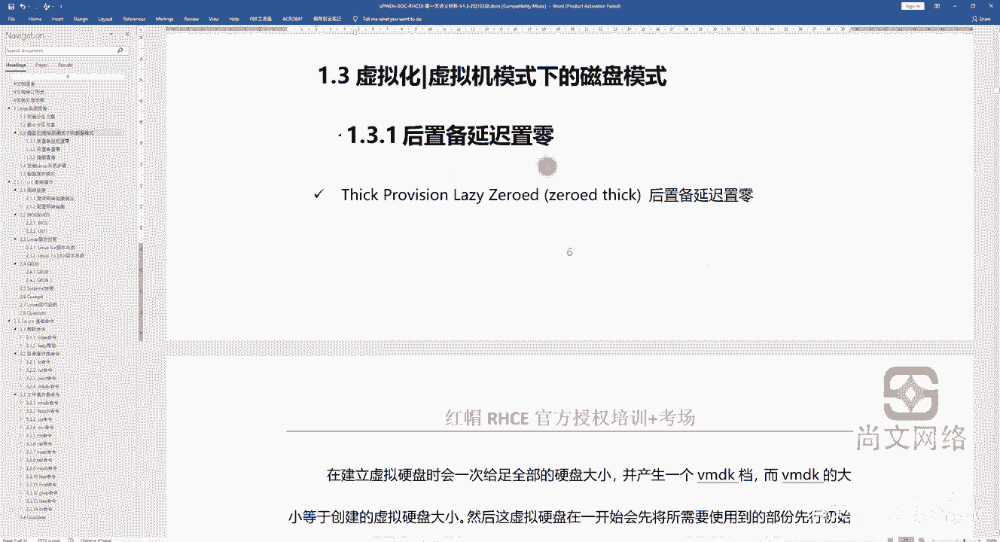

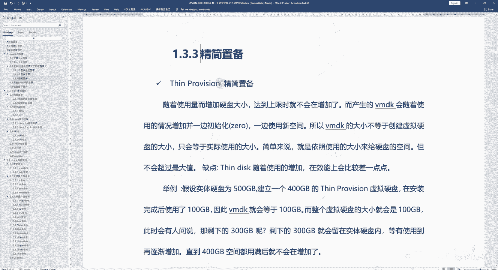

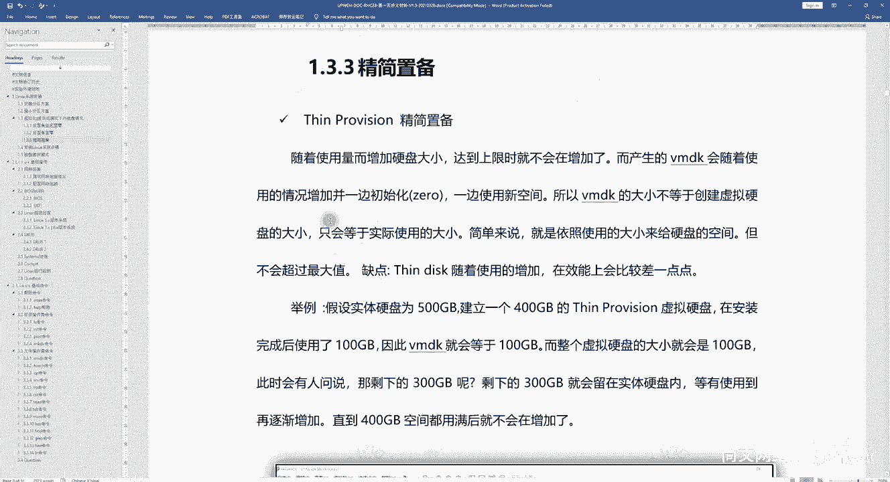

理解这些模式有助于我们在不同场景下做出合适的存储规划，平衡性能与空间利用率。后续学习红帽RHEL 8中的高级存储技术（如VDI、分层存储）时，这些基础知识将非常重要。