# Linux系统安装：06：RHEL 8.2 图形化安装步骤详解

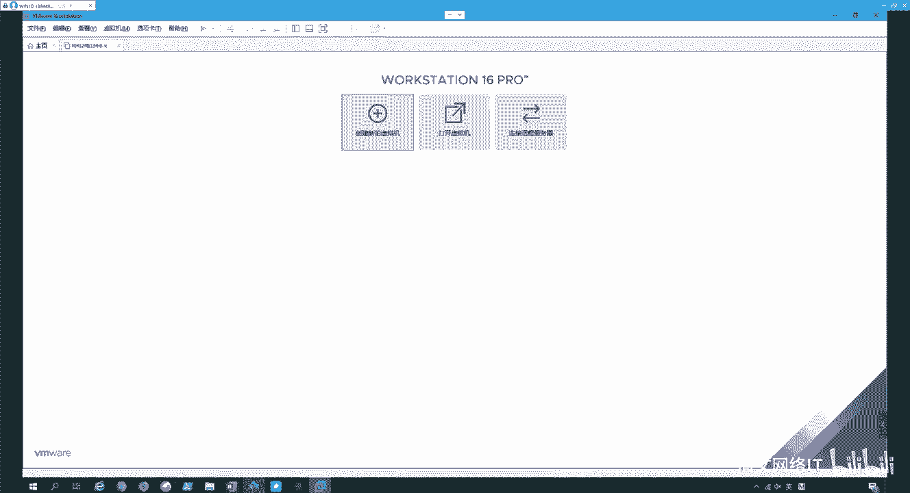

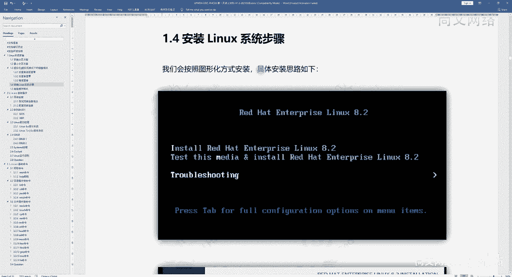

在本节课中，我们将学习如何使用图形化界面安装 Red Hat Enterprise Linux 8.2 操作系统。我们将从引导介质开始，逐步完成语言选择、软件包配置、磁盘分区等关键步骤，最终完成系统的安装。

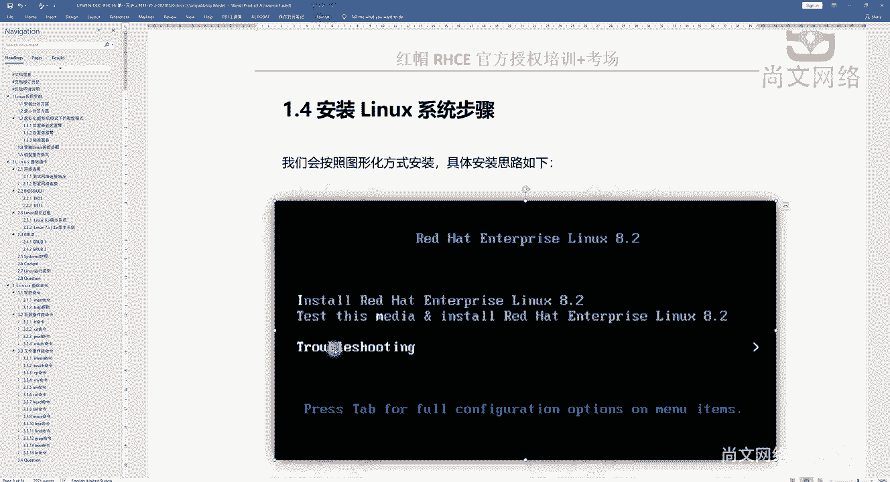

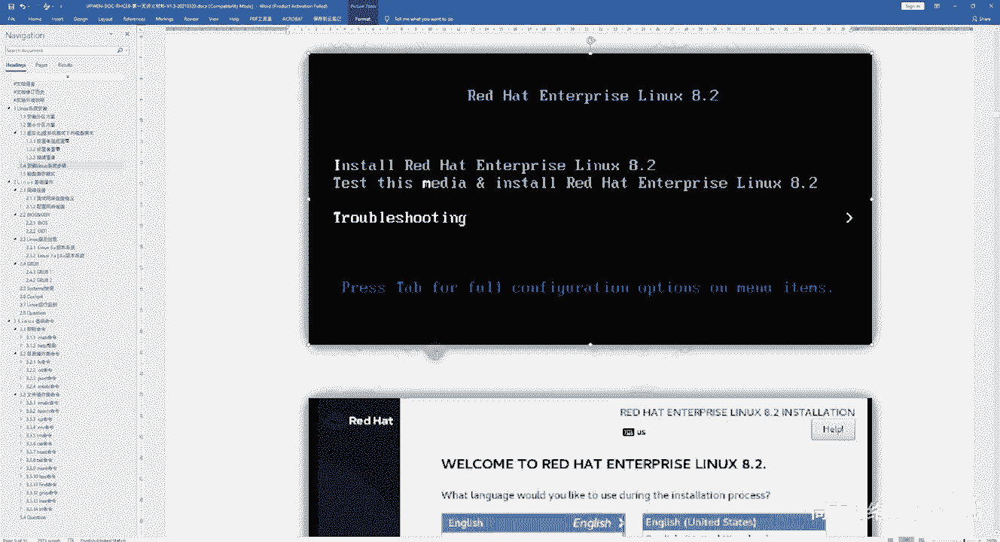

## 引导与初始界面 🚀

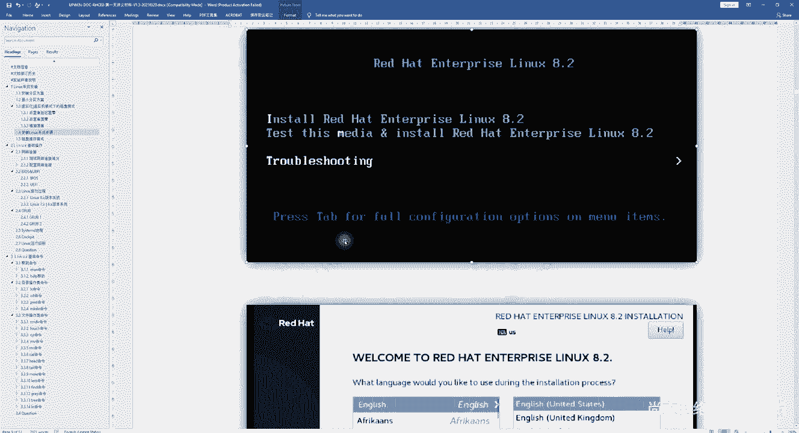

上一节我们介绍了安装前的准备工作，本节中我们来看看具体的安装流程。首先，通过可引导介质（如光盘或U盘）启动计算机后，会进入 RHEL 8.2 的安装初始界面。

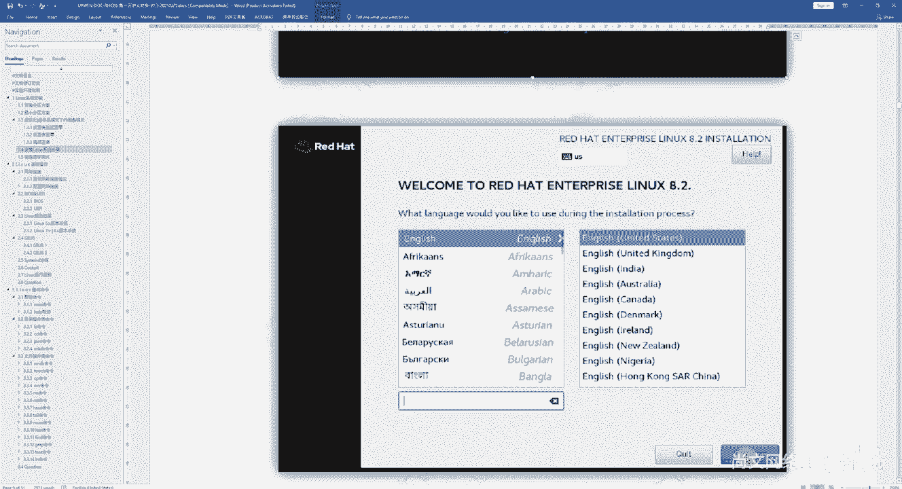

以下是初始界面的三个主要选项：
*   **Install Red Hat Enterprise Linux 8.2**：直接开始安装操作系统。
*   **Test this media & install Red Hat Enterprise Linux 8.2**：在安装前先检测引导介质的完整性，这是默认选中的选项。
*   **Troubleshooting**：进入排错模式，用于系统救援或修复。

为了确保安装过程顺利，建议选择第二项，先检测介质。

## 语言与区域设置 🌍

检测通过后，安装程序会进入图形化安装向导。第一步是选择安装过程中使用的语言。

虽然可以选择“简体中文”，但为了与后续命令行环境保持一致，**建议选择英文（English）**，并进一步选择“English (United States)”。选择完成后，点击“Continue”进入下一步。

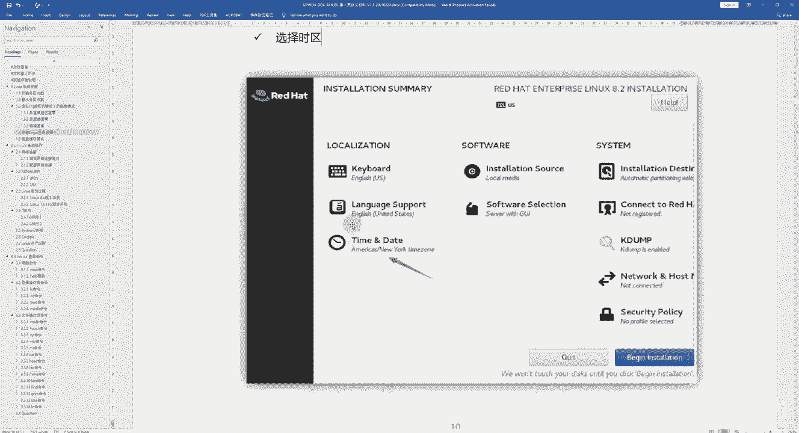

## 安装信息总览与核心配置 ⚙️

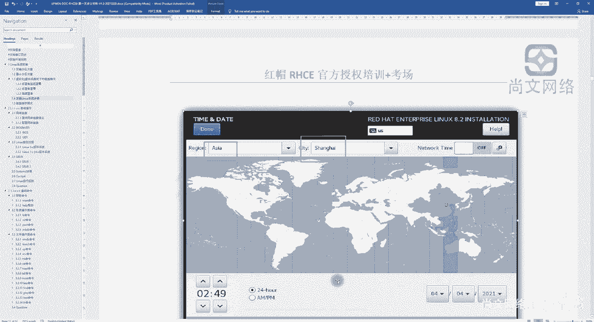

现在，我们来到了安装信息总览界面。这里列出了所有需要配置的项目，其中有三项是安装过程中最常需要手动调整的。

以下是需要重点配置的三个部分：
1.  **TIME & DATE**：设置系统时区。
2.  **SOFTWARE SELECTION**：选择要安装的软件包组合。
3.  **INSTALLATION DESTINATION**：配置磁盘分区方案，这是最重要的一步。

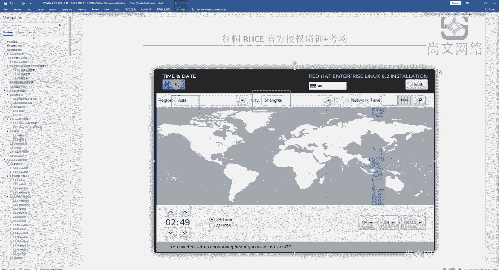

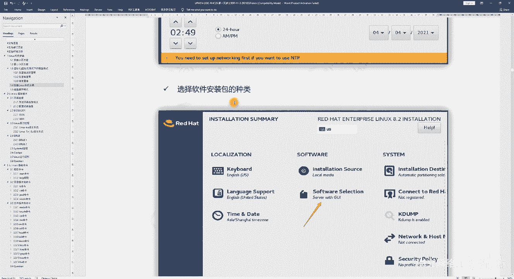

### 1. 配置时区

点击“TIME & DATE”进入设置。我们需要将地区（Region）改为“Asia”，城市（City）改为“Shanghai”。系统时间可以来自本地BIOS，也可以通过网络时间协议（NTP）同步。对于初学者，可以先使用本地时间，后续再配置NTP。设置完成后点击“Done”。

### 2. 选择软件包

点击“SOFTWARE SELECTION”进入软件选择界面。这里提供了不同的基础环境（Base Environment）供选择。

以下是主要的软件包组合选项：
*   **Server with GUI**：带图形界面的服务器环境，适合初学者。
*   **Server**：仅包含服务器基础软件包，不带图形界面。
*   **Minimal Install**：最小化安装，只包含最基本的功能，系统最精简、最安全，适合有经验的用户。
*   **Workstation**：工作站环境，包含桌面和开发工具。
*   **Custom Operating System**：自定义选择软件包。
*   **Virtualization Host**：虚拟化主机环境。

**对于初学者，建议选择“Server with GUI”以使用图形界面。对于有经验的用户，强烈建议选择“Minimal Install”以获得更安全、高效的系统，后续可按需添加软件包。**

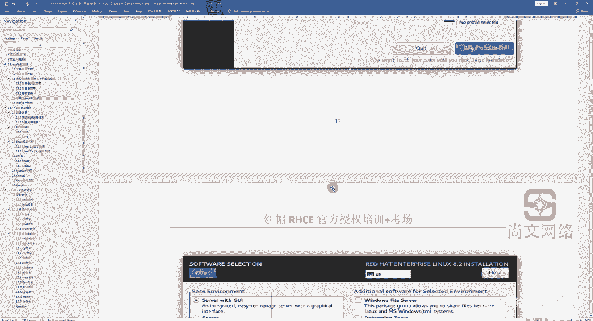

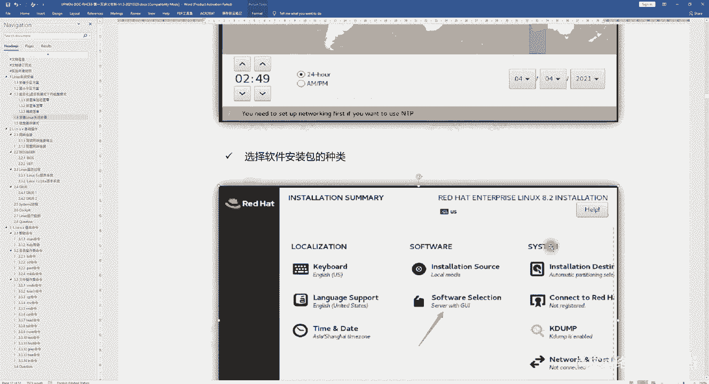

### 3. 磁盘分区（核心步骤）

点击“INSTALLATION DESTINATION”进入磁盘配置。首先，在“Local Standard Disks”下选中要安装系统的硬盘（注意不要选错，选中的盘会有白色对勾）。

接着，在“Storage Configuration”部分，**必须选择“Custom”**，然后点击“Done”，以便手动创建分区。

在接下来的自定义分区界面，点击“+”号来添加分区。我们将按照之前课程讨论的方案进行分区。

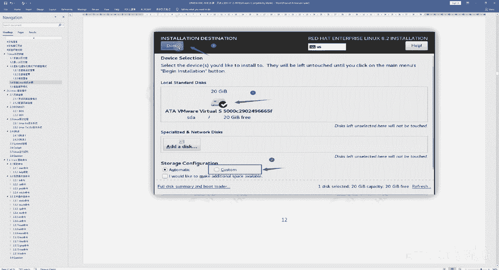

以下是推荐的分区方案：
*   **/boot分区**：挂载点选择 `/boot`，期望容量设为 `500M`，设备类型（Device Type）选择 **`Standard Partition`**，文件系统（File System）选择 `xfs` 或 `ext4`。
*   **swap分区**：挂载点选择 `swap`，容量建议为物理内存的1.5到2倍，设备类型默认为 **`LVM`**。
*   **/（根）分区**：挂载点选择 `/`，分配剩余的大部分空间（例如 `12G`），设备类型为 **`LVM`**，文件系统为 `xfs`。
*   **自定义分区（可选）**：例如，为应用程序单独创建一个分区，挂载点可设为 `/app`，设备类型为 **`LVM`**。

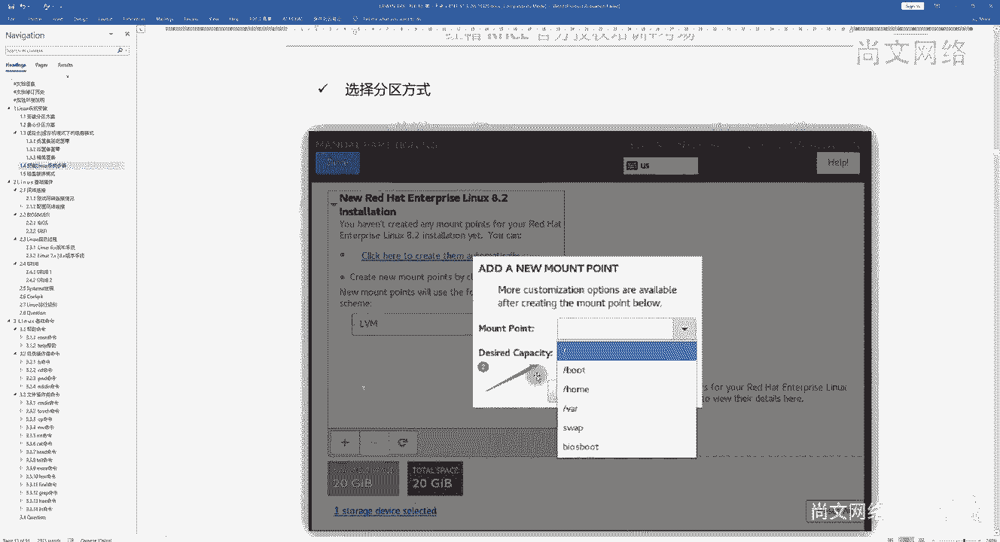

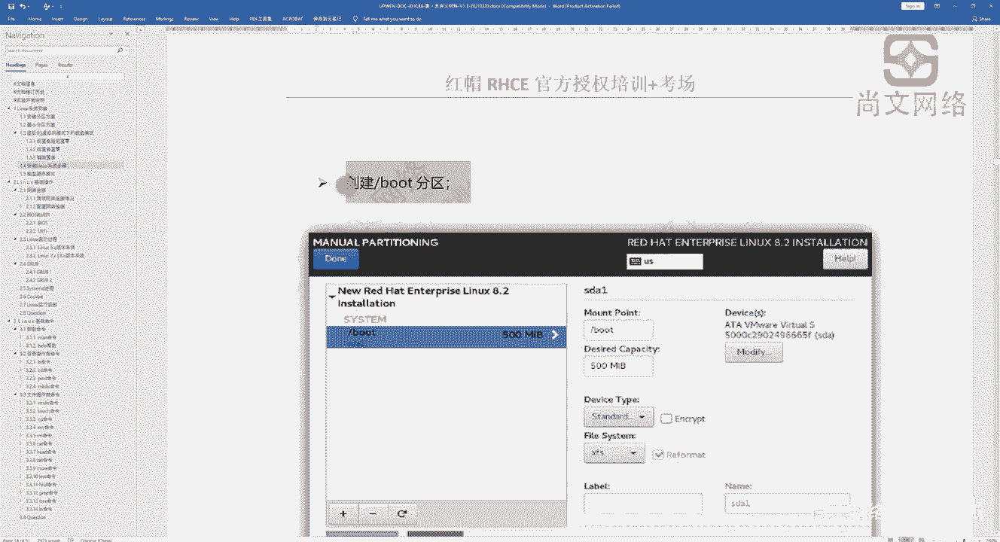

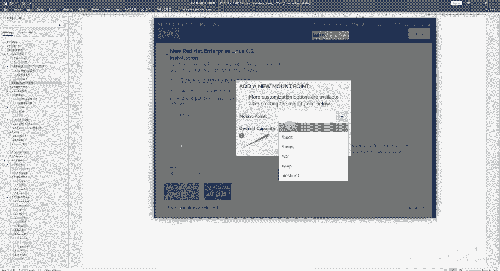

**关键点**：只有 `/boot` 分区必须使用标准分区（Standard Partition），其他分区推荐使用LVM，以获得更好的灵活性和可管理性。所有LVM分区默认会放入一个名为 `rhel` 的卷组中。

分区配置完成后，点击“Done”并确认更改，即可返回主界面。

## 完成安装与总结 ✅

完成上述三项核心配置后，其他设置（如网络、安全策略等）可以暂时保持默认，待系统安装完成后再进行配置。点击主界面右下角的“Begin Installation”开始安装。

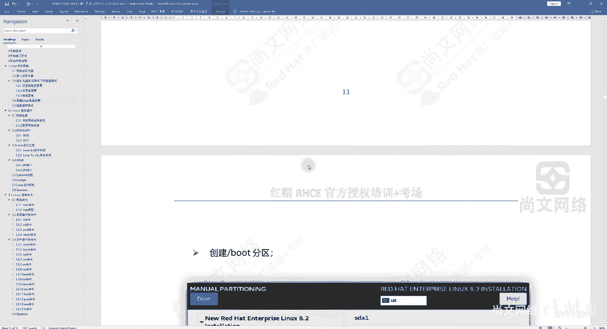

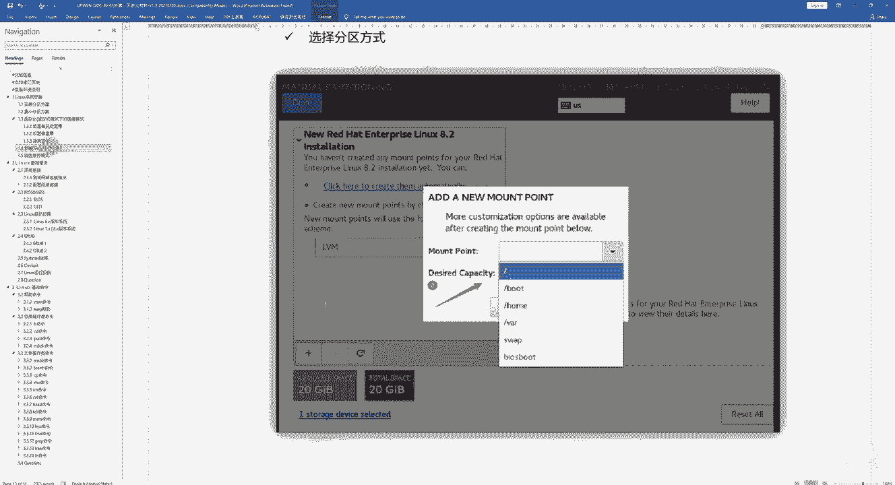

安装过程中，系统会提示为root用户设置密码，并可以创建一个普通用户。设置完成后，等待安装进程结束，重启系统即可。

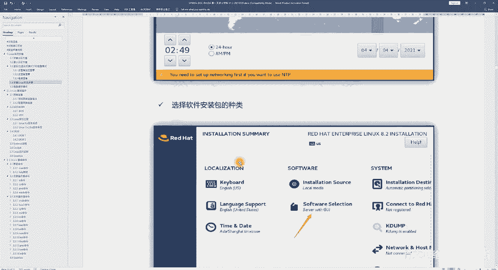

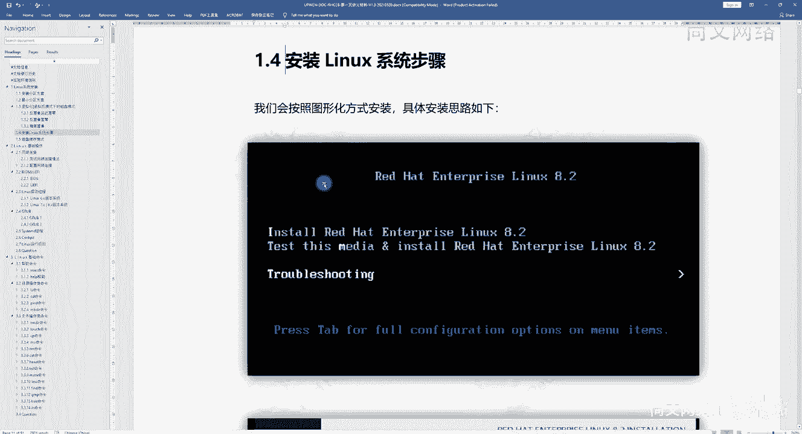

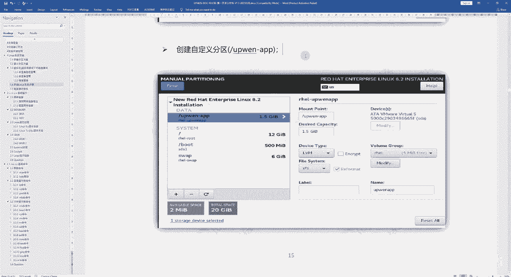

本节课中我们一起学习了RHEL 8.2图形化安装的完整流程。我们重点掌握了如何选择安装介质、设置时区、根据自身情况选择合适的软件包组合，以及最重要的——按照 `boot`（标准分区）、`swap`、`/`（根分区，LVM）的方案进行手动磁盘分区。理解并掌握这些步骤，是成功安装Linux系统的关键。