# Red Hat RHCE8 课程：07：RHEL 8.2 图形化安装教程 🖥️

在本节课中，我们将学习如何在 VMware Workstation 虚拟机中，以图形化方式安装 Red Hat Enterprise Linux 8.2 操作系统。我们将从创建虚拟机开始，逐步完成系统安装、分区规划等核心步骤。

---

## 创建虚拟机

首先，我们需要在 VMware Workstation 中创建一个新的虚拟机来安装 RHEL 8.2。

### 启动虚拟机创建向导

打开 VMware Workstation，点击“创建新的虚拟机”以启动向导。VMware 提供了“典型”和“自定义（高级）”两种创建模式。前置课程中已详细介绍过两者的区别，本节我们将使用“自定义（高级）”模式，以便进行更详细的配置。

### 配置虚拟机兼容性与安装源

在自定义模式下，我们可以设置虚拟机的兼容性、控制器类型等高级选项。我们保持默认的兼容性设置，点击“下一步”。

接下来是选择安装来源。我们有三个选项：
1.  使用物理驱动器（如 DVD）。
2.  使用 ISO 映像文件。
3.  稍后安装操作系统。

我们选择“稍后安装操作系统”，这样会创建一个带有空白硬盘的虚拟机。

### 选择操作系统类型与命名

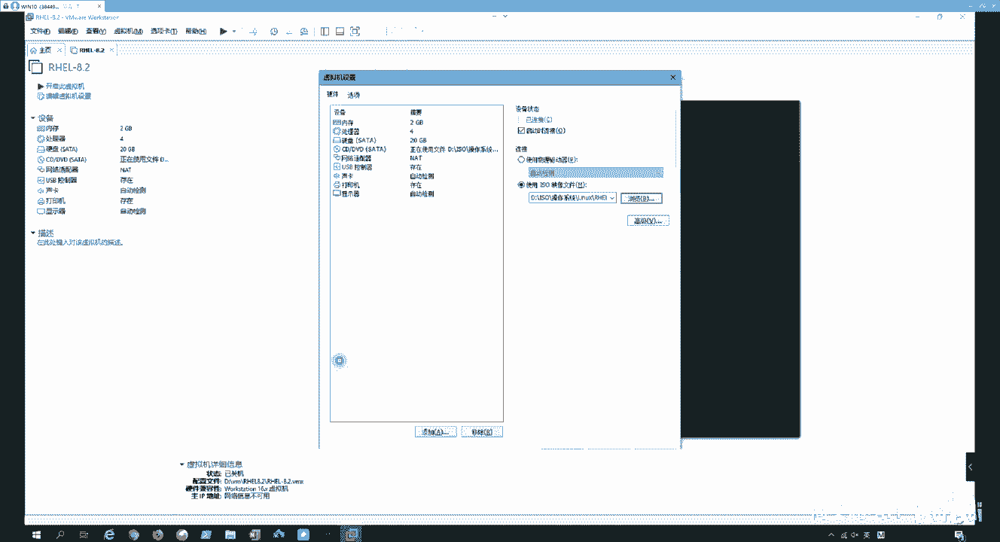

现在需要指定要安装的操作系统类型。我们选择 **Linux**，并在版本下拉列表中选择 **Red Hat Enterprise Linux 8 64 位**。

然后，为虚拟机命名（例如 `RHEL8-2`）并选择一个存储位置。建议在指定磁盘上创建一个专用文件夹（如 `VM/RHEL8`）来存放虚拟机文件。

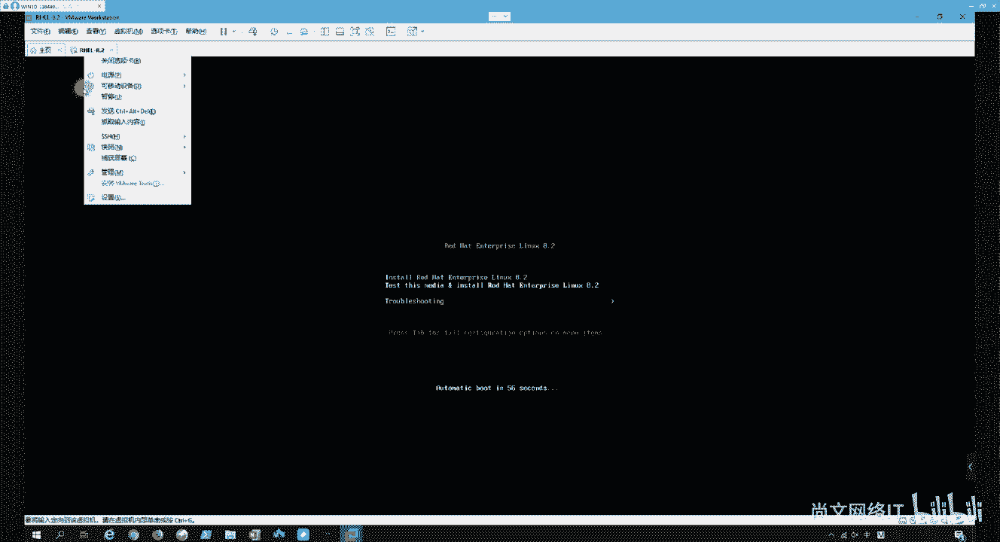

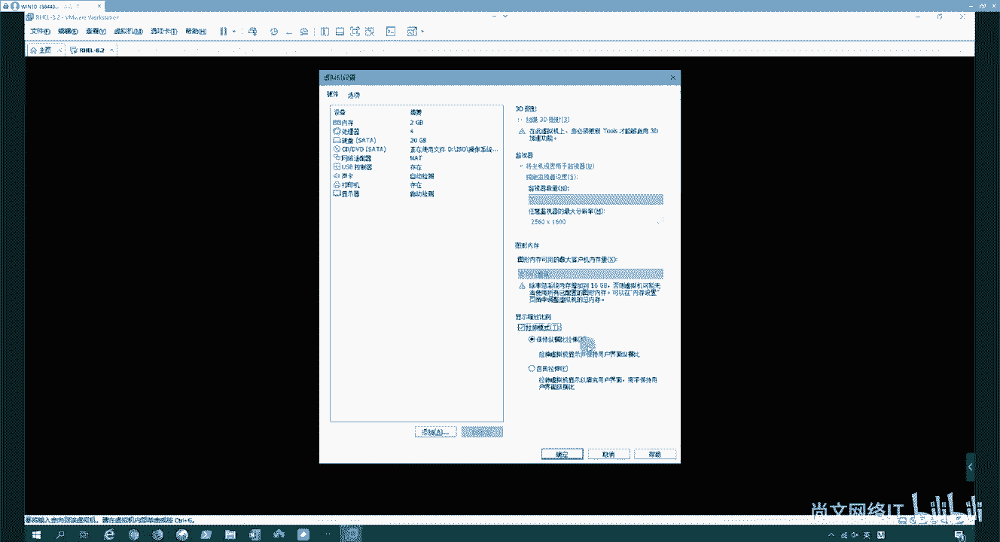

### 配置虚拟机硬件

以下是关键的硬件配置步骤：

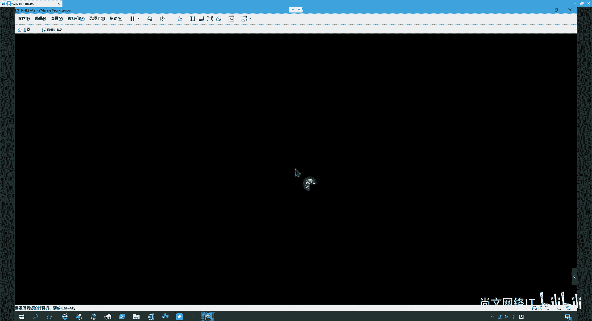

*   **处理器**：指定虚拟机的 CPU 数量。例如，可以设置为 1 个处理器，每个处理器 4 个核心，即 `4C`。
*   **内存**：为虚拟机分配内存，例如 `2048 MB`（2GB）。
*   **网络**：选择网络连接类型（桥接、NAT、仅主机等）。前置课程已有详细介绍，此处我们可任选一种，例如 `NAT`。
*   **I/O控制器与磁盘类型**：按照推荐选择 I/O 控制器类型（如 `LSI Logic`）和磁盘类型（如 `NVMe`）。如果虚拟机文件存储在机械硬盘上，也可以选择 `SATA` 类型。
*   **创建虚拟磁盘**：选择“创建新虚拟磁盘”。设置磁盘大小（例如默认的 `20 GB`），并选择“将虚拟磁盘拆分成多个文件”，这便于在不同计算机间迁移虚拟机。

完成上述配置后，点击“完成”，一个空白虚拟机就创建好了。

### 加载操作系统镜像

虚拟机创建完成后，还需要为其加载 RHEL 8.2 的安装镜像。编辑虚拟机设置，在“CD/DVD (SATA)”选项中，选择“使用 ISO 映像文件”，并浏览到本地的 `RHEL8.2.iso` 文件路径，然后点击“确定”。

---

## 启动并开始安装

上一节我们完成了虚拟机的创建和镜像加载，本节我们启动虚拟机并开始安装操作系统。

### 启动与介质检查

开启虚拟机电源。启动后，会进入安装引导界面，默认选项是 **Test this media & install Red Hat Enterprise Linux 8.2**。我们按回车键选择此项，安装程序会先检测安装介质的完整性。

检测完成后，系统会自动进入图形化安装界面。

### 初始安装设置

安装界面首先会让我们选择语言。我们可以选择 **English (United States)**，然后点击 **Continue**。

接下来，我们将进入包含多个配置项的 **INSTALLATION SUMMARY** 界面。以下是各配置项的说明：

*   **KEYBOARD**：键盘布局，保持默认的 `English (US)` 即可。
*   **LANGUAGE SUPPORT**：语言支持。除了已选的英语，可以点击“Select additional language support”添加其他语言（如简体中文）。
*   **TIME & DATE**：时区与时间。可以在地图上点击 `Asia/Shanghai` 区域来设置时区，并校对时间。
*   **INSTALLATION SOURCE**：安装源。系统已自动检测到我们加载的 ISO 文件（显示为 `Local media`），无需更改。
*   **SOFTWARE SELECTION**：软件选择。这里可以选择安装的软件包集合。对于初学者或服务器环境，可以选择 **Server with GUI**（带图形界面的服务器）或 **Minimal Install**（最小化安装）。我们选择 `Server with GUI`。
*   **INSTALLATION DESTINATION**：安装目的地（磁盘分区）。这是安装的核心步骤，我们将在下一节详细讲解。
*   **KDUMP**：内核崩溃转储。默认启用，用于系统崩溃时收集调试信息，保持默认即可。
*   **NETWORK & HOST NAME**：网络和主机名。可以在这里配置网络连接（如设置静态IP或使用DHCP）和设置主机名。安装阶段可暂时跳过，后续再配置。
*   **SECURITY POLICY**：安全策略。可以应用特定的安全配置文件，初期学习可保持默认。

完成上述基本设置后，我们重点来配置磁盘分区。

---

## 磁盘分区规划 🗂️

上一节我们介绍了安装前的各项基本设置，本节我们重点学习如何进行自定义磁盘分区规划。

### 选择安装磁盘与分区模式

在 **INSTALLATION DESTINATION** 界面，选中我们要安装系统的虚拟磁盘（会显示为 `Local Standard Disks` 下的一个设备，如 `20 GB disk`）。

然后，选择分区模式。我们选择 **Custom**（自定义），然后点击 **Done** 进入手动分区界面。

### 创建标准分区（/boot 和 swap）

以下是创建必要分区的步骤：

1.  **创建 /boot 分区**：点击 `+` 号。设置挂载点为 `/boot`，期望容量为 `500 MiB`，文件系统类型为 `xfs`。点击 **Add mount point**。
2.  **创建 swap 分区**：再次点击 `+` 号。设置文件系统类型为 `swap`，期望容量为 `4 GiB`（通常为物理内存的1-2倍）。点击 **Add mount point**。

### 配置 LVM 逻辑卷

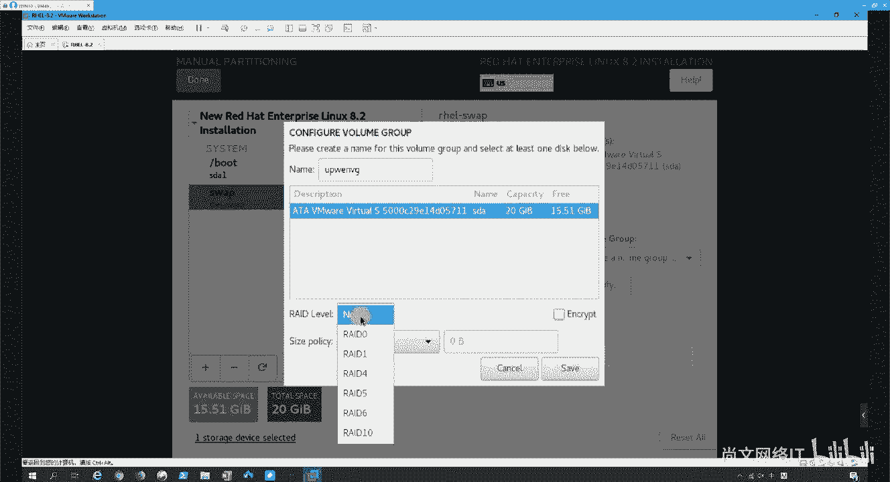

接下来，我们使用 LVM（逻辑卷管理）来管理剩余空间，这比标准分区更灵活。

1.  **创建 LVM 卷组**：点击 `+` 号。在挂载点处先不填，直接点击 **Add mount point**。在弹出的配置窗口中，将“设备类型”从 `Standard Partition` 改为 `LVM`。
2.  系统会提示创建新的卷组。我们为卷组命名，例如 `rhelvg`。然后，将剩余的所有空间都分配给这个卷组（可以选择“填充所有剩余空间”的选项）。
3.  **在卷组内创建逻辑卷**：创建卷组后，界面会显示该卷组。点击其下的 `+` 号，即可在卷组内创建逻辑卷。
    *   创建根分区 `/`：设置挂载点为 `/`，分配容量如 `10 GiB`，文件系统为 `xfs`。
    *   创建数据分区 `/data`：可以再创建一个逻辑卷，挂载点为 `/data`，使用剩余的所有空间，文件系统为 `xfs`。

**核心概念：LVM 结构**
LVM 的层级结构可以用以下关系表示：
```
物理卷 (PV) -> 卷组 (VG) -> 逻辑卷 (LV) -> 文件系统 (如 xfs)
```
在我们的配置中，整个虚拟磁盘（除了 `/boot` 和 `swap`）先被初始化为一个**物理卷（PV）**，然后加入名为 `rhelvg` 的**卷组（VG）**。最后，在卷组里划分出 `/` 和 `/data` 两个**逻辑卷（LV）**并格式化为文件系统。

### 关于 RAID 级别的说明

在分区界面，你可能会看到 **RAID Level** 选项。这是指基于操作系统的**软件 RAID**，它允许将多块物理磁盘组合成具有冗余或性能提升的逻辑设备。

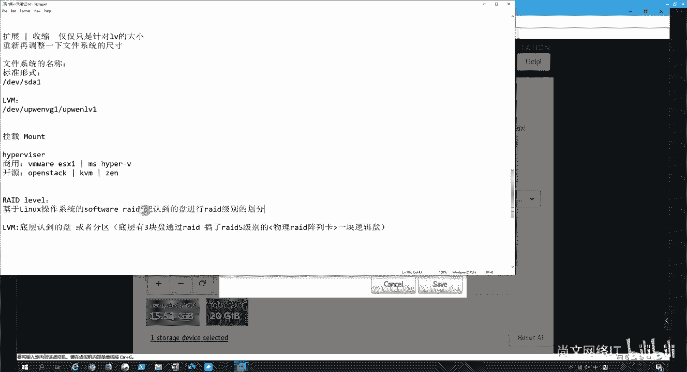

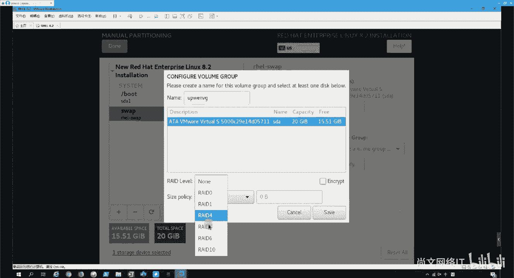

**公式示例：RAID 5 的可用容量**
如果使用 3 块 1TB 的磁盘做 RAID 5，其可用容量为：
```
可用容量 = (磁盘数 - 1) * 单盘容量 = (3 - 1) * 1TB = 2TB
```
其中一块磁盘的容量用于存储校验信息，提供数据冗余。对于初学者和本次单磁盘虚拟机安装，我们无需配置 RAID。

完成所有分区规划后，点击界面中的 **Done**。系统会摘要显示分区更改，确认无误后点击 **Accept Changes** 应用。

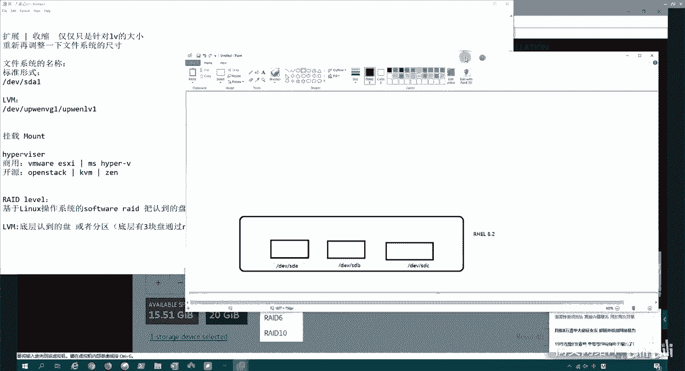

---

## 完成安装与初始设置

分区规划完成后，我们返回主安装摘要界面。

### 开始安装并设置 root 密码

点击 **Begin Installation** 开始安装系统。安装过程需要一些时间。

在安装过程中，我们需要设置 **root 密码**。点击 **ROOT PASSWORD** 进行设置。请务必设置一个强密码（包含大小写字母、数字和特殊字符）。设置完成后点击 **Done**。

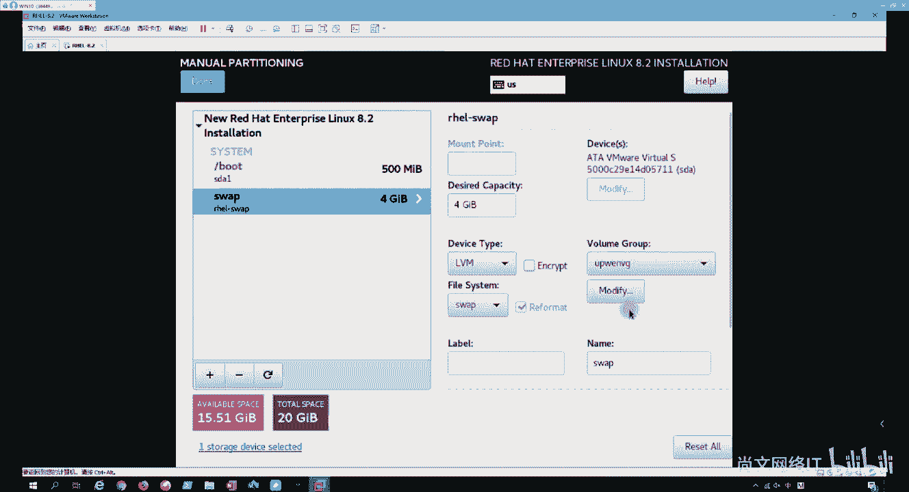

你也可以选择创建普通用户账户，这一步可以稍后在系统中进行。

### 安装完成与重启

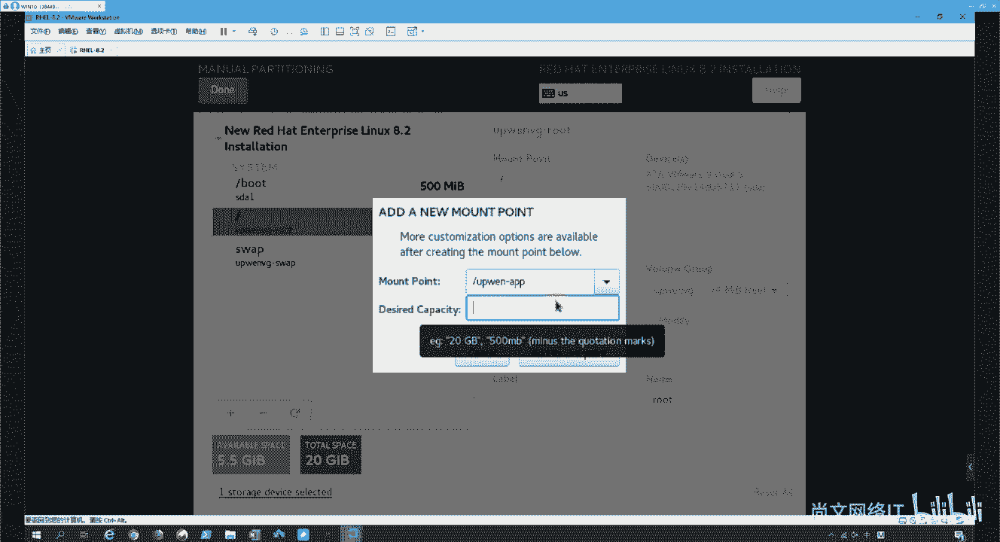

安装进度条完成后，点击 **Reboot System** 重启虚拟机。

系统重启后，将进入初始设置界面，可能需要接受许可证协议，并完成一些简单的配置（如创建用户、连接红帽网络订阅等）。根据提示操作即可完成系统的最终设置。

---

## 总结 📝

本节课中，我们一起学习了 RHEL 8.2 的完整图形化安装流程：

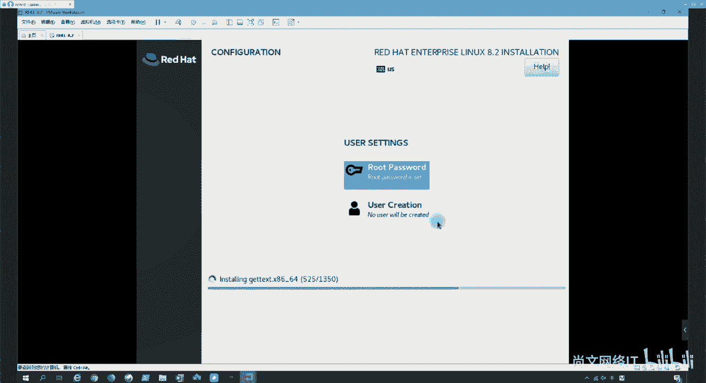

1.  **创建虚拟机**：在 VMware Workstation 中使用自定义模式创建虚拟机，并正确加载 ISO 安装镜像。
2.  **启动与初始设置**：启动虚拟机，通过安装引导界面，完成语言、时区、软件包选择等基本配置。
3.  **核心磁盘分区**：重点学习了手动分区方案，创建了必需的 `/boot` 和 `swap` 分区，并实践了使用 **LVM** 管理剩余空间，创建了根分区 `/` 和数据分区 `/data`。
4.  **完成安装**：设置强密码的 root 账户，等待系统安装完毕并重启。

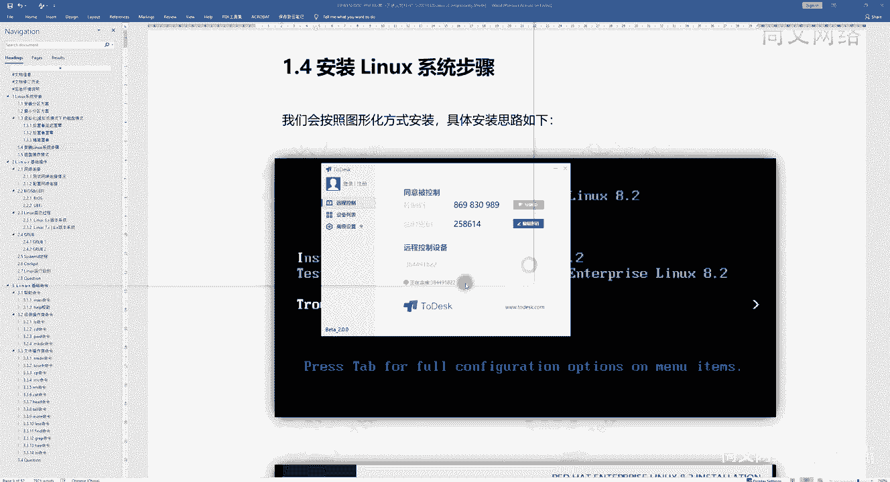

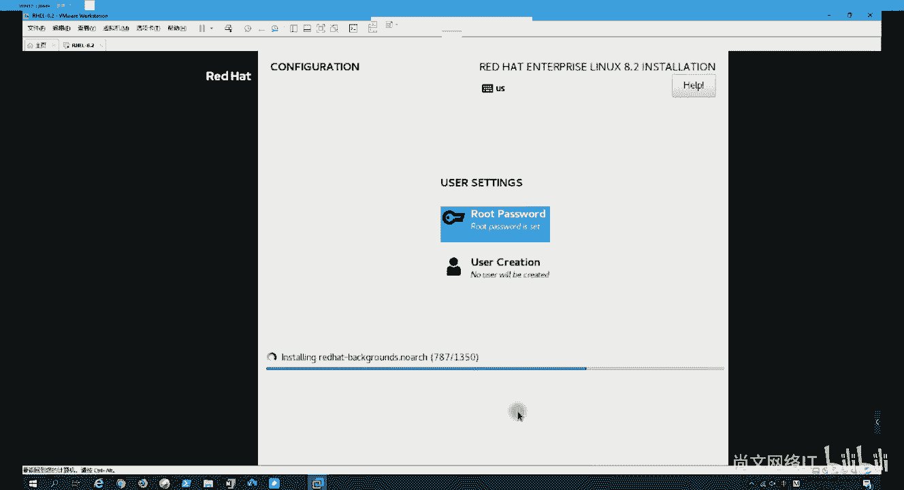

通过本教程，你应该能够独立完成一个带有自定义分区规划的 RHEL 8.2 系统安装。理解 LVM 的基本概念是后续进行磁盘空间灵活管理的基础。