Linux运维：RHCE8：09. 磁盘缓存两种模式说明 💾

在本节课中，我们将要学习磁盘的缓存模式。这是一个在安装操作系统或配置服务器存储时经常遇到的重要概念，它直接影响数据写入的效率和安全性。

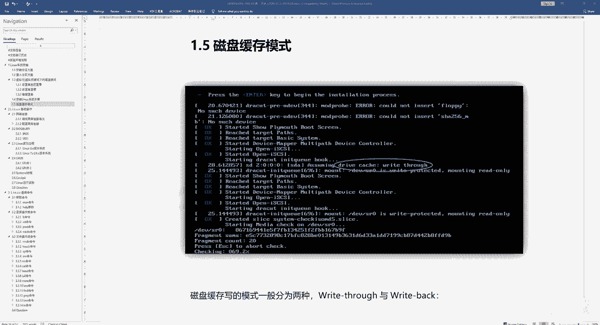

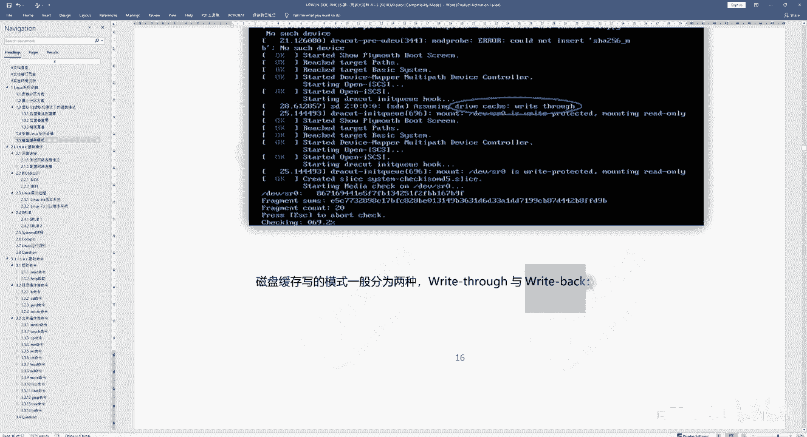

上一节我们介绍了磁盘分区模式，本节中我们来看看磁盘的缓存模式。在Linux操作系统引导过程中，你可能会看到类似 `drive cache` 的提示，这指的就是磁盘缓存模式。它主要分为两种：**Write Through**（直写）和 **Write Back**（回写）。

以下是两种缓存模式的核心概念与区别：

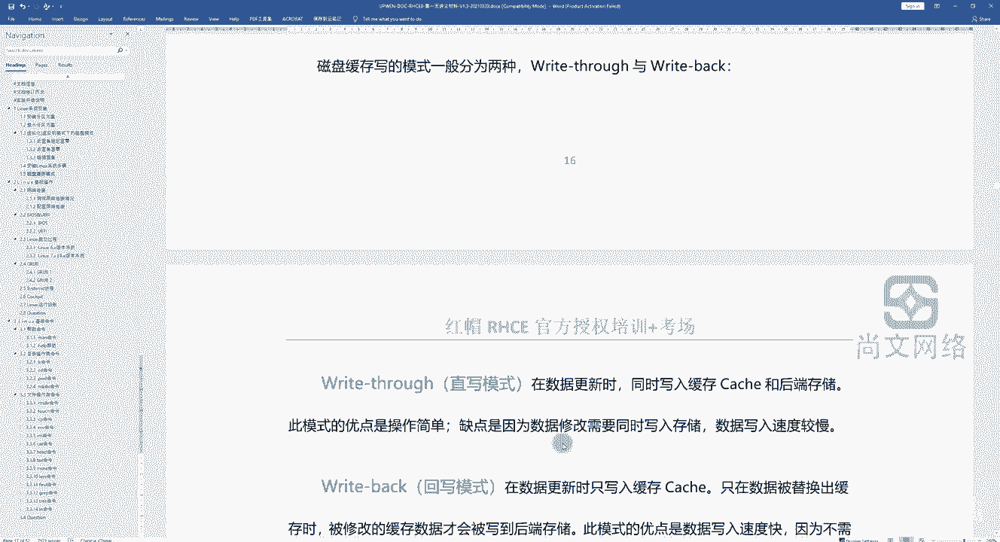

**1. Write Through（直写模式）**
*   **概念**：当数据需要更新时，系统会**同时**将数据写入缓存（Cache）和后端的物理磁盘。
*   **公式/流程表示**：`数据更新 → 写入缓存 + 写入磁盘`
*   **优点**：操作简单，数据安全性高。因为数据实时落盘，即使突然断电，数据也不会丢失。
*   **缺点**：写入速度相对较慢，因为每次写入都需要等待较慢的磁盘I/O操作完成。

**2. Write Back（回写模式）**
*   **概念**：当数据更新时，系统**只将数据写入缓存**。只有当缓存中的数据需要被替换出去时，被修改过的数据才会被写入后端的物理磁盘。
*   **公式/流程表示**：`数据更新 → 写入缓存 →（延迟到必要时）→ 写入磁盘`
*   **优点**：写入速度非常快，因为应用程序无需等待磁盘写入完成。
*   **缺点**：数据有丢失风险。如果在数据仅写入缓存、尚未写入磁盘时发生断电，这部分数据将无法找回。

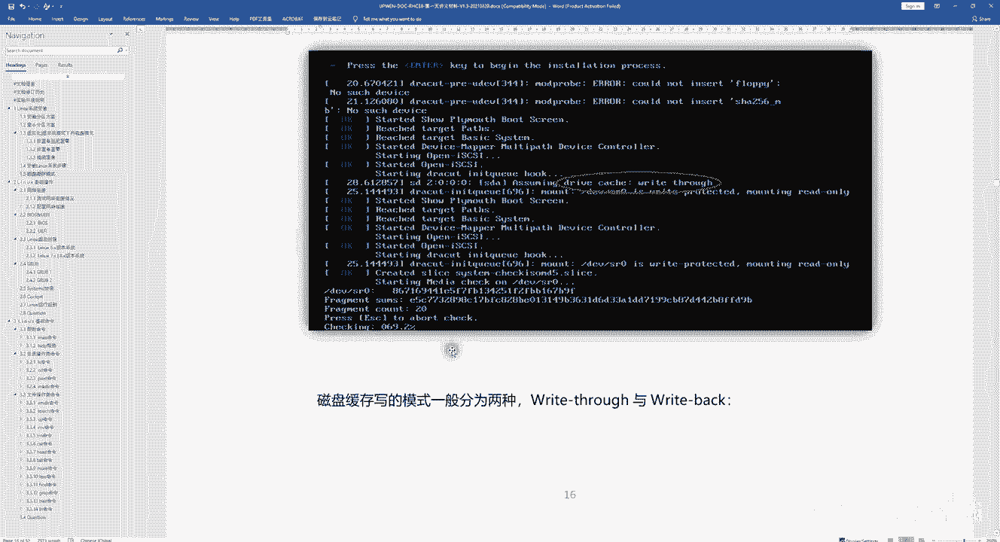

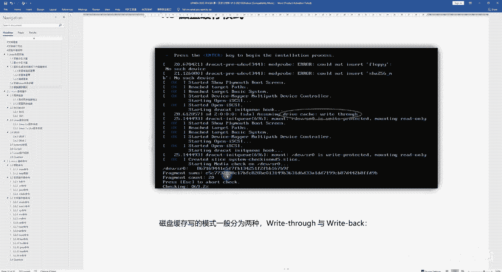

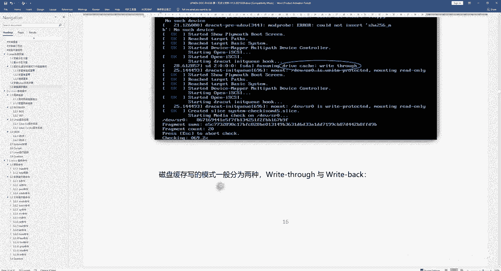

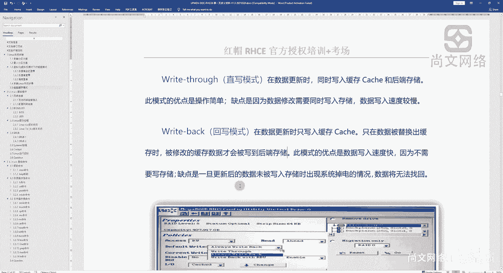

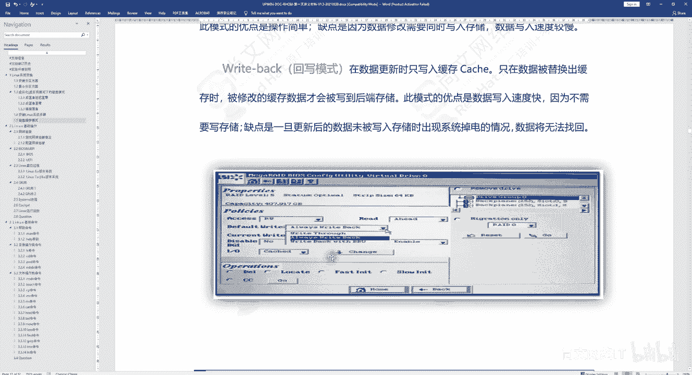

在实际应用中，这两种模式常见于服务器RAID控制卡的配置中。例如，在使用LSI MegaRAID等控制卡配置RAID级别（如RAID 0, RAID 5）时，通常需要为虚拟磁盘选择缓存策略（Policy）。

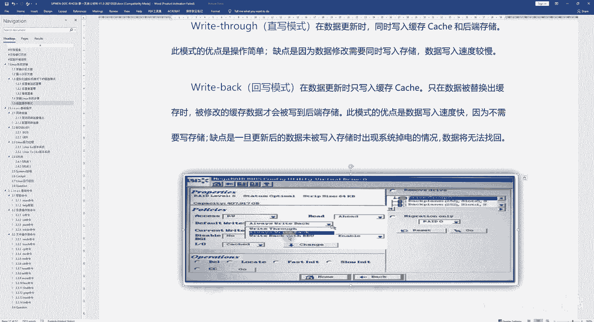

以下是一个配置示例中的关键选项：
```
RAID Level: RAID 5
Policy: Write Through / Write Back
```

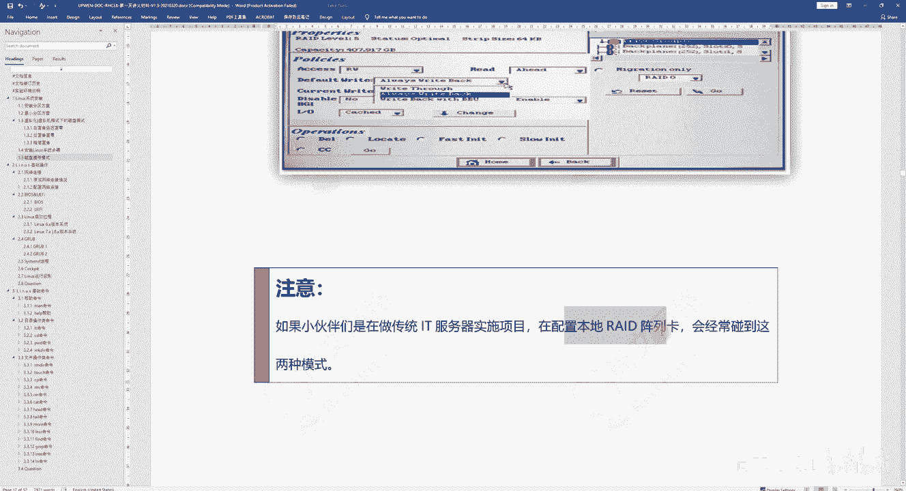

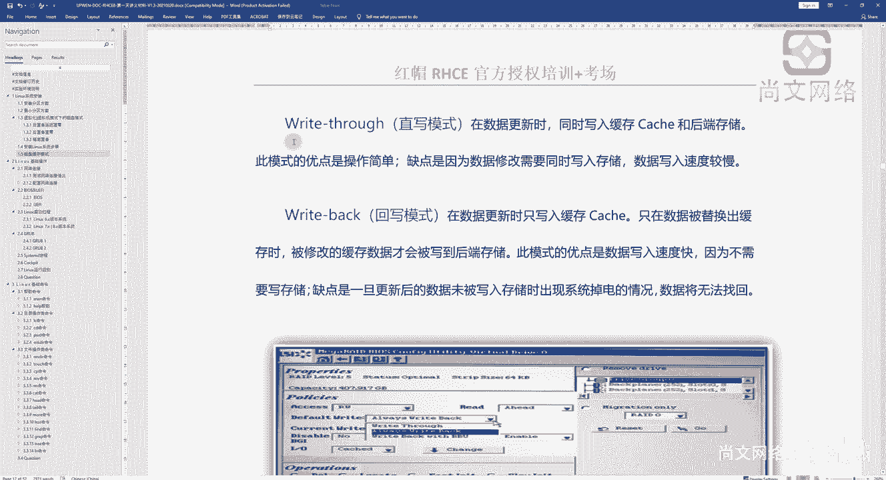

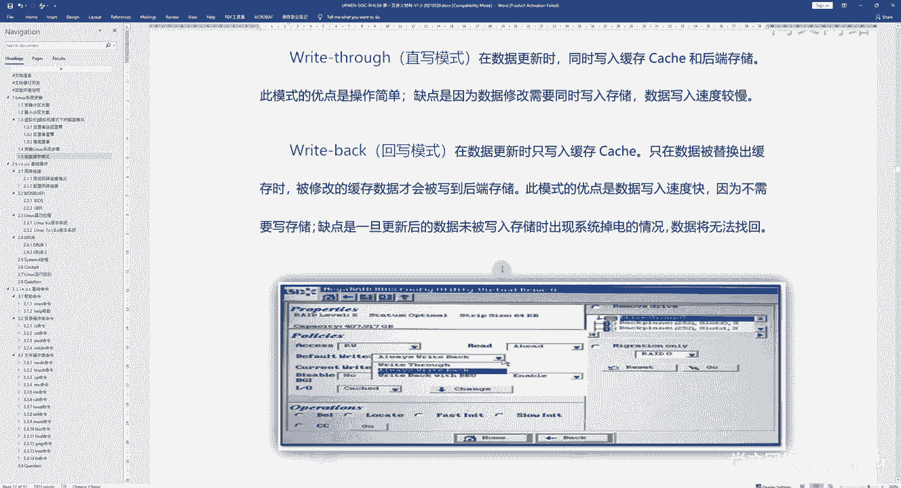

**注意**：如果你参与传统的IT服务器实施项目，在配置本地RAID阵列卡时，经常会遇到这两种模式。从数据安全角度考虑，我们通常建议选择 **Write Through** 模式，以确保数据的完整性。

当你的Linux系统安装在一块由底层RAID卡提供的逻辑磁盘上时，系统引导信息中显示的设备（如 `/dev/sda`）就应用了所配置的缓存模式。

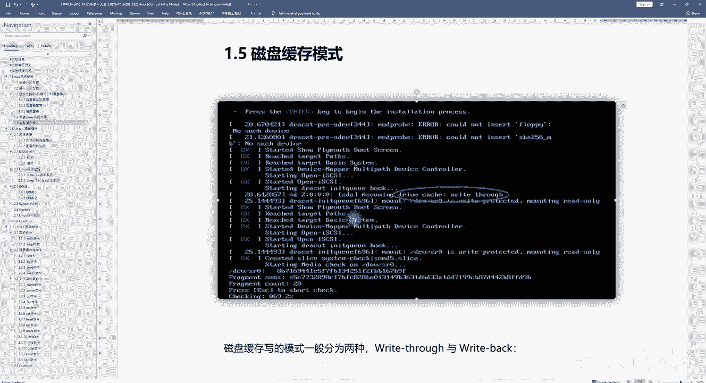

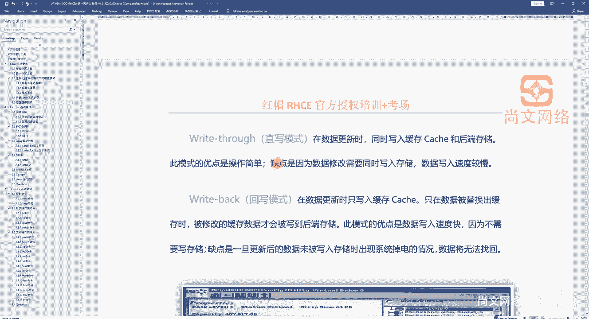

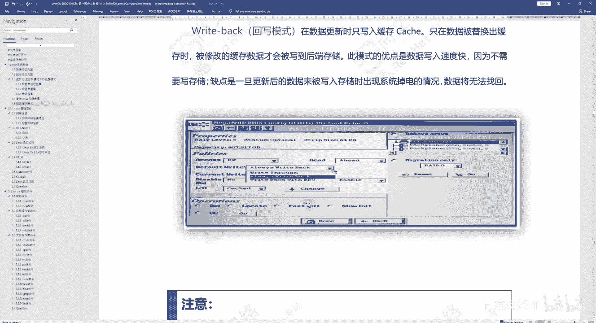

本节课中我们一起学习了磁盘的两种缓存模式：**Write Through**（直写）和 **Write Back**（回写）。前者注重数据安全，后者追求写入性能。在大多数对数据可靠性要求高的生产环境中，推荐使用Write Through模式。理解这两种模式有助于你在未来进行存储规划和服务器配置时做出合适的选择。