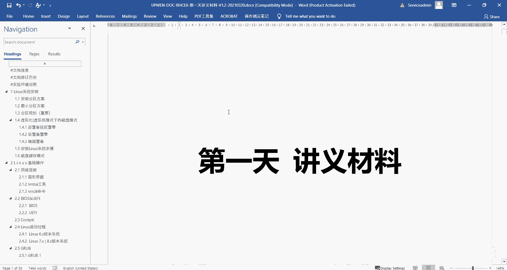
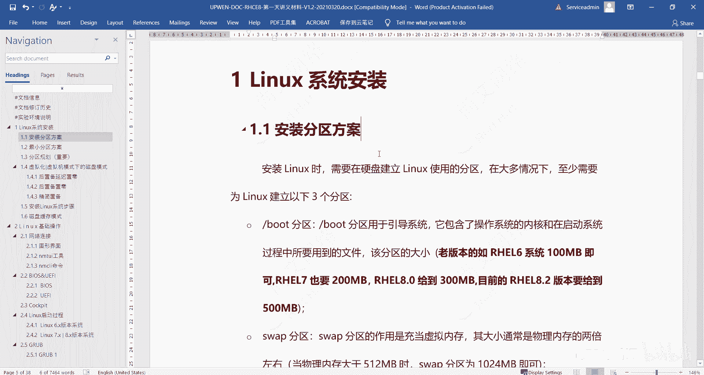
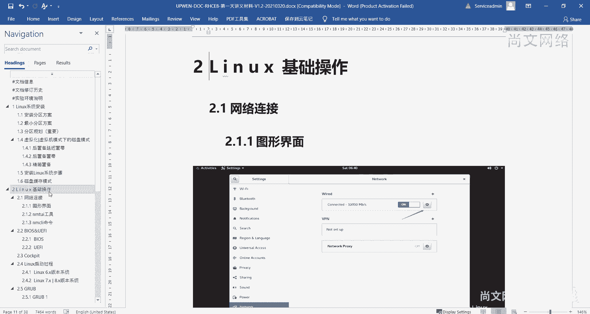
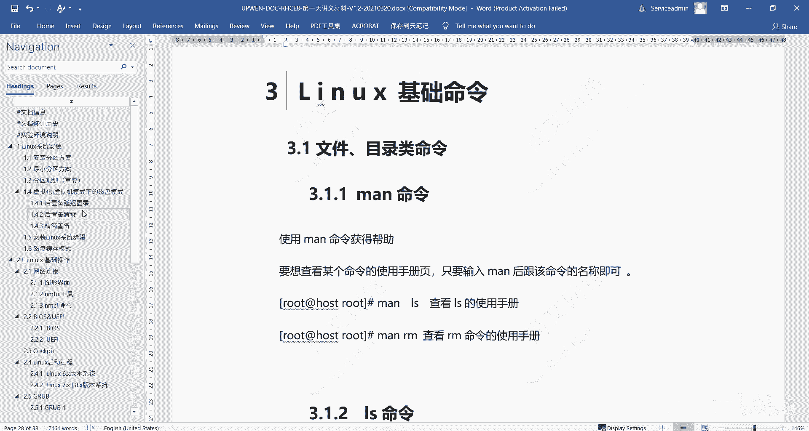
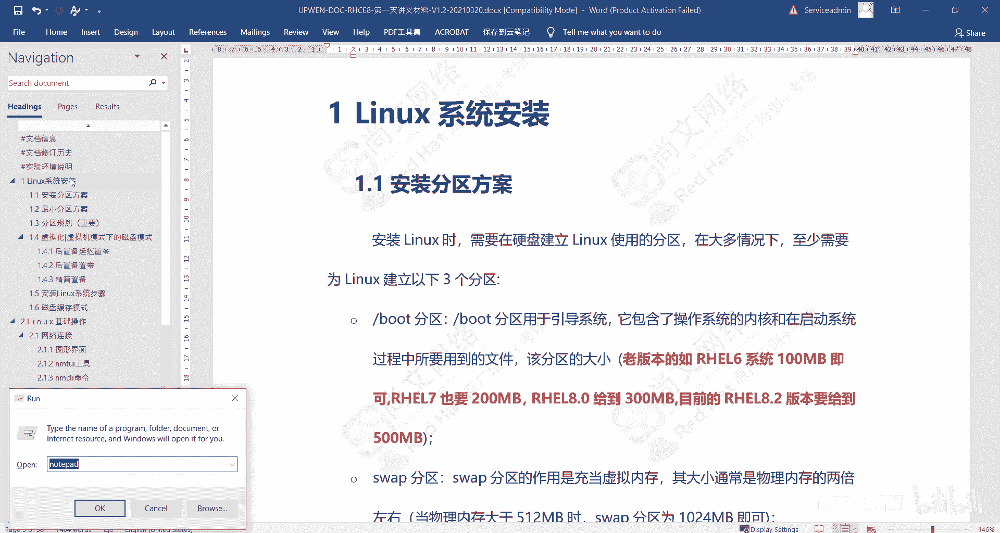
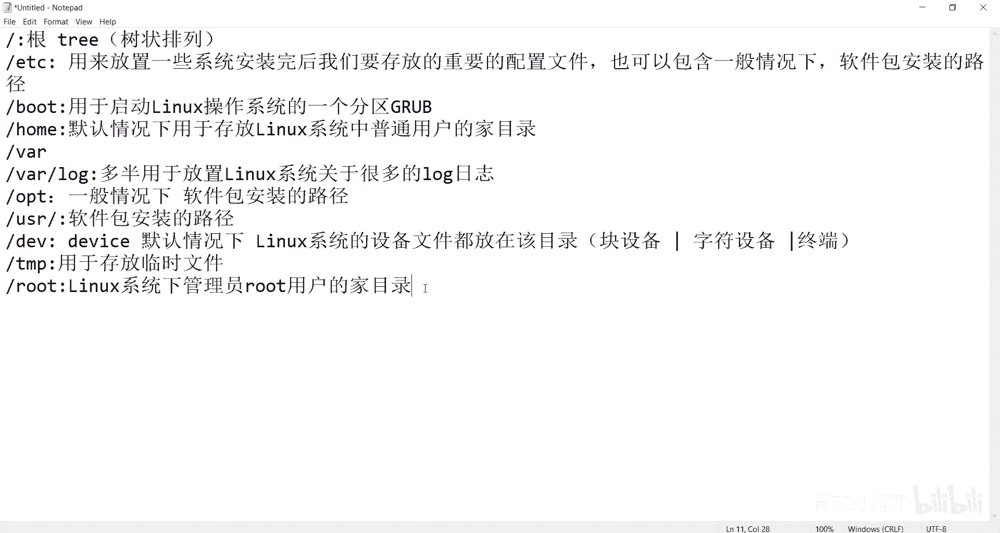

# 【尚文网络】-Linux运维／RHCSA／红帽认证／RHCE8系列录播视频 - P1：【尚文网络】-红帽RHCE8-01.Linux文件分区结构 - 尚文网络IT - BV15A411K7Af

然，大家好啊，这个我们现在开始来进行第一天的这个讲解。首先呢第一天呢我们大概分这样几块内容。第一个内容呢是。关于我们的这个呃第一部分呢是关于叫系统安装啊，系统安装方面的一些知识。

然后第二部分呢是关于这个linux的那你装完操作系统之后啊，关于这个linux操作系统，它会有一些基础的操作。比如说怎么去做一些这个网络连接，对吧？然后呢。

那个我们可能还要去了解一些关于linux的一些启动的基础，一些一些启动过程啊。然后再一个呢就是关于一些linux的一些运行级别的一些知识，这是第二部分。

第三部分的话，那就是到了我们的一些基础命令了。我们的命令呢就包含了一些文件类了。然后就是关于文件操作文件，不要比如说比如说创建文件。那个管理文件删除文件。那么与此同时呢。

还有我们还有关于一些这个目录类的。然后关于新建目录、操作目录对吧？删除目录管理目录啊，这一些技术的命令我们要这个去学习。那么这样的话就是我们今天的一块啊三个内容。首先呢我们先看一下第一个内容。

就是系统安装。

在我们谈到这个系统安装之前。我们要呃相信大家可能在这个之前也听过我的一些前置的课程，就是比如说我们的linux的一个发展的过程，对吧？它可能是从unux操作系统演变过来的啊，那这是一个。然后第二呢。

这个linux操作系统呢，它的核心是什么？应该是K，对吧？是K加上我们的一些这个呃一些关于叫GNU的一些project，对吧？就是一些关于金U这个组织提供给我们的一些软件包，也就是说Knal加软件包。

才是我们真正构建了我们真正的一个真正意义上的一个linux操作系统，对吧？这是第二个。然后再往下呢，就是那你这个linux操作系统到底有什么，对吧？我们要去装这个操作系统。你装操作系统的话。

你到底需要去。装什么东西对吧？首先第一个呢就是关于弹道分区啊，装操作系统是非常简单的对吧？非常简单，但是也不简单，为什么这么讲呢？因为我们在装这个操作系统的时候啊，我们会牵扯到一个重要的东西叫分区啊。

叫分区分区的话。如果我们。不清楚每一个分区的作用。对吧包括怎么去分这个区。那虽然你的操作系统可能会装上，但是我们后期的话很有可能会为此而付出一些就是。就是其实也就是说我们前期没有规划好这种分区的方案。

对吧？就是哪个分区要怎么分分多大，采用什么样的这种形式。那如果是这样的话，那我们的这个分区啊，在装这个造景之后啊，可能会要去重新退倒再来啊，所以说我们在装的时候，前期一定要把这个分区方案规划好啊。

这是最重要的。Yeah。那么谈到这个分区的话啊，谈到分区的话，linux操作系统下面有多少分区啊，这个呢我们需要去。去。

啊。我们要再回再来去看一个啊。首先第一个呢是。有个这个东西叫根啊叫根分区啊，这个东西叫根。啊，根分区根分区的话应该是我们整个laingux操系统一个最顶端的一个分区，对吧？啊，叫根分区。

因为laingux操系统它是一种这种树状的这？叫 tree是吧？叫树状的。No。这种排列。对吧按照这种方式来进行排列。那么最上面的那个大的那个东西呢，这个这个根对吧？就是我们的一个树状的一个一个一个根。

对吧？就是叫根啊，这是没问题。然后第二个呢叫比如说叫ETC啊，ETC。这个目录里面是主要是用来干什么呢？是用来放置。Yixi。呃，就是我们系统装完后啊。安装完后，这个我们要。呃，存放的呃重要的。

配置文件啊，重要的配置文件。我们几乎上这啊可以说我们是都要放在这个ETC这个目录下啊，都要放在ET目录下。然后再往下的话，比如说啊bot。这个东西叫启动是吧，跟启动有关呃，BOT嘛，对吧？跟启动有关。

启动用于啊用于启动。启动哎呦用为启动我们那个linux操作系统。因为启动另一操系统的呃的一个分区。对吧。然后再往下啊，这个分区home。home这个home是加了意思是吧？也就是说是一个什么呢？

是默认情况下啊。用于存放linux系统中。这个普通用户的。加目录啊，一定要知道啊，这是默认情况下啊，放于linux系统中的普通用户的加目录。当然我们的这个lin系统呢。

它这个普通用户的加目录可不可以不指定home下，可以啊，这是可以的。我们只是说这是一个默认，就是操作系统，你装完之后，它默认会给你一个home目录。

就是用来默认情况下放置于我们这个普通用户的一个加目录啊，这个呢大家要去要去理解。那还有一个呢，比如说袜。哦。呃one log啊，这样的一些呢，我们多半是什么呢？多半。用于放置放置这个linux。系统。

呃，关于很多的这个log就是日志，对吧？啊，就是这个日志我们可能会放在va或者放在va log下面啊。这是这个这个这个这个one log。那也就是说这个va log的话可能会将来变得很大。

对吧可能会这的变得会非常大啊，所以我们为什么要去前期去讨论一些这个分区方案啊，就是在这儿。那这种方这个这个valog的话，既然我们可以考虑，比如说我们可能会做一些大数据的项目，然后做他数做大数据的项目。

那你在做数据分析提取的时候一定会产生一很多的这种log。那你有必要将这个袜log。对吧单独把它划到一个文件系统里面啊，对吧？单独放在一个文件系统，就这个样，对吧？啊，这是one log。好。

然后我们再往下看啊再往下看这个比如说OPT啊OPT。OPP指的是什么呢？是指的是这个呃一般情况下啊一般情况下。我们不是装软件包吗？对啊，我们装软件包，这个装软件包之后啊，软件包。这个。

这个就是你装在哪个路径啊，安装的路径。我们可能会放在OPT下面啊，那除此之外的话，还有一个比较重要的一个分区，或者说叫目录啊，USR这个东西呢也是啊这个这个软件包啊安装的路径啊。

也是安装软件包安装的路径。对吧啊，当然哈当然我们这个ETC啊，ETC也可以。包含啊一般情况下这个。那个那个软件包。安装的。路径啊，就是也是一就他我们这个软件包吧，装完了之后啊。嗯，装完之后。

我们要不然可能会放在ETC下面，要不然可能会放在USR下面，要不然可能会放在OPT下面啊，这是一般情况下。当然你我们也可以去自定义的时候啊，后期的话我们去讨论这个软件包的安装形式，有哪几种啊。

所以我们这个后期我们再来讨论。嗯，除此之外的话，还有什么呢？还有一些。DV啊这个目录这个叫device。device是什么意思啊？应该是设备的意思，对吧？设备那也就是说默认情况下是吧？默认情况下。

这个这个linux的。系统的。linux系统的这个呃设备文件。都放在。该目录。对啊，都放在这个项面。啊，那比如说什么，比如说这个。比如说这个这个块设备。瓦块设备。然后制服设备。啊，什么叫块设备呢？

也就是说我们的一个硬盘，对吧？一块盘或者是一块盘下面的一些这个分区，还有一些什么字符设备啊，比如说我们的键盘鼠标对吧？还有一些呃比如说还有什么终端，对吧？啊，终端啊，也是我们的一些设备类型。No。嗯。

比如说还有一个啊，比如说TNP。啊，TMP。这个是用于存放临时的。呃，一些呃就是临时文件嘛，我们就一般把这个临时文件放在这个TMP下面啊，TMP下面。还有一个呢是这个什么呢？是这个。诶。

LOT啊这个目录啊这个目录呢是呃linux系统下啊。系统下。管理员。root用户的。加目录这个东西就没有默认情况下了，对吧？就不像这个home一样。我们会存放一些什么这个。

对吧默认情况下会存放普通用户的加目录，对吧？那么你的root这个斜杠root啊，根下面有个root。这上面的话这个目录就是就是我们root用户的账目录，没有默认是吧？他就是他啊。好了。

然后一些基本的我们这些能用到的，就是我们平常能看到的这些分区啊，我们叫分区啊，或者说叫目录。对吧啊，差不多就是。就是这么多啊，我们再来看一下啊。第一个呢根呢这个是肯定毫无质疑的，对吧？

肯定是一个就是一个树根啊，一个叫根。第二个呢，ETC啊，用来存放一些啊重要的配置文件。也可以包含。一些这个什么呢？这个软硬包的一些安装路径。然后boot是用于启动linux操作系统的一个分区啊。

就是我们跟启动有关的啊，只要你这个操作系统能起来，肯定是跟这个bot有关，对吧？啊，里边可能的话我们会会有一个什么呢？叫G。对吧啊会有个东西叫顾二部啊，叫这么个东西。都要注意。

然后啊然后我们再往下看啊再往下看。home的话对吧？咱们刚才说了啊。这个。这个什么呢？这个我们的啊默认情况下，这个普通用户的加目录啊。然后再一个啊这个valog对吧？就是我们存放这个log的啊。

这个这个很多的啊logg的志都放在这里面。然后OBT啊一般情况下软件包的安装路径，然后USR是我们软件包的安装路径。再一个呢就是DEV啊，就是所有的设备文件都放在这儿。

那TMP啊放在啊用于一些存放临时的文件啊，然后再往下呢就是一些啊叫ROT是吧？雷用系统下的一些管理员的用root用户啊这么一些项目录啊。好，呃，我们简单的呢去把这一些重要的啊。

就是我们平常能用到的一些啊文件系统，或者怎么叫文件系统也好，或者叫分区也好，对吧？或者叫目录也好，我们大概梳理了一遍是吧？大概梳理了。所以一个重要的概念就是我们的这个linux操系统。

它是一个竖状的排列，也就是说根下面会有ETC。然后ETC可能下面还会有一些文件，或者是怎么录，对吧？然后ho可能也会有一些子纹件或者怎么入啊，包括哇OTTUSRDEVTMP rootot都是一样的啊。

都是一样的。所以我们整个把它传起来之后啊，就发现它是一个竖状的结构啊，数据树上有。所以在linux操作情况下啊，大家要记住，后期我们可能会学到一个命令叫fin的啊。这个范的命令一定要去好好的去掌握住啊。

因为因为他既然是树状的话，它的文件太大了啊，文件太大了，对吧？啊，文件太多了，所以我们必须要去通过搜索查找的这种方式，把某一些我们想要找到的文件把它给找出来啊，这要注意。好，这是我们的。啊。

关于一些分区啊，这是当然这些我们在全日课里面已经做过了是吧？所以我们去去看一下啊，到时候去看一下啊。然后好，这个是我们的一些这个分区啊一些情况。啊，那我们先先讲到这儿啊，大家来这个再回顾一下啊。

