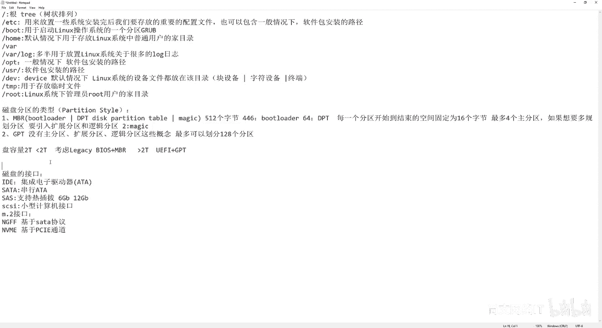
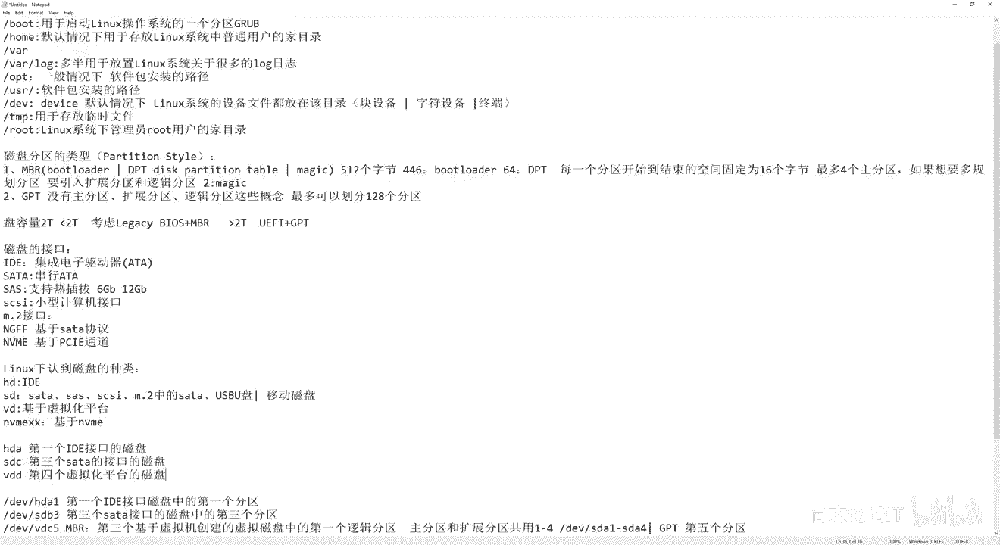

# 【尚文网络】-Linux运维／RHCSA／红帽认证／RHCE8系列录播视频 - P2：【尚文网络】-红帽RHCE8-02.磁盘分区相关知识 - 尚文网络IT - BV15A411K7Af

好，然后我们再回来。嗯，刚才我们这个介绍到了关于linux操作系统的一些啊几个就我们常用的啊，或者说比较重要的叫分区结构啊，叫分区结构。比如说有跟有GDC有boot，有home有va。

有valog有OPTUSRDEVDNProot是吧？那么接下来的话我们要看了，那么你不同的这种分区的结构啊，它应该是要对应出我们的这个既然谈到分区对吧？那么也就是说要分别去对应我们不同的这种。

这种操作系统的就它所在的这个磁盘的分区，对吧？啊，这个相信大家可以应该会可以去理解到。就是说比如说我们这个操作系统它这个操主机上可能会有一些盘，对吧？会有些盘。

这个盘呢那个第一块盘可能呃上面有我们规划嘛，这个规划几个分区。那么第一块盘的第一个分区，我们可能是给根来用，那么第二个分区，我们可能会跟给这个boot来用。

第三个分区我们可能会给home运用啊等等以此类推。那么也就是说不同的磁盘分区会对应不同的我们的linux操系统的这个分区的结构，啊，可以这么理解是吧？那么我们分完区之后，对应出不同的文件。

这个这个这个目录，就或这个根EDC啊，我们叫做分区结构或者目录是吧？目录结构，那最终的话我们是不是要去做文件系统的这个这个使用，对吧？可能稍后的话我们会讲说一下。有文件系统。那么这样的话。

我们要去讨论一下关于磁盘分区的一些概念。对吧瓷盘分区。那你我们谈这个磁盘分区的话，首先第一个啊。磁盘分区。首先第一个，我们是要首先要知道我们这个磁盘分区的类型。对吧，收房分具的类型。

第一个呢我们叫MB2。然后第二个呢我们叫。叫GPT对吧？啊，叫GPT。然后。我们来看啊，那么你的这个分区类型，就是说我们这个磁盘，我们叫做PARTITpartition。sll是吧。叫分区的类型，对吧？

那么首先啊我们看假如说我们是windows套系统，对吧？你windows操系统，我打开一个磁盘管理器，对吧？diskMGMT点MC。diMGMT点MC。好，然后我们这个回车回车之后啊，我们会看到一些。

啊，这是我的当前这个操作系统，它的一些这个什么呢？一些这个啊磁盘的一个分区的使用情况，对吧？首先呢你点随便找一个啊，愿找第一块盘，第四个零吧，对吧？然后上面可能会有一些。恢复分区EFI的对吧？

包括还有C盘。啊，D盘啊E盘，那我们点一下右键点属性对吧？点属性我们来看一下啊，它的这个分区的一些类型，一些分区类型。那么你的这个分区类型会有会包含什么东西呢？啊，会包含什么呢？首先第一个啊。

这个地方是不是有一个valueum看到了吧啊，有一个券啊，叫valueum。那么这个券呢？它会有一个东西叫partition still啊，当然我这是英文版的操作系统是吧？

partition style叫什么叫GUID的partition table，我们简称为叫GPT。所以说从这个地方我们就能看出来某一块盘对吧？某一块盘它的什么呢？它的这个分区的类型是什么，对吧？

是GPT还是MBR。那么GPT和MDR之间到底有什么？

这个区别呢啊首先第一个呢MB2呢。呃，我们。他会包含三个内容啊，第一个叫bo loader。然后第二个呢，它会叫这个什么呢？叫这个叫DPT啊，就是说叫。叫磁盘分析表啊。

叫discPRTITpartition啊，然后这个table啊叫DPT。第三个呢叫magic啊，做一个这个校验。那也就是说它一共是512个。512个。嗯，自己。那么前46。是谁呀？

叫boat loader啊，前面446是boat loader啊，这个我们要注意。然后中间的这个64个字节。啊，446啊，64个字节，我们就要。叫DPT对吧？叫DPT那么最后呢就是446加64应该是5。

510对吧？最后还有两个字节的话，我们是做用来做这个magic啊，就做校验的对吧？那么也就是说啊，所以我们的整个MBR的大小是固定的，就是512个字言，对吧？前446各自节。

我们是叫bo loader啊，boot loader是干什么用的呢？是用来做一些开机引导的一些程序，我们会把它放到这里边。那第二个呢就是64啊，64叫DPT。也就是说大家可能之前听过啊。

就是说我一个盘就我一块盘。如果是MBR的模式下，我可能最多会画最多会画。4个。这个主分区啊，相信大家应该都听过，对吧？啊，什么叫主分区？我们还是打开我们的磁盘管理器。

我的windows了对吧？C盘啊。这个地方。对吧你可能会会看到，因为呃当然我们是这个这个是GPT的啊，我们可能会看不到。那这个地方会看到是吧？有一个盘叫primary partition叫主分区是吧？

叫primary partition。那也就是说相信这一块盘啊，当然这是我1个SD卡是吧？SD卡它的partition是要叫什么叫ma record啊，叫MBR啊MB2。那么也就是说既然是MBR的话。

我们会有主分区这么一说。那么在MBR下，我们最多最多可以画4个主分区，为什么呢？

因为我们刚才看了DPT是磁酸分区表，是64个字节是吧？那也就是说每一个啊每一个。那个开始就是你的这个这个分区啊，开始到结束的。那个空间就是磁盘的那个空间啊。固定为16个字节。

那么也就是说你的你一共就64个点除以16等于几啊，是不是就等于4？所以说注定了啊就是这个机制就注定了我们在MBR模式下，最多可以画4个组分区。那如果想要。多ohua。分区。要干什么？要引入谁呀。

要引入扩展分区。和逻辑分区。对吧啊扩容分析和逻辑分区。那么也就是说我们当我们要划到第五个分区的时候，我们是不是就没有办法让这个分区为主分区了？那只能是干什么？通过快分区去引行出更多的这种逻辑分区。

对吧啊，通过逻辑分析来实现。那么在windows套系统下面，我们会这是一个常识是吧？

windows操作系统下你的扩展分区是没有逻辑驱动器符号的。什么叫逻辑驱动器符号？就是我们看到这个CDEH对吧？比如说我要规划，对吧？我我创建我我来搞搞这个扩展分区，然后点右键对吧？

就给它付附一个盘符是吧？叫逻辑驱动器符号，这是不对的啊，不可能的，在windows下我们的这个扩展分区是没有逻辑驱动器符号的啊，只有逻辑分区它才会有什么像A4，对吧？往后排对吧？这种逻辑驱动区的符号。

也就是我们的盘符啊，这个呢我们要知道啊，这个要知道。

那么对于linux操作系统啊，linux操作系统也会有一块盘，我们叫这个MBR或者GPT只要是MBR，不管是什么操作系统，它一定会有主分区或展分区log辑分区。那么在linux操作系呢，大家要注意啊。

你的MBR下的模式下的主分区啊主分区。和我们的这个扩展分区是啊共用啊某一些。这个标识符的，也就是说你可以这么理解啊，就是它和windows的一些不同。windows咱们刚才说了。

你你是没有办法给扩展分区。来附一个所谓的逻辑驱动器符号吧，对吧？但是你的这个linux操系统，如果是MB2的模式下。这个扩展分区和主分区会共享共用啊某一些。所谓的这种啊盘符或者说所谓的这种标志号。啊。

大家要理解这东西啊，有什么东西。好，这个我们待会儿再来说啊，待会再来详细说。那么也就是说MBR这就是MBR对吧？一共512个字节前446不是loader，然后64个字节是每一个分区从开始结束的空间数啊。

它的这个大小就是固定式6个字节。那也就是说64啊除以16，就最多可以画几个画4个主分区。如果想要多规划的话，要引入灌上区和勒分区了，对吧？这是第一个啊MB2。那么第二个的话叫GBT了，对吧？

GPTGBT应该是什么呢？就是没有。主分区。扩展分区。逻辑分区。这些概念。啊，就没有这些概念了。应该是最多可以划分128个分区啊，最多可以划128个分区，对吧啊？呃，然后呢这个是GPT啊。

GPT就相当于是我们的功能，就是我们在规规划这个分区的时候，它的功能会比这个MBR会大一点啊，会会要多，对吧？功能要好。那么我们对于这个磁盘，就我一块盘，我认到了这块盘之后。

我们什么样的场景我们去做MBR，什么样的场景去做GPT。首先第一个呢就是大家可能我们都是可能都会是做这个就或多或少的啊会传过机，对吧？会传我们的PC。呃，在我之前在刚参加工作的时候，那时候对吧？

就是去信息城去传啊，传了之后呢，那个时候就比较老是吧？包括这个这个磁盘分区，它那个磁盘啊，它有个东西，就它那个盘，就是你的盘片儿或者是你的。这个什么呢？你的这个这个盘了那个。板儿都是在。

一个地方啊都是集成在一个地方。啊，所以说啊这是一种磁盘的接口啊，我们叫它叫比如叫叫IDE对吧？叫IDE啊，这是一种接口啊，我们说叫磁盘的接口啊。对吧对劳的实者IDE啊。叫集成电子驱动器是吧？叫集成。

电子什么驱动器啊，IDE。然后再往后再往下，对吧？当我上大学之后，当我上大学之后出来这么一个东西叫s塔。啊，叫沙糖。对吧相信大家也不陌生啊，萨塔SAT啊串型的这IDE啊。

我们还有个学名叫叫叫什么叫ATA啊。那么你的萨塔呢是串型的啊，就是串型。一次。对吧是串新问题。没错吧啊，创新一题。然后再往后呢，还有一些什么接口啊，就当然我们的一些平常我们做传PC的时候。

可能就是呃老的这IDE，包括现在的话我们一直在用s塔，对吧？那么如果是你是像我们参加一些集成的这种项目啊，实施的项目，我们可能会接触到一些服务器啊，服务器。那服务器的话。

它更多的是用什么口是用srs的口啊，是用srs的口，这个sRS的口最多它的这个特点是是支持这个热插拔的啊。什么叫热插拔，就是就是你的盘在这个工作当当中，对你的服务器，你的主机在加了电的过程中。

你仍然可以把这块盘把它给拔下来啊，拔下来，不用担心过电的问题是吧？就它叫热插拔啊。那么你的ID你的s塔这个是不行的对吧？是不支持这插法的啊。而且你的sars的话，你的这个这个速率啊。

它的这个背板的这些速率，你服务器后面可能。你要插多少盘，它可能会有一些这个硬盘的IO背板，对吧？背板的那个接口的速率。会比较高啊，比如说有6GB的对吧？有这种6GB啊。还有什么12GB的对吧啊这种。

这是s斯的那还有一种呢是s啊叫s Ci呢叫小型计算机这个接口啊，叫小型计算机接口。这个C呢可能大家可能接触的不是特别多啊，因为我之前呢是做这个IBM小型机出身的啊，所以说这在老的一些小型机的这个主机上。

我们会看到叫s接口的这种啊这种这种磁盘啊。然后再往下呢，就是嗯还有一些。嗯，比如说有这么个东西叫M点2是吧？对吧M点2啊M点2。M点2的接口对吧？接口。那么M点2的接口，一个叫NGFF啊，叫NGFF。

叫什么呃nex generation的这个这个factorory什么interface，就是类似于这样的东西啊。然后这个东西呢我们可能是理解为叫基于什么，就基于sta协议的。啊，还有一个叫NVME对吧？

这个大家想想都听过啊，我们是基于。这个PCIE啊通道或者是对吧？协议啊，基于PCIE通道。那么哪个快呢？那肯定是NVI密快，对吧？NYIE的是比较快的。这些就是关于我们经常可能会遇到了一些接口啊。

关于磁盘的接口，都从老的IDE然后再往下呢是这个s塔对吧？再有呃还有一些服务器领域的，比如ss，当然也支持现了M点2对吧？啊，也是支持的啊，这些呢就是我们的接口，那么为什么要去说接口，对吧？

为什么要去说接口呢？那么接下来的话，我们就要。开了对吧？我既然我把一个分区，我一个盘拿过来之后，我先去把它规划为什么MVR或者是GPT啊。GPT。然后再一个对吧？增换的接口就你的这个分区的类型啊。

你的分区的类型，我们通常怎么去使用它是吧，怎么去使用它这个东西呢可能跟接口没太大关系。就是你假如说啊假如说。你为这个盘。容量2TB是一个界限。比如说我小于2TB。嗯，考虑。叫什么叫bios。加MB2。

啊，这种模式。主要就是就是叫传统的什么叫lexiLEGHCN叫lexi啊。就是这种传统的bios的方式去加MB2的这种磁盘的分区类型。对吧如果小于2T的话，是是这个样。那如果说我是大于两T的呢，对吧？

如果是大于两T，我们考虑什么？就么UEFI加GPT的这种方式。也就是说我们从磁盘的容量的这个维度来讲啊，2TB是个分水岭啊，是个分水岭啊，这是一个。啊，这个没问题是吧？啊，这个没问题啊。

然后第二个呢就是说如果你的这个服务器啊或你的主机比较老啊，它可能会用lexibios啊，就是我们传统的dos是吧？传统的dos那这样的话我们可能会更多的比用MBR。那如果你是UEFI的话。

我们可能会更多的考虑这种GPD啊，就是这样的区分，对吧？这样的区分。

好，那么接下来磁盘的接口分区的类型我知道了。磁盘的接口对吧？磁盘接口我也大概知道了有哪一些。

那么接下来的话就是说我们在linux操作系统下怎么去标识我们的盘。我们的分区对吧？我们是按照什么呢？按照。linux下认到。验到什么呢？验到磁盘的。这种种类啊。

假如说啊假如说你是1个IDE接口的一个磁盘。那我们会用叫叫HD来表示。明白吧？叫HD来表示。那假如说我可能是一个串型的AT是一个沙塔的。或者说一个sars了，或者说是一个了，或者说是一个。

这个M点2中的这种类似于这种沙塔。啊，那我们叫什么呢？叫SD。明白吧？叫SD就是说HD啊，我们HD叫叫它就代表了IDE啊。如果你是1个IDE的盘的话啊，接口的盘，我们就用HD来表示。那么你的这个SD呢。

比如s塔。对吧。萨s。那么是加岁啊。还有什么M点2。Zhongde。沙塔。对吧那这样的话，我们就是用什么叫SD来表示。那么还有一种呢叫VD。就是说我们可能会基于呃虚拟化平台啊，就是说我一天虚机对吧？

一天虚机虚拟化平台。然后呢，我生成了一个虚机，虚机里面的一块所谓的物理磁盘，就虚拟机中的一块物理磁盘叫VD，不要，叫我们叫VD。那么还有一个呢叫什么叫NV。M E。多好啊，那么这个呢是代表什么？

是基于这个这个NVME的啊。基于NVME的啊这种盘对吧？这种盘。啊，所以我们更多了啊就是一个叫HD，1个SD1个VD，还有一个叫NVME的啊这种那好了，有的人可能会问了，咱平常的一些那个什么呢？

一些USB的U盘或者是一些USB的什么呢？这种或者type C的是吧？type C可能呃我们。也可能会用啊也可能会使用到。那么一些USD的这种啊，也是我们经常常用的。那么像这些呢，我们都叫它什么叫SD。

导觉了SD就是归到这个SB啊，包括什么USB的。这个那个U盘是吧？或者是什么一一个移动啊磁盘，我们都叫它SD啊SD。好，那接下来啊接下来这个种类我们知道了啊，接口我们在零用下怎么去标识？

那么也就是说那么第1个IBE的盘的话，我们叫什么叫HDA。就是。第一个。啊，第一个。ID。接口的。是盘。啊，那如果是SDC呢。是第三个。啊，比如说萨这个这个这个这个萨s的吧，或者是sta的吧，对吧？啊。

这种接口的。磁盘对吧？啊，那么你包括你VD也是的啊，VDVDD吧代表什么？是第四个啊。这个啊。虚拟化平台。吃盘。对吧。包括NYE啊也是一样的道理是吧？啊，NME01啊，什么02啊，就这些啊。

我们是基于NYME的啊，这个我们就不再啊罗列了。

那么在linux下，我们去把这些把它给穿起来是吧？我们用这个东西还记得我们上面说过了，叫有个有一个目录啊，或者说有一有一个目录结构叫D斜跟下面有个DV，对吧？那也就是说我们把它穿起来。

DEV下的HDA代表是什么？是第1个IDE接口的磁盘。那么第一个这个磁盘的分区对吧？你翘块盘我们认到了啊，它是第一块盘IDE接口的盘。那我们我们把它进行分区，分完区之后怎么办呢？我们是分区之后。

你是不是就会有关于这个分区的标识号了。那么也就是说当我如果是第EV小的HDE的话，代表的是什么？是代表的是这个第1个IDE。IDE接口的第一块盘对吧？的第一个分区啊，那也就是说是第一个。ID。

接口的啊DE这个这个磁盘。中的第一个分区可以这么理解是吧啊。那接下来第一V小的啊SDB3，这个是什么是。第3个啊，比如说沙糖。接口的。磁盘。中的第三个啊分区。这个能明白了吧，对吧？那我们再来啊。

比如说DEV下的。那个VD。5。啊，VD呃VDC。5吧啊这个是什么呢？啊，这个是什么意思？假如说说我们是MB2的模式下啊，假如说我们是MB2的啊。那么那也就是说是什么？是D。5个。啊，不是第五个是D。

3个。是吧这个磁盘是什么磁盘呢？是呃基于。虚拟化。这个创建的。虚拟磁盘是吧？但他作为这个虚拟机来讲，它是一块物理石板。啊，第三个为什么？第三个呢？是VDC没错吧，然后是这个盘。zong的。啊。

第几个分区啊。啊，第一个逻辑分区要搞不清楚是吧？叫第一个逻辑分区，为什么叫MB2是。啊，MB2下第三个磁盘，什么磁盘，基于虚拟机创建这虚拟磁盘叫VDC。那这个五是什么意思呢？是代表的是第一个逻辑分区。

当然是基于MB2项，对吧？那如果你是1个GPT分区的话，那就是什么？就是第。5个分区。对吧就是第五个分区。因为GPT是没有什么主分区逻辑分区这种分区之说的。对吧啊，没有这种直说的啊。

所以这一块我们要注意啊，这一块我们要注意，好吧。那么为什么说五是第一个。在MB2下是第一个逻辑分析呢？咱们刚才是不是说过了啊，是不是说过了你的这个这个什么呢？你的这个。呃。

linux下面你的主分区和你的扩容分区和logy分区是有什么呢？是有是要共用，就是你的扩容分区和你的主分区之间是要共用某些number号的啊，共用哪些number号？啊，我们就在在这写好吧。

那你的主分区和扩展分区共用。啊，1到4。明白这个意思吧？啊，共用1到4啊共用1到4。

啊，就是说供应什么1到4。第一位。下的，比如说。啊，SDA1到什么SD。你。4对吧，就共用1到4。那也就是说你SDA一可以是主分区域没问题，SD2也可以是主分区域没问题。第三个也可以是主分区。第四个。

如果你想画超过4个分区的话，对吧？超过4个分区的话，那么SD4它一定是。这个。扩展个区。或者说你D1V下的SD一是主分区，那么SD2，我们也可以把它作为一个扩展分区。那么你扩展分区之后是不是逻辑分区啊？

那你第一个逻辑分区是谁，就不再是D1V下的SD13了。这个要明白，而是谁。我不管你前面SD1SD2D13D4，这四个。这个这四个位置有没有都被用。那我第一个逻辑分区一定是从五开始，明白吧？

也一定是从五开始啊，是基于什么呢？是基于MB2的模尔学啊，这个一定要知道啊，一定要注意好吧啊。好，那么其他的也是一样的对吧啊？第几个分区啊，第几个磁盘什么什么DA什么什么DB对吧？看是哪种接口IDE的。

还是sta的，还是ss的，还是什么MDR的，还是CRC的USB了是吧？那还是什么NVME的啊，还是虚拟化的。对不对啊，那你接下来的话，第几个分区啊，要搞清楚是吧？

MBR的这个到底是哪种pition style是不是？你想想你在规划一个分区的时候，你认到一个盘，首先第一步是不是要先把它转化成什么MBR或者GPT这是第一步。第二步的话，我们是要分区分几个区对吧？

做好规划啊，好了，这是关于这个分区啊，关于这个分区啊，那么关于这个呃我分了一个区，对吧？第一比如说叫DEV下的啊HD1，那我可能要去给谁，比如说给bo来用，对吧？那你比如说第EV下来SDB3，对吧？

这个分区，我可能会给某一个可能会给OBT来用，对不对？那你接下来的话啊，接下来的话，你要去用这个呃就是从你的磁盘分区到你的这个lin系统的分区结构啊，你要做对应的话。

那么也就是说我们接下来啊是要干什么呢？是要做文件系统。啊，就做。文件系统的创建。啊，我们就要做文件系统的创建，对吧？啊，做文件系统创建。那你做文件系统创建的话，说白了就是要干什么？可能要去做一件事儿。

叫什么叫格式化啊，叫格式化。好，这个关于文件系统啊，我们我们待会儿再来说啊，我们呢先把这前面的一些啊关于磁盘分区的类型，对吧？有哪两种，然后呢怎么去用啊，从盘的这个维度，从盘的容量维度来讲。

从biout这个新旧的对吧？一个是lexibios，一个是UEFI的。啊，这两种。那么接下来的话，还有关于磁盘的一些接口，对吧？有哪些接口以及。

怎么我们操作系统通过哪几种？接口去怎么认到啊，用什么样的标识来把它标出来。

那么有分区有这个磁盘的标识了，我们还要去记住这个关于分区的标识，对吧？啊，HDE啊SDB3VDC5啊，这是我们前面的一些啊这些概念啊。好，那我们先啊暂时我们去讲到这儿。

