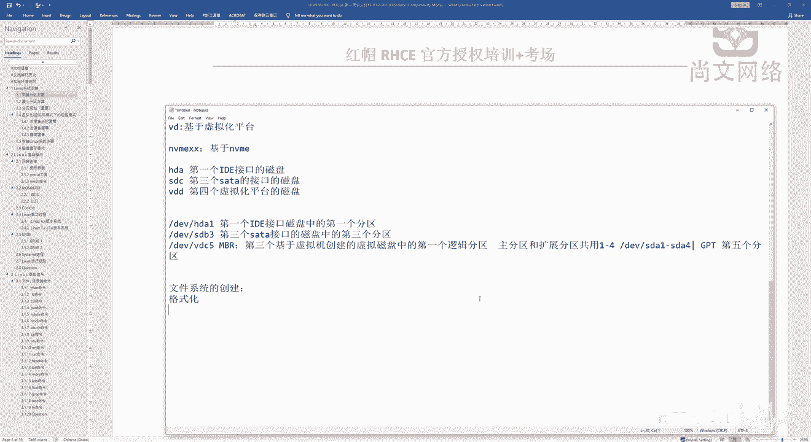
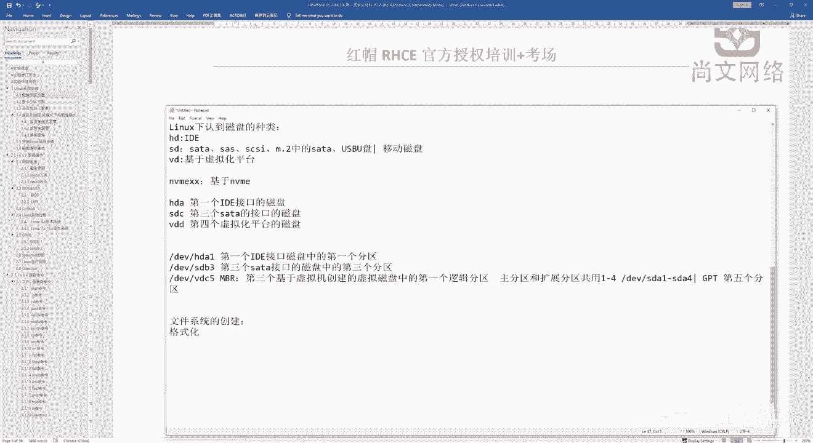
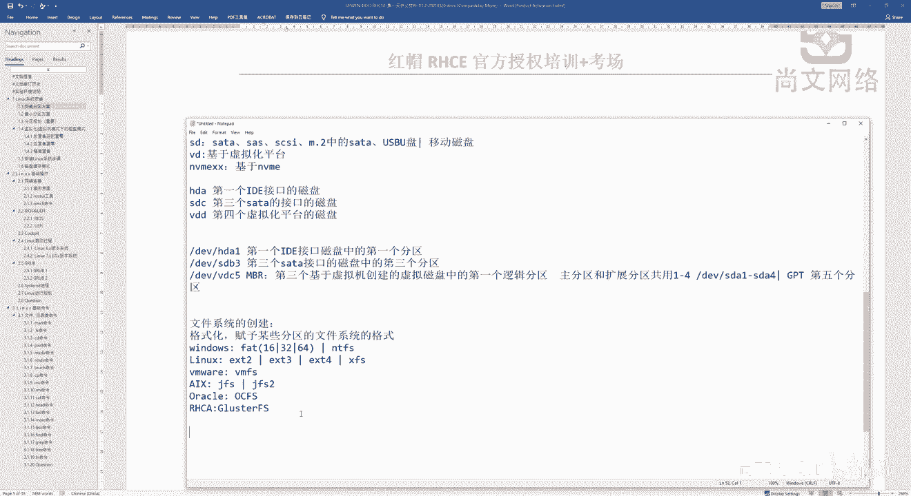

# 【尚文网络】-Linux运维／RHCSA／红帽认证／RHCE8系列录播视频 - P3：【尚文网络】-红帽RHCE8-03.文件系统类型知识 - 尚文网络IT - BV15A411K7Af

好，然后我们再往下看啊，这个刚才我们谈到了呃磁盘的分区类型，然后磁盘的接口对吧？

然后呢，再往下的话就是一些啊怎么去在linux下去认识一些磁盘分区，对吧？就关于分区。那么我们在分完区之后啊，我们是不是要做一个格式化的操作？是吧就赋予做一个格式化的操作。

那么就是说其实个化这个format对吧？forat我们并不是特别的陌生啊，并不是特别陌生。但是呢大家看就就是说为什么要去做这个个化，对吧？为什么要去做个化。做格式化的目的是什么呢？是吧？

做格式化的目的是什么呢？应该是要去赋予某些分区，对吧？的文件系统的格式啊，文件系统的格式。所以说我们要去做格式化。那么关于这个文件系统的格式的话啊，首先第一个windows的话，that对吧？这个。

32也好啊，当然我们可能会从16开始，对吧？然后到32再到一叉fi。对吧。啊，E叉比如说f64，还有什么呢？比如说NTFS这种对吧？第二个呢就是linux操作系统啊。

从我开始参加去研究啊这个操作系统的时候啊，linux操系统应该是从E叉T2开始，然后再往下的话是一叉T。3、然后遗查T4，然后是。这个到目前为止叫叉FS对吧？就叉F这种文件系统。那么还有一些。

比如说虚拟化的对吧？VM面呢，我们叫叫这个VMFS。是吧啊叫VMF这种文件系统的格式。那么还有一些，比如说我我们之前可能参做了一些这个AX啊，做了一些啊小型机的AX，可能叫勾FS或者是叫勾FS two。

对吧那么还有比如说oracle的一些文件系统啊，可能就要比如说就OCFS，对吧？叫这这个class那orrac call cluster文件系统的格式啊，包括我们。未来是吧。

还有一些比如说SC那面的一些内容叫class。啊，这是一个g FS，这是一个分布式的一个集群文件系统啊，这么一个格式，对吧？等等等等。这些呢都是我们叫文件系统的格式。那也就是说你要做文件系统格式的话。

我们一定要去赋予某些分区的啊，就是给某些分区去赋予这种文件系统的这种格式，对吧？啊，就要做这样的一些。格式化的一个操作。那么这样的话。文化完了之后，我们可能会就是怎么样呢？

就会啊去真正的去使用到这些分区啊。那么真正使用了这些分区的话，我们就要去在从对吧？从这些啊啊磁盘上啊，包括我们呢还有一些当然还有一些光盘U盘，对吧？就对应对于不同这种设备啊。

我们来去进行来使用这些东西啊来使用这个这就是。我们最终的这个文件系统的啊这么一种创建或者是赋予啊，它的目的就是说要去赋予啊这些文件系统的啊这么种格式啊这种格式啊。好。

那么这是关于我们从前面的一些分区的一些概念，对吧？自盘的一些接口的概念，包括我们的文件系统的这种创建啊，那么接下来的话我们就要去啊去走到我们去这个操作系统，对吧？

那我们前面这些概念我们大概我们基本上都清楚了啊，清楚了之后呢，我们就要去真正的去要去对。啊，分区到底怎么分，对吧？这个呃第几个分区对吧？某几个分区我们怎么分啊吧？我们要有一些方案啊，这个是比较关键的啊。

这是比较关键的。啊，那么待会儿呢我们去啊去着重的去开始讲一下这关于我们这个linux操系项去安装分区的啊这么一节方案啊。好，然后我们这个关于文件系统啊，我们就先啊讲到这儿啊讲到这儿。

