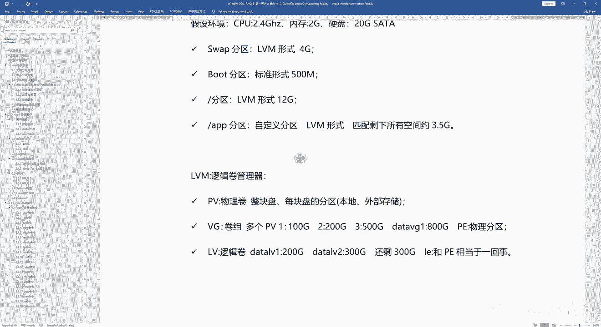

# 【尚文网络】-Linux运维／RHCSA／红帽认证／RHCE8系列录播视频 - P4：【尚文网络】-红帽RHCE8-04.Linux系统安装分区方案 - 尚文网络IT - BV15A411K7Af

好，然后我们再来看啊。这个刚才的话啊，我们是不是已经把。已经把什么呢？已经把这个呃关于我们的一些磁盘的分区的类型，对吧？包括磁盘的接口，还有关于认lins下认到的某一些磁盘的种类，对吧？有IDE的。

有sta的s的，包括VD的虚拟化的，包括NLE的。那我们知道哪些盘之后，我们又去做了一些接口，就是做了一些关于接口上面的分区，对吧？某一个接口的硬盘当中的某几个分区，怎么去做啊，我们也说明了。

那么最终的话我们是不是要去对这些分区做格式化，对吧？来创建赋予某些分区的文件系统的格式。那么现在的话啊。

我们要开始正式的去讨论去装啊，怎么去装这个lininux操作系统。那么装lininux操系统啊，它的一个重中之重是什么呢？就是这个分区方案啊，就是分区。那这个我们刚才在。

之前也已经讲过了。linux系统下面呢有有有许多这种分区结构，对吧？比如说跟啊ETC啊，什么boathomeOPTUSRDEV啊TNP rootot等等，是吧？那么这些我们怎么去规划啊，我们来看一下啊。

在装linux操作系统的时候，需要在硬盘上去建立我们的分区。那么大多数情况下，我们至少要为linux操作系统建立以下三个分区。那么有哪三个呢？对吧？有哪三个？第一个呢是叫boot啊。

叫BOT叫bo分区这个bo分区呢是用于引导操作系统啊，boot嘛启动对吧？用于引导操作系统包含了操作系统的一些可。

就是你的bot里面包含了操作系统的 kernel内核和在系统启动过程中所用到的一些文件啊，那么从现在开始，我们就会或多或少的啊，会去呃再去赘述一下老一点的版本的啊，老一点的这个呃的版本的一些知识啊。

为什么呢？因为我们可能在这个这个呃具体的工作环境当中，可能还会再去遇到过什么呢？老一点的，比如说60X70X啊，像比如说可能呃。呃，这个资历很深的一些老的oracle的DBA那它就非常热衷于啊H6。

因为什么？比如说可能可能这个oracle的这个这个版本还是在11G，对吧？11G的话可能只有这个6啊，就是非常热衷于这个H6啊，6。X这个版本。啊。所以我们会对再去赘述一下啊，再去赘述一下。

那么关于这个boot分区啊，老的这个R716，那么我们的这个bo大小怎么画呢？100兆就可以了啊，100兆就可以了。然后2L70X需要200兆啊，它会有一个往上升的这么一个过程。那么到了这个80X的话。

其中啊28。0我们给到300兆就可以了啊，因为波度分区啊，它就是用来存放什么，关于内核，包括启动的一些文件，它不需要太大啊，你比如给他画10个G，对吧？没有用啊，所以足这个这个只要适合大小就可以了。

那么到基于我们目前的这个R8。2的版本，至少要给到500兆啊，就是要至少要给到500兆，当然给一个G也是可以是吧？就是它至少要给到500兆啊。好，这是第一个步骤分呃，第一个步骤分区。

第二个呢叫SWAPs啊。s袜分区的作用呢是用来充当虚拟内存。那么什么是虚拟内存呢？所谓这个虚拟内存是指什么呢？是指当我们的那个物理内存不够用的情况下啊，比如说你的你的物理内存不够用了。

我们会从磁盘的空间上，也就是说从磁盘上会抠一块空间，对吧？会给给到我们的这个虚拟内存啊，来充当虚拟内存来满足啊，当我们这个物理内存不够用的时候来去啊相当于是去啊作为一个物理内存的一个补充。

那么这个swap分区的大小通常要是在物理内存的1。5倍到2倍左右啊，我们以两倍为界限嘛啊，就是说直接我们到两倍就可以了，是吧？啊，到两倍。然后当物理内存为512兆时候，对吧？

那你的swap分区为1个G即可，对吧？也就是说你的swap分区要是你物理内存的2倍啊。这是SWAP。那么第三个的话就是这个根粉区啊，这个根粉区。那么根粉区的话我们都知道是吧？它是整个人子操系统一个树根。

这是我们之前已经介绍过了，对吧？是一个树根。那么接下来的话，对于这个根粉区，我们会将大部分的这个系统文件和用户文件都会保存在根粉区上。所以我们的根分区一定要足够大啊，一定是要足够大。

啊，当然这个东西这个具体多大没有什么太多的这种规定和界限啊，一般可能比如说要大于5G，就是说你的看我们实际的这个磁盘的容量，对吧？就可用容量。是要求足够大啊，好，然后再往下就没有了，对吧？

那也就是说我们在安装这个分区的时候啊，至少你看至少需要为linux建立以下三个分区。那么有的同学可能会问了，那我呃我既然有bo我规划了。那么我跟规划了。

那么其他的比如说ETC homeOPTUSRDVPMP rootot对吧？这些我们难道是不需要规划了吗？啊，当然并不是是吧？然而并不是那么也就是说刚才我们说了这一些啊，刚才我们说的这一些。

我们都是在基于谁，都是相当于是集成在了根分区。

并不是说不会去规划，就是说你规划完了之后，你装操作系统，不是说这东西就没有了，而是什么呢？都集成在了这个根粉区。这个呢大家一定要去明白啊，这个大家一定要去明白啊，不是说不规划啊，是它都集成在了根粉区。

好，然后我们接着来往下看啊接着往下看。那么关于这个分区。方案关于放弃方案。第一个呢，首先我们是bo分区。对吧那我们比如说按需要对吧？我们就直接以8。2为例，那么是500兆是不是就可以了。

那么接下来的话我们要看一个东西啊，是要基于什么呢？是要基于标准形式的啊，就是标准形式的。分区啊，第二个。是这个SWE是吧？分去。一般是memory的谁验，1。5到2倍之间，对吧？

那么这种呢是要基于LVM形式的。对吧形式的分区啊，然后第三个呢，就是我们说的那个根是吧，那个根啊。那。分区说让根分区。这个呢是什么？是不是要足够大，对吧？足够大啊，空间。足够大。

那么这个呢我们也是要基于LVM形式的分区。No。也是要基于LVM形式的啊分区啊，大家这个要要知道是吧，要基于LVM的形式的分区啊。那LVM的分区就是为什么有的叫标准形式，有的叫什么叫LVM的形式，对吧？

我们来看一下标准。LVM啊分区是吧？首先呢我们这个标准形式的分区啊，大家啊我们可能先以。我们先以什么呢？先以我们的windows为例啊，我打开一个磁盘管理器是吧？disMGMP点MC啊。

打开我们的磁盘管理器。

那打开我们的磁盘管理器。呃，这是我的2块盘是吧？2块盘啊，这个没问题，2块盘，那么盘我们会进行分区，对吧？啊，当然我们现在这个windows操作系统啊，我们会把这些分区以什么呢？以卷的形式。

以valueume的形式，对吧？以券的形式来进行分区。啊，为什么说以券呢？我们随便点开一个？比如说我现在这个D盘啊，这个D盘对吧？我点击右键，你看它是不是有可以叫inend value，看到了吧？

in寸 value是指什么？就是扩展券啊，假如说你这块盘可能会有一些onus的，就是没有使用的一些啊这种这种这种一些区域了啊，磁盘的区域，那我们就可以把它干什么做in寸的做扩展。当然了，我们可以扩展。

也可以去干什么。可以去收缩我们的这个券，对吧？收索我们的券。假如说我们这个券觉得空间有点浪费啊，那我们就可以去收缩一部分的券啊。那还可以干什么删除卷，包括我们可以去添加一个距离这个卷的mirror啊。

一个镜像，对吧？这些都是基于卷。那么我们所谓的这种标准形式的分区是指什么呢？就是像这种之前老的这种windows操作系统，对吧？也是一样，一块盘我分区分完区之后，比如说C盘或D盘。

它200G就是200G啊，就是说多大就是多大，对吧？就200G就这么就这么大小。假如说这个D盘快满了，我们可能要干什么呢？可能要干要首先可能要先把D盘的数据先备份一遍，对吧？然后第二个呢，可能会找。

就是可能从别的这个分区上，比如说E盘，对吧？从别的分型区我们去。他他可能也要去备份一遍，然后把它给拆一下啊，比如说他现在可能是180G是吧，那么我们去拆一下，拆出50个G来。

然后呢我们就可以和这个D盘把它合在一起。然后我们再最终再把数据把它给恢复回来，对吧？这种标准形式，所谓这种标准形式啊，就是这种就是说你的容量多大就是多大。呃，你再做一些扩展的这种工作，然后会比较麻烦啊。

会麻烦，所以说这是标准形式。

啊，标准形式。那么好，我们接着来往下看啊，标准形式就是说啊可能磁盘大小固定的对吧？就是多大就是多大。啊，然后呢，这个。在扩容的操作上。会比较。繁琐是吧，会比较繁琐啊。这是标准形式啊。

那么LVM是个什么东西呢？对吧？LVM是什么？LVLVM是叫逻辑圈。管理器啊就 logicic。Value。mananagement是吧，就是逻辑卷管理器啊逻辑卷管理器。

那么这个逻辑卷管理器到底是用来干什么用的呢？啊，首先呢它会有几个概念啊，第一个呢我们叫PV，叫什么叫物理卷啊，就是P。phyhysical的 value。就是说叫物理卷啊叫物理卷。对吧啊。

那我们刚才说你的这块盘啊，可能比如说叫DEV啊，DEV下的SDA对吧？这是一块盘，对吧？可能会给它分个区，对吧？DEV下的SDE对吧？这是一块这些个分区，那也就是说我们可以干什么呢？

可以把这些分区或这块盘啊啊，可以是。Yqu。总盘。是吧比如说DEV小的SDA。也可以是。嗯，某个盘的。某个分区。是吧啊可以分区啊，比如说第一V小的。SDD5吧，举个例子是吧？啊，可以是这样的是吧？

然后再往下，也就是说你可以把这些分区或整块盘转化成。啊，从这种什么从这种标准形式的分区转化成PV转化成物理卷，明白吧？啊，这是第一个。然后第二个呢是VG啊，是valueum group。这叫什么？

这叫卷组对吧？valolin group啊，这叫卷组。那这个卷组里面包含什么东西啊，包含什么东西呢？是包含了什么？包含了多个脾V。啊，包含了多个PV。我们呢用这个图啊，我们可以来画一个简图来看一下啊。

来看一下。假如说这是一块儿。目理磁盘是吧，这一块盘。然后这个呢是一个盘的一个分区啊，我们来看一下啊，比如说叫DEV。下的SDA1呃，SDA对吧？可能比如说是20级。那么这个呢是。我画了一个分区是吧。

DEV小的SDD6586啊，比如说实比如说啊是世G。对吧这是一块盘，然后这是一个分区，对吧？这是一块盘，这是一个分区。那么接下来啊接下来我们首先要要把什么呢？要把这个。这块盘和这个分区我们把它给。

转化成什么转化成PV物理卷，对吧？原先可能你通过这种标准形式的分区，我分了个区，然后我就做格化了，对吧？那我们现在的话第一步先把这两个把这个分区也好，把这块盘也好转化为PV，这是第一步啊，这是第一步。

那么第二步。对吧第二步。我们是不是就可以把这个盘或者是这个分区，我们干什么呢？我们把它放到一个卷组里，对吧？放到一个卷组里啊，比如说叫叫VG对吧？Y group。

那么你的这个卷组的大小是来自于PV的容量的之和，1个20G，1个1G加起来可能就是30G。对吧可能就是1个30级啊。稍等啊，我们。这个呀是吧啊，把它放到一起，然后呢是一个啊VG。可能是30G的一个空间。

对吧啊，30G的空间。然后接下来啊就是你的VG啊，我们有了我们去搞一个VG。那么接下来的话有一个东西啊啊，我们来看一下叫。叫PE啊，危机里面会有个东西叫PE啊，有个这么东西叫PE啊。

那么你的PE是什么呢？

P啊。PE指的是什么？phyhysical啊 physical。那个一寸的。叫什么呢？叫物理分区，对吧？叫物理分区啊，physical actionction啊物理分区。

然后这个物理分区指的是什么是什么东西呢？啊，什么东西？我们来看啊，我们现在不是有俩PV嘛，对吧？一块盘一个分区。然后啊我们会把这些盘也好，分区也好，把这些PV我们来进行把它给。

以画方格的这种形式啊，我们来接下来我们来画一下啊，来画一下。画的可能不专业啊，大家来看啊，我们来画。好，那么这边呢我们也去画是吧，把它画上。把这个把这块分区或者是盘，我们以画方格的方式啊。好。

我假设画这么多啊画这么多。那么这个PE到底是什么东西呢？就是指每1个PV里面，不管是一块盘也好，还是一个分区的PV也好，这个PE指的什么？就是指的是我们这个等同大小的格子就大家这么理解。

就是我画出来之后啊，呃每1个PV里面这个格子就这个东西啊，这个格子看到了吧？这种格子的大小是一致的，就是等同大小的格子啊，这个大家要理解啊，这个东西就叫PE啊，这个东西叫PE对吧？啊，这个叫PE啊。

大家要注意啊，就PE的大小就每一个格子是一样大的啊，那么可能会有什么呢？可能会有。嗯，比如说啊比如说可能是4兆B，对吧？可能是这个8兆，对吧？可能还有什么。呃，1616兆可能会有32兆。

对吧可能会有64兆啊，也可能有128兆啊，包括还有256兆啊等等，这是一些常见的啊。那么这个问题就来了是吧？如果你的PE的数量，你的PE的大小越小，你的PE的数量就越多，这个能理解是吧？

就是说你假如说我单个PE的大小是64兆，那么你整个VG里面是30G，那么也就是说你的30G去除以个64兆，对吧？除以64兆，那么这里面就是代表什么呢？你整个的这个VG里面的PE的数量大概是多少，对吧？

它越多啊，你的单个的容量越大，你的整体的PE的数量就越少。对吧你如果是4兆币的话，那你的PE的数量就是指的是你这个格子数会越来会很多，这个大家一定会理解，对吧？啊，这是一定理解的。好，然后啊然后。

然后我们再来往下看啊再来往下看。那接下来的话有了这PE的数量，我们干什么呢？啊，我们要干什么？我们要去做什么东西？LV啊叫logic。逻辑卷啊，这叫逻。逻辑卷啊，这叫逻辑卷啊，叫逻辑卷。

然后这个逻辑卷呢对吧？逻辑卷是干什么用呢？我们不是画了好多的这个PE的嘛，对吧？我们换一个颜色是吧？那我既然画了PE了之后啊，我可以拿这个格子。对吧。可以拿这个格子可以拿这个格子，可以拿这个格子。

可以拿这个格子，拿这个格子，这个格子，然后包括这边也可以拿，这边可以拿是吧？这边都可以拿，然后这边也可以拿是吧？都可以拿。好，就这么多，那我们可以干什么呢？按照不连续的这种格子的量，你看什么叫连续。

就是说所谓的连续，就是我先从第一个格子可以拿，然后再从第二开始拿，就从那往后推，对吧？往后推，这叫连续。那么我们刚才是什么呢？我们刚才是不是按照不连续的这种格子的量，我们可以把它干什么，把这一些对吧？

把这一些包括把这几个，我们可以把它作为一个东西叫什么？叫LV。对吧啊叫LV啊。那也就是说你的LV的大小啊，LV的大小我可以分两种。我LV的大小。对啊。可以。直接指定。那个LV的。大小。比如说5G。啊。

也可以。指定什么呢？指定PE的个数。对吧比如说50啊，比如说你单个啊单个PE大小是64兆吧。啊，比如说比如说这个这个64兆啊，比如说我们小一点是吧？比如说10个啊，10个PE，那么也就是说你最终是多少。

是不是64兆乘以10等于640兆，对吧？这是你的这个这个最终的LV，你在创建时候的这个大小，那也就是说我们可以直接去制定一个量，对吧？比如说5G啊，多少兆啊，也可以指定按照个数啊。

我指定多少个10个PE或20个PE，对吧？啊，这个都是可以的啊，这个都是可以的。所以我们啊所以我们在创建啊创建创建LV。那么创建完了这个LV之后啊啊创建LV之后，我们可以干什么？

最终我们是不是就要进行这个。这个格式化了。对吧格式化啊格式化的话，假如我们是标准形式的。顺qu。那你格式化的时候是是这个东西是吧？DEV小SDAE，对吧？我们举个例子是吧？

你要格式化的时候是格式化这个东西。但是如果我们是LVM形式的话。啊，形式的分区。那我们应该是什么？应该是DEV下的卷组名称，然后下的LV。LV就是逻辑卷。名称啊，逻辑卷名称对吧？卷组名称逻辑卷名称啊。

是按照这种方式啊这种方式。这个标准形式啊，我们直接分分区直接规式化就好，对吧？但是LVM的形式我们要多做几步，对吧？多做哪几步？首先第一个要把分区转化为谁，转化为物理卷，对吧？

然后我们把物理卷扔到一个卷组里面去指定PE的单个的大小，没错吧？那么有了这么多的PE，我们就可以去创建我们的逻辑卷了啊，可以直接指定直接指定大小的这种，也可以指定PE个数的这种啊，也都是可以的，对吧？

都是可以的啊，然后啊我们进行这个格式化，啊，比如说啊。第一V下单。啊，比如说我们有一个卷组叫阿普文VG对吧？下面可能会有一个，比如说叫阿普文LVE，没错吧啊，通过它啊来进行格式化啊来进行格式化。

那么这个LVM和标准形式看上去。对吧现在看上去好像没有什么太大的问题，太大的这个区别。对吧但是好处到底在哪儿呢？啊，好处到底在哪啊，我们要看一下啊，你看从这个地方就能看出来啊。

假如说这个LV可能是10个G举个例子是吧？10个G那么你的10个G的话，如果说有一天这实际快满了，对吧？我们可以干什么呢？我们可以看看这个卷组里面啊。

我们换一下，就是你的这个卷组里面有没有什么呢？叫free的。fre的P。什么叫frreee的PE？也就是说从我们现在这些格子里面，比如说这个地方是个空的，这里面是空的啊，这里面是空的，或者说它是空的。

它是空的，它是空的。也就是说这几个蓝色的就叫frreed的PE可能还没有被使用，对吧？那我们是不是就可以把这一些。这几个做什么东西啊，做关于这个LV的exend。对吧EXTEND。做扩展对吧？

做扩展对吧？啊，然后。如果啊比如说我扩展到了15G，假如说啊假如说你的这个我感觉哎用一段时间，15G感觉有点浪费，对吧？12G就够用，我们还可以做什么东西。我既可以做向上的一寸的。

也可以做向下的叫什么reduceREDU。CE reduce做收缩，对吧？比如说从15G到哪儿到12G，对吧？那么你剩下了你从15G缩到了12G，剩下了3个G的。容量或者说三个G的PE的这个量。

我们是不是可以还给我们这个危机，对吧？因为我们这个危机里面不仅仅只是我们1个LV，比如说LV1，可能还会有什么LV2，或者说LV3，对吧？他们也在嗷嗷待捕，是吧？他们也在等待着，万一有一天满了之后。

我们是不是要去扩啊，所以说我们可以把这些PE还给这个危G，对吧？然后让它来进行这个这个合理的去分配啊，当然啊当然大家要注意，就是说这种有到底有什么好处，就是可以实现什么叫无缝的扩展或者收做。

你看我们刚才说的那个标准形式的分区，对吧？如果这个第一位下来SD1块满了，我们先把数据先先倒腾一份，对吧？copy出去，然后再去做什么呢？就是再去做这种啊合并啊，或者是这种删除，就是删除完了之后再合并。

对吧？再把数据导回去，但是你的这个LV的话，当然做备份是一个非常好的习惯，对吧？但是呢我们通过LVM的这种机制，我们可以做了什么呢？无缝的去扩展或者是reuce啊，就是做无缝的excel的。

或者是reduce。这个大家要知道啊，就是它的好处啊，就显而易见，对吧？不像这个标准形式的分区那么的麻烦啊那么的麻烦。这是一个。然后再一个我们扩啊，我们虽然是扩啊，可以实现一分类也好，或者以6次也好。

只是卷。对吧就是只是基于我们这个LV啊，但是。我们一定要知道对吧？你你LV也好，还是以标准形式的分区也好，对吧？我们最终是不是要去做什么，去做格式化的操作，我们要去指定一个东西，是不是叫。

叫fi system。对吧FILE。System。对吧我们要去做格式化的操作，对吧？去创建一个这个啊去创建是吧？文件系统。对吧，叫文件系统啊，去创建文件系统啊，创建文件系统，对吧？啊。

那也就是说啊就是说你在做扩展啊，你做扩展或者是收缩。Jingjin。只是针对LV的大小，明白吧？啊，仅仅只是针对LV的大小。但是我们无论是扩展还是收缩，我们一定要干什么呢？要重新在。对。调整一下。

文件系统的尺寸。明白这个意思吧？啊，一定要去再去重新调整一下文件系统的尺寸。啊，就是说你你只是调LV的大小不行，你还要再去调一下文件系统的尺寸。啊，你最终格式化出来之后啊。

你最终格式化出来的文件系统的名称。叫什么呢？假如你是啊假如我们是这个什么是标准形式。我们这个文件系统名称就叫DEV小SDE。假如你是LV的LVM的这种形式，你的文件系统的全名就叫什么？

就叫阿普文VGE下面的LV啊阿普文LVE明白吧啊，就是说你调只是调LV的大小，但是要把这些文件系统的尺寸也要去再去做一下重新的调整啊，这个地方一定要注意那么后面的话呢。

我们会单独有这个LVM的一个详细的这个课程的介绍啊，关于怎么去创建这个转化PV创建VG啊，去创建LV包括做相应的一些动作调整这个LV的大小收缩，包括文件系统尺寸的去这个调整啊。

这个呢我们都要去的再去回回过去啊，我们再去再去要详细的去学习的啊，那么现在的话我们要知道了，就是说为什么要去用LVM对吧？啊，为什么要去用LVM就是在这儿啊，一定是要比这个标准形式的分区，对吧？它的好。

处啊，就是再去做一些关于扩容的这些操作，还是非常的方便的啊。所以我们谈到这个分区规划的时候啊，一定要注意啊。能用LVM，我们就用这个LVM，对吧？啊，那么有的同学可能又会问了，哎。

你这个为什么不骤分区不能够是LVM呢？为什么要是基于标准形式呢？是因为操作系统啊，大家可以去到时候去试验一下，就我们的操作系统，假如说你选仅对步骤分区也选用了LVM的话，你点确定它会报错啊。

他会告诉你啊，我们这个步骤分区是不支持的对吧？不支持，你只能是干什么？是通过标准形式的分区啊，这个大家要去。要去注意一下啊注意一下。好啊。那我们接着来往下看啊，接着往下看。那么第二1。

2的话是叫最小分区方案啊，最小分区方案。那么规划了这个以上两个分区，对吧？一个是跟一个是SWEP，我们的linux斯就能跑起来啊，我们linux就能跑起来啊。好，然后看1。3。

啊，有一个例子是吧？假如说我们这个主机还CPU是2。4即可兹啊吧，你内存2G硬盘20个G的sta啊，那么sp肯定是要一G于LVM的，对吧？而且是物理内存的2倍，对吧？比如到就到4G，然后bo分区的话。

我们是以标准形式的500兆，然后根分区的话，我们基于LVM形式可以给到它12G。那么你的12G加4G加500兆，加0。5G应该是16。5G吧，还剩下差不多3。5个G的空间，对吧？

我们还可以做一个什么叫自定义分区。啊，做一个自定义分区。什么叫自定义分区？你看我们举一个例子啊，叫斜杠APP分区，对吧？基于LVM的形式啊，匹配剩下所有的3。5G。

那么这个APP我们回过头来再看我们的笔记。这个APP目录好像并没有在这个linux自己。

对吧自己形成的这种默认的这种分区结构里面会有对吧？没有是吧？就没有这个协关APP那我们可以去单独去新建一个目录，或者说新建一个文件夹。然后呢，我们去自定义一个分区，再怎么去做一些匹配，明白这个意思吧？

比如说我们这个linux操系统，我们是作为一个数据库的平台。对吧比如上面去装这个mycle也好，marDB也好，包括oracle。那么我们这个DBE是希望什么东西呢？

是希望数据库的应用程序是和我们的根分区是把它分开了，对吧？分分开了。假如说根分区出现了一些问题，不影响我们的这个数据库的一些运行，对吧？和我们的数据，所以我们有必要去单独去画一个文件系统。

那也就是说我们去单独自定义一个分区。啊，然后采用LVM的形式，对吧？至于多大啊，至于是多大，我们可以怎么着呢？这个东西可以按照需求去，不一定是要匹配剩余空间，你也可以去指定一个大的一个空间，对吧？

只要你的磁盘足够大就可以了。所以说我们在做这个分区啊，在装操作系统时候，这个分区是非常重要的啊，是非常重要的。假如说我们把这一套对吧？我们把它作为了一个模板啊，我们比如放到这个虚拟化平台里面。

我们会把它作为一个模板啊，以后的话我们都可以按照这个模板来进行克隆部署啊，续积是吧？啊，都可以做一些克隆的啊，这所以说我们这个分区规划是比较重要的啊，是比较重要的。大家一定要把这一块内容啊。

要把它搞清楚了啊。好，然后我们再往下看啊，呃，这是关于LVM的一个逻辑计院的一些知识，对吧？首先第一个要有PV啊，要有PV。

这个PV呢就叫物理卷。那也就是说我可以来自于什么一块盘，一整块盘，对吧？还可以什么一某个盘的某个分区。没错吧，那么这个盘的话，我可以来自于什么？来自于本地盘。什么叫本地盘？

对吧你像我们的这个这个PC主机，对吧？我们的主板上会有一个s塔的一个接口，或是M点2的接口是吧？这样的盘叫本地盘。或者说我们的服务器啊会有一个会有一些这个硬盘的IO背板，对吧？IO背板里面会插多个盘。

那么不管怎么样，这些东西要本地盘。那还有一个还有呢就是来自于外部的盘，就是存储的盘是吧？外部存储的盘可能是基于FC的啊，走这个关联通道叫fb channel对吧？有的呢可能是基于IP的啊。

可以是基于IP sign，或者是或者是什么呢？或者是这个这个I对吧？就是你认到的一块盘啊，这个也是OK的。然后再往下，你有这么多的PV了，我们就要把它放到一个卷组里面，对吧？放到一个卷组里面。

这样把它圈起来养啊，把这些PPV把它圈起来养，然后。就开始在这些PV里面画格子了是吧？就画这个搞这个PE啊，那么这个PE的话是等同大小的格子，对吧？你的单个PE的量这个容量大。

那么你整体的PE的数量就少，对吧？然后再往下的话，我们基于这个卷子里面去创建逻辑卷啊，逻辑卷。呃，可以按照直接的容量去指定，也可以按照PE的这种个数来指定，对吧？那么还有一个概念叫LE啊。

LE叫logical一份了啊，实际上和PE是一回事啊，就是那个所谓的那种总同大小的格子啊，这个大家知道。好，最终的话我们要进行格式化，对吧？格式化去赋予文件系统的格式啊，比如说E叉T4了叉FS呢。

这是我们这个目前学linux操系统最用到最多的两种啊，文件系统的格式，那么最终的话我们可能找一个目录是吧？或一个一个创建一目录和创建一文件夹，我们把它给挂载上使用，对吧？我们把它给挂载使用，对吧？

格式化完了之后啊，我们是不是要干什么？要做一个挂载对吧？挂载的使用。mount是吧，MVNT叫mountt啊，做一个挂载的使用啊。好呃，关于分区的各个规划啊，分区的规划我们就讲这么多啊就这么多啊。

