# 【尚文网络】-Linux运维／RHCSA／红帽认证／RHCE8系列录播视频 - P5：【尚文网络】-红帽哦RHCE8-05.虚拟机下的磁盘三种磁盘模式 - 尚文网络IT - BV15A411K7Af

好，然后呢我们接着再往下来看啊，刚才我们把已经把这个分析方案，对吧？我们都从头到尾都说了一遍。那么接下来的话，我们要去看另外一个东西。

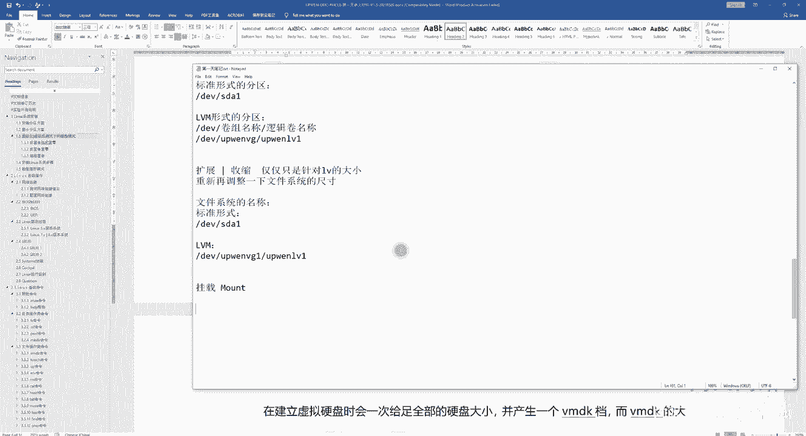

就是在安装之前，我们还要去。呃，因为我们可能呢是更多的是基于呃比如说我们的这个虚拟的环境是吧？基于基于我们的虚拟化或者是我们的虚拟息环境。

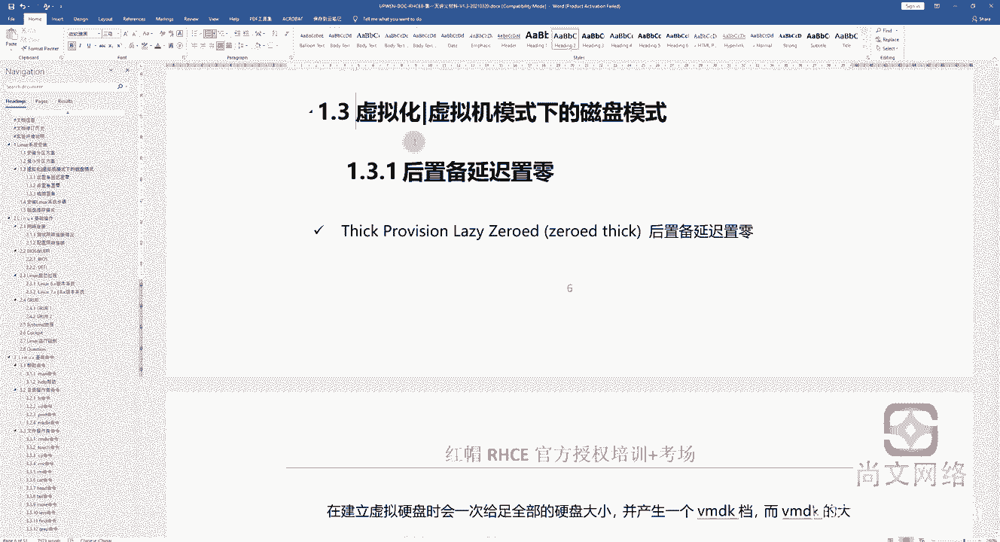

来去安装我们的这个操作系统。那么在装之前呢，我们还有一个地方啊，还有一个知识点，我们去解释一下啊，首先呢叫叫这个磁盘模式啊，叫磁盘模式。磁盘模式指的是带讯拟机或虚拟化反影响，有这样的几种磁盘模式啊？

第一个呢叫后置备延迟之零啊，叫后置备延迟指零啊，什么叫后置备延迟之零，这是一种模式啊，叫st provision lazy zero。啊，就是说你后置被延迟治理啊，我们来看一下啊来看一下。

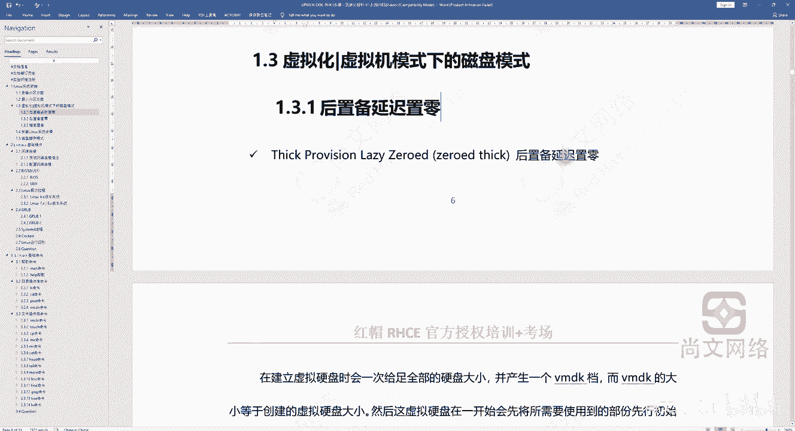

比如说啊我们当我们去建立一个虚拟硬盘，对吧？建立一个虚拟硬盘啊，建立这个虚拟硬盘，实际上就是一个虚拟机的物理硬盘，对吧？它会一次给足全部的大小。当我们再去新建虚拟机的时候。

我们应该会要去指定一个磁盘的大小，对吧？比如说20个G啊，然后呢，它会产生一个啊VMDK这个VMDK很显然是基于谁啊，是基于VMM的是吧？啊，基于VMM的这个呃一个虚拟机啊，就是它的一个虚拟磁盘文件啊。

叫VMDK。那么它的这个大小呢是等同于在创建的时候指定的那个虚拟硬盘的大小啊，然后这个虚拟硬盘呢会一开始先做初始化啊，就叫zero，明白吧？就叫zero叫初始化啊，那么它会将先索需要用到的。

部分先进行初始化啊，以至于其他空闲没使用的部分，则等待有需要的时候，我们再进行接容啊格式化。明白吧？就是说可能我们这个这个磁盘可能20个G，我一开始可能用了两个G，那么我们会先把这一部分先做初始化。

那其他的这些空闲呢，如果这个需要有用的时候，我们再做数再做这个这个初始化啊，叫zeero啊。然后呢，但是要注意啊，就它你的这个虚拟硬盘的那个磁盘的大小，对吧？可能比如说20G。

那一开始可能就被就被用掉了啊，被用掉了这2020个G。

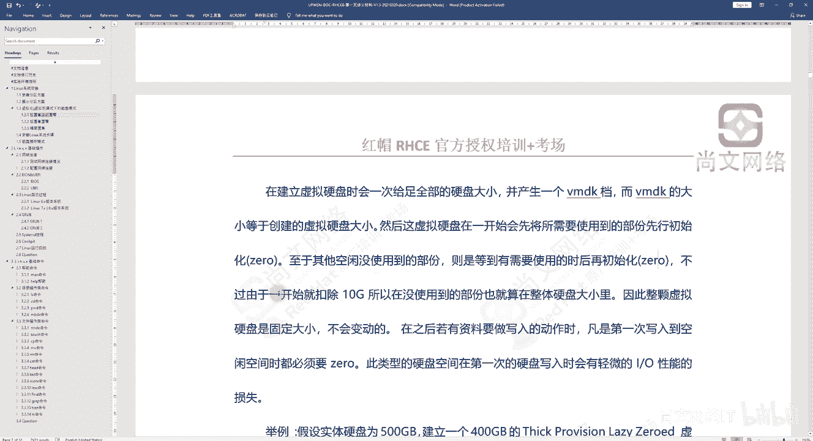

哦。那我们来看一个例子啊，来看一个例子，假如说这个实体硬盘是500个G这吧就是我们的物理盘，这个不是虚拟盘了是吧？就是物理盘，500个G。

我建了1个400G的基于这个延迟后置被延迟至零的这么一个虚拟硬盘，这个时候啊我们就会产生1个400G的一个虚拟磁盘，对吧？会产生1个400G，就是说我我的实体硬盘和500G。

那我产生了1个400G的这个虚拟机的那个那我就是说实实在在了，对吧？就我可能是实实在在了，就是已经占用了400个G的这个空间，然后在这400G的这个虚拟硬盘中，一开始我我们可能假如说只是用了100G。

那么这100G的话，我们先做ZR做数始化。那么剩下的300G等需要的时候啊，一定要去是有需要的时候，我们再去做啊ZR种初始化。那么整颗虚拟硬盘的大小，还是为400G。

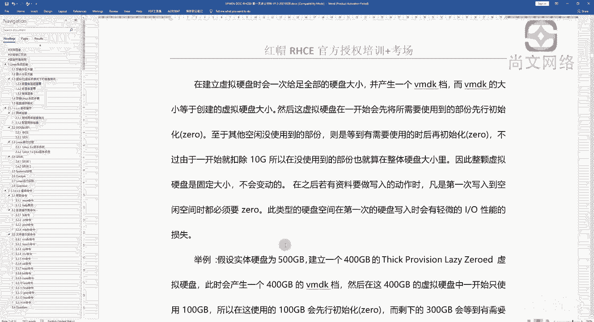

对啊，所以说这个看过来之后啊，我们就知道这个后置被延迟这零这种机制是什么意思。就是我会占用实实在在的这个实体硬盘的一个大小，对吧？比如说400G，但是我会干什么呢？会分批做初始化，对吧？啊？会分批做说？

就一开始我可能用10个G，那我就先对这10个G做初始化。后面再用我们再进行初始化。那么这种啊叫延迟呃后置被延迟制零。在第一次硬盘写入的时候，会有一些轻微的IO性能的损失。

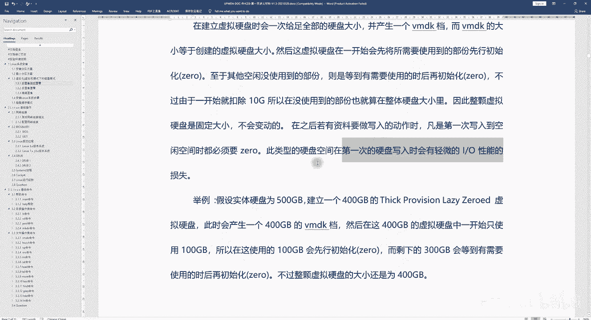

啊，大家要注意这个东西啊要注意这个东西，这个呢叫什么叫。

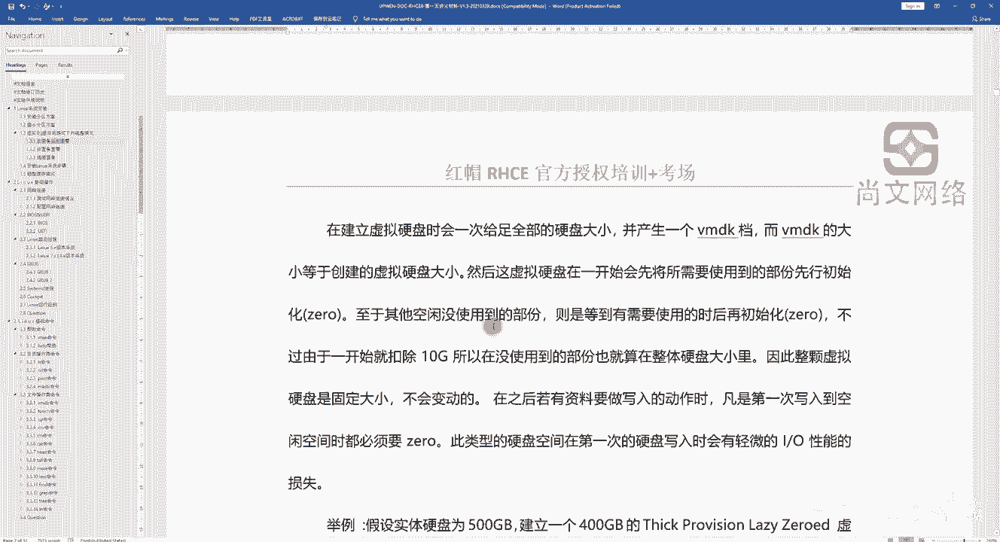

叫后置备延迟制顶啊，这是叫后置被延迟置顶。那我们再来看第二个啊，第二个呢叫后置备制顶，就把那个延迟就去掉了，对吧？你想一下，延迟制令是什么意思？就是一开始用到的部分，我先做初始化，对吧？

那既然把我的这个延迟这两个字去掉了，所以怎么办呢？很有可能是什么？我们来看啊，当。

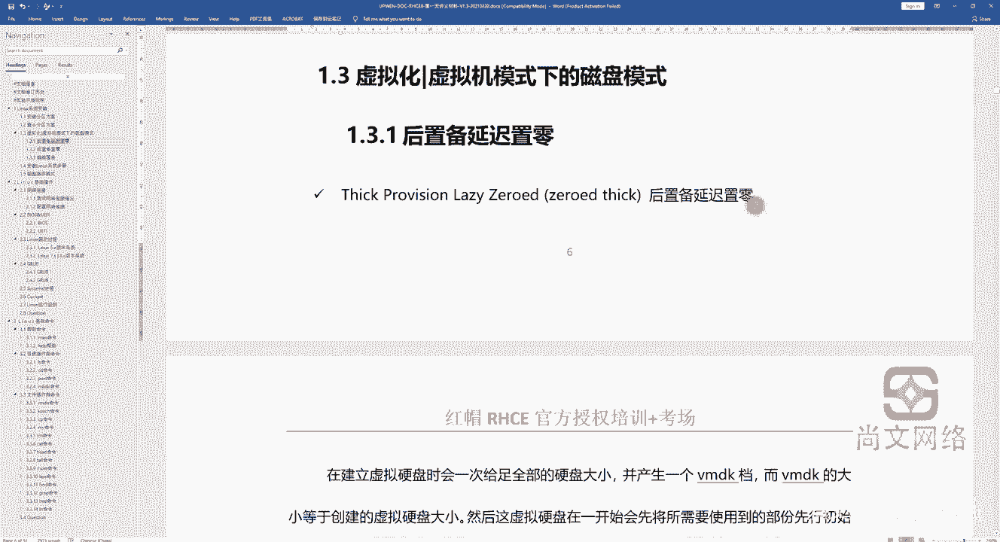

当这个也是一样，假设实体硬盘5为500G建了1个400G的基于延迟被啊，就是延迟就是后置被置顶的这种啊后置被置定这种虚拟硬盘。一样的会产生1个400G的VMDK。

然后这400G是不是一开始就会占用了这个这个这个空间，然后并直接把这400G做初始化。

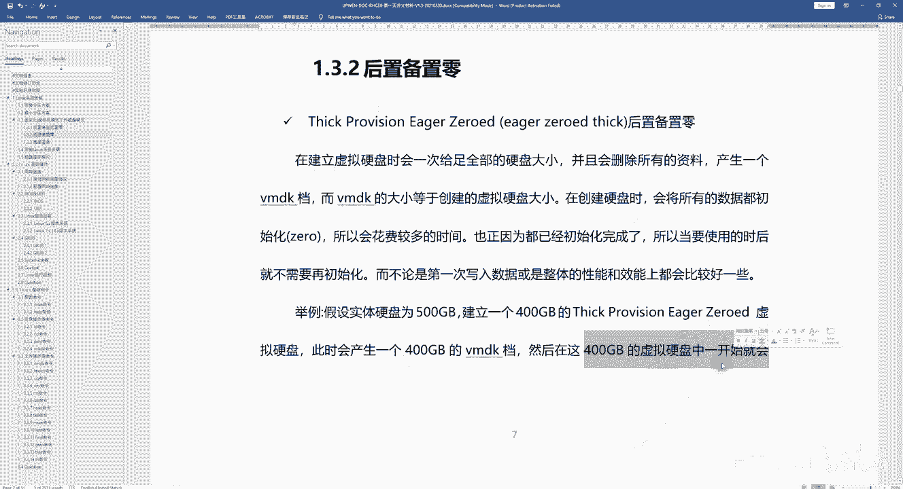

等到下次去使用的时候就直接拿来用就可就行了。那么整颗性硬盘的大小为400G。那也就是说和刚才的那个后置备延迟指定一个区别是什么呢？这个400G我直接就全部做兼容，对吧？就没有这个先用一部分做。

然后后面再用再做啊，没有这一说了，对吧？所以我们就相当于是先一次性的全部做初始化，然后等到下次用的时候直接去拿来用就可以了，那么它占用的空间呢是啊就是我们实实在在的这种占略物理啊。

实体硬盘的啊500G中的400G了，对吧？啊，这叫啊后置备指顶。

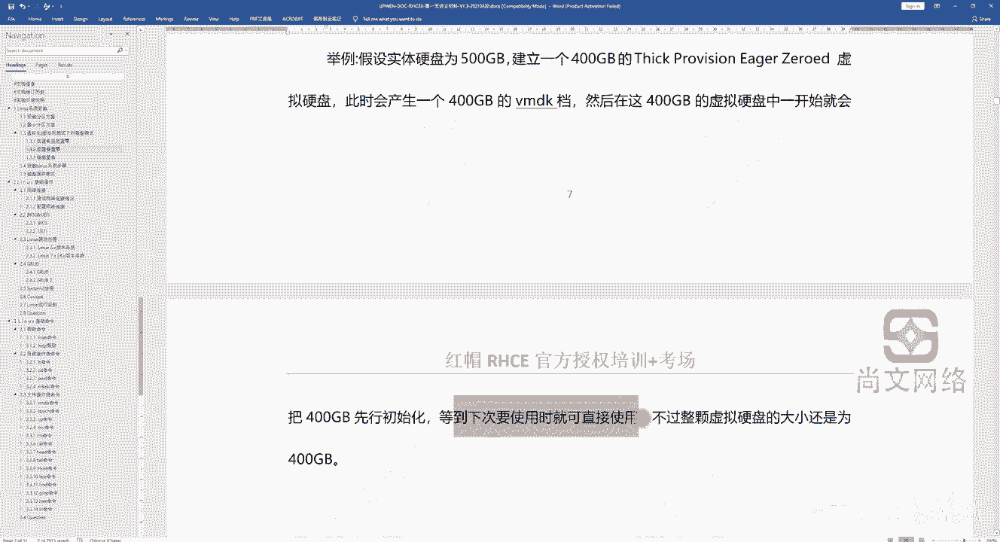

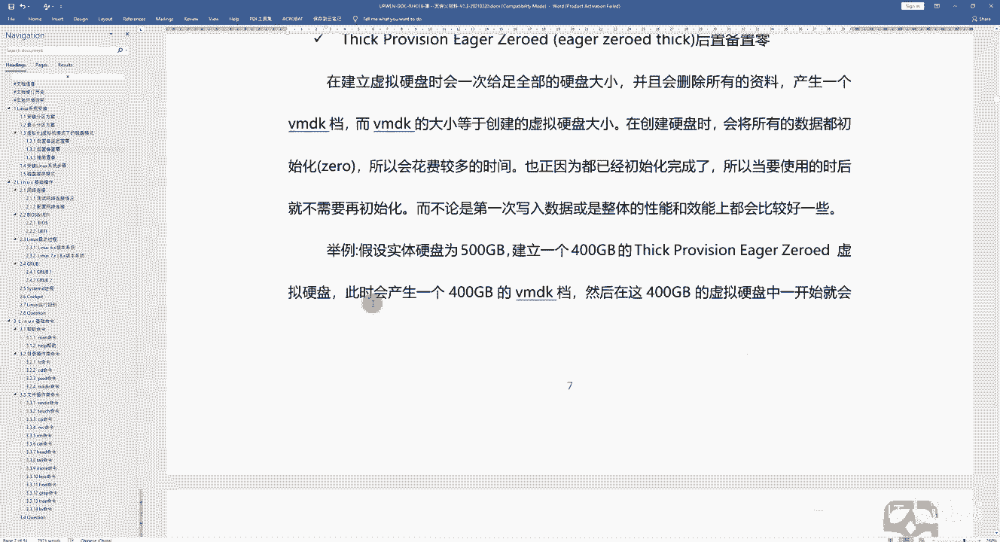

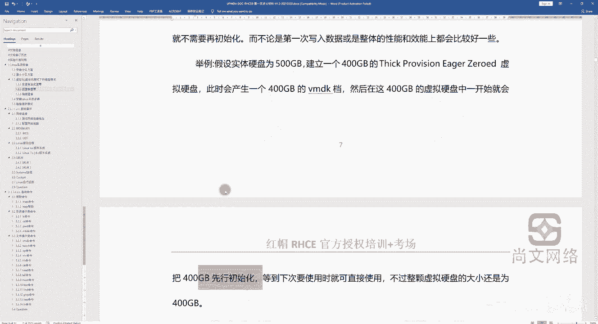

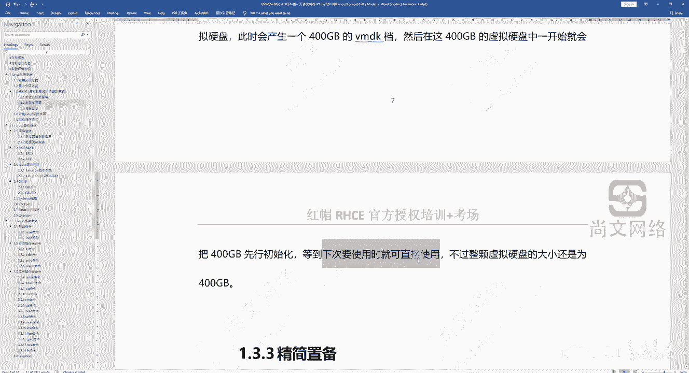

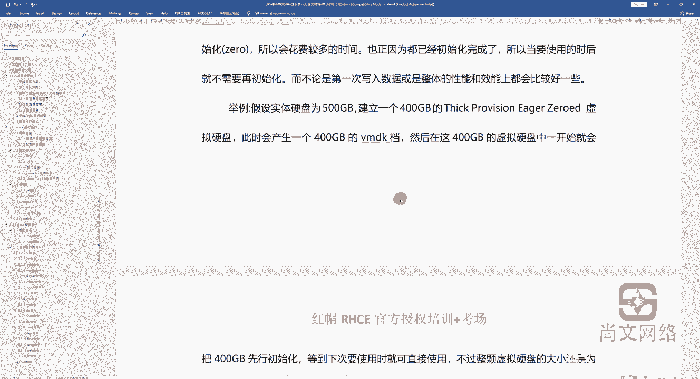

啊，后置被置零。那么这种的话啊这种的话。在创建硬盘的时候，会将所有的数据都做初始化，所以会花费一些较多的时间。但是它在第一次写入数据和整体的性能和效能上要好一些，对吧？

就是以后啊我们就不需要再再再频繁的去初始化了，对吧？这样的话，它的性能和效能会比刚才我们说的那个后置被延迟制顶啊，效果要性能上要好一些啊，要好一些，这是。呃，两种不同的。那么还有一种呢叫精简制备。

这个大家可能会都会用叫sin，对吧？sin其是那个精简的意思，对吧？sin province啊，sin province叫精简制备啊。

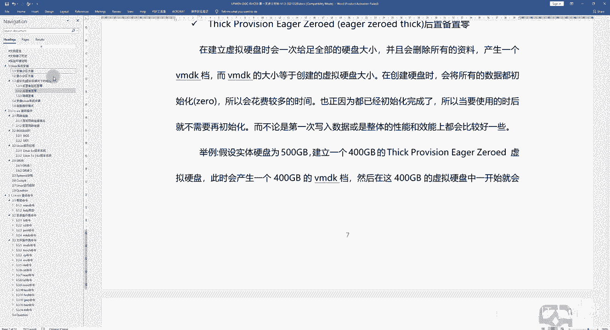

那么随着硬盘的使用量而增加大小。啊，增加大小达到上限的时候就不会再增加了。那么产生的这个VMBK啊这个虚拟磁盘的这个文文件啊，虚拟磁盘的文件会随着使用的情况增加，并一边去做这个就是一边做的这种。

一边去是用着我们的新空间。所以说我们这个VMBK大的大小啊，不等于创建虚拟硬盘的大小。啊。他只会是等于什么呢？实际使用的大小。啊，我们来看这个例子啊。假如说我们这个实体硬盘为500G，对吧？

我要去建立1个400G的s基于s的跑微的啊精简设备的这么一种虚拟硬盘。那么在安装的时候啊，完成时候它用了100G，那么我们的VMDK肯定是100G。对吧但是呢整个虚拟硬盘的大小就是100G。

虽然我们在我们的需求是建立1个400G了，但是它因为现在我用了100G，那也就是说你当前这个阶段我们这个虚拟硬盘的大小就为100G啊，这个要知道。那么有人可能会问，那么剩下300G呢，剩下300G呢。

我就先留在我们的物物理实体硬盘内，等有需要的时候，我们再逐渐增加，直到我们的400G啊，用完后就都不会再增加了。啊，所以说精简制备无论是在我们的这个虚拟化的啊，基于这个虚拟化的平台上。

还是我们平常在做这个虚拟机啊，通过虚拟机来做实验做练习的时候，这都是我们的一个首选的一种啊这个磁盘模式的这么一种机制啊，叫精简制备。当然了，那个也要看具体的我们当我们在实际的这种应用场景里面，啊。

这个比如说我们这个虚拟机，对吧？我我就单纯是做一个外部的一个发布，对吧？像这种啊简单的这种这种业务需求，我们基本上是通过这种经典制备啊，精典制备的方式。那如果说我们做一些大数据的项目，对吧？

他对这个啊磁盘的这个使用率非常高。所以我们这个地方就不推荐用经典制备了，而是直接去用什么？是叫后置备置灵，就是一块盘，我直接全部初始化，初始化完了之后直接拿来用就可以了，对吧？啊。

这是一些不同的应用场景啊，不同的应用场景，大家要注意啊，大家要注意。那么后面的话，因为为什么要说到这个地方。那后面的话我们可能会接触一些啊关于这个红帽的啊I7要8的啊。

有一些新的一些关于磁盘技术的一些运用啊，比如说VDU了啊虚拟化器比如说这个tra啊，这个这个分层存储管理对吧？我们会或多或少的去去基于这一些磁盘的模式啊。

所以前面我们要把这些啊常见的对我们这种关于虚拟机啊虚拟机虚拟化模式下的这种磁盘的模式啊，这三种是吧？后置备延时这零后置备置零和经简制备，我们要把它讲出来啊，把它讲出来。

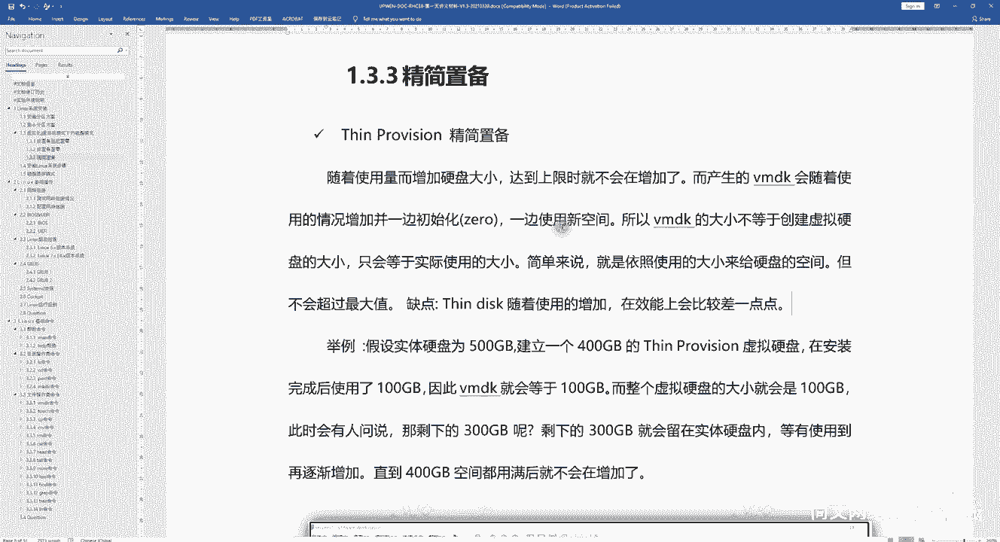

好，然后下面呢会有个图啊，有个图截了一图。这个图呢就是我们在基于我们在做VMMization的时候创建的时候，创业讯机对吧？新建的时候啊，它会有一个关于磁盘的一个一个向导，啊。

首先呢要去指定一下我们这个磁盘的大小，对吧？这个磁盘的大小啊，20个G啊，比如说是吧20个G，然后呢，这个地方会有一个叫什么叫立即分配所有空间啊，叫立即分配所有空间，我们默认情况下，我们是不勾选的。

对吧？如果如果你不勾选的话，就是就相当于代表什么呢？就相当于是代表我们的这个啊精简制备模式，对吧？就是你用多少，虽然你可能是20G的需求，但是我用我用多少，我就我就用我就从物理物理磁盘上拿多少，对吧？

那如果你点上了之后，我们可以理解啊，就是立即分配所有空间相当于是什么呢？是不是相当于那个叫后置备置顶，对吧？后置备置顶。所分配的容量可以提高性能，然后要求物理空间密即可用，对吧？也就是说我创建20G。

那么你现在的我们这个物理的磁盘空间，你得就要给够呀，对吧？是不是要给够20G的空间啊，所以啊所以所以我们这个对吧？要注意是吧？叫立即分配所有空间啊。

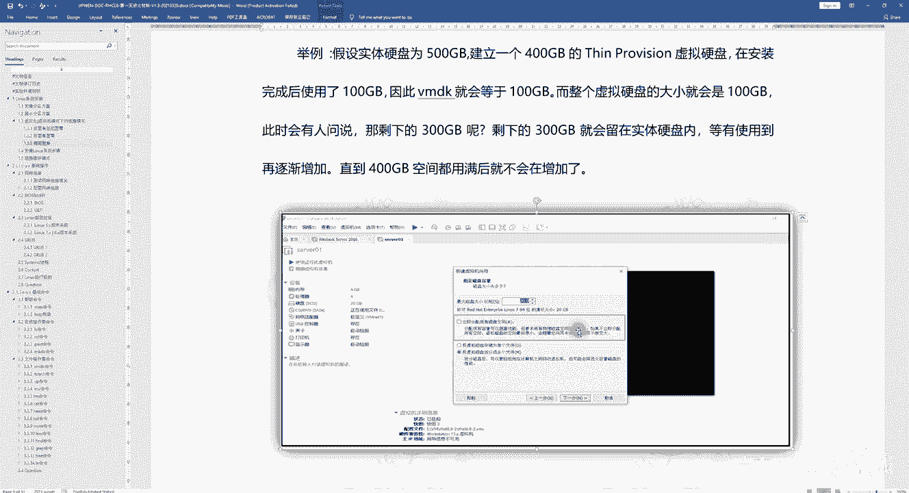

呃好。这个呢是关于我们的呃。

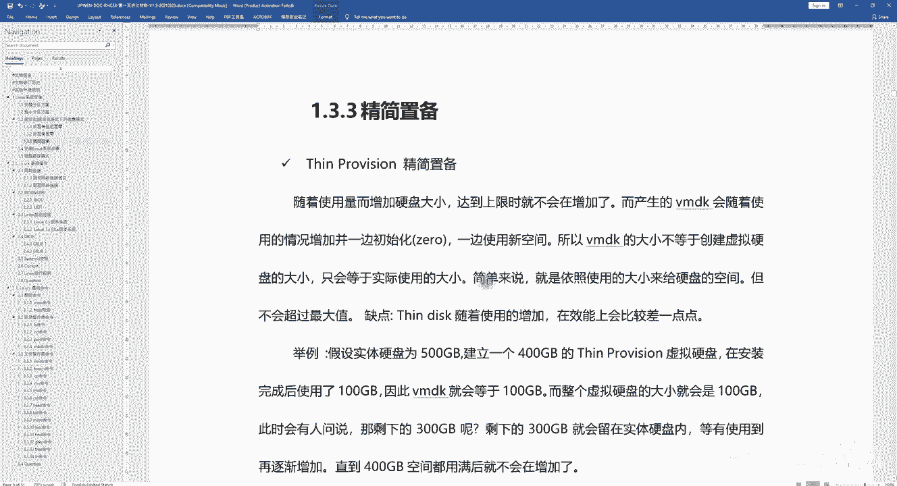

虚拟机和虚拟化下的这种磁盘模式啊，一个叫后置备延迟这里。

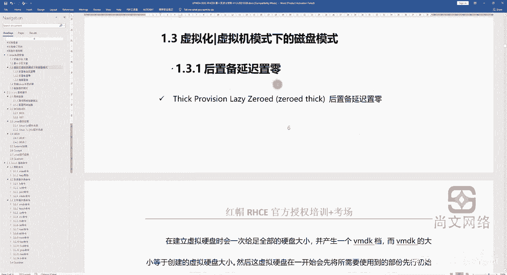

一个叫后置备之灵，一个叫什么呢？叫精简制备啊，叫精简制备。

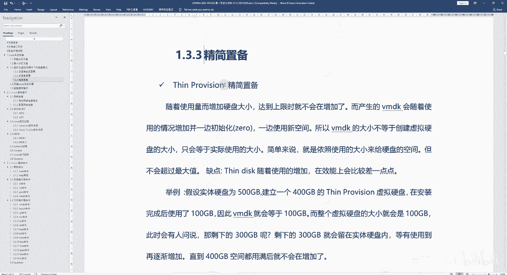

好，那这一块的话我们就这个讲完了。

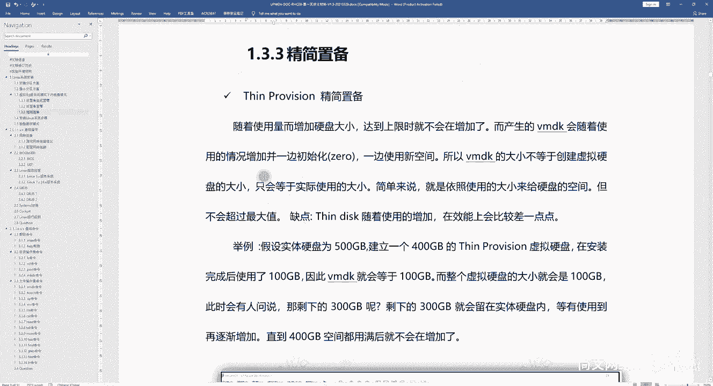