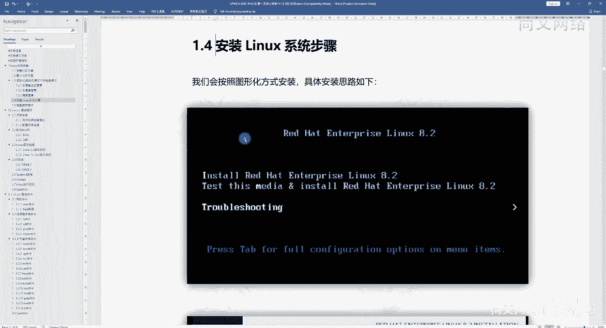

# 【尚文网络】-Linux运维／RHCSA／红帽认证／RHCE8系列录播视频 - P6：【尚文网络】-红帽RHCE8-06.RHEL8.2安装步骤及流程说明 - 尚文网络IT - BV15A411K7Af

好，然后呢我们现在来看啊，就是呃正式来去安装我们的这个linux操作系统啊。然后呃我们呢一般一开始呢都是会基于这个图形画的方式啊来进行这个安装我们的操作系统。

啊，那首先这一张图啊首先这一张图是我们通过这个可引导的介质啊，比如说光盘或者是我么们的U盘，对吧？这这些东西叫通通我们都叫可引导的对吧？可引导的这种介质。把这个操作系统引导起来之后。

然后呢我们就呃来到了这个呃安装啊red hat enterpriselinux8。2的一个安装界面。这个8。2啊，它这个界面呢是非常的简洁的对吧？就有这样的几个选项啊。第一个呢我们叫inst。

对吧inst是安装的意思啊，inst啥安装的意思，然后安装我们的叫red hat enterpriselinux8。对吧？第一步啊，这是第一行，那么第二行呢啊除了我们的inst之外啊。

除了我们的inst之外还多了这么一个东西叫test this对吧？叫test this，然后再去inst啊，H8。2啊，也就是说第二步要干什么呢？在你安装操作系统之前，我们要先干什么。

先测一下我们的这个引导的介指有没有什么问题，对吧？这个别搞得我们装了装装了一半，然后突然发现这个介指有问题的话，相当于这个系统就装就安装的时候就失败了，对吧？

所以我们有必要啊有必要先去test this，所以我们在引导起来之后啊，这个操作系统，它默认的这种就是那个啊默认的那个选择呢是谁，不是第一个。是谁选择是第二个啊，也就是说那个高亮的部分。

就就是第二行这个t and install red hat8。2。这个呢是应该是默认的那个就像这个trouble shootingot一样，对吧？是它是白色的说明它是默认的对吧？

这个让我们去选择的这个位置啊，不是第一个啊，不是一个而是第二个那么第三个点troubble shootingingtrouble shootingoting是排错，对吧？

我们比如说这个呃系统出现了一些问题的话，我们可能会通过这个troubble shootingot来进行救援或者是修复对吧？来修复啊，所以整体下来这个8。2的对吧？

我们8点X这个操作系统还是比较简洁的对吧？比较简洁的啊。那我们可能呃有可能是要去呃为了去验证一下这个戒指的好坏，对吧？我们要先去做一下这个t this啊，然后接着往下走是吧？呃。

如果做完了之后没问题的话，那我们就会按照根据我们的向导来到了一个叫基于图形化的这么一种啊，什么叫图形画就带颜色了呗，对吧？可以让我们去选择了这种，对吧？让我们去下一步啊。

让我们去去选用鼠标去选择了这种对吧？这叫啊图形画的方式安装啊，欢迎来到。

red hat enterprise la8。2对吧？那么这一步呢是让我们干什么？让我们去选择什么东西啊，选择language啊吧？选择我们的语言。呃，相信大家可能呃除了英文之外。

可能会选择最后一个叫简体中文，对吧？啊，这个呢是根据我们的这个不同的这个啊这个使用，但是建议啊还是选择英文啊，建议还是选择英文，那么选择英文里边还会有很多的这种比如说united states对吧？

india autraliacanada对吧？new Zealandealand啊，这些东西包括hong k的啊，我们还是要干什么？建议什么，还是第一个united states这种对吧？啊。

英美式的对吧？united states这种啊，english啊，我们然后呢。选择了英文对吧？选择了这个united States，我们要进行这个continue了是吧？点击继续啊，点击这个地方继续啊。

我们就会要走到下一步是吧？走到下一步之后呢，这这张图啊这张图就是我们的。

这个。啊。去安装我真正去安装我们的叫instulation的summary，对吧？就是安装我们的操作系统到底要装哪些部分？那在这个地方呢，我已经给大家通过红色的方框，并且红色的数字。

我们把它给标注出来了。那也就是说这几个啊这几个可能是我们在哎再去装这个操作系统的时候，要要去点进去，对吧？就是最多的这种情况要去点进去去勾选的这种啊，就这几个部分啊，那第一个呢啊我们来看啊。

第一个叫time and date对吧？首先看啊这个就是这个这一部分是吧？这一部分这一部分指的叫什么。就要有。keyboard对吧？这个我们是不是基本上就是默认选择了，对吧？

然后第二个呢就是longgu support，对吧？嗯，还是那句话，对吧？你选英文也好，还是选其他的语言，对吧？我们在这个地方可以去再去有这种可选择的这种范围，那么再往下呢，这个就是 date啊。

你看它默认情况下可能是默认上英文我们选的是什么呢？选择了个这个这个英语是吧？英语，它可能这个时区啊，是基于这个英语啊，就是基基于因为是unit选择美国的，它可能会选择，比如说纽约的这个时区。

那么我们需要是不是在这个地方去改一改，改成，比如说在中国范这个范围之内的啊，这个时区，对吧？所以说这个我们有必要去去动一动是吧？啊，这个地方我们是要去有必要去动一点。这是第一个。

然后这个software的话，关于软件方面的一些安装，对吧？嗯，第一个叫installation的 source。啊，installation的 source也就是说我们的这个安装语源是来自于哪啊？

安装员是什么叫安装源？就是我们由哪由谁来进行引导的对吧？我们多半通常情况下，多半都是基于光盘啊，或者就是U盘啊，这种可引导的介质。当然了，我们也可以基于什么，也可以基于网络，对吧？

可以基于网络来进行这个安装啊，那么它默认情况下可能叫比如说叫local media。那基本上呢就是通过我们的一些光盘或者是U盘，对吧？挂了上来之后，我们选择了这种叫本地的啊安装介指。所以这一个部分呢。

我们可能也不会去这个做过多的调整啊，那么第二个呢就是叫software的 selectionelection。对吧software selection软件包的选择啊，软件包的选择。

这个这一块呢我们可能会做一些这个调整啊，就是要点进去是吧？要做一些调整啊，具体的话，我们待会再来看。然后第三部分叫stem了，对吧？上来叫installation的 destination对吧？

你的安装目的在哪？其是你要装到哪个位置。对吧你装到哪个位置？所以说我们在这个。啊，在这个我们在装操作系统之前，我们白货了那么长时间是吧？又是说了这个磁盘的接口啊，分区，然后哪种磁盘对吧？

包括linux操系统，一些分区的分区的结构对吧？有哪一些然后哪一些分区呢？我们要基于标准形式分区安装，哪一些是基于LVM的形式安装，对吧？所有的前期的准备工作，我们都是要在这个地方来落地实现的啊。

叫installlation的defination对吧？你要装装在哪，装在什么盘上对吧？怎么分区啊，分多大对吧？标准形式啊，还是LVM是吧？啊，还是还有是否还有自定义的分区要去做啊。

我们都是要在这个地方来进行选择啊，所以说这一步，我认为是整个linux操系统安装的时候是最是需要动手去调的最多的一个部分，也是最为重要的一个部分。啊，大家要注意一下这个地方啊。

然后再往下呢是这个connect red hat的，就是要去做这个因为我们在这个readd hat它是一个商用的对吧？是一个商用的话，我们需要去做订阅，然后去注册，对吧？

redress在这个地方呢我们去注册。那我们现在可能第一可能这个呃因为网络的原因，我们没有办法去这个进行redress啊，所以这一部分呢，我们可能就不再去啊。

去去去去操作了啊然后再往下呢是这个K dump那K dump dump是就K dump是吧？K dump的话，我们是基于这个啊，就是你比如说比如说会产生一些d对吧？产生比如说你的发生了cra，对吧？

发生了一些崩溃，对吧？我们可以我们可以通过这个K dump的一些文件系统，对吧？我们可以来做一些这个恢复。所以呢我们可以我们要默认现在就是这个K dump一定是enable的状态，就默认就是已经开。

所以我们这一块呢，我也不需要去过多的去做一些这个调整。然后再往下呢，是这个network andho name的一些。就关于我们的网络和主机的配置。啊，当然这个地方我们也可以去去调，对吧？去改。

比如说改什么呢？改主机名，对吧？改完主机名之后，还可以改什么改我们的IP地址，野马网关安DES是吧？这些都可以改。当然我们在装完操作系统之后啊，我们也可以去改的对吧？

所以这一块呢我们可能啊可能不会也不会去做太多的这种调整啊，等我们装完操作系统之后，我们再去把这些啊把它给。这个设置好就可以了啊，那么后面的话我们也会讲一些关于测如何测网络连接的情况，怎么去配网络连接。

对吧？这些都是我们的一些啊这个这个一些知识点，对吧一知识点。那最后一个的话叫secured policy啊，是关于一些这个安全策略了。那么安全策略的话，我们在装错的系统时候。

我们也可能多半情况下不太去啊关心这一部分啊，就是让他默认的这个走下来。所以整个看过来之后啊，第一个他们对此要改。第二个software的 selectionelection要改。

第三个呢叫instulation的 destination也要去改，对吧？这是我们啊要改动最频繁的啊三个部分。那第一个选择time date是吧，就选择市区，对吧？只要选择市区。那你选择时区的时候。

我们是不是要首起先要倒在这个地方，对吧？timeate，然后呢再往下走是什么呢？

这个地方它默认的reaion就它的区域，包括这个东西已经给到我们一个世界地图了，对吧？一个世界地图，然后我们是不是要去选什么呢？把它找到什么埃a，应该是谁啊，是不是找到亚洲，然后我们city这个地方。

对吧？c这个地方我们是选什么呢？这个地方呢，大家要注意你北京可能是选不着，对吧？你它只有一个什么这有一个伤海是吧？这有一个上海啊，也就是说我们可能要去把这个reaion改为什么亚洲是城市改为上海。

对吧啊，改为上海。啊，当然这个左下部分呢这些时间你看到了吧？啊，这些时间啊这个时间呢我们是包括我们这个时时这个日期啊。呃，你是怎么能获得到啊是如何获得到这个时间和日期的呢啊？

呃，两种方式。第一种。你的这个时间日期就是基于我们这个本地啊，就是我们的这个主板，就你的这台机器操作系统，它那个bios的那个就是跟主板有关的那个bios的那个时间。对吧大家都应该都可能都知道。

假如说你这个bios那个电池没电的话，你那个时间可能就就就就就就归零了，对吧？就归零了啊，就肯定不是当前这个时间啊，这是一种。那么第二种实现呢叫什么叫nettwork time，就这个地方，对吧？

network time。network是网络的意思，time时间是基于走网络，那也就是说需要有一台东西，有个什么东西叫NTP server啊，你你下面也会看到了是吧？

你需要去设置networking first。如果你想用去用基于NTP的话，什么叫NTP呢？就是在我们这个网络内部或者是internet上啊，会有一个时间同步服务器啊，叫NTP啊。

叫network time的那个那个什么portal是吧？啊，就是关于这个时间同步的这么一种。这么一种一种协议啊，是一种机制。甭管那个是甭管那个NTPserv，就它肯定要对应一台NTPserv，对吧？

就甭管那个serv，它的时间准不准，对吧？我们就以它为准啊，就以它为准啊，所以这样的话呃，在我们这种呃网络环境里面，我们都是以某一时间啊吧？某一台服务器对吧？来做这个时间同步。

否则的话你每一台虚机或者每一台设备啊，每一台主机它的时间都是来自于你的这个主板上的B钥，这个时间上肯定是会不同步的对吧？所以怎么办呢？特别是像一些这种做集群的啊做集群的这种这种呃虚机linux操系统啊。

我们更需要是来自于谁？来自于这个NTPserv啊，更需要来自这个。啊，所以我们要去干什么呢？要去配一台NTB server。当然前提是干什么？你是不是要去set up networking。

对啊你也要把这个网络去先去设置好。好，那么这个地方呢我们假设啊假设我们是不走的network time，就走了我们主板上的那个bios的时间，对吧？读的是我们本地的时间啊。

那我们点这个勾选完了亚洲上海之后，我们点当是吧？点当点完档之后，那那这一部分对吧？time and date就改了，对吧？原先它叫什么叫americansnew yo是吧？现在我们改完之后是什么呢？

就是。

二杀的伤害啊吧，谈不住。对啊，这是我们期望的啊，这是第一步，我们做完了。那么第二步，选择软件安装包的种类。对吧选择软件包的安装种类，software selection。然后我们后我点进去是吧？

点进去之后呢，有哪些呢？啊有这一些。

那有这一些，第一个呢叫 server with CUI。So with GI。他说这个servve with UI是一个什么呢？是一个inegrate是一个集成的。

然后呢是简单easy to manage，是简单管理，就是基于这个什么呢？啊，基于Ws这个什么叫图形是吧？图形接口对吧？也就是说42WGI是基于什么？就里面带图形，对吧？什么叫图形。

就相当于我们这个windows操作系一样，对吧？有一个图形界面，然后我们就进行这个。呃，登录对吧？然后我们就可以通过鼠标来做一些事情了，对吧？就像操作windows是一样的，对吧？

我们做一些勾勾选选的一些操作，对吧？点用鼠标去做这些勾勾选选啊，这都是OK的。那么第一个呢就是serv withGI。对吧。是一个集成的，然后简单管理了，我们是基于图形接口的对吧？

是基于图形界面的这种啊叫serv with uI。第二个呢叫server对吧？一个集成的简单管理的server，你可能会装一些server包，对吧？呃，来可能来有FDP的，可能有邮件的。

可能会有一些数据库的啊，可能还会有stage的serv啊，基于SMB也好，NFS也好，ic也好，对吧？或者是基于icense啊这种network story啊，也也会包含在这种server里面。

就你选上这个server之后，它就是相当于什么。全都是装一些什么呢？装一些这个。这个这个副包对吧？上一些副包啊，然后第三个minimalinst啊，minimal installs啊。

这个要关注一下是吧？叫basic function啊，就基于什么呢？基于最基本的这种功能。啊，minimal installs是吧？最基于的这最基本的这种功能实现就可以了。

所以说这个minimal installs它在装的他在选择的时候，它那个包的数量一定是最少的。啊。呃，后期的话我们可能大家就都知道了。其实实际上每一个你操作系统装完之后啊。

都是基于好多好多的这个叫RPM包啊来做的这个堆砌是吧？都是基于这个P包来做的。所以你在这个RPM包，一个光盘里面可能有上千个包啊，RPM包。你肯定不是每每一个包都要都要装，对吧？

我们所以说为什么在这个地方我们要去做软件的selection啊，你选择哪一种，比如你选择servve with UI，那肯定就要装什么图形界面的软件包，对吧？你如果你是minim的inststore。

那一定是什么，肯定是没有图形，所以说你也不用装你这个包，对吧？软件包也不会装那么多啊，对吧？啊，所以说minim是属于什么？就是最基本的functionction，就是你。这个具备了能够实现操作系统。

能启动能开打开的这个功能就可以了，对吧？再往下workation工作站，对吧？what whatation是什么？是呃。也是什么？是一个啊user friendly是吗？基于这个友友好界面的是吧？

就也是就是相当于基于这个desktop啊，就一个桌面的啊，然后呃是什么？是laptops或者PC啊，你的平板啊或者是你的这个笔记本或者你的PC啊，我这是workation啊，就是说你选了Vson之后啊。

你可能会装了一些可能有图形，还有一些其他的包。对吧第三个啊再往下是custom operation operating system。对吧就自定义的啊这种操作系统，对吧？你你可以按照你的需求去安装。

选择不同的这种包。对吧最后一个呢叫workization host， virtualization是虚拟化啊。虚拟化的啊，也就是说你选上它之后啊，我们会把这个linux操作系统作为一个。怎么讲呢？

作为一个这个呃虚拟化的hperviser。对吧可以这么理解是吧？虚拟化的hafviser啊。那你这个hprih是吧，HYPER。像什么像什么这种商用的是吧？商用的像VMware对吧？Yes， S I。

或者是什么呢？是微软的什么hyper v。对吧那么还有就基于开源的对吧？开源的。You说 open。Stex。这是一种。还有一种是什么呢？比如说我们的基于KVM。对吧啊，基本上包括还有之前什么证。

还有这种是吧？啊，这些都是我们的一些什么呢？这个这个叫hpervisor。对吧Hvisor。啊。就是底层的一个呃一个一个虚拟化的一个套件，对吧？啊，这个东西叫hpervisor啊，hpriviser。

所以你选上它之后，我们就是把它作为一个这个虚拟化的hviser啊来使用。啊，所以我们到底怎么选，对吧？这么多我们到底怎么选啊，看需求。啊，是吧有这样几个建议啊有这样几个建议啊。

首先如果你是一个freshman，是一个小白的话，对吧？是一个小白啊，我们建议什么选择图形画。也就是说第一个呢叫serv withGY啊，或者说选那个workation是不是就可以啊，对吧？

就最起码我我们带图形，对吧？带图形。那如果是老司机啊，如果是老司机的话，我们选择啊建议选择什么？强烈建议选择minimal installstore啊，为什么呢？因为你选择了这个包的这个包。

你选择每一种类型，对吧？就 base的 environment，你选择它之后。最选择最少的包，那也就是说你会启操作系统就会启动，就会少启动一个服务。没错吧？对吧？你少启动一个服务，这样的话。

这个操作系统受攻击的这种。这种面就会大大降低，对吧？因为你少启动一个服务，我们就可以不用去做渗透啊，对吧？去做这种这种扫描，对吧？去发现这个操作系统的一些漏洞或者是弱点，没错吧。

所以说我们我们这个后期的话啊，对于这个操作系统是用的很熟的话，哇，我们每一次装的时候，我们建议啊去择minim install。当然minim install它是不带图形的，对吧？有的同学可能会问。

那么我想就想让它带图形怎么办啊，没关系，你可以先选minim install。后期的话我们可以通过一些方式啊，去把这些图形，或者是说我们需要的一些包，再把它装上就可以了，明白吧啊。所以建议啊就是小白。

那我们先选serv with G，对吧？老司机我们就选min install是吧？如果我选的话啊，就是现在如果是我选的话，我我是依然决然的选择minim install啊。好哎。

这是关于software的啊，这是软件的这个什么。然后再往下的话，第三个呢就是这个呃选择了什么叫install destination，选择了目标端，或者说叫选择了位置，对吧？选择位置选择了位置的话。

选上之后啊，在这个地方对吧？在这个地方我们来看。

呃。会有一块盘，对吧？有一块盘。啊，有一块盘叫什么呢？叫。叫这个ATA的VI的 virtual S什么什么这些东西叫一看下面有个叫SDE看到了吧啊，那么这块盘呢，就是我们在。啊。

因为我们可能是基于虚拟机的环境，对吧？基于可能是基于这个VI这种环境，我们去搭建一个啊就是模拟一个linux操作系统，对吧？所以这个时候啊它的这个盘是基于VIVT的VI面的啊。

这是我们在呃我们在做一些向导，就是在安装的时候，它会有一些向导，对吧？那你选择我们这个盘啊，那么这个这个呢盘一定要选择好啊，就假如说啊你如果说如果说你这个可能用U盘把这个操作系统引导起来了。

然后这个时候你发现在这个地方啊，这个地方或后面它就会有一些U盘，就是也有一些盘的这种这种这种类似于这种这种这个图标，明白吧？就你到时候选择的时候，就我们要选你选择谁这个地方就会有一个黑色的对勾啊。

这个是比较重要的。就你别选错盘了，对吧？我们我们如果假如说你没主意选的。其他的U盘恰好这个盘又是一个引导的一个介质的话，这样的话就就就就出现问题了，对吧？就出现问题了啊，这个点要注意，就是你选择哪个盘。

你选上之后啊，它这个地方就会有一个黑，就一个白色的这个对号啊，在这显示，这个大家要注意啊，这是一个点啊，这是一个点。啊，然后但是要看啊，我们不管你是一个U盘还是一个什么其他的盘，对吧？

叫local standard disk，这是一个什么基于本地的盘，看到了吧啊，看到了吧？那么接下来的话，我们还可以选什么？

specialist和 or或者是什么network的 disk就是可以来自于一个外部盘。对吧我们在上节课讲这个LVM的一些知识的时候，说那个PV是不是可以是我的本地盘，对吧？什么叫本地盘？

就是我的那个操作系统，它的主机对应的主机，对吧？可能是1个PC，然后主板上会有一个sta或者是ss或者是什么或呃s塔或者是M点2的这种接口的盘是吧？然后这个东西叫本地盘，或者说我们的服务器，对吧？

我可能会插了3块或5块。一样的啊，这种盘啊，通过IO背板把它给穿起来，对吧？通过硬盘的IO版把它穿起来，穿起来之后，那么也就是说我可能会做了底层，做了一些readd的一些啊一些冗余的保护机制。

那么这样的话我们就怎么样，对吧？你这也是一块盘对吧？组成一个逻辑盘啊，这也是一块盘啊。好，不管怎么样，这些盘都叫叫什么，这叫本地盘，对吧？那么外部盘可能来自于什么？

来自于february channel对吧？来自于光纤通道了。来自于这个呃SMB的来自于ICC的对吧？来自于IP3的是吧？等等等等啊，这是一块外，这叫外部盘。

就是外部划过来的一块这个block device，就是一块块设备要注意啊，这块设备。啊，是一块设备。然后再往下啊这个storage的 configurationration。

那story的 configuration是关于磁盘的配置，它有俩选项，对吧？第一个叫automatic automatictomatic是自动。假如说你默认是你你你就默认啊，这是一个默认选项。

你如果选择盘就是选择这块盘了，对吧？然后典当，那这样的话，这个盘就会自动的被操作地方去分区了，对不对？但是对于我们来讲，对吧？上面的这些概念。在这个地方。我们之前讲过了是吧？🤧按照我们的需求。

按照我们的需求，我要分s多大是吧？我要分bo多大，分根多大，我还要要去自建义1个APP。所以我们要干什么呢？我们应该要。选择这个。不再是automatic，应该是叫custom自定义，对吧？啊。

那也就是说这一步你选择什么，选择把盘选好了，对吧？然后再选择custom点当啊，这是第一步。那么第二步啊选择分区的这种方式，对吧？

而。这个什么呢？这个你就开始你既然是自定义了对吧？这cusom，那我们就要自定义的去安装啊，去选择去做这些分区的创建，对吧？

当然在这个界面上面会有个什么click here to create automatic，你点上了之后啊，它依然会是一个自动的这个分配的选项，明白吧？啊，所以啊我们这上面这个东西我们不不不考虑了啊。

我们要考虑什么东西呢？我们点这个加号，对吧？点这个加号，然后点完加热号加号之后呢，它就会弹出一个对话框，对吧？对话框里面会有什么东西，第一个呢叫mon叫mount的 point，就是这个挂来点。

也就是说我们说的那个linux的分区结构，对吧？有哪些呢有跟bo eTC swap USR home temp对吧？OBT什么什么这些东西，对吧？所以说你在这个地方你是不是应该选了，对吧？

你看有什么跟有bo。有home，有玩有什么了，对吧？然后再往下desired的desre是什么期望了，对吧？然后是这个这个这个就是我们期望的这个大小啊是多大，对吧？你在这个地方啊，选择了这个挂在点之后。

然后去设置我们的这个容量，对吧？这是我们期望的容量大小就可以了，是吧点确定啊。

哦。然后啊假如说啊假如说按照我们上一节课的那个方案来的话啊，首先第一个是不需要去。创建一个bo骤分区。

对吧我们点这个加号对吧？点加号，然后你是不是应该选择这个boot，对吧？选择boott之后指定多大呢？是不是指定88。2下，是不是指定500兆，这至少要500兆，对吧？啊，500兆。好。

我选择了500兆，然后这就是这个界面就是我们已经设置完了的。这个关于无boot的对吧？是1个500兆，而且你看它的挂载点是什么？是一个斜杠boot，对吧？desired的cap是什么？是500兆。

来自于哪个设备，对吧？来自于哪个设备，肯定是那块本地盘。然后你的device的 type，你的设备类型是基于什么叫standard的。还记得我们那天我们我们这个说过是吧，说过这个。什么呢？

标准形式分区和LVM的形式的分区，对吧？那么boot的话只支持标准形式的分区，对吧？啊，只支持标准形式。然后支持标准形式之后，我们还要去选择你既然是一个分区，一定要有文件系统。

那么你的fe system是可以是叉FS也可以是E叉T4，对吧？啊，那么这样的话，这一个bo分区，我们就把它规划好了啊，你看叫SE这显然是一个什么？显然就是一个标准形式的分区那我们接下来往下看。

创建SW对吧？也是一样，点点加号，然后对话框里面，我们是不应该选什么？选这个SWAP选完SWAP之后，我们要去指定容量了，对吧？SW是容量怎么去一个界线，是不是应该是在1。5倍。

就是memory的物理内存的1。5到2倍之间，对吧？两倍之间啊。好，那你这个时候啊，你选完了之后，你就发现它默认情况下是基于谁？基于dice的type是什么？是LVM的。就不再是那个standard了。

对吧？就不再像这个boott一样，是个standard了啊，而是1个LVM，对吧？那既然有既然是LVM呢，就要有那一套家伙事了，对吧？有啥呢？有PV。是吧然后还要有什么UVG，对吧？

他默认的情况下会给给我们起个名叫爱笑。当然你点modify的时候也可以去修改，就是我们可以自定义一个万 group符的卷卷子名。对吧。啊，然后呢你这个文件系统啊，大家要注意一个点是什么呢？

swap分区它是没有挂载点的。你看这个mount point是灰色的对吧？那也就是说swa它是没有挂载点的，明白吧？什么你将来我们可能会学一个命令叫DF这个命令，主主要用来查看文件系统的。

那也就是说你在这个敲DF时候，你看不到这个SWP对吧？因为它没有挂载点啊，那么这一块大家要注意是吧？啊，这块要注意好，然后再往下第三个分区是根分区，同样的点加号，然后有对话框弹出来之后对吧？

我们指定容量，比如说12G对吧？然后你看它的挂载点跟啊，大小12G。LVM的这种type对吧？文件系统叉PS。那么你既然是LVM的话。这个就要在某个卷组里边了。对吧就在某个选组里面了啊。

那我们再继续是吧？啊，这个最后一个的话，你看当然你在这个过程中，你还可以再去点加号。比如说你单独想把va log把它拿出来，对吧？比如说想把home拿出来，比如说想把OPT拿出来，没问题。

你点加号之后指定就行了，对吧？那最后一个的话，我们会有一个叫自定义的分区，对吧？就像我们之前说过了，假如说我们把它作把这台linux作为一个数据库平台，对吧？我中我可能会装一些关系性数据库啊。

mys circle也好，marDB也好，或者是几个or也好。那么我们不希望说和这个跟文件系统掺合在一起，对吧？那不掺合在一起的话，我们就要去干什么？去单独去创建一个文件系统。对吧叫4定义文件系统。

像我这样起了个名啊，文件系统。啊，它对应的叫什么叫up普文的APPup普文杠APP对吧？就是可能是基于阿普文这个用户啊，对吧？或来自于所有跟阿普文有关的我们的这个ap的应用，对吧？我们把它装在什么。

就是放在另外一个文件系统啊。呃，当然也是要基于LVM的这种模式，对吧？LVM然后文件系统叉FS那个卷组里面外端 group当你选完了之后啊，它会操作系统很智能的对吧？

他认为你前面的bo swap跟都是基于sstem，就基于操作系统这个性质的。然后你自定义一个我们认为这叫叫date，你看到了吧？叫date。

就是就好像是一块数据分区或一个数据的专门做数据的一个存放的一个文件系统啊。好，这是整个的啊关于我们的磁盘啊，就是在做分区的时候的一个创建啊一个创建。重点就是在于实验，重点就是在于这个位置啊。

就在于这个位置啊。

好，那我们把关于操作系统啊，这个呃怎么去装是吧？一个思路安装思路我们大概我们都介绍了一遍啊。那么你选完了这个这个分区之后，我们点begin的in，对吧？再进行安装安装过程中可能会让你去创建个普通用户啊。

这个就很简单了，是吧？或者说让你去给root管理员用户设置一个口令，这个都很简单了，我们就不上图了啊，就不上图了。

啊，好，然后呢关于我们的这个安装的思路啊，安装的思路啊，就是要做哪些工作啊，我们就这个啊就暂时讲到这儿啊，两个重点是吧？一个重点是分区。另外一个重点，我认为就是关于软件包的选择啊。

这个大家都要去需要注意一下啊，就要去注意一下，对吧？某个分区我们是怎么分的对吧？

只有boot是标准形式，其他的都是LVM对吧？SIP是memory的1。5到2倍，然后根要足够大。当然我们也可以去独立去单独去创建一个自定义的分区，叫比如说叫阿普文杠BP这。

这些东西都是可以自定义的对吧？你叫123叫456叫789都可以是吧？啊。好，然后这个呢我们就这个呃。讲过去了啊。

