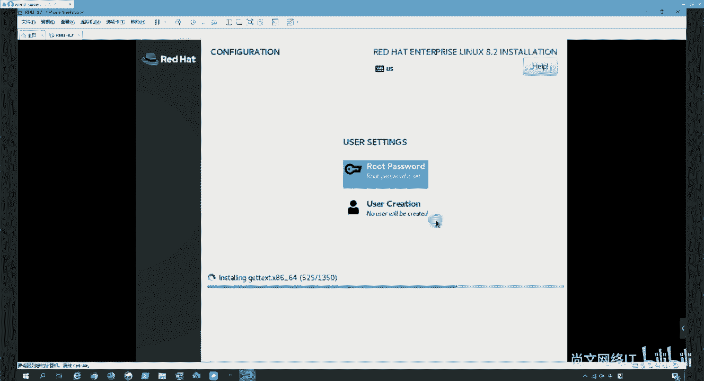

# 【尚文网络】-Linux运维／RHCSA／红帽认证／RHCE8系列录播视频 - P7：【尚文网络】-红帽RHCE8-07.RHEL8.2安装 - 尚文网络IT - BV15A411K7Af

好，然后我们接下来的话是打开我们的那个VMM的 word session，我们来装一下这个以图形化的方式来装一下我们的操作系统啊。呃，首先呢打开我们VM，然后这个创建一个虚拟机，对吧？

我们去走到一个向导啊，去创建一个新的虚拟机。然后下一步啊那个在我们的前置课程里面已经给大家介绍了，对吧？就是应该是。呃，典典型的和高级的两种方式，对吧？

就是分别我们通过两种不同的这种类型来做一些啊虚拟机的向导啊，有什么区别啊，在我们的前人课程人美经。这个已经介绍过了啊。大家如果有疑问的话，可以啊去到我们的前置课程里面去看一下。那么先接下来的话。

我们就直接以这个高级的方式啊自定义。那么高级的话是带有的控制器类型，对吧？包括这个与旧版的VMM的产品的兼容性啊，等这样的一些高级学项的虚拟机。那我们点击这个下一步啊。

然后去选择我们这个兼容这是兼容性的问题，对吧？啊，兼容性我们就不看了啊，点击下一步。然后呢，我们安装来源可以基于我们的主机啊，主机端的这个呃驱动器，对吧？

当然我们现在可能都基本上没有这个集成的这个驱这个DVD的驱动器了。那么第二个呢，我们可以基于我们的IS文件，对吧？或者说我们第三个稍后去安装啊，我们选我们现在选择什么稍后啊安装操作系统。啊。

那么创建的虚拟机将包含一个空白硬盘，我们点击下一步。那么这一个的话是要安装你的操作系统类型，对吧？有windows的，有linux的，有ESSI的，包括其他的，我们选的是这个linux。

那么linux的话，有很多的发行版本，对吧？有比如说我们熟悉的cent了，然后德边的对吧？fidora的，对吧？然后还有什么open so的。

还有oracle就是OLE操作系统oraclelinux是吧？再包括我们现在的这个red hat enterprise lin包括还有一些其他的无斑图是吧？那我们选择的什么应该是选择的这个对吧？

啊re hat enterpriselinux864位啊，点击下一步。然后这个地方呢就给虚拟机找个位置，对吧？我们按照我们各自的每个人的习惯是吧？那我的习惯可能会会在这个某一个盘里面。

我们去单独建有1个VM的一个文件夹，对吧？然后呢，我们去新建一个文件夹啊，比如说叫I需要啊，8。啊，好OK。然后上面的名称对吧，你也可以去改是吧？比如说啊需要。这个8-2对吧？8。2啊，下一步。

然后接下来的话就是我们的那个处理器的数量了，对吧？这个是指的是我们为虚拟指定处理器的数量啊，上面这个处理器数量是指我们的那个虽然是虚拟机，但是呢也相当于是代表的是虚拟机的那个物理CPU的个数，对吧？

就是你的那个你的虚拟机上面的那个假设我们的主板上的socket，对吧？你的CPU这个sockcket。是一个就是一个物理CPU两个物理CPU对吧？我们选择我们选择就一个就好了，对吧？

然后每一个处理器的核核数对吧？比如说是双核的还是四核的对吧？还是什么八核的对吧啊？然后啊我们就直接以四核为例啊，这样的话你的这个操作系统是。处理器就是4C啊，下一步内存啊内存。

因为我们我们这个直接直接点下一步就好了啊，这个两个G啊啊默认默认来就行。然后网络的话，我们这边有桥接的，有NAT的，有紧主机的对吧？啊，这些我们在城市课程里面已经有详细的介绍了。然后我们点击下一步啊。

我们随便选一个，然后这个地方呢是IU控制器的类型，那么我们就按照我们这个推荐了对吧？IL logic啊，下一步，然后虚拟机的磁盘类型按照推荐的叫它叫NVME啊，当然是很快是吧？很快呃。

因为我们我这台机器呢，因为可能会分两个盘，一个操作系统啊上面只是是一块固态盘。然后我的那个数据盘是一个机械盘。那这样的话，我们就我们就选择什么？因为我们选择的那个虚拟机的那个位置啊。

是放在一个机械盘上啊，因为它大是吧？那么选择的这个s塔啊，我们就不选NVME了啊，点击下一步，然后呢去创建一个啊新的虚拟磁盘是吧？点击下一步呃，大小的话啊，按照默认的来就行是吧？因为我们做一些实验。

这个大小无所谓，然后这个地方是不是我们之前在PPT在这个讲义里面已经说过了，是吧？你是不要立即分配磁盘空间。然后点击下一步啊，这个地方也要注意是吧？将磁盘拆分成多个文件，对吧？它拆分之后啊。

可以轻松的将在计算机之间移动虚拟机啊，下一步好下一步完成。那这样的话，一个虚拟机我们就创建完了。那么还缺一步是什么去把我们的那个ISO对吧？我们可能更多的是基于ISO的引导啊，在这个CDDVD的里面。

我们去加载一下我们的镜像是吧？找一下我们的镜像啊，ISO操作系统linux，然后IC2我们选的是8。2啊，然后点击确定。

那这样的话，我们开启这个虚拟机啊吧，开启之后啊。啊，这个地方可以关，因为这个地方有点小是吧？小的话，我们可以点右键有个设置是吧？有一个设置呢，我们在这个有个显示器啊，它可以让你显示这个缩况比例，对吧？

我们可以拉伸一下，是吧？保持纵红的拉伸比然后确定啊这样就会大了。所以看到这儿啊，大家可以看到这个我按一个上下键对吧？上下键你可以发现这个白色的就是高亮的部分会再上下移动。

那么它默认的情况下是不是应该就是干什么呢？是test这次media，并且去inst，对吧？那我们呢第一次就按照这个呃这个操作系统的推荐啊，先测一下这个med，看有没有什么问题，然后再去装这个操作系统啊。

那我们直接按回车。

然后这个时候呢，他就会再去做一些关于我们这个med的一些检查，对吧？啊，做一些检查，这个呢就需要稍微啊等待一下是吧？啊，稍微等待一下啊。当然他还还可以告诉我们什么呢？就是按priice这个ESC。

然后去忽略，或者是取消bot是取消，对吧？我们这个check对吧？啊，好，也很快是吧，94%了啊。好，然后在做完这个检查之后，要开始切换。这个就做一些这个切换啊。然后这个时候就开始安装了，对吧？啊。

开始安装了。

然然后这个呢就是一个图形画的界面，对吧？是一个图形化的界面。然后呢，我们呃这个在选择这个language的时候，呃，你看下面可能往下拉，用鼠标拉是吧？可能会有中文是吧？有中文，然后有这个其他的语言啊。

当然你如果呃感觉自己的英文不太成熟是吧？我们可以选中文，然后这里面呢会有简体中文繁体中文是吧？啊，那我们啊就默认的话，根据我们的这个in enlish，然后去选这个什么united state是吧？

然后点击continue啊。好，然后点击完了之后呢，就像我们的讲义材料里面一样，对吧？会有这样的一些步骤啊，有关于设置键盘的设置语言的对吧？然后是设置我们的这个时区，包括我们的软件的选择，对吧？

这个包括我们的这个磁盘怎么分啊，然后这个怎么去连到我们这个rN啊，连着我们的re hat的network。对吧包括这个key dump啊，设置网络，包括我们的这些啊安全策略。简单来看一下啊。

简单来看一下这些啊，比如说Kboard的对吧？这是我们的一个。这个键盘啊，这个的话我们基本上就不动了啊，点击down就可以了。对吧？第二个呢是关于这个语言是吧？啊。

我们还可以再去叫select additional的 language。adition是什么，是额外的语言支持，对吧？也就是说你你再勾选，比如说再勾选一个中文对吧？再勾选一个简体中文。

这样的话就相当于是什么呢？就相当于是把我们的这个除了我们的英文之后啊，也可以把我们的中文把它给带进来，对吧？啊，也可以带进来啊。然后第三个呢是我们的那个time date，对吧？这个地方一定要去选择了。

对吧？我们可以在这里面去去去找，或者说你将你的鼠标你移到了世界地图这个位置的话，你发现这个鼠标变成一个手的形状，看到了吧？那这样的话，我们是不往这边一点，哎，往这一点，它自动就跳到了什么。

跳到了亚洲上海是吧？然后你的这个时间对吧？我们这个时间。啊，这个时间。呃，这个时间的话，我们可能会呃有一些这个调整是吧？有些调整啊，那我们就不基于我们的网络了，对吧？就不基于我们的网络了啊。好。

然后我们再往下看啊再往下看。嗯。嗯，这个安装员啊安装员对吧？安装员。这个是来自于谁啊？auto detect installation media这是来自于谁叫S20，看到了吧？啊。

S20S20指的是什么呢？我们在这个通过虚拟机下导走下去之后啊，在启动虚拟之前是不是要去加载了一下那个SO文件，对吧？那个东西就叫S20啊，在linkux操系上叫S20，是吧？这是一个啊。

那么也就是说我们默认是基于现在是基于谁那个IS文件引导出来的对吧？也就是说通过那个东西来进行安装。那除此之外的话，我们还可以装什么东西啊。

装这个叫red hat的CDN通过readdhead内容分发网络啊，叫con那个 network啊，现在这个公有云有一个非常好的一个产品，叫CDN啊，相信大家都都能听过，主要是用来做这个缓存加速。

视频流着加速，对吧？啊，这个像我之前在做一些这个政府的门户网站的时候啊啊，因为这个。这些门户网站是每年要评分的啊，所以说不允许404的，明白吧？是吧？不允许404啊，所以说这个想了个办法什么呢？

把这个门户网站的一些这个首页，或者是下面一些二级子页，我们把它放到1个CDN上面，对吧？通过我可能会买一些，比如说阿里云的，或者是买华为的，或者是买微软的艾er，或者是买亚马逊的AWS对吧？这一些。

买下CDN，然后呢将自己的这个域名和CDN提供了这个就相当于这个解析的地址做一个alas，做一个别名，对吧？一配啊，这样的话啊我们就近是吧？比如说我在我在这个在北京啊，我就就近访问这个CDN的站点。

比如我在山东我就访问CDN站，对吧？这样的话会做一些这个加速啊，缓存的一些加速啊，即使可能你本地的这个文件可能会出现网站或者出现404，但是它先走的这些先走的CDN站点对吧？

所以这样的话就可以很好的去去避免啊在这个这个这个监测的时候啊，避免出现这种404的情况啊，所以说CDN这个东西也是一个好东西，对吧？嗯，包括我们现做一些这个教育，对吧？做些教育的话。

通过CDN啊来实现这个视频的啊加速啊，也是都是OK的啊，所以我们也可以基于re cDN啊，去找到我们的那个啊这个insulation是吧？当然还有一些基于一些其他的网对其他的URL啊，这个也是可以的啊。

都是可以的啊，然后这个下面呢会有一个东西叫additional的repro stories啊，就是额外的仓库啊，额外的仓库。这个呢大家注意一下啊，这个东西大家注意一下啊，就是。呃，我刚才点了个加号。

就是叫什么一个新的仓库，对吧？我我把它取消了啊，把它取消了。你看到这个地方叫有一个东西叫APPinstoreAPP string啊，这个呢是我们后期再来详细说啊，后续详细说再谈到一些关于软件包啊。

比如说基于或者是基于DNF来安装的时候，我们会详细说这个东西啊。呃，好了，然后这一块呢我们就知道了是吧？啊后点击到啊。那再往下。软件包的选择是吧啊，这个小白我们可能用GUI对吧？

这个或者是workation，然后这个老司机的话就是minimal的这个install是吧？当然还有一些自定义的一些其他的，你可以在这个地方去选择一些这个开发包，看到了吧，是吧？啊，开选择一些这个包啊。

然后包括watualization也是一样的对吧？啊，这个watialization是基于什么呢？最小的这种啊虚拟化的主机。那我们就先选一个service GI吧啊，然后点击down。好。

然后重点的重点就是这个了是吧？installation的 destination啊，我们先把这些看完啊，connect to这个readd hat是吧？啊，连接到readd hat账号名密码，对吧？

然后进行这个注册啊，当然我们现在可能啊没有这种环境，那我们先啊忽略掉。然后再一个呢就是这个K dump，对吧？K dump是一个当科呢发生了crash的时候做了一个救援或者修复啊。

默认情况下我们是enableable的对吧？啊，enableable的这种状态。啊，然后network的啊network这个会生成一个虚网卡，对吧？虚拟机里面会生成一个虚拟网卡啊。

虚拟网卡里面我们可以去干什么？去configure是吧？去配置配置什么东西啊，配置，比如说IPV4的啊，基于DCP啊，或者是手动的或者是IPV6的对吧？基于DCP或者手动的啊。

到这个地方我们就先不设了啊，然后再一个呢这个地方可以设我们的主机名，对吧？啊，设置主机名啊，这些东西我们先不动。最后一个是这个security的这个policy。啊，secured policy啊。

关于一些安全策略，对吧？安全策略啊，这些我们就就就按照默认的来就好。那么最终的话我们会走到这个最重要的是吧？刚才我们也提过了，假如说你这个地方会有一个通过U盘引导出来了之后，这个地方会有你千万别点错了。

对吧？你看你不选对吧？这个地方就没有就没选中，然后他会告诉你没有di selectlect，然后选择至少一个盘要去安装，然后选中它，只要你选中了这个地方就会有一个这个黑色的背景，然后有一个白色的对勾。

对吧啊？好，当然这个这一块呢，我们就要。本地牌啊叫本地盘。然后我们可以去添加一个看看是吧？一个特殊盘或者是来自于一个网络盘，一个外部盘，对吧？比如说来自于什么来自于一些mpa啊。

来自于一些多路径的一些设备，对吧？那么这些呢就可能会要强调一些什么呢？关于做实现一些什么通过这个光纤通道了，对吧？或者是一些的这种环境里边对吧？或者一些这个NVMNVDMM这些对吧？

包括我们可以添加什么基于SRC的ge对吧？如果你有一个S的serv的话，我们可以通过ge来实现到一块盘啊，包括我们可以做FCCOE对吧？FC是b channel，对吧？光纤。

然后这个O代表叫over对吧？然后E叫net，也就是说FCCOE实际上是走的什么呢？是相当是光转电对吧？然后光转电你你这个转到一个网卡上？然后呢我实际上我们可以通过啊添加一个FCE的这么一块盘。对吧啊。

来进行实现。当然我们现在是不是都没有这种环境啊，没有这种环境的话啊。我们就这个不能实现了，对吧？啊，就不能实现了啊，好了，然后这是这个盘。那么再往下的话是automatic还是cus。

那么我们基本上就要选什么cus，对吧？然后点击到啊。点到的话，那这个地方啊我们要去新建了是吧？如果你点它click here to create。就是点击之后要去automatic的去创建。

手动的去创建他们了，对吧？我们应该是选什么呢？应该是选加号，对吧？啊，选择加号啊，选加号，然后这个地方我们比如说先选择这个步骤分区，然后给到500M。对吧500兆啊，点击添加挂挂外点，对吧？

然后这个地方是不500兆标准形式分区叉FS对吧？然后它的这个这个这个文件系统，我们最终创建出来叫什么？是不是叫DEV下SDE，对吧？这个地方叫DEV下SDE，这个没错，对吧？

然后再往下第二个呢是不是我们的s。对吧找一下SWAP啊，s up。s2G那呃物理内存我们2G，那我们可能给它4G就可以了是吧？点击创建啊，然后这个地方是不是可以选择你是基于LVM呢，还是基于标准分区。

甚至还有一个叫什么LVM看到了吧？是不是那个经典位，对吧？经典的方式啊，我们就按照默认的LVM来吧啊，然后文件系统是不是s，对吧？啊，而不是什么E叉T4，或者是其他的啊。

当然我们就要是基于让它基于LVM的形式的话，这里方是不比如 group对吧？默认的话叫叫这个叫什么呢？叫这个R7，我们是不是可以去新建一个 group，对吧？比如说我们个名字叫up文。危机可以吧？啊。

叫一个阿普仑危机啊，然后。然后啊我们再来往下看，对吧？我们再来往下看。那么这个地方呢会有一个东西叫read level，你看到了吧啊，有一个东西叫read level。

read level呢实际上啊我们来简单说一下啊，叫read level。

这边的re level实际上呃它是一个什么呢？是一个这个基于啊，linux。操作。做系统的。那个叫软瑞的啊，叫st。rereread啊叫软件read基于软read，它是基于我们这个linux操作系统嘛。

就和LVM是一样的啊，就是你看我们底层对吧？我们说包括我们LVM你的底层对吧？底层认到的。认到的。盘。或者分区可能是什么呢？可能是底层。通过做read。啊，实现的一块儿。那个逻辑盘对吧？啊。

实现可能叫一块逻辑盘，可能是什么呢？可能是底层有什么呢？有呃3块盘，比如说啊比如说有有3块盘啊。这个通过read的对吧？然后搞了个。瑞德5的。级别的。啊，一块逻辑盘对吧？啊。

当然当然底层这一类的话一定是要有什么呢？一定是要有这个这个物理锐的阵列卡的啊，有这么个东西，对吧？然后你搞成了你一块逻辑盘。那么我们这个这个这边这个read level指的什么。

是基于操作系统的叫软锐的啊，也就是说把你的操作系统的一些计算资源，就相当于啊什么呢？就相当于是一个这个啊一块阵列卡啊，有这列卡里面是不是要有缓存，要有什么有这种要有计算的，对吧？所以我们把它当当做一个。

所谓的这个战列卡，然后呢把你这个呃认到的这些盘，对吧？把认到的盘。热到的盘进行read级别的划分啊，那么有哪些read的级别，这个地方是不是有会有啊。

有readd0readd1readd4readd的5readd6有readd10对吧？那么关于read的一些选项啊，我们今天我们不详细讲啊，不详细讲。

我们后面会在这个磁盘管理的那个课程里面会详细的去说一些read的 level啊，readd level啊，那么这些我们指的什么呢？是基于操作系统的叫软read。

你认到的这个盘，很有可能就是什么？就像我刚才说的对吧？你认到了一块盘，很有可能就是一块逻辑盘。对吧那你认到了一块逻辑盘。我们再去。画一这个read的对吧？我们来简单画一个看看啊，这是一块盘，对吧？

然后这是一块盘。假如说我现在这个操作系统啊，我认了3块盘，对吧？比如说啊D一V小的。SDAE呃SDA对吧？然后这个呢可能要DEV小来SDB。对吧，然后这个呢可能叫DV小SDC对吧？

虽然你可能这个操作系统啊还需要8。2，对吧？我可能认了这个操作系统，但是对吧？但是我的底层对吧？我的底层可能是什么呢？就虽然你你看到的是一块盘，对吧？可能看到的是一块盘。

但是呢。这块盘很有可能是什么？周二盘很有可能是。哎，我们把它就这个样是吧？虽然你认到了一块盘，但是这块盘很有可能是什么呢？是由这么。3块盘啊3块盘。我通过什么呢？通过。通过这个什么呢？通过这个啊呃。

这个read卡是吧，就是就通过硬件的read。阵列卡。划分的一块儿。逻辑盘明白这个意思吧？啊，那么同样的，这些这些都是以此类推，对吧？就你认到这块盘，很有可能也是一样，对吧？

我可能有一有2块盘可能做了一个什么read，对吧？可能这块盘，我可能是通过什么呢？是通过这个可能有有有4块盘，对吧？举个例子，有4块盘，然后我画了一个read10对吧？认到了一块盘，明白这个意思吧？啊。

那么我们在我们在这个在这个基础之上，我现在认到了这块3块盘，对吧？那在这盘基础之上，我们再去画read的啊级别，比如说根据read的级别的要求，那我三块盘了，我可以比如说画个read5，对吧？

比如说这个可能是呃十际对吧？这可能是20G，对吧？这可能是30G，对吧？可能是30G，那我们就可能要去把这些就把这个盘这个盘这个盘作为啊这个read级别的一些叫。腾eng Yuan盘。对吧叫成员盘啊。

就成员盘啊，好，这叫成员盘是吧？嗯，然后再去做read，然后任到一块设备啊，比如说叫DEV下的啊，比如说叫MD0啊，然后对它做文件系统的格式，就是个化，对吧？然后去挂来使用啊。

就相当于是我们LVM的那个。逻辑院里面的LV或者是我们一个标准形式的分区，比如说DV下S1对吧？一样的啊，来进行格式化，这样的话就相当于是从操作系统级别层面，我现在有有3块盘做了一些保护。

但实际上这3块盘里面每一块盘可能都是来自于谁验，都是来自于底层已经做过了这个read的，明白吧啊，这叫这叫这个地方叫read啊，那么这个呢不是我们的重点啊，这个不是我们的重点，我们简单了解一下就可以了。

好吧？啊，然后点击啊，我们就可以去创建一个外 group是吧？好，然后创建出来之后，我们去modify一下啊，刚才也是一样的，对吧？啊，也是一样的啊。对吧你这个地方啊也也size了policy，对吧？

你可以去设置这个这个大小，对吧？啊，设计设设置一下这个大小。好。

然后啊接下来我们再来啊该谁了，该这个跟了是吧？跟比如说给举个例子，给10个G啊添加啊，对吧？同样的我是来自于阿普文，对吧？来自于这个阿普文啊。你看你是否可以去。可以去去改一下是吧？啊，可以去改一下啊。

然后再来啊，比如说我是不是可以把这个va单独也画一个，或者是什么把va log单独画一个啊，比如说啊单独一个文件系统是吧啊，单独一个文件系统啊，然后这个地方我就不演示了。

然后最终啊我们演示一个一个叫up普文。啊，杠APP。这是一个什么呢？这是一个自定义的一个文件系统，对吧？我们去干什么去匹配啊，我这个地方不添容量了，我们就直接去匹配剩余的空间，点击添添加下一步啊。

你看它自动就给你分出来什么，前面这些都是什么sform的对吧？就是基于操作系统的那后面这个呢是什么？基于一个数据的啊，也是某来自于来自于这个这个哪个盘，就是来自于哪个卷组里面对吧？啊，来自于哪个卷组啊。

你也能能够看得到是吧？能够看得到的啊，好。那好，那这样这样的话，我们这个盘啊，这一块盘我们基本上就给划分完了，对吧？就给划分完了啊，划分完了之后啊，我们点down啊，点down。

如果你感觉重新需要再重新再画一次，这个地方是不是有个reset all，对吧？好，那我们点击down。那这样的话要开始干什么呢？要开始做出一些分区表的改变了，对吧？

accept changes啊去改变啊。好，接下来的话我们就可以去干什么去begin installation啊，点击安装啊。装的话就这么简单是吧？剩下的话我们可能要去做两个操作。一第一个是要干什么呢？

给用给root用户，也就是说我们las操作系统的一个管理员的用户设置一个比较复杂的密码啊，这个呢就是按照我们。的习惯对吧？去设置一个复杂性比较高的啊这么一个密码，对吧？str网是吧？

是一个密密码强度比较高的。哦。응，不匹配稍等啊。好，准你到。那你也可以去做一个什么创建一个普通用户啊，那么这里块我们就就不创建了啊，就等着这个什么去安装啊，就好了啊，就按装装号安装就好了啊。

所以整个的这个安装的过程啊，其实是比较简单的。但是核心点是在于我们怎么去做那些分区的规划，对吧？啊，怎么能做分区的规划啊。你看刚才那个。好像没有ETC对吧？好像没有OBT对啊？

没有我们刚才之前说的那些常见的，你可以把它单独拎出来，对吧？可以把它单独拎出来啊，比如说把ETC单独拎出来，把TMPho单独拎出来，这样的话就和那个根就不在一个文件系统里面，对对吧？

你就不在一个文件系统里面啊，这个地方大家一定要注意啊，就是你想你像比如说你要做大数据的一些啊，你要你必须要把那个log把它单独拎出来啊，因为那个log会经常在在用，对吧？啊，会经常在用啊。

好，那我们先这个呢安装我们就先讲到这儿啊，然后待会儿等他自己去装完了之后，我们再去往下说，好吧啊。

