# 【尚文网络】-Linux运维／RHCSA／红帽认证／RHCE8系列录播视频 - P8：【尚文网络】-红帽RHCE8-08.RHEL8.2系统安装后的向导流程说明 - 尚文网络IT - BV15A411K7Af

好的，然后呢，这个操作系统已经complete，已经装完了，对吧？啊，装完了之后呢，会有一个reboot的一个。选就让我们去reboot对吧？去重启。然后这个时候呢，我们就会看到啊使用对吧？

使用这个pro product这个产品的啊，你要使用的话是要干什么呢？去。subject对吧？你要去调就是提交一下，对吧？或者选择一下什么license agreement。

就是我们的那个license。对吧就是agreement那个条目啊，需要做这样一个操作。好，那我们接下来去reboot一下啊。

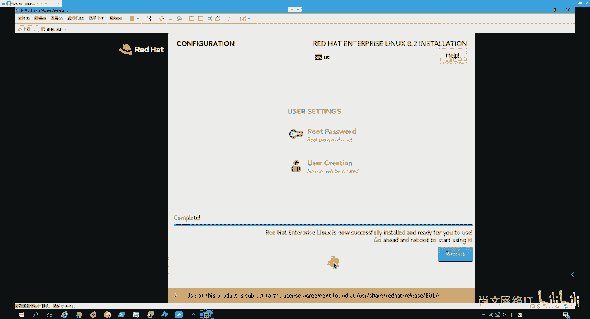

呃，reboot完了之后呢，我们就重启是吧？重启之后他就会呃到了这个操作系统的那个那个那个选择的那个界面，然后我们去引导操作系统，对吧？啊，去引导操作系统。

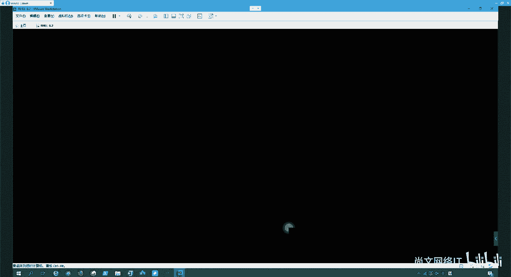

然然后刚才说了是吧，有一个license的 information，对吧？license not accept啊，我们要去干什么呢？I accept对吧？ accept一下之后点当啊。

然后这个时候还可以改什么提交创建用户是吧？那我们这个地方这些都不管了，对吧？先先暂时不管了，然后去finish configuration啊，点击这个啊完成我们的配置。

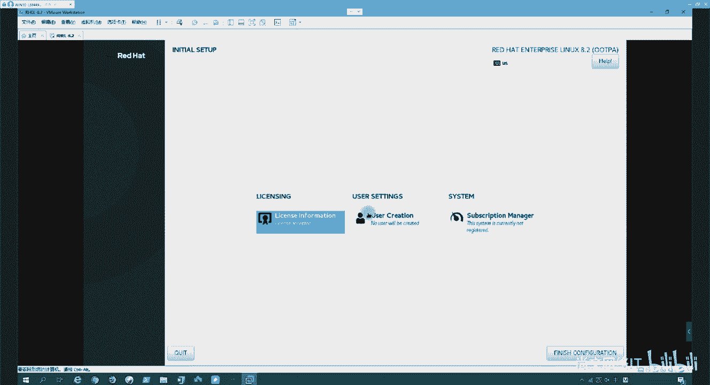

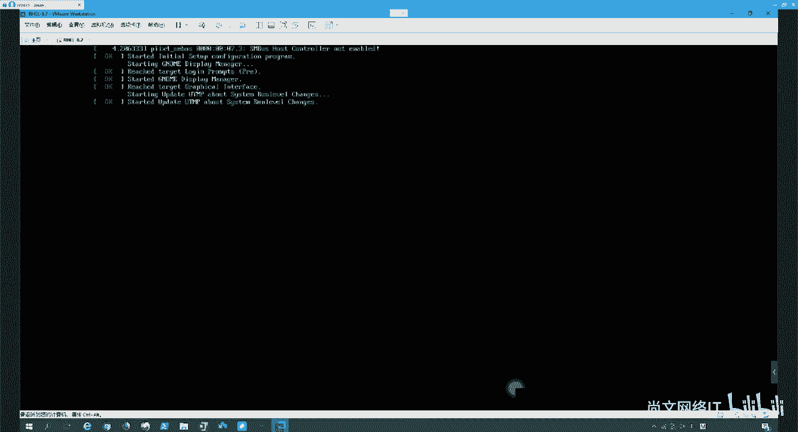

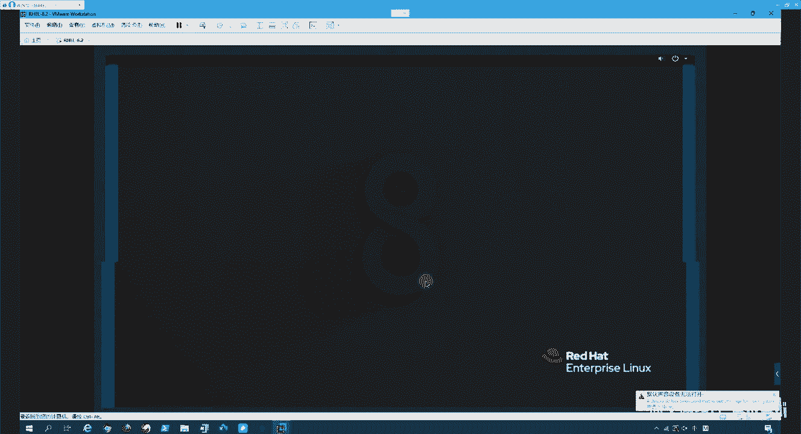

好，然后呢再往下呢会有一些欢迎的一些。这个welcome是吧，然后这个呢叫priive privacy。啊，就是你的location的 service，是不是要去开。

把你的location service服务把它开起来啊，我们一般这个随随便啊随便无所谓啊，点击下一步，然后呢去connect你的online的 accountcount，就是你的在线的账户。

对吧可以基于谷歌的，可以去于这个微软的portal的对吧？包括facebook的，还有一些其他的。我们这边点sscape，对吧？然后这个时候要要让你去干什么呢？去关于对吧？我们去创建一些。一个用户对吧？

成一个用户，你看我们如果是entterprise的话，我点entterprise是吧可能会基于什么doin，基于域的对吧？然后如果不设的话，那我们可能就就相当于是自己通过一个啊自己自有的一个用户啊。

比如说阿普文举个例子是吧？啊，阿普文，然后你才能去做nex是吧？下一步然后赋予一个。密码性复杂比较高的这么一个。Co令。然后点击下一步。好，然后开始ready to go是吧？

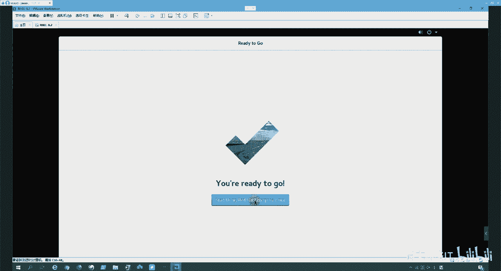

这个呢是我们的一个阿普文的用户，对吧？阿普文的用户呃，我们现在呢可以通过阿普文这个用户来进行登录了，那么也可以在notlistist可以干什么呢？可以干。比如说我敲root用户。

还记得我们在装操作系统时候是不是也在在那个RPM包在。这个装的过程中，是不是也让我们去呃设定root用户的那个密口令，对吧？啊，那这样的话，我们可以基于root用户啊，先登录一下，然后把那个密码是吧。

把密码来给。这样的话我们就这个登录了啊，登录到我们这个。

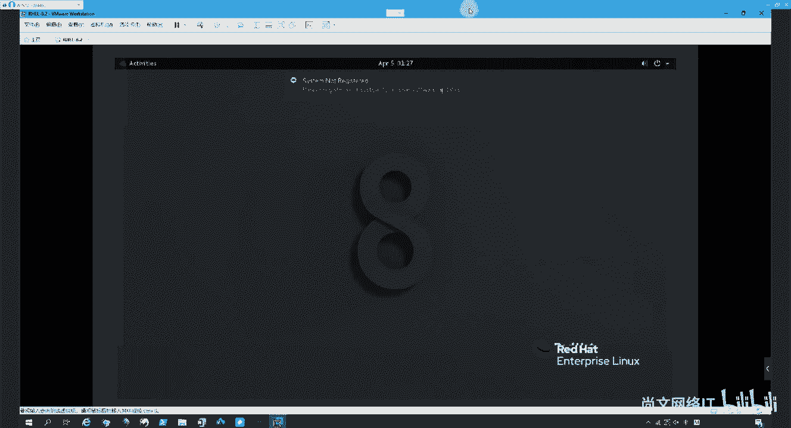

哎，2718了啊，然后呢这个也是有一个下一步是吧，然后去这个说产品，这是关于一些key的一些配置是吧？Now。然后privacy啊是不是要去启用？账号有没有对吧？ready to go啊，开始。好。

那这样的话，我们就正式的进入到了我们的那个什么呢？H8的操作系统里面，对吧？就进入操作系统里面了。那进入到操作系统里面啊，我们呃当然我们是已经装了这个图形，对吧？图形的话我们叫genome，对吧？

是不是叫这个东西叫gome啊，gome里面呢会有一些getting study的，是吧？就是做一些向导啊，当然我们可能呃对于这些windows图形的图形的这种，我们可能没有太多了啊。

就是没有去这过多的去怎么去去做一些研究，因为都比较简单，对吧？像它可能去成了fair f对吧？打开这个fi，那fi里边是不是就相当于我们的那个windows一样，对吧？我的电脑打开之后就会有什么呢？

就会有这些doments登录的music这里面的一些东西，对吧？就关于我们的home的啊，这个目录还有一些。

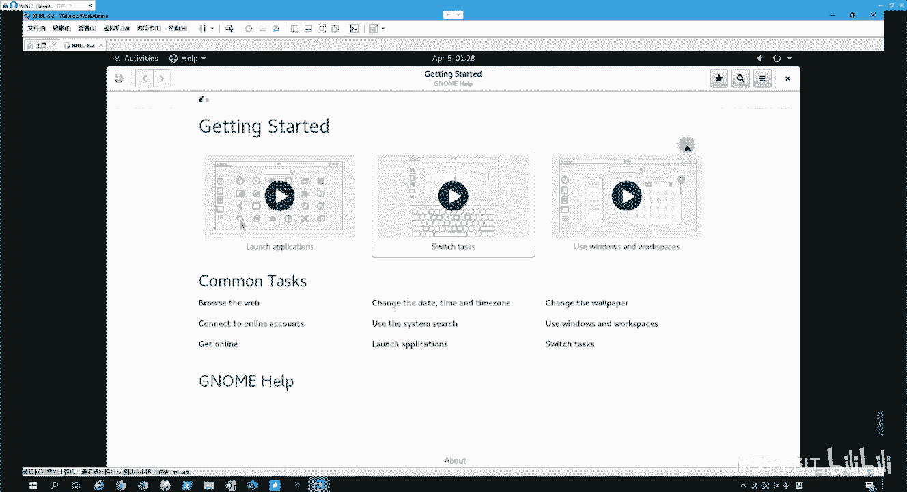

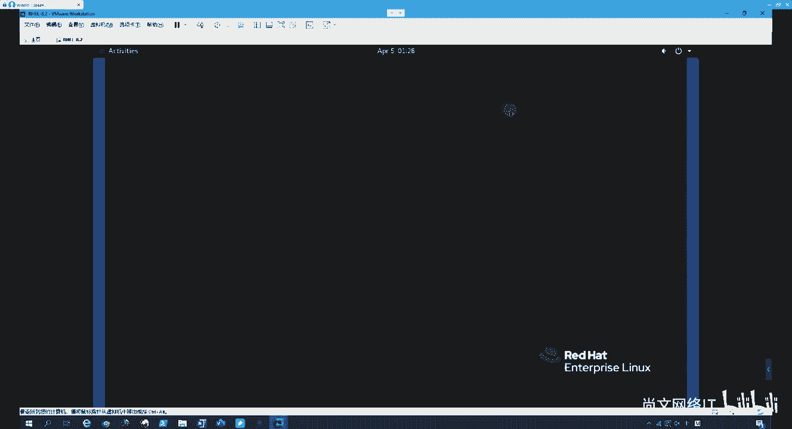

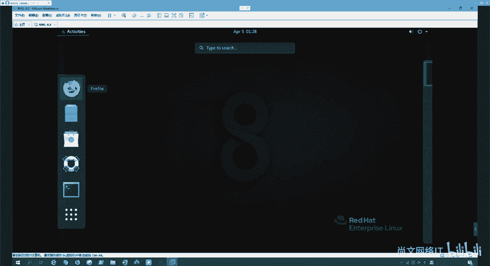

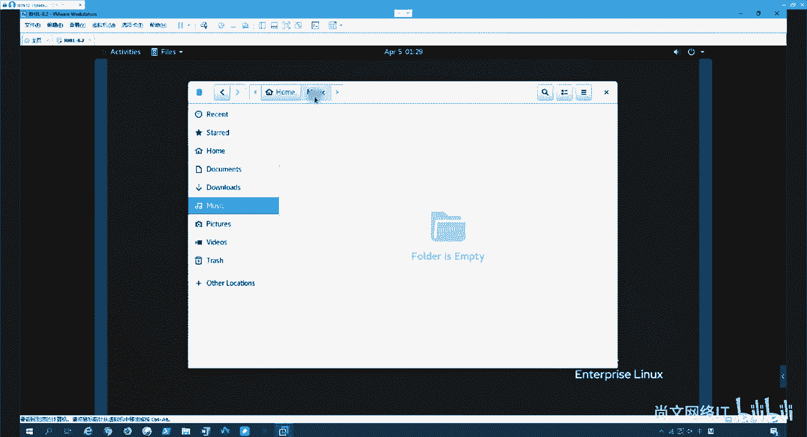

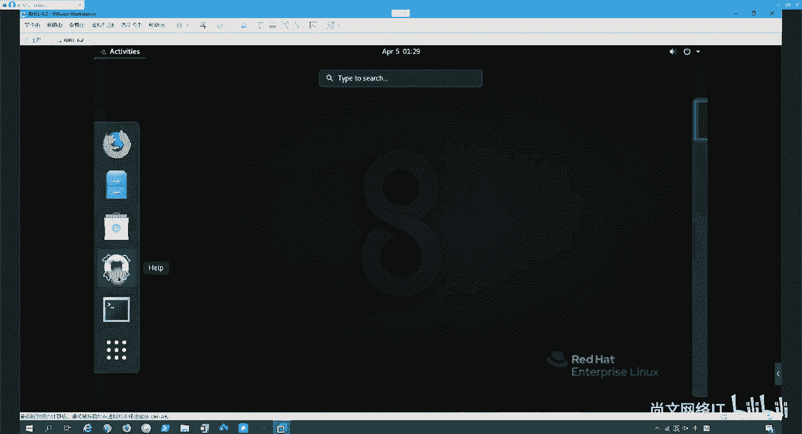

啊，比如说这个软件是吧，你打开软件之后。啊，就会有一些。啊，哪一些是我们已经装过的对吧？啊，哪一些是我们已经装过的一些软件啊。

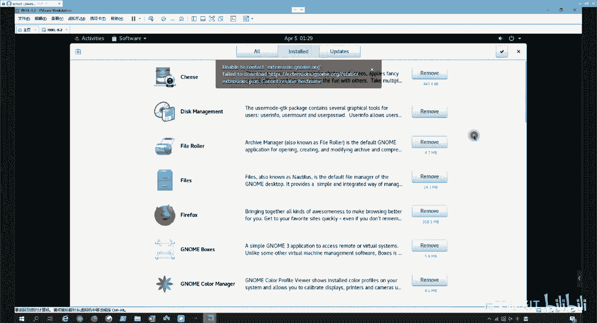

然后再一个呢，就是关于一些这个啊其他的是吧，其他的啊。啊，当然这个一开始装的不是特别多，对吧？主要是一些什么分区工具，对吧？分区工具。字体啊记录日志啊，包括我们可能是最常用的是什么呢？

是就这个东西terminal是吧？打开我们这个terminal啊，这是我们可能以后啊会经常常用的啊这么一个东西啊。

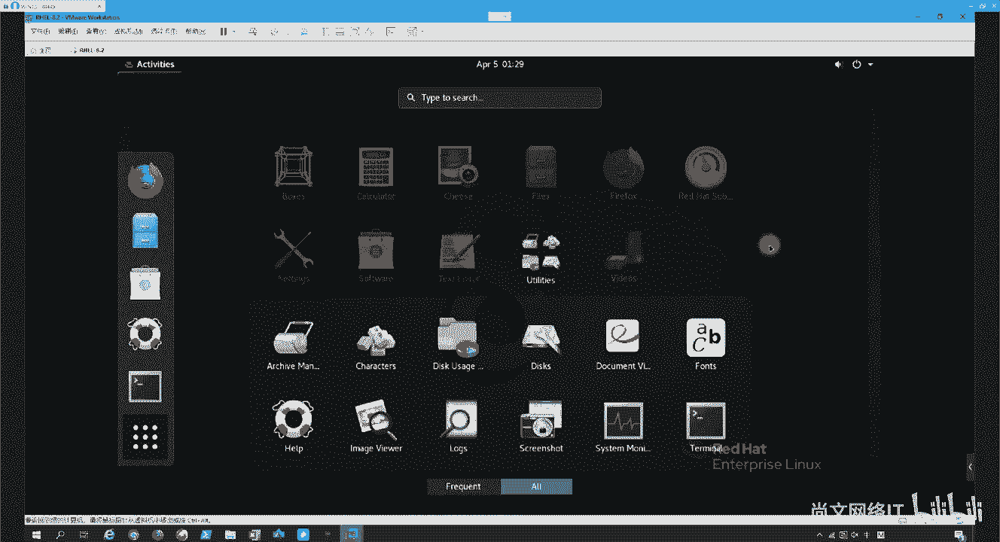

好，呃，然后关于这个图形桌面的话，图形桌面的话我们可能就讲到这儿，对吧？这个其实没有什么可讲的啊。这个假如说啊假如说我们。假如说我们在这个以后如果参加这个2CE的考试的话，呃，肯定是要用到图形界面。

那么用到图形界面呢也很简单，对吧？也很也是比较简单的。大家只要是知道知道知道是怎么打开f f，对吧？你要点这个act对吧？act打开它你你选中了它之后，它这个地方是不跳出来了，对吧？你可以打开f f啊。

这是一个然后第二个呢就是你会要打开这个terminal啊，就这两步，对吧？假如说我们要去参加这个2CE考试的话，可能用到的最多的两个东西，就是你要去打开fair f。

打开我们的 terminalminal啊，因为在做我们做一些做题的时候，在考试过程中，我们可能更多的是基于这个这个terminal啊，基于 terminalmin来实现啊。

那么f f的话可能就是一些什么呢，就是说比如说这个题，对吧？会以这个这个网页的形式把它给呃拉出来，对吧？拉出来。

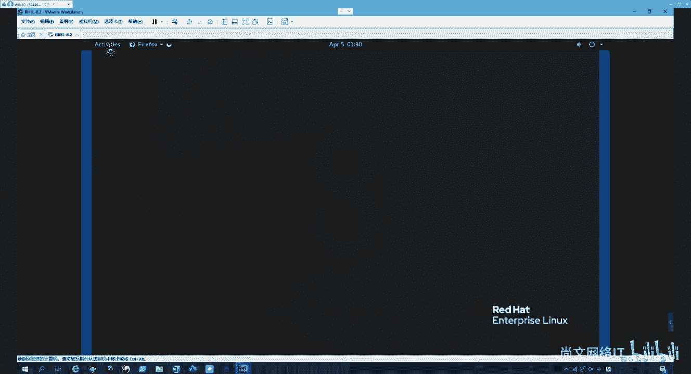

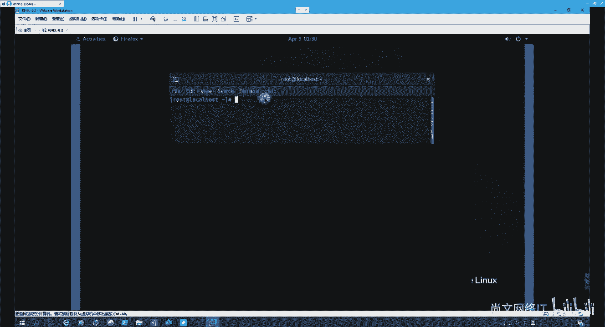

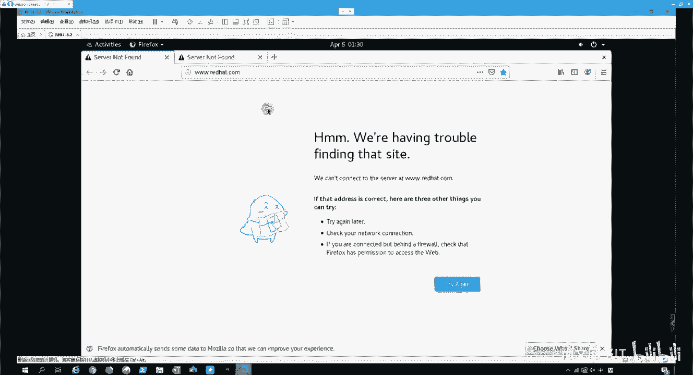

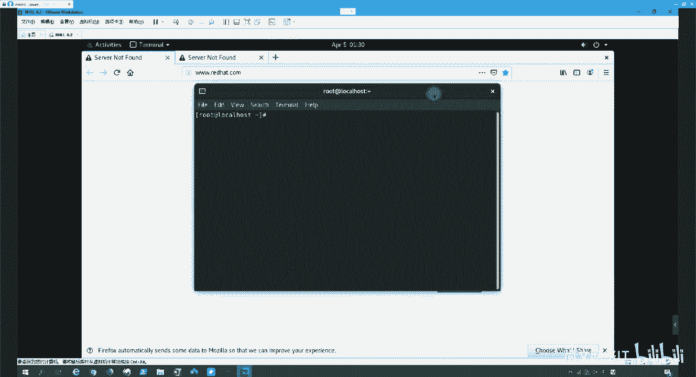

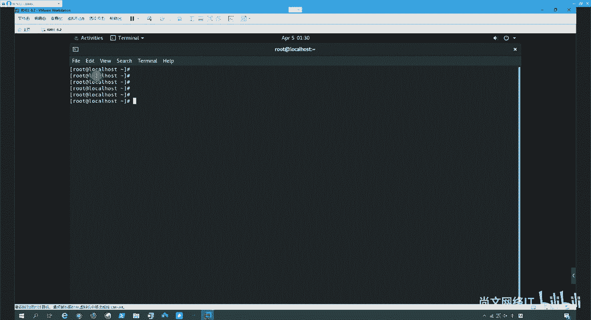

之后我们要要来回的这么切换，对吧？来回这么切换我们的这些perminal和我们的和我们的这个firef之间的一些切换啊，这就是我们的一些啊这个使用，对吧？啊关于一些使用啊。

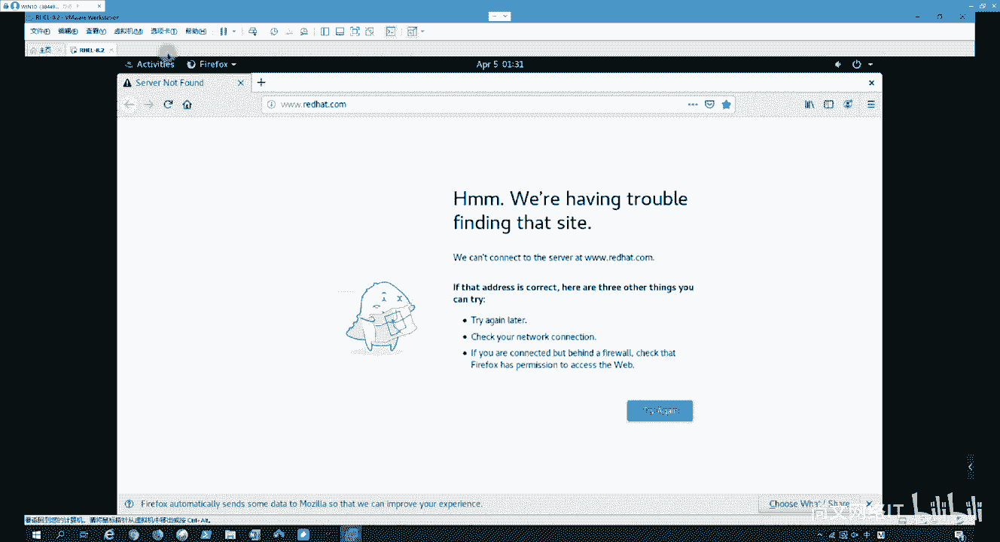

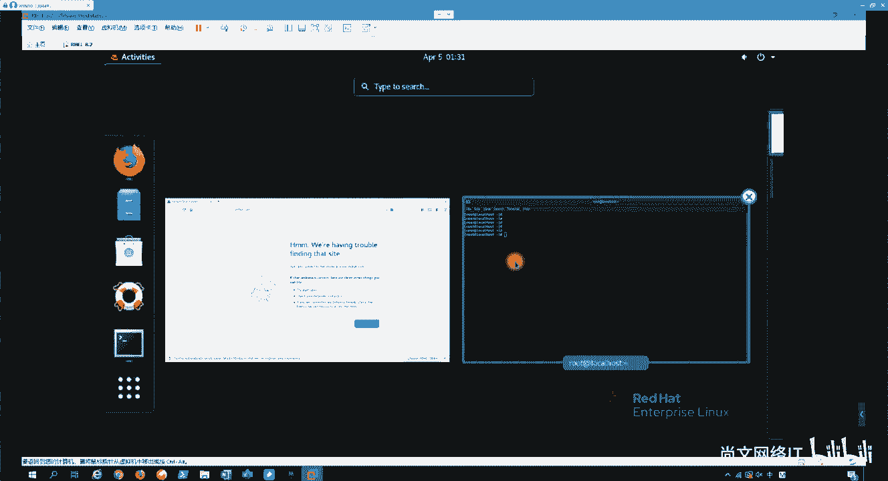

现在看可能会有点有点有点慢，是因为什么？因为我们那个内存啊会比较低啊，会比较低啊，这个倒没关系啊。那么关于这个图形界面呢啊，我们就我们讲就讲这么多，因为实在是没什么可讲的对吧？啊。

但是呢我们要着重去把一些。

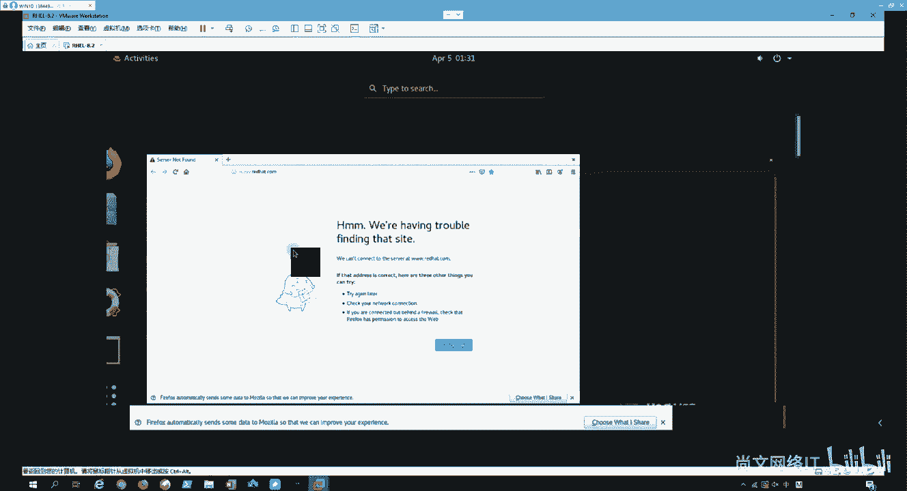

啊，把着重一些。这个时间对吧，把一些这个嗯打开浏览器啦，包括打开我们的terminal是吧？把这些东西我们讲出来对吧？啊，把这东西讲出来就可以了。

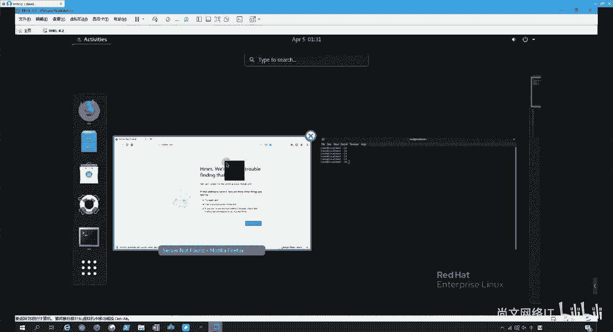

好，这是关于我们的一些啊关于这个图形界面的一些东西，对吧？啊，好的。

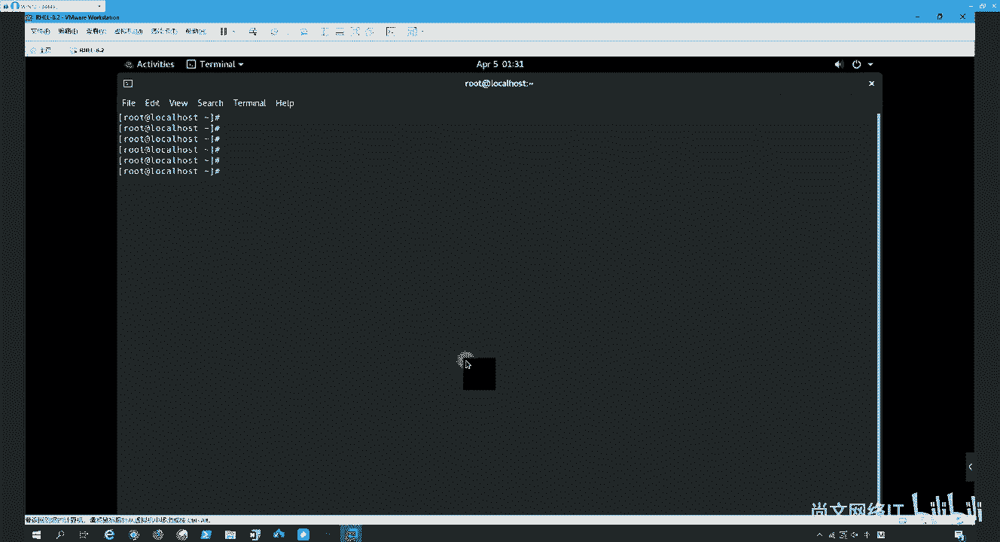