# 【尚文网络】-Linux运维／RHCSA／红帽认证／RHCE8系列录播视频 - P9：【尚文网络】-红帽RHCE8-09.磁盘缓存两种模式说明 - 尚文网络IT - BV15A411K7Af

然后呢我们接下来再来看啊，就是再来看有一个概念呢叫磁盘的缓存缓存模式啊，你看这个装一个操作系统，这么多这种模式那种模式是吧？有磁盘的什么分区模式，又有磁盘的缓存模式，还有什么机下的磁盘模式，好多模式。

对吧？那关于这个磁盘的缓存模式啊，我们这张截图啊，我们这张截图实际上就是在一个linux操作系统，它在引导的过程中，我们给抓下来这么一个图啊，而且大家要注意这个红色的这个椭圆的圈里边啊。

会标注了一个东西叫drive的 cash看到了吧？叫drive cash。那个drive的 cash的话指的是什么呢？指的是我们的这个啊指的是我们的这个什么呢？这个这个这叫磁盘的缓存模式。

叫read through对吧？叫read throughthrough是right是写的意思是吧？through就是就是就是。同时啊就是同时的意思，对吧？就是read through啊，就是同时又写。

那同时写什么东西呢？那我们来看一下啊，关于磁盘的缓存模式啊，有两种，第一种是叫re through。

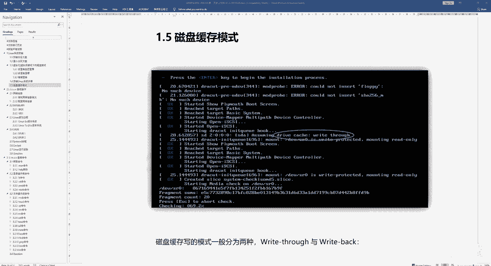

对啊。第二种呢叫re back啊，back就是回写的意思啊，就是回返回的意思是吧？那来看一下，第一个叫re to叫止写模式。就是我们在做这些数据更新的时候啊。

会同时写入到我们的cash和后端的我们磁盘上。

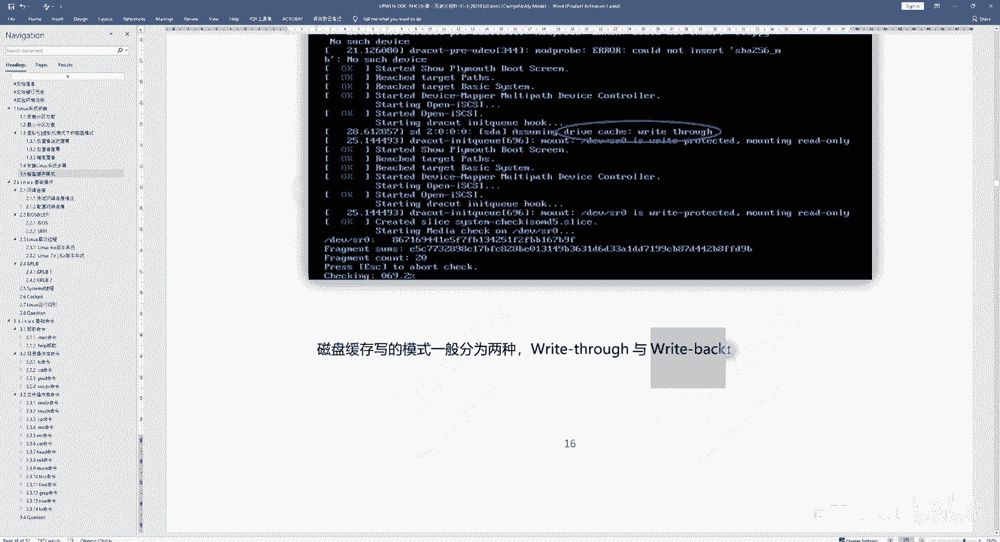

也就是说什么意思呢？这个东西可能是跟我们的一些控制器，比如说我们的真列卡，对吧？上面会有芯片，对吧？比如说LSI的logic是吧？我们会在做这个数据这个同步的时候啊，在做数据同步的时候。

假如说你是re速这种这种模式的话，那么在数据做更新的时候，会同时写入到我们那个控制器，就是我们那个卡子上的那个cash以及写到我们的那个磁盘上，啊，明白吧？那么这种操作的优点是什么呢？就是操作比较简单。

但是你要想啊，就是它同时写肯定会在数在这个写入更新速度方面肯定会要慢一点。对吧慢一点是要慢一点的。那么第二种模式叫right back啊back。就先它在更新的时候只写入缓存啊。

只有数据被替换出缓存的时候，那么被修改的缓存数据才会写到后端的存储。那么这个优点是它的快，因为什么他只往这个caash上写。啊，不需要后边的这个存储。但是有个问题啊，就是一旦在更新的时候。

数据又没有完全被写入存储的。后端存储的时候，或者是磁盘的时候。假如说掉电了，那么这个数据就无法找回了。明白吧啊，所以。

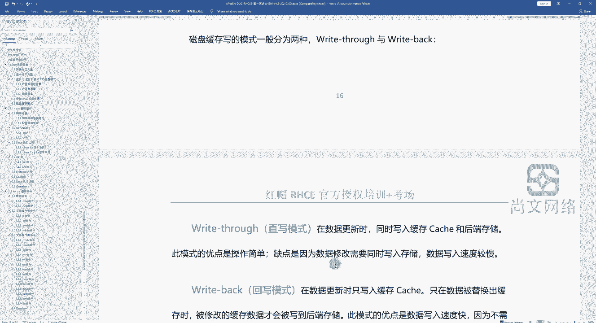

啊，所以呃这是两种方式。实际上这两种方式呢也应用到了我们在做这些什么呢？在做一些啊，比如说关于服务器的一些在配置read的时候，在划分read的时候。

除了指定read level之后之外呢还要做一些这种缓存的这种啊模式的配置啊，缓存模式的配置，这个大家要注意啊，就是那么read和read back的区别，对吧？一个慢一个快，那么哪个更保险一点。

肯定是read啊，那么这个呢有一个截图啊，这个截图就是就是我们之前啊就我们在之前在做一些集成项目的时候，对吧？对于服务器啊，这个可能是IBM服务器。

然后它呢是通过叫什么叫megaread啊是通过LI的这种控制芯片对吧？然后去配置一个read对吧？配置完read之后，我们除了要去指定read level，对吧？这个地方可能比如说read0是吧？

一个read level然read。

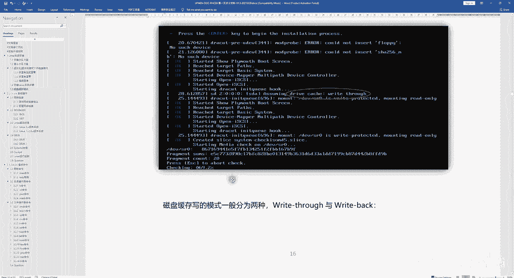

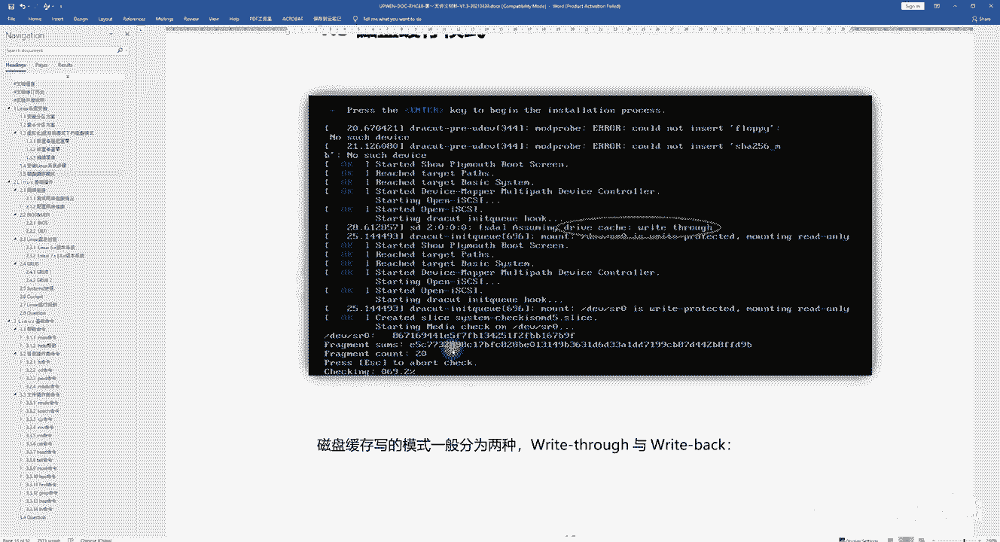

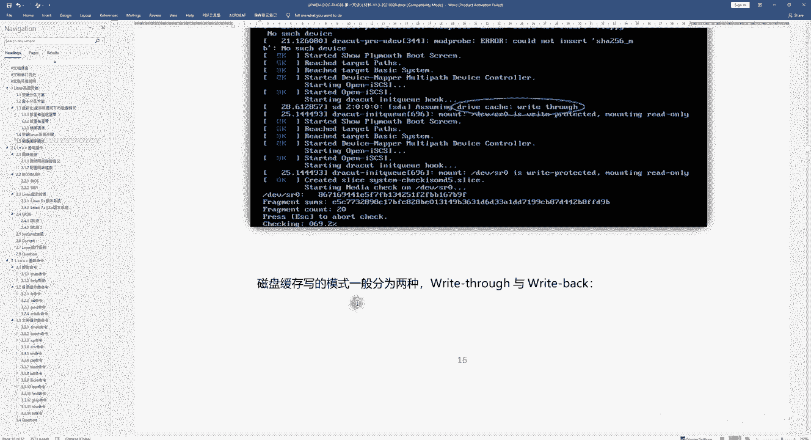

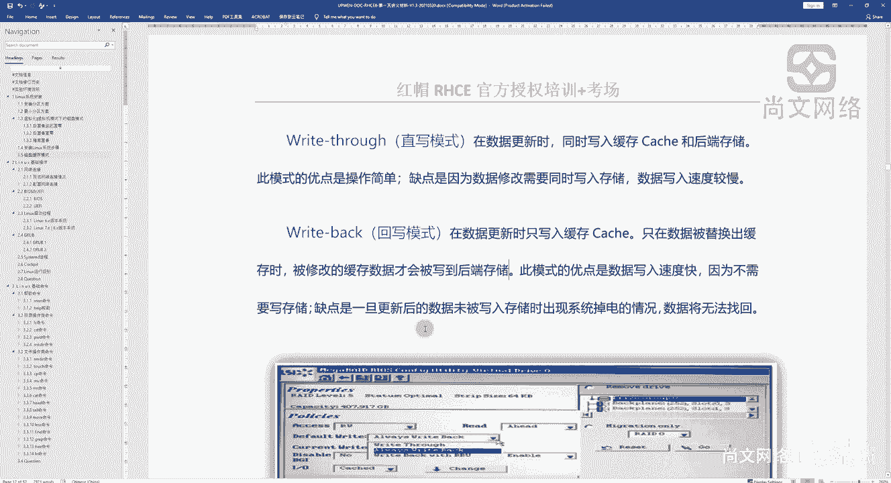

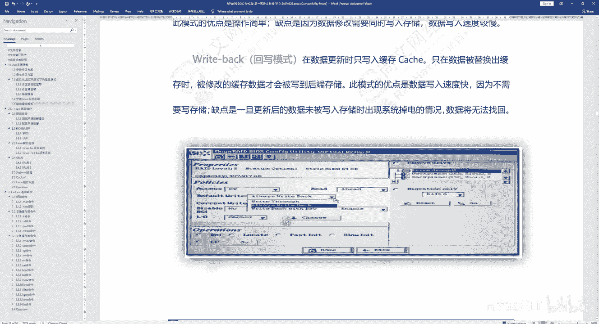

外呢这个地方会有一个policy看到了吧？有个policy啊，或者是什么read5是吧，一个readd level5，然后后边的policy是什么呢？是叫什么？有什么right through。

看到了吧？还有right back，对吧？那我们建议啊建议是选择这个right through的模式啊，建议选read through模式啊，这个大家要注意一下啊，就是假如说以后可能会参与一些。

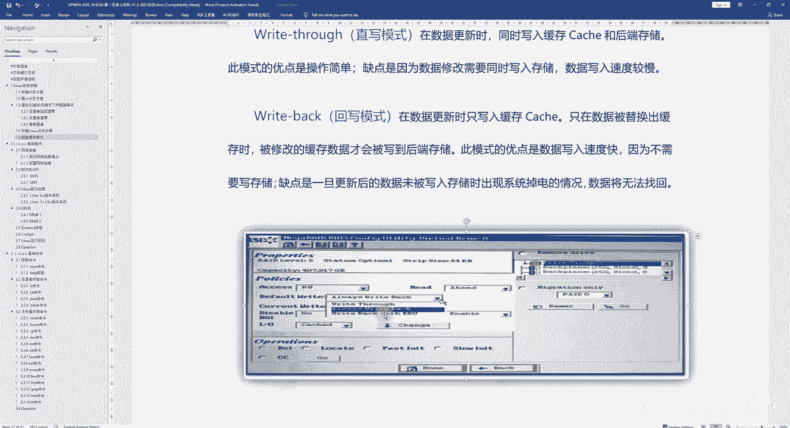

啊，这边我也会个注意是吧？如果我们的小伙伴是在做一些传统的IT服务的服务器的实施项目，在配置本地的瑞的智列卡的时候，可能会经常碰到这两种模式。那么我们建议是什么呢？

建议是通过r through这种模式啊，这个大家要注意啊。

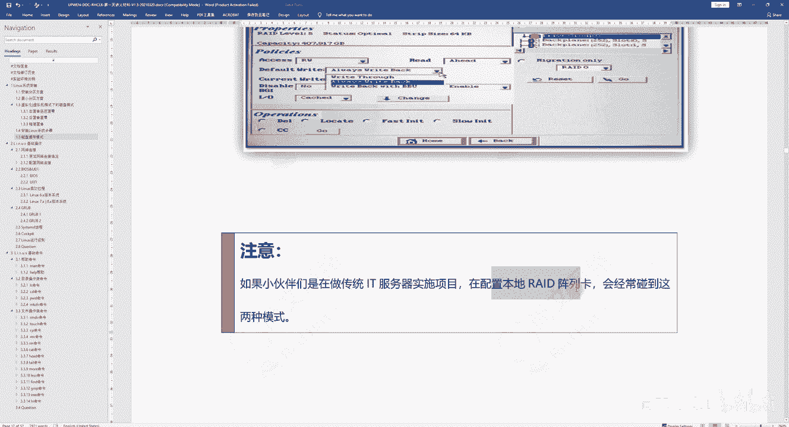

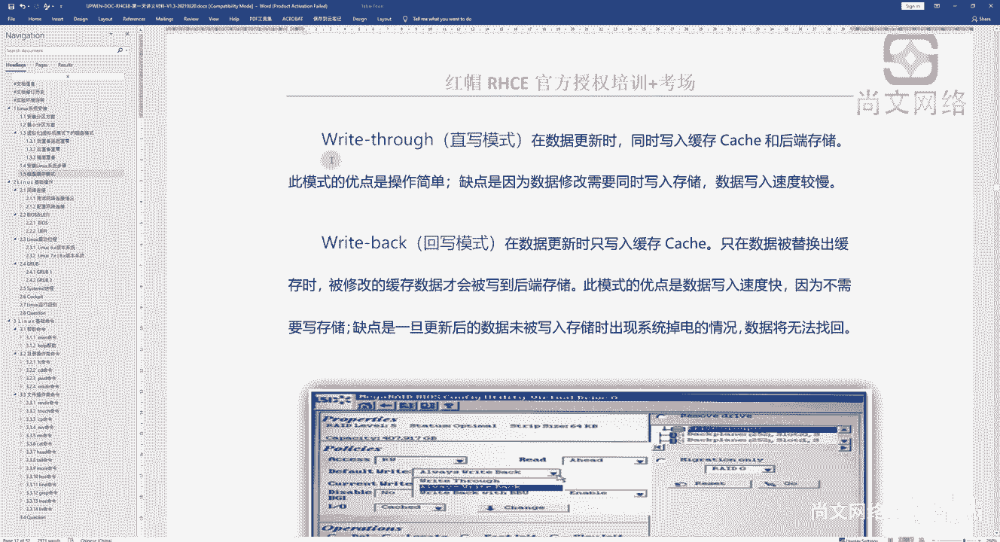

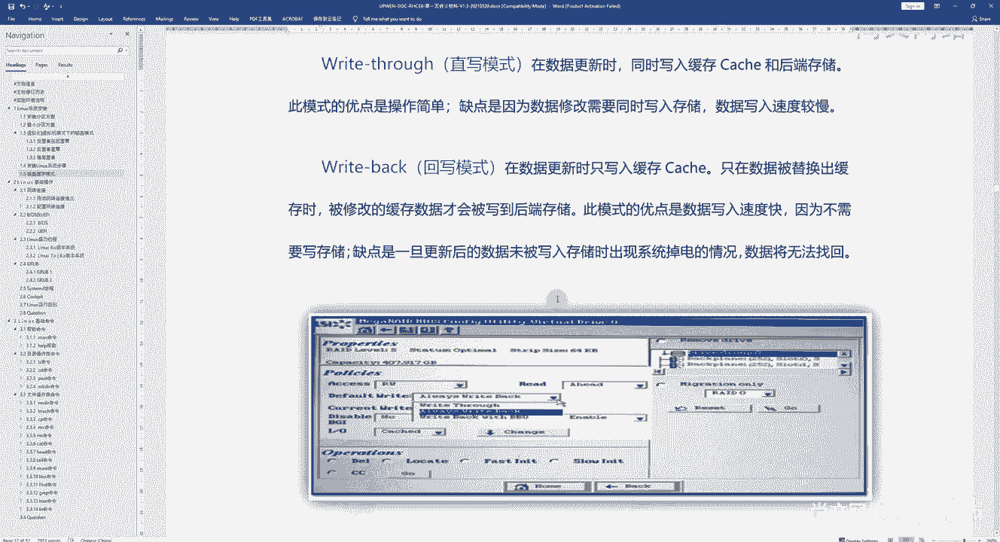

好，那么在你的操作系统里面也是一样的对吧？当你一一启动或重启操作系统之后，这个地方就会有了是吧？你看这个地方还有个叫SDA看到了吧啊，SDA那肯定是一块盘了，对吧？你这块盘有可能是什么呢？

有可能就是服务器里面对吧？咱们说过了，对吧？你这个服务器可能下面会有底层的话可能会有三5块盘，然后传出来这么一个这个逻辑盘，对吧？叫叫DV下来SD啊，就是它的底层已经做了这个read。

那么在做read的时候，我们可能会要接触到这个这个磁盘的缓存模式，对吧？就两种readd和read back啊，我们更推荐的是什么？是这个这个read啊这种模式。啊red素这种模式啊。好。

那关于磁盘和缓冲模式啊，我们就我们就介绍到这儿啊，大家要注意啊，是两种模式是吧？一个是。

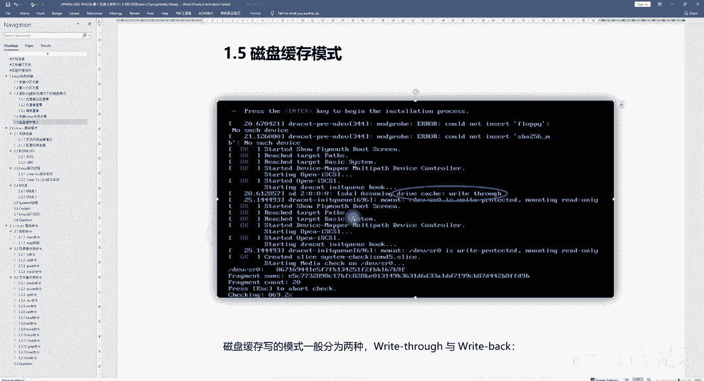

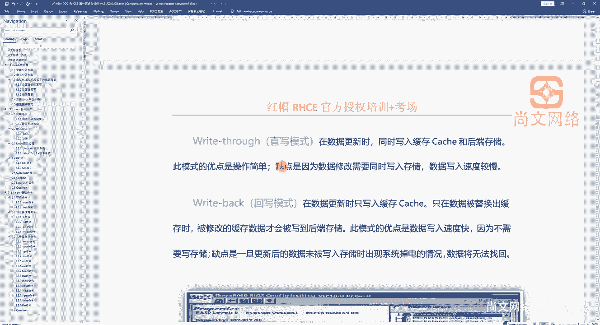

s的一种是back啊。

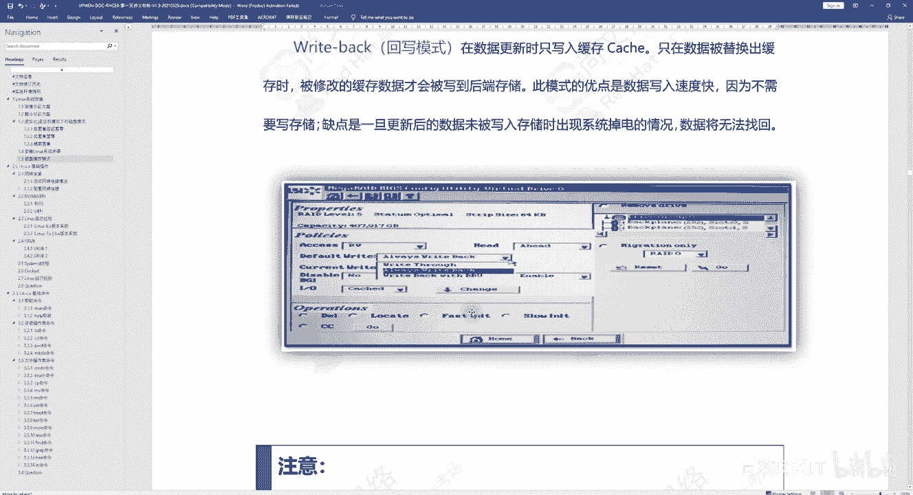

哦。