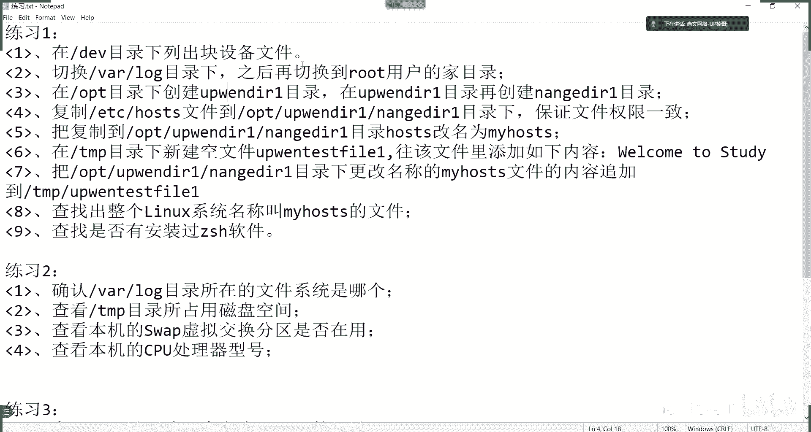
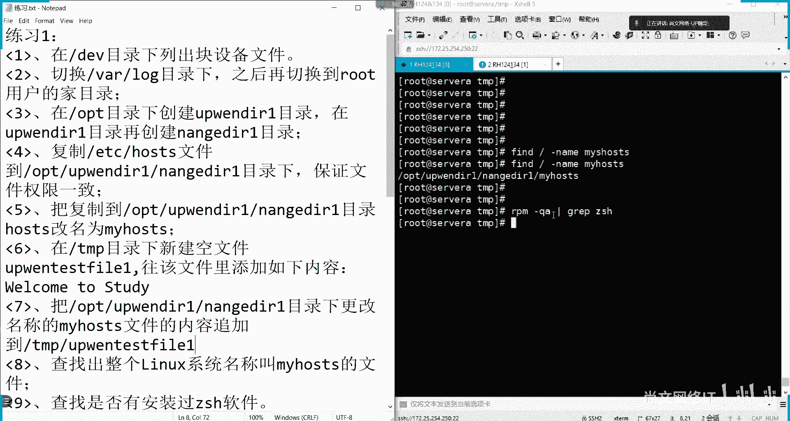
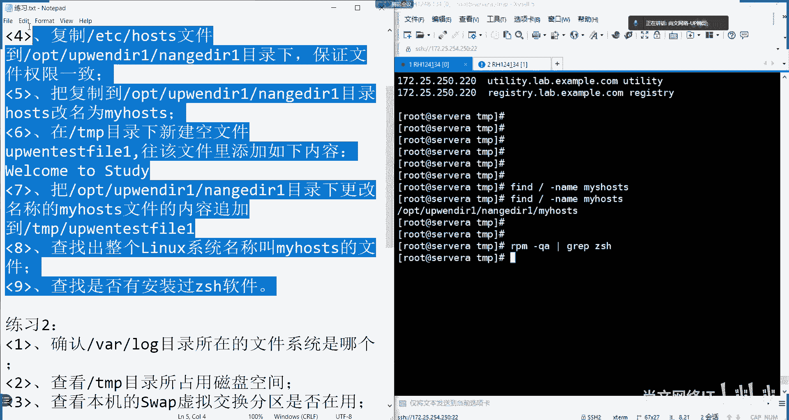
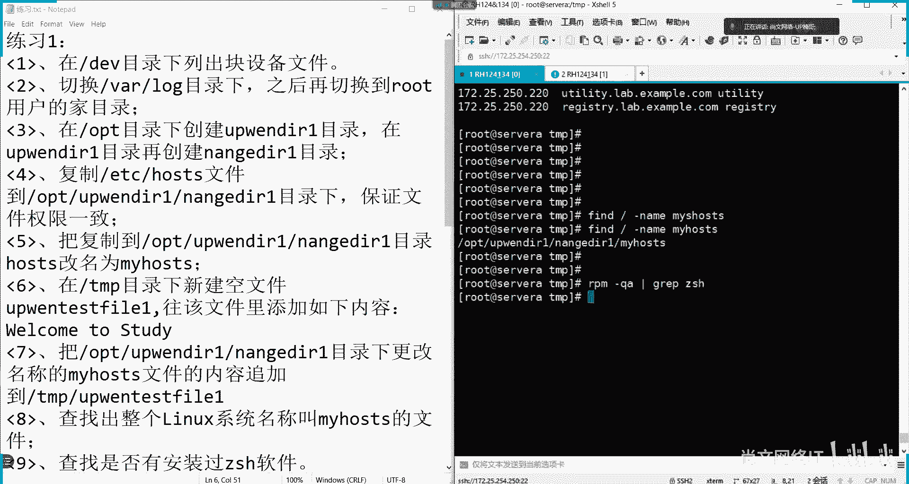

# Linux基础操作：01：文件与目录管理实战



在本节课中，我们将学习一系列基础的Linux文件与目录操作命令。通过完成一个综合练习题，你将掌握如何列出设备、切换目录、创建文件与目录、复制文件、修改文件名、向文件写入内容以及查找文件等核心技能。

---

## 1. 列出块设备文件

首先，我们需要在 `/dev` 目录下找出所有的块设备文件。块设备文件通常以字母 `b` 开头。

**操作命令**：
```bash
ls -l /dev | grep ^b
```
**命令解析**：
*   `ls -l /dev`：以长格式列出 `/dev` 目录下的所有内容。
*   `|`：管道符，将前一个命令的输出作为后一个命令的输入。
*   `grep ^b`：`grep` 命令用于筛选文本，`^b` 表示匹配所有以字母 `b` 开头的行。

执行此命令后，屏幕上将显示 `/dev` 目录下所有的块设备文件列表。

---

## 2. 切换工作目录

上一节我们列出了系统设备，本节中我们来看看如何切换工作目录。题目要求先切换到 `/var/log` 目录，再切换回 root 用户的家目录。

以下是操作步骤：
1.  使用 `cd` 命令切换到 `/var/log` 目录。
    ```bash
    cd /var/log
    ```
2.  使用 `cd` 命令切换回 root 用户的家目录。在 Linux 中，`~` 符号代表当前用户的家目录。
    ```bash
    cd ~
    ```
    或者直接使用：
    ```bash
    cd
    ```

---

## 3. 创建嵌套目录

现在，我们需要创建一个嵌套的目录结构。要求在 `/opt` 目录下创建 `updir21` 目录，并在其内部再创建 `nange21` 目录。

**操作命令**：
```bash
mkdir -p /opt/updir21/nange21
```
**命令解析**：
*   `mkdir`：创建目录的命令。
*   `-p`：参数确保能创建多级目录（即父目录不存在时一并创建）。
*   `/opt/updir21/nange21`：指定了要创建的完整目录路径。

执行后，就成功创建了 `/opt/updir21/nange21` 这个嵌套目录。

---

## 4. 复制文件并保持属性

接下来，我们需要将 `/etc/hosts` 文件复制到刚刚创建的 `/opt/updir21/nange21` 目录中，并且要求保持文件原有的所有属性（如权限、时间戳等）。

**操作命令**：
```bash
cp -p /etc/hosts /opt/updir21/nange21/
```
**命令解析**：
*   `cp`：复制文件的命令。
*   `-p`：参数表示在复制时保留文件的原始属性（包括所有者、组、权限和时间）。
*   `/etc/hosts`：源文件路径。
*   `/opt/updir21/nange21/`：目标目录路径。

复制完成后，可以使用 `ls -l` 命令对比源文件和目标文件的属性，确认它们完全一致。

---

## 5. 重命名文件

文件复制完成后，我们需要将其重命名。将刚刚复制到 `/opt/updir21/nange21/` 目录下的 `hosts` 文件改名为 `myhosts`。

**操作命令**：
```bash
mv /opt/updir21/nange21/hosts /opt/updir21/nange21/myhosts
```
**命令解析**：
*   `mv`：移动或重命名文件的命令。当源路径和目标路径在同一目录下时，其功能就是重命名。
*   `/opt/updir21/nange21/hosts`：原文件路径。
*   `/opt/updir21/nange21/myhosts`：新文件路径。

---

## 6. 创建文件并写入内容

本节我们将学习创建空文件和向文件写入内容。首先，在 `/tmp` 目录下创建一个名为 `up_test_file1` 的空文件。

**操作命令**：
```bash
touch /tmp/up_test_file1
```
**命令解析**：
*   `touch`：命令的主要功能是更新文件的时间戳。如果文件不存在，则会创建一个新的空文件。

创建空文件后，需要向其中写入一行文本：“Welcome to study”。

**操作命令**：
```bash
echo "Welcome to study" > /tmp/up_test_file1
```
**命令解析**：
*   `echo “Welcome to study”`：`echo` 命令用于输出字符串。
*   `>`：重定向符号，将命令的输出内容写入到指定文件中。**注意**：单个 `>` 会覆盖目标文件的原有内容。

此时，`/tmp/up_test_file1` 文件的内容就是 “Welcome to study”。

---

## 7. 向文件追加内容

上一节我们向文件写入了内容，本节我们学习如何向已有内容的文件尾部追加新内容，而不覆盖原有内容。需要将 `/opt/updir21/nange21/myhosts` 文件的内容，追加到 `/tmp/up_test_file1` 文件的末尾。

**操作命令**：
```bash
cat /opt/updir21/nange21/myhosts >> /tmp/up_test_file1
```
**命令解析**：
*   `cat /opt/updir21/nange21/myhosts`：`cat` 命令用于查看文件内容，这里会输出 `myhosts` 文件的全部内容。
*   `>>`：追加重定向符号，将输出内容添加到指定文件的末尾，而不会清空原文件。

执行后，使用 `cat /tmp/up_test_file1` 查看，可以看到文件包含两部分：第一行是 “Welcome to study”，后面是 `myhosts` 文件的内容。

**核心概念对比**：
*   `command > file`：覆盖写入，清空原文件后写入新内容。
*   `command >> file`：追加写入，在文件末尾添加新内容。

---

## 8. 查找指定文件

有时我们需要在系统中寻找某个特定文件。这里要求在整个文件系统中查找名为 `myhosts` 的文件。

**操作命令**：
```bash
find / -name myhosts
```
**命令解析**：
*   `find`：强大的文件查找命令。
*   `/`：指定搜索的起始路径为根目录，即搜索整个系统。
*   `-name myhosts`：指定查找条件，按文件名精确匹配 `myhosts`。

命令执行后，会列出所有找到的名为 `myhosts` 的文件及其完整路径。

---

## 9. 查询软件包是否安装

最后，我们来检查系统中是否安装了某个特定的软件包，例如 `zsh`。

**操作命令**：
```bash
rpm -q zsh
```
**命令解析**：
*   `rpm`：Red Hat 系列的包管理工具。
*   `-q`：查询（query）参数。
*   `zsh`：要查询的软件包名称。

如果系统已安装 `zsh`，命令会显示其完整的包名和版本号。如果未安装，则不会有任何输出或提示未安装。



---

## 总结



本节课中我们一起学习了 Linux 基础文件操作的完整流程。我们练习了：
1.  使用 `ls` 和 `grep` 筛选列出块设备。
2.  使用 `cd` 命令切换工作目录。
3.  使用 `mkdir -p` 创建多级嵌套目录。
4.  使用 `cp -p` 复制文件并保留属性。
5.  使用 `mv` 命令重命名文件。
6.  使用 `touch` 创建空文件，并使用 `echo` 和重定向符 `>` 向文件写入内容。
7.  使用 `cat` 和追加重定向符 `>>` 向文件追加内容。
8.  使用 `find` 命令在文件系统中查找特定文件。
9.  使用 `rpm -q` 查询软件包的安装状态。



通过这一系列练习，你应该对 Linux 下常用的文件和目录管理命令有了初步的掌握。多加练习是熟悉这些命令的最佳途径。