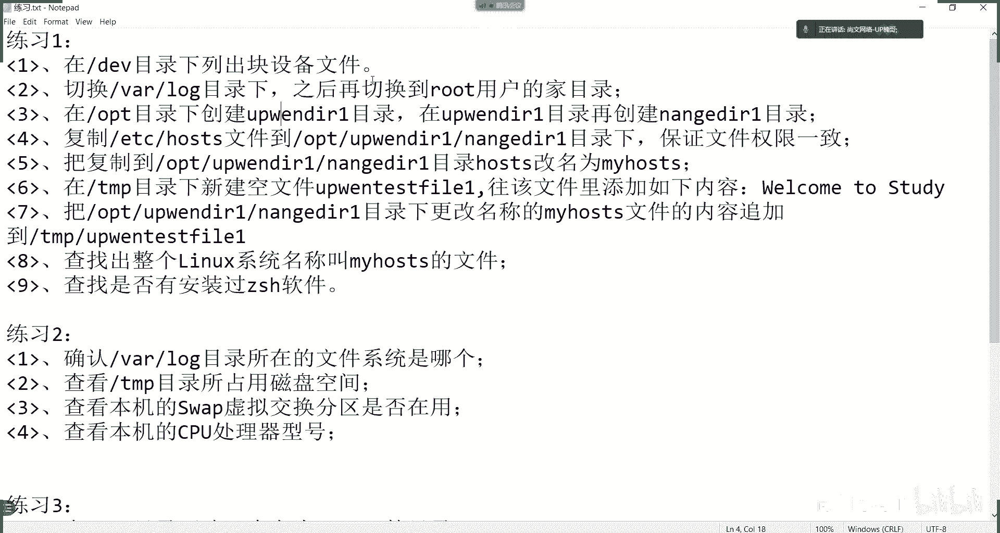
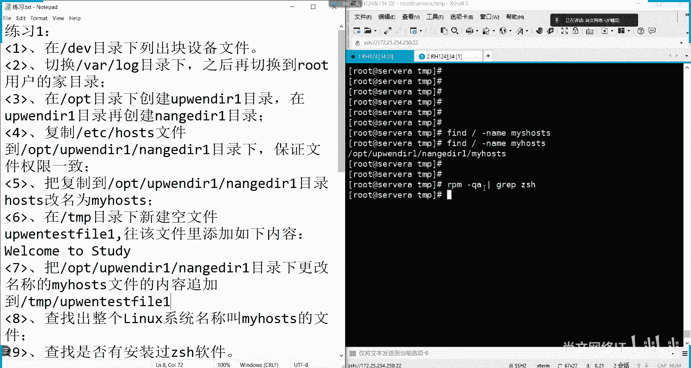
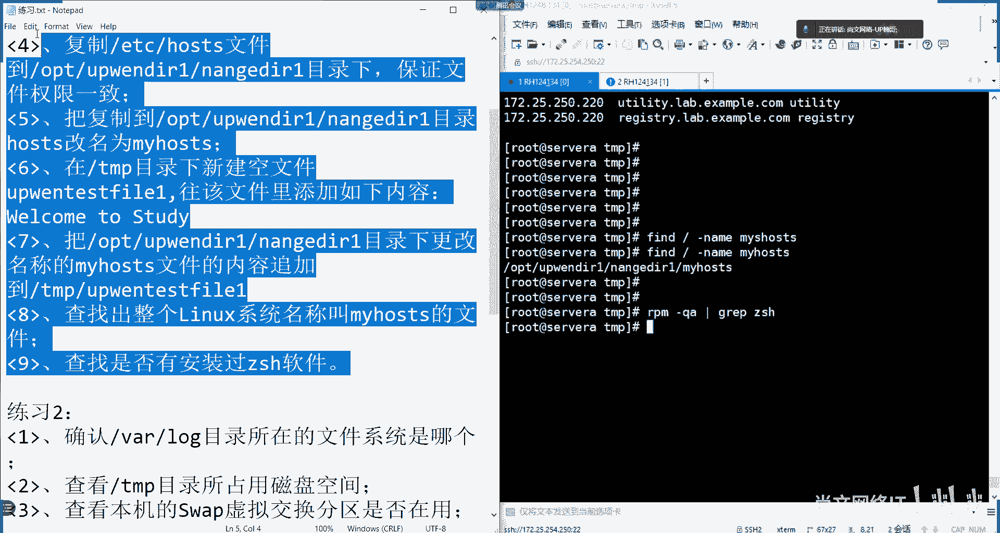
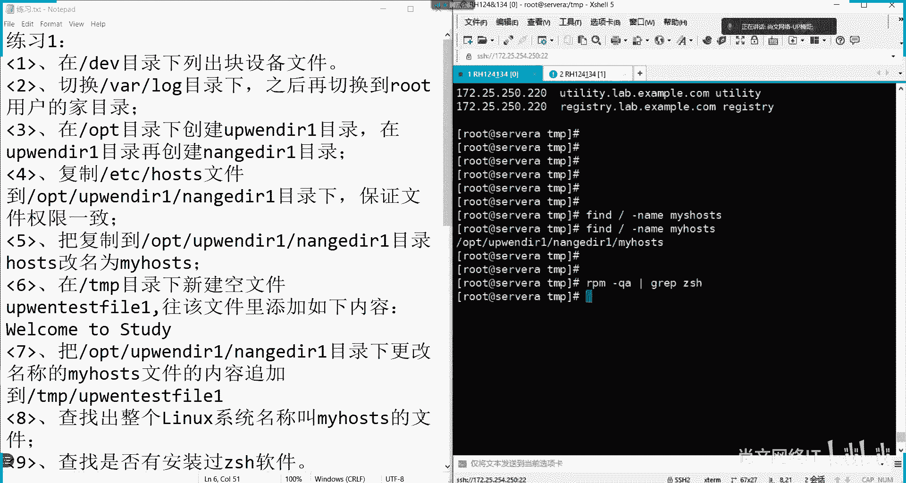

# 【尚文网络】【红帽认证】【最新RHCE专项题库讲解】RHCE8-09.练习1题目讲解 - P1 - 尚文网络IT - BV15c411P7S5

第一个这个在dev目录下列出这个块设备文件，列出块设备文件是吧，这个东西怎么搞啊，块设备。

这东西怎么搞，14，在第一幕下列出块设备嗯，列出块设备的话，是不是只是列出这个b开头了是吧，咱上午数学讲过了是吧，这个东西应该是ios杠啊，杠什么呢，杠这个a r t是吧啊，或者是l是吧。

或是l l那个叫什么叫dv是吧，然后空格shift加那个反斜杠，就是管道符的内容是吧啊，shift加上反斜杠，然后去grape，然后是用shift加六是吧，应该是那个b啊。

这样的话是不是就应该就列出来了对吧，就列出来了啊，列出来了这个dv目录下所有的块设备，这是第一个啊，大家也讲过，第二个呢是切换我们这个vlog对吧，切换我们这个vlog目录下。

然后之后呢你在切换到root用户的家目录，这很显然就cd了呗是吧，就cd命令是我们先cd到，这是第一个，然后第二个什么呢，是不是cd到波浪号就可以了对吧，c到波浪号就可以对他一开始先切换到vlog。

然后之后你在vlog这个五下面，再切换到这个加五路上啊，这是第二个，然后再往下是什么呢，在这个目录当中，我们新建一个up分d21 ，在d21 里面又新建一个男歌d21 ，递归吧是吧，mad 2减p是吧。

在o b t目录下面创建一个叫阿文d21 ，先等会儿看一眼啊，l o p t有没有啊，有这把线先把它删掉啊，我是第一导是吧，一般是e然后r m减2f就可以是吧，然后up文那个d21 啊。

好然后我们再随便切换了一个目录啊，我们是通过mad 2这个变量对吧，减p然后是o p t这个目录，然后先创建一个up文d21 这个目录对吧，创建出来之后粘贴啊，然后再来他后面是不是应该叫在这个目录后面。

再继续创一个叫南歌d r e是吧，男歌d r e预测，这样就行了对啊，这样就行了啊，创建连续创建两个目录就可以了啊，这样就可以了啊，是吧，这几个其实不难，然后复制etc下面后续的s到南哥d21 。

这个录像，然后要保证权限一致，既然已经很明确说这个权限的问题，是不是一定要有个p的参数对吧，一定有p的参数，我们要用这个什么呢，用这个cp减p一定要有p的参数，或者说那个a是不是也带p的意思。

a是不是就等于dpr对吧，链接，然后全员复制那个如果是目录的话对吧，我们就递归到目录里面，就是那么他说是把host的s这个文件，那我们就不需要a了对吧，也不需要r了啊，用个p就可以是吧。

那个etc后置的s，我们把它复制到o p t up d21 ，然后是南哥第二一，这个目标就这样来做就可以了就可以了是吧，我们同时去看一眼l s杠l或者l l。

那个etc host的s i f l l o p t a d r e，然后南哥第二一项目当中的那个后置的s，我们做一个比对，你看这俩是不是前面这些内容都很都是一致的，看到没有，是不是都是一致了对吧。

权限数组数组包括一些大小，包括这个时间上的问题，因为我们用p的参数了，所以说它保证了权限的一致了，但你如果说这个时候再去cat啊，或者是v i或者什么这个地方肯定就变了对吧，就变了。

所以这就是p的一个作用，这道题对吧，就这样来做是不是很简单啊，然后这个什么呢，把我复制过来的这个名字，我们就复制过来这个文件，后来s这个文件我们给他改个名对吧，给他改个名叫my hol啊。

这个是不是就很简单了对吧，cd到o p t up d21 ，然后是蓝哥对吧，第二一，这么一个host是不是直接用mv命令就可以了，然后叫my host s就可以了对吧。

改个名叫my hoes的原型叫holi，是从etc目录下copy过来的，copy过来了之后，我给他改个名叫my holi好，然后，下面的话是什么呢，下面是这个啊，在tnt目录下去新建一个空文件了。

这个东西叫up n test fail一啊，那我们就cd到tnp啊，是不是要touch命令对吧，touch命令创建一个空文件，它要求是空文件，所以我们用touch命令创建，创建完了之后呢。

我们要把这个文件里面写上如下的内容，是要往里面写上如下的内容啊，这个内容呢，我们怎么去添加内容，有一个命令啊，咱们上午没说过啊，就是具体你把这些内容放到这个文件里面，我们可以用一个命令叫echo。

叫一次，一首叫icon这个名对吧，然后呢后面我们用双引号，我们把它要添加进来的这些内容，我们把它放到这个双引号的，看到没有双引号对吧，把这些内容我们把它放在双引号里面，然后我们用一个接口号。

或者说两个接口都可以，然后把它追加到哪了，追加到up and test file一当中，啊加到这里面，这样的话我们cat一下up test file 1。

这里面的内容是不是就从welcome to study对吧，哎我们用echo也说，通过这个echo呢，我们把这里面的字符串的里面的内容，然后把它放到了这个文件上，你看了一下就ok了，对吧啊。

这个题我们就这样来做开口的方式，下面这道题是把o p t它这个目录下的内容，就是把南哥第二页下my host s的内容，追加到我们刚才创建的这个空文件里面，是吧啊，追加到啊，这个这个内容既然是追加的话。

把它里面的内容，我们上一上午是不是说了个cat是吧啊，你用那个cat这个o p t up n d r1 ，然后是南哥第二一下尾动作的my host s，你原你直接回车的话，是不是看它的内容。

但是我们要把这个文件的内容，追加到这个文件里面，那么我们这个up文pass的file 1，现在是不是已经本身就有了一个东西叫welcome to study，你要去追加的话。

是不是应该要保证这个welcome to study不被冲掉，所以我们会考虑用什么东西啊对吧，我们是不是应该用两个尖括号，就是右边的两个尖括号对吧啊，离右边两个镜头把它放到哪了。

放到tm p下面中的up n test file e回车啊，不要用一个角号，用两个性号，那我们这时候去cat test，up的past fell以，大家会看到了这个文件的内容其实分两部分。

第一部分是我们刚才通过echo，追加进来的这个内容，那么第二部分就是那个my host s里面的内容，看到了吧，是不是包含两部分对吧，两部分啊啊两部分啊，那么也就是说一个尖括号，两个监控号。

你你就自然就想到一个监控号是什么意思啊，就是你的这个文件内容，无论你的文件里面有什么内容，我就一个电话号全部给干掉了，就是相当于什么呢，覆盖了是吧，那两个减号是什么，就是在对追加r。

就在这个文件的最后一行开始对吧，进行追加对吧，好，这是两个啊，一个尖括号和一个两个减号的作用，下面这个是要查找出整个linux系统文件，系统名称叫my host这个文件啊，就这么个文件。

这个文件呢这个我们可以用find命令，find命令我们看的是整个文件对吧，整个文件因为是根对吧，然后杠我加上杠name的这么一个参数啊，比如说叫my hol好，我就用这个东西来进行输入。

这个地方多了个s my host s，你看这样一搜的话，是不是就搜出来了一个文件，就叫my host s在哪儿，我们刚才做了这个操作，南哥第二一项什么mhz来说对吧啊，在这上面去找啊。

我们通过find在根目录下我去找下一个条件，叫杠name，什么名字，my host s，这个地方要注意的就是他搜的时候啊，就是这个搜出来的这个文件名，正正好好，它就叫my host s。

你如果说是麦克斯的一，它不一定能翻搜出来，你需要加一些什么通配符啊，明白吧，加一同比符，这东西是我们用find命令把它搜出来啊，好下面的话是什么呢，查找是否有安装过js，是这么一个软件。

我们在上午结束之前用到一个命令叫ipm是吧，ip m r p m gq a q是什么呢，query就是这个就是q u e r y，query是查询的意思对吧，杠q然后a是什么。

就是all所有的通过我们什么呢，zs h啊，看有没有装过啊，没有输出，没有结果的话就说明没装对吧，就没装啊，你看就这一道题，就通过这些题的练习，我们就把什么呢，就把咱们这个上午这些一些基本的文件类的。

目录的一些操作命令程度差不多了是吧。

差不多了啊，这个再花个十分钟练习一下是吧啊，我把这个什么呢，把这个给大家发一下，这个这个我做了这个东西log是吧啊，给大家发一下好吧啊，然后咱比着呢啊，不熟没关系啊。

咱咱这个有答案了是吧，现在有答案了，然后十分钟是吧，咱练习一下。

