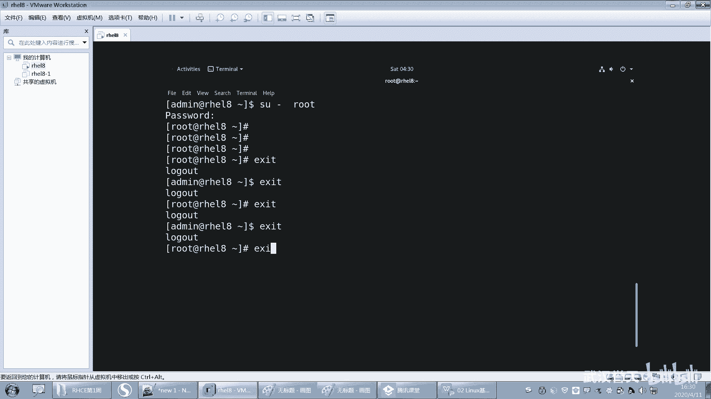
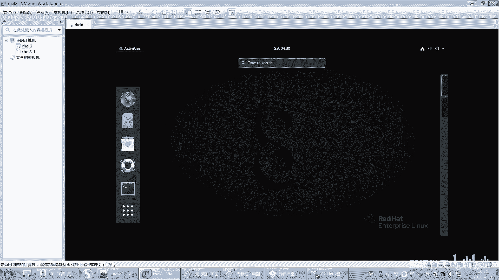
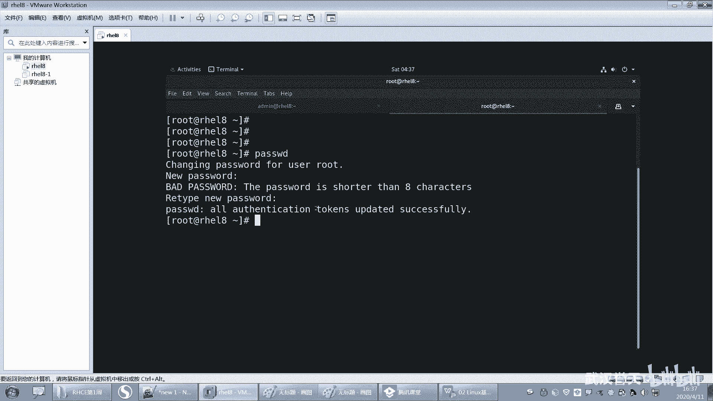
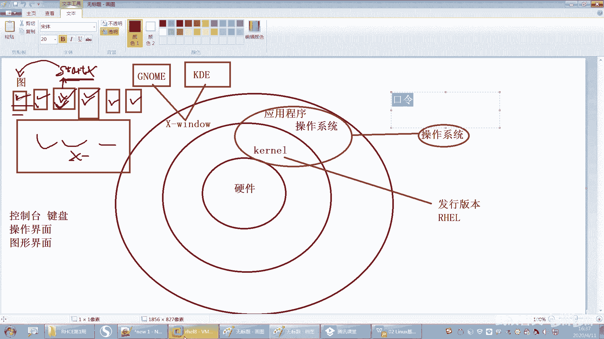
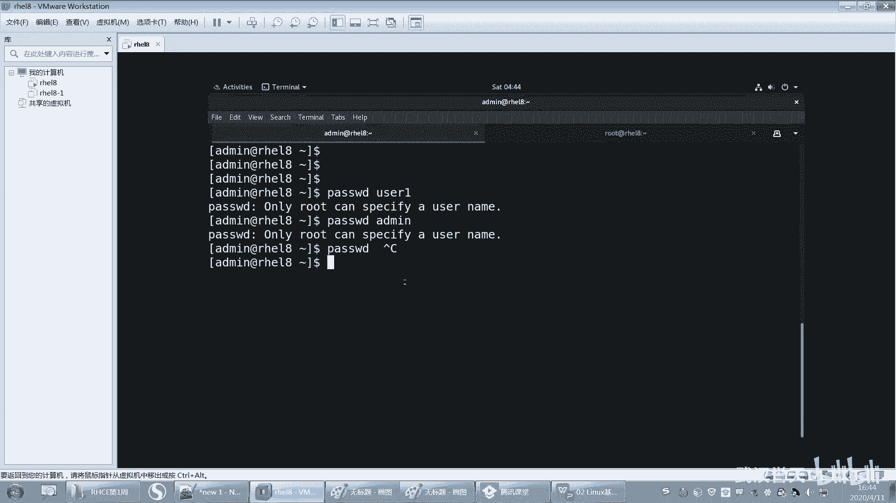
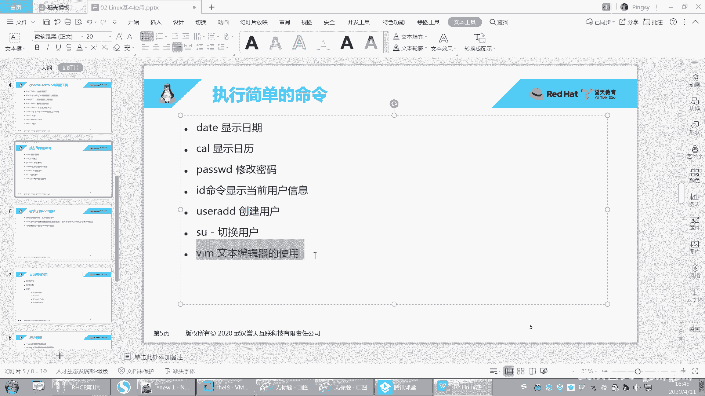
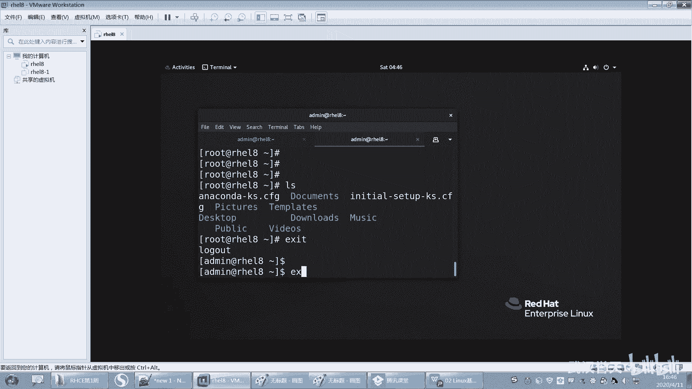

# Linux基础操作：第11章：用户管理与文本编辑入门 🐧

在本节课中，我们将学习Linux系统中的两个核心操作：用户管理和简单的文本编辑。你将学会如何查看用户信息、创建新用户、在不同用户间切换、修改用户密码，以及使用一个基础的文本编辑器来查看和编辑文件。

---

## 用户身份查看与切换 🔄

上一节我们介绍了Linux的基本概念，本节中我们来看看如何管理用户身份。首先，我们需要知道当前是以哪个用户的身份在操作。

**ID** 命令用于显示当前用户或指定用户的身份信息，包括用户ID（UID）、组ID（GID）以及所属的组。

```
id
```





要切换到另一个用户，我们使用 **SU** 命令。这个命令是 `switch user` 的缩写，意为“切换用户”。

以下是切换用户的基本步骤：
1.  输入 `su - 用户名` 命令。**注意**：`-` 符号非常重要，它代表切换用户的同时也切换其完整的环境配置，请不要遗漏。
2.  按下回车键。
3.  如果是从普通用户切换到 `root` 或其他用户，系统会提示你输入目标用户的密码。
4.  密码输入正确后，命令提示符前的用户名会发生变化，表示切换成功。

**重要提示**：`root` 用户切换到任何其他用户时，都**不需要**输入密码。这体现了 `root` 用户的最高权限。反之，普通用户切换到任何用户（包括 `root`）都需要密码。

不建议在同一个终端窗口内反复使用 `su` 命令进行嵌套切换（例如：用户A -> 用户B -> 用户C）。这可能导致权限混乱，使你忘记自己最终处于哪个用户环境。正确的做法是：使用 `exit` 命令退出当前用户回到上一个用户，或者直接打开一个新的终端窗口进行操作。

---

## 创建新用户与密码管理 🔑

了解了如何切换用户后，我们来看看如何创建一个新用户。

使用 **useradd** 命令可以创建一个新的用户账户。命令和用户名之间必须用空格分隔。

```
useradd username
```

创建用户后，新用户默认是**没有密码**的。没有密码的用户无法通过密码认证的方式登录系统（无论是图形界面还是 `su` 命令）。但是，`root` 用户可以直接切换到该用户。

为用户设置或修改密码，我们使用 **passwd** 命令。





以下是修改密码的几种情况：
*   **`root` 用户为自己修改密码**：直接输入 `passwd` 并回车，然后按照提示输入两次新密码即可。
*   **`root` 用户为其他用户修改密码**：输入 `passwd 用户名`，然后按照提示为指定用户设置新密码。此过程**不需要**知道该用户原来的密码。
*   **普通用户为自己修改密码**：输入 `passwd` 并回车，系统会先要求输入**当前密码**以验证身份，验证通过后才能设置新密码。
*   **普通用户为他人修改密码**：**不允许**。普通用户执行 `passwd 其他用户名` 会报错，提示只有 `root` 可以执行此操作。

**密码安全要求**：系统通常要求密码长度至少为8个字符。输入密码时，屏幕上不会有任何显示（无回显），这是正常的安全措施。

---

## 使用Vim编辑器查看与编辑文件 📝

管理用户时，我们经常需要编辑配置文件。接下来，我们介绍一个强大的文本编辑器：Vim。

首先，我们可以使用 **ls** 命令列出当前目录下的文件和文件夹。

```
ls
```

Vim编辑器功能强大但学习曲线较陡。作为初学者，我们首先掌握几个最基本的操作，用于查看和进行简单编辑。

以下是进入Vim和进行基础操作的步骤：
1.  输入 `vim 文件名` 命令打开或创建一个文件进行编辑。
2.  刚进入Vim时，处于**普通模式**（Normal Mode），此模式下按键代表命令，而不是输入文字。
3.  按下 `i` 键，进入**插入模式**（Insert Mode），此时可以像普通编辑器一样输入和修改文本。
4.  编辑完成后，按下 `Esc` 键退出插入模式，回到普通模式。
5.  在普通模式下，输入 `:wq` 并回车，即可保存文件并退出Vim（`w` 表示写入/保存，`q` 表示退出）。

对于初学者，记住 `i`（插入）、`Esc`（退出插入）、`:wq`（保存并退出）这三个关键操作，就能完成最基本的文件编辑任务。

---



## 总结 📚

本节课中我们一起学习了Linux用户管理和文本编辑的基础知识。



我们掌握了：
1.  使用 `id` 查看用户信息，使用 `su - 用户名` 在用户间切换，并理解了 `root` 用户的特权。
2.  使用 `useradd` 创建新用户，使用 `passwd` 命令在几种不同场景下修改用户密码。
3.  使用 `ls` 查看目录内容，并使用Vim编辑器进行文件的打开、简单编辑和保存退出。



这些命令是日常系统管理的基础，请务必多加练习，熟悉它们的使用方法。