# Linux基础教程：第12章：Linux基本使用方法-12

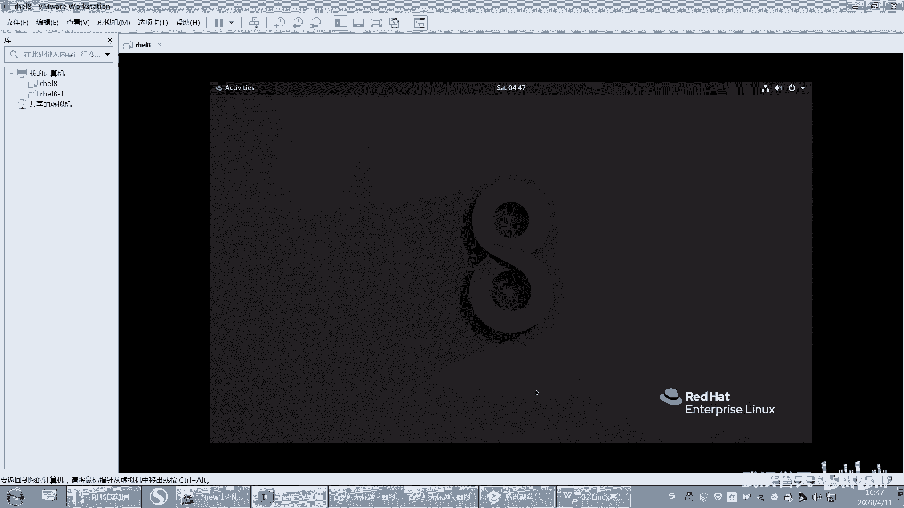

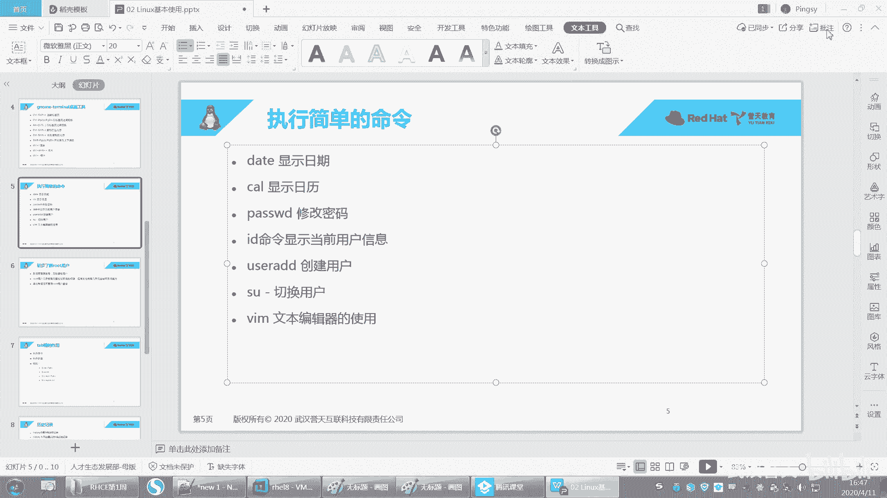

## 概述
在本节课中，我们将学习Linux系统中的几个核心概念和基本操作，包括理解当前工作目录、使用`ls`和`pwd`命令查看目录内容与路径，以及学习使用`nano`和`vim`这两种文本编辑器创建和编辑文件。课程内容旨在帮助初学者建立对Linux命令行环境的直观认识。

---

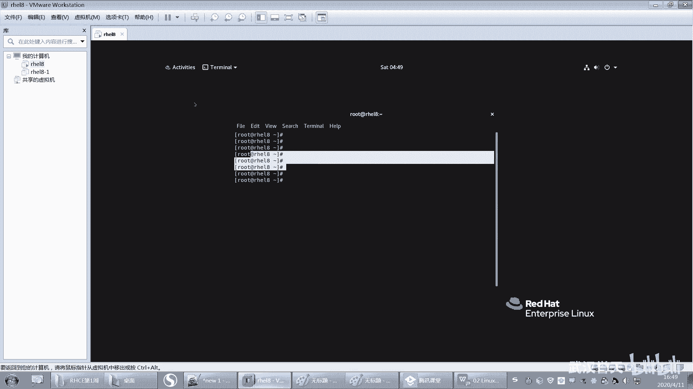

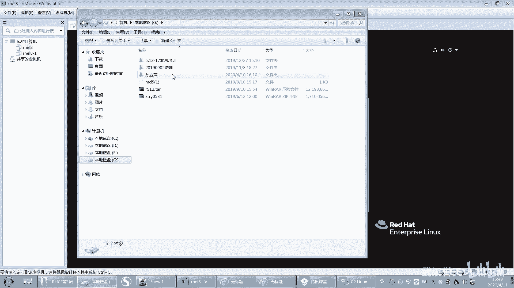

## 理解当前工作目录与桌面
上一节我们介绍了Linux的登录和基本界面。本节中我们来看看如何在命令行中定位自己。

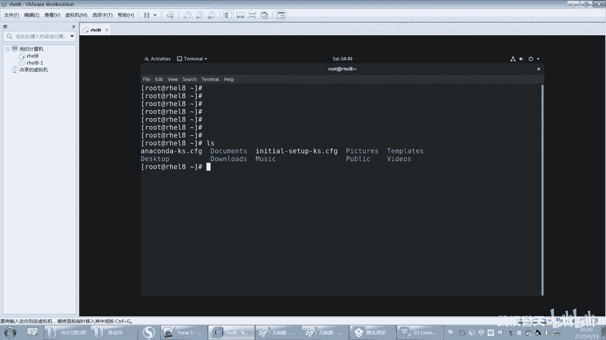

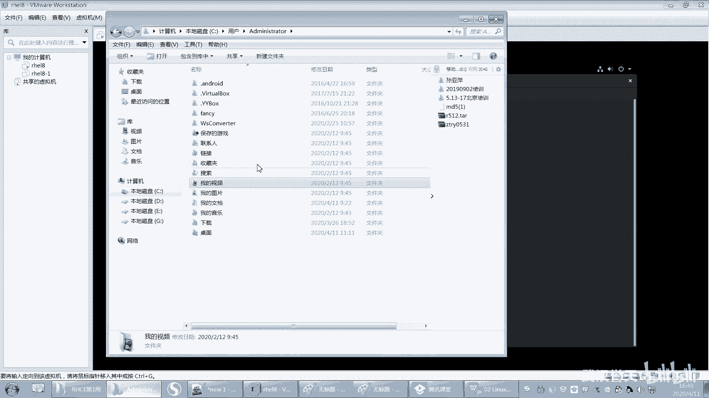

在图形化桌面环境中，桌面本身对应着文件系统中的一个特定目录。例如，在Windows系统中，桌面通常位于`C:\Users\<用户名>\Desktop`路径下。同样，在Linux系统中，桌面也对应一个目录，通常是用户家目录下的`Desktop`文件夹。

无论通过图形界面还是终端打开，你始终位于文件系统的某个目录下。这个目录被称为“当前工作目录”。

---

## 查看当前目录与内容
要了解自己当前位于哪个目录，可以使用`pwd`命令。

**命令示例：**
```bash
pwd
```
执行此命令会输出当前工作目录的完整路径。

要查看当前目录下包含哪些文件和子目录，可以使用`ls`命令。

**命令示例：**
```bash
ls
```
执行`ls`命令会列出当前目录中的所有项目。

---

## 使用文本编辑器创建文件
以下是两种在Linux中创建和编辑文本文件的常用工具。

### 1. 使用Nano编辑器
`nano`是一个简单易用的命令行文本编辑器，适合初学者。

**操作步骤：**
1.  在终端输入`nano`并回车，会打开一个空白的编辑界面。
2.  在界面中输入文本内容。
3.  输入完成后，按`Ctrl + X`组合键尝试退出。
4.  编辑器会询问是否保存更改。按`Y`键确认保存。
5.  接着会提示输入文件名。输入文件名（例如`file1`）后回车，文件即被保存到当前目录。

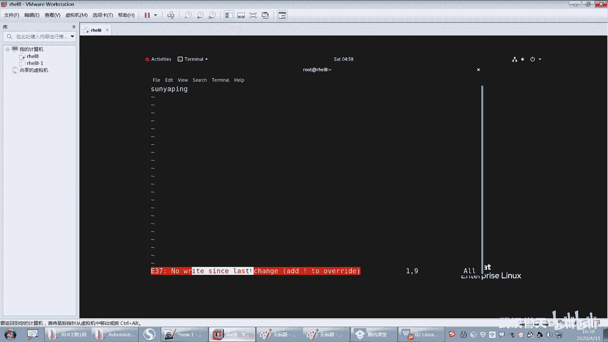

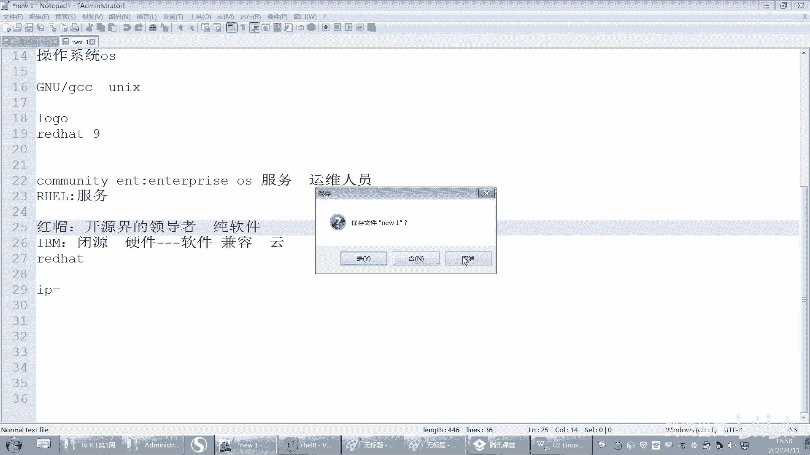

要编辑已存在的文件，可以使用`nano 文件名`命令，例如`nano file1`。

### 2. 使用Vim编辑器
`vim`（或其前身`vi`）是一个功能强大但操作模式稍复杂的编辑器，在Linux系统中被广泛使用。

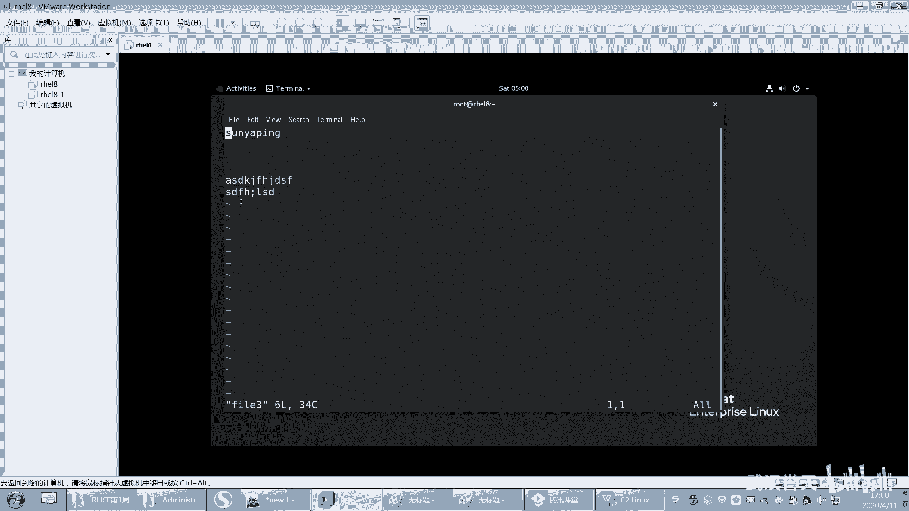

**基本操作流程：**
1.  **打开/创建文件**：使用`vim 文件名`命令，例如`vim file2`。如果文件不存在，vim会新建它。
2.  **进入插入模式**：刚打开vim时处于“普通模式”，无法直接输入文字。按下键盘上的`i`键，进入“插入模式”，此时屏幕左下角会显示`-- INSERT --`，这时可以正常输入文本。
3.  **保存与退出**：
    *   首先按`Esc`键退出插入模式，返回普通模式。
    *   然后输入冒号`:`进入“命令模式”，此时光标会移动到屏幕底部。
    *   输入`wq`（write and quit）并回车，即可保存文件并退出vim。
4.  **不保存强制退出**：如果编辑后不想保存更改，在命令模式下输入`q!`并回车，即可强制退出而不保存。

**核心操作总结：**
*   打开文件：`vim 文件名`
*   进入编辑（插入模式）：按 `i`
*   退出插入模式：按 `Esc`
*   保存并退出：输入 `:wq` 后回车
*   不保存强制退出：输入 `:q!` 后回车

---

## 系统关机与快照
操作完成后，可以关闭系统。常用的关机命令有：

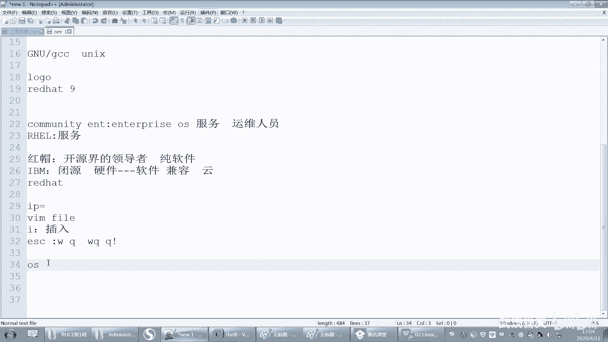

**命令示例：**
```bash
poweroff
```
或
```bash
init 0
```

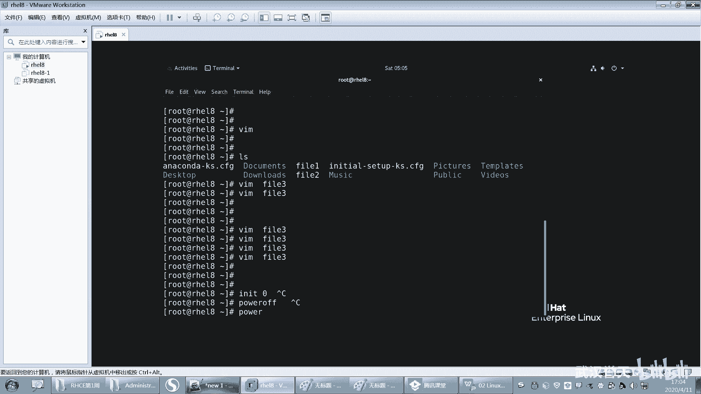

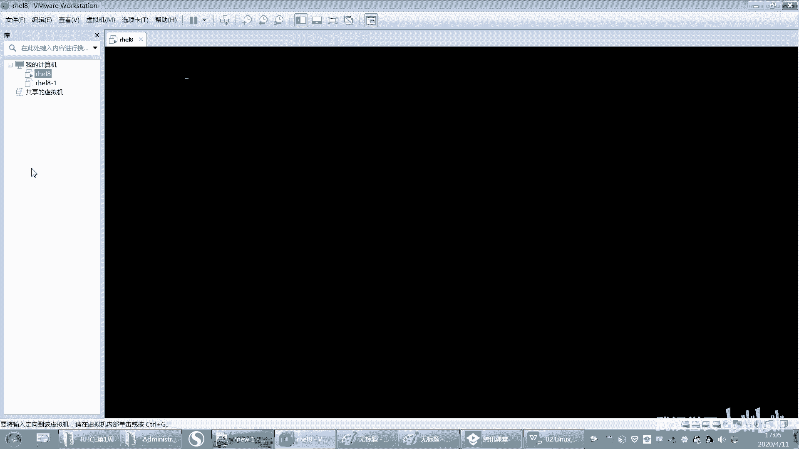

对于使用虚拟机（如VMware）学习的同学，建议在安装配置好系统后创建一个“快照”。快照可以保存虚拟机在某个时间点的完整状态。如果后续操作导致系统出现问题，可以快速恢复到创建快照时的状态，避免了重装系统的麻烦。

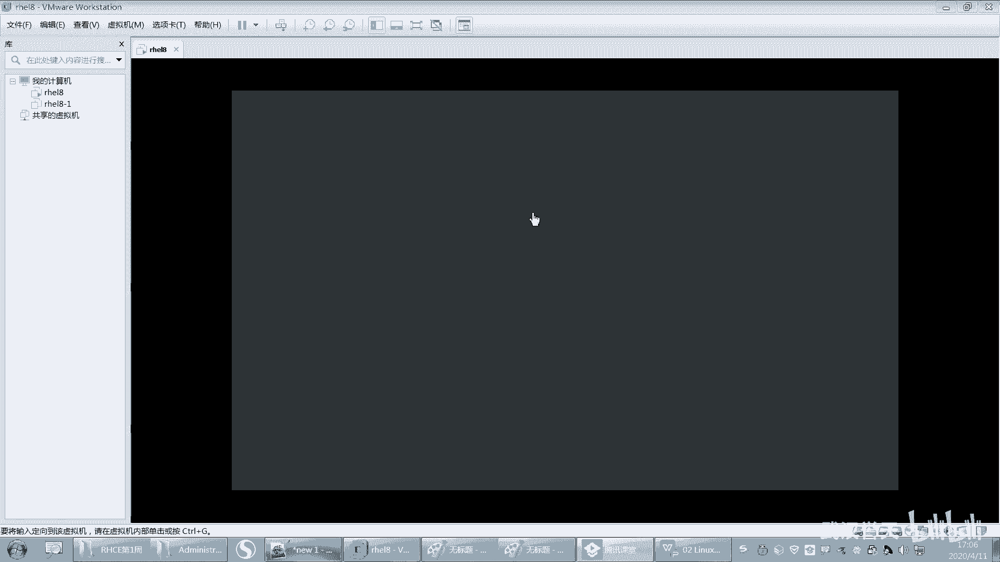

---

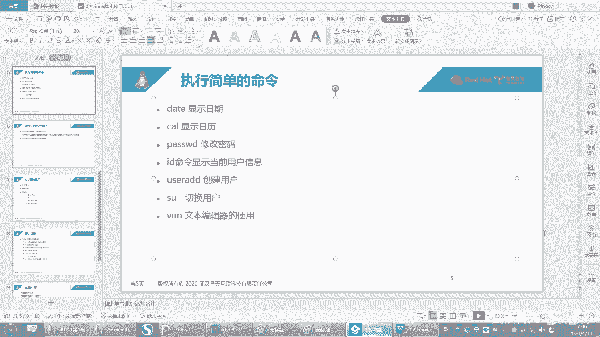

## 总结
本节课中我们一起学习了Linux的几个基础但重要的概念和操作。我们明确了“当前工作目录”的概念，并学会了使用`pwd`和`ls`命令来查看它。接着，我们掌握了使用`nano`和`vim`编辑器创建、编辑文本文件的基本方法，特别是`vim`的三种模式切换（普通模式、插入模式、命令模式）及保存退出的命令。最后，我们了解了系统关机命令以及为虚拟机创建快照的重要性。请务必课后练习这些命令，尤其是`vim`编辑器的基本操作，为后续学习打下坚实基础。