# Linux命令基础：P15：运行命令和获取帮助

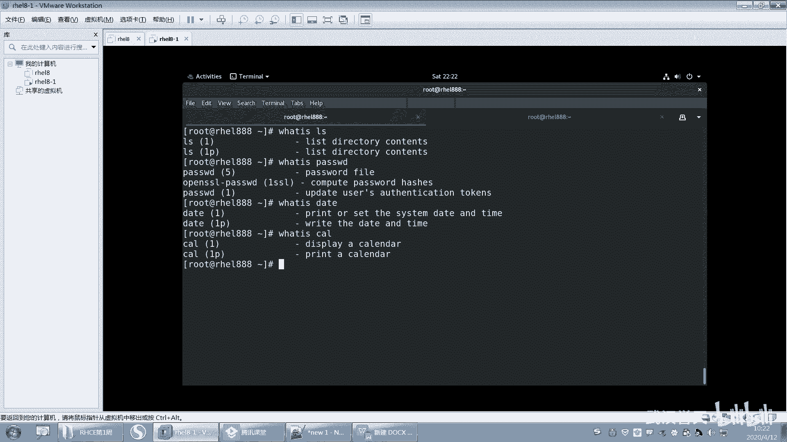

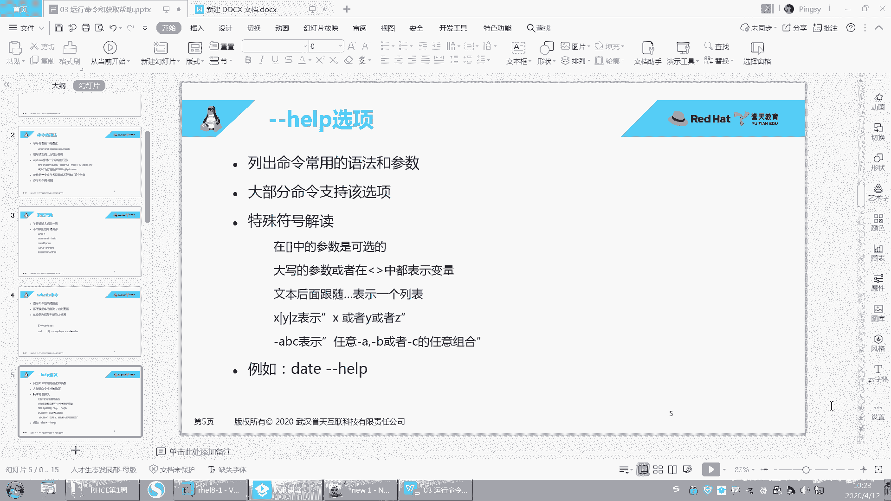

在本节课中，我们将学习如何在Linux系统中运行命令，并掌握几种获取命令帮助信息的方法。这对于初学者熟悉Linux操作环境至关重要。

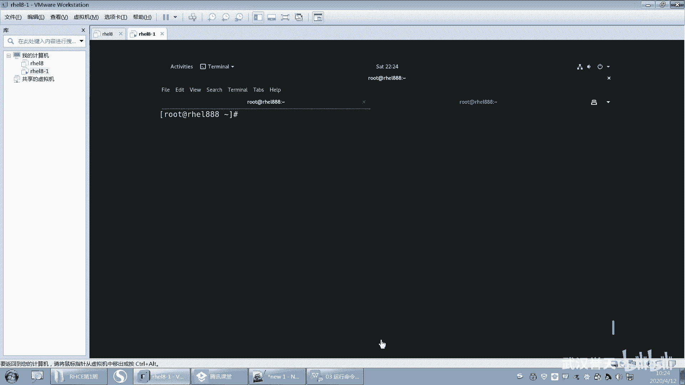

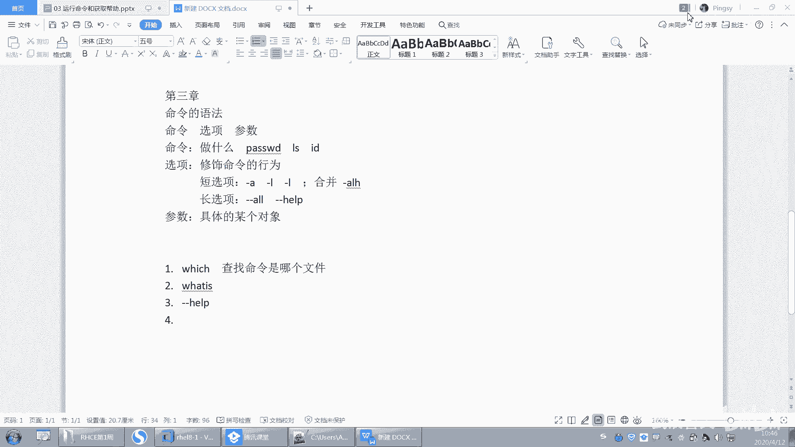

## 命令 `whatis`：显示简短描述

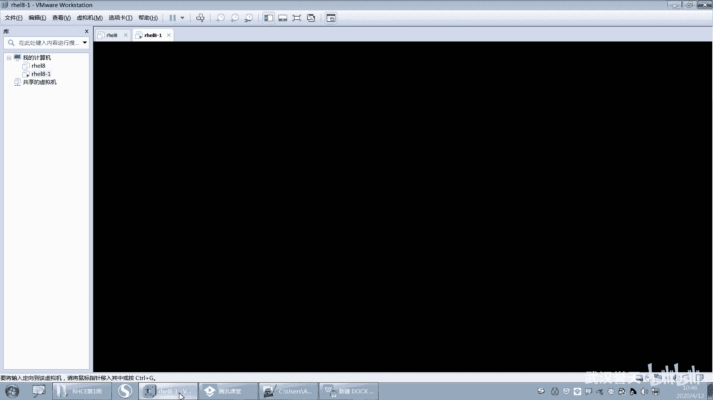

上一节我们介绍了`which`命令，本节中我们来看看`whatis`命令。`whatis`命令用于显示指定命令的简短描述。

例如，要查看`date`和`cal`命令的简要说明，可以执行：
```bash
whatis date
whatis cal
```
`date`命令用于打印或设置系统时间和日期。`cal`是`calendar`（日历）的缩写，用于显示日历。

`whatis`命令基于一个数据库进行查询，该数据库会定时更新（通常在系统空闲时，如凌晨）。因此，新安装的命令可能无法立即通过`whatis`查到。如果需要立即更新数据库，可以手动执行以下命令：
```bash
sudo mandb
```
请注意，更新数据库会消耗系统资源，建议在系统负载较低时进行。

## 命令 `--help`：获取内置帮助

了解了基础描述后，我们可以使用`--help`选项来获取命令更详细的用法信息。大多数命令都支持此选项。

以下是`--help`输出中常见的语法规则说明：
*   **中括号 `[]`**：表示括号内的内容是可选的。
*   **省略号 `...`**：表示前面的参数可以指定多个。
*   **竖线 `|`**：表示“或”的关系，只能选择其中之一。

让我们以`ls`命令为例：
```bash
ls --help
```
输出第一行通常是 **Usage（用法）**，例如：
```
Usage: ls [OPTION]... [FILE]...
```
这表示`ls`命令后可以跟多个可选的`[OPTION]`（选项），也可以跟多个可选的`[FILE]`（文件或目录）参数。

继续向下查看，可以看到各个选项的具体解释。例如：
*   `-a, --all`：不忽略以 `.` 开头的条目（即显示所有文件，包括隐藏文件）。
*   `-A, --almost-all`：不列出 `.`（当前目录）和 `..`（上级目录）。
*   `-h, --human-readable`：与`-l`或`-s`选项一起使用时，以易读的格式（如K、M、G）显示文件大小。

再以`cp`命令为例，其帮助信息展示了不同的语法格式：
```bash
cp --help
```
输出中可能包含：
```
cp [OPTION]... [-T] SOURCE DEST
cp [OPTION]... SOURCE... DIRECTORY
cp [OPTION]... -t DIRECTORY SOURCE...
```
*   第一种格式：将源（`SOURCE`）复制到目标（`DEST`）。
*   第二种格式：将多个源（`SOURCE...`）复制到一个目录（`DIRECTORY`）中。
*   第三种格式：通过`-t`选项，先指定目标目录（`DIRECTORY`），再指定源（`SOURCE...`）。

最后，查看`date`命令的帮助，理解更复杂的参数格式：
```bash
date --help
```
部分输出可能为：
```
date [OPTION]... [+FORMAT]
date [-u|--utc|--universal] [MMDDhhmm[[CC]YY][.ss]]
```
*   `+FORMAT`：用于自定义输出时间的格式，例如`date +%Y`显示年份。
*   设置时间的格式为`MMDDhhmm[[CC]YY][.ss]`，其中：
    *   `MM`：月份（两位）
    *   `DD`：日期（两位）
    *   `hh`：小时（两位）
    *   `mm`：分钟（两位）
    *   `[[CC]YY]`：年份（`CC`为世纪前两位，`YY`为年后两位，`YY`是必须的，`CC`是可选的）
    *   `[.ss]`：秒（可选，两位）
    *   因此，设置时间时至少需要8位数字（`MMDDhhmm`）。

`--help`选项虽然方便，但提供的信息可能不完整，且在纯文本界面中浏览长内容时不便翻页。因此，我们引入功能更强大的帮助工具。

## 命令 `man`：查阅手册页

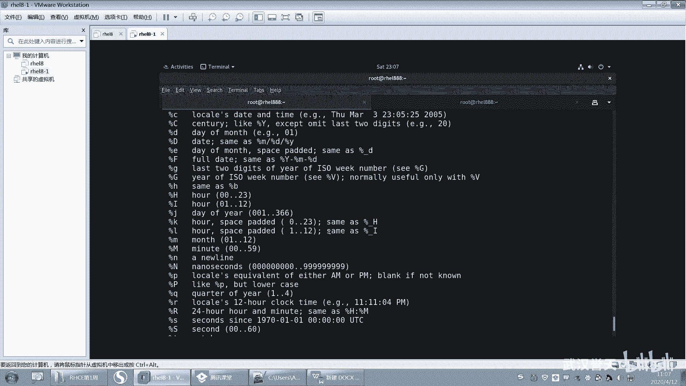

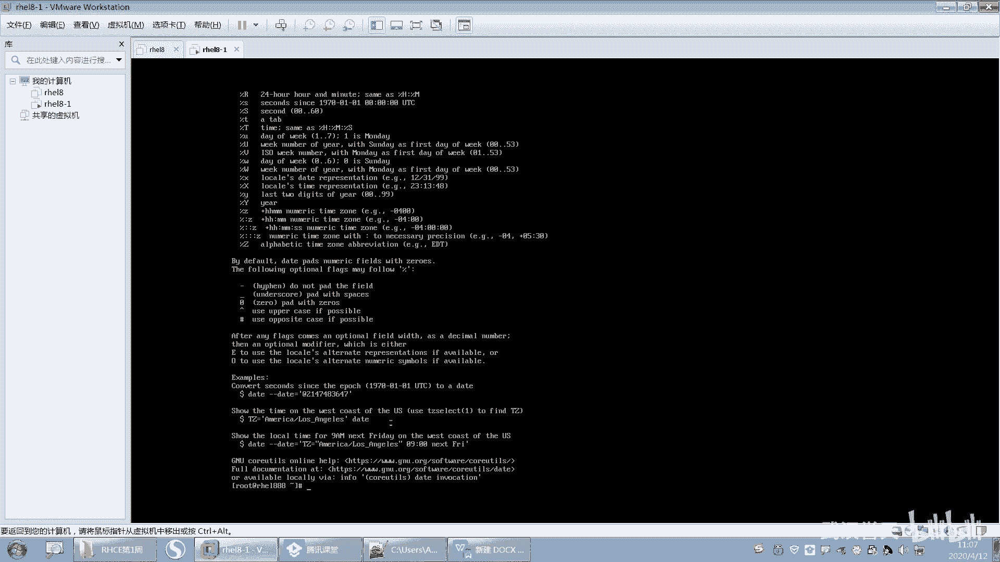

对于需要全面了解的命令，我们可以使用`man`（manual的缩写）命令来查阅其完整的手册页。

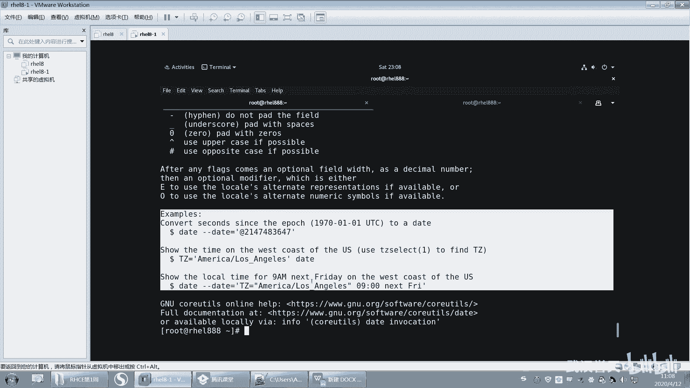

使用`man`命令非常简单，只需在命令后跟上你想查询的命令名即可。例如，查看`ls`命令的手册：
```bash
man ls
```
进入手册页后，可以使用以下按键进行操作：
*   **上下箭头**：逐行滚动。
*   **空格键**或**Page Down**：向下翻页。
*   **Page Up**：向上翻页。
*   **`/`关键词**：搜索指定关键词，按`n`键向下查找下一个，按`N`键向上查找。
*   **`g`**：跳转到手册页首页。
*   **`G`**：跳转到手册页末页。
*   **`q`**：退出手册页。

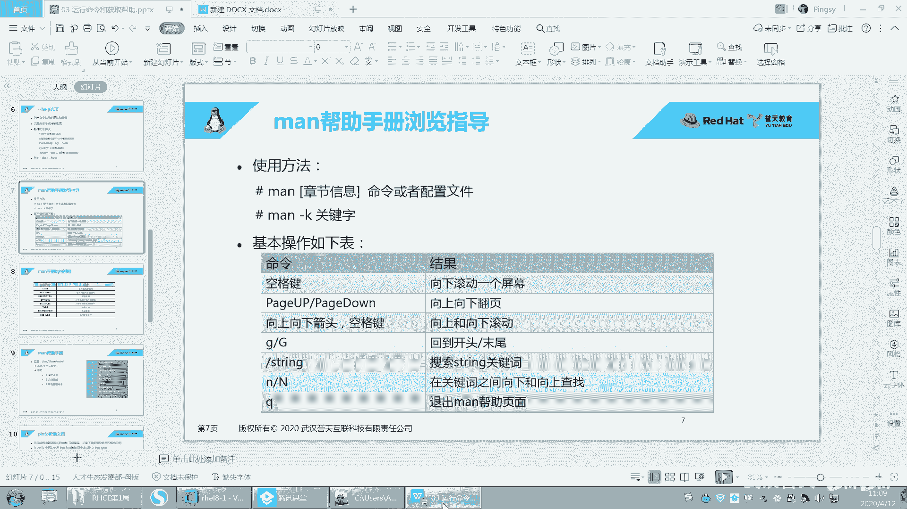

一个典型的`man`手册页包含以下部分：
1.  **NAME（名称）**：命令名称及简要说明。
2.  **SYNOPSIS（概要）**：命令的语法格式。
3.  **DESCRIPTION（描述）**：命令功能的详细描述。
4.  **OPTIONS（选项）**：所有可用选项的详细解释。
5.  **EXAMPLES（示例）**：命令的使用示例。
6.  **SEE ALSO（参见）**：与该命令相关的其他命令或文档。

例如，在`man date`中，你可以在`EXAMPLES`部分找到设置时区、格式化输出等实用例子。在`man passwd`中，`SEE ALSO`部分会列出`login`、`passwd`配置文件等相关主题。

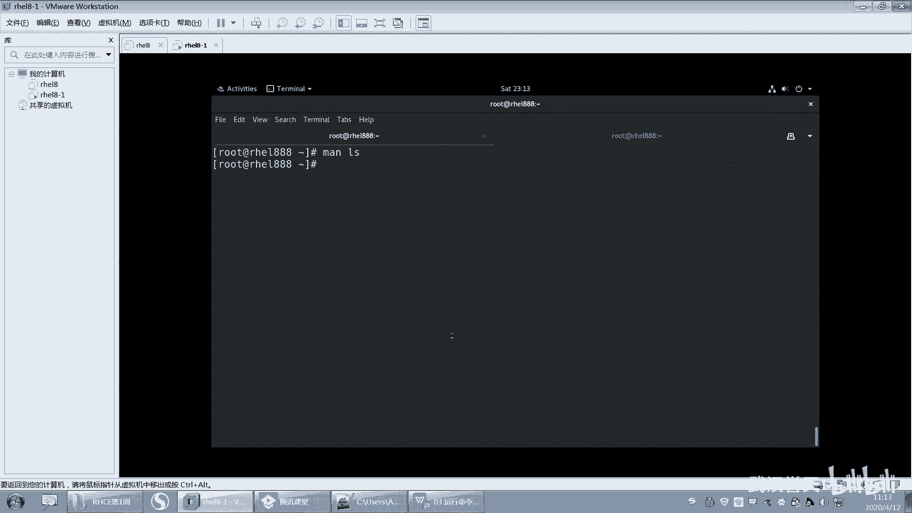

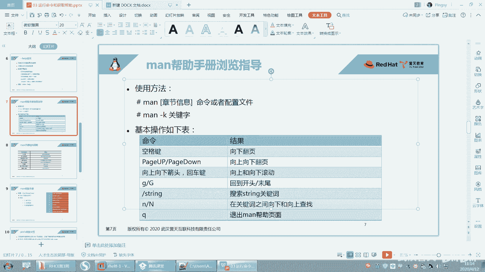

## `man`手册的章节

你可能注意到，在一些命令的`man`页面标题或`SEE ALSO`部分，命令名后面跟着一个数字，如`date(1)`。这表示该命令属于`man`手册的第1章节。

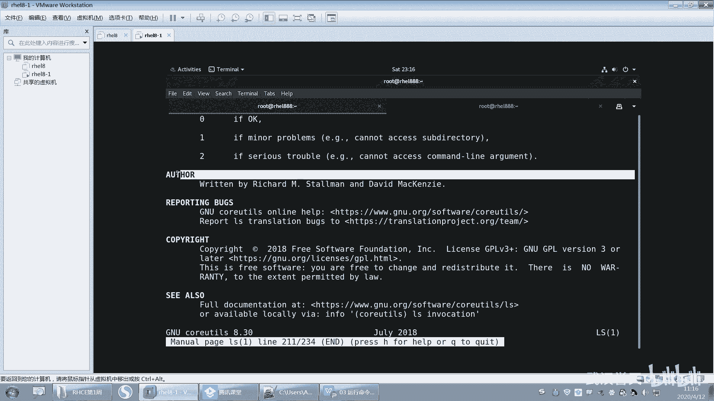

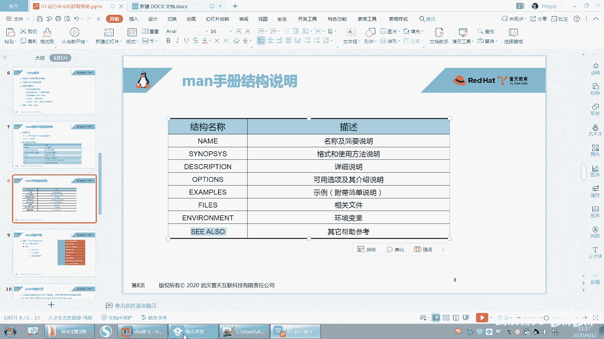

`man`手册共有9个标准章节，每个章节涵盖特定类型的内容：
1.  用户命令（可执行程序或shell命令）
2.  系统调用（内核提供的函数）
3.  库函数（程序库中的函数）
4.  特殊文件（通常位于`/dev`）
5.  文件格式与约定（如`/etc/passwd`的格式）
6.  游戏
7.  杂项（包括宏包和约定等）
8.  系统管理命令（通常需要root权限）
9.  内核例程（非标准）

通常，`man`命令默认搜索所有章节并显示第一个找到的结果。你也可以指定章节号来查看，例如`man 5 passwd`将查看`passwd`文件格式的说明，而不是`passwd`命令的说明。

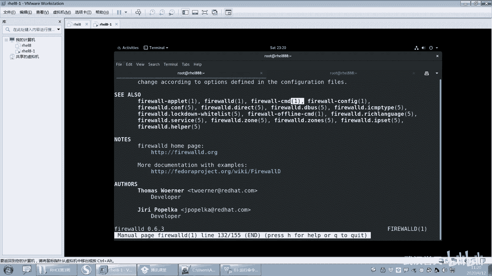

---

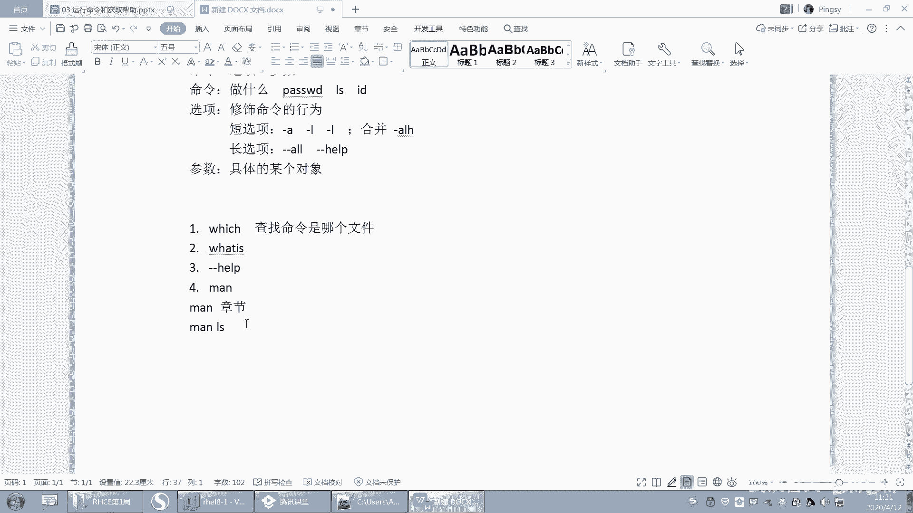

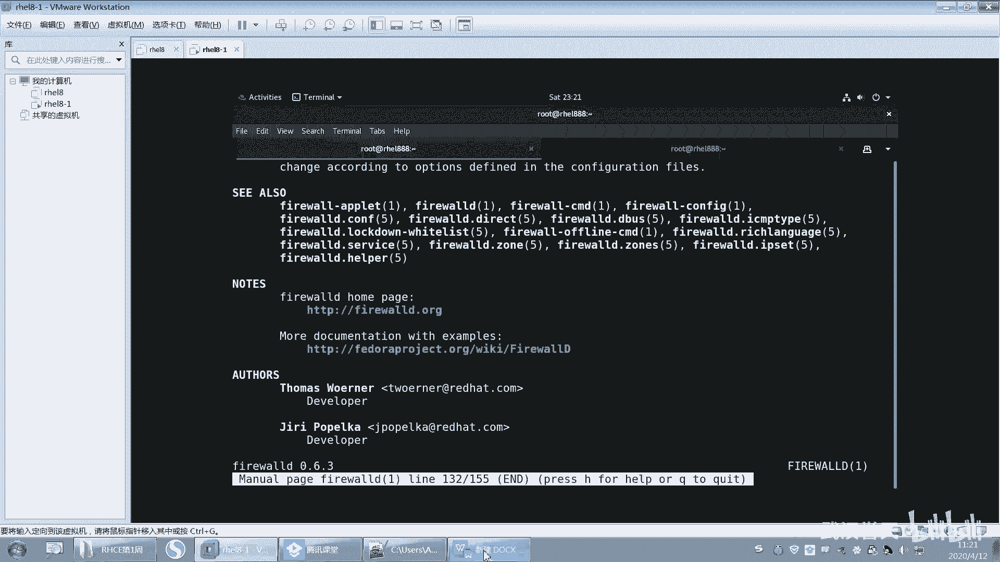

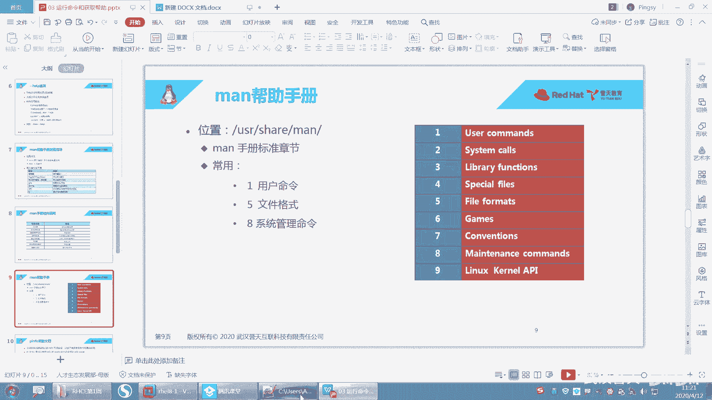

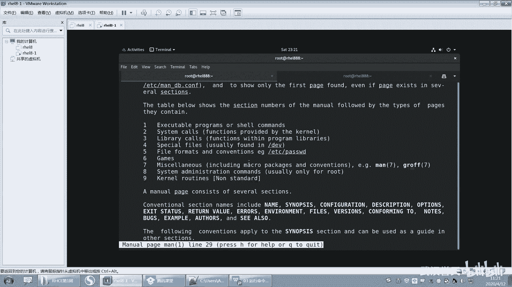

本节课中我们一起学习了在Linux中获取命令帮助的几种主要方法：使用`whatis`获得简短描述；使用`--help`选项查看用法和选项；使用功能强大的`man`手册页获取完整、结构化的文档，并了解了`man`手册的章节划分。熟练掌握这些工具，是高效学习和使用Linux命令的基础。