# Linux基础：4：文件系统组成和基本操作

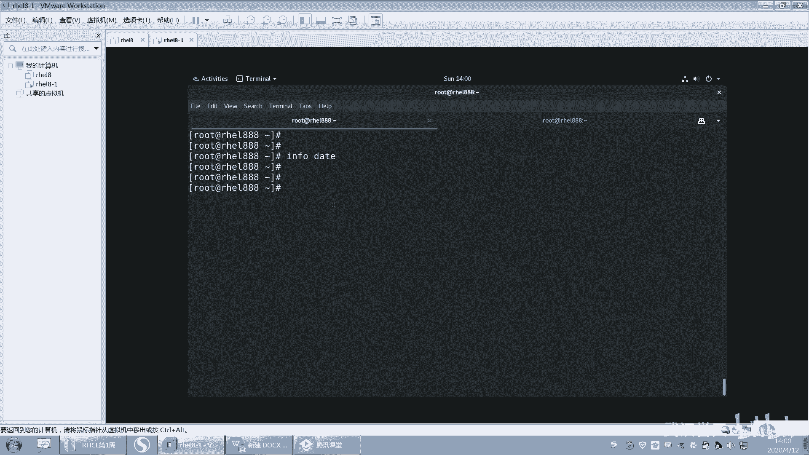

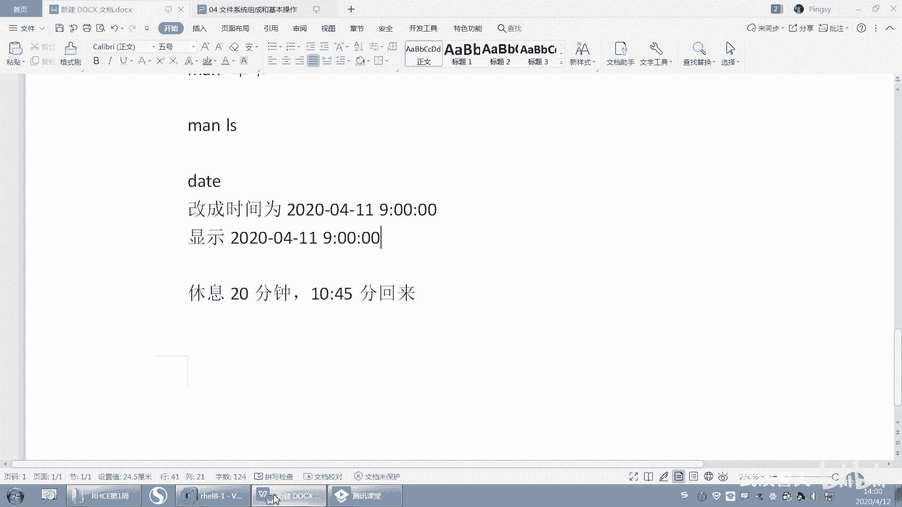

## 概述
在本节课中，我们将学习Linux文件系统的基本组成结构，并掌握文件和目录的基本操作命令，例如复制、移动、删除和创建。理解这些概念是后续深入学习Linux系统管理的基础。

---

## 文件系统组成结构

上一节我们介绍了命令的语法和帮助系统，本节中我们来看看Linux文件系统的核心结构。

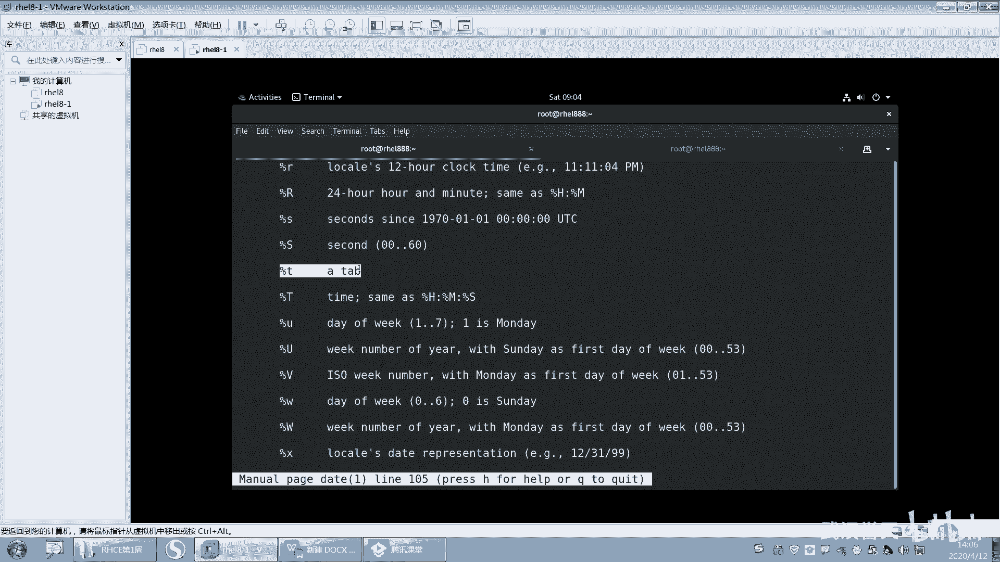

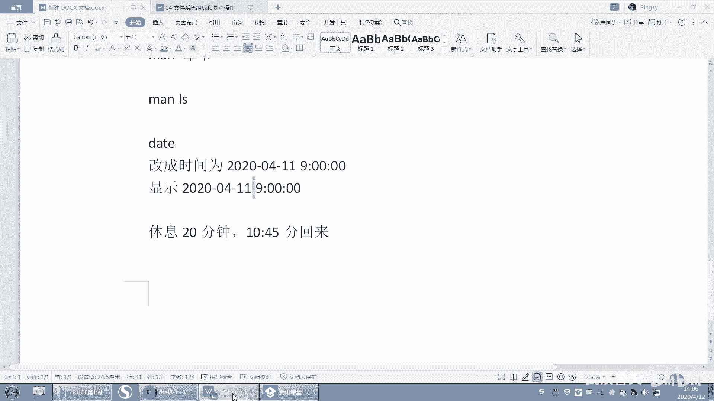

Linux文件系统采用**单根倒树状结构**，所有文件和目录都从根目录（`/`）开始。这与Windows的多根（如C盘、D盘）结构不同。

**核心概念**：
*   **根目录**：用单个斜杠 `/` 表示，是整个文件系统的起点。
*   **路径分隔符**：使用斜杠 `/` 来分隔目录层级，例如 `/home/admin`。
*   **大小写敏感**：文件名和目录名区分大小写，`File.txt` 和 `file.txt` 是两个不同的文件。

### 重要系统目录
以下是Linux系统中一些关键目录及其作用的简要说明：

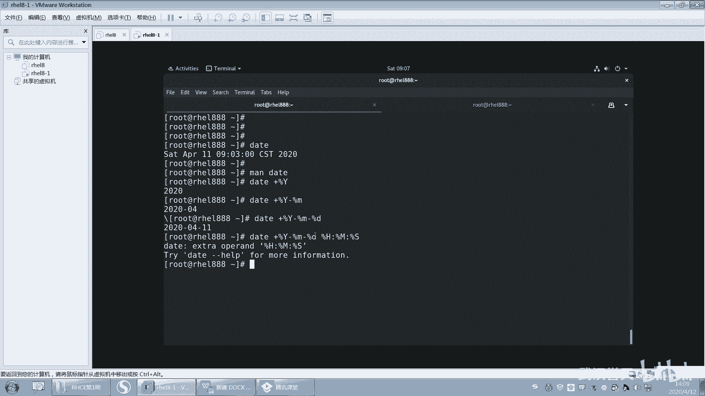

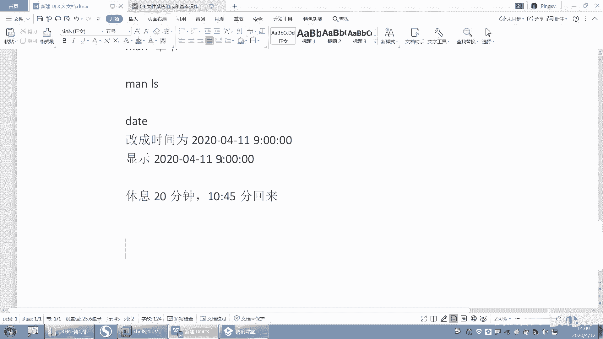

*   **`/root`**：超级管理员用户 `root` 的家目录。
*   **`/home/username`**：普通用户的家目录所在地，每个用户都有一个以自己用户名命名的子目录。
*   **`/usr`**：用于存放系统软件和程序。
    *   **`/usr/bin`**：存放普通用户使用的命令（二进制文件）。
*   **`/boot`**：存放系统启动时所需的文件。
*   **`/etc`**：存放系统的配置文件。

### 分区与挂载点
这是一个关键且抽象的概念。在Linux中，磁盘分区需要“挂载”到目录树的某个空目录上，该目录即称为“挂载点”。此后，访问该目录就等于访问对应的分区。

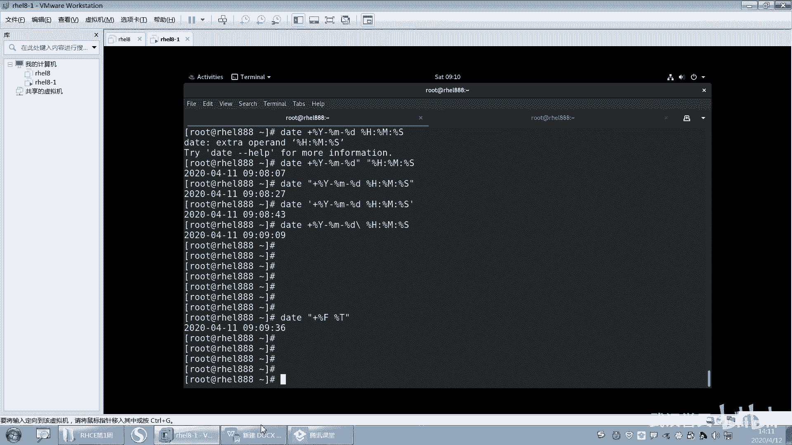

**核心关系**：
1.  必须为根目录 `/` 分配一个分区。
2.  其他分区可以挂载到如 `/home`、`/data` 等目录上。
3.  挂载后，原挂载点目录下的内容会被暂时“隐藏”，访问的是新分区的内容。卸载分区后，原内容恢复可见。

---

## 基本文件与目录操作

理解了文件系统的结构后，我们开始学习如何操作其中的文件和目录。

### 查看当前目录
使用 `pwd` 命令可以显示当前所在目录的绝对路径。

```bash
pwd
```

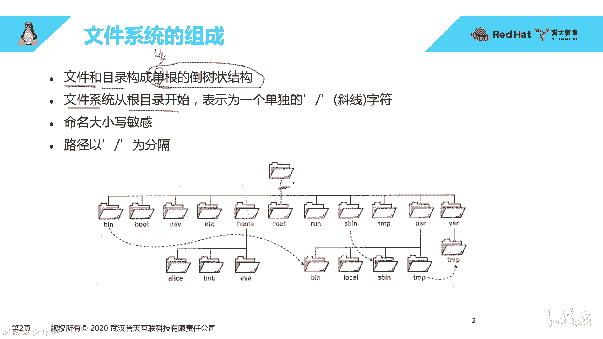

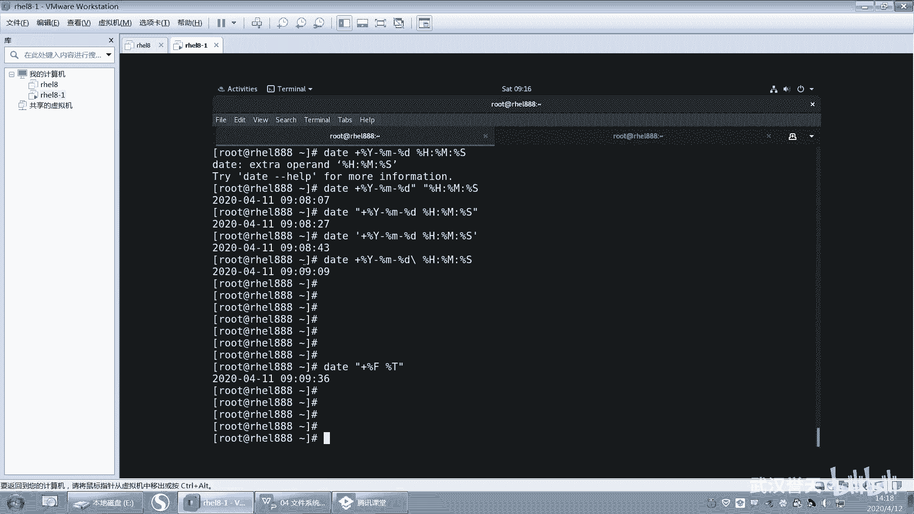

### 列出目录内容
使用 `ls` 命令可以列出指定目录下的文件和子目录。

```bash
ls          # 列出当前目录内容
ls /home    # 列出 /home 目录的内容
```

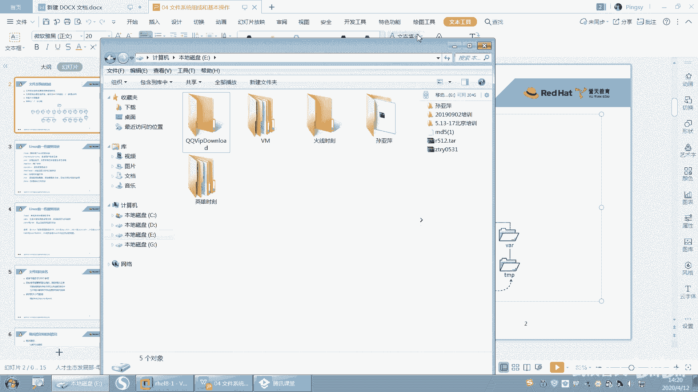

### 切换目录
使用 `cd` 命令可以切换当前工作目录。

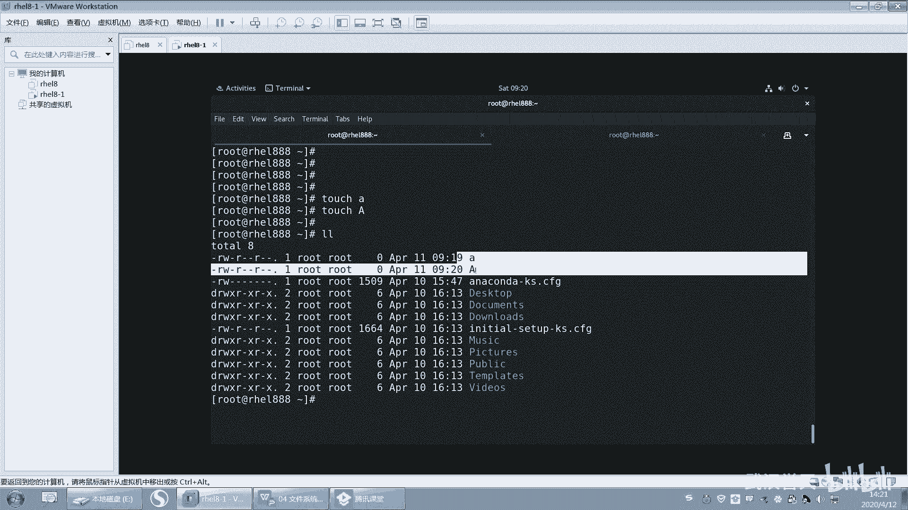

```bash
cd /home    # 切换到 /home 目录
cd ..       # 切换到上一级目录
cd ~        # 切换到当前用户的家目录
cd -        # 切换到上一次所在的目录
```

### 创建目录
使用 `mkdir` 命令可以创建新的目录。

```bash
mkdir new_folder          # 在当前目录创建名为 new_folder 的目录
mkdir -p dir1/dir2/dir3   # 递归创建多级目录
```

### 创建文件
使用 `touch` 命令可以创建一个新的空文件，或更新已有文件的时间戳。

```bash
touch new_file.txt  # 创建名为 new_file.txt 的空文件
```

### 复制文件或目录
使用 `cp` 命令可以复制文件或目录。

```bash
cp file1.txt file2.txt          # 复制 file1.txt 为 file2.txt
cp -r folder1/ folder_backup/   # 递归复制目录 folder1 到 folder_backup
```

### 移动或重命名文件/目录
使用 `mv` 命令可以移动文件/目录，或对其进行重命名。

```bash
mv old_name.txt new_name.txt  # 将文件重命名
mv file.txt /tmp/             # 将文件移动到 /tmp 目录
```

### 删除文件或目录
使用 `rm` 命令可以删除文件或目录。**此命令需谨慎使用，删除后不易恢复**。

```bash
rm file.txt              # 删除文件
rm -r folder_name/       # 递归删除目录及其内部所有内容
rm -f file.txt           # 强制删除，不提示确认
```

---

## 时间戳概念与 `date` 命令

每个文件都有时间戳，记录了访问、修改和状态变更时间。`date` 命令则用于查看和设置系统时间。

### 设置系统时间
设置时间主要有两种格式：

1.  使用 `-s` 选项指定完整字符串：
    ```bash
    date -s "2020-04-11 09:00:00"
    ```
2.  使用 `MMDDhhmm[[CC]YY][.ss]` 格式（在某些系统上可省略 `-s`）：
    ```bash
    date 041109002020.00
    ```

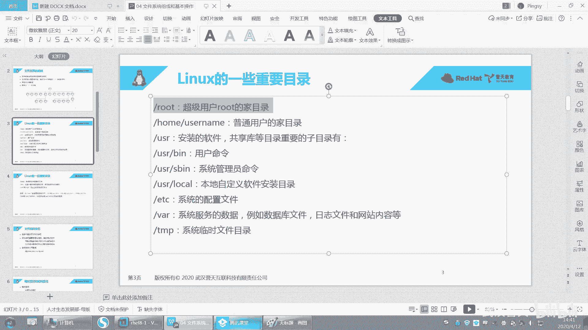

### 格式化显示时间
`date` 命令可以按指定格式输出时间，使用 `+` 和格式控制符。

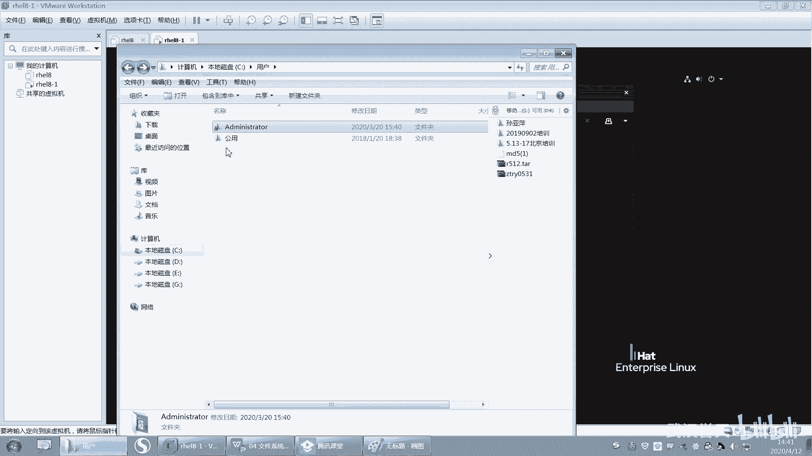

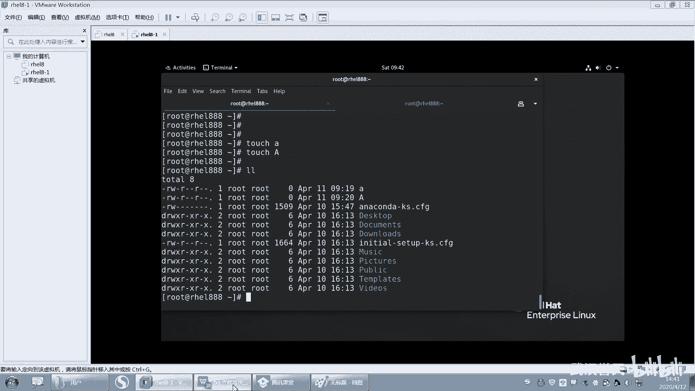

**常用格式符**：
*   `%Y`：四位年份（如 2020）
*   `%m`：两位月份（01-12）
*   `%d`：两位日期（01-31）
*   `%H`：24小时制的小时（00-23）
*   `%M`：分钟（00-59）
*   `%S`：秒（00-60）
*   `%F`：完整的日期，等价于 `%Y-%m-%d`
*   `%T`：时间，等价于 `%H:%M:%S`

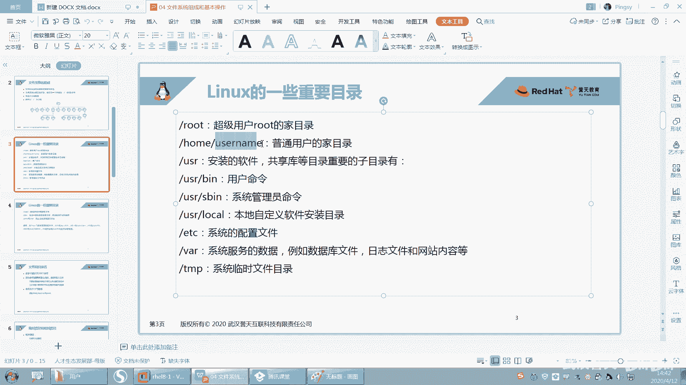

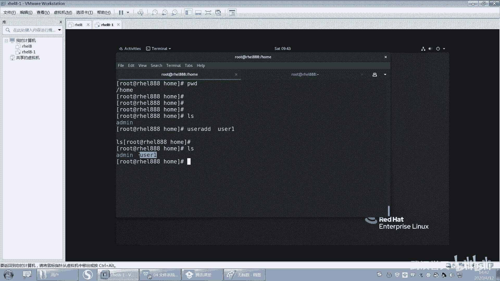

**示例**：显示 “年-月-日 时:分:秒” 格式的时间。
```bash
date "+%Y-%m-%d %H:%M:%S"
```
**注意**：命令行中空格是参数分隔符。要显示空格本身，需要用引号将整个格式字符串引起来，或使用转义符 `\`。
```bash
date "+%Y-%m-%d %H:%M:%S"  # 正确
date +%Y-%m-%d\ %H:%M:%S   # 正确，使用转义空格
```

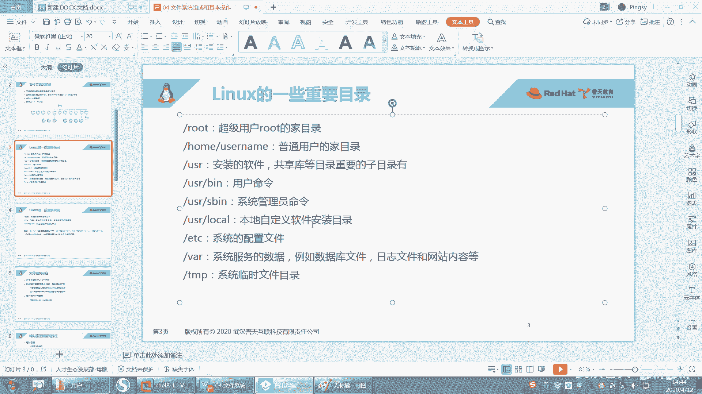

---

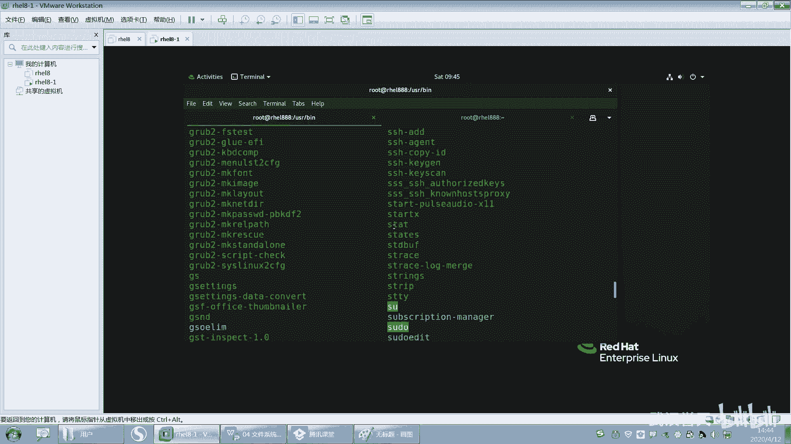

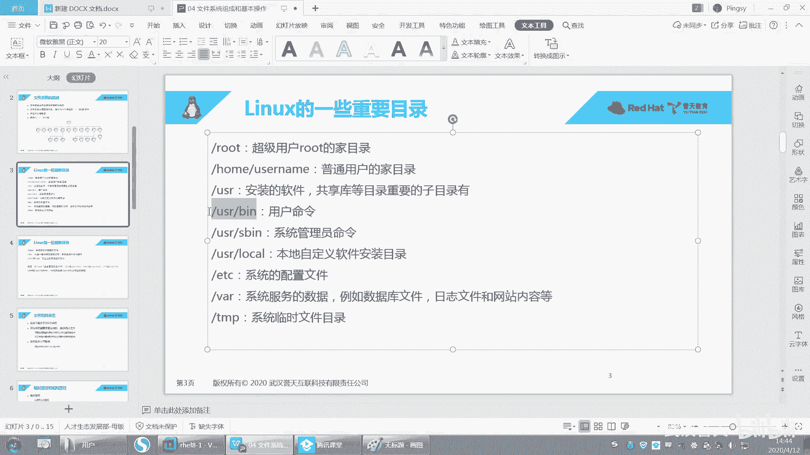

## 总结
本节课我们一起学习了Linux文件系统的核心知识。我们首先了解了其单根倒树状的结构，以及分区通过挂载点与目录关联的抽象模型。接着，我们掌握了操作文件和目录的基本命令，包括 `pwd`, `ls`, `cd`, `mkdir`, `touch`, `cp`, `mv`, `rm`。最后，我们学习了时间戳的概念以及如何使用 `date` 命令查看和设置系统时间、格式化输出时间。这些是进行日常文件管理和系统操作的基础技能。