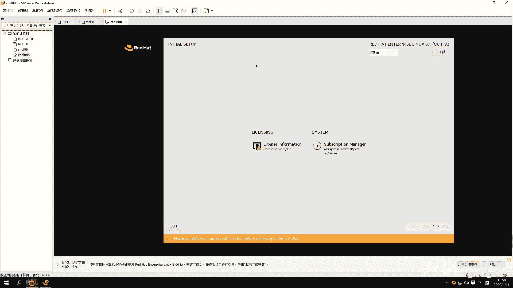
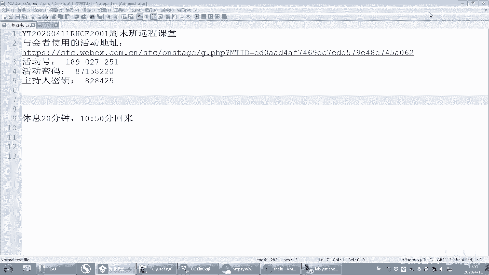
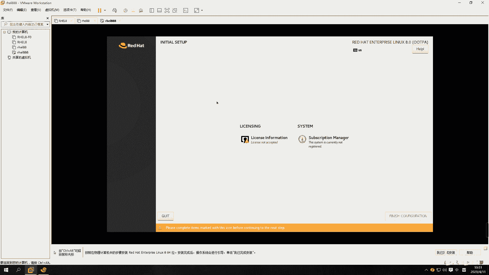
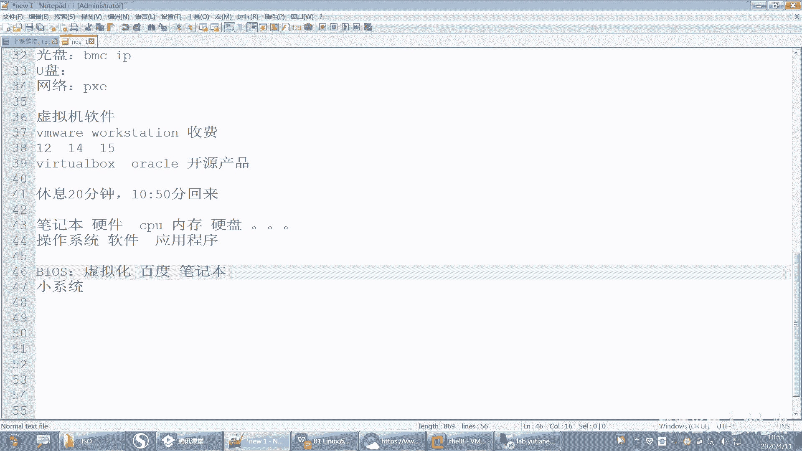
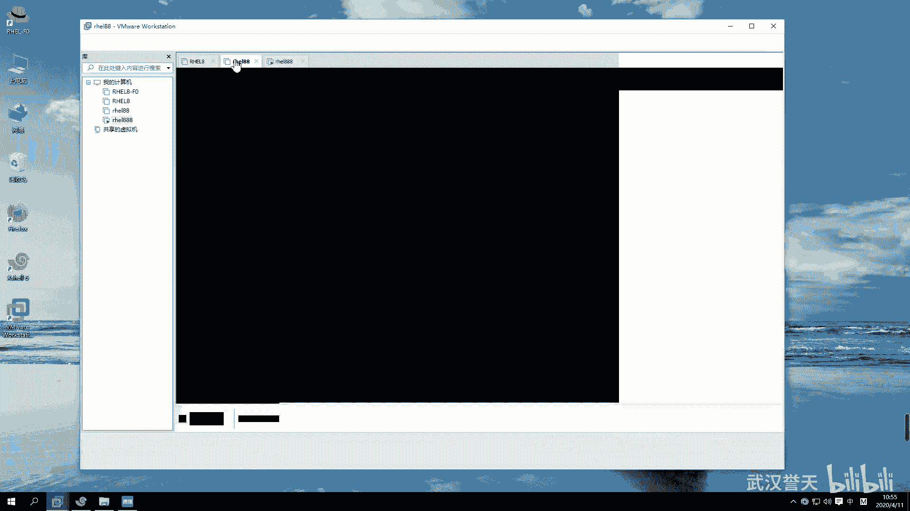
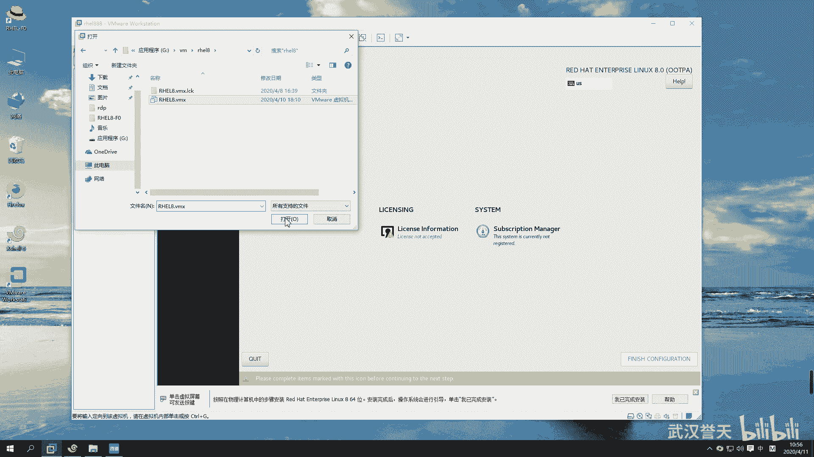
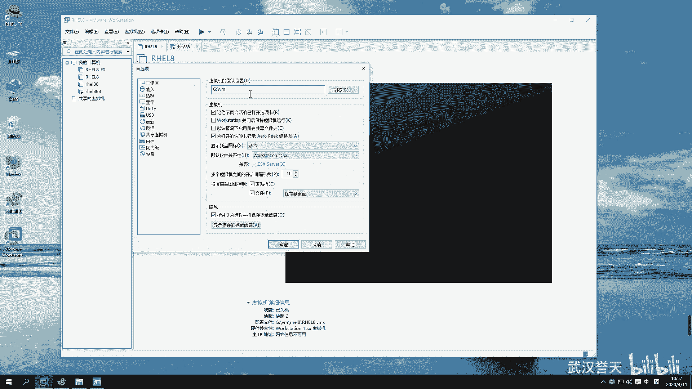
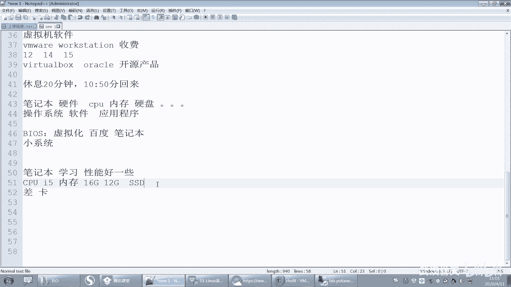
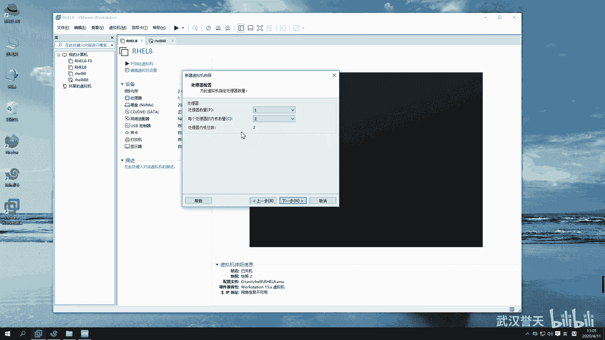
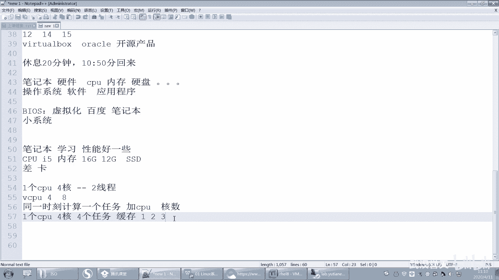

# 誉天红帽RHCE 8.0系列培训：P1：rhel8.0系统安装-01

在本节课中，我们将学习如何在虚拟机中安装RHEL 8.0操作系统。我们将从准备虚拟硬件开始，逐步完成虚拟机的创建，为后续的系统安装打下基础。

## 课程概述与准备工作

上一节我们介绍了课程的整体安排，本节中我们来看看如何为安装系统准备一个虚拟的“电脑”。

安装操作系统需要先准备好硬件。就像给一台物理笔记本安装系统需要CPU、内存和硬盘一样，在虚拟机软件中，我们也需要先“组装”好这些虚拟硬件。

以下是安装前需要确认的几个要点：

*   **虚拟机软件**：我们使用VMware Workstation。
*   **硬件要求**：为了流畅运行后续的实验环境，建议您的物理机满足以下配置：
    *   **CPU**：英特尔 i5 或同等性能以上的处理器。
    *   **内存**：建议 16GB 或以上。最低要求为 12GB，但运行考试练习环境时，16GB 会更顺畅。
    *   **硬盘**：建议使用固态硬盘（SSD）来存放虚拟机文件，以获得更好的性能。
*   **BIOS设置**：如果首次安装虚拟机失败，可能需要进入物理机的BIOS，确保已开启CPU的虚拟化支持（如Intel VT-x或AMD-V）。具体开启方法请根据您的电脑型号自行搜索。

## 创建新的虚拟机

现在，我们开始创建一台新的虚拟机，这相当于组装一台新的电脑。

打开VMware Workstation，点击“创建新的虚拟机”。为了能更细致地控制硬件配置，我们选择“自定义（高级）”选项，然后点击“下一步”。

在“虚拟机硬件兼容性”页面，保持默认的最高版本即可，直接点击“下一步”。

**关键的一步**：在“安装客户机操作系统”页面，务必选择“稍后安装操作系统”。我们现在只是准备硬件，先不进行系统安装。

接下来，选择客户机操作系统类型。因为我们要安装的是Red Hat Enterprise Linux，所以选择“Linux”，并在版本下拉菜单中选择“Red Hat Enterprise Linux 8 64位”。如果您的VMware版本较旧，没有“8”的选项，选择“Red Hat Enterprise Linux 7 64位”也可以成功安装。

然后，为虚拟机命名（例如“RHEL8”）并选择存放位置。建议将位置修改到您的SSD硬盘分区，例如 `G:\VM\` 路径下。您也可以在VMware的“编辑”->“首选项”中修改默认的虚拟机存放路径，这样以后新建虚拟机都会自动存放到此位置。

## 配置虚拟机处理器（CPU）

上一节我们设置了虚拟机的基本信息，本节中我们来看看如何配置虚拟机的“大脑”——处理器。

在“处理器配置”页面，我们需要设置处理器的数量与核心数。
*   **处理器数量**：表示虚拟的CPU插槽数。通常设置为1即可。
*   **每个处理器的核心数量**：表示每个虚拟CPU的核心数。可以设置为2或更高，具体取决于您物理机的性能。

两者的乘积即为虚拟机的总虚拟CPU（vCPU）数量。例如：
*   处理器数量 = 1， 每个处理器的核心数 = 2， 则总vCPU = **1 * 2 = 2**
*   处理器数量 = 2， 每个处理器的核心数 = 1， 则总vCPU = **2 * 1 = 2**

**核心概念解释**：
*   **物理CPU**：计算机主板上实际的处理器芯片。
*   **核心（Core）**：现代CPU内部集成的独立处理单元，可以同时执行不同的任务。多核心相当于一个CPU里有了多个“大脑”。
*   **线程（Thread）**：一种让单个CPU核心能“同时”处理多个任务的技术（超线程技术）。一个核心通常对应1个或2个线程。
*   **虚拟CPU（vCPU）**：虚拟机看到的CPU。它由物理CPU的线程资源虚拟化而来。vCPU的总数不应超过物理机CPU的总线程数。

## 配置虚拟机内存与后续步骤

处理器配置完成后，接下来设置虚拟机的“工作台”——内存。

在“此虚拟机的内存”页面，为虚拟机分配内存。对于RHEL 8，建议分配至少 **2048 MB（2GB）** 内存。如果您的物理机内存充足（如16GB），可以分配 **4096 MB（4GB）** 以获得更流畅的体验。

内存设置完成后，点击“下一步”。后续关于网络、I/O控制器和磁盘类型的配置，在初次安装时均可保持默认选项，直接点击“下一步”即可。

在“选择磁盘”页面，选择“创建新虚拟磁盘”。然后指定磁盘容量，对于学习用途，分配 **20 GB** 通常是足够的。建议选择“将虚拟磁盘拆分成多个文件”，这样更便于管理。

最后，确认所有配置信息，点击“完成”。至此，一台没有安装操作系统的“虚拟电脑”就创建好了。它的硬件已经就绪，等待我们下一节为其安装RHEL 8操作系统。

## 本节课总结

本节课中我们一起学习了安装RHEL 8系统的第一步：创建虚拟机。我们了解了安装前的硬件准备要求，并逐步在VMware Workstation中创建了一台新的虚拟机，为其配置了名称、存储位置、处理器和内存等关键硬件参数。现在，我们已经拥有了一台等待安装系统的“虚拟主机”，为下一课的实际系统安装做好了准备。