# Linux用户与组管理：P22：用户组和权限-22

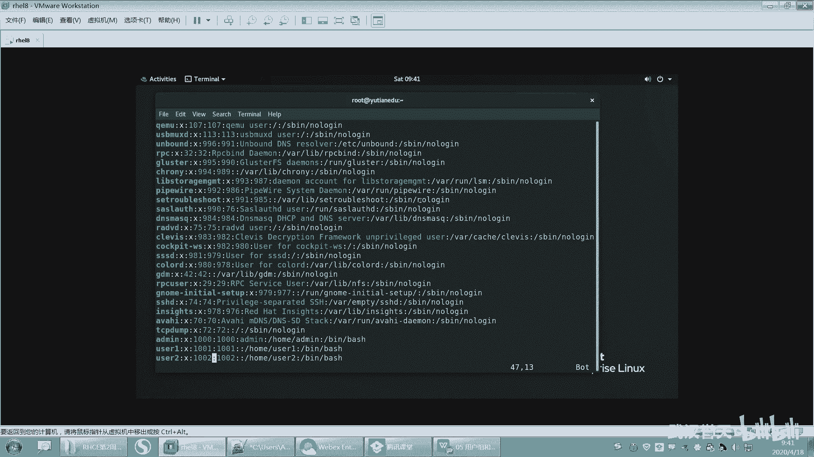

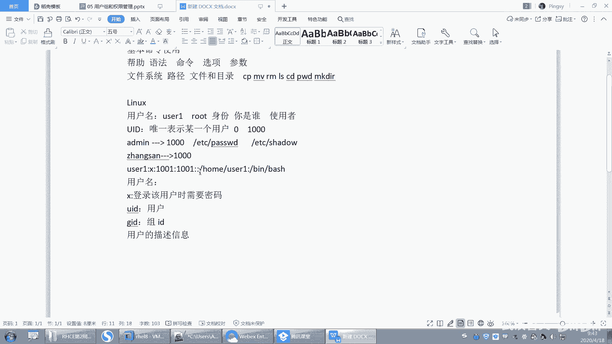

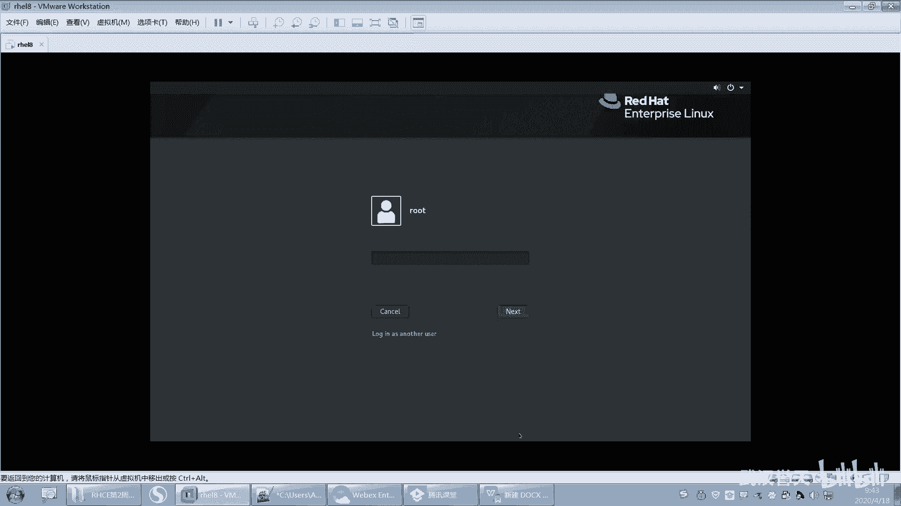

在本节课中，我们将要学习Linux系统中用户和组的基本概念，以及如何通过编辑系统文件和命令行工具来创建、管理它们。我们将详细解析`/etc/passwd`和`/etc/group`文件的结构，并演示用户与组之间的关联关系。

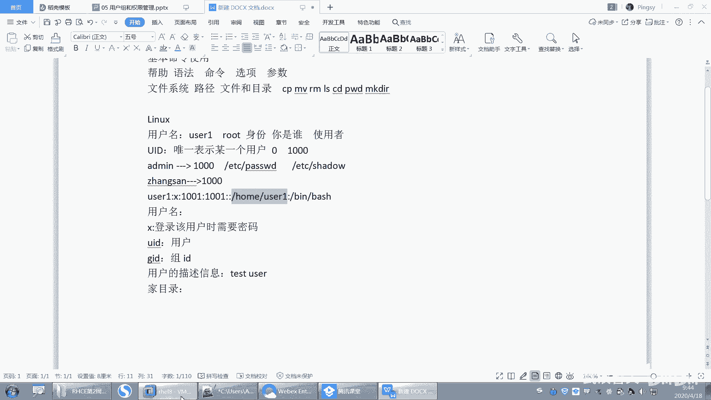

## 用户信息文件：/etc/passwd

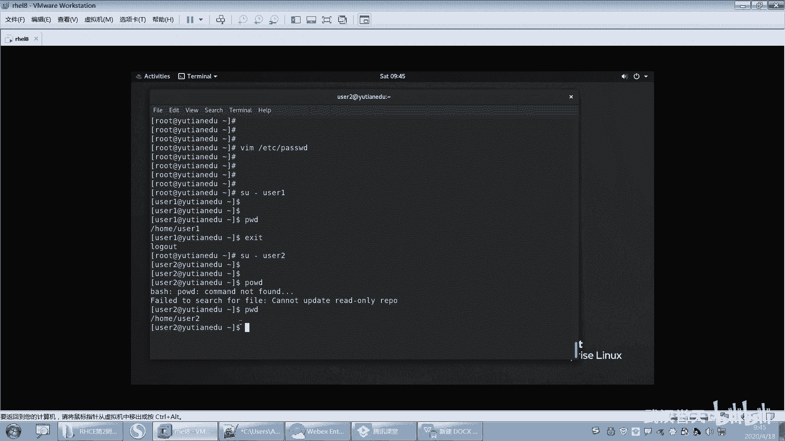

上一节我们介绍了用户的基本概念，本节中我们来看看存储用户核心信息的文件`/etc/passwd`。该文件定义了系统上的所有用户账户。

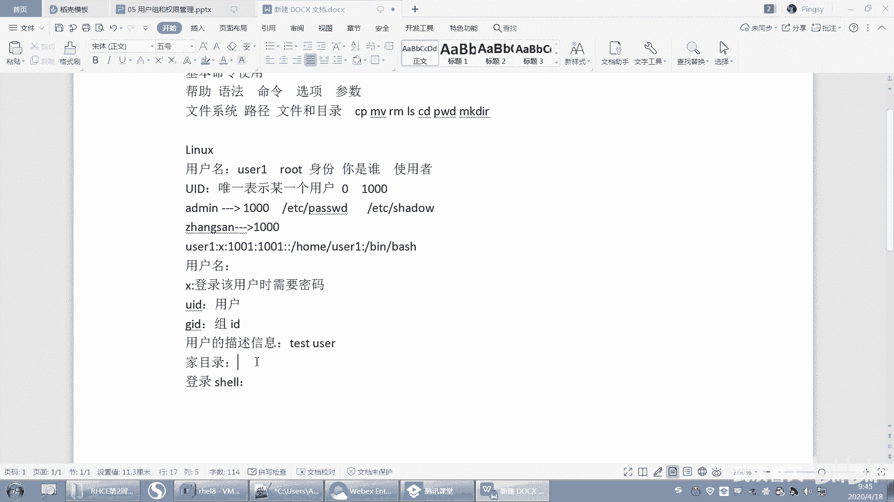

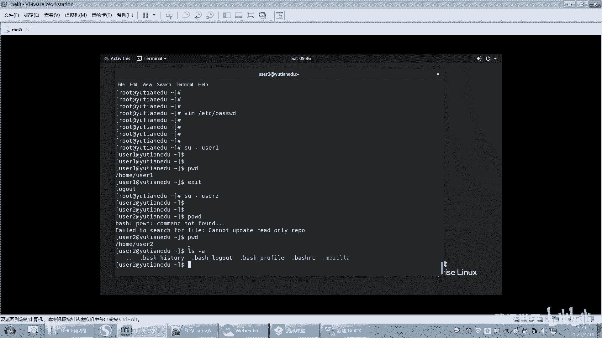

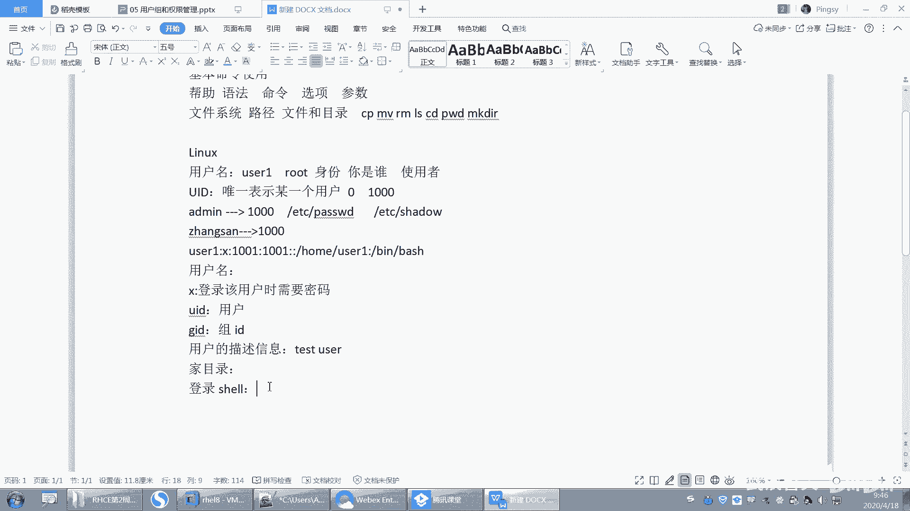

该文件中的每一行代表一个用户，由冒号`:`分隔为多个字段。以下是每个字段的含义：

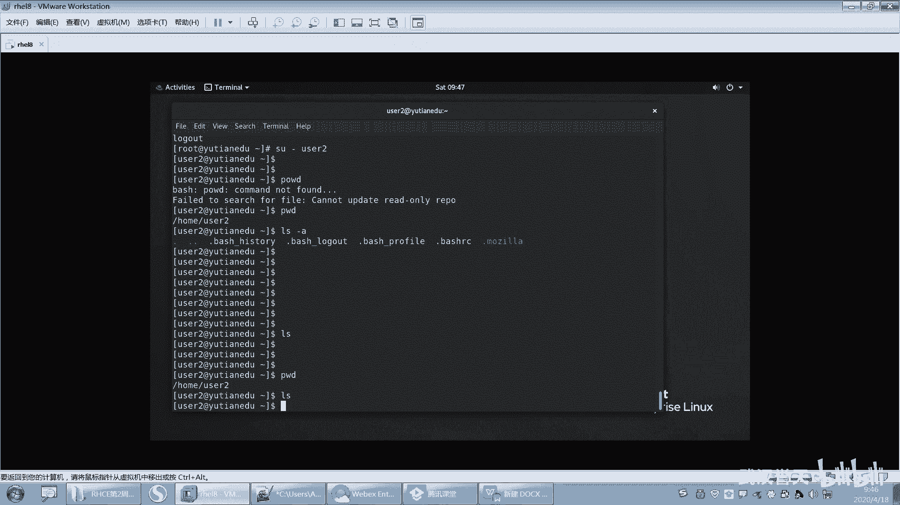

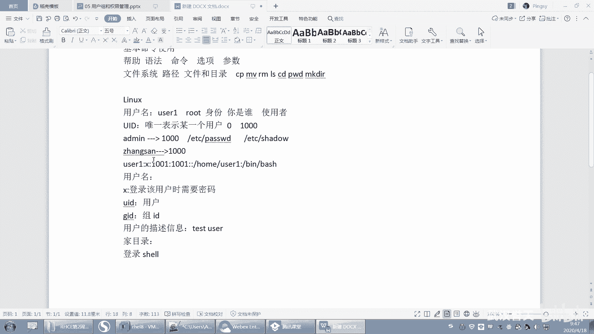

*   **用户名**：用户登录时使用的名称。
*   **密码占位符**：历史上用于存放加密密码，现在通常只是一个`x`，表示密码实际存储在`/etc/shadow`文件中。在红帽7系统中，此字段若为`x`，登录需要密码；若为空，则登录无需密码。
*   **用户ID**：即`UID`，是系统中标识用户的唯一数字。
*   **组ID**：即`GID`，是用户所属**主组**的ID号。
*   **描述信息**：也称为`GECOS`字段，用于存放用户的备注信息，例如全名。在图形登录界面，此处信息会替代用户名显示。
*   **家目录**：用户登录后默认进入的个人目录，通常位于`/home/`下以用户名命名的文件夹。
*   **登录Shell**：用户登录后默认使用的命令解释器，例如`/bin/bash`。如果设置为`/sbin/nologin`，则该用户无法登录系统。

通过直接编辑`/etc/passwd`文件并添加一行符合上述格式的记录，即可手动创建一个用户。但需要注意，这种方法不会自动创建家目录和对应的组，可能导致功能不全。

## 组信息文件：/etc/group

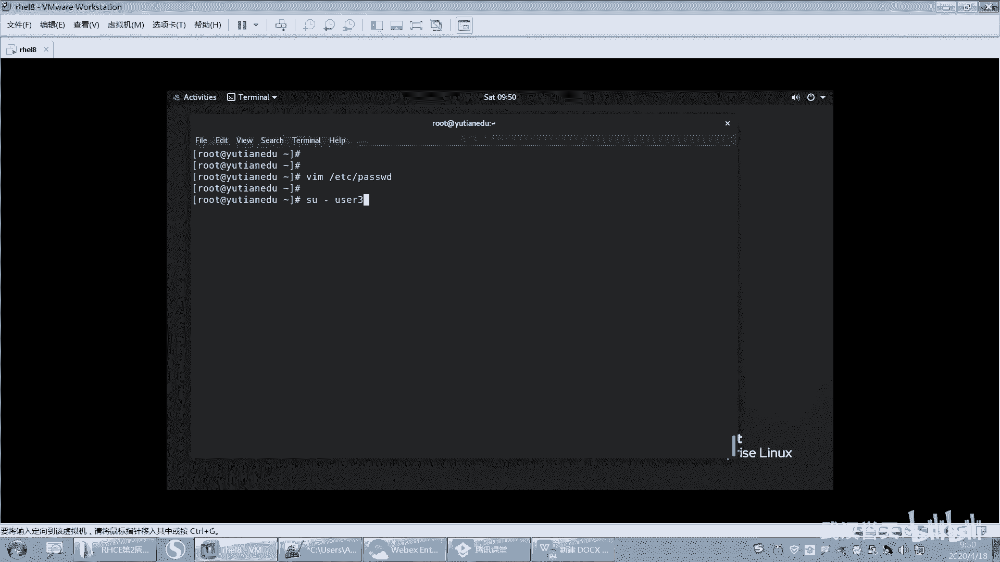

理解了用户之后，我们来看看组。每个用户都必须属于至少一个组，其主组信息记录在`/etc/passwd`中，而所有组的信息则存储在`/etc/group`文件中。

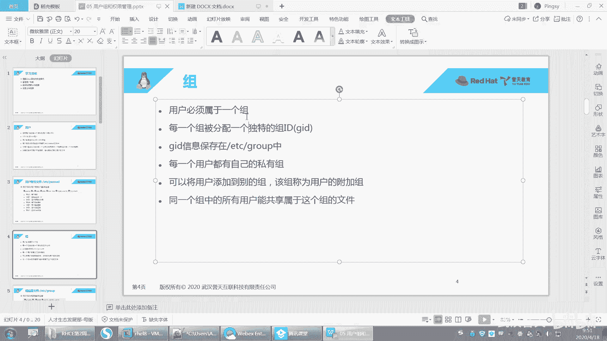

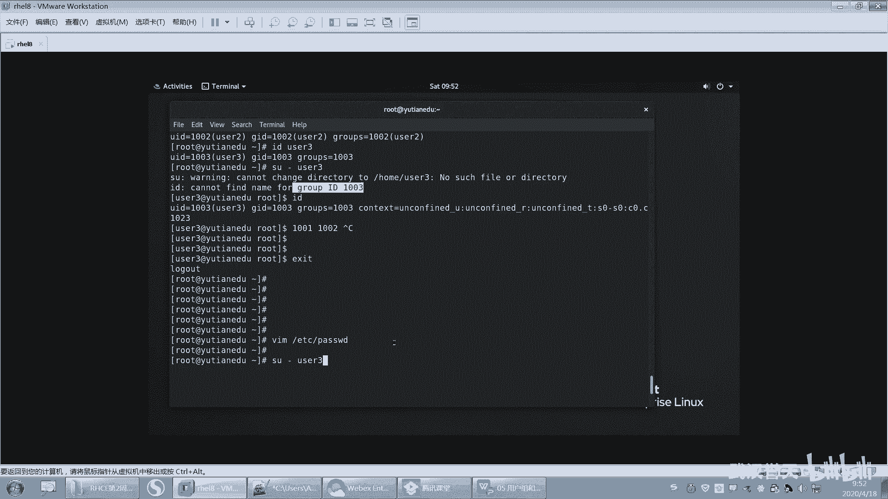

该文件同样每行代表一个组，由冒号`:`分隔。以下是各字段的含义：

*   **组名**：组的名称。
*   **组密码占位符**：通常为`x`，组密码较少使用。
*   **组ID**：即`GID`，是系统中标识组的唯一数字。
*   **组成员列表**：属于该**附加组**的用户名列表，多个用户名用逗号`,`分隔。


用户与组通过`GID`关联。`/etc/passwd`文件中的用户`GID`与`/etc/group`文件中的某个组`GID`相匹配，该组即为用户的**主组**（或称私有组）。一个用户只能有一个主组，但可以加入多个**附加组**，附加组的组名会列在`/etc/group`文件对应行的最后一个字段中。

## 使用命令行管理用户和组

虽然可以手动编辑配置文件，但更安全、更便捷的方式是使用系统提供的命令。

### 创建用户：`useradd`

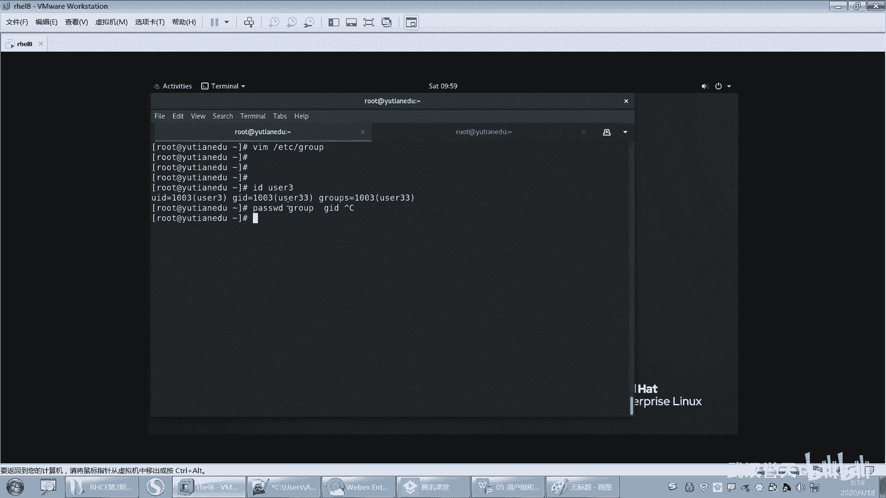

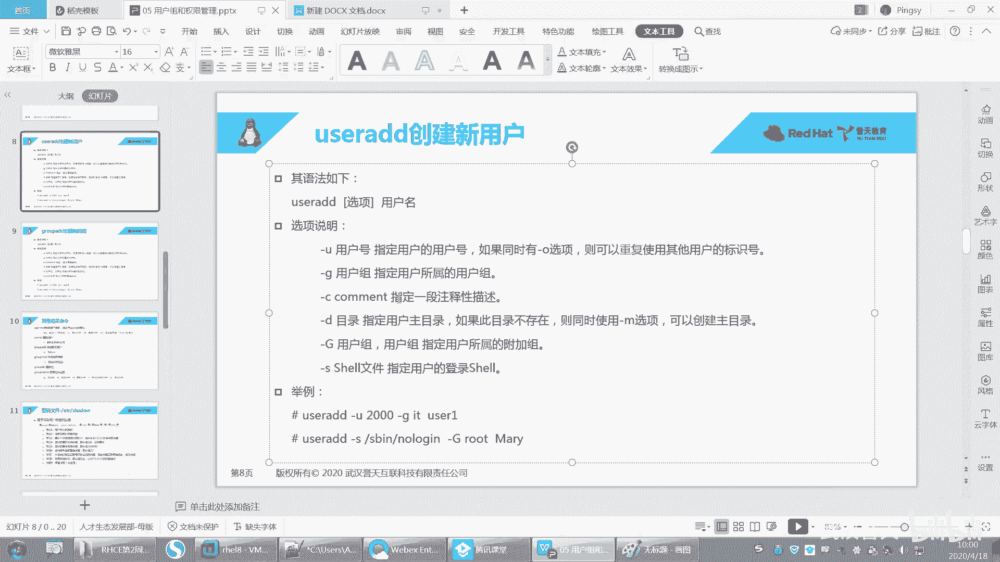

`useradd`命令用于创建新用户。执行此命令时，系统会自动完成多项工作：在`/etc/passwd`和`/etc/group`中创建对应条目、创建家目录、复制初始配置文件等。

创建用户时，可以指定各种属性。以下是`useradd`命令的一些常用选项：

*   `-u UID`：指定用户的UID。
*   `-g GID` 或 `-g 组名`：指定用户的主组。**指定的组必须已存在**。
*   `-G 附加组名`：指定用户要加入的附加组。
*   `-c “描述信息”`：指定用户的描述信息。
*   `-d /path/to/home`：指定用户的家目录路径。
*   `-s /path/to/shell`：指定用户的登录Shell。

**示例**：创建一个UID为2020，描述为“Developer”，家目录为`/home/devuser`，登录Shell为`/bin/bash`的用户`dev`，并指定其主组为`developers`（需先创建）。
```bash
groupadd developers
useradd -u 2020 -g developers -c “Developer” -d /home/devuser -s /bin/bash dev
```

### 修改用户属性：`usermod`

`usermod`命令用于修改已存在用户的属性，其选项与`useradd`类似。

**示例**：将用户`dev`的登录Shell修改为`/sbin/nologin`。
```bash
usermod -s /sbin/nologin dev
```

### 创建组：`groupadd`

`groupadd`命令用于创建新组。

*   `-g GID`：指定组的GID。

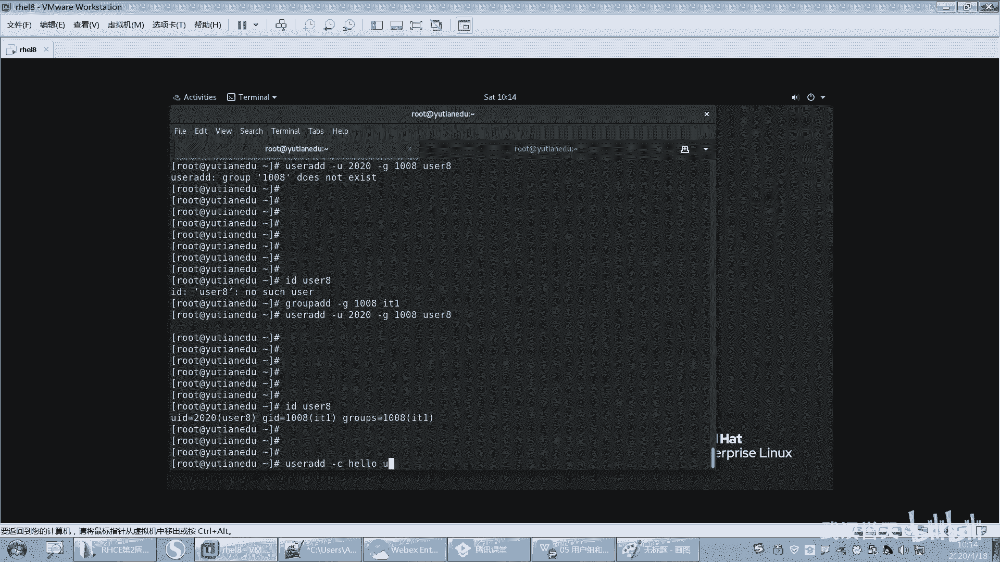

**示例**：创建一个GID为2000的组`testgroup`。
```bash
groupadd -g 2000 testgroup
```

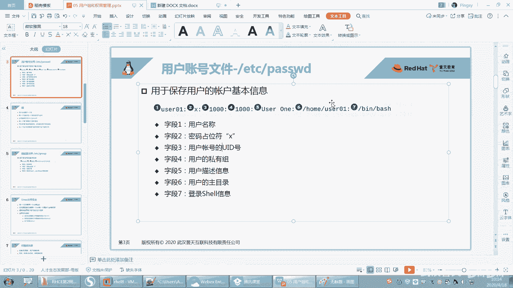

### UID/GID的分配规则

系统在自动分配UID和GID时，通常从1000开始（普通用户），并查找当前已使用的最大ID号，然后在其基础上加1进行分配。这样设计是为了避免重用可能已被删除用户遗留文件的旧ID，防止新用户意外继承这些文件的权限。

## 命令选项与参数的使用规范

在使用命令行工具时，需要注意选项与参数的格式：
*   一个选项（如`-c`）如果后面需要跟参数（如描述信息），那么参数必须紧跟在选项之后。
*   多个不需要参数的短选项可以合并，例如`ls -l -a`可以写成`ls -la`。
*   但如果合并的选项中，某个选项需要参数，则不能这样合并。例如，`-d`需要参数，`-c`也需要参数，则`-cd`的写法无法正确识别哪个参数对应哪个选项。

---

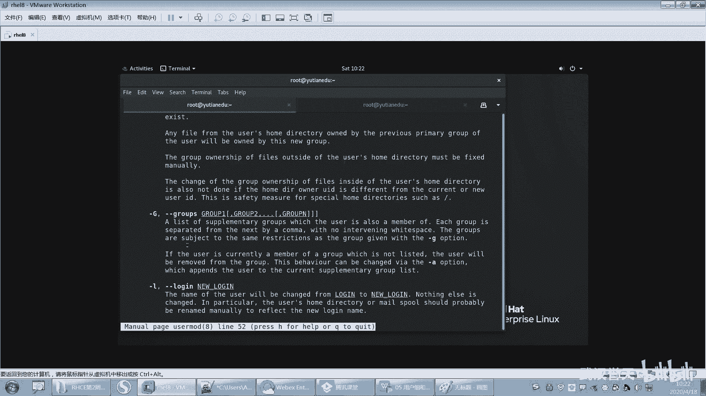

本节课中我们一起学习了Linux用户和组的核心配置文件`/etc/passwd`和`/etc/group`的结构与含义，理解了UID、GID以及主组、附加组的概念。我们重点掌握了使用`useradd`、`usermod`和`groupadd`命令来创建和管理用户与组，这是进行系统用户权限管理的基础。