# Linux系统管理：第3章：文件权限与IO重定向

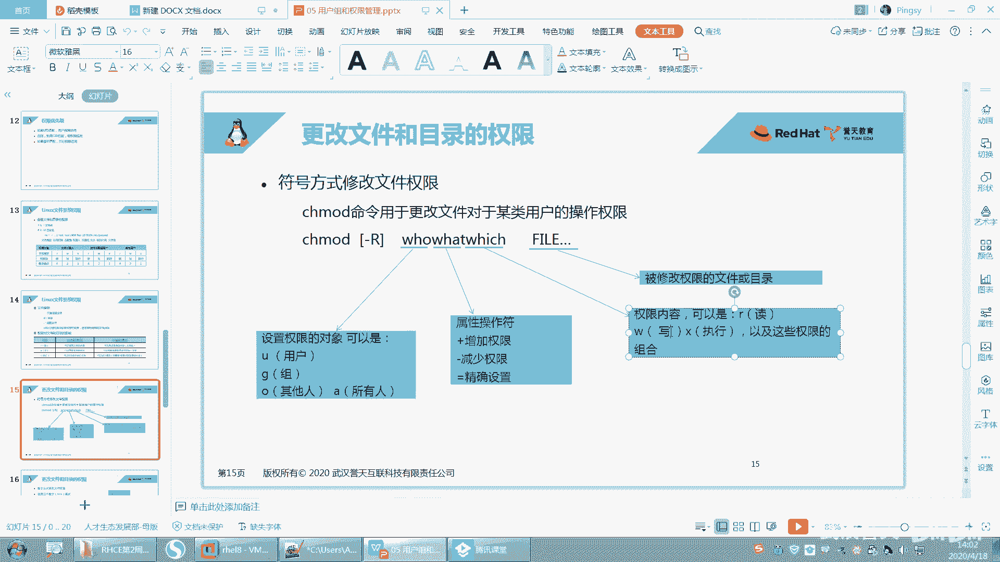

在本节课中，我们将要学习如何修改文件权限，以及理解Linux中的输入输出（IO）概念，特别是如何通过重定向来控制命令的输出流向。

上一节我们介绍了文件权限的基本概念和表示方法，本节中我们来看看如何具体修改这些权限。

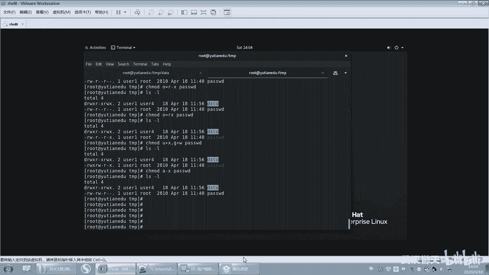

## 修改文件权限

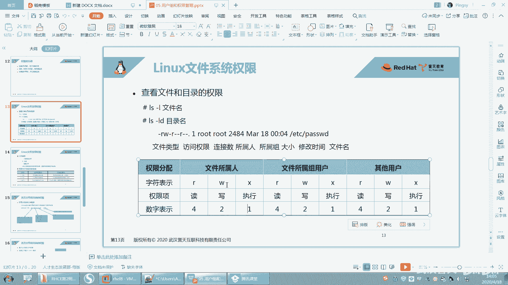

我们可以使用 `chmod` 命令来更改文件或目录的权限。该命令的基本语法是 `chmod [选项] 模式 文件`。

以下是 `chmod` 命令的两种主要模式：

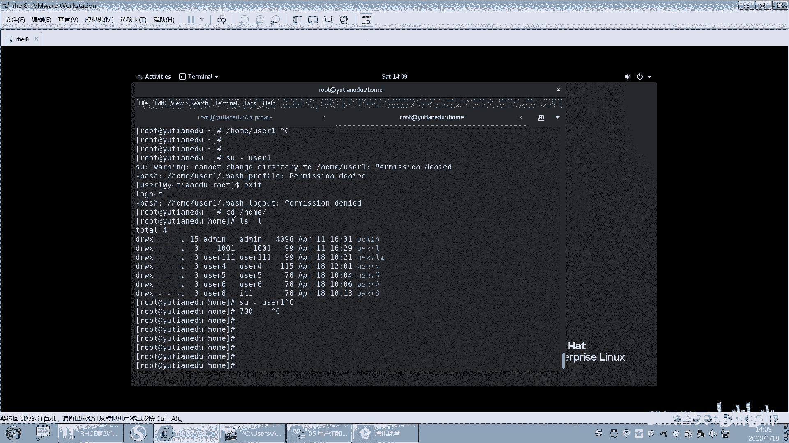

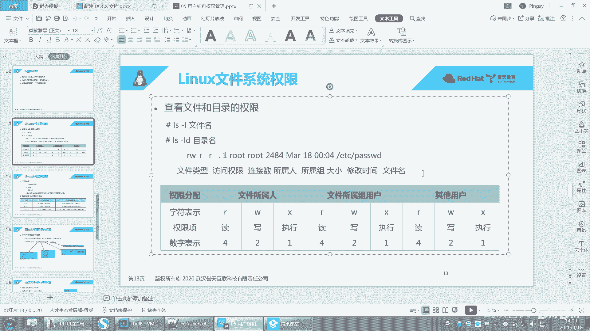

*   **符号模式**：使用 `u`（拥有人）、`g`（拥有组）、`o`（其他人）、`a`（所有人）与 `+`（增加）、`-`（减少）、`=`（设置）以及 `r`、`w`、`x` 权限字符组合。
    *   例如：`chmod g+w file.txt` 为文件的拥有组添加写权限。
    *   例如：`chmod go-w file.txt` 为文件的拥有组和其他人移除写权限。
    *   例如：`chmod u=rwx,g=rx,o=r file.txt` 为不同身份设置具体权限。
*   **数字模式**：使用三位八进制数字表示权限，分别对应拥有人、拥有组和其他人。其中 `r=4`， `w=2`， `x=1`。
    *   例如：`chmod 755 directory` 设置权限为 `rwxr-xr-x`。
    *   例如：`chmod 644 file.txt` 设置权限为 `rw-r--r--`。

**注意**：使用数字模式时，如果只写了两位（如 `66`），系统会在**前面**自动补零，变为 `066`，即 `-rw-rw-rw-` 会变为 `----rw-rw-`。

两种方法各有优势。当需要精确设置所有位权限时，数字模式更直接。当只需对部分权限进行微调时，符号模式更便捷且不易出错。

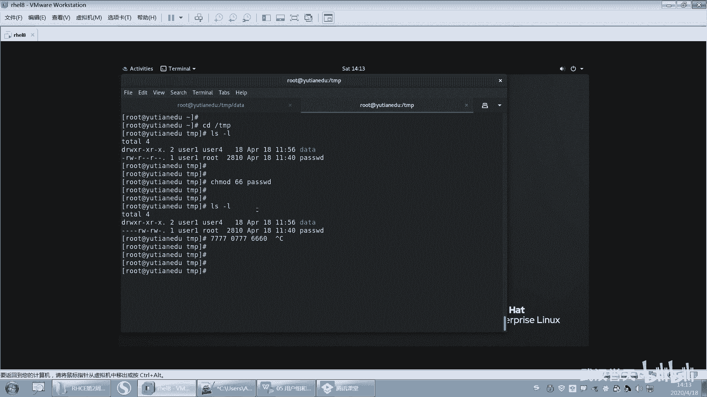

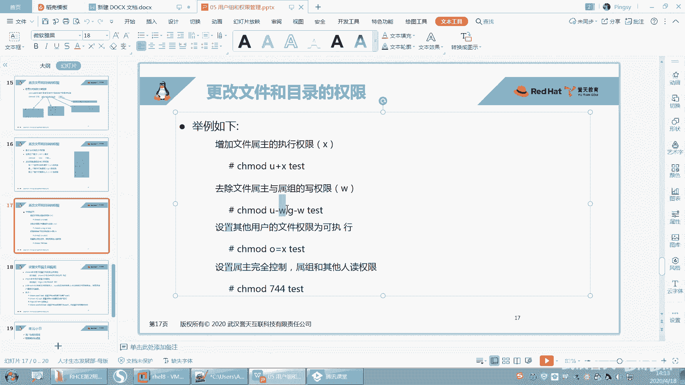

## 输入输出（IO）与重定向

在Linux中，命令执行通常涉及输入和输出。系统定义了三种标准数据流：

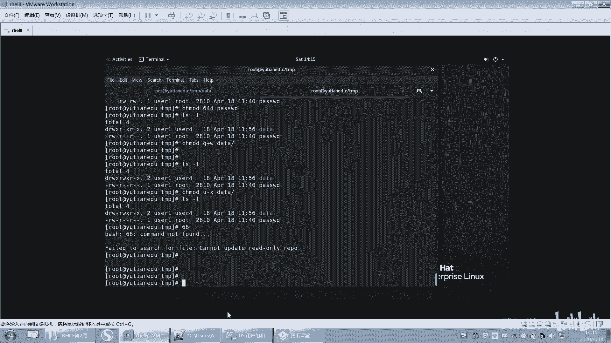

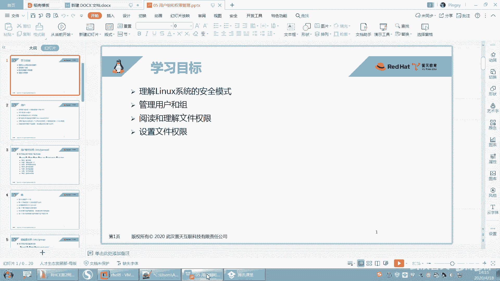

*   **标准输入**：文件描述符为 `0`，通常来自键盘。
*   **标准输出**：文件描述符为 `1`，通常输出到终端屏幕。
*   **标准错误**：文件描述符为 `2`，通常也将错误信息输出到终端屏幕。

“重定向”就是改变这些数据流的默认方向。

### 输出重定向

输出重定向使用 `>` 或 `>>` 符号。

*   **`>`**：将命令的**标准输出**重定向到文件。如果文件不存在则创建；如果文件已存在，则会**覆盖**原有内容。
    *   例如：`ls -l > list.txt` 将 `ls` 的结果保存到 `list.txt` 文件，终端不再显示。
*   **`>>`**：将命令的**标准输出**重定向到文件。如果文件不存在则创建；如果文件已存在，则将新内容**追加**到文件末尾。
    *   例如：`date >> log.txt` 将当前日期时间追加到 `log.txt` 文件末尾。

**警告**：`>` 操作会覆盖文件，请谨慎使用。例如，`echo “” > .bash_history` 可以快速清空命令历史记录文件。

### 错误输出重定向

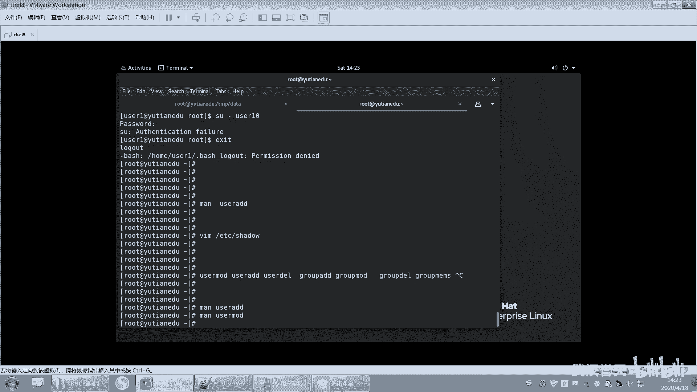

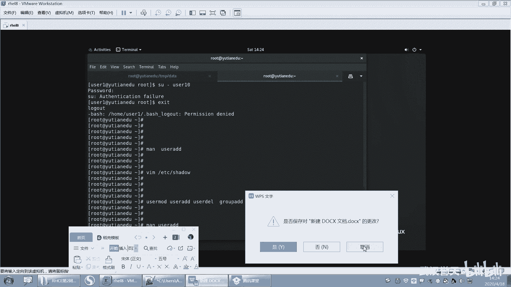

错误输出重定向使用 `2>` 或 `2>>` 符号。

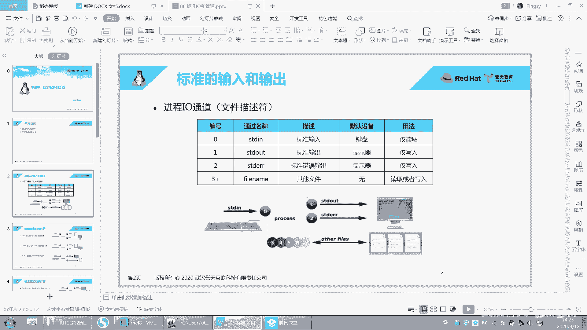

*   **`2>`**：将命令的**标准错误**重定向到文件。
    *   例如：`ls /nonexistent 2> error.log` 将错误信息保存到 `error.log`，而不会在终端显示。
*   **`2>>`**：将命令的**标准错误**追加到文件。

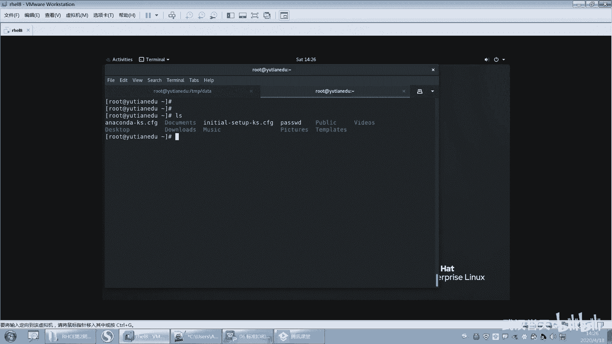

### 合并标准输出和错误输出

有时我们希望将正确结果和错误信息都重定向到同一个文件。

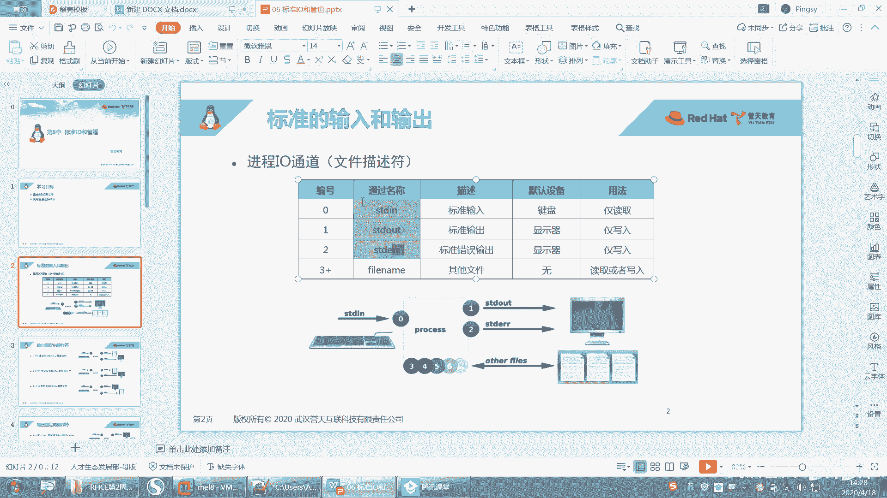

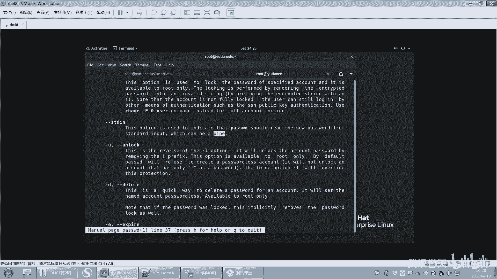

*   **`&>`**：将**标准输出和标准错误**一起重定向到文件。
    *   例如：`ls /exist /nonexistent &> output.log` 将所有输出都存入 `output.log`。
*   **`&>>`**：将**标准输出和标准错误**一起追加到文件。

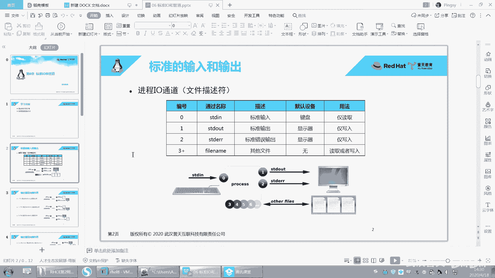

### 输入重定向

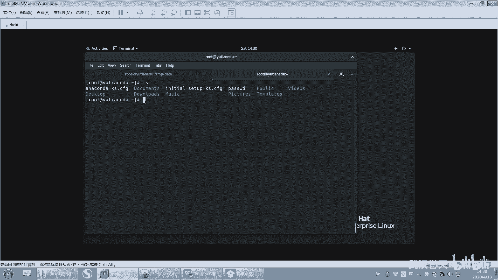

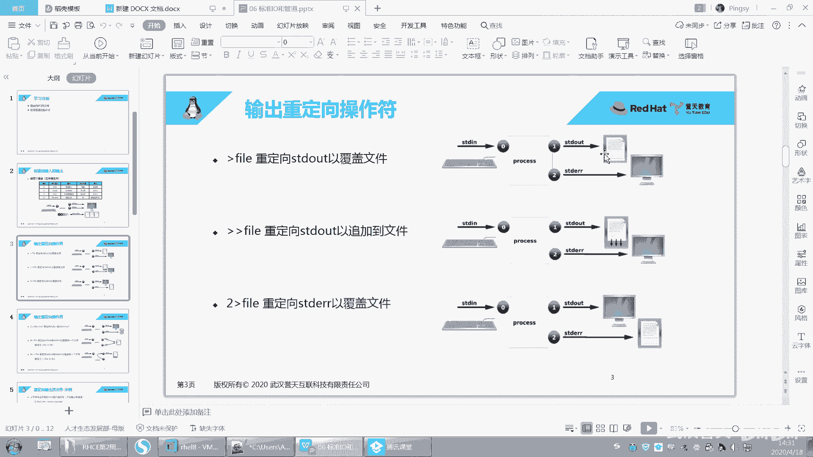

输入重定向使用 `<` 符号，将文件内容作为命令的输入。

*   例如：`wc -l < /etc/passwd` 统计 `/etc/passwd` 文件的行数。这里 `wc` 命令从文件获取输入，而不是等待键盘输入。

## 管道

管道符 `|` 用于将一个命令的**标准输出**作为另一个命令的**标准输入**。这是Linux中组合简单命令完成复杂任务的强大工具。

*   例如：`ls -l /etc | grep passwd` 列出 `/etc` 目录详情，然后从中过滤出包含 “passwd” 的行。
*   例如：`ps aux | grep ssh` 查找所有进程中与 `ssh` 相关的进程。

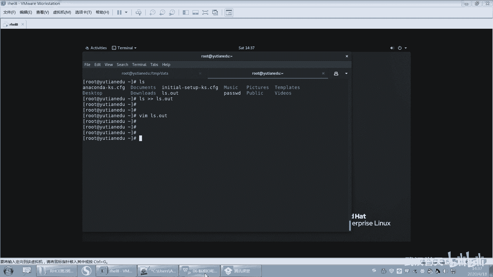

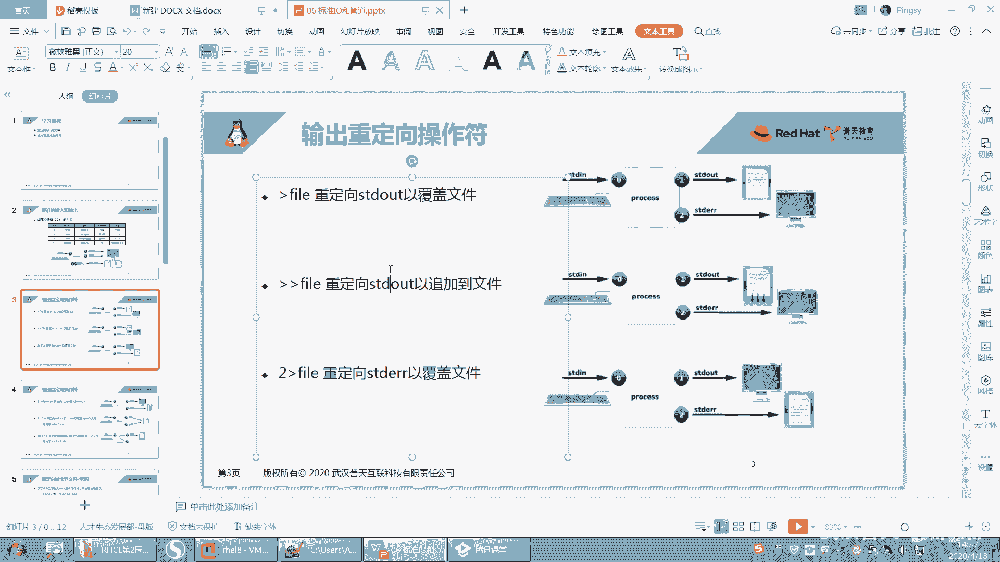

管道连接了多个命令，让数据像在流水线上一样被依次处理。

---

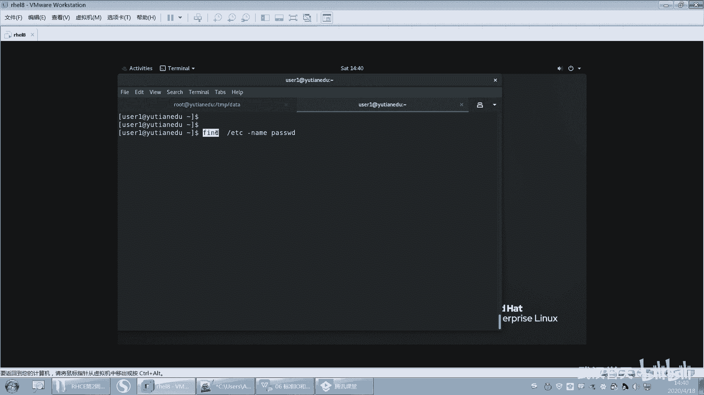

本节课中我们一起学习了如何用 `chmod` 命令修改文件权限，理解了Linux中标准输入、输出和错误的概念，并掌握了使用 `>`、`>>`、`2>`、`<` 进行IO重定向以及使用 `|` 连接命令的管道操作。这些是进行高效系统管理和脚本编写的基础技能。