# Linux基础：P27：IO重定向、管道与Vim高级使用

在本节课中，我们将学习Linux系统中两个非常重要的概念：输入/输出重定向与管道。同时，我们也会深入探讨Vim编辑器的三种工作模式及其高级使用技巧，以提升文本编辑的效率。

## IO重定向与管道

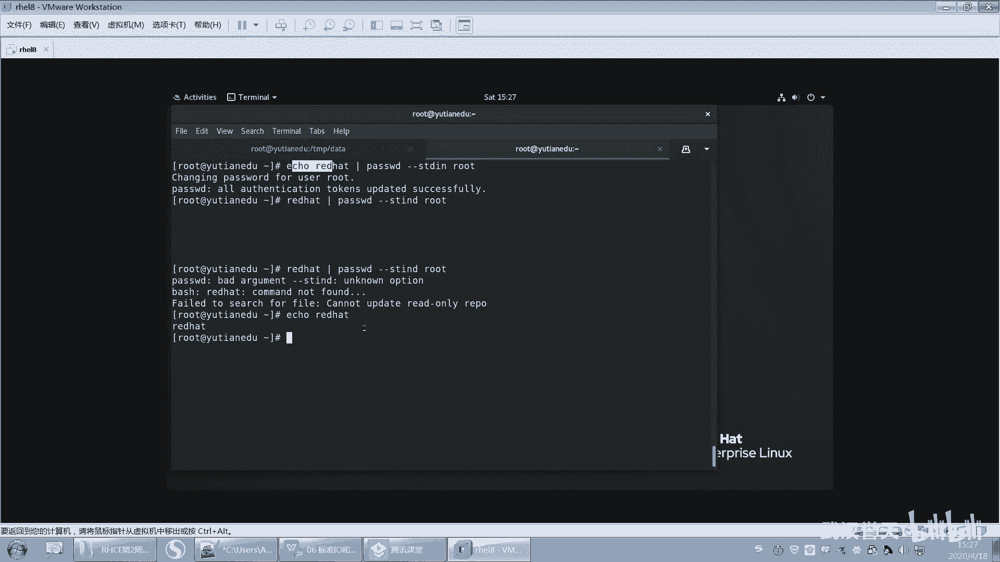

上一节我们介绍了基本的命令操作，本节中我们来看看如何控制命令的输入和输出。

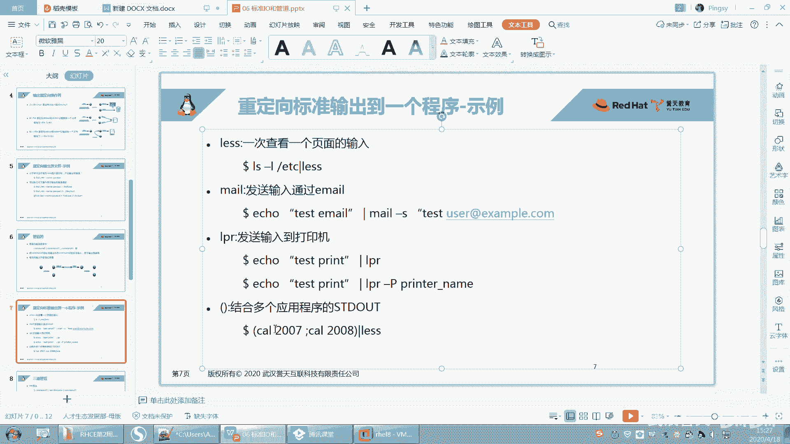

### 标准输入、输出与错误

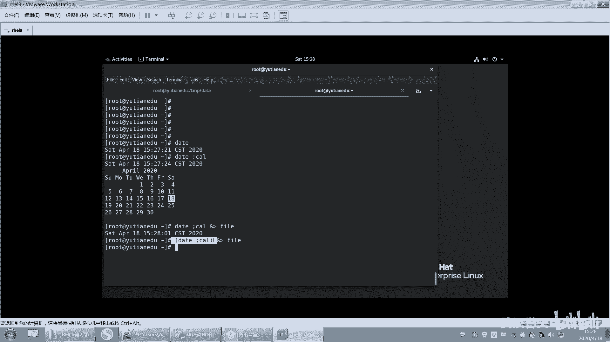

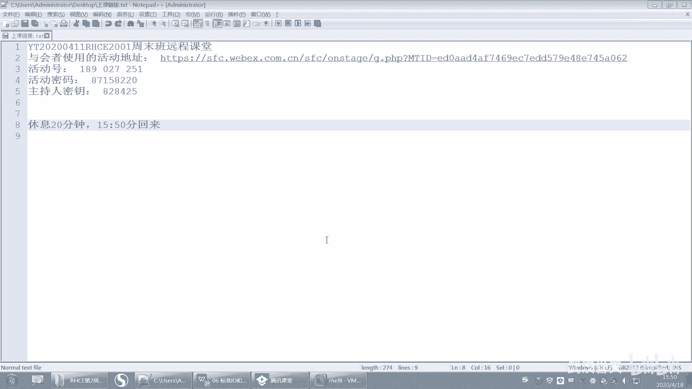

在Linux中，每个命令运行时都会打开三个默认的“数据流”：
*   **标准输入**：代码为`0`，通常来自键盘。
*   **标准输出**：代码为`1`，通常输出到终端屏幕。
*   **标准错误**：代码为`2`，通常也输出到终端屏幕。

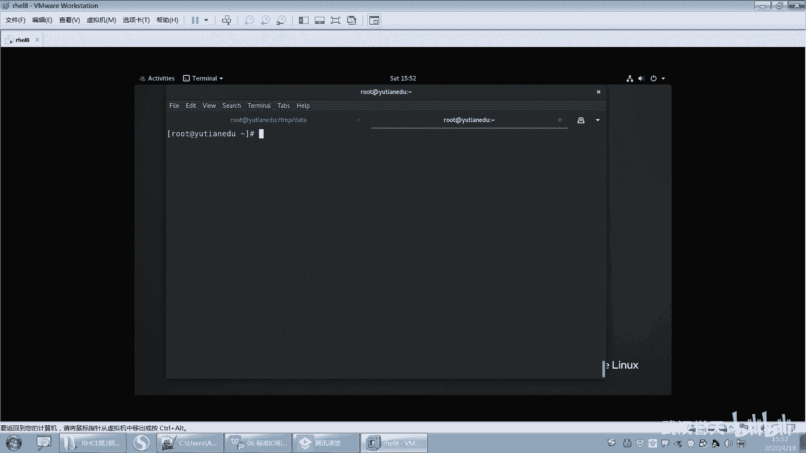

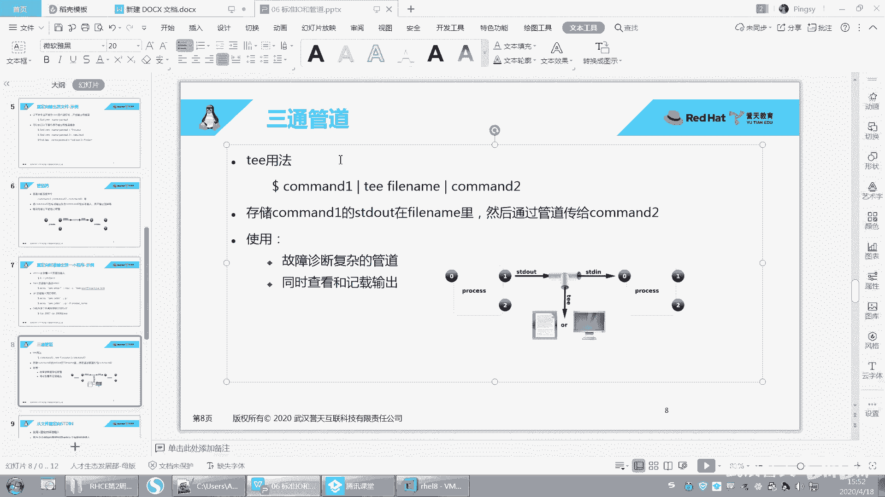

### 输出重定向

我们可以改变命令输出的目的地，例如将其保存到文件。

以下是输出重定向的常用符号：
*   `>`：将**标准输出**覆盖写入到指定文件。
    ```bash
    ls > filelist.txt
    ```
*   `>>`：将**标准输出**追加到指定文件末尾。
    ```bash
    echo "new line" >> filelist.txt
    ```
*   `2>`：将**标准错误**覆盖写入到指定文件。
    ```bash
    ls /nonexistent 2> error.log
    ```
*   `&>`：将**标准输出**和**标准错误**都覆盖写入到指定文件。
    ```bash
    ls /etc &> all_output.txt
    ```
*   `2>&1`：将**标准错误**重定向到**标准输出**的同一位置。
    ```bash
    ls /nonexistent > output.log 2>&1
    ```

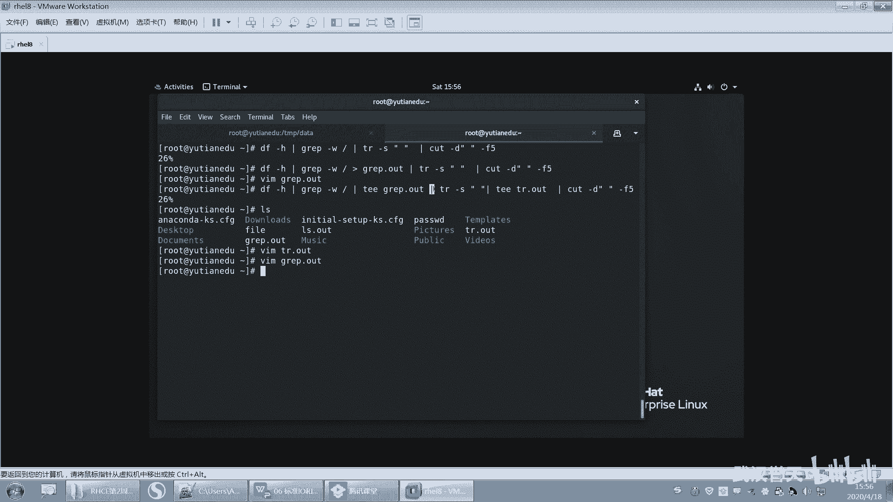

### 输入重定向与管道

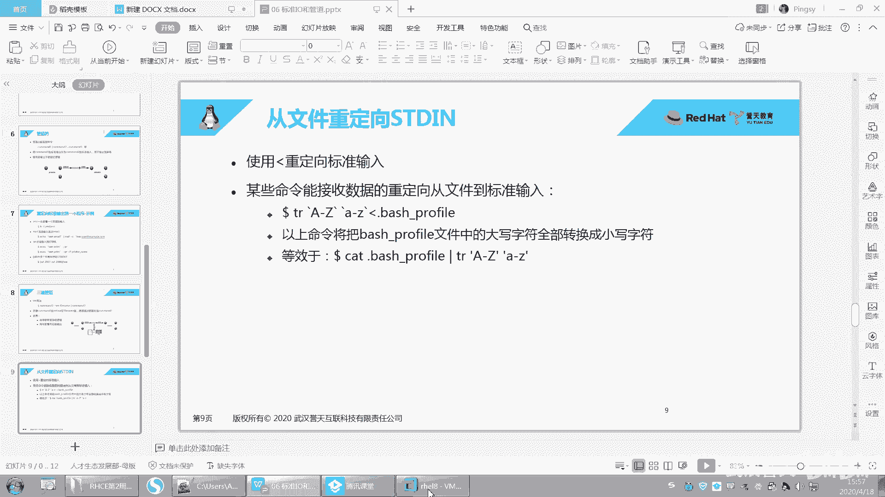

输入不仅可以来自键盘，也可以来自文件或其他命令的输出。

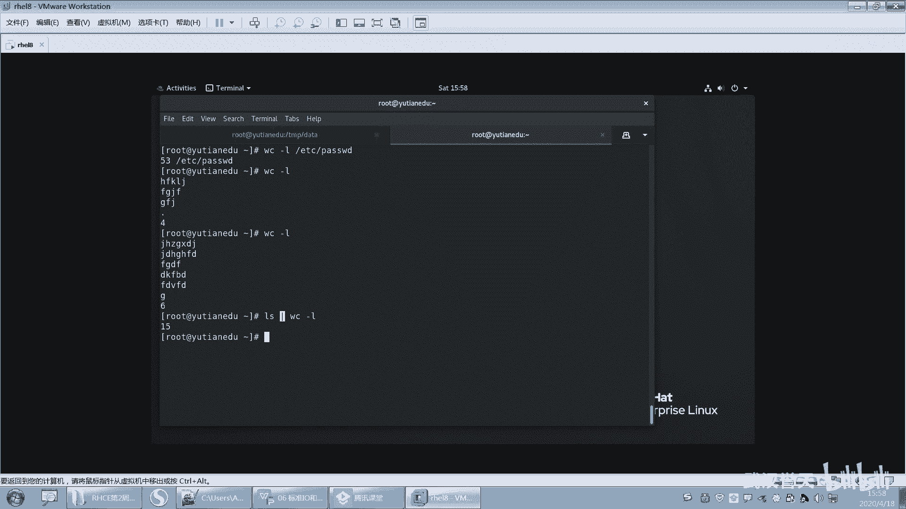

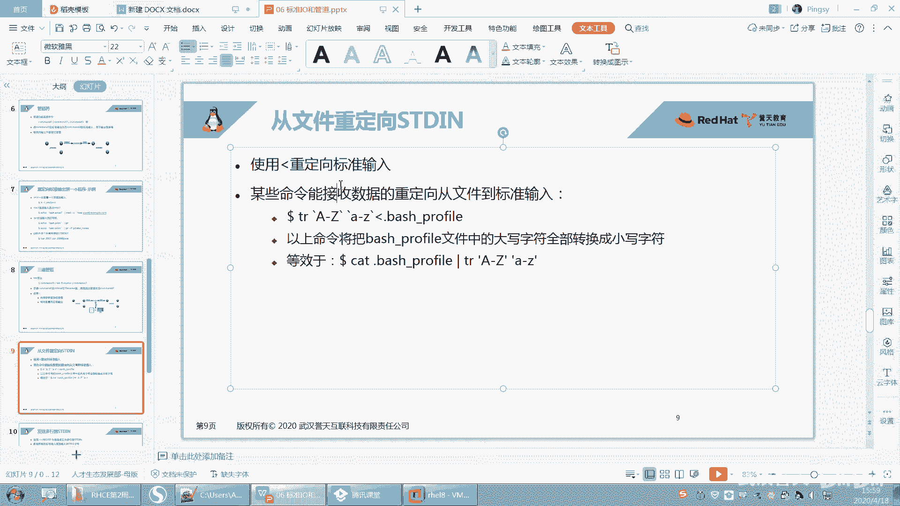

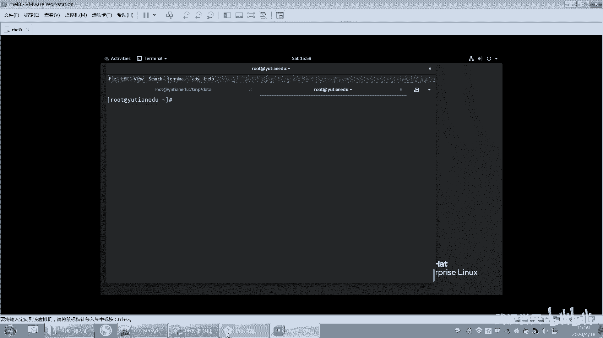

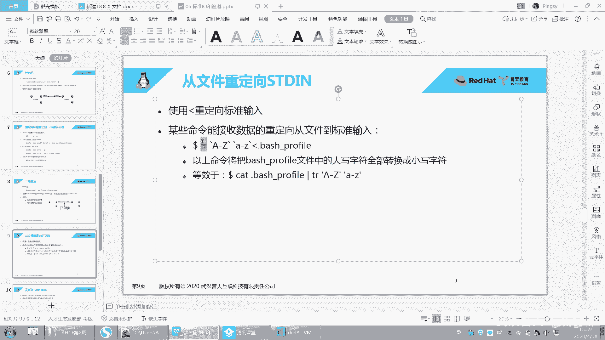

以下是输入相关的操作：
*   `<`：将文件内容作为命令的**标准输入**。
    ```bash
    wc -l < /etc/passwd
    ```
*   `<<`：多行输入，直到遇到指定的结束标记。
    ```bash
    cat > newfile.txt << EOF
    Line 1
    Line 2
    EOF
    ```
*   `|`：管道，将一个命令的**标准输出**作为下一个命令的**标准输入**。
    ```bash
    cat /etc/passwd | grep root
    ```

**重要提示**：
1.  不是所有命令都能接受来自管道的输入，通常文本处理类命令可以。
2.  输出一旦被重定向到文件，就无法再通过管道传递给下一个命令。若需同时保存和传递，可使用`tee`命令。
    ```bash
    ls /etc | tee filelist.txt | wc -l
    ```

## Vim编辑器高级使用

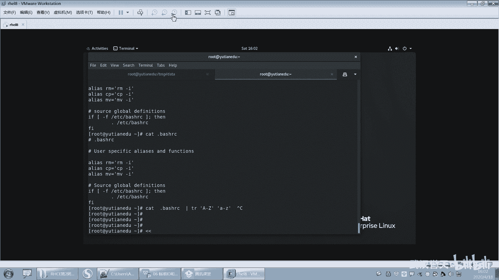

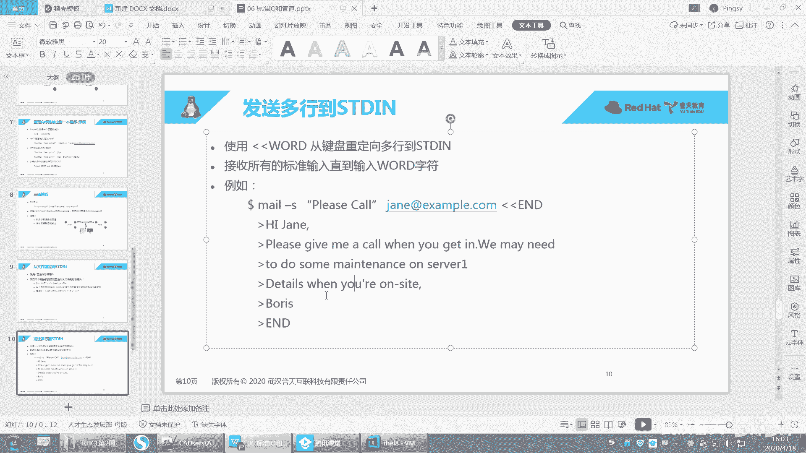

上一节我们掌握了IO操作，本节中我们来看看如何高效地使用Vim编辑器。

### Vim的三种工作模式

理解Vim的工作模式是熟练使用它的关键。

以下是Vim的三种核心模式及其切换关系：
1.  **命令模式**：启动Vim后的默认模式。在此模式下，按键被解释为命令，用于移动光标、删除、复制、粘贴等，**不能直接输入文本**。
2.  **插入模式**：在此模式下，可以像普通编辑器一样输入和编辑文本。从命令模式按 `i`、`a`、`o` 等键进入。
3.  **末行模式**：在命令模式下按 `:` 进入。用于执行保存、退出、查找替换等高级操作。

模式切换方法：
*   命令模式 -> 插入模式：按 `i`、`a`、`o` 等键。
*   插入模式 -> 命令模式：按 `Esc` 键。
*   命令模式 -> 末行模式：按 `:` 键。
*   末行模式 -> 命令模式：按 `Esc` 键或执行完命令后自动返回。

### 常用高级编辑技巧

在命令模式下，可以使用高效的快捷键进行操作。

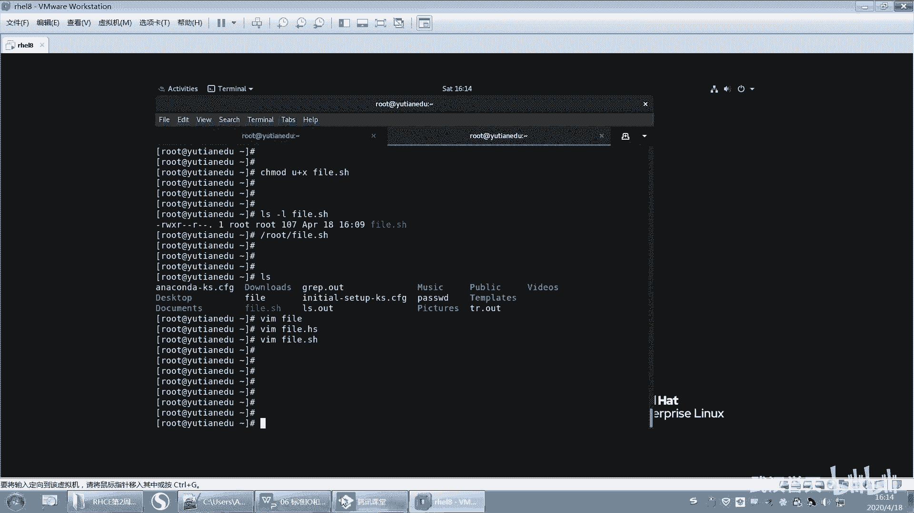

以下是命令模式下的一些实用技巧：
*   **快速移动**：
    *   `0`：跳到行首。
    *   `$`：跳到行尾。
    *   `gg`：跳到文件第一行。
    *   `G`：跳到文件最后一行。
    *   `Ctrl+f`：向下翻页。
    *   `Ctrl+b`：向上翻页。
*   **复制、粘贴与删除**：
    *   `yy`：复制当前行。
    *   `dd`：删除（剪切）当前行。
    *   `p`：在光标后粘贴。
    *   `u`：撤销上一次操作。
*   **查找与替换**（在末行模式下）：
    *   `/keyword`：向下查找关键词。
    *   `:%s/old/new/g`：将文件中所有的 `old` 替换为 `new`。

### 可视化模式

Vim还提供了可视化模式，用于选择文本块。

进入和退出可视化模式的方法：
*   命令模式下按 `v` 进入字符可视化模式。
*   命令模式下按 `V` 进入行可视化模式。
*   按 `Esc` 退出可视化模式。

在可视化模式下，可以用方向键或 `h`、`j`、`k`、`l` 键选择文本，然后进行复制、删除等操作。

---

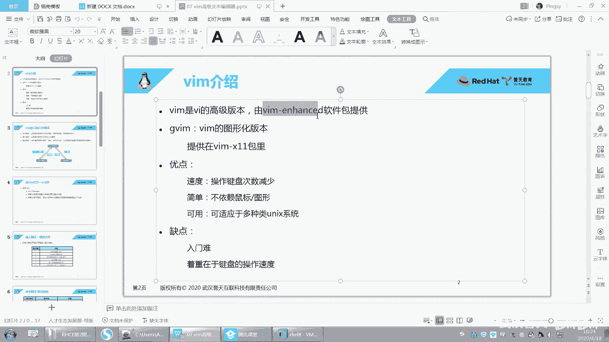

本节课中我们一起学习了Linux的IO重定向和管道，掌握了如何灵活控制命令的输入输出流。同时，我们也深入了解了Vim编辑器的三种工作模式及高效编辑技巧。理解并熟练运用这些知识，将极大提升你在命令行环境下的工作效率。