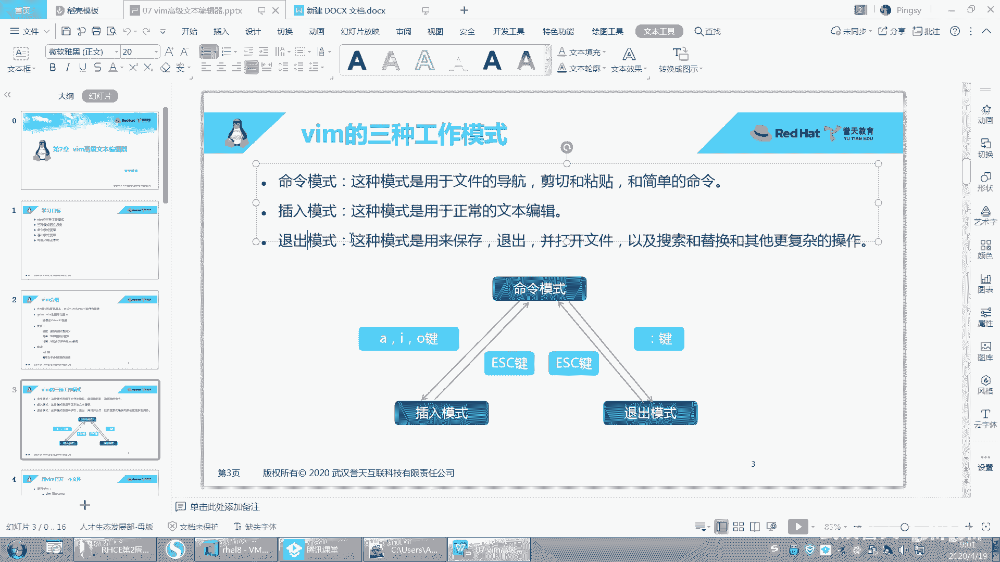
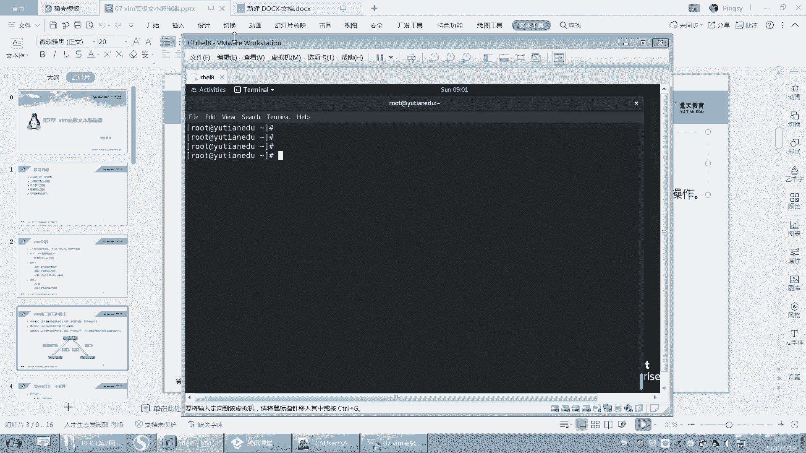
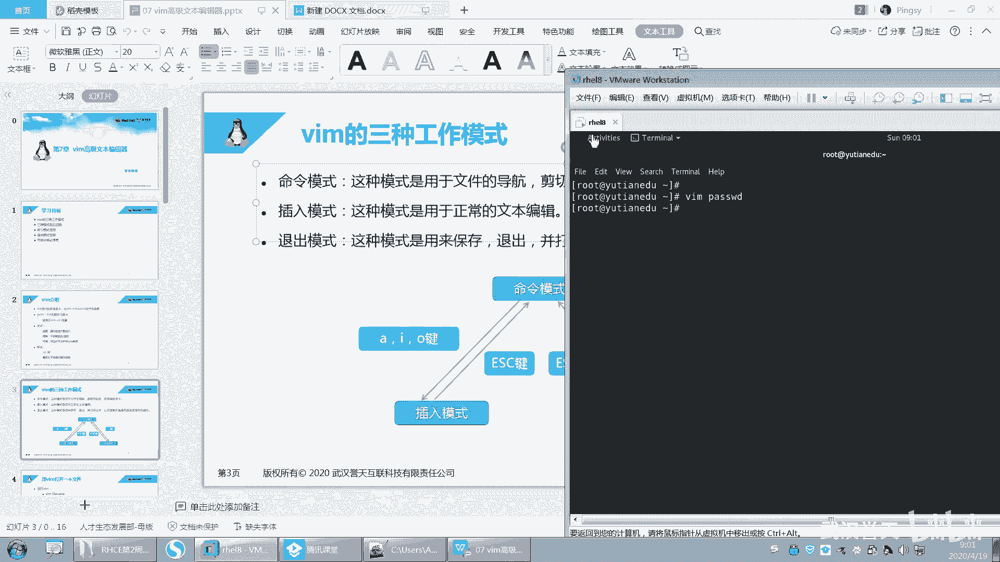
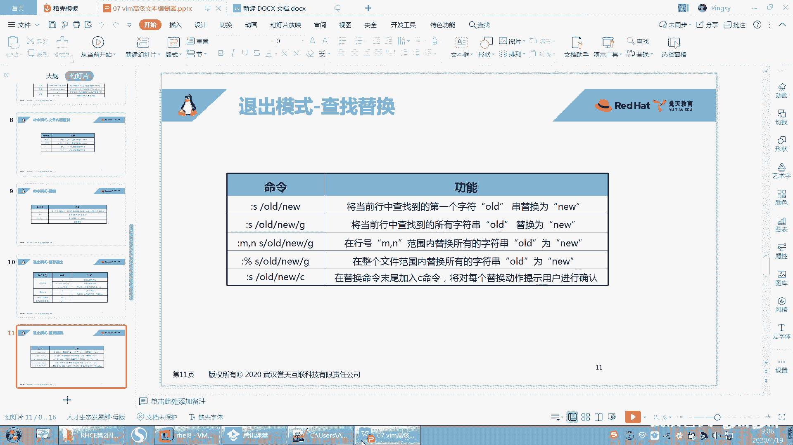
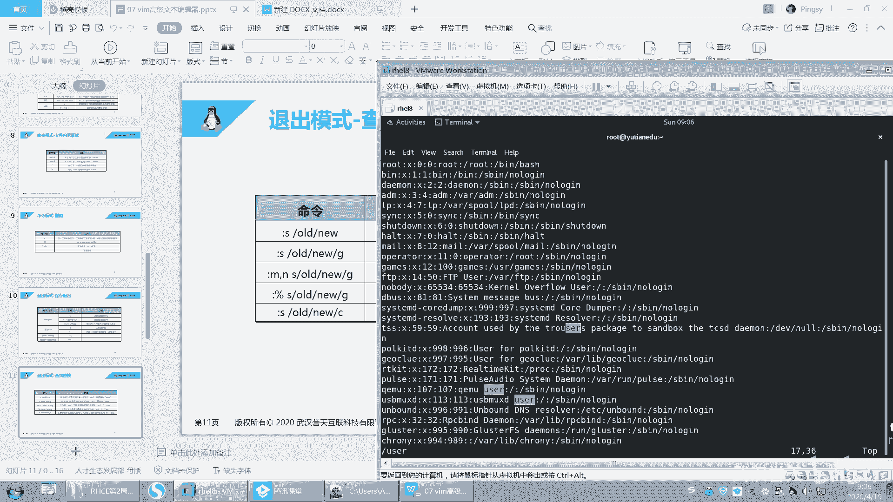
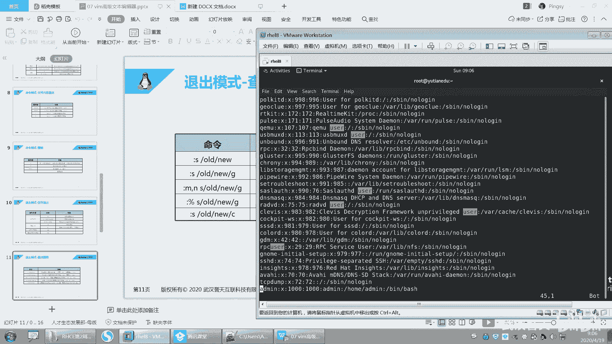
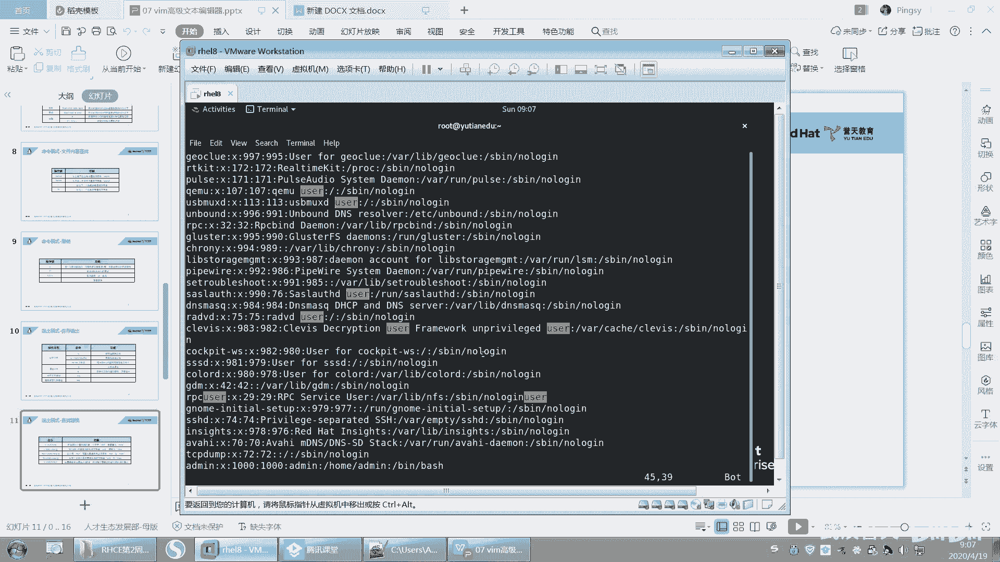
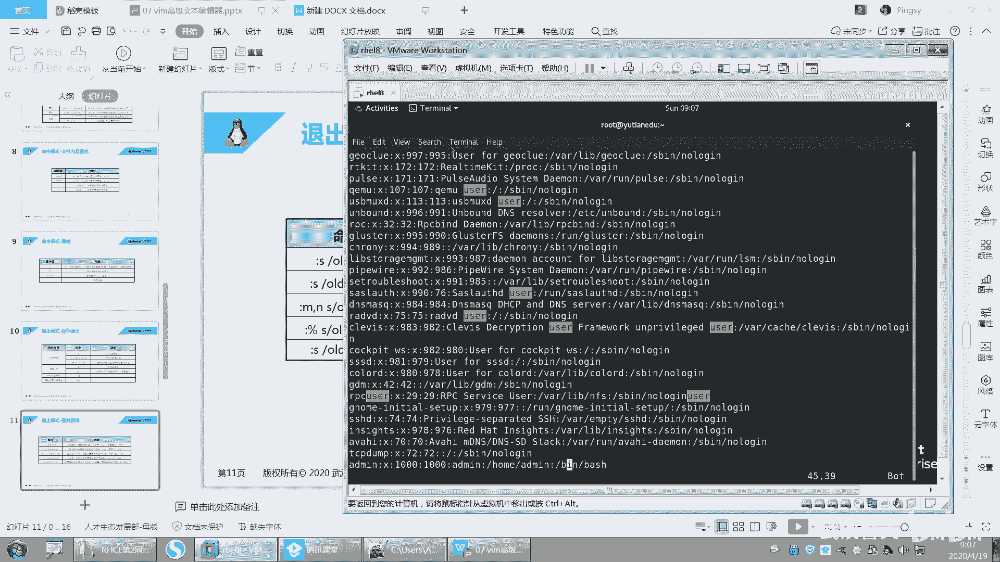
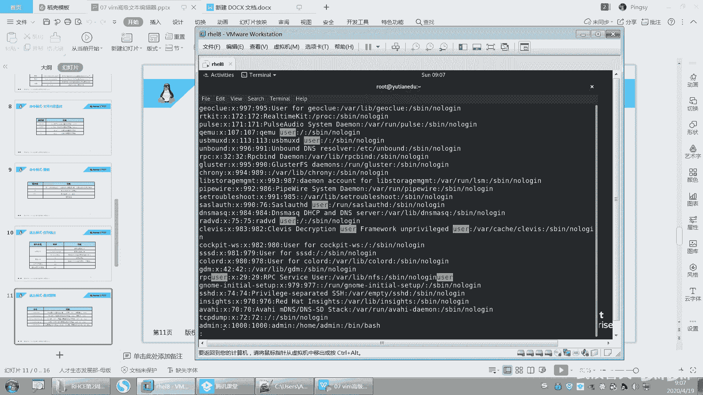

Linux文本编辑：P29：vim的高级使用2-29

在本节课中，我们将继续深入学习vim编辑器的高级功能，特别是退出模式下的查找与替换操作。上一节我们介绍了vim的基本工作模式和命令模式下的常用操作，本节中我们来看看如何在退出模式下进行更复杂的文本处理。



## 回顾：vim的三种工作模式



vim有三种主要的工作模式：**命令模式**、**插入模式**和**退出模式**。

*   **命令模式**是打开文件后的默认模式。在此模式下，可以移动光标、剪切、粘贴和执行简短命令。按 `ESC` 键可以从任何其他模式返回命令模式。
*   **插入模式**用于正常编辑和输入文本。可以通过按 `i`、`I`、`a`、`A`、`o`、`O` 等键从命令模式进入。
*   **退出模式**用于保存文件、退出编辑器或执行更复杂的操作。在命令模式下按 `:` 键即可进入退出模式。



## 命令模式下的核心操作摘要

以下是命令模式下一些关键操作的快速回顾：

*   **移动光标**：使用 `h`、`j`、`k`、`l` 或方向键。`Home` 键到行首，`End` 键到行尾。`Page Up` 和 `Page Down` 翻页。
*   **复制、剪切与粘贴**：
    *   `dd`：剪切当前行。
    *   `yy`：复制当前行。
    *   `p` 或 `P`：粘贴。
    *   `x`：删除光标处的字符。
*   **搜索**：按 `/` 后输入关键词进行向下搜索，按 `n` 查找下一个，按 `N` 查找上一个。按 `?` 后输入关键词则进行向上搜索。
*   **撤销与重做**：
    *   `u`：撤销上一次操作。
    *   `Ctrl + r`：取消最后一次撤销（重做）。

## 退出模式下的查找与替换

现在，我们重点学习在退出模式下如何进行查找和替换。这个功能对于批量修改文本非常有用。

**基本替换命令格式如下：**

```
:s/旧文本/新文本/
```

这个命令会将**当前光标所在行**的**第一个**匹配到的“旧文本”替换为“新文本”。

**如果要替换当前行的所有匹配项，需要加上 `g` 标志：**

```
:s/旧文本/新文本/g
```

**如果需要在指定的多行范围内进行替换，可以使用行号范围：**

```
:起始行号,结束行号s/旧文本/新文本/g
```

例如，`:1,10s/foo/bar/g` 会将第1行到第10行中所有的 `foo` 替换为 `bar`。



**如果需要对整个文件进行全局替换，可以使用 `%` 代表所有行：**

```
:%s/旧文本/新文本/g
```





**操作示例：**
假设我们打开一个文件，并希望将其中所有的 `user` 替换为 `USER`。
1.  在命令模式下，可以按 `/user` 先搜索并高亮所有 `user`。
2.  按 `ESC` 确保回到命令模式，然后输入 `:` 进入退出模式。
3.  输入 `%s/user/USER/g` 并按回车。
4.  文件中所有的 `user` 就会被替换为 `USER`。



**重要提示：** 替换命令末尾的 `g` 表示全局（global）替换，即替换行内所有匹配项。如果省略 `g`，则只替换每行的第一个匹配项。



## 总结



本节课中我们一起学习了vim退出模式下的强大功能——查找与替换。我们掌握了替换命令 `:s` 的基本语法，以及如何通过指定行号范围或使用 `%` 符号来对部分或整个文件进行文本替换。结合上节课学习的模式切换、光标移动、复制粘贴等操作，你现在已经能够使用vim高效地完成大多数文本编辑任务了。记住，熟练使用vim的关键在于理解其模式设计并多加练习。