# 誉天红帽RHCE 8.0系列培训：P2：rhel8.0系统安装-02

在本节课中，我们将学习如何在VMware Workstation中配置虚拟机的硬件参数，并启动RHEL 8.0的安装程序。我们将详细讲解CPU、内存、网络和磁盘等关键硬件的配置选项，并开始系统的安装过程。

## CPU与核心、线程的关系

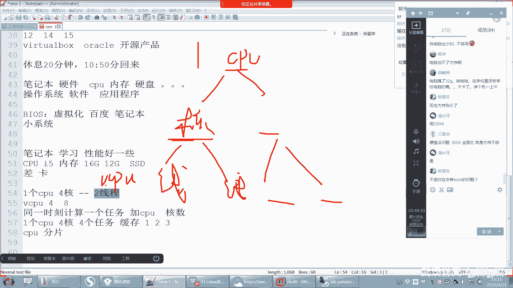

上一节我们介绍了创建虚拟机的基本流程，本节中我们来看看如何配置虚拟机的硬件，特别是理解CPU的核心与线程概念。

CPU（中央处理器）是计算机的核心计算单元。现代CPU内部包含多个“核心”（Core），每个核心都是一个独立的处理单元，可以执行计算任务。核心之间会共享缓存（Cache），这有助于提升数据访问效率。

**核心（Core）** 在同一时间只能处理一个计算任务。但CPU利用时间分片原理，将一个单位时间切割成多个片段，从而模拟出同时处理多个任务的能力。这种模拟出来的处理单元被称为“线程”（Thread）。

**线程（Thread）** 是虚拟出来的逻辑处理器，并非物理核心。一个物理核心可以模拟出多个线程（例如，两个线程）。因此，一个多核CPU能提供的虚拟CPU（vCPU）数量是：**核心数 × 每个核心的线程数**。

例如，一个4核CPU，若每个核心支持2个线程，则可以提供 `4 × 2 = 8` 个vCPU。在配置虚拟机时，分配的vCPU数量不应超过物理CPU能提供的最大vCPU数。

## 配置虚拟机硬件参数

理解了CPU的基本概念后，我们继续配置虚拟机的其他硬件。

### 内存配置

内存（RAM）为运行中的系统和程序提供临时存储空间。对于仅运行基础Linux系统的虚拟机，分配2GB内存通常足够。分配过多内存可能造成物理主机资源浪费。

### 网络配置

网络配置决定了虚拟机如何与外部网络通信。VMware提供了三种主要模式：

以下是三种网络模式的区别：
*   **桥接模式（Bridged）**：虚拟机的网络直接连接到物理网络，就像一台独立的物理机，可以访问外部网络（如互联网）。
*   **NAT模式**：虚拟机通过物理主机的网络地址转换（NAT）功能访问外部网络，外部网络无法直接访问虚拟机。
*   **仅主机模式（Host-Only）**：虚拟机只能与物理主机及其他处于同一“仅主机”网络下的虚拟机通信，无法访问外部网络。

对于初学阶段，选择任何一种可上网的模式（桥接或NAT）或仅主机模式均可。后续学习网络知识时会详细讲解。此处我们选择“仅主机模式”。

### 磁盘控制器与磁盘类型

接下来配置存储设备。

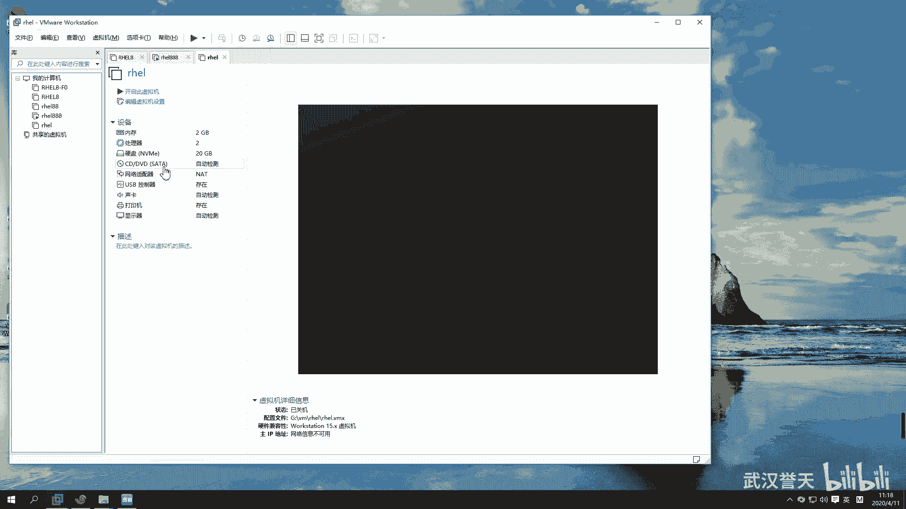

**磁盘控制器类型**负责管理虚拟机与虚拟磁盘之间的数据传输。保持默认的推荐类型即可。

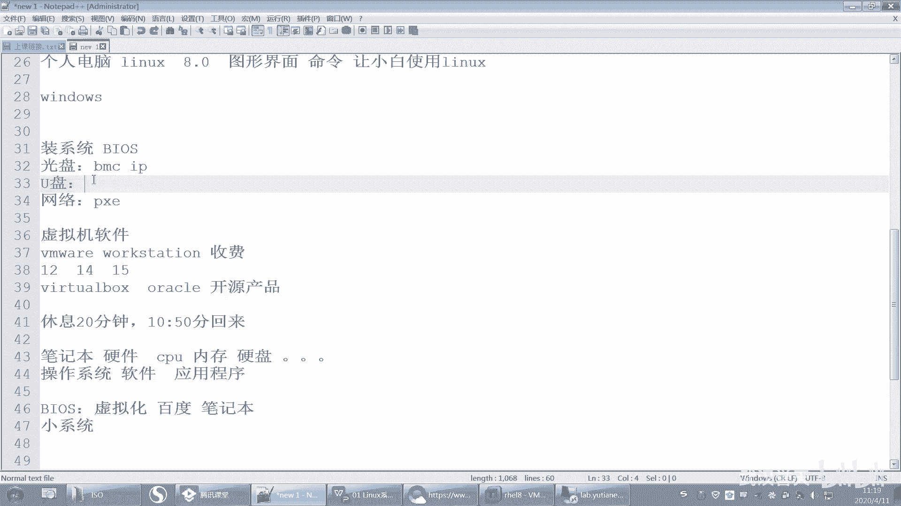

**磁盘类型**决定了虚拟磁盘模拟的硬件接口。常见选项有：
*   **IDE**：较古老的接口，性能一般。
*   **SCSI**：目前服务器和虚拟机中常用的磁盘接口类型。
*   **NVMe**：模拟高性能的固态硬盘（SSD）接口，性能更佳。

对于RHEL 8.0，选择SCSI或NVMe类型均可。我们选择 **SCSI** 类型。

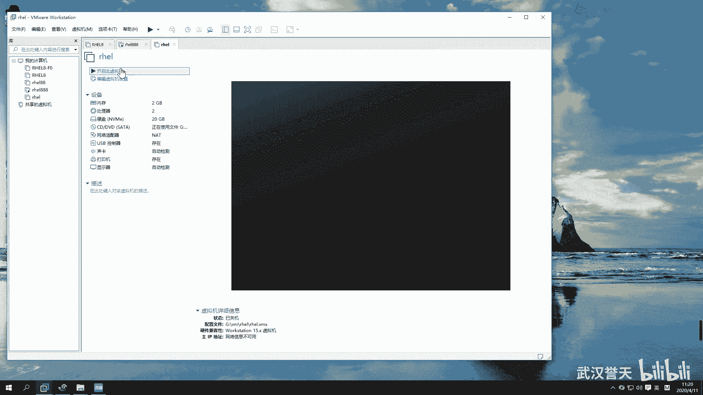

### 创建虚拟磁盘

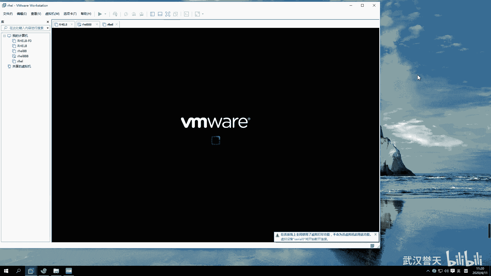

现在需要为虚拟机创建存储空间。

以下是创建磁盘时的三个选项：
*   **创建新虚拟磁盘**：创建一个全新的虚拟磁盘文件（如 `.vmdk` 文件）。
*   **使用现有虚拟磁盘**：使用之前创建好的虚拟磁盘文件，适用于快速部署相同系统。
*   **使用物理磁盘**：直接使用物理主机的一块硬盘或分区，性能最好，但操作有风险。

对于全新安装，我们选择第一个选项“**创建新虚拟磁盘**”。

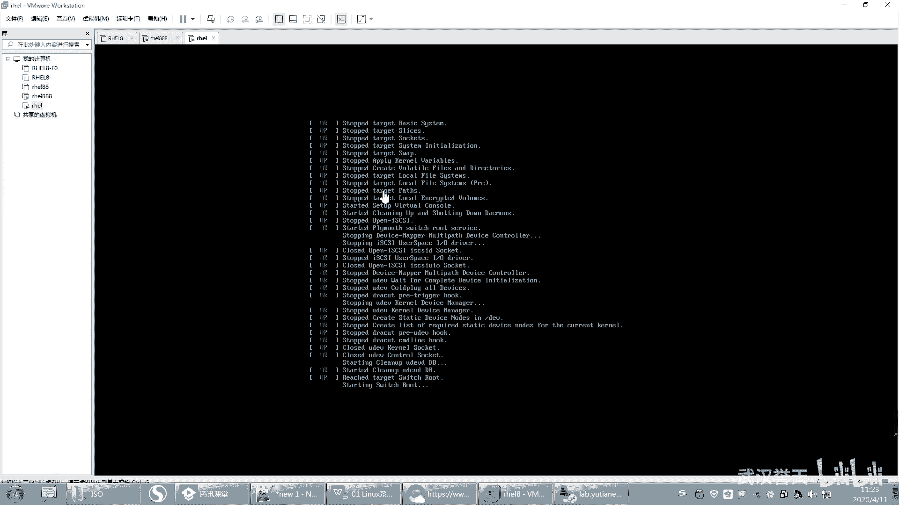

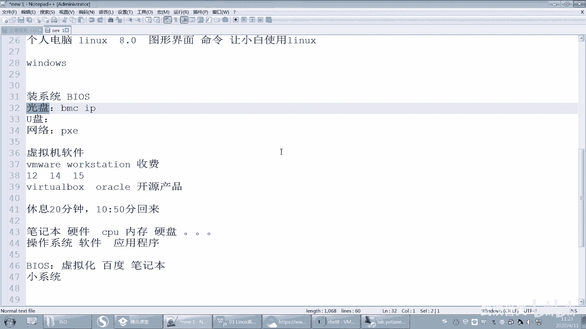

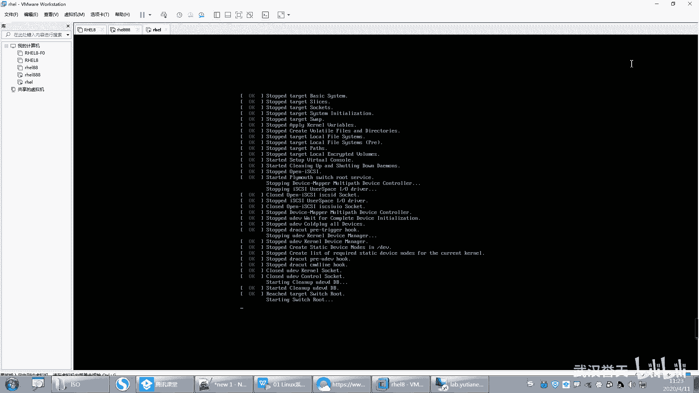

设置磁盘大小时，默认的20GB对于安装基础系统并完成实验通常足够。虚拟磁盘空间是“按需分配”的，即虚拟机实际使用了多少空间，物理磁盘上才会占用多少，最多不超过设定的20GB上限。

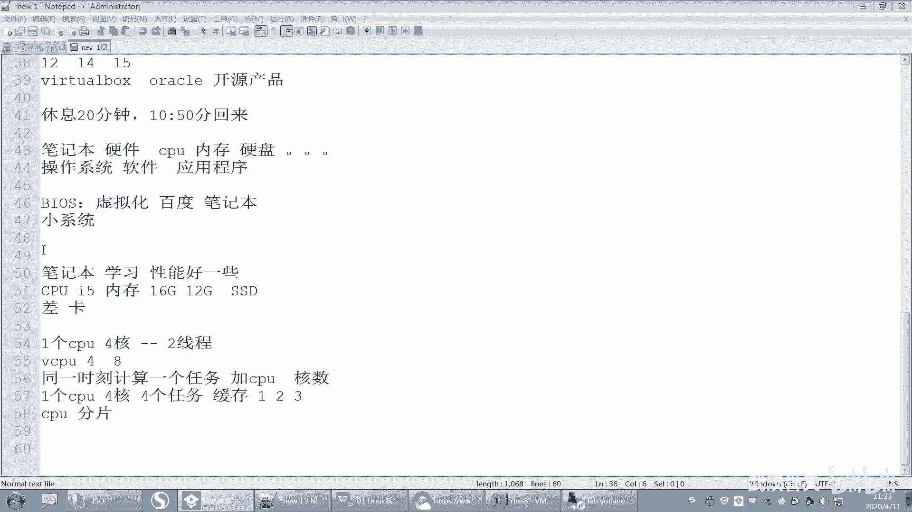

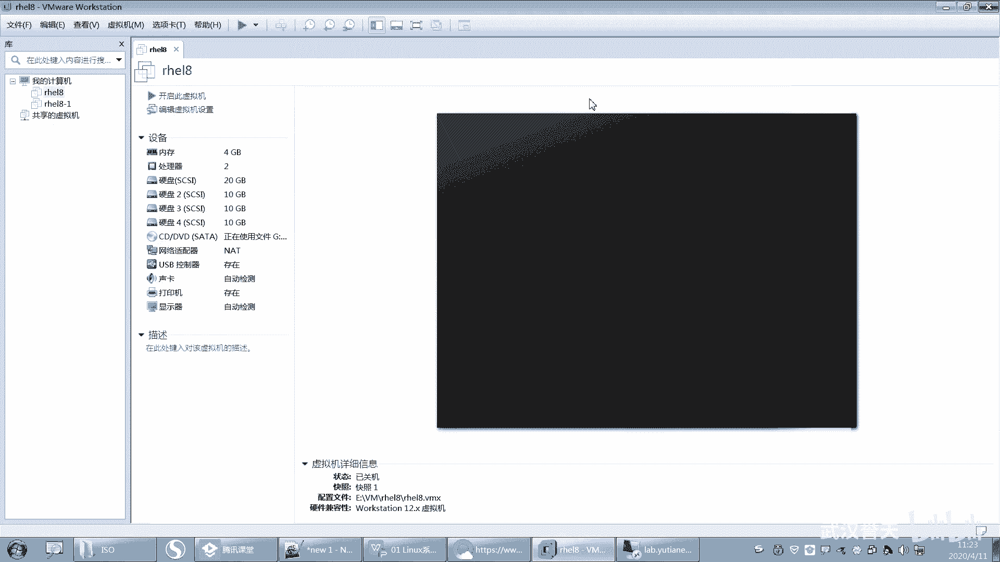

有两个高级选项需要注意：
1.  **立即分配所有磁盘空间**：如果勾选，物理磁盘会立即划出20GB的连续空间给虚拟机，性能更好，但会立刻占用20GB空间。
2.  **将虚拟磁盘拆分成多个文件**：将单个大磁盘文件分割成多个小文件，便于移动和存储，但可能轻微影响性能。

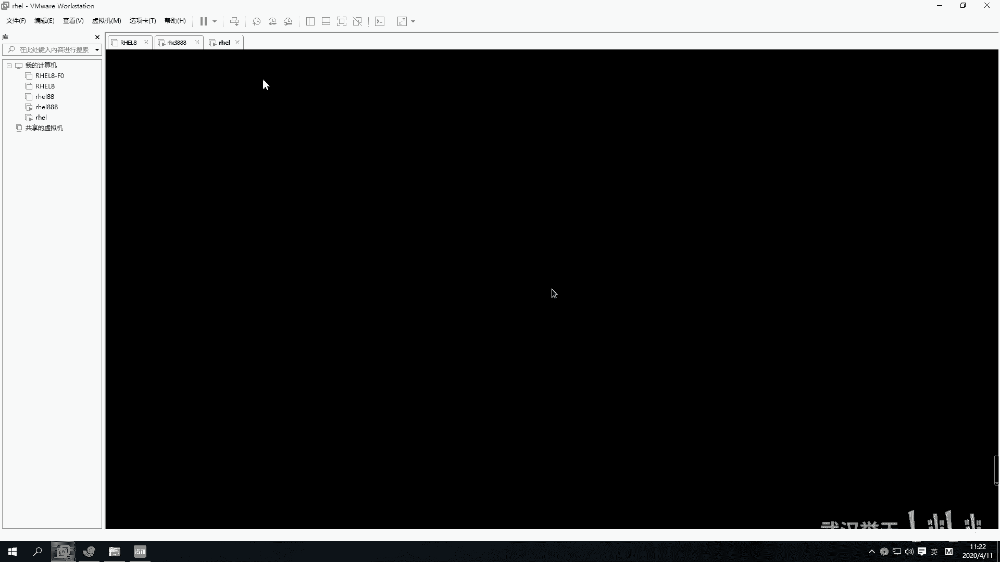

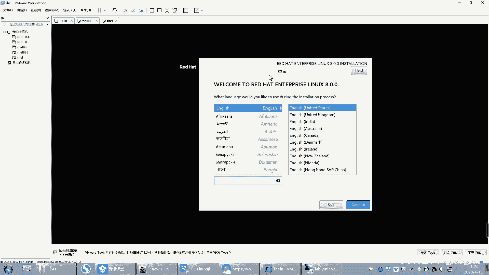

我们保持默认设置（不立即分配，拆分成多个文件）即可。

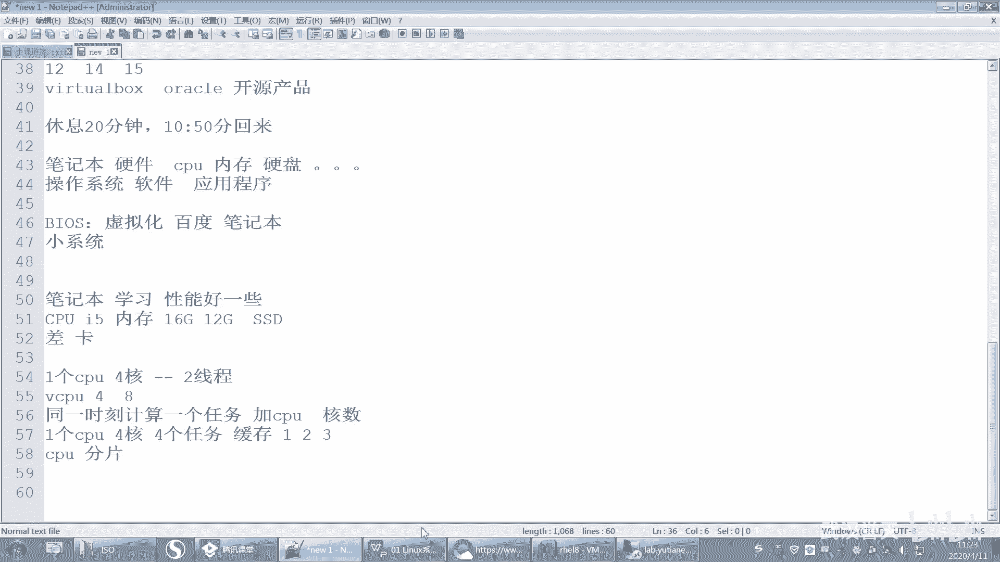

完成以上步骤后，虚拟机的硬件（CPU、内存、网卡、硬盘）就已准备就绪。

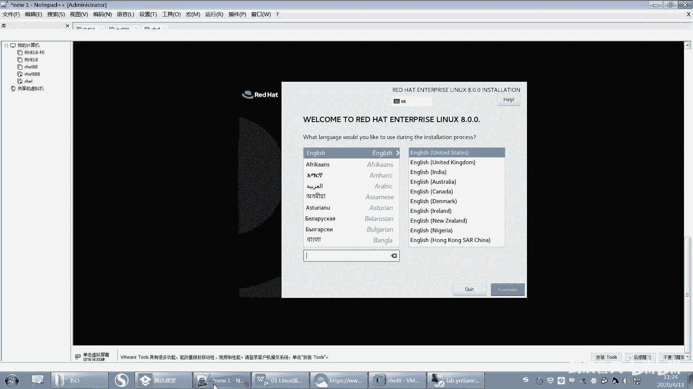

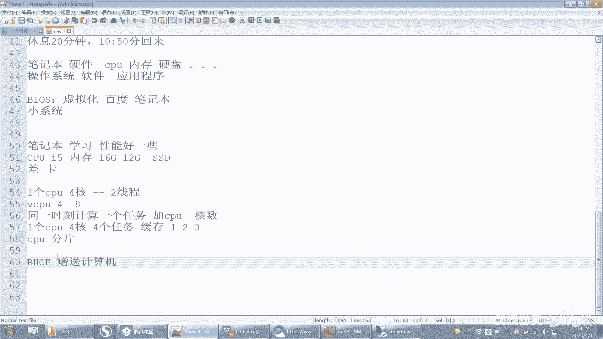

## 连接安装介质并启动安装

硬件配置完成后，我们需要为虚拟机“插入”系统安装光盘（即ISO镜像文件）。

1.  在虚拟机设置中，找到“CD/DVD”设备。
2.  选择“使用ISO映像文件”，然后浏览并选中你下载的RHEL 8.0 ISO文件。
3.  确保设备状态为“已连接”或勾选了“启动时连接”。

现在可以启动虚拟机。虚拟机会从刚才连接的ISO文件启动，进入安装引导界面。

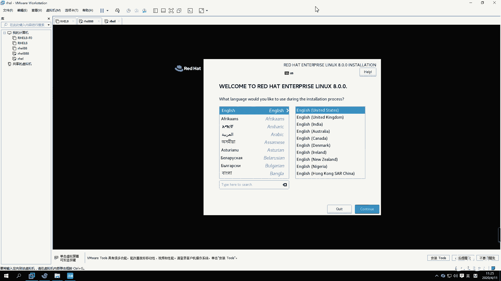

以下是启动后的菜单选项：
*   **Install Red Hat Enterprise Linux 8.0**：直接开始安装。
*   **Test this media & install Red Hat Enterprise Linux 8.0**：先检测安装介质完整性，再安装。耗时较长。
*   **Troubleshooting**：进入故障排除模式，用于修复已安装的系统。

我们使用键盘上下键选择第一个选项“**Install Red Hat Enterprise Linux 8.0**”，然后按回车键开始安装。

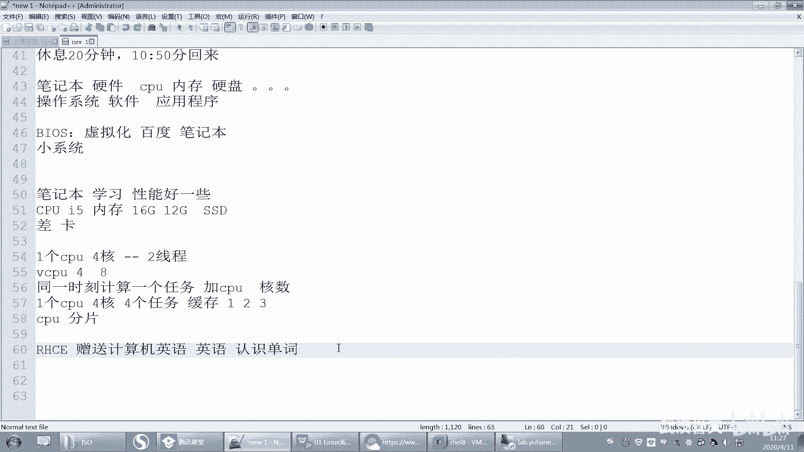

## 安装过程初始设置

系统开始加载安装程序。首先会提示选择安装过程中的界面语言。**强烈建议选择英文（English）**，这有助于熟悉Linux环境下的英文术语，对后续学习和工作至关重要。

进入安装概览界面后，可以进行几项关键设置：
*   **键盘布局（KEYBOARD）**：保持默认的“美式英语”即可。
*   **语言支持（LANGUAGE SUPPORT）**：此处选择的是安装程序界面语言以及系统将要安装的语言包。即使你在此处只选择了英文，系统安装后也可以再添加中文支持。

---

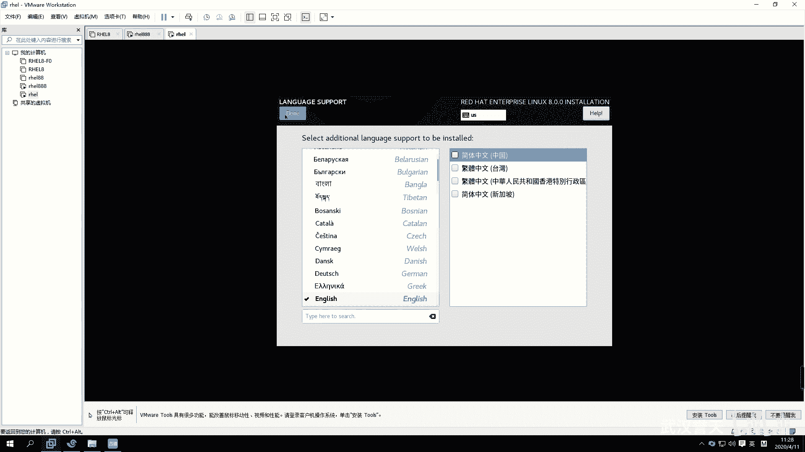

本节课中我们一起学习了虚拟机CPU核心与线程的概念，并完成了虚拟机内存、网络、磁盘等硬件的配置。接着，我们连接了RHEL 8.0的安装镜像，启动了安装程序，并进行了初始的安装语言设置。下一节，我们将继续完成分区、用户设置等关键的安装步骤。