# 誉天红帽RHCE 8.0系列培训：P30：vim的高级使用2-30

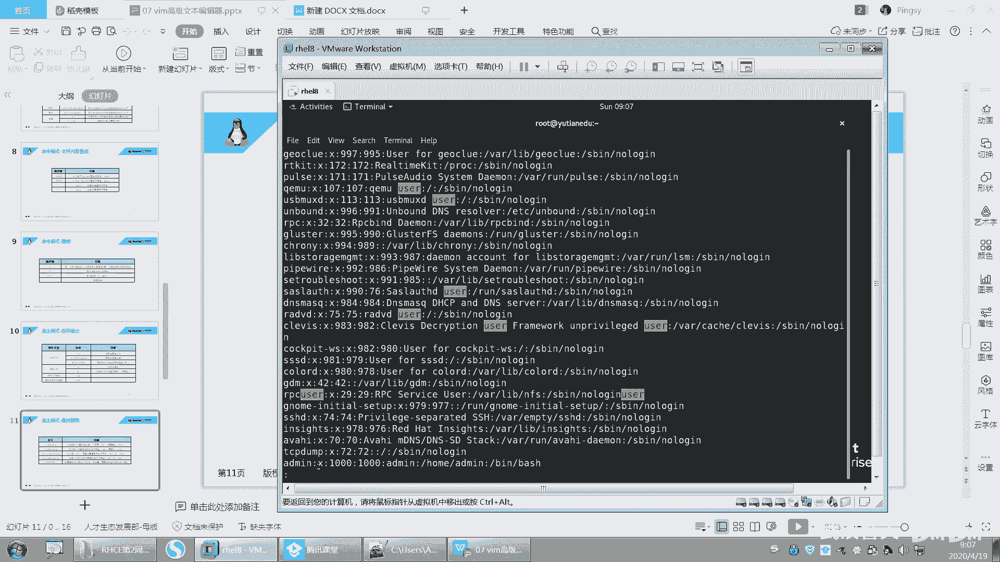

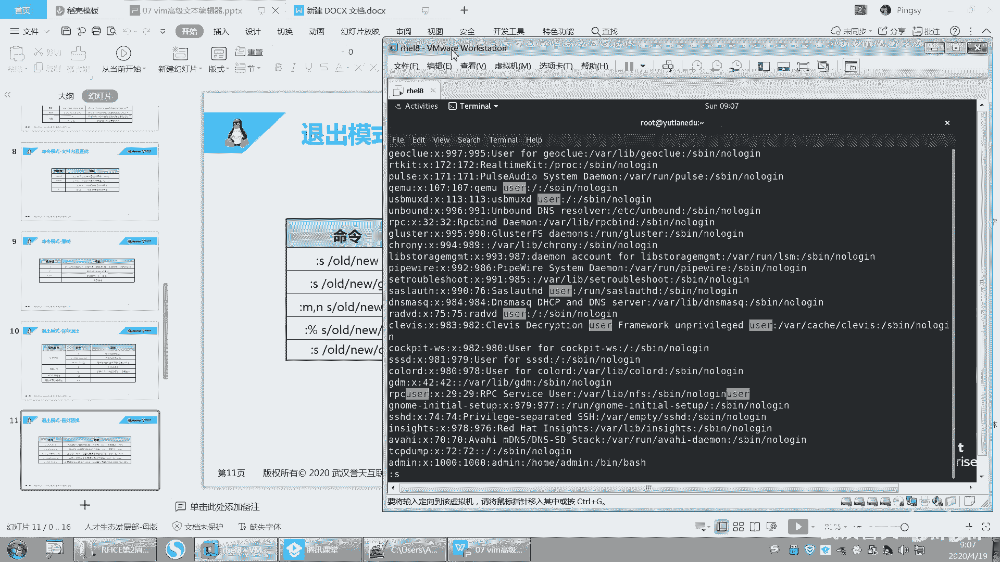

在本节课中，我们将要学习vim编辑器中查找替换功能的详细用法，并初步了解可视化模式。这些高级技巧能显著提升文本编辑的效率。

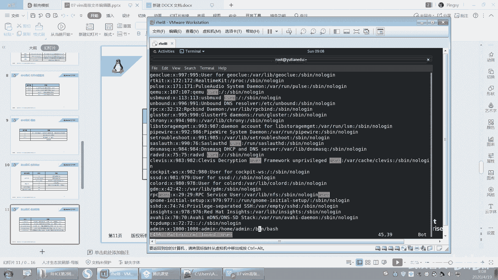

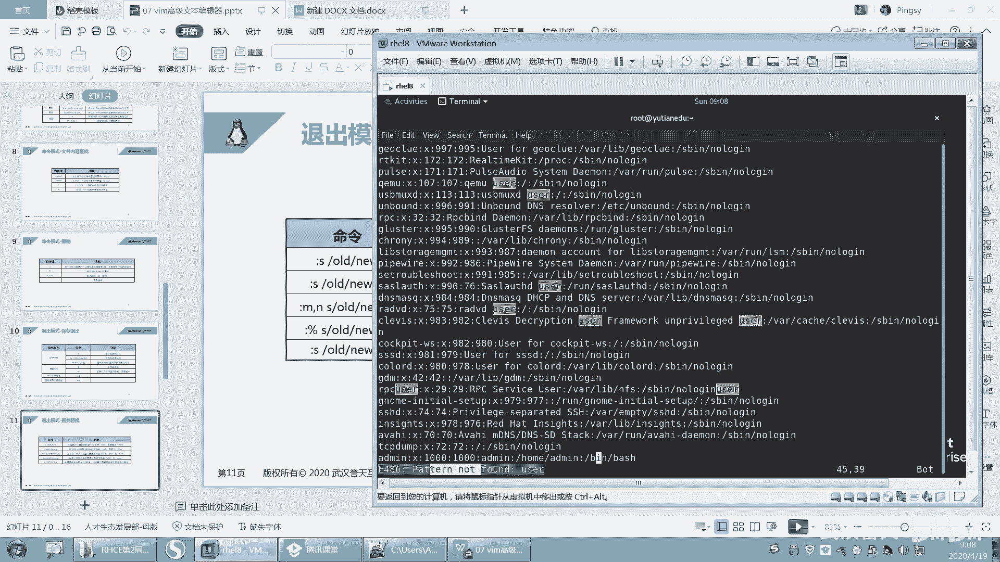

上一节我们介绍了vim的基本模式与操作，本节中我们来看看vim强大的查找与替换功能。

## 查找与替换

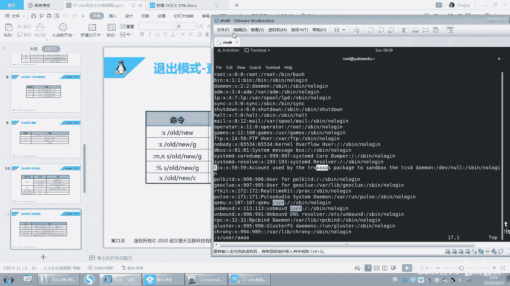

在vim中，可以使用 `:s` 命令进行查找和替换。其基本语法是 `:s/查找内容/替换内容/`。这个命令默认只对光标所在行的第一个匹配项生效。

例如，将光标所在行的第一个“user”替换为“AAAA”：
```
:s/user/AAAA/
```

如果希望在整个文件中进行替换，需要在命令前加上 `%` 符号，它代表整个文件的范围。

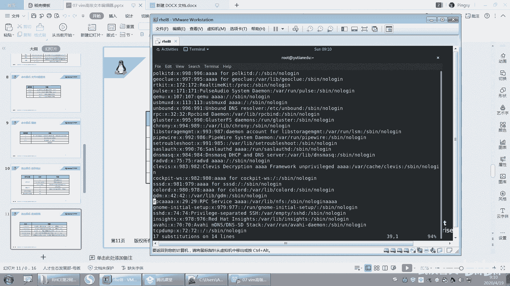

对整个文件进行替换的语法如下：
```
:%s/查找内容/替换内容/
```

## 替换命令的修饰符

默认情况下，替换命令只作用于每行的第一个匹配项。为了更精确地控制替换行为，可以使用以下修饰符。

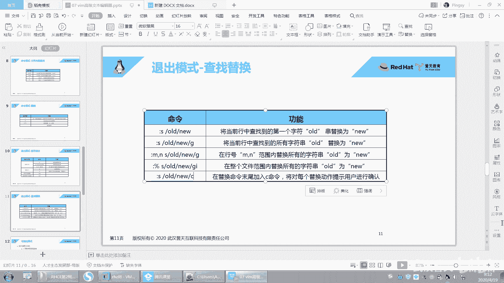

以下是常用的替换修饰符及其作用：

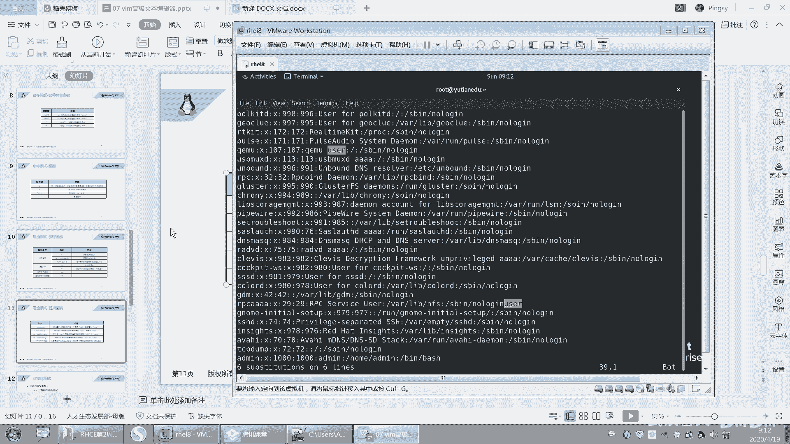

*   **g**： 全局替换。对指定范围内的所有匹配项进行替换，而不仅仅是每行的第一个。
    *   示例：`:%s/user/AAAA/g` 会将文件中所有的“user”替换为“AAAA”。
*   **i**： 忽略大小写。进行查找时，不区分字母的大小写。
    *   示例：`:%s/user/AAAA/gi` 会忽略大小写，将“User”、“USER”等都替换为“AAAA”。
*   **c**： 确认替换。在每次替换前会询问用户是否确认，输入 `y` 表示确认，`n` 表示跳过。
    *   示例：`:%s/user/AAAA/gc` 会在每次替换前弹出确认提示。

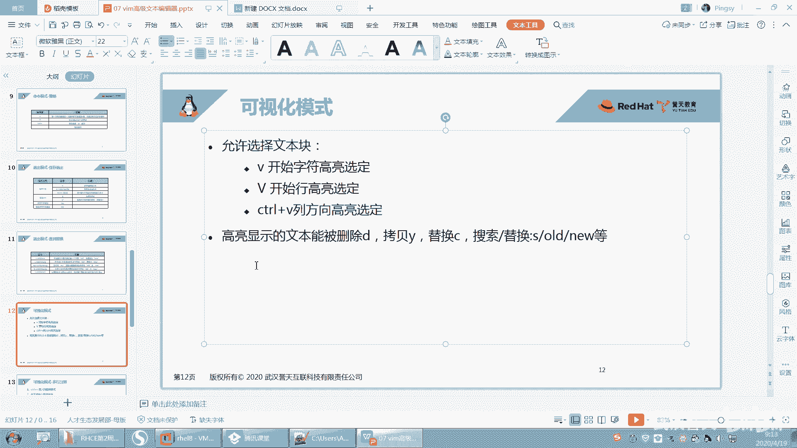

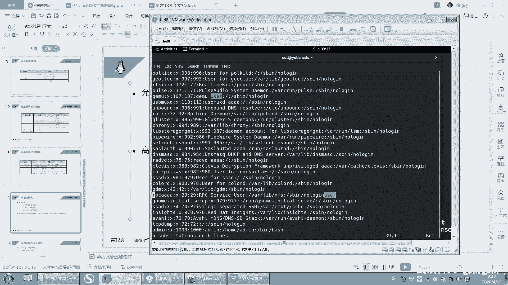

此外，还可以指定替换的行范围，格式为 `:起始行,结束行s/查找内容/替换内容/`。例如，`:10,20s/user/AAAA/g` 只会替换第10行到第20行之间的内容。

## 可视化模式简介

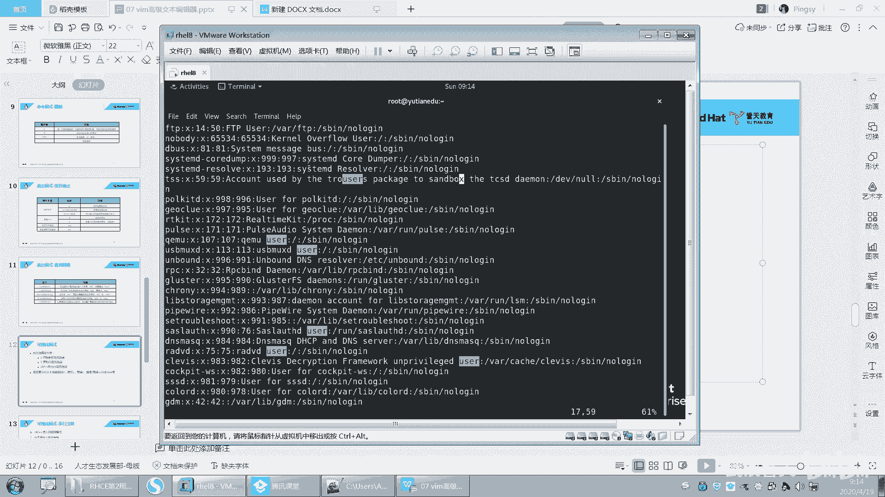

之前我们学习的删除、复制等操作通常以行为单位。vim的可视化模式允许我们像使用鼠标一样，自由地选择文本块（可以是几个字符、几行或一个矩形区域），然后对选中的内容进行操作。

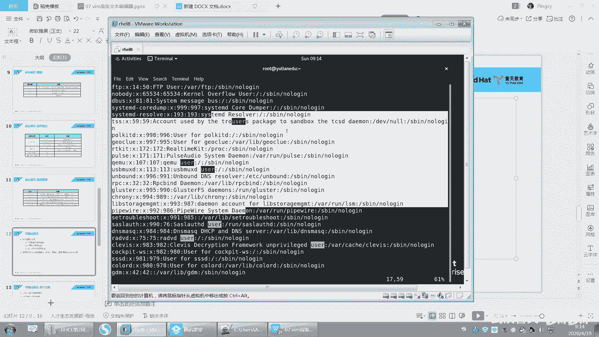

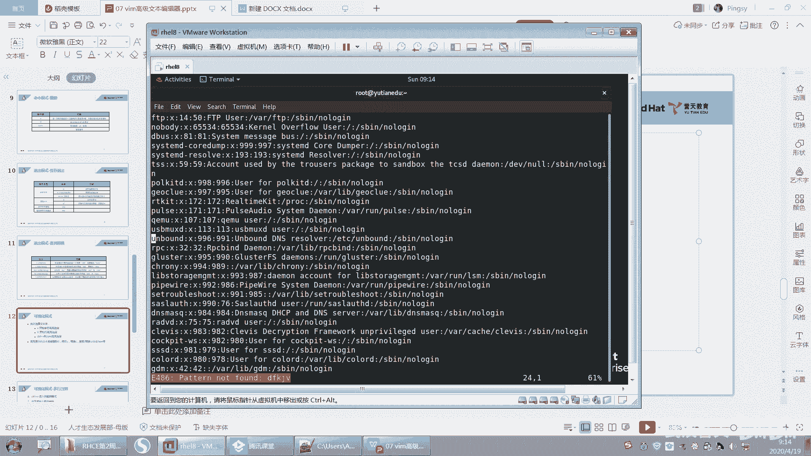

进入可视化模式非常简单，只需在普通模式下按下 `v` 键。此时，移动光标就可以选择文本。选中后，可以按 `y` 进行复制，或按 `d` 进行删除等操作。

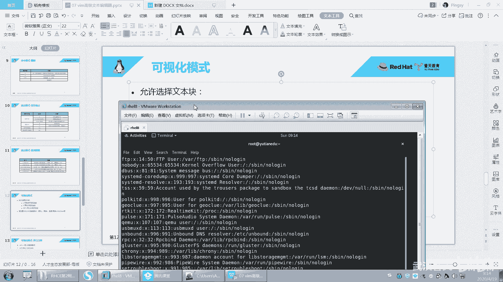

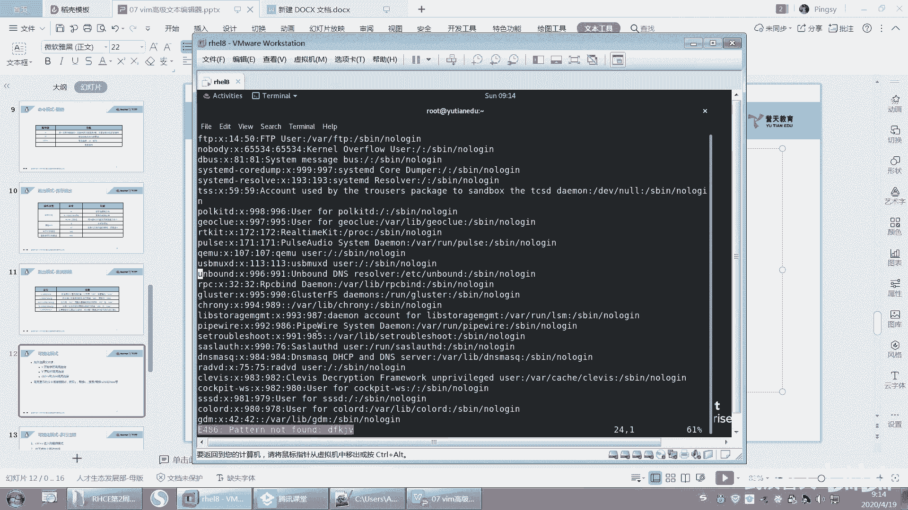

本节课中我们一起学习了vim的查找替换功能，掌握了使用 `:s` 命令及其修饰符（g, i, c）进行精确文本替换的方法。我们还初步了解了可视化模式（按 `v` 键进入），它提供了更灵活的文本选择方式。熟练掌握这些技巧将使你在vim中的编辑工作更加高效。