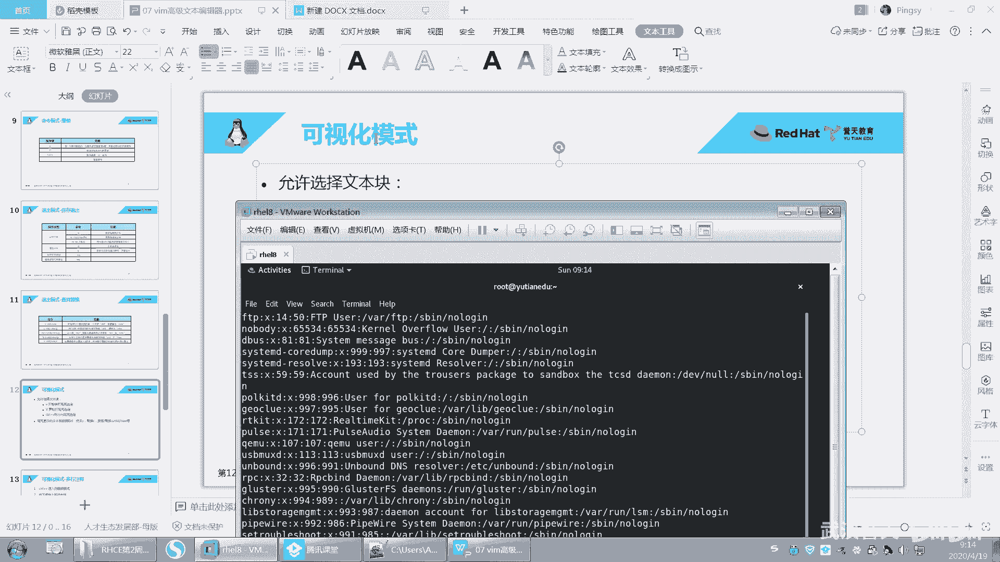
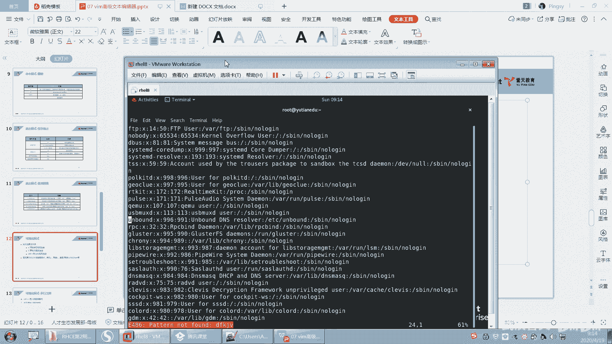
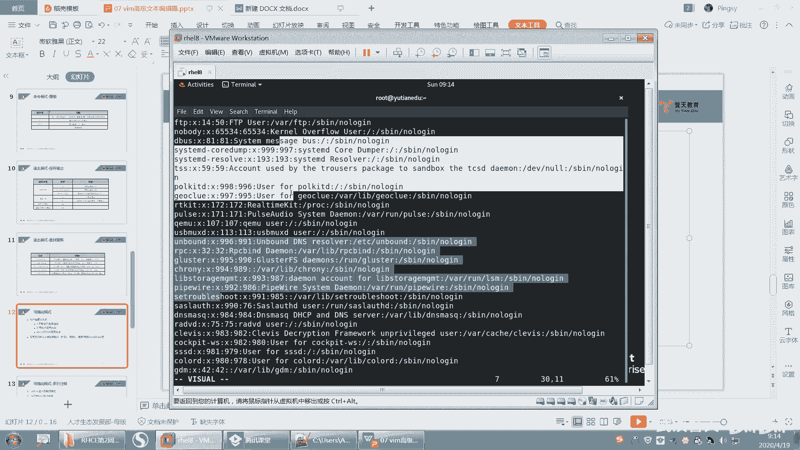
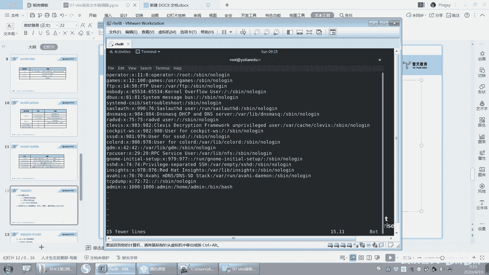
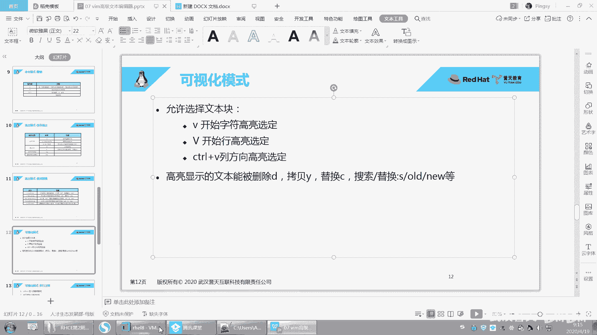
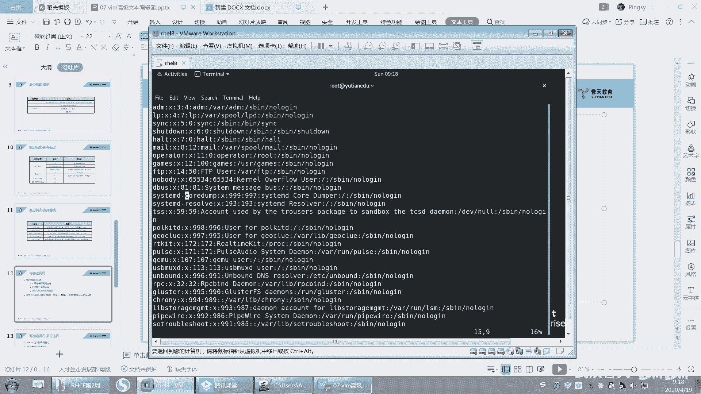
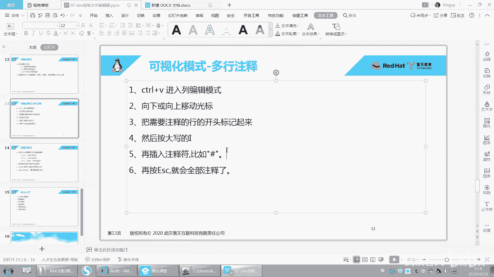
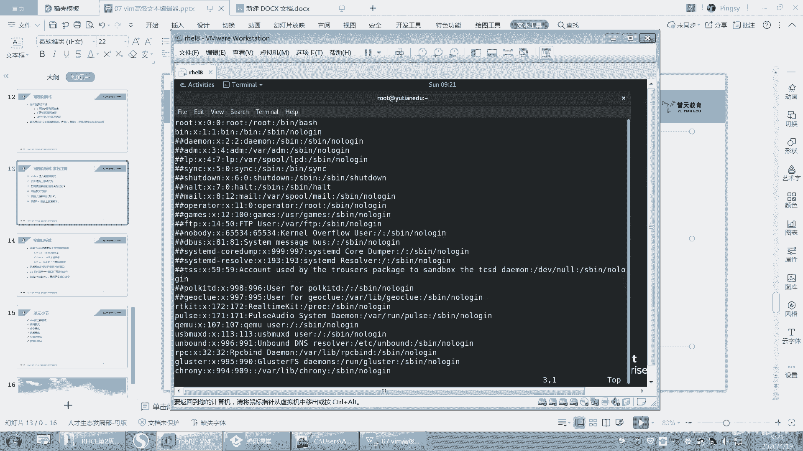
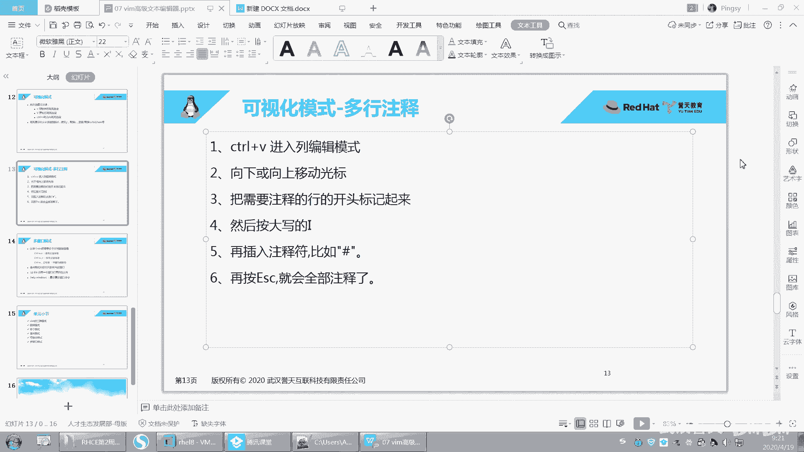

# 誉天红帽RHCE 8.0系列培训：P31：vim的高级使用2-31

## 概述
在本节课中，我们将学习vim编辑器的可视化模式。可视化模式允许我们以更直观的方式选择文本块，并对其进行批量操作，例如删除、复制、替换或添加注释。掌握这些技巧将极大提升文本编辑的效率。

## 可视化模式介绍
上一节我们介绍了vim的基本操作，本节中我们来看看vim的可视化模式。可视化模式提供了一种通过高亮显示来直观选择文本的方法，之后可以对选中的文本执行各种命令。

### 字符可视化模式 (小v)
字符可视化模式用于选择连续的字符区域。

操作方法是按下小写字母 `v`。进入此模式后，移动光标（上下左右键）即可高亮选择连续的字符区域。

选中文本区域后，可以执行多种操作。以下是可对选中文本执行的部分命令示例：
*   **删除**：按下 `d` 键，会剪切（删除）选中的文本。
*   **复制**：按下 `y` 键，会复制选中的文本。
*   **粘贴**：移动光标到目标位置，按下 `p` 键，即可粘贴之前复制或剪切的内容。
*   **查找替换**：在选中区域内，输入 `:s/原内容/新内容` 可以进行搜索替换。

操作完成后，可以按 `u` 键撤销上一次操作。

### 行可视化模式 (大V)
行可视化模式用于以整行为单位进行选择。

操作方法是按下大写字母 `V`（即 `Shift + v`）。进入此模式后，移动光标（上下键）即可高亮选择整行。

选中行区域后，可执行的操作与字符可视化模式完全相同。例如，按下 `d` 删除选中行，按下 `y` 复制选中行，然后在目标位置按 `p` 粘贴。

### 列块可视化模式 (Ctrl+v)
列块可视化模式用于按列（垂直方向）选择文本块，这在处理对齐的文本（如注释符号）时非常有用。

操作方法是按下 `Ctrl + v`。进入此模式后，移动光标即可选择一个矩形文本块。

选中列块后，可执行的操作与前两种模式一致。例如，按下 `d` 会删除选中列块的所有内容。这个功能特别适用于快速删除或添加多行注释的引导符（如 `#`）。

## 实用案例：批量添加注释
在编写脚本或配置文件时，经常需要批量注释多行代码。下面我们学习如何使用列块可视化模式高效地完成这个任务。

以下是批量添加注释的具体步骤：
1.  将光标移动到要注释的第一行的行首。
2.  按下 `Ctrl + v` 进入列块可视化模式。
3.  使用方向键向下移动光标，选中需要注释的所有行。
4.  按下大写字母 `I`（即 `Shift + i`）进入插入模式。此时光标会跳回选中区域的第一行行首。
5.  输入注释符号，例如 `#`。
6.  按下 `Esc` 键。此时，所有选中行的行首都会自动添加刚才输入的注释符号。

同理，若要批量取消注释，可以先用 `Ctrl + v` 垂直选中注释符号所在的列，然后按下 `d` 键即可一次性删除。

## 总结
本节课中我们一起学习了vim编辑器的三种可视化模式：字符模式(`v`)、行模式(`V`)和列块模式(`Ctrl+v`)。这些模式让我们能够灵活地选择不同形状的文本区域，并执行统一的编辑命令。我们还通过“批量添加注释”的案例，实践了列块模式的高效用法。熟练掌握可视化模式，是成为vim高效用户的关键一步。