**Linux文本编辑：P32：vim的高级使用2-32**

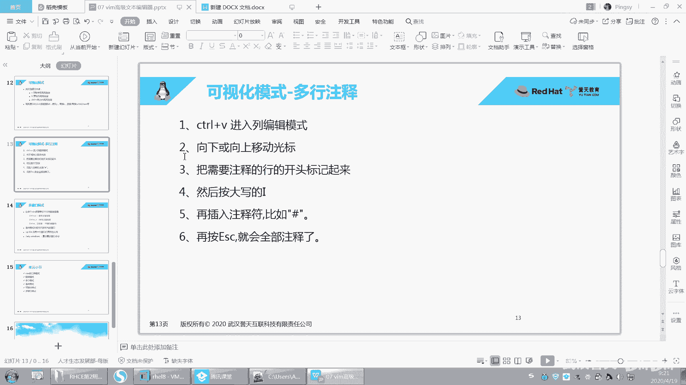

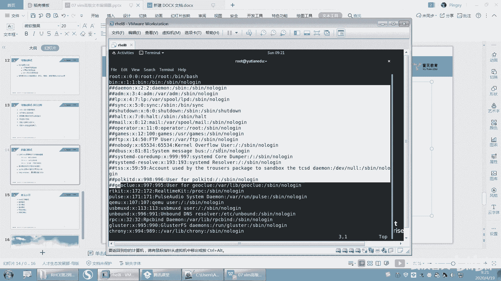

在本节课中，我们将学习vim编辑器的多窗口模式。上一节我们介绍了可视化模式，本节中我们来看看如何在vim中同时打开和编辑多个窗口，以提高工作效率。

多窗口模式允许你在一个vim界面中同时打开多个编辑区域。这些窗口可以显示同一个文件的不同部分，也可以显示不同的文件，方便进行对照编辑。

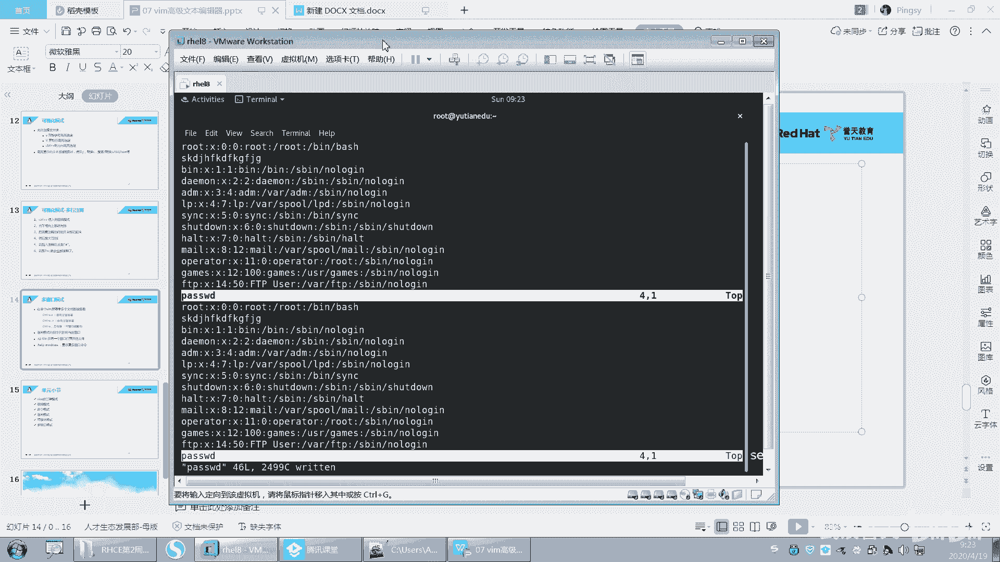

以下是开启多窗口的基本操作：

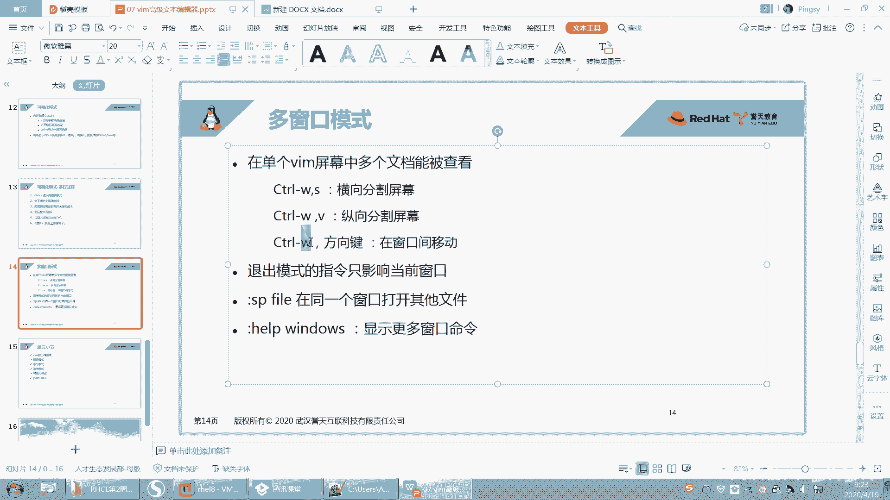

*   **垂直分割窗口**：在命令模式下，按下 `Ctrl+w`，然后按 `v`。这会将当前窗口在垂直方向上一分为二。
*   **水平分割窗口**：在命令模式下，按下 `Ctrl+w`，然后按 `s`。这会将当前窗口在水平方向上一分为二。

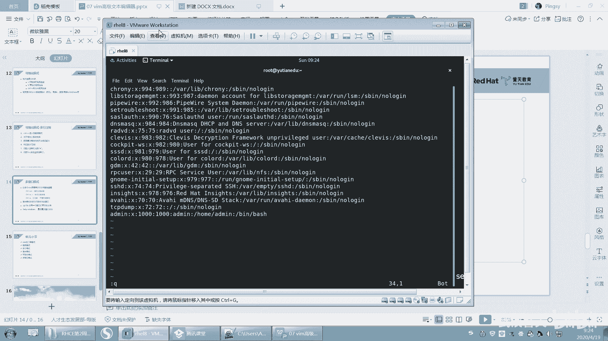

窗口被分割后，你可以在它们之间自由切换。

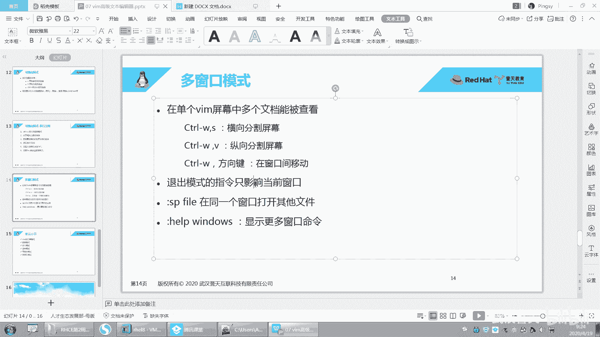

以下是在多个窗口间移动光标的操作：

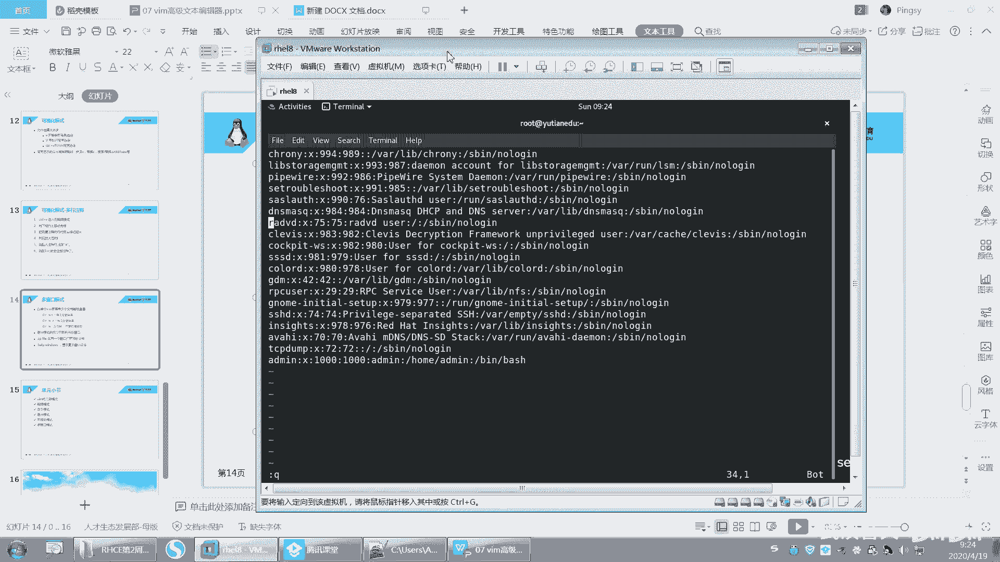

*   按下 `Ctrl+w`，然后按方向键（`h`, `j`, `k`, `l` 或 上下左右箭头）即可将光标移动到对应的窗口。

每个窗口都是独立的编辑区域。你的操作（如输入、删除、保存）只对光标当前所在的窗口生效。

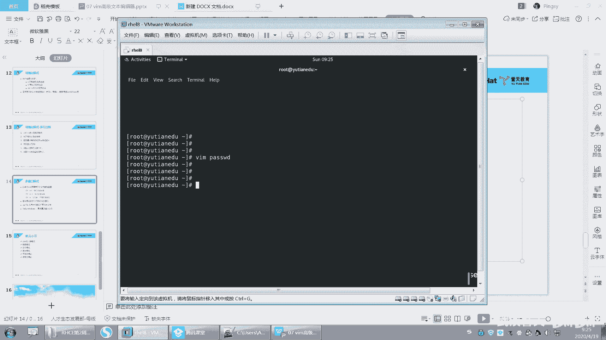

例如，要关闭当前光标所在的窗口，只需在该窗口中输入 `:q` 命令即可。

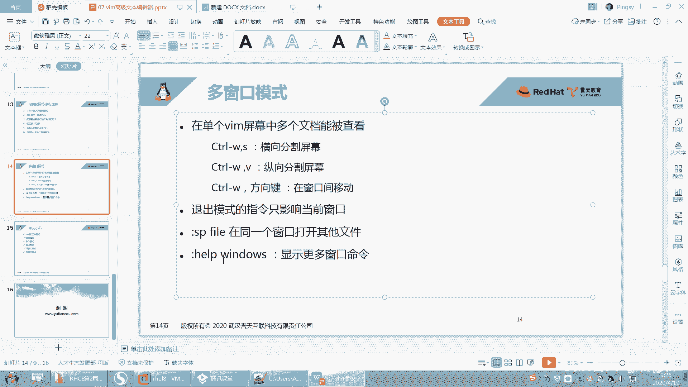

除了分割当前文件的窗口，你还可以在新窗口中直接打开另一个文件。

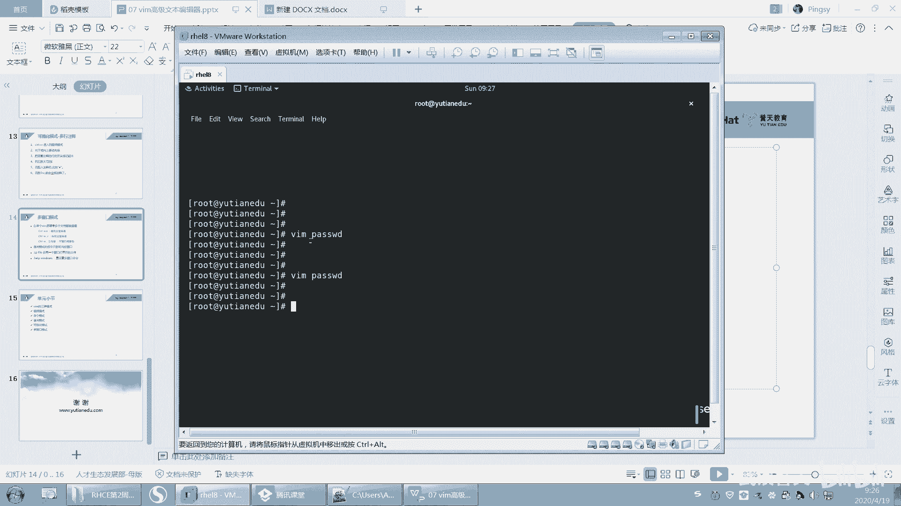

操作方法是：在命令模式下输入 `:sp 文件名`（例如 `:sp /etc/profile`），然后按回车。这会在当前窗口下方水平分割出一个新窗口，并在其中打开指定的文件。

如果你想查看更多关于多窗口操作的详细帮助，可以在命令模式下输入 `:help windows` 来查阅vim的内置文档。vim的功能非常丰富，例如设置Tab键的缩进空格数、语法高亮、默认显示行号等，都可以通过查阅帮助或配置文件进行自定义。

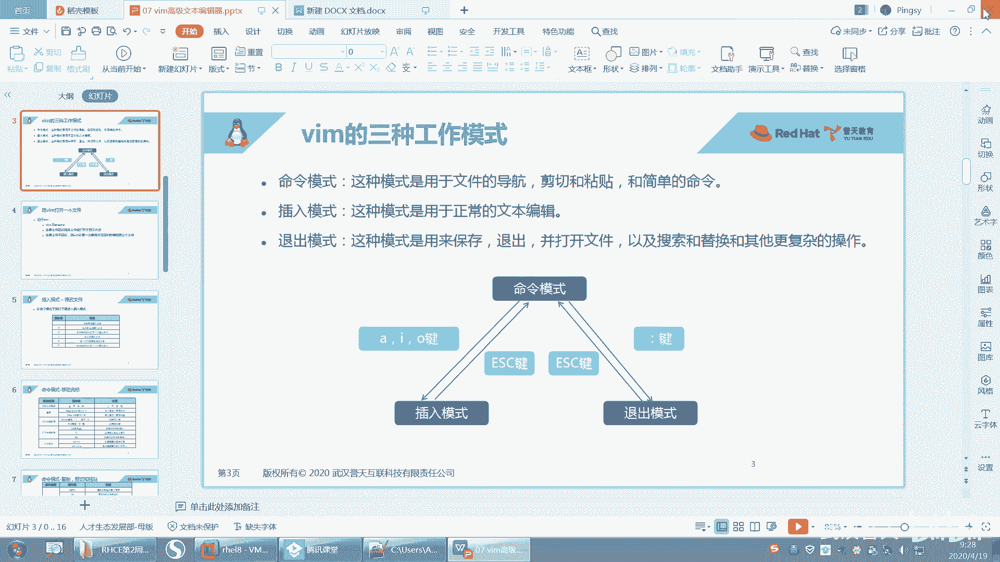

本节课中我们一起学习了vim的多窗口模式。我们回顾了vim的五种主要模式：命令模式、编辑模式、退出模式、可视化模式以及本节重点讲解的多窗口模式。掌握在这些模式下的常用操作，并通过练习熟练运用，将极大提升你在Linux环境下的文本编辑效率。vim的功能远不止于此，鼓励大家在掌握基础后，通过 `:help` 命令继续探索更多高级特性。