# Linux文本处理：P39：sed高级替换与地址定界

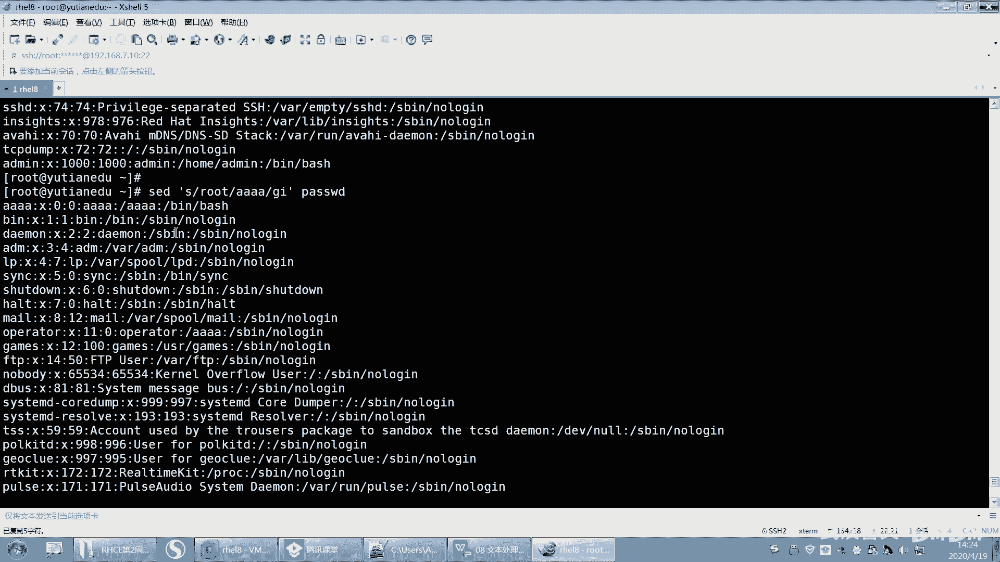

## 概述
在本节课中，我们将深入学习 `sed` 命令的高级功能，特别是查找替换操作的更多选项、地址定界的详细规则，以及如何利用替换技巧实现删除特定内容等高级操作。我们将通过具体的例子，帮助你掌握这些核心概念。

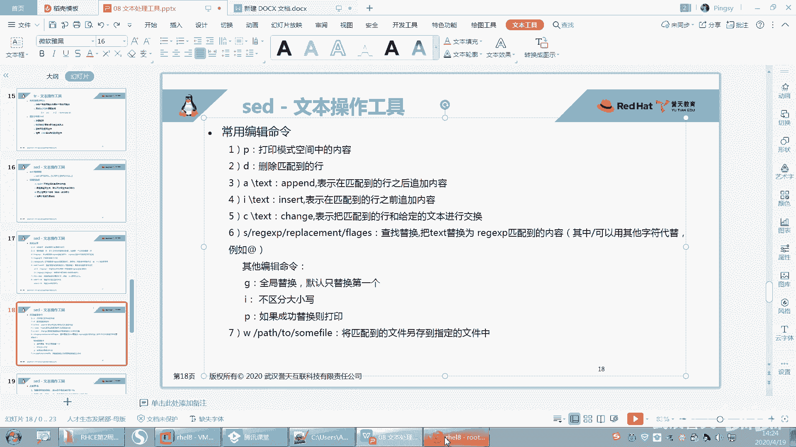

---

## sed替换命令的修饰符

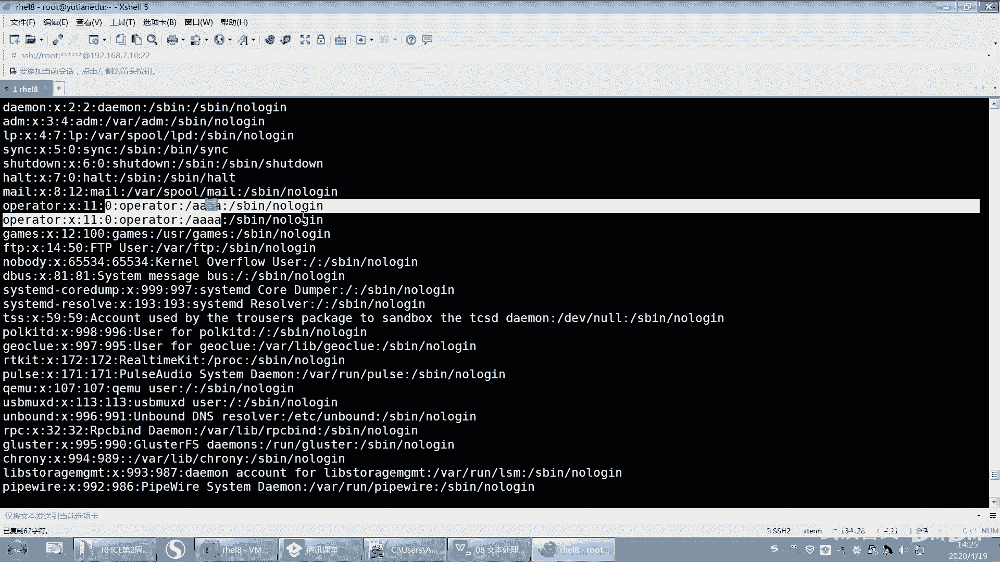

上一节我们介绍了 `sed` 的基本替换语法 `s/pattern/replacement/`。本节中我们来看看替换命令可以搭配哪些修饰符，以实现更精确的控制。

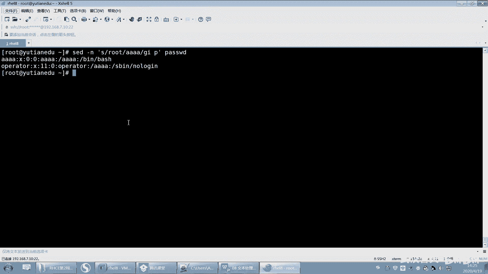

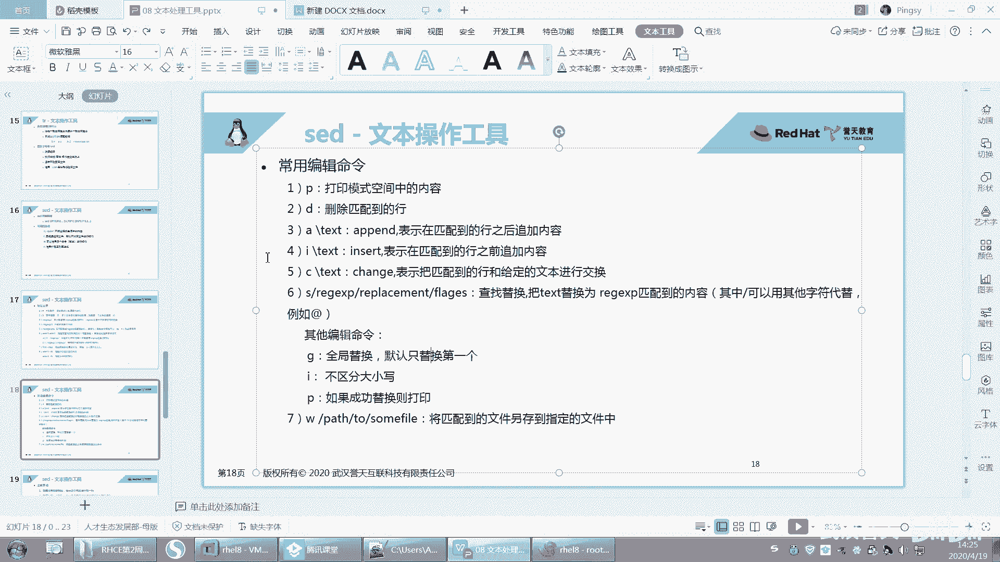

以下是 `sed` 替换命令的常用修饰符：

*   **g**：全局替换。默认只替换每行中第一个匹配项，使用 `g` 则替换该行所有匹配项。
    *   **示例**：`sed 's/old/new/g' file.txt`
*   **i** 或 **I**：忽略大小写进行匹配。
    *   **示例**：`sed 's/old/new/i' file.txt`
*   **p**：打印被替换的行。通常与 `-n` 选项一起使用，只输出发生替换的行。
    *   **示例**：`sed -n 's/old/new/p' file.txt`
*   **w**：将匹配并替换后的行写入指定文件。
    *   **示例**：`sed 's/old/new/w output.txt' file.txt`

> **注意**：使用 `p` 修饰符时，通常需要配合 `-n` 选项。如果不加 `-n`，`sed` 会先输出模式空间的所有内容（默认行为），然后再输出一次被 `p` 标记的行，导致匹配行被打印两次。

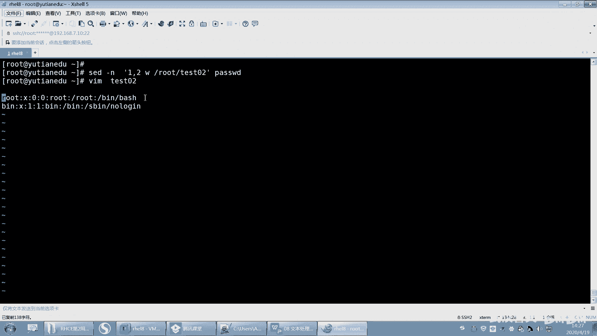

---

## sed命令的地址定界

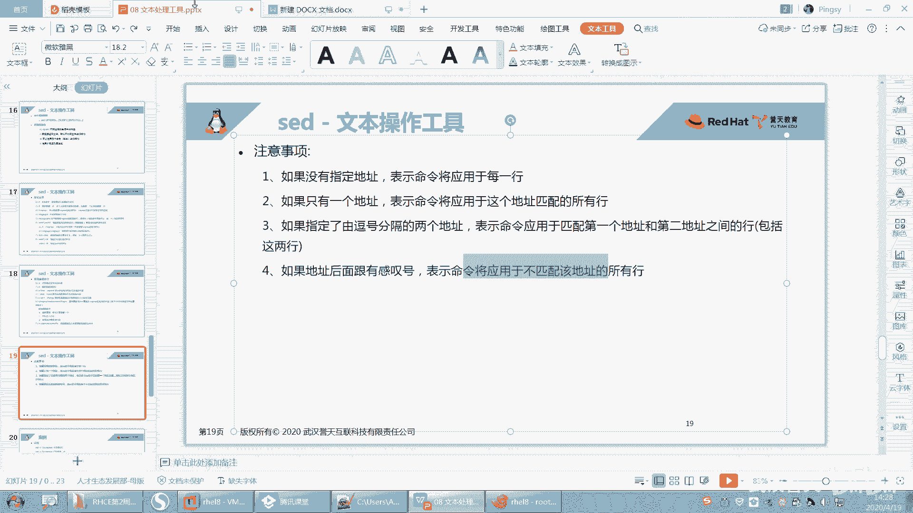

我们已经知道 `sed` 命令可以作用于指定的行。现在，我们来系统性地学习地址定界的规则，它决定了命令在哪些行上生效。

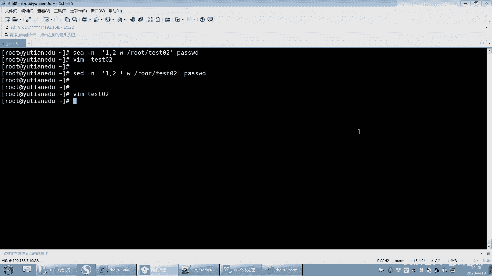

以下是地址定界的主要规则：

*   如果没有指定地址，命令将应用于输入文件的**每一行**。
*   如果指定一个地址（数字或模式），命令只应用于**匹配该地址的行**。
*   如果指定两个由逗号分隔的地址，命令将应用于从**第一个地址匹配的行到第二个地址匹配的行**（包括首尾行）。
*   在地址后添加感叹号 `!`，表示命令应用于**不匹配该地址的所有行**（即反选）。

> **示例**：`sed -n '1,2!w test.txt' file.txt` 这个命令会将除了第1行和第2行之外的所有行，写入 `test.txt` 文件。

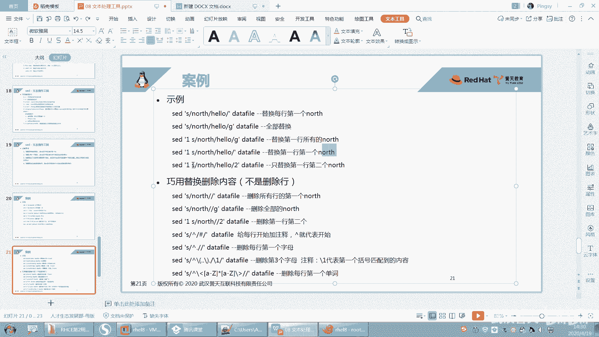

---

## 高级替换技巧与应用

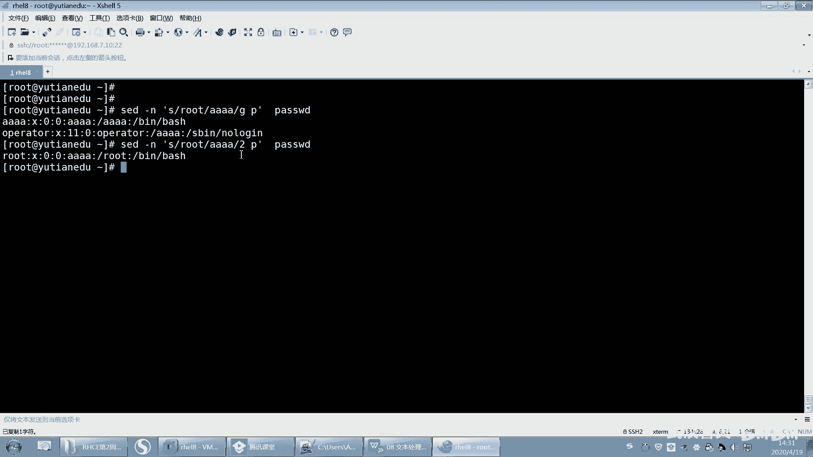

掌握了地址定界和修饰符后，我们可以利用 `sed` 的替换功能实现一些更巧妙的操作，而不仅仅是简单的文本替换。

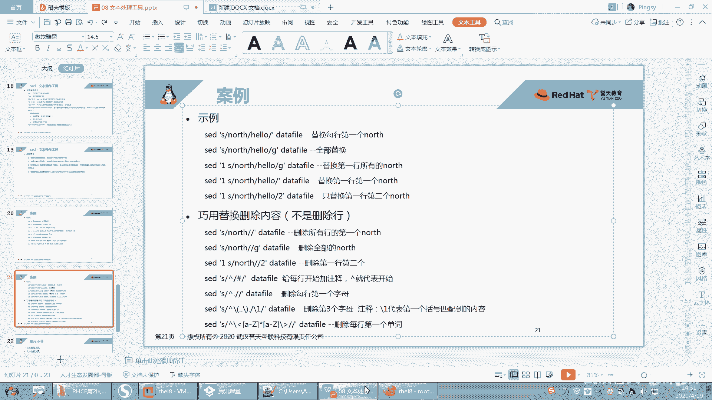

### 1. 精确控制替换位置
在替换命令中，可以在修饰符位置指定一个数字，表示只替换该行中第 N 个匹配项。
*   **示例**：`sed -n 's/root/AAAA/2p' /etc/passwd` 此命令会查找包含 `root` 的行，并仅将该行中**第二个** `root` 替换为 `AAAA`，然后打印出来。

### 2. 利用替换实现“删除”
`s` 命令的替换部分可以留空，这相当于将匹配到的模式“删除”。这比 `d` 命令（删除整行）更加精细。

以下是几个经典案例：

*   **删除行首字符**：使用 `^` 匹配行首。
    *   **示例**：`sed -n 's/^./p' file.txt` 这个命令会删除每一行的第一个字符（`.` 匹配任意单个字符）并打印结果。
*   **为行首添加注释**：在行首插入 `#`。
    *   **示例**：`sed 's/^/#/' file.txt` 这个命令会在每一行的开头加上 `#` 符号。
*   **删除特定字符**：例如，删除 `df -h` 输出中利用率后面的 `%` 符号。
    *   **示例**：`df -h | sed 's/%//'` 这个命令会删除输出中所有的 `%` 字符。

> **对比**：用 `cut` 命令也可以实现类似删除 `%` 的效果：`df -h | cut -d‘%’ -f1`。但 `sed` 的方案在某些复杂场景下更灵活。

---

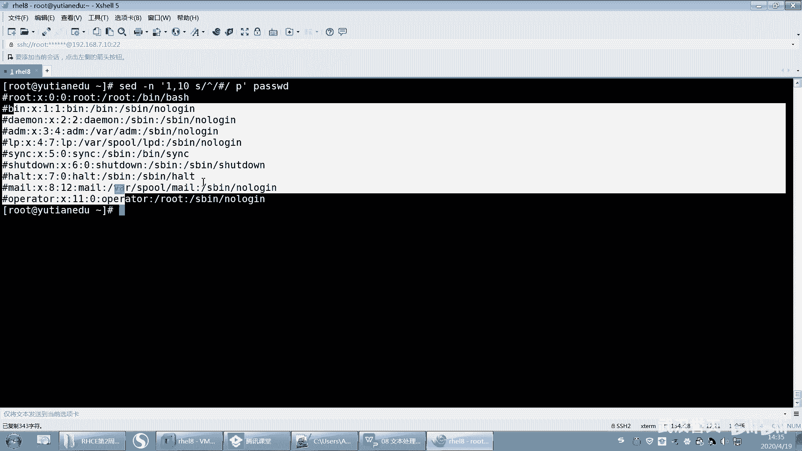

## 总结
本节课我们一起学习了 `sed` 命令的高级应用。我们详细探讨了替换命令的修饰符（`g`, `i`, `p`, `w`），明确了地址定界的完整规则，并掌握了如何利用替换功能实现精确的文本“删除”和修改。通过将 `^`（行首锚点）等正则表达式与替换结合，`sed` 能够高效地处理许多复杂的文本编辑任务。