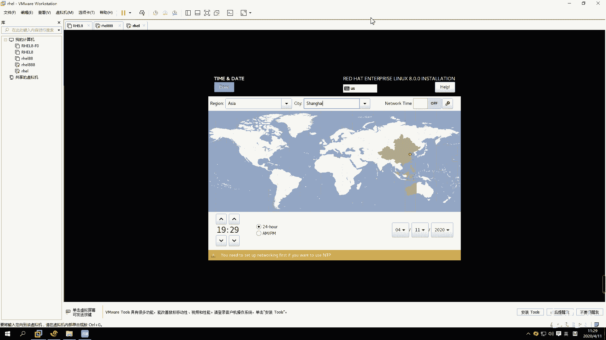
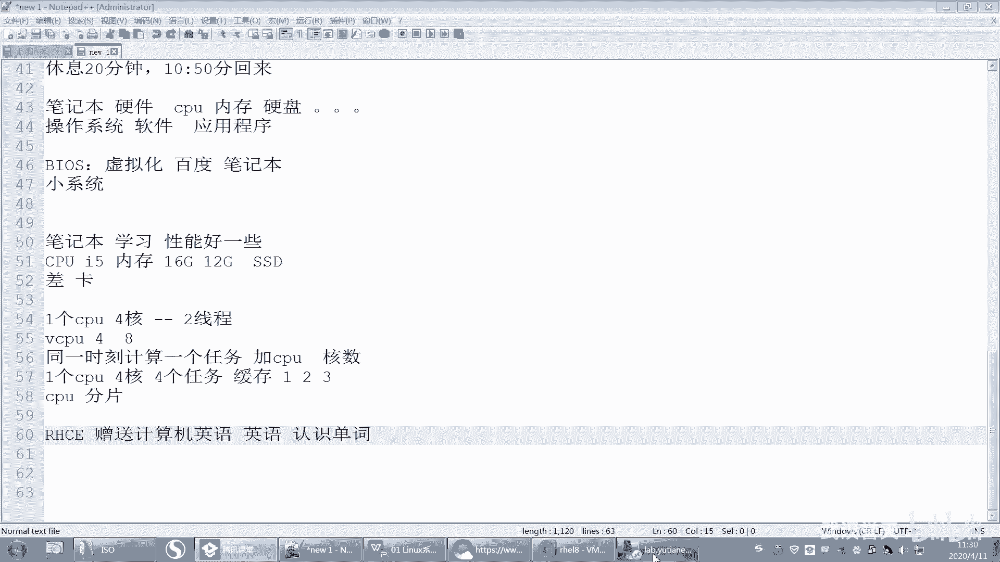
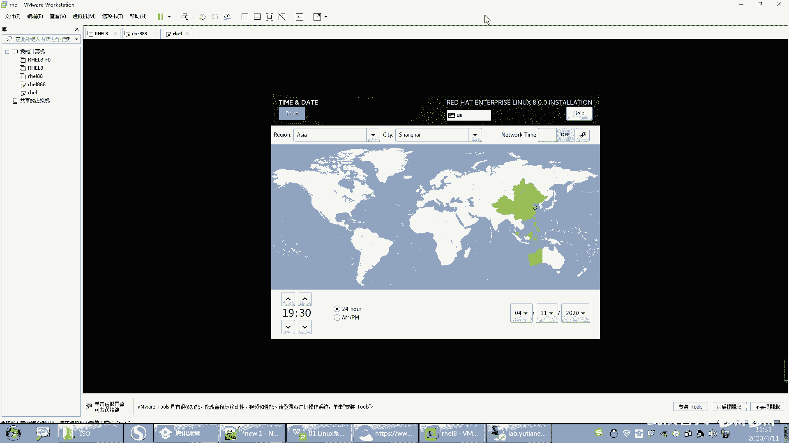
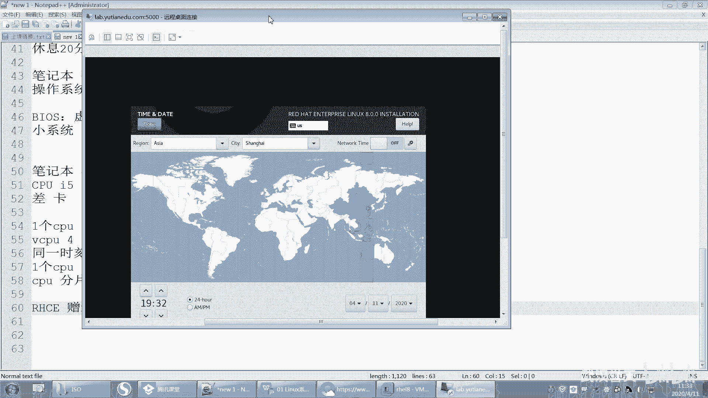
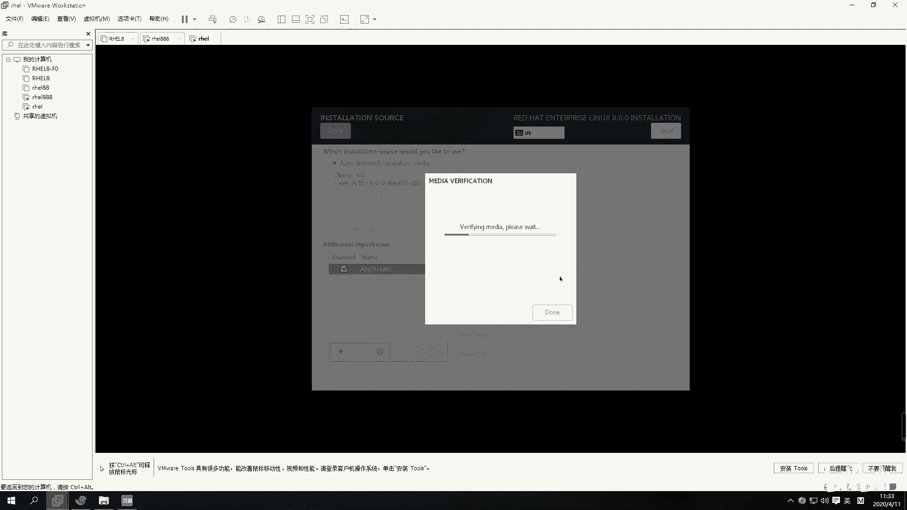
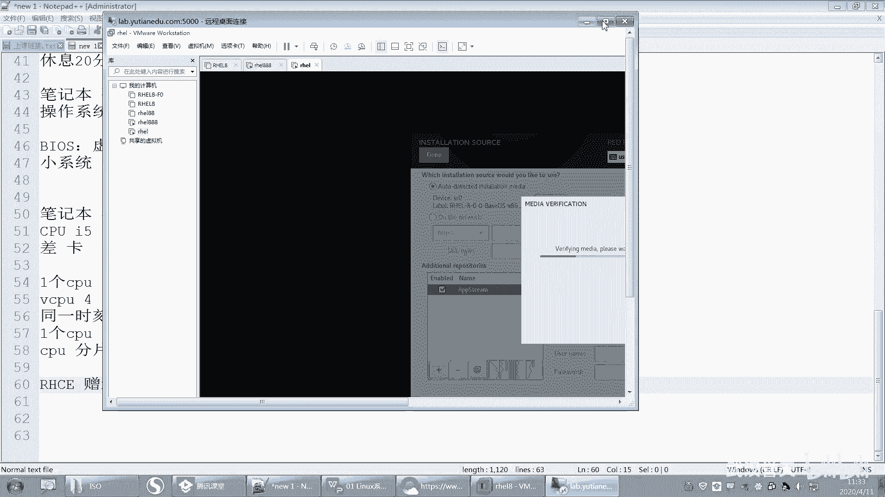
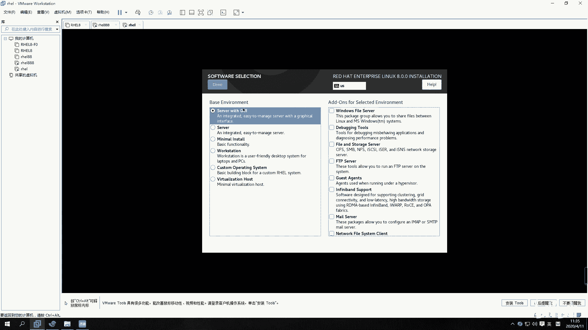
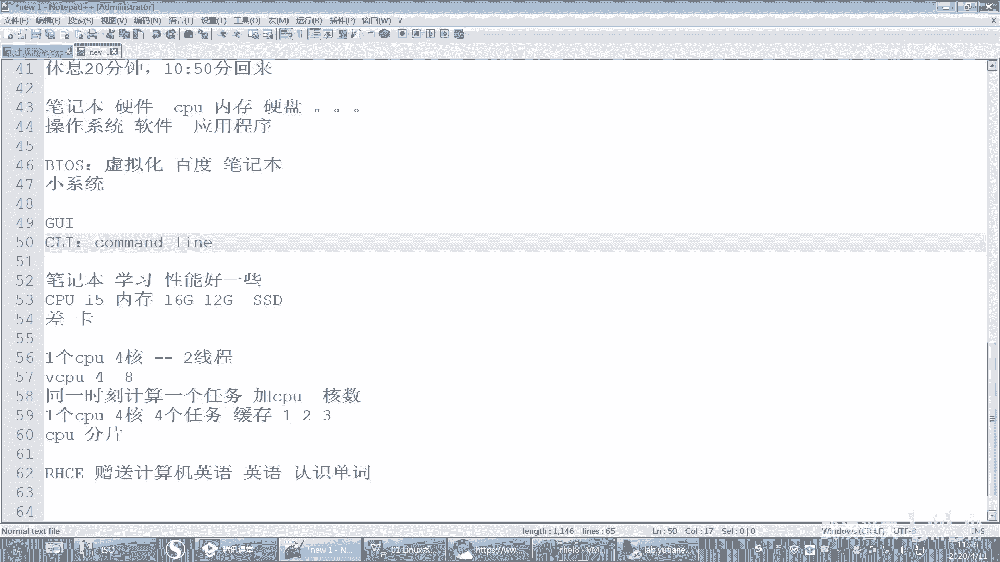
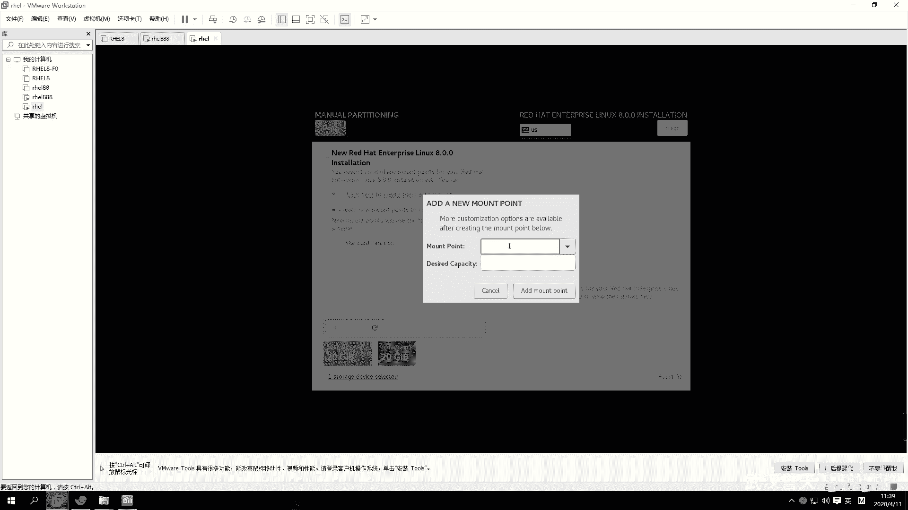
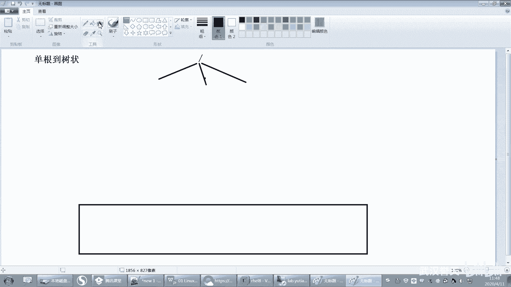

# 誉天红帽RHCE 8.0系列培训：P3：rhel8.0系统安装-03 🖥️

在本节课中，我们将继续学习RHEL 8.0的系统安装过程，重点讲解安装过程中的语言、时区、软件选择以及磁盘分区等关键配置。我们将以简单直白的方式，帮助初学者理解这些概念和操作步骤。

## 语言与键盘设置 🌐

上一节我们介绍了安装程序的初始界面，本节中我们来看看语言和键盘的设置。

具体选择什么语言，在开机之后还会让你去选择。这里我们选择语言。然后下面是日期和时间设置。

## 日期与时间设置 ⏰

日期和时间设置中，我们选择时区。这里我们选择“亚洲/上海”。计算机的时间一般很少听说北京时间，通常是上海时间、新疆乌鲁木齐时间、重庆时间等等。所以这是我们的时间设置。

时区划分基于地理知识。全球被分成了24个时区，因为一天是24小时，每个时区代表一个小时。中国位于东八区。

每隔一个时区就相差一个小时。我们后面会遇到一个叫UTC的时间。UTC时间与我们本地时间（如上海时间）一般相差8个小时。UTC是世界协调时间，位于本初子午线附近的格林威治时间。如果那个时间是0点，我们就是早上8点，我们比较快8个小时。

有些时候我们需要选择UTC时间，而不是本地时间。这取决于服务器是否跨国。一般跨国服务器都要使用UTC统一协调时间，否则如果大家都用本地时间，在传输数据时若时间作为参数，可能因时间不一致导致失败。后面讲解时间服务时还会再提到。

确认时区选择后，你可以看到当前时间。

## 安装源与软件选择 📦

接下来是安装源和软件选择。安装源自动检测到了我们的ISO镜像文件。

安装源下方有一个“网络”选项，这意味着可以从网络安装，即把安装源的网络地址写在这个地方。像之前在教室里面，我们就让大家从网络安装，安装源就在网络里，通过网络形式去安装。其实就是ISO文件在网络中。这里我们使用默认设置即可。

下面是软件选择。在这个地方你可以选择安装什么样的软件，但它不是一个个软件去选择，而是进行了归类。

以下是常见的安装选项：
*   **带GUI的服务器**：安装带有图形用户界面的服务器系统。GUI代表图形用户接口。
*   **最小安装**：只安装最基本的功能包。安装出来系统比较小、快，但很多功能没有，且只有字符界面（命令行界面），没有图形界面。

对于第一次学习，我们建议安装带有图形界面的系统，即第一个选项“带GUI的服务器”。命令行界面常被称为CLI（命令行接口）。

右边还有一些额外的附加选项，例如文件服务器、FTP服务器等。这些都不需要勾选。如果勾选了，安装时会额外安装很多软件包，导致安装非常慢。如果需要这些功能，可以在系统安装好之后再单独安装。默认选择第一个选项即可。

## 系统安装目的地与分区 🗂️

右边“系统”部分有一个“安装目的地”，点击进入后需要进行磁盘分区。如果你装过Windows，应该知道分区，例如把C盘分多大，D盘分多大。

如果你有多块磁盘，可以选择其中一块勾选，系统将安装在这块20G的磁盘上。下方是存储配置，如果你要添加新磁盘，可以在这里操作。

分区配置可以选择自动或手动。我们选择手动安装，点击“自定义”。然后点击“完成”进入手动分区界面。

分区界面有加号和减号，加号是添加一个新分区，减号是删除一个分区。

分区的类型默认是LVM（逻辑卷管理）。我们先不选逻辑卷，后面会专门讲解。你先选择“标准分区”，然后点击加号添加一个新的分区。

添加分区时需要设置“挂载点”。这涉及到Linux的文件系统结构，后面会有专门章节讲解，这里先简单了解一下。

### 理解分区与文件系统

假设我们有一块磁盘。这块磁盘可以分区，也可以不分区。在Windows中，分区后会有C盘、D盘、E盘等。每个分区都需要格式化后才能存储文件。格式化后就可以存放文件了。

在Windows中：
*   **C、D、E**：这些被称为“驱动器号”或“盘符”。
*   **卷标**：可以重命名，例如“本地磁盘”。
*   **访问方式**：我们通过盘符（如C:）进入分区访问数据。如果一个U盘插入后没有分配盘符，就无法访问其中的数据。

Windows的目录结构是“多根倒树状结构”。例如，C盘是一棵倒置的树，根是C:，下面有各种目录和文件。D盘是另一棵独立的树，根是D:。C盘和D盘的目录结构是分开的，没有交叉（不考虑快捷方式这种特殊文件）。每棵树的数据都存放在对应的分区上。

Linux的目录结构与Windows区别很大。Linux是“单根倒树状结构”，只有一棵树。这棵树的根就是 `/`（一个斜杠）。根目录下面有子目录，子目录下还有子目录，形成一个庞大的目录树。

在Linux中，我们通过将不同的分区“挂载”到这棵树的某个目录（挂载点）上来使用它们。例如，我们可以将一个分区挂载到 `/home` 目录，那么所有 `/home` 下的文件就实际存储在那个分区上。这样，多个分区可以共同组成一棵完整的目录树，这与Windows每个分区独立一棵树的方式不同。

本节课中我们一起学习了RHEL 8.0安装过程中的语言时区设置、软件包选择以及磁盘分区的基本概念。我们对比了Windows和Linux在文件系统结构上的根本区别，为后续的实际分区操作打下了基础。下一节，我们将开始进行实际的手动分区配置。