# Linux文本处理：P40：SED高级替换与删除技巧 🧑‍💻

在本节课中，我们将深入学习SED文本处理工具的高级功能，特别是如何利用查找替换功能实现复杂的删除和修改操作。我们将通过具体的例子，理解如何匹配特定位置的字符或单词，并使用正则表达式和反向引用来精确地操作文本。

---

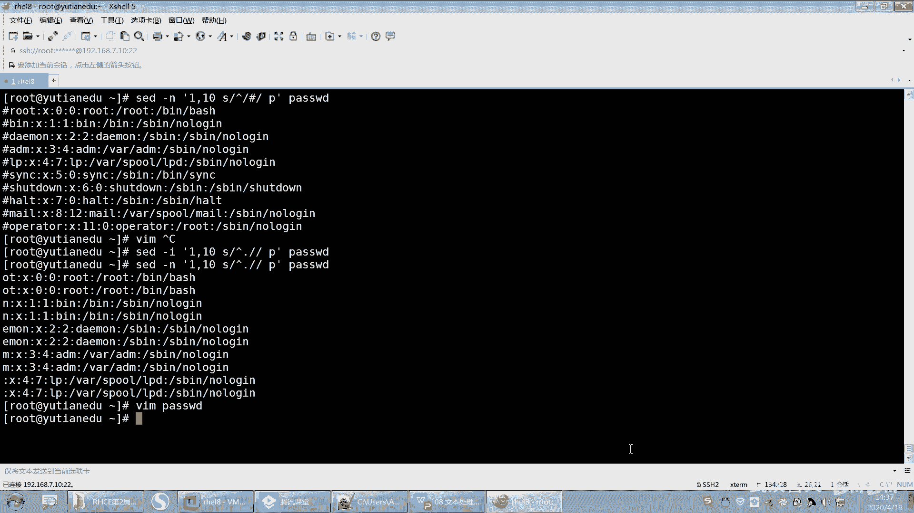

上一节我们介绍了SED的基本替换操作，本节中我们来看看如何利用替换功能实现删除效果。

## 删除每行的第一个字符

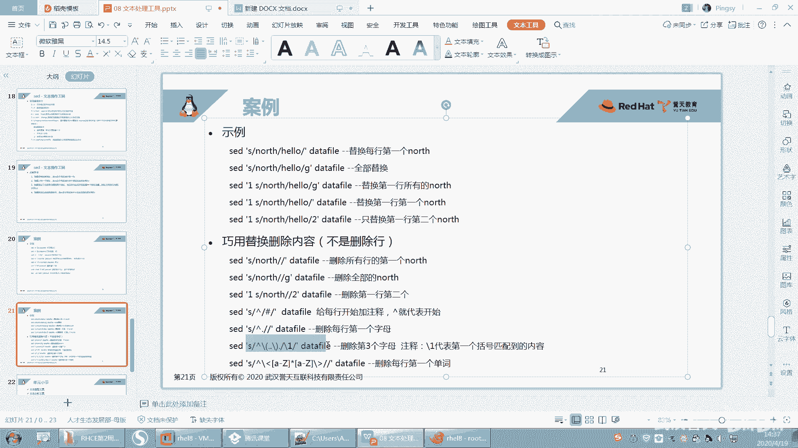

删除每行第一个字符的核心思路是：匹配第一个字符并将其替换为空。在正则表达式中，点号`.`可以匹配任意单个字符。

**操作命令如下：**
```bash
sed 's/^.//' filename
```
*   `^` 匹配行首。
*   `.` 匹配行首的第一个任意字符。
*   替换部分为空，即删除。

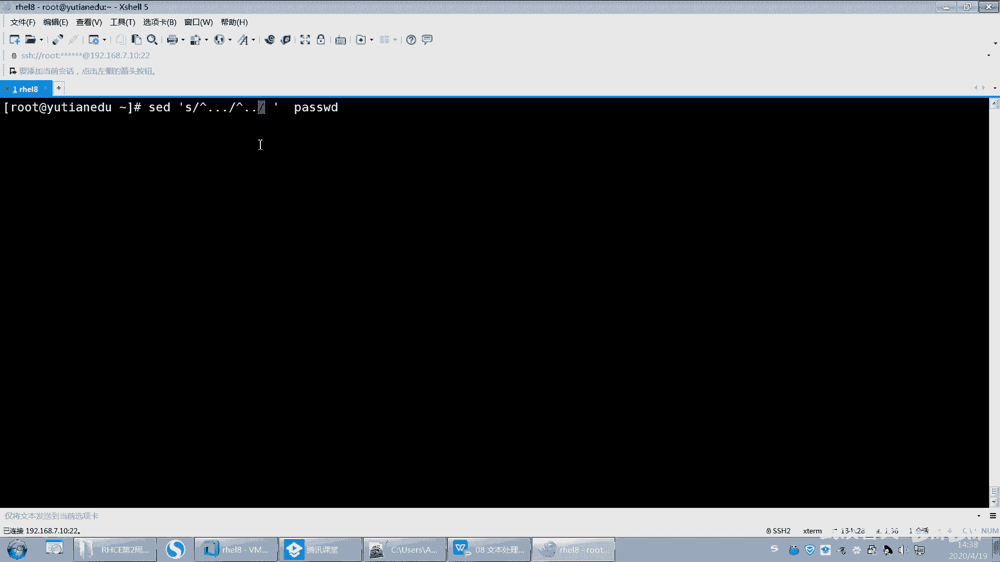

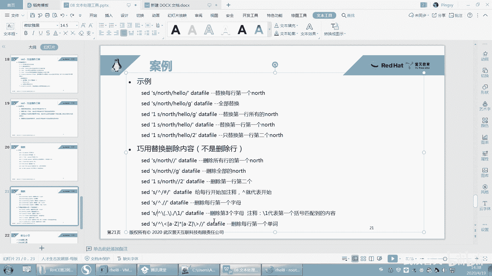

如果需要直接修改原文件，可以加上 `-i` 选项。


---

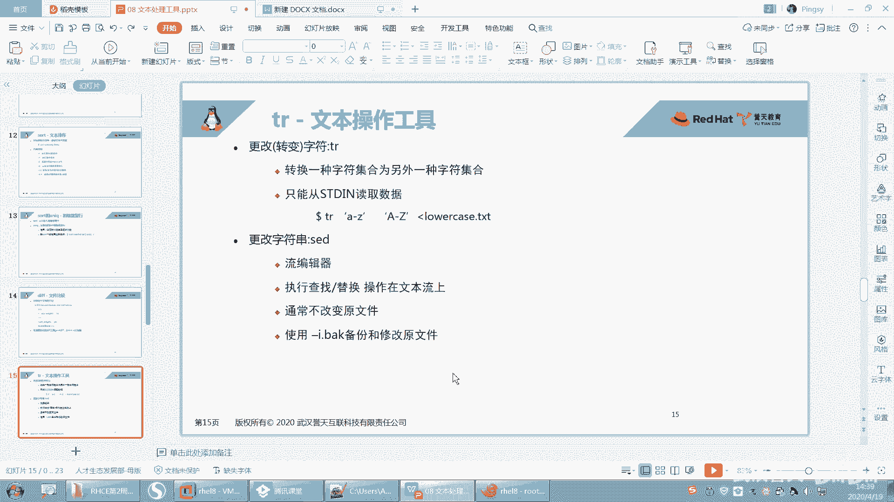

## 删除每行的第三个字符

删除每行第三个字符的思路是：匹配前三个字符，但只保留前两个。这需要用到**分组**和**反向引用**。

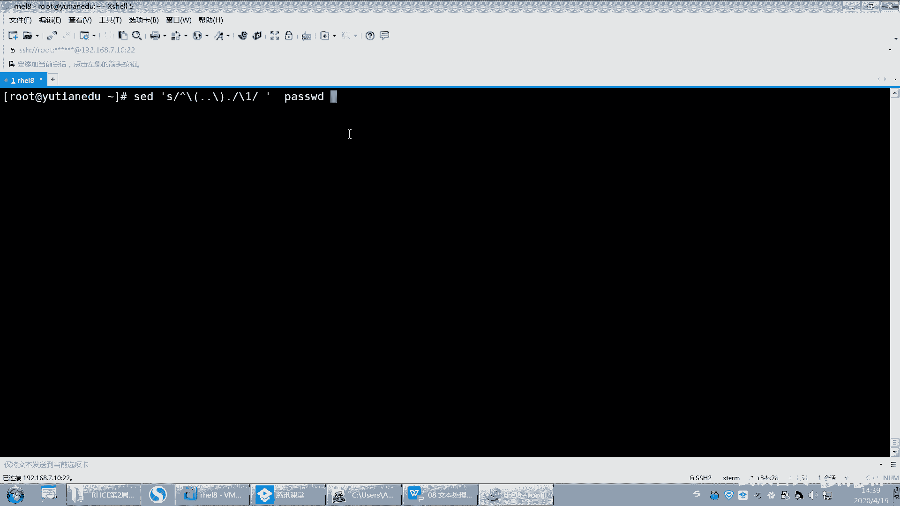

**操作命令如下：**
```bash
sed 's/^\(..\)./\1/' filename
```
*   `^` 匹配行首。
*   `\(..\)` 是一个分组，匹配并捕获前两个字符。
*   紧接着的`.`匹配第三个字符。
*   `\1` 是反向引用，指代第一个分组（即前两个字符）的内容。
*   最终效果是用前两个字符替换了前三个字符，从而删除了第三个字符。

---

## 删除每行的第一个单词

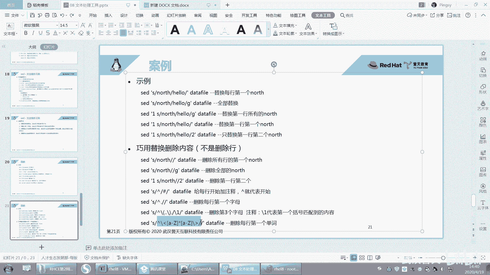

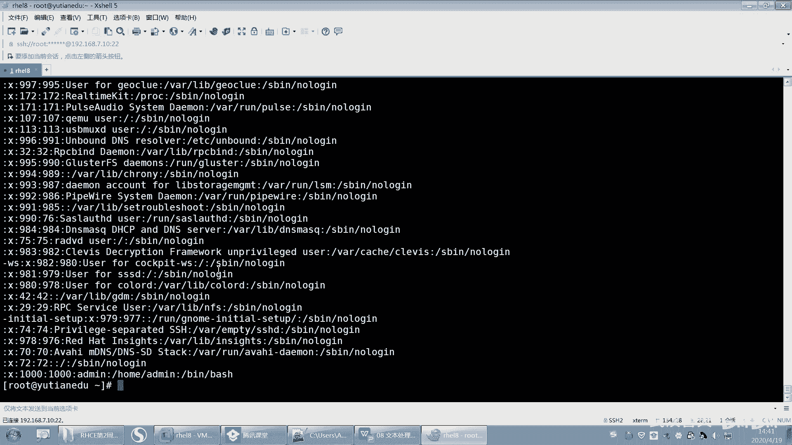

删除每行第一个单词需要匹配一个完整的单词。单词通常由字母组成，以单词边界界定。

**操作命令如下：**
```bash
sed 's/^[[:alpha:]]*[[:space:]]*//' filename
```
*   `^` 匹配行首。
*   `[[:alpha:]]*` 匹配0个或多个字母（即单词主体）。
*   `[[:space:]]*` 匹配0个或多个空白字符（如空格、制表符，即单词后的分隔符）。
*   将它们全部替换为空，即删除第一个单词及其后的空格。

一个更精确的写法是使用单词边界`\<`和`\>`：
```bash
sed 's/^\<[[:alpha:]]*\>//' filename
```

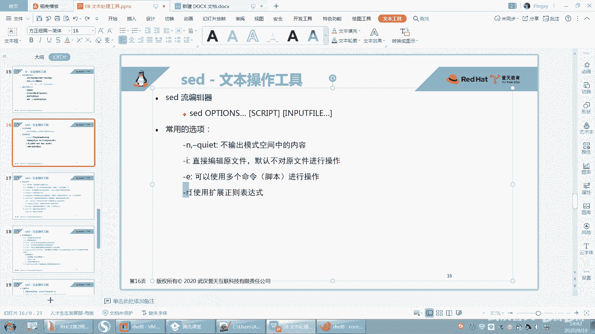

---

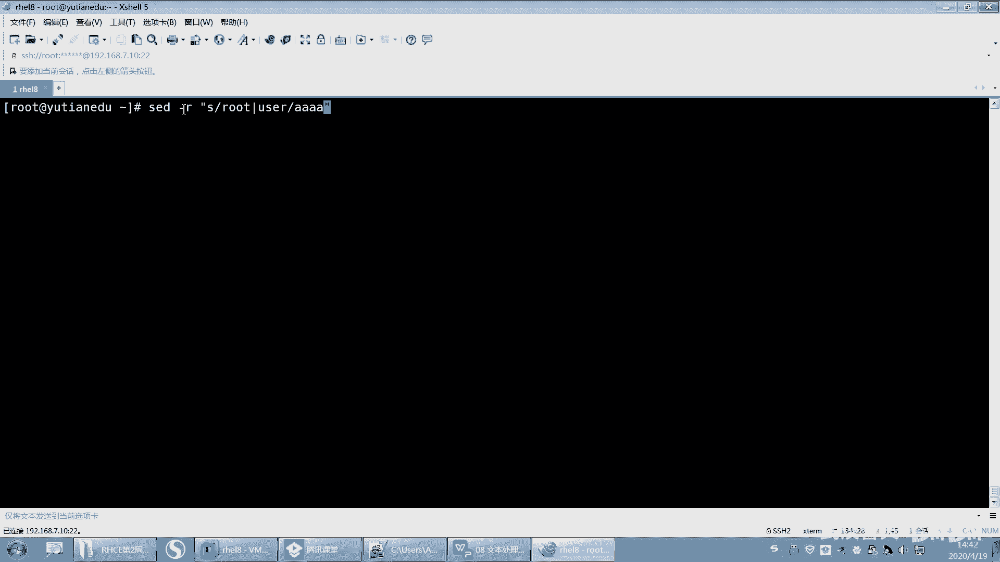

## 使用扩展正则表达式

当模式中需要使用`|`（或）、`+`（一次或多次）、`?`（零次或一次）等扩展元字符时，需要为SED命令添加`-r`选项（在某些版本中是`-E`）。

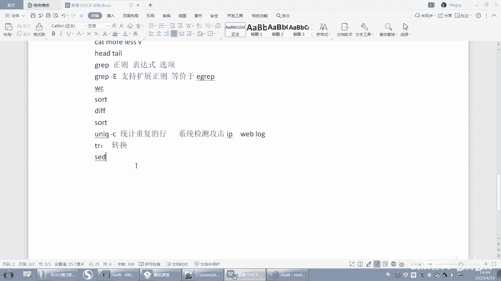

例如，将“root”或“user”替换为“admin”：
```bash
sed -r 's/(root|user)/admin/g' filename
```

---

## 总结与学习建议

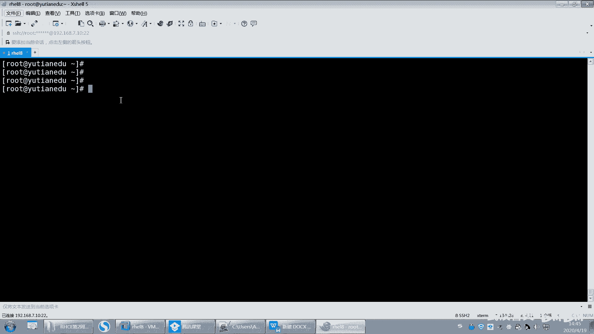

本节课中我们一起学习了SED工具的几个高级文本操作技巧：
1.  **删除行首字符**：通过`^`和`.`匹配并替换。
2.  **删除特定位置字符**：结合分组`\(\)`和反向引用`\1`实现精确操作。
3.  **删除行首单词**：利用字符类`[[:alpha:]]`和单词边界`\< \>`进行匹配。
4.  **启用扩展模式**：使用`-r`选项来支持更强大的扩展正则表达式。

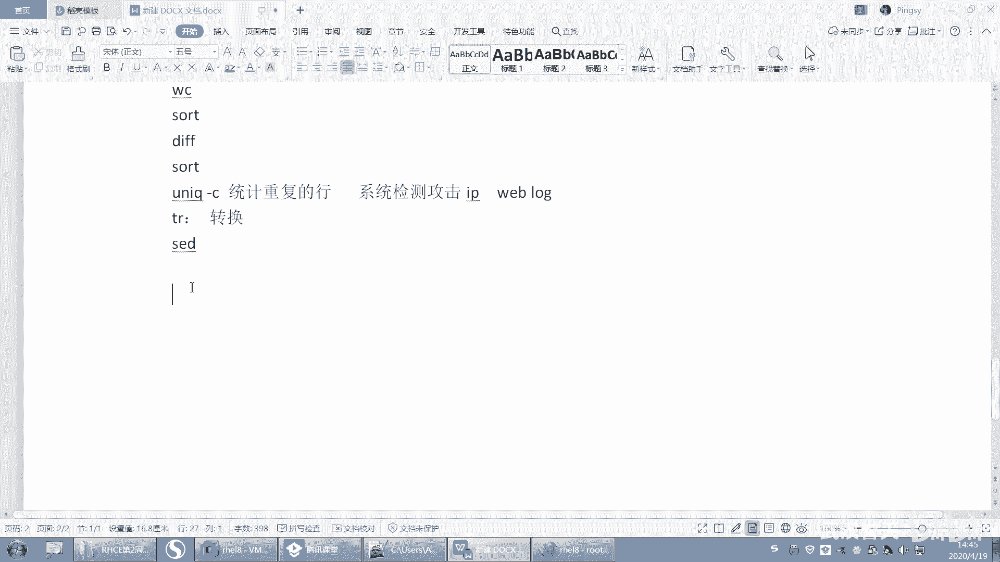

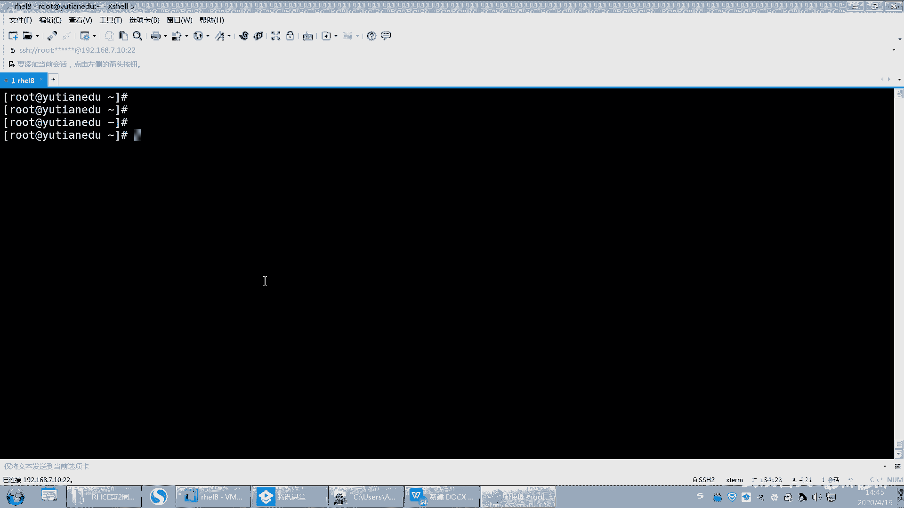

对于初学者，掌握这些例子的核心在于理解其背后的**正则表达式逻辑**，而非死记硬背命令。建议：
*   **理解原理**：明白每个元字符（如`^`, `.`, `*`, `\(\)`, `\1`）的作用。
*   **动手实践**：在测试文件上反复演练这些命令，观察输出变化。
*   **做好笔记**：将这些经典用例记录下来，在实际需要时可快速查阅参考。

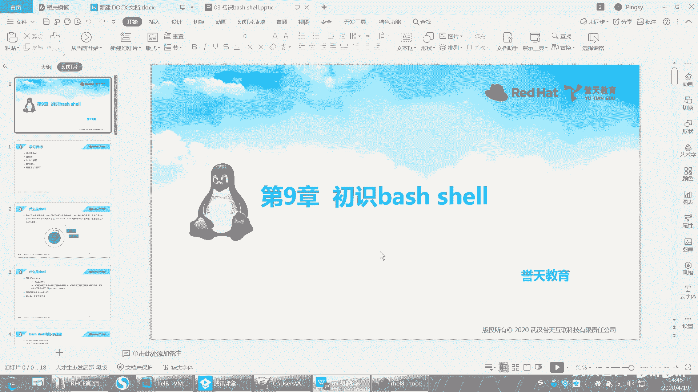

SED功能强大，本节所授仅为冰山一角，但已覆盖日常文本处理中的诸多实用场景。熟练运用这些技巧，将极大提升你在命令行下的文本处理效率。